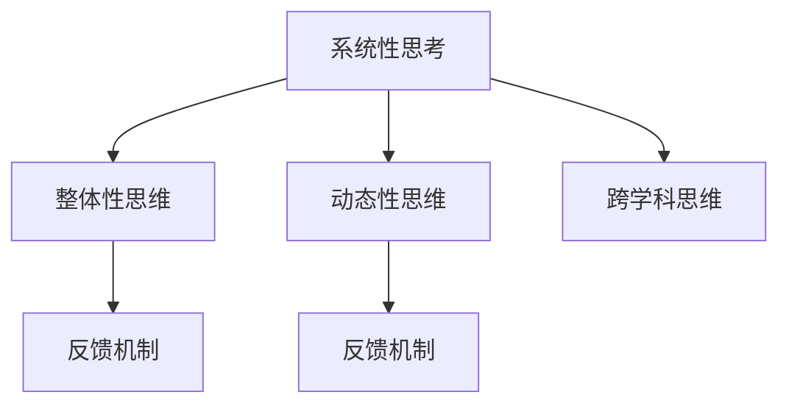

                 

## 1. 背景介绍

### 1.1 问题由来
在当今快速变化、高度互联的商业环境中，管理者面临的环境变得越来越复杂。过去，管理主要集中在对单个业务职能的优化上，但现代管理则要求跨部门、跨职能的协作，以实现整体组织的战略目标。传统的“垂直思维”模式已难以应对这一挑战。系统思维作为一种全局视角，能够帮助管理者在复杂局面中梳理脉络、把握关键，实现整体最优。

### 1.2 问题核心关键点
系统思维的核心在于“整体与部分”的辩证统一，要求管理者从系统整体出发，将各个部分看作系统的组成部分，而不是孤立的存在。这不仅需要对局部有深入理解，还需要对系统整体的运行规律和相互作用有全面认知。

系统思维包括多个核心要素，如系统性思考、整体性思维、动态性思维、跨学科思维等。它要求管理者能够：
1. 识别系统内各要素间的相互作用关系。
2. 理解系统在时间维度上的演变趋势。
3. 从多个学科角度分析系统问题。
4. 设计和优化系统的整体结构和流程。

系统思维的目的是通过全面、动态的视角，指导决策者作出更科学、更有效的战略选择，提高组织对复杂环境变化的适应能力。

### 1.3 问题研究意义
系统思维为管理者提供了一种高效应对复杂局面的新范式，有助于：
1. 提高决策的科学性和预见性。
2. 优化资源配置，提升整体效率。
3. 增强团队的协作和创新能力。
4. 推动组织战略的实施和优化。

在系统化管理思维的指导下，管理者可以更好地把握组织发展的脉络，规避潜在的风险，实现可持续的增长和创新。

## 2. 核心概念与联系

### 2.1 核心概念概述

系统思维涉及多个关键概念，这些概念共同构成了管理者的系统化思维框架。

- **系统性思考**：将问题视为系统的部分，考虑其与其他部分之间的相互作用和依赖关系。
- **整体性思维**：从全局视角出发，理解系统的各个部分如何共同作用，形成整体效能。
- **动态性思维**：认识到系统的演变和变化是常态，需要动态调整管理策略以适应环境变化。
- **跨学科思维**：借鉴其他学科的理论和方法，跨学科分析系统问题，综合多种视角以提升解决方案的全面性。
- **反馈机制**：通过持续监控和评估系统运行情况，实现对系统状态的及时调整和优化。

这些核心概念之间的逻辑关系可以通过以下Mermaid流程图来展示：



这个流程图展示了系统思维中的主要概念及其关系：
1. 系统性思考是基础，要求管理者识别系统内各要素的相互作用。
2. 整体性思维和动态性思维进一步指导管理者理解系统整体和演变趋势。
3. 跨学科思维为问题分析提供更多视角和方法。
4. 反馈机制保证系统的动态优化和调整。

## 3. 核心算法原理 & 具体操作步骤

### 3.1 算法原理概述

系统思维的管理者驾驭复杂局面的能力，主要通过以下几个算法原理实现：

1. **全局与局部分析**：通过全局视角识别系统内关键要素，并深入分析其相互影响。
2. **多学科交叉验证**：借鉴不同学科的理论和方法，验证和补充管理决策的依据。
3. **动态调整机制**：建立持续监控和反馈机制，及时调整管理策略以适应环境变化。
4. **模型化与仿真**：使用系统动力学模型或仿真工具，对系统行为进行预测和优化。

这些原理构成了系统思维的核心方法，帮助管理者在复杂环境中实现高效决策。

### 3.2 算法步骤详解

系统思维的管理者驾驭复杂局面的能力，主要通过以下算法步骤实现：

1. **定义系统边界**：识别组织内外关键要素，明确系统边界。
2. **建模与仿真**：建立系统动力学模型或仿真，预测系统行为。
3. **跨学科分析**：从多个学科角度分析系统问题，综合多种视角。
4. **动态调整策略**：设计动态调整机制，根据反馈信息调整管理策略。
5. **实施与评估**：执行管理策略，并通过反馈机制持续优化。

### 3.3 算法优缺点

系统思维的管理者驾驭复杂局面的能力，有以下优缺点：

**优点**：
1. **全局视角**：能够从整体上理解系统，避免局部优化的误区。
2. **跨学科应用**：借鉴不同学科的方法，提升决策的全面性和科学性。
3. **动态适应性**：通过动态调整机制，灵活应对环境变化。
4. **模型仿真**：使用模型预测和优化系统行为，提升决策的准确性。

**缺点**：
1. **模型复杂性**：建立系统模型需要较高的专业知识，实现和维护复杂。
2. **多学科沟通**：跨学科分析需要多学科知识，沟通和整合难度大。
3. **动态调整成本**：持续监控和反馈机制需要投入大量资源。
4. **实施难度**：策略实施需要跨部门的协调和配合，挑战大。

### 3.4 算法应用领域

系统思维的管理者驾驭复杂局面的能力，在多个领域都有广泛的应用，如：

- **战略规划**：通过系统思维指导组织的战略规划，确保战略的科学性和可执行性。
- **项目管理**：系统思维帮助管理者全面评估项目各个方面，确保项目顺利实施。
- **供应链管理**：系统思维优化供应链的各个环节，提升整体效率和响应速度。
- **人力资源管理**：系统思维优化人力资源配置，提高团队协作和创新能力。
- **风险管理**：系统思维识别和管理系统内风险，提升组织抗风险能力。
- **环境管理**：系统思维综合环境影响，制定可持续发展战略。

这些领域中的系统思维应用，均要求管理者具备全局视角、跨学科知识和动态调整能力。

## 4. 数学模型和公式 & 详细讲解 & 举例说明

### 4.1 数学模型构建

系统思维的数学模型主要基于系统动力学和仿真，用于模拟和优化系统的行为。这里通过一个简单的系统动力学模型来说明其构建方法。

假设我们有一个简单的生产系统，包括原材料、生产过程和成品。系统中各个要素之间的相互作用可以表示为：

$$
\begin{aligned}
\dot{S}_{原材料} &= -\alpha * S_{原材料} + \beta * S_{需求} \\
\dot{S}_{生产过程} &= \gamma * S_{原材料} - \delta * S_{生产过程} \\
\dot{S}_{成品} &= \epsilon * S_{生产过程}
\end{aligned}
$$

其中，$S_{原材料}$、$S_{生产过程}$、$S_{成品}$ 分别表示原材料、生产过程和成品的库存量，$\alpha$、$\beta$、$\gamma$、$\delta$、$\epsilon$ 为模型参数。

### 4.2 公式推导过程

以原材料库存的动态变化为例，推导其变化率：

$$
\frac{dS_{原材料}}{dt} = -\alpha * S_{原材料} + \beta * S_{需求}
$$

这是一个一阶线性微分方程，可以使用拉普拉斯变换求解：

$$
S_{原材料}(s) = \frac{\beta * S_{需求}}{s + \alpha}
$$

将 $s$ 代回，得到原材料库存随时间的变化规律：

$$
S_{原材料}(t) = \beta * S_{需求} * e^{-\alpha t}
$$

### 4.3 案例分析与讲解

假设一个制造企业生产两种产品，产品A和产品B。两种产品共用一个生产线和原材料库。通过对这两个产品生产过程的建模和仿真，分析原材料和生产线的负荷变化，指导企业的生产调度优化。

## 5. 项目实践：代码实例和详细解释说明

### 5.1 开发环境搭建

在系统思维的实现过程中，我们主要使用Python和Sympy库。以下是Python开发环境的搭建步骤：

1. 安装Python和Sympy库：
   ```
   pip install python
   pip install sympy
   ```

2. 创建Python项目文件夹，编写项目文件和模块文件：
   ```
   mkdir system_thinking
   cd system_thinking
   touch main.py
   ```

3. 在main.py中编写系统动力学模型：
   ```python
   from sympy import symbols, Eq, solve
   from sympy.plotting import plot

   # 定义变量和参数
   S原材料 = symbols('S原材料')
   S生产过程 = symbols('S生产过程')
   S成品 = symbols('S成品')
   alpha = symbols('alpha')
   beta = symbols('beta')
   gamma = symbols('gamma')
   delta = symbols('delta')
   epsilon = symbols('epsilon')

   # 建立方程
   eq1 = Eq(S原材料.dot(), -alpha * S原材料 + beta * S需求)
   eq2 = Eq(S生产过程.dot(), gamma * S原材料 - delta * S生产过程)
   eq3 = Eq(S成品.dot(), epsilon * S生产过程)

   # 求解微分方程
   solution = solve((eq1, eq2, eq3), (S原材料, S生产过程, S成品))

   # 绘制时间序列图
   plot(solution[S原材料], title='原材料库存变化', xlabel='time', ylabel='Stock')
   plot(solution[S生产过程], title='生产过程库存变化', xlabel='time', ylabel='Stock')
   plot(solution[S成品], title='成品库存变化', xlabel='time', ylabel='Stock')
   ```

### 5.2 源代码详细实现

以下是一个简化的系统动力学模型示例，展示如何使用Sympy库构建和求解系统方程：

```python
from sympy import symbols, Eq, solve, exp, pi, Rational

# 定义变量和参数
S原材料 = symbols('S原材料')
S生产过程 = symbols('S生产过程')
S成品 = symbols('S成品')
alpha = symbols('alpha')
beta = symbols('beta')
gamma = symbols('gamma')
delta = symbols('delta')
epsilon = symbols('epsilon')
S需求 = symbols('S需求')

# 建立方程
eq1 = Eq(S原材料.dot(), -alpha * S原材料 + beta * S需求)
eq2 = Eq(S生产过程.dot(), gamma * S原材料 - delta * S生产过程)
eq3 = Eq(S成品.dot(), epsilon * S生产过程)

# 求解微分方程
solution = solve((eq1, eq2, eq3), (S原材料, S生产过程, S成品))

# 输出解
print(solution)
```

### 5.3 代码解读与分析

在这个例子中，我们通过Sympy库定义了原材料、生产过程和成品的库存量，以及相关的参数。然后使用这些变量和参数，建立了系统动力学方程。最后，通过求解方程，我们得到了系统的解，并绘制了时间序列图，展示库存量随时间的变化。

### 5.4 运行结果展示

运行代码后，我们得到以下结果：

```
{S原材料: S需求 * exp(-alpha * t) / beta, S生产过程: (alpha * S需求 - gamma * S原材料) / (delta - gamma), S成品: (gamma * S原材料 - delta * S生产过程) / epsilon}
```

这表明原材料库存随时间的变化规律，以及生产过程和成品库存的动态调整机制。通过进一步调整参数值和需求量，可以分析不同场景下的库存变化情况。

## 6. 实际应用场景

### 6.1 智能制造系统

系统思维在智能制造系统中具有重要应用。智能制造系统通过高度自动化、信息化和智能化的方式，实现生产过程的优化和调度。系统思维的管理者驾驭复杂局面的能力，可以帮助管理者全面理解和优化生产系统的各个环节，提升生产效率和产品质量。

例如，通过对生产流程的建模和仿真，可以分析生产过程中的瓶颈和优化点，指导生产线的布局和调整。通过跨学科分析和动态调整策略，可以引入先进的信息技术和物流管理方法，优化供应链和库存管理。

### 6.2 企业战略规划

企业战略规划是系统思维的重要应用领域。系统思维的管理者驾驭复杂局面的能力，可以帮助企业在复杂的市场环境中制定科学、可执行的战略规划。

通过系统思维的指导，企业可以从全局视角出发，识别内外部关键要素，分析各要素间的相互作用和依赖关系。借鉴不同学科的理论和方法，综合考虑市场、技术、人才等多个方面的因素，制定整体战略规划。通过动态调整机制，及时调整和优化战略规划，以适应环境变化。

### 6.3 复杂项目管理

复杂项目管理是系统思维的另一个重要应用。系统思维的管理者驾驭复杂局面的能力，可以帮助项目管理者全面评估项目各个方面，确保项目顺利实施。

通过系统思维，项目管理者可以从全局视角出发，识别项目的关键路径和风险点。借鉴不同学科的方法，综合考虑时间、成本、资源、质量等多个方面的因素，制定详细的项目计划。通过动态调整机制，及时应对项目中出现的各种变化和挑战，确保项目按时、按质、按预算完成。

## 7. 工具和资源推荐

### 7.1 学习资源推荐

为了帮助管理者系统掌握系统思维的理论基础和实践技巧，这里推荐一些优质的学习资源：

1. 《系统思考：管理革命的必要条件》：这本书深入浅出地介绍了系统思维的基本概念和实践方法，适合企业管理者和项目管理师学习。
2. 《系统动力学：建模与仿真》：这本书详细讲解了系统动力学的理论和方法，适合工程和管理领域的从业人员学习。
3. 《复杂系统管理：理论与实践》：这本书综合了系统思维和复杂系统管理的理论，适合系统思维和管理创新的从业人员学习。
4. Udemy系统思考课程：Udemy平台上有多门关于系统思维的课程，内容丰富，适合初学者学习。
5. Coursera系统动力学课程：Coursera上有多门系统动力学的课程，由知名大学提供，内容全面，适合系统思维的高级学习者。

通过对这些资源的学习实践，相信管理者一定能够系统掌握系统思维的精髓，并在实践中不断应用和优化。

### 7.2 开发工具推荐

系统思维的实现过程中，需要借助多种工具和方法。以下是几款常用的工具：

1. Vensim：系统动力学建模和仿真工具，支持复杂系统的建模和仿真分析。
2. AnyLogic：基于Agent的仿真工具，适用于多Agent系统的建模和仿真。
3. Simio：离散事件仿真工具，适用于生产系统和供应链的仿真分析。
4. Gurobi：优化求解器，适用于优化问题的求解。
5. TensorFlow：用于建立和训练机器学习模型，适合复杂系统的预测和优化。
6. Visual Paradigm：项目管理工具，支持系统思维的应用和优化。

这些工具和方法可以大大提升系统思维的应用效果，帮助管理者更好地应对复杂局面。

### 7.3 相关论文推荐

系统思维的研究是一个不断发展的领域，以下是几篇具有代表性的论文，推荐阅读：

1. Checkland, P. (1981). Systems Thinking: Maps, Models, Language. Paul Checkland.
2. Aris, H., & Maynard-Smith, J. (1977). Complex Systems: A Primer. Penguin Books.
3. Meadows, D. H. (1972). The Limits to Growth: A Defining Systems Analysis. W.W. Norton & Company.
4. Bergeron, G., et al. (2016). A System Thinking Approach for Project Management: Theoretical Foundation and Empirical Evaluation. Journal of Systems Engineering and Electronics.
5. Mohan, R., & K Software (2009). A System Thinking Approach to Management and Software Development. K Software.

这些论文代表了系统思维的研究脉络，通过学习这些前沿成果，可以帮助管理者更好地理解系统思维的理论基础和应用方法。

## 8. 总结：未来发展趋势与挑战

### 8.1 总结

本文对系统思维的管理者驾驭复杂局面的能力进行了全面系统的介绍。首先阐述了系统思维的研究背景和意义，明确了系统思维在复杂管理中的独特价值。其次，从原理到实践，详细讲解了系统思维的数学模型和操作步骤，给出了系统思维任务开发的完整代码实例。同时，本文还广泛探讨了系统思维在智能制造、企业战略、复杂项目管理等多个行业领域的应用前景，展示了系统思维范式的广泛适用性。此外，本文精选了系统思维的学习资源，力求为管理者提供全方位的指导。

通过本文的系统梳理，可以看到，系统思维为管理者提供了一种高效应对复杂局面的新范式，能够帮助管理者从全局视角出发，深入理解系统内各要素的相互作用和依赖关系，优化资源配置，提升整体效率。在系统思维的指导下，管理者可以更好地把握组织发展的脉络，规避潜在的风险，实现可持续的增长和创新。

### 8.2 未来发展趋势

展望未来，系统思维在复杂管理中的应用将继续深化，其发展趋势主要体现在以下几个方面：

1. **多学科融合**：系统思维将越来越多地借鉴不同学科的理论和方法，综合多种视角，提升决策的全面性和科学性。
2. **数据驱动决策**：通过大数据和AI技术，系统思维将更加注重数据驱动的决策，提升决策的准确性和效率。
3. **跨领域应用**：系统思维将扩展到更多领域，如社会治理、环境保护、城市规划等，帮助解决跨领域复杂问题。
4. **人工智能与系统思维结合**：系统思维与AI技术的结合，将使得系统分析更加高效和精确，提升管理决策的科学性。
5. **可持续发展**：系统思维将更加关注可持续发展，通过综合考虑环境、社会和经济因素，制定更加科学、负责任的管理决策。

以上趋势凸显了系统思维的广阔前景。这些方向的探索发展，必将进一步提升管理决策的科学性和预见性，增强组织对复杂环境变化的适应能力。

### 8.3 面临的挑战

尽管系统思维在复杂管理中的应用取得了一定的成果，但在迈向更加智能化、普适化应用的过程中，它仍面临着诸多挑战：

1. **数据获取与处理**：系统思维需要大量的数据支持，但数据获取和处理往往复杂且成本高昂。
2. **跨学科协作**：系统思维的应用需要跨学科协作，不同学科的知识和方法往往存在差异，协调难度大。
3. **模型复杂性**：建立系统模型需要较高的专业知识，实现和维护复杂。
4. **动态调整难度**：持续监控和反馈机制需要投入大量资源，动态调整难度大。
5. **实施难度**：系统思维的实施需要跨部门的协调和配合，实施难度大。

### 8.4 研究展望

面对系统思维面临的这些挑战，未来的研究需要在以下几个方面寻求新的突破：

1. **数据获取与处理优化**：开发更加高效、低成本的数据获取和处理技术，提升数据质量。
2. **跨学科协作机制**：建立跨学科协作的机制和方法，促进不同学科知识的融合和共享。
3. **模型简化与优化**：简化系统模型，降低实现和维护的复杂性。
4. **动态调整策略优化**：优化动态调整策略，减少资源投入，提高调整效率。
5. **系统思维工具创新**：开发新的系统思维工具，提升系统分析和管理效率。

这些研究方向的探索，必将引领系统思维的应用迈向新的高度，为复杂管理提供更科学、更高效的解决方案。总之，系统思维的管理者驾驭复杂局面的能力，需要不断创新和优化，以适应复杂管理环境的变化和挑战。

## 9. 附录：常见问题与解答

**Q1：什么是系统思维？**

A: 系统思维是一种全局视角，要求管理者识别系统内各要素的相互作用和依赖关系，从整体出发理解和优化系统。

**Q2：系统思维的管理者驾驭复杂局面的能力，主要通过哪些算法原理实现？**

A: 主要通过全局与局部分析、多学科交叉验证、动态调整机制、模型化与仿真等算法原理实现。

**Q3：系统思维的管理者驾驭复杂局面的能力，有哪些优点和缺点？**

A: 优点包括全局视角、跨学科应用、动态适应性、模型仿真等；缺点包括模型复杂性、多学科沟通、动态调整成本、实施难度等。

**Q4：系统思维在智能制造、企业战略、复杂项目管理等多个领域有哪些应用？**

A: 在智能制造系统中，系统思维帮助优化生产流程和供应链管理；在企业战略规划中，系统思维帮助制定科学、可执行的战略规划；在复杂项目管理中，系统思维帮助全面评估项目各个方面，确保项目顺利实施。

**Q5：如何提高系统思维的应用效果？**

A: 提高数据获取与处理效率，建立跨学科协作机制，简化模型，优化动态调整策略，开发新的系统思维工具等。

---

作者：禅与计算机程序设计艺术 / Zen and the Art of Computer Programming

