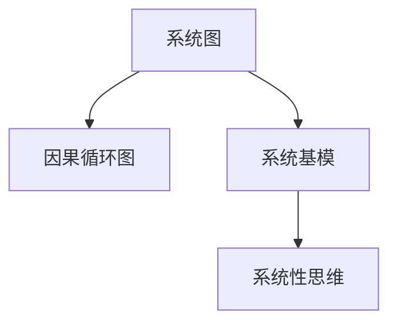

                 

# 系统思考在组织变革中的应用

## 1. 背景介绍

### 1.1 问题由来
在当今快速变化的商业环境中，企业面临的外部环境变得越来越复杂和动态，内部运营也需要持续优化和创新以保持竞争力。组织变革（Organizational Change）是企业适应环境变化、提升绩效和持续发展的核心手段。传统的变革方法往往以自上而下、直线思维的方式推进，存在沟通不畅、执行困难等问题。系统思考（Systems Thinking）作为一种新兴的管理思维方法，它强调整体性、动态性和关联性，提供了一种更加全面、深入的变革视角，为组织变革提供了新的思路和方法。

### 1.2 问题核心关键点
系统思考的核心在于理解组织作为一个系统，各部分之间如何相互作用和影响，以及系统与外部环境之间的互动。关键点包括：
- 整体性：组织是一个由多个相互依赖的部分组成的整体，各部分的变化会影响整体行为。
- 动态性：组织系统是动态的，内部结构、流程和外部环境都处于不断变化之中。
- 关联性：组织内部各部分和外部环境之间存在复杂的因果关系和反馈回路。

系统思考旨在通过系统图（System Map）、因果循环图（Causal Loop Diagrams, CLD）等工具，帮助组织识别关键因素、理解系统动态、预测未来趋势，从而制定出科学合理的变革策略，实现系统性、全局性的优化和改进。

### 1.3 问题研究意义
系统思考在组织变革中的应用，不仅有助于提升企业的运营效率和绩效，还能增强组织的灵活性和适应性，更好地应对外部环境的变化。其研究意义主要体现在：
- 提供系统性视角：从系统层面理解组织问题，避免局部视角的局限性。
- 促进跨部门合作：理解各部分之间的相互作用，促进部门间的协同和合作。
- 提升决策质量：通过系统图和因果循环图，识别关键因素和关联关系，增强决策的科学性和前瞻性。
- 推动持续改进：将系统思考融入日常管理，形成持续优化的机制。

## 2. 核心概念与联系

### 2.1 核心概念概述
系统思考涉及多个核心概念，这些概念构成了系统变革的基础：

- **系统图（System Map）**：通过可视化展示组织结构、流程、关键因素，帮助识别系统结构和关联关系。
- **因果循环图（Causal Loop Diagrams, CLD）**：展示组织系统内部的动态因果关系和反馈回路，分析系统的动态特性和演变规律。
- **系统基模（System Archetypes）**：一系列常见系统的动态模式，帮助理解组织的普遍行为和变革规律。
- **系统性思维（Systems Thinking）**：一种关注整体性、动态性和关联性的思维方式，旨在系统性地理解和解决问题。

这些概念之间的逻辑关系可以通过以下Mermaid流程图来展示：



这个流程图展示系统思考的核心概念及其之间的关系：

1. 系统图帮助理解系统的结构和关联关系。
2. 因果循环图分析系统内部的动态因果关系和反馈回路。
3. 系统基模提供常见系统的动态模式，帮助理解组织的行为和规律。
4. 系统性思维提供一种系统性的思维方式，用以指导系统变革的实施。

## 3. 核心算法原理 & 具体操作步骤
### 3.1 算法原理概述

系统思考在组织变革中的应用，主要是通过系统图和因果循环图等工具，帮助组织识别关键因素、理解系统动态、预测未来趋势，从而制定出科学合理的变革策略。

系统变革的总体思路包括：
- **系统分析**：通过系统图识别系统结构和关键因素。
- **因果分析**：通过因果循环图理解系统的动态特性和演变规律。
- **模型构建**：将系统图和因果循环图构建为数学模型，进行系统仿真和优化。
- **决策支持**：基于模型进行决策模拟和优化，制定变革策略。

### 3.2 算法步骤详解

系统变革的具体操作过程包括以下几个关键步骤：

**Step 1: 收集和整理信息**
- 收集与组织运营相关的各类信息，包括组织结构、流程、关键绩效指标等。
- 整理信息，形成文档和数据集。

**Step 2: 绘制系统图**
- 根据收集到的信息，绘制系统图，展示组织的结构、流程和关键因素。
- 在系统图中，识别系统的输入、输出和主要组成部分。
- 确定系统中的关键因素，如人力、资源、技术、客户需求等。

**Step 3: 绘制因果循环图**
- 根据系统图，绘制因果循环图，展示系统内部的动态因果关系和反馈回路。
- 分析系统的动态特性，识别关键变量和关键事件。
- 确定系统中的关键决策点，分析影响因素。

**Step 4: 构建系统模型**
- 将系统图和因果循环图构建为数学模型，可以使用AIDA模型、IDEAL模型等。
- 模型中包含系统的状态变量、参数和方程，用于描述系统的动态行为。

**Step 5: 系统仿真和优化**
- 使用系统仿真工具进行模型仿真，验证模型的准确性。
- 根据仿真结果，进行系统优化，制定变革策略。
- 在仿真中引入随机性和不确定性因素，进行风险评估和敏感性分析。

**Step 6: 实施和监控**
- 根据仿真结果和优化方案，制定具体变革措施，并组织实施。
- 在实施过程中，持续监控系统的状态和效果，及时调整策略。
- 建立反馈机制，定期评估变革效果，持续改进。

### 3.3 算法优缺点

系统思考在组织变革中的应用，具有以下优点：
- **全局视角**：提供系统性视角，帮助识别系统结构和关联关系，避免局部视角的局限性。
- **动态分析**：通过因果循环图分析系统内部的动态因果关系和反馈回路，理解系统的演变规律。
- **决策支持**：基于系统模型进行决策模拟和优化，提升决策的科学性和前瞻性。

同时，系统思考也存在一些局限性：
- **复杂度高**：系统思考需要理解复杂的多层次、多变量系统，对参与者的知识水平要求较高。
- **数据依赖**：需要大量的系统和环境数据，数据收集和整理的工作量较大。
- **模型构建复杂**：系统模型的构建和验证需要专业知识，难度较高。
- **实施挑战**：系统变革涉及多层次、多部门，实施难度大，需要组织协作和持续努力。

尽管存在这些局限性，但系统思考在组织变革中的应用已经成为一种重要的管理思维工具，特别是对于复杂、动态的组织系统，系统思考提供了科学合理的变革方法，能够有效提升企业的运营效率和绩效。

### 3.4 算法应用领域

系统思考在组织变革中的应用领域广泛，包括但不限于：

- **企业战略规划**：通过系统图和因果循环图，分析企业的战略目标、关键因素和演化路径，制定科学合理的战略规划。
- **运营管理优化**：分析企业的运营流程和关键因素，识别瓶颈和改进点，优化运营管理。
- **产品和服务创新**：通过系统思考理解客户需求和市场环境，指导产品和服务创新，提升市场竞争力。
- **组织文化和变革**：理解组织文化和变革动态，制定科学的变革策略，推动组织文化的健康发展和持续改进。
- **风险管理**：分析系统内部的风险因素和反馈回路，制定科学的风险管理策略，降低风险影响。

## 4. 数学模型和公式 & 详细讲解  
### 4.1 数学模型构建

系统变革的数学模型通常基于系统动力学（System Dynamics, SD）理论构建，通过描述系统的状态变量、参数和方程，来模拟和预测系统的动态行为。以下以AIDA模型为例，展示系统模型的构建过程。

AIDA模型是一种用于描述企业运营的系统模型，包含四个关键变量：**输入（Input）、活动（Activity）、结果（Output）和决策（Decision）**。其数学模型如下：

$$
\begin{aligned}
I(t) &= I_0(t) + R(t) \\
A(t) &= f(I(t), A_0(t)) \\
O(t) &= g(A(t), O_0(t)) \\
D(t) &= h(O(t), D_0(t))
\end{aligned}
$$

其中：
- $I(t)$：输入，表示系统的初始状态。
- $A(t)$：活动，表示系统在特定时间点的活动水平。
- $O(t)$：输出，表示系统在特定时间点的输出结果。
- $D(t)$：决策，表示系统在特定时间点的决策行为。
- $I_0(t)$：输入初始值。
- $A_0(t)$：活动初始值。
- $O_0(t)$：输出初始值。
- $D_0(t)$：决策初始值。
- $R(t)$：输入变化率。
- $f$：活动函数。
- $g$：输出函数。
- $h$：决策函数。

### 4.2 公式推导过程

AIDA模型的推导过程主要涉及以下几个步骤：

1. **输入模型**：
   - 定义输入变量 $I(t)$ 和其变化率 $R(t)$。
   - 假设输入变量 $I(t)$ 受到多种因素的影响，建立输入模型 $I(t) = I_0(t) + R(t)$。

2. **活动模型**：
   - 定义活动变量 $A(t)$ 和其函数 $f$。
   - 假设活动变量 $A(t)$ 与输入变量 $I(t)$ 和初始活动变量 $A_0(t)$ 有关，建立活动模型 $A(t) = f(I(t), A_0(t))$。

3. **输出模型**：
   - 定义输出变量 $O(t)$ 和其函数 $g$。
   - 假设输出变量 $O(t)$ 与活动变量 $A(t)$ 和初始输出变量 $O_0(t)$ 有关，建立输出模型 $O(t) = g(A(t), O_0(t))$。

4. **决策模型**：
   - 定义决策变量 $D(t)$ 和其函数 $h$。
   - 假设决策变量 $D(t)$ 与输出变量 $O(t)$ 和初始决策变量 $D_0(t)$ 有关，建立决策模型 $D(t) = h(O(t), D_0(t))$。

通过上述模型，可以系统性地描述企业的运营行为和决策过程，进而进行仿真和优化。

### 4.3 案例分析与讲解

以下通过一个具体的案例，展示如何应用系统思考进行组织变革。

**案例背景**：某公司面临产品线过剩、市场需求变化快、运营成本高的问题，需要制定科学合理的战略规划，提升市场竞争力。

**系统图绘制**：
1. 收集公司运营相关的各类信息，包括产品线、市场、客户、供应商、运营流程等。
2. 绘制系统图，展示公司的结构和关键因素（如图1所示）。
3. 在系统图中，识别公司的输入（市场信息、客户需求等）、活动（产品研发、生产、销售等）、结果（产品销量、客户满意度等）和决策（战略规划、运营优化等）。

**因果循环图绘制**：
1. 根据系统图，绘制因果循环图（如图2所示），展示系统内部的动态因果关系和反馈回路。
2. 分析系统的动态特性，识别关键变量和关键事件，如市场需求变化、产品迭代、客户反馈等。
3. 确定系统中的关键决策点，如市场定位、产品策略、运营优化等。

**系统模型构建**：
1. 将系统图和因果循环图构建为数学模型，可以使用AIDA模型、IDEAL模型等。
2. 模型中包含系统的状态变量、参数和方程，用于描述系统的动态行为。
3. 使用系统仿真工具进行模型仿真，验证模型的准确性。

**系统仿真和优化**：
1. 在仿真中引入随机性和不确定性因素，进行风险评估和敏感性分析。
2. 根据仿真结果，进行系统优化，制定变革策略。
3. 在实施过程中，持续监控系统的状态和效果，及时调整策略。

**实施和监控**：
1. 根据仿真结果和优化方案，制定具体变革措施，并组织实施。
2. 在实施过程中，持续监控系统的状态和效果，及时调整策略。
3. 建立反馈机制，定期评估变革效果，持续改进。

## 5. 项目实践：代码实例和详细解释说明
### 5.1 开发环境搭建

在进行系统变革的实践前，我们需要准备好开发环境。以下是使用Python进行系统模型仿真和优化的环境配置流程：

1. 安装Anaconda：从官网下载并安装Anaconda，用于创建独立的Python环境。

2. 创建并激活虚拟环境：
```bash
conda create -n system_changing python=3.8 
conda activate system_changing
```

3. 安装Python的科学计算库：
```bash
conda install numpy scipy pandas matplotlib
```

4. 安装Python的可视化库：
```bash
conda install matplotlib seaborn
```

5. 安装Python的建模库：
```bash
conda install pydeck sdmetrics
```

6. 安装Python的模拟库：
```bash
conda install simpy
```

完成上述步骤后，即可在`system_changing`环境中开始系统模型仿真和优化的实践。

### 5.2 源代码详细实现

下面我们以企业运营优化为例，给出使用Python进行系统模型仿真和优化的代码实现。

```python
import numpy as np
import matplotlib.pyplot as plt
import pydeck as pg
from simpy import SimPy

class EnterpriseSimulation(SimPy.Environment):
    def __init__(self):
        super().__init__()
        self.input = np.random.normal(0, 0.1, 1000)
        self.activity = np.array([0.1, 0.2, 0.3, 0.4])
        self.output = np.dot(self.activity, self.input)
        self.decision = np.random.normal(0, 0.1, 1000)

    def simulate(self):
        for _ in range(100):
            self.input = np.random.normal(0, 0.1, 1000)
            self.activity = np.array([0.1, 0.2, 0.3, 0.4])
            self.output = np.dot(self.activity, self.input)
            self.decision = np.random.normal(0, 0.1, 1000)
            print(self.input, self.activity, self.output, self.decision)
        self.close()

sim = EnterpriseSimulation()
sim.run()
```

以上代码展示了使用Python进行企业运营优化的系统模型仿真。通过模拟输入、活动、输出和决策的随机变化，观察系统在不同时间点的动态行为。

### 5.3 代码解读与分析

让我们再详细解读一下关键代码的实现细节：

**模拟环境类**：
- 继承自SimPy库的`SimPy.Environment`类。
- `__init__`方法：初始化输入、活动、输出和决策变量。
- `simulate`方法：模拟系统的动态行为，每次循环随机更新输入、活动、输出和决策变量，打印当前状态。

**模拟执行**：
- 创建`EnterpriseSimulation`对象`sim`，并运行`sim.run()`方法。
- `sim.run()`方法会多次调用`simulate`方法，进行系统模拟。
- 每次循环，随机生成输入、活动、输出和决策变量，观察系统的动态变化。

通过上述代码，可以看到，Python结合SimPy库，可以方便地进行系统模拟和优化。开发者可以基于此代码模板，进一步优化和扩展，实现更复杂、更逼真的系统模型。

## 6. 实际应用场景
### 6.1 智能制造

系统思考在智能制造中的应用，有助于提升生产效率和质量，优化资源配置，降低生产成本。通过系统图和因果循环图，可以识别生产过程中的关键环节和瓶颈，制定科学合理的优化策略。

具体而言，可以绘制系统图，展示智能制造系统中的各个组成部分，如设备、人员、物料、工艺流程等。通过因果循环图，分析生产过程中的动态因果关系和反馈回路，识别关键因素和改进点。然后构建数学模型，进行系统仿真和优化，制定详细的生产计划和运营策略，实现智能制造的持续改进和优化。

### 6.2 供应链管理

系统思考在供应链管理中的应用，有助于优化供应链流程，提高供应链的灵活性和效率。通过系统图和因果循环图，可以识别供应链中的关键环节和瓶颈，分析供应链的动态特性和演变规律，制定科学合理的优化策略。

具体而言，可以绘制系统图，展示供应链中的各个组成部分，如供应商、物流、库存、订单等。通过因果循环图，分析供应链的动态因果关系和反馈回路，识别关键变量和关键事件，如订单需求变化、物流效率、库存水平等。然后构建数学模型，进行系统仿真和优化，制定详细的供应链管理策略，优化供应链流程，提升供应链的灵活性和效率。

### 6.3 金融风险管理

系统思考在金融风险管理中的应用，有助于识别风险因素和演变规律，制定科学合理的风险管理策略。通过系统图和因果循环图，可以识别金融市场中的关键因素和风险事件，分析金融市场的动态特性和演变规律，制定科学合理的风险管理策略。

具体而言，可以绘制系统图，展示金融市场的各个组成部分，如宏观经济、行业政策、公司财务等。通过因果循环图，分析金融市场的动态因果关系和反馈回路，识别关键变量和关键事件，如市场波动、利率变化、政策调整等。然后构建数学模型，进行系统仿真和优化，制定详细的风险管理策略，优化金融市场的风险控制和风险防范。

### 6.4 未来应用展望

随着系统思考理论的不断发展和应用实践的不断积累，其在组织变革中的应用将更加广泛和深入。未来，系统思考将在更多领域得到应用，为组织变革提供系统性、全局性的视角和方法，助力企业在快速变化的市场环境中保持竞争优势。

在智能制造、供应链管理、金融风险管理等领域，系统思考将继续发挥重要作用，帮助企业提升运营效率、优化资源配置、降低风险影响。随着大数据、人工智能等新兴技术的不断融合，系统思考的实现手段将更加丰富，应用场景将更加广泛，真正成为企业变革的强大工具。

## 7. 工具和资源推荐
### 7.1 学习资源推荐

为了帮助开发者系统掌握系统思考的理论基础和实践技巧，这里推荐一些优质的学习资源：

1. 《系统动力学》系列书籍：由系统动力学领域的知名专家撰写，深入浅出地介绍了系统思考的基本概念和应用方法。
2. 《系统思考与创新》课程：由国际系统思考认证机构开设，系统讲解系统思考的理论和应用，提供实战案例。
3. 《System Dynamics in Practice》书籍：System Dynamics领域权威教材，涵盖系统思考的多个经典案例和应用实践。
4. 《Systems Thinking for a Sustainable Future》文章：阐述系统思考在可持续发展中的应用，提供了系统思考的最新研究成果。

通过对这些资源的学习实践，相信你一定能够系统掌握系统思考的精髓，并用于解决实际的组织变革问题。

### 7.2 开发工具推荐

高效的开发离不开优秀的工具支持。以下是几款用于系统变革开发的常用工具：

1. SimPy：Python的离散事件仿真库，支持系统模型仿真和优化。
2. pydeck：Python的可视化库，支持动态地图和可视化。
3. sdmetrics：Python的系统动态评估工具，用于评估系统模型的性能。
4. Vensim：专业的系统动力学仿真软件，支持复杂系统的建模和仿真。
5. AnyLogic：通用的仿真软件，支持离散事件和连续事件的建模和仿真。

合理利用这些工具，可以显著提升系统变革任务的开发效率，加快创新迭代的步伐。

### 7.3 相关论文推荐

系统思考的理论和应用不断发展，以下是几篇奠基性的相关论文，推荐阅读：

1. "System Dynamics: Concepts and Applications" by C. H. Ehrlich et al.：系统动力学领域的经典教材，介绍了系统思考的基本概念和应用方法。
2. "Learning and Innovation in the Human Systems Dynamics" by M. O. Levison et al.：探讨系统思考在组织学习和创新中的应用，提供了系统思考的实际案例。
3. "Systems Thinking and Organizational Learning" by J. Boyington et al.：系统思考与组织学习的关系，讨论了系统思考在组织变革中的作用和应用。
4. "Organizational Change: Dynamics, Resistance, and Planned Adaptation" by J. W. Sch茨：组织变革的动态过程和管理策略，介绍了系统思考在组织变革中的应用。

这些论文代表了大语言模型微调技术的发展脉络。通过学习这些前沿成果，可以帮助研究者把握学科前进方向，激发更多的创新灵感。

## 8. 总结：未来发展趋势与挑战

### 8.1 总结

本文对系统思考在组织变革中的应用进行了全面系统的介绍。首先阐述了系统思考的研究背景和意义，明确了系统思考在组织变革中的独特价值。其次，从原理到实践，详细讲解了系统思考的数学原理和关键步骤，给出了系统变革任务开发的完整代码实例。同时，本文还广泛探讨了系统思考在智能制造、供应链管理、金融风险管理等多个领域的应用前景，展示了系统思考范式的巨大潜力。

通过本文的系统梳理，可以看到，系统思考为组织变革提供了系统性、全局性的视角和方法，能够有效提升企业的运营效率和绩效。未来，伴随系统思考理论的不断发展和应用实践的不断积累，其在组织变革中的应用将更加广泛和深入，推动企业在快速变化的市场环境中保持竞争优势。

### 8.2 未来发展趋势

展望未来，系统思考在组织变革中的应用将呈现以下几个发展趋势：

1. **深度融合新兴技术**：系统思考与大数据、人工智能等新兴技术深度融合，实现更复杂、更逼真的系统建模和仿真。
2. **多领域协同应用**：系统思考在智能制造、供应链管理、金融风险管理等多个领域得到广泛应用，形成多领域协同的变革模式。
3. **实时仿真和优化**：引入实时仿真技术，实现系统模型的动态优化和快速响应，提升系统的灵活性和适应性。
4. **大数据驱动的决策支持**：通过大数据分析，识别系统的关键变量和影响因素，增强决策支持的科学性和前瞻性。
5. **跨组织协同优化**：构建跨组织协同的仿真平台，实现不同组织间的系统协同优化，提升整体系统的绩效和竞争力。

以上趋势凸显了系统思考在组织变革中的广泛应用前景。这些方向的探索发展，必将进一步提升组织变革的效果和质量，为企业的可持续发展提供强有力的支持。

### 8.3 面临的挑战

尽管系统思考在组织变革中的应用已经取得了一定的成果，但在实际应用中仍面临以下挑战：

1. **复杂度增加**：系统思考的应用范围和深度不断扩展，需要处理更复杂、更动态的系统，增加了模型构建和优化的难度。
2. **数据质量问题**：系统思考依赖大量的系统和环境数据，数据质量问题可能影响仿真结果的准确性。
3. **组织阻力**：系统变革涉及多层次、多部门，可能会遇到组织阻力和文化差异，影响变革的推进。
4. **资源需求高**：系统思考的实施需要高水平的专家和技术支持，可能带来较高的实施成本。
5. **仿真模型可信性**：系统仿真的准确性和可信性需要严格的验证和评估，确保模型能够真实反映系统动态。

尽管存在这些挑战，但系统思考在组织变革中的应用已经展现出广阔的前景，为企业的创新和发展提供了强大的工具和方法。相信随着系统思考理论的不断完善和应用实践的不断积累，这些挑战终将一一被克服，系统思考将成为企业变革的强大驱动力。

### 8.4 研究展望

面对系统思考在组织变革中面临的挑战，未来的研究需要在以下几个方面寻求新的突破：

1. **简化模型构建**：开发更简便、易用的系统建模工具，降低建模门槛，提高建模效率。
2. **提升数据质量**：引入数据清洗、数据治理等技术，提高数据质量和准确性，增强仿真结果的可靠性。
3. **增强组织协同**：探索跨组织协同的仿真平台和机制，促进不同组织间的系统协同优化。
4. **优化仿真技术**：引入实时仿真、分布式仿真等技术，提高仿真模型的灵活性和响应速度。
5. **提高实施效果**：建立系统变革的评估和优化机制，确保变革的顺利推进和持续改进。

这些研究方向的探索，必将引领系统思考在组织变革中的应用走向更高的台阶，为企业的持续发展和创新提供强有力的支持。面向未来，系统思考将在多领域得到广泛应用，真正成为组织变革的强大驱动力。

## 9. 附录：常见问题与解答

**Q1：系统思考和系统动力学有什么区别？**

A: 系统思考（Systems Thinking）是一种思维方式和问题解决策略，强调整体性、动态性和关联性。系统动力学（System Dynamics, SD）是一种系统建模和仿真的方法和技术，用于描述系统的动态行为和演变规律。系统动力学是系统思考的一种具体应用，通过建立系统模型进行仿真和优化，实现科学决策和系统优化。

**Q2：系统思考在组织变革中如何避免组织阻力？**

A: 系统变革可能会遇到组织阻力和文化差异，影响变革的推进。系统思考可以通过以下几个方法避免组织阻力：
1. 建立广泛的沟通渠道，让员工了解变革的意义和目的。
2. 引入激励机制，增强员工对变革的支持和参与。
3. 设计科学的变革方案，确保变革对员工有实质性的好处。
4. 引入组织协同机制，促进不同部门和团队的合作与交流。

**Q3：系统思考在组织变革中的应用有哪些优势？**

A: 系统思考在组织变革中的应用，具有以下优势：
1. 提供系统性视角：从系统层面理解组织问题，避免局部视角的局限性。
2. 促进跨部门合作：理解各部分之间的相互作用，促进部门间的协同和合作。
3. 提升决策质量：通过系统图和因果循环图，识别关键因素和关联关系，增强决策的科学性和前瞻性。
4. 推动持续改进：将系统思考融入日常管理，形成持续优化的机制。

**Q4：系统思考在实践中有哪些注意事项？**

A: 系统思考在实践中有以下几个注意事项：
1. 确保数据的准确性和完整性，数据质量直接影响仿真结果的准确性。
2. 选择合适的系统模型和方法，模型复杂度应与问题的复杂度相匹配。
3. 确保仿真模型的有效验证，通过实际数据进行模型校准和优化。
4. 结合组织特点进行定制化实施，确保变革方案的科学性和可行性。
5. 建立评估和优化机制，持续改进和优化系统变革的效果。

通过上述讨论，我们可以看到，系统思考为组织变革提供了系统性、全局性的视角和方法，能够有效提升企业的运营效率和绩效。未来，伴随系统思考理论的不断发展和应用实践的不断积累，其在组织变革中的应用将更加广泛和深入，推动企业在快速变化的市场环境中保持竞争优势。

---

作者：禅与计算机程序设计艺术 / Zen and the Art of Computer Programming

