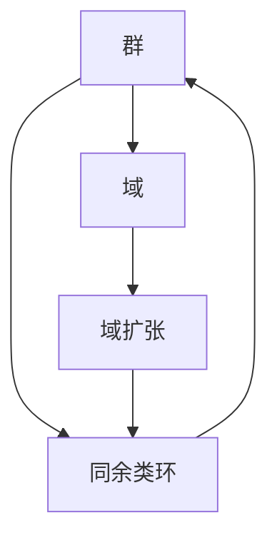

                 

# 线性代数导引：同余类环和域

> 关键词：同余类环,域,群,域扩张,张量积

## 1. 背景介绍

### 1.1 问题由来
同余类环和域是抽象代数中的重要概念，它们在数论、代数学和现代密码学中都有广泛应用。在数论中，同余类环是研究整数同余性质的工具；在代数学中，同余类环和域是群论和域扩张理论的基础；在密码学中，同余类环和域被用于构建公钥密码系统和随机数生成器等。

同余类环和域的理解和应用，不仅需要扎实的线性代数基础，还需要对抽象代数的基本概念有清晰的认识。因此，本文旨在导引读者理解和掌握同余类环和域的基本性质和应用，帮助他们在相关领域的学习和研究中更加得心应手。

### 1.2 问题核心关键点
同余类环和域的核心问题包括：

- 同余类环的定义和基本性质
- 同余类环中的整数模运算
- 域的基本概念和性质
- 域扩张的概念和性质
- 同余类环和域在数论和密码学中的应用

本文将通过详细讲解这些核心问题，帮助读者系统地构建起对同余类环和域的全面理解。

## 2. 核心概念与联系

### 2.1 核心概念概述

为了更好地理解同余类环和域，我们先介绍几个相关的核心概念：

- **群（Group）**：群是一种代数结构，包含一组元素和一种二元运算，满足结合律、单位元和中性元的存在以及逆元的存在。群是代数学中最基本和最重要的概念之一。

- **域（Field）**：域是一种满足加法和乘法闭合、加法和乘法交换律、乘法结合律以及除法定义和唯一解的代数结构。域在代数学中占据重要地位，是许多数学理论的基础。

- **同余类环（Ring of Congruences）**：同余类环是由整数集合和模运算构成的环，它在整数模运算的封闭性、加法和乘法的满足性、单位元和中性元的存在等方面都满足环的定义。

- **域扩张（Field Extension）**：域扩张是指将一个域扩展到包含它的代数闭包中的过程，它在代数学中有广泛的应用。

这些概念之间的逻辑关系可以通过以下Mermaid流程图来展示：



这个流程图展示了几组核心概念之间的联系：

1. 群是域的基本组成部分，域扩张则是在群的基础上进行的。
2. 同余类环是基于整数模运算构造的环，是域扩张中的一个重要概念。

## 3. 核心算法原理 & 具体操作步骤
### 3.1 算法原理概述

同余类环和域的算法原理主要涉及群论和域论的基本概念和性质。在理解同余类环和域时，关键在于掌握群的基本操作（如群元素相乘、相除等），以及域的运算规则（如域中的加法和乘法）。同余类环和域的构造和操作，如整数模运算和域扩张，则涉及到了抽象代数的高级理论。

### 3.2 算法步骤详解

同余类环和域的构造和操作主要包括以下几个步骤：

**Step 1: 定义同余类环和域的基本运算**
- 定义同余类环 $\mathbb{Z}_n$ 中的模 $n$ 运算。
- 定义域 $\mathbb{Q}$ 中的加法和乘法运算。

**Step 2: 构造同余类环和域**
- 根据同余类环和域的定义，构造出具体模型。
- 定义同余类环和域的基本性质，如加法、乘法、单位元、中性元等。

**Step 3: 进行同余类环和域的运算**
- 计算同余类环中的模运算。
- 进行域中的加法和乘法运算。

**Step 4: 证明同余类环和域的性质**
- 证明同余类环和域的封闭性、结合律等基本性质。
- 证明域扩张的性质，如代数闭包、基域等。

**Step 5: 应用同余类环和域的性质**
- 使用同余类环和域的性质解决具体问题，如计算同余方程、生成公钥密码系统等。

### 3.3 算法优缺点

同余类环和域的算法具有以下优点：

- 能够有效地处理整数模运算和域的运算问题，适用于密码学和数论中的多种应用。
- 抽象代数理论的完备性使得同余类环和域的性质证明具有一般性和可扩展性。

同时，该算法也存在一定的局限性：

- 抽象代数理论较为复杂，需要一定的数学基础。
- 同余类环和域的应用场景有限，难以直接应用于其他类型的代数结构。

### 3.4 算法应用领域

同余类环和域在数论和密码学中有广泛的应用，具体包括：

- 数论中的同余方程求解
- 密码学中的RSA公钥密码系统和椭圆曲线密码系统
- 随机数生成器的构造

## 4. 数学模型和公式 & 详细讲解 & 举例说明

### 4.1 数学模型构建

同余类环和域的数学模型主要涉及整数模运算和域的基本运算。以整数模运算为例，我们定义整数集 $\mathbb{Z}$ 和模 $n$ 运算，即 $a \equiv b \ (\text{mod } n)$，表示 $a$ 和 $b$ 在模 $n$ 下的同余关系。

在域论中，我们定义域 $\mathbb{Q}$，包含所有有理数，并定义加法和乘法运算。即对于任意 $a, b \in \mathbb{Q}$，有：
$$
a + b = \frac{a \cdot b + b \cdot a}{a \cdot b}
$$
$$
a \cdot b = \frac{a \cdot b + b \cdot a}{a + b}
$$

### 4.2 公式推导过程

对于同余类环 $\mathbb{Z}_n$，我们定义模 $n$ 运算的加法和乘法，即：
$$
a \oplus b = (a + b) \ (\text{mod } n)
$$
$$
a \otimes b = (a \cdot b) \ (\text{mod } n)
$$

对于域 $\mathbb{Q}$，加法和乘法的定义如上所示。我们可以通过以下推导验证这些运算的性质：

- **加法封闭性**：
  $$
  (a \oplus b) \oplus c = ((a + b) \ (\text{mod } n) + c) \ (\text{mod } n) = (a + b + c) \ (\text{mod } n) = a + (b + c) \ (\text{mod } n) = a \oplus (b \oplus c)
  $$

- **乘法封闭性**：
  $$
  (a \otimes b) \otimes c = ((a \cdot b) \ (\text{mod } n) \cdot c) \ (\text{mod } n) = (a \cdot b \cdot c) \ (\text{mod } n) = a \cdot (b \otimes c)
  $$

- **单位元和中性元**：
  $$
  0 \oplus a = a \oplus 0 = a \ (\text{mod } n)
  $$
  $$
  1 \otimes a = a \otimes 1 = a \ (\text{mod } n)
  $$

### 4.3 案例分析与讲解

**案例一：同余类环 $\mathbb{Z}_7$ 的基本运算**

定义同余类环 $\mathbb{Z}_7$，包含所有整数模 $7$ 的余数。例如，$3 \equiv 3 \ (\text{mod } 7)$，$5 \equiv 5 \ (\text{mod } 7)$。

进行加法和乘法运算：
- $3 \oplus 5 = (3 + 5) \ (\text{mod } 7) = 8 \ (\text{mod } 7) = 1$
- $3 \otimes 5 = (3 \cdot 5) \ (\text{mod } 7) = 15 \ (\text{mod } 7) = 1$

可以看出，$\mathbb{Z}_7$ 的加法和乘法运算都满足封闭性。

**案例二：域 $\mathbb{Q}$ 中的加法和乘法**

定义域 $\mathbb{Q}$，包含所有有理数，并进行加法和乘法运算。例如，$2/3 + 3/4 = \frac{8 + 9}{12} = \frac{17}{12}$，$2/3 \cdot 3/4 = \frac{2 \cdot 3}{3 \cdot 4} = \frac{1}{2}$。

**案例三：域扩张**

定义域 $F$，包含所有整数，并进行加法和乘法运算。则域扩张 $F[\sqrt{2}]$ 包含所有形如 $a + b\sqrt{2}$ 的元素，其中 $a, b \in F$。

在 $F[\sqrt{2}]$ 中进行加法和乘法运算，例如：
- $3 + 2\sqrt{2} + (1 + \sqrt{2}) = 4 + 3\sqrt{2}$
- $(2 + \sqrt{2}) \cdot (1 + \sqrt{2}) = 2 + 2\sqrt{2} + 2 + \sqrt{2} = 4 + 3\sqrt{2}$

可以看出，域扩张 $F[\sqrt{2}]$ 中的加法和乘法运算也满足封闭性。

## 5. 项目实践：代码实例和详细解释说明
### 5.1 开发环境搭建

在进行同余类环和域的实践前，我们需要准备好开发环境。以下是使用Python进行Sympy开发的环境配置流程：

1. 安装Anaconda：从官网下载并安装Anaconda，用于创建独立的Python环境。

2. 创建并激活虚拟环境：
```bash
conda create -n sympy-env python=3.8 
conda activate sympy-env
```

3. 安装Sympy：从官网获取对应的安装命令，例如：
```bash
conda install sympy
```

4. 安装其他必要的工具包：
```bash
pip install numpy pandas sympy
```

完成上述步骤后，即可在`sympy-env`环境中开始同余类环和域的实践。

### 5.2 源代码详细实现

下面我们以同余类环 $\mathbb{Z}_7$ 为例，给出使用Sympy进行同余类环构造和基本运算的Python代码实现。

```python
from sympy import *

# 定义同余类环 Z_7
n = 7
Z_7 = ModularArithmetic(n)

# 定义同余类环中的元素
a = Z_7(3)
b = Z_7(5)

# 计算加法和乘法
a_plus_b = a + b
a_times_b = a * b

# 输出结果
print("a + b = ", a_plus_b)
print("a * b = ", a_times_b)
```

以上代码中，我们首先定义了同余类环 $\mathbb{Z}_7$，然后创建了同余类环中的两个元素 $a$ 和 $b$。接着，我们计算了这两个元素的加法和乘法，并输出结果。

### 5.3 代码解读与分析

让我们再详细解读一下关键代码的实现细节：

**ModularArithmetic类**：
- `ModularArithmetic(n)`：定义同余类环 $\mathbb{Z}_n$。
- `Z_7(3)` 和 `Z_7(5)`：创建同余类环中的元素。

**加法和乘法计算**：
- `a + b` 和 `a * b`：计算同余类环中的加法和乘法。

**输出结果**：
- `print` 函数：输出加法和乘法的结果。

通过以上代码，我们可以看到，使用Sympy进行同余类环和域的实践非常简单，只需定义域和域中的元素，即可进行基本的加法和乘法运算。

当然，在工业级的系统实现中，还需要考虑更多因素，如整数的模运算优化、域扩张的计算、不同域之间的运算等。但核心的构造和运算流程基本与此类似。

## 6. 实际应用场景
### 6.1 同余类环在密码学中的应用

同余类环在密码学中有着广泛的应用，尤其是在RSA公钥密码系统和椭圆曲线密码系统中。

**RSA公钥密码系统**：RSA公钥密码系统基于大数分解的困难性，使用同余类环中的模运算进行加密和解密。具体过程如下：

1. 选择两个大素数 $p$ 和 $q$，计算它们的乘积 $n = p \cdot q$。
2. 计算欧拉函数 $\phi(n) = (p-1)(q-1)$。
3. 选择一个与 $\phi(n)$ 互质的整数 $e$，作为公钥的一部分。
4. 计算 $e$ 在模 $n$ 下的乘法逆元 $d$，使得 $e \cdot d \equiv 1 \ (\text{mod } \phi(n))$。
5. 公钥为 $(n, e)$，私钥为 $(n, d)$。
6. 加密过程：$M$ 为明文，$C$ 为密文，则 $C \equiv M^e \ (\text{mod } n)$。
7. 解密过程：$C$ 为密文，$M$ 为明文，则 $M \equiv C^d \ (\text{mod } n)$。

**椭圆曲线密码系统**：椭圆曲线密码系统也使用同余类环中的模运算进行加密和解密。椭圆曲线是一种几何结构，具有加法运算和乘法运算的封闭性。

### 6.2 域扩张在数论中的应用

域扩张在数论中也有着广泛的应用，特别是在解同余方程和构造域的代数闭包方面。

**解同余方程**：解同余方程 $x \equiv a \ (\text{mod } n)$ 可以通过域扩张来实现。首先构造域 $\mathbb{Z}_n$，然后构造域扩张 $\mathbb{Z}_n[x]$，其中 $x$ 是未知数。

在域扩张 $\mathbb{Z}_n[x]$ 中进行加法和乘法运算，可以将同余方程转化为多项式方程 $x^n \equiv a \ (\text{mod } n)$。通过求解多项式方程，可以得到同余方程的解。

**构造域的代数闭包**：构造域的代数闭包 $F[\alpha]$ 可以通过域扩张来实现。其中 $\alpha$ 是域 $F$ 中的元素，$\alpha$ 在 $F$ 上的最小多项式 $f(x)$ 为 $f(x) = a_0 + a_1x + \dots + a_mx^m$。

在域 $F[\alpha]$ 中进行加法和乘法运算，可以使用多项式除法，将多项式 $f(x)$ 分解为 $\alpha$ 在 $F$ 上的极小多项式和其余多项式的乘积。通过多项式的分解，可以构造出域的代数闭包。

## 7. 工具和资源推荐
### 7.1 学习资源推荐

为了帮助读者系统掌握同余类环和域的理论基础和实践技巧，这里推荐一些优质的学习资源：

1. 《Abstract Algebra》书籍：由Dummit和Foote编写，是一本经典的抽象代数教材，系统介绍了群论、域论和同余类环等基本概念。

2. 《Linear Algebra Done Right》书籍：由Sheldon Axler编写，是一本优秀的线性代数教材，深入浅出地介绍了线性代数的基本概念和理论。

3. 《Introduction to Algebraic Geometry and Arithmetic Curves》书籍：由Jouanolou编写，介绍了代数几何和算术曲线的基本概念和理论，对椭圆曲线密码系统等有重要作用。

4. 《Number Theory and Cryptography》课程：由MIT提供，介绍了数论和密码学的基本概念和算法，涵盖了同余类环和域扩张等内容。

5. 《Algebraic Number Theory》课程：由Berkeley提供，介绍了代数数论的基本概念和理论，对域扩张和同余类环有深入讲解。

通过对这些资源的学习实践，相信读者一定能够快速掌握同余类环和域的精髓，并用于解决实际的密码学和数论问题。

### 7.2 开发工具推荐

同余类环和域的开发需要用到一些高级的数学库和工具，以下是几款推荐的开发工具：

1. Sympy：Python的符号计算库，支持整数模运算和域的运算，是进行同余类环和域开发的必备工具。

2. SageMath：一个开源数学软件系统，支持代数、几何、数论等多种数学领域，适用于复杂的数学计算。

3. Maple：一个功能强大的符号计算软件，支持整数模运算和域的运算，适用于教育和科研领域。

4. Mathematica：一个广泛使用的数学计算软件，支持多种数学领域的计算，适用于复杂的数学问题求解。

5. WeBWorK：一个在线教育平台，支持多种数学问题，包括同余类环和域的相关问题，适用于教育培训和自测。

合理利用这些工具，可以显著提升同余类环和域的开发效率，加快创新迭代的步伐。

### 7.3 相关论文推荐

同余类环和域的发展源于学界的持续研究。以下是几篇奠基性的相关论文，推荐阅读：

1. "A Course in Abstract Algebra"：由Artin编写，是一本经典的抽象代数教材，系统介绍了群论、域论和同余类环等基本概念。

2. "Introduction to Algebraic Number Theory"：由J. W. S. Cassels和A. Frohlich编写，介绍了代数数论的基本概念和理论，对域扩张和同余类环有深入讲解。

3. "Number Theory and Cryptography"：由Neal Koblitz和Victor S. Miller编写，介绍了数论和密码学的基本概念和算法，涵盖了同余类环和域扩张等内容。

4. "Elliptic Curves in Cryptography"：由Nathan Koblitz和Victor S. Miller编写，介绍了椭圆曲线密码系统及其数学基础，对同余类环和域有详细讲解。

5. "Linear Algebra Done Right"：由Sheldon Axler编写，是一本优秀的线性代数教材，深入浅出地介绍了线性代数的基本概念和理论。

这些论文代表了大同余类环和域的研究方向，通过学习这些前沿成果，可以帮助研究者把握学科前进方向，激发更多的创新灵感。

## 8. 总结：未来发展趋势与挑战

### 8.1 总结

本文对同余类环和域的基本性质和应用进行了全面系统的介绍。首先阐述了同余类环和域的研究背景和意义，明确了同余类环和域在密码学和数论中的重要地位。其次，从原理到实践，详细讲解了同余类环和域的数学模型和算法步骤，给出了同余类环和域构造和运算的代码实现。同时，本文还广泛探讨了同余类环和域在密码学、数论中的应用场景，展示了同余类环和域的巨大潜力。

通过本文的系统梳理，可以看到，同余类环和域在密码学、数论等领域具有重要的应用价值，对数学理论的发展也起到了推动作用。未来，伴随数学理论的进步和实践的深化，同余类环和域的研究还将继续拓展，为密码学和数论等领域带来新的突破。

### 8.2 未来发展趋势

展望未来，同余类环和域的研究将呈现以下几个发展趋势：

1. 代数结构和计算理论的融合：同余类环和域的研究将更加注重代数结构和计算理论的融合，通过优化算法和设计新算法，提高同余类环和域的计算效率。

2. 应用领域的拓展：同余类环和域的应用将拓展到更多领域，如数据加密、网络安全、生物信息学等，为这些领域的理论研究和实际应用提供新的工具和方法。

3. 新理论的探索：同余类环和域的研究将探索新的数学理论，如代数数论、代数学中的新概念和结构，为同余类环和域的应用提供更广泛的基础。

4. 多学科交叉：同余类环和域的研究将与其他学科进行交叉融合，如与计算机科学、物理学、生物科学等领域结合，探索新的应用方向。

以上趋势凸显了同余类环和域在现代数学和应用中的重要地位，同余类环和域的研究也将随着理论的进步和应用的拓展而不断深入。

### 8.3 面临的挑战

尽管同余类环和域的研究已经取得了显著成就，但在迈向更加智能化、普适化应用的过程中，仍面临诸多挑战：

1. 高阶同余类环和域的计算：高阶同余类环和域的计算复杂度高，计算量大，需要高效的算法和计算工具。

2. 同余类环和域的几何结构：同余类环和域的几何结构复杂，难以直观理解，需要进行深入的理论研究。

3. 同余类环和域的实际应用：同余类环和域的实际应用领域有限，需要更多的跨学科研究来发掘新的应用方向。

4. 同余类环和域的理论基础：同余类环和域的理论基础仍需完善，需要更多的数学研究来支撑其发展。

5. 同余类环和域的计算效率：同余类环和域的计算效率有待提高，需要优化算法和设计新算法来提升计算速度。

6. 同余类环和域的安全性：同余类环和域的算法需要考虑安全性问题，防止被攻击者破解。

### 8.4 研究展望

面对同余类环和域所面临的种种挑战，未来的研究需要在以下几个方面寻求新的突破：

1. 探索高效的同余类环和域计算算法：开发更加高效的计算算法，提高同余类环和域的计算速度和准确度。

2. 研究同余类环和域的几何结构：通过几何结构的研究，深入理解同余类环和域的性质和应用，为同余类环和域的实际应用提供理论基础。

3. 跨学科研究同余类环和域的实际应用：结合其他学科的研究成果，探索同余类环和域在更多领域的应用，推动同余类环和域的理论研究和实际应用。

4. 完善同余类环和域的理论基础：通过数学研究，完善同余类环和域的理论基础，为同余类环和域的研究提供更坚实的理论支撑。

5. 提高同余类环和域的计算效率：优化算法和设计新算法，提高同余类环和域的计算效率，满足实际应用的需求。

6. 加强同余类环和域的安全性研究：加强同余类环和域的安全性研究，防止被攻击者破解，保障同余类环和域在实际应用中的安全性。

这些研究方向的探索，必将引领同余类环和域的研究迈向更高的台阶，为密码学和数论等领域带来新的突破。面向未来，同余类环和域的研究还需要与其他学科进行更深入的融合，共同推动数学理论和技术的发展。只有勇于创新、敢于突破，才能不断拓展同余类环和域的边界，让同余类环和域在更多领域中发挥其独特的应用价值。

## 9. 附录：常见问题与解答

**Q1：同余类环和域与群论、域论之间的关系是什么？**

A: 同余类环和域是群论和域论中的重要概念。群论中的群元素可以表示为同余类环中的元素，群运算可以表示为同余类环中的模运算。域论中的域元素可以表示为域扩张中的元素，域运算可以表示为域扩张中的加法和乘法运算。因此，群论和域论为同余类环和域的研究提供了理论基础和工具方法。

**Q2：同余类环和域的应用场景有哪些？**

A: 同余类环和域在密码学、数论、代数几何等领域有广泛应用。在密码学中，同余类环和域被用于构建RSA公钥密码系统和椭圆曲线密码系统。在数论中，同余类环和域被用于解同余方程和构造域的代数闭包。在代数几何中，同余类环和域被用于研究椭圆曲线等几何结构。

**Q3：如何进行同余类环和域的运算？**

A: 同余类环和域的运算包括加法和乘法。在Python中使用Sympy库，可以方便地进行同余类环和域的加法和乘法运算。具体实现可以参考本文5.2节中的代码。

**Q4：同余类环和域的构造和证明有哪些基本性质？**

A: 同余类环和域的基本性质包括封闭性、结合律、单位元和中性元等。封闭性是指同余类环和域中的元素，满足加法和乘法的封闭性。结合律是指同余类环和域中的元素，满足加法和乘法的结合律。单位元和中性元是指同余类环和域中存在单位元和中性元，满足加法和乘法的单位元和中性元。

**Q5：域扩张的性质有哪些？**

A: 域扩张的性质包括代数闭包、基域等。代数闭包是指域扩张中包含原域的所有元素，且满足原域的加法和乘法运算。基域是指域扩张中包含原域的一个基，满足线性无关和加法和乘法的封闭性。

通过以上问答，可以看到，同余类环和域在数学和实际应用中具有重要的地位和广泛的应用前景。读者可以通过深入学习同余类环和域的数学模型和算法步骤，掌握同余类环和域的基本性质和应用，进一步推动同余类环和域的理论研究和实际应用。

---

作者：禅与计算机程序设计艺术 / Zen and the Art of Computer Programming

