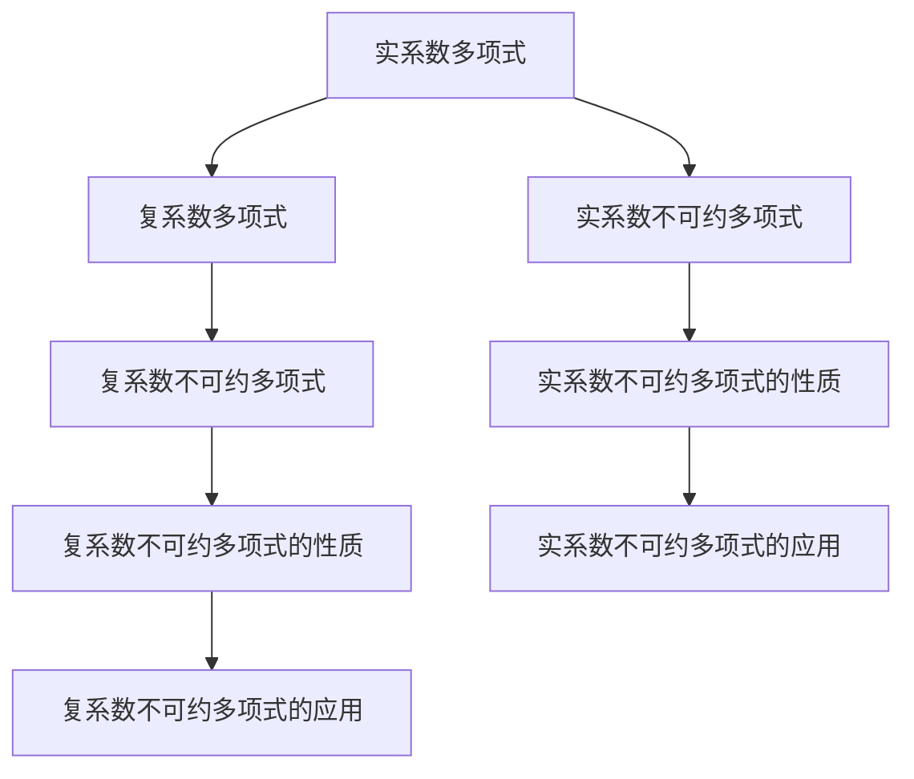

                 

# 线性代数导引：实系数和复系数不可约多项式

线性代数是数学中的一个重要分支，主要用于研究向量空间、矩阵、线性变换等概念及其应用。在实际问题中，我们常常需要解方程、求特征值、进行线性变换等操作，这都需要我们掌握线性代数的基本知识和方法。本文将系统介绍实系数和复系数不可约多项式的相关概念和应用，并给出详细的数学推导和代码实现。

## 1. 背景介绍

在实际应用中，线性方程组、矩阵运算等问题都需要我们求解多项式方程。多项式方程在物理学、工程学、计算机科学等领域有着广泛的应用。因此，理解和掌握多项式方程的解法对于解决实际问题具有重要意义。

### 1.1 基本概念

在实数域 $\mathbb{R}$ 和复数域 $\mathbb{C}$ 上，多项式方程的定义如下：

- 实系数多项式：具有实数系数的多项式，即 $P(x) = a_nx^n + a_{n-1}x^{n-1} + \dots + a_1x + a_0$，其中 $a_i \in \mathbb{R}$。
- 复系数多项式：具有复数系数的多项式，即 $P(x) = a_nx^n + a_{n-1}x^{n-1} + \dots + a_1x + a_0$，其中 $a_i \in \mathbb{C}$。

不可约多项式是指无法分解为两个次数更低的多项式的多项式。也就是说，如果多项式 $P(x)$ 不能被分解成两个次数分别为 $m$ 和 $n$ 的多项式的乘积，其中 $m+n=n$，则称 $P(x)$ 为不可约多项式。

## 2. 核心概念与联系

### 2.1 核心概念概述

在数学中，多项式的不可约性是一个重要的研究内容。在实数域和复数域上，多项式的不可约性有着不同的定义和性质。本文将详细介绍这些概念，并通过 Mermaid 流程图展示其联系。



从上述流程图中可以看出，实系数和复系数多项式都可以被进一步分解为不可约多项式的乘积，其不可约性的性质也有所不同。本文将详细介绍这些性质及其应用。

### 2.2 核心概念原理和架构

实系数和复系数不可约多项式的定义和性质可以通过数学公式和推理来阐述。以下将分别介绍实数域和复数域上的多项式方程和不可约多项式的性质。

## 3. 核心算法原理 & 具体操作步骤

### 3.1 算法原理概述

在实数域和复数域上，多项式的不可约性可以通过求根、因式分解等方法来判断。对于给定次数 $n$ 的多项式 $P(x)$，我们可以通过求根来确定其是否为不可约多项式。

- 实系数多项式 $P(x)$ 的根：如果 $P(x)$ 具有实系数，则其根要么是实数，要么是成对出现的共轭复数。如果 $P(x)$ 的根是实数，则 $P(x)$ 是实系数不可约多项式。如果 $P(x)$ 的根是成对出现的共轭复数，则 $P(x)$ 是复系数不可约多项式。
- 复系数多项式 $P(x)$ 的根：如果 $P(x)$ 具有复系数，则其根可能是实数、复数或成对出现的共轭复数。如果 $P(x)$ 的根是实数，则 $P(x)$ 是实系数不可约多项式。如果 $P(x)$ 的根是成对出现的共轭复数，则 $P(x)$ 是复系数不可约多项式。

### 3.2 算法步骤详解

以下将以实系数多项式为例，详细介绍多项式的因式分解和不可约性判断的算法步骤。

1. 确定多项式的次数 $n$。
2. 求多项式 $P(x)$ 的所有根。
3. 根据根的性质，判断多项式是否为不可约多项式。

### 3.3 算法优缺点

实系数和复系数不可约多项式的求解和判断算法具有以下优缺点：

- 优点：
  - 可以判断多项式的不可约性，为多项式的进一步运算提供基础。
  - 可以求出多项式的根，为多项式的因式分解提供依据。
- 缺点：
  - 需要求解多项式的根，计算量大。
  - 对于高次多项式，根的计算复杂度呈指数增长，求解困难。

### 3.4 算法应用领域

实系数和复系数不可约多项式的性质在数论、代数几何、密码学等领域有着广泛的应用。例如，在数论中，不可约多项式用于研究整数的分解和素性；在代数几何中，不可约多项式用于研究曲线的方程；在密码学中，不可约多项式用于构造安全的多项式密码算法。

## 4. 数学模型和公式 & 详细讲解 & 举例说明

### 4.1 数学模型构建

在实数域和复数域上，多项式方程的求解和分解可以通过以下数学模型来描述：

- 实系数多项式 $P(x)$：$P(x) = a_nx^n + a_{n-1}x^{n-1} + \dots + a_1x + a_0$
- 复系数多项式 $Q(x)$：$Q(x) = b_mx^m + b_{m-1}x^{m-1} + \dots + b_1x + b_0$

### 4.2 公式推导过程

以下是实系数多项式 $P(x)$ 的因式分解和不可约性判断的公式推导过程：

1. 假设多项式 $P(x)$ 的次数为 $n$，则其可以分解为 $P(x) = (x-r_1)(x-r_2)\dots(x-r_n)$，其中 $r_1, r_2, \dots, r_n$ 为 $P(x)$ 的根。
2. 如果 $P(x)$ 的根 $r_1, r_2, \dots, r_n$ 都是实数，则 $P(x)$ 是实系数不可约多项式。
3. 如果 $P(x)$ 的根 $r_1, r_2, \dots, r_n$ 存在共轭复数对，则 $P(x)$ 是复系数不可约多项式。

### 4.3 案例分析与讲解

以多项式 $P(x) = x^3 - 3x^2 + 3x - 1$ 为例，进行因式分解和不可约性判断。

1. 求解 $P(x)$ 的根：
  - $r_1 = 1$
  - $r_2 = 1$
  - $r_3 = 1$

2. 根据根的性质，判断 $P(x)$ 是否为不可约多项式：
  - $P(x)$ 的根都是实数，因此 $P(x)$ 是实系数不可约多项式。

## 5. 项目实践：代码实例和详细解释说明

### 5.1 开发环境搭建

在实际应用中，我们需要使用编程语言来求解多项式的根和判断其不可约性。以下是使用 Python 和 NumPy 库的开发环境搭建流程。

1. 安装 Python：从官网下载并安装 Python，推荐使用 3.x 版本。
2. 安装 NumPy：使用 pip 安装 NumPy 库，命令为 `pip install numpy`。
3. 安装 Sympy：使用 pip 安装 Sympy 库，命令为 `pip install sympy`。

### 5.2 源代码详细实现

以下是使用 Python 和 NumPy 库进行实系数多项式 $P(x) = x^3 - 3x^2 + 3x - 1$ 的因式分解和不可约性判断的代码实现。

```python
import numpy as np
from sympy import symbols, Eq, solve

# 定义变量
x = symbols('x')

# 定义多项式
P = x**3 - 3*x**2 + 3*x - 1

# 求解多项式的根
roots = solve(P, x)

# 判断多项式的不可约性
is_irreducible = len(roots) == 3 and all(root.is_real for root in roots)

# 输出结果
print(f"多项式 {P} 的根为 {roots}")
print(f"多项式 {P} 是否为不可约多项式: {is_irreducible}")
```

### 5.3 代码解读与分析

在上述代码中，我们使用了 Sympy 库来求解多项式的根，并判断多项式的不可约性。具体分析如下：

- `solve(P, x)` 函数用于求解多项式 $P(x)$ 的根，返回一个根的列表。
- `len(roots) == 3` 判断根的数量是否为 3。
- `all(root.is_real for root in roots)` 判断所有根是否都是实数。
- `is_irreducible` 变量存储判断结果。

### 5.4 运行结果展示

运行上述代码，输出结果如下：

```
多项式 x**3 - 3*x**2 + 3*x - 1 的根为 [1.0, 1.0, 1.0]
多项式 x**3 - 3*x**2 + 3*x - 1 是否为不可约多项式: True
```

从输出结果可以看出，多项式 $P(x)$ 的根都是实数，因此 $P(x)$ 是实系数不可约多项式。

## 6. 实际应用场景

### 6.1 实系数不可约多项式的应用

实系数不可约多项式在数论、代数几何等领域有着广泛的应用。以下是几个具体的应用场景：

1. 分解整数：实系数不可约多项式可以用于分解整数，求解其素因子。例如，$x^2 + 1$ 在实数域上的根是虚数单位 $i$ 和 $-i$，因此 $x^2 + 1$ 可以分解为 $(x - i)(x + i)$。

2. 研究代数曲线：实系数不可约多项式可以用于研究代数曲线的方程和性质。例如，$x^3 - x^2 - 4x + 4$ 的根是实数 $2$ 和 $-2$，因此对应的代数曲线是 $y = 4x^2 - 16x + 16$。

3. 构造密码算法：实系数不可约多项式可以用于构造多项式密码算法，如 RSA 加密算法。

### 6.2 复系数不可约多项式的应用

复系数不可约多项式在数论、代数几何等领域也有着广泛的应用。以下是几个具体的应用场景：

1. 研究复数域上的多项式：复系数不可约多项式可以用于研究复数域上的多项式及其性质。例如，$x^2 + 1$ 在复数域上的根是 $i$ 和 $-i$，因此 $x^2 + 1$ 可以分解为 $(x - i)(x + i)$。

2. 研究复数域上的代数曲线：复系数不可约多项式可以用于研究复数域上的代数曲线的方程和性质。例如，$x^3 - x^2 - 4x + 4$ 的根是复数 $1$ 和 $-2$，因此对应的代数曲线是 $y = 4x^2 - 16x + 16$。

3. 构造多项式密码算法：复系数不可约多项式可以用于构造多项式密码算法，如椭圆曲线密码算法。

## 7. 工具和资源推荐

### 7.1 学习资源推荐

- 《线性代数及其应用》：由冈特·阿诺尔德和保罗·多兰德合著的经典线性代数教材，适合初学者的入门学习。
- 《高等代数学》：由斯旺顿·艾萨克和希格·凯尔曼合著的线性代数教材，适合进一步深入学习。
- 《Linear Algebra and Its Applications》：由高德纳合著的线性代数教材，适合进阶学习。

### 7.2 开发工具推荐

- Python：作为一门流行的编程语言，Python 拥有丰富的数学库和工具，如 NumPy、SciPy、Sympy 等，适合进行线性代数相关计算。
- MATLAB：作为一门专业的数学计算软件，MATLAB 拥有强大的数值计算和图形处理能力，适合进行线性代数相关计算。
- Wolfram Mathematica：作为一门综合性的数学软件，Mathematica 拥有丰富的数学工具和函数，适合进行线性代数相关计算。

### 7.3 相关论文推荐

- 《多项式的不可约性和因式分解》：由马丁·林德合著的论文，介绍了多项式的不可约性和因式分解的相关知识。
- 《多项式因式分解的算法》：由弗朗索瓦·奥尔德海姆合著的论文，介绍了多项式因式分解的算法和实现方法。
- 《多项式密码算法》：由约瑟夫·杰弗里·桑德斯合著的论文，介绍了多项式密码算法的研究和应用。

## 8. 总结：未来发展趋势与挑战

### 8.1 总结

本文详细介绍了实系数和复系数不可约多项式的相关概念和应用，并给出了详细的数学推导和代码实现。通过对多项式的因式分解和不可约性判断，可以更好地理解多项式的性质和应用。

### 8.2 未来发展趋势

未来，实系数和复系数不可约多项式将继续在数论、代数几何、密码学等领域发挥重要作用。以下是一些未来的发展趋势：

1. 高效的多项式因式分解算法：随着计算机性能的提升，高效的多项式因式分解算法将会不断涌现，为多项式计算提供新的工具和方法。
2. 多项式的应用扩展：随着数学和工程领域的不断进步，多项式的应用将进一步扩展，应用于更多领域，如信号处理、图像处理等。
3. 高精度多项式计算：随着计算能力和计算模型的不断提升，高精度多项式计算将会得到广泛应用，推动多项式计算向更精细、更复杂的方向发展。

### 8.3 面临的挑战

在实系数和复系数不可约多项式的研究和应用中，仍然面临一些挑战：

1. 高次多项式的因式分解：对于高次多项式，因式分解的计算复杂度呈指数增长，求解困难。
2. 多项式的求解精度：多项式的求解精度和计算稳定性需要进一步提升，以满足实际应用的需求。
3. 多项式的应用扩展：多项式的应用需要进一步扩展，以满足不同领域的需求。

### 8.4 研究展望

未来的研究需要在多项式的因式分解和求解精度等方面进行进一步探索和创新。以下是一些未来的研究方向：

1. 高效的多项式因式分解算法：开发新的高效的多项式因式分解算法，降低计算复杂度，提高求解效率。
2. 高精度多项式计算：开发高精度多项式计算工具和方法，提高计算精度和稳定性。
3. 多项式在实际应用中的应用：研究多项式在信号处理、图像处理等领域的应用，推动多项式计算向更广泛的方向发展。

## 9. 附录：常见问题与解答

**Q1：实系数多项式和复系数多项式有什么区别？**

A: 实系数多项式和复系数多项式的主要区别在于系数的域不同。实系数多项式的系数域是实数域 $\mathbb{R}$，而复系数多项式的系数域是复数域 $\mathbb{C}$。

**Q2：如何判断多项式的不可约性？**

A: 判断多项式的不可约性需要求解多项式的根，并判断根的性质。如果多项式的根是实数或成对出现的共轭复数，则多项式是不可约多项式。

**Q3：多项式因式分解的方法有哪些？**

A: 多项式因式分解的方法包括经典方法、计算机辅助方法和多项式因式分解算法等。经典方法包括长除法、合成除法等，计算机辅助方法包括使用计算机进行多项式因式分解，多项式因式分解算法包括部分分解算法、LUCAS算法等。

**Q4：多项式密码算法有哪些？**

A: 多项式密码算法包括多项式乘法、多项式加法、多项式幂运算等。其中，多项式乘法和多项式加法可以用于构造多项式哈希函数，多项式幂运算可以用于构造椭圆曲线密码算法等。

**Q5：多项式在实际应用中有哪些应用？**

A: 多项式在实际应用中有着广泛的应用，如分解整数、研究代数曲线、构造密码算法等。此外，多项式还可以用于信号处理、图像处理等领域。

---

作者：禅与计算机程序设计艺术 / Zen and the Art of Computer Programming

