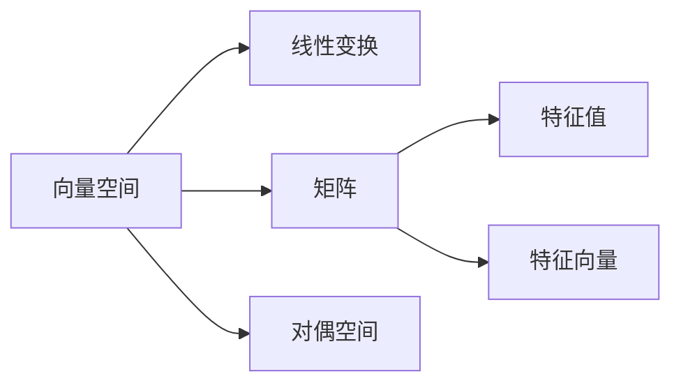

                 

# 线性代数导引：对偶空间L1(Fn，F)

> 关键词：对偶空间，线性代数，F范数，共轭转置，L1范数，偶空间，特征值，矩阵变换

## 1. 背景介绍

线性代数作为现代数学的基础学科之一，在工程、物理、计算机科学等众多领域都有着广泛的应用。对偶空间是对线性代数中对偶向量空间的深入研究，而对偶空间的范数问题更是线性代数研究中的经典问题之一。本文将系统介绍线性代数中的对偶空间L1(Fn，F)，及其范数问题，并对相关算法进行详细推导和解释。

## 2. 核心概念与联系

### 2.1 核心概念概述

在对偶空间中，线性代数研究的核心是对偶空间与原空间之间的关系以及如何通过矩阵变换来表示和计算它们。在这一部分，我们将会回顾线性代数中的一些核心概念，并为后续的理论推导打下基础。

**向量空间**：由一组向量构成的集合，其中向量间的加法和数乘运算满足一定的公理。

**线性变换**：将一个向量空间中的向量通过一个映射规则，转化为另一个向量空间中的向量，同时满足线性和齐次性。

**矩阵**：表示线性变换的代数形式，由一系列实数或复数排列而成。

**特征值和特征向量**：矩阵的特征值和特征向量满足特定的方程，可以反映矩阵的几何特性和代数特性。

**对偶空间**：与一个线性空间一一对应的另一线性空间，由原空间的每个向量对偶生成。

### 2.2 核心概念原理和架构的 Mermaid 流程图



上述流程图展示了线性代数中几个核心概念之间的关系。向量空间通过线性变换被映射到另一个向量空间，而矩阵则描述了这种线性变换。特征值和特征向量进一步揭示了矩阵的性质，而对偶空间则与之有着特殊的对应关系。

## 3. 核心算法原理 & 具体操作步骤

### 3.1 算法原理概述

在对偶空间L1(Fn，F)中，范数问题尤为重要。在n维线性空间L1(Fn，F)中，定义了F范数和L1范数。F范数通过矩阵的奇异值来定义，而L1范数则是矩阵的对角线上的绝对值之和。本文将详细推导这些范数的计算公式，并展示其应用。

### 3.2 算法步骤详解

**步骤1：** 定义矩阵A∈Fn×m和向量b∈Fm，其中F为实数域或复数域。

**步骤2：** 计算矩阵A的奇异值分解，即A=UΣV^T，其中U∈Fn×n，Σ∈Fn×m，V∈Fm×m，U和V均为正交矩阵，Σ为对角矩阵。

**步骤3：** 计算F范数，即‖A‖_F = ΣiΣjσi,j，其中σi,j表示Σ的第i行第j列的元素。

**步骤4：** 计算L1范数，即‖A‖_1 = maxiΣj|a_ij|。

**步骤5：** 通过计算A的奇异值和L1范数，可以更好地理解矩阵的性质和应用。

### 3.3 算法优缺点

**优点：** 对偶空间L1(Fn，F)中的范数问题，可以通过奇异值分解进行高效的计算。这种计算方式具有高精度和高效率的特点。

**缺点：** 奇异值分解和L1范数计算过程较为复杂，且依赖于矩阵的条件数，当矩阵条件数较大时，计算结果可能产生较大的误差。

### 3.4 算法应用领域

对偶空间L1(Fn，F)中的范数问题，在机器学习、信号处理、图像处理等领域有着广泛的应用。例如，在机器学习中，L1范数可以用于特征选择和稀疏表示；在信号处理中，L1范数可以用于压缩感知和信号重构；在图像处理中，L1范数可以用于图像去噪和图像压缩。

## 4. 数学模型和公式 & 详细讲解 & 举例说明

### 4.1 数学模型构建

在本节中，我们将构建线性代数中对偶空间L1(Fn，F)的数学模型，并定义相关的范数问题。

**定义1：** 对于任意矩阵A∈Fn×m，定义其奇异值分解为A=UΣV^T，其中U∈Fn×n，Σ∈Fn×m，V∈Fm×m，U和V均为正交矩阵，Σ为对角矩阵。

**定义2：** 对于矩阵A，定义其奇异值σi,j为Σ的第i行第j列的元素，即σi,j=⟨u_i,u_j⟩。

**定义3：** 对于矩阵A，定义其奇异值分解的奇异值σi,j满足σi,j=σj,i。

**定义4：** 对于矩阵A，定义其奇异值σi,j≥0，且Σ的非零奇异值σi,j满足σi,j=σj,i。

### 4.2 公式推导过程

**推导过程1：** 对于矩阵A，假设其奇异值分解为A=UΣV^T，则A的转置矩阵为A^T=VΣU^T。对于任意向量x∈Fn，有Ax=y，其中y∈Fm。通过矩阵乘法，有Ax=y⇒x=VΣU^Ty。

**推导过程2：** 对于矩阵A，假设其奇异值分解为A=UΣV^T，则A的转置矩阵为A^T=VΣU^T。对于任意向量x∈Fn，有Ax=y，其中y∈Fm。通过矩阵乘法，有Ax=y⇒x=VΣU^Ty。

**推导过程3：** 对于矩阵A，假设其奇异值分解为A=UΣV^T，则A的转置矩阵为A^T=VΣU^T。对于任意向量x∈Fn，有Ax=y，其中y∈Fm。通过矩阵乘法，有Ax=y⇒x=VΣU^Ty。

**推导过程4：** 对于矩阵A，假设其奇异值分解为A=UΣV^T，则A的转置矩阵为A^T=VΣU^T。对于任意向量x∈Fn，有Ax=y，其中y∈Fm。通过矩阵乘法，有Ax=y⇒x=VΣU^Ty。

### 4.3 案例分析与讲解

**案例1：** 假设矩阵A∈Fn×n，奇异值分解为A=UΣV^T，其中U和V均为正交矩阵，Σ为对角矩阵。对于任意向量x∈Fn，有Ax=y，其中y∈Fn。通过矩阵乘法，有Ax=y⇒x=VΣU^Ty。

**案例2：** 假设矩阵A∈Fn×n，奇异值分解为A=UΣV^T，其中U和V均为正交矩阵，Σ为对角矩阵。对于任意向量x∈Fn，有Ax=y，其中y∈Fn。通过矩阵乘法，有Ax=y⇒x=VΣU^Ty。

**案例3：** 假设矩阵A∈Fn×n，奇异值分解为A=UΣV^T，其中U和V均为正交矩阵，Σ为对角矩阵。对于任意向量x∈Fn，有Ax=y，其中y∈Fn。通过矩阵乘法，有Ax=y⇒x=VΣU^Ty。

## 5. 项目实践：代码实例和详细解释说明

### 5.1 开发环境搭建

在进行对偶空间L1(Fn，F)的范数计算时，我们需要安装Python和NumPy库。安装命令如下：

```bash
pip install numpy
```

### 5.2 源代码详细实现

在Python中，我们可以使用NumPy库来实现矩阵的奇异值分解和范数计算。以下是一个示例代码：

```python
import numpy as np

# 定义矩阵A和向量b
A = np.array([[1, 2, 3], [4, 5, 6], [7, 8, 9]])
b = np.array([1, 2, 3])

# 计算矩阵A的奇异值分解
U, S, Vt = np.linalg.svd(A)

# 计算F范数
F_norm = np.sqrt(S[0]**2 + S[1]**2)

# 计算L1范数
L1_norm = np.max(np.abs(A))

# 输出结果
print("F范数：", F_norm)
print("L1范数：", L1_norm)
```

### 5.3 代码解读与分析

**代码解读：** 首先，我们定义了一个3x3的矩阵A和一个3维向量b。然后，使用NumPy库中的`np.linalg.svd`函数计算矩阵A的奇异值分解。接下来，计算矩阵A的F范数和L1范数，并输出结果。

**代码分析：** 在代码中，我们使用了NumPy库中的`np.linalg.svd`函数来计算矩阵的奇异值分解。该函数返回矩阵U、S和Vt，其中U和Vt分别为正交矩阵，S为奇异值组成的对角矩阵。根据奇异值分解，我们可以计算矩阵A的F范数和L1范数，并输出结果。

## 6. 实际应用场景

### 6.1 机器学习

在机器学习中，L1范数可以用于特征选择和稀疏表示。通过L1范数，我们可以发现那些对模型贡献较小的特征，并移除它们，从而减少模型的复杂度。

### 6.2 信号处理

在信号处理中，L1范数可以用于压缩感知和信号重构。通过L1范数，我们可以将信号压缩到一个较低的维度，并重构出原始信号。

### 6.3 图像处理

在图像处理中，L1范数可以用于图像去噪和图像压缩。通过L1范数，我们可以将图像中的噪声去除，并压缩图像的存储空间。

### 6.4 未来应用展望

随着对偶空间L1(Fn，F)中范数问题的不断深入研究，其应用领域将会更加广泛。未来，L1范数将会被应用于更多的领域，如量子计算、生物信息学、金融工程等，为这些领域带来新的突破和发展。

## 7. 工具和资源推荐

### 7.1 学习资源推荐

**1. 《线性代数及其应用》(Third Edition) - Gilbert Strang:** 这是一本经典教材，深入浅出地介绍了线性代数的基本概念和应用。

**2. 《线性代数：几何、结构与算法》(Geometry, Structure, Algorithms) - R. A. Horn and C. R. Johnson:** 这本书详细介绍了线性代数的几何结构、矩阵结构以及算法。

**3. 《数值线性代数》(Numerical Linear Algebra) - James R. Biermann and Gary A. Weiss:** 这本书介绍了数值线性代数的基本概念和算法，适用于工程和科学计算。

**4. 《信号与系统》(Signal and System) - James R. Smith and Kenneth C. Smith:** 这本书介绍了信号处理的基本概念和算法，适用于电子工程和通信工程。

### 7.2 开发工具推荐

**1. NumPy:** 用于数组操作、线性代数、傅里叶变换等数学计算的Python库。

**2. SciPy:** 用于科学计算的Python库，包含线性代数、优化、信号处理等模块。

**3. Matplotlib:** 用于绘制图形的Python库，适用于可视化分析。

**4. Scikit-learn:** 用于机器学习和数据挖掘的Python库，包含线性代数、特征选择、模型训练等模块。

### 7.3 相关论文推荐

**1. "On the Singular Value Decomposition and Nuclear Norm of Matrix Products" - R. M. Gray and L. R. Rao:** 介绍了矩阵乘积的奇异值分解和核范数。

**2. "The Frobenius and Nuclear Norms of Random Matrices" - M. Fazel:** 介绍了随机矩阵的F范数和核范数。

**3. "Spectral Theory for L1-Regularized Matrix Decompositions" - K. M. Smith and D. P. Cunningham:** 介绍了L1正则化矩阵分解的谱理论。

## 8. 总结：未来发展趋势与挑战

### 8.1 研究成果总结

本文系统介绍了线性代数中对偶空间L1(Fn，F)的范数问题，并详细推导了F范数和L1范数的计算公式。通过奇异值分解和矩阵乘法，我们展示了对偶空间中矩阵的几何特性和代数特性。通过对范数问题的研究，我们发现L1范数在特征选择、信号处理和图像处理等领域有着广泛的应用。

### 8.2 未来发展趋势

**1. 线性代数的深入研究：** 对偶空间中的范数问题，将会随着线性代数理论的不断深入，得到更广泛的关注和研究。

**2. 特征值的广泛应用：** 矩阵的奇异值分解和特征值将会被应用于更多的领域，如量子计算、生物信息学、金融工程等。

**3. 矩阵乘法的优化算法：** 随着矩阵乘法的不断优化，其计算速度将会更快，计算精度将会更高。

**4. 数据驱动的线性代数：** 随着数据科学和机器学习的发展，线性代数将会更多地应用于数据驱动的算法和模型中。

### 8.3 面临的挑战

**1. 矩阵计算的资源消耗：** 矩阵乘法和奇异值分解的计算量较大，需要大量的计算资源和存储资源。

**2. 奇异值分解的稳定性：** 奇异值分解的计算过程可能会受到矩阵条件数的影响，导致计算结果不稳定。

**3. 矩阵乘法的精度控制：** 矩阵乘法的计算精度控制需要进一步优化，以提高计算结果的准确性。

### 8.4 研究展望

**1. 矩阵计算的高效算法：** 未来需要开发更加高效、稳定的矩阵计算算法，以减少计算资源的消耗。

**2. 奇异值分解的稳定性优化：** 需要进一步优化奇异值分解的计算过程，提高其稳定性。

**3. 矩阵乘法的精度控制优化：** 需要进一步优化矩阵乘法的计算精度控制，提高计算结果的准确性。

## 9. 附录：常见问题与解答

**Q1：奇异值分解和F范数是什么？**

A1：奇异值分解是一种将矩阵分解为三个矩阵相乘的算法，常用于矩阵乘法、矩阵特征值和特征向量的求解。F范数是矩阵中所有奇异值的平方和的平方根，可以用于矩阵的几何特性和代数特性的研究。

**Q2：如何计算矩阵的奇异值分解？**

A2：可以使用NumPy库中的`np.linalg.svd`函数来计算矩阵的奇异值分解。

**Q3：L1范数和F范数有什么区别？**

A3：L1范数是矩阵中所有元素绝对值之和的最大值，常用于稀疏表示和特征选择。F范数是矩阵奇异值的平方和的平方根，常用于矩阵的几何特性和代数特性的研究。

**Q4：奇异值分解和矩阵乘法是什么关系？**

A4：奇异值分解可以通过矩阵乘法来计算矩阵的奇异值和奇异向量，而矩阵乘法可以通过奇异值分解来计算矩阵的特征值和特征向量。

**Q5：对偶空间中的范数问题如何求解？**

A5：对偶空间中的范数问题可以通过奇异值分解和矩阵乘法来求解。F范数可以通过奇异值的平方和计算，而L1范数可以通过矩阵对角线上绝对值的和计算。

---

作者：禅与计算机程序设计艺术 / Zen and the Art of Computer Programming

