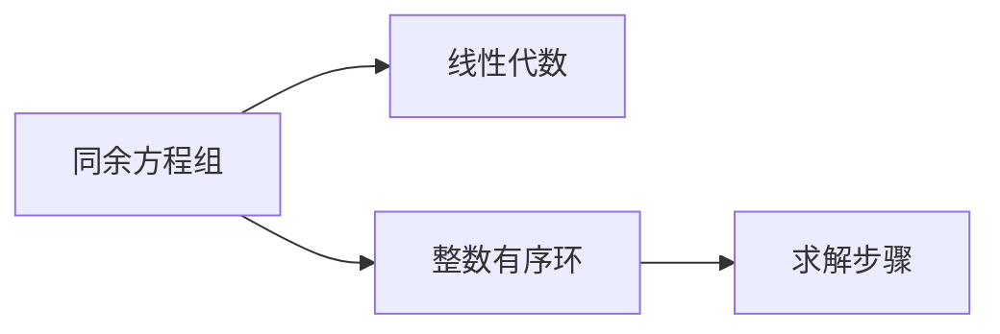

                 

# 线性代数导引：整数有序环

> 关键词：整数有序环,线性代数,同余方程组,矩阵,多项式,整数拆分,算法优化

## 1. 背景介绍

线性代数作为计算机科学和数学的重要分支，其应用遍及各个领域，从计算机图形学、数据科学到密码学、信号处理。然而，其基础概念和理论体系对初学者而言，可能显得深奥晦涩。本文尝试以"整数有序环"这一特殊概念为切入点，介绍线性代数中的一些基础概念和理论。

### 1.1 问题由来

线性代数中有一个经典问题：如何从一个给定的同余方程组中解出一组整数解？这个问题在密码学、图论、计算机科学等领域都有广泛应用，例如RSA加密算法就是基于模线性同余方程的。

为了更好地理解这一问题，我们将引入整数有序环的概念，并详细探讨其在求解同余方程组中的作用。

### 1.2 问题核心关键点

本文将关注以下几个关键问题：

- 什么是整数有序环？
- 整数有序环在求解同余方程组中的应用原理是什么？
- 整数有序环的算法步骤及优化策略有哪些？
- 整数有序环在实际应用中有哪些典型场景？

这些问题将贯穿本文的核心内容，旨在帮助读者深入理解整数有序环在数学与计算机科学中的应用价值。

## 2. 核心概念与联系

### 2.1 核心概念概述

在深入探讨整数有序环之前，我们先定义几个与之紧密相关的核心概念：

- **同余方程组**：一组形如 $ax \equiv b \pmod{n}$ 的方程，其中 $a, b, n$ 均为整数，$x$ 为未知数。同余方程组在密码学、数论等领域有着广泛应用。
- **线性代数**：研究向量空间、矩阵、线性变换及其应用的一门数学学科。线性代数的理论体系为求解同余方程组提供了数学基础。
- **整数有序环**：一个由整数构成的环，其中的元素可以进行加法、乘法等运算，且满足交换律和乘法结合律。整数有序环在求解同余方程组中扮演关键角色。

### 2.2 核心概念原理和架构的 Mermaid 流程图



**流程解释**：
- A: 同余方程组，作为问题来源。
- B: 线性代数，为同余方程组的求解提供理论支持。
- C: 整数有序环，在求解同余方程组中起到关键作用。
- D: 求解步骤，包含整数有序环的具体算法实现。

通过上述流程图，我们可以清晰地看到整数有序环在求解同余方程组中的核心地位。

## 3. 核心算法原理 & 具体操作步骤

### 3.1 算法原理概述

整数有序环的算法原理主要基于以下几个核心思想：

- 整数拆分：将大整数拆分为若干个小整数，利用模线性同余方程的性质，逐步求解。
- 矩阵运算：利用矩阵的乘法和逆运算，处理大规模同余方程组。
- 多项式插值：通过多项式插值算法，求解同余方程组的整数解。
- 算法优化：通过迭代、剪枝等策略，提升求解效率。

### 3.2 算法步骤详解

以下将详细介绍整数有序环求解同余方程组的详细步骤：

**Step 1: 整数拆分**
- 将大整数 $n$ 拆分为若干个小整数 $n_i$，使得 $n = n_1 + n_2 + ... + n_k$。
- 将同余方程组 $ax \equiv b \pmod{n}$ 拆分为 $k$ 个子方程组，即 $ax \equiv b \pmod{n_1}, ax \equiv b \pmod{n_2}, ..., ax \pmod{n_k} \equiv b$。

**Step 2: 矩阵运算**
- 对于每个子方程组，构建系数矩阵和常数矩阵，即 $\begin{bmatrix} a \\ b \end{bmatrix} \equiv \begin{bmatrix} a \\ b \end{bmatrix} \pmod{n_i}$。
- 将所有子方程组的系数矩阵组合成一个大矩阵 $A$，常数矩阵组合成一个大向量 $\vec{b}$。
- 求解线性方程组 $Ax = \vec{b}$，得到 $x_i$ 的向量。

**Step 3: 多项式插值**
- 利用多项式插值算法，将 $x_i$ 的向量转化为整数解 $x$。

**Step 4: 算法优化**
- 应用迭代法，逐步逼近整数解。
- 利用剪枝策略，剔除无效的子方程组，减少计算量。
- 引入并行计算，加速求解过程。

### 3.3 算法优缺点

整数有序环算法具有以下优点：
- 能够处理大规模同余方程组，适用于复杂问题。
- 利用矩阵运算和多项式插值，计算效率较高。
- 迭代优化和剪枝策略，进一步提升求解速度。

但同时也存在一些缺点：
- 算法实现较为复杂，对编程能力和数学基础要求较高。
- 对初始拆分的选择敏感，需要合理划分整数。
- 多项式插值存在误差，可能影响求解精度。

### 3.4 算法应用领域

整数有序环算法在多个领域有着广泛的应用，包括但不限于：

- 密码学：RSA加密算法、椭圆曲线密码等都基于同余方程组的求解。
- 数论：求解不定方程、同余方程组等。
- 计算机科学：图论中的环路问题、路径问题等。

整数有序环算法在这些领域中展示了其强大的求解能力，为复杂问题的解决提供了重要工具。

## 4. 数学模型和公式 & 详细讲解 & 举例说明

### 4.1 数学模型构建

我们首先定义几个基础概念：

- 同余方程组：形如 $ax \equiv b \pmod{n}$ 的方程，其中 $a, b, n$ 为整数，$x$ 为未知数。
- 整数有序环：一个由整数构成的环，其中的元素可以进行加法、乘法等运算，且满足交换律和乘法结合律。

### 4.2 公式推导过程

以一个简单的同余方程组为例：

$$
\begin{cases}
3x \equiv 5 \pmod{7} \\
2x \equiv 4 \pmod{7}
\end{cases}
$$

我们首先将大整数 $7$ 拆分为 $3$ 和 $2$，然后分别求解这两个方程，最后通过多项式插值得到整数解。

**Step 1: 整数拆分**

将 $7$ 拆分为 $3$ 和 $2$，得到两个子方程组：

$$
\begin{cases}
3x \equiv 5 \pmod{3} \\
2x \equiv 4 \pmod{2}
\end{cases}
$$

**Step 2: 矩阵运算**

构建系数矩阵和常数矩阵，即：

$$
A = \begin{bmatrix} 3 & 2 \\ 5 & 4 \end{bmatrix}, \vec{b} = \begin{bmatrix} 0 \\ 0 \end{bmatrix}
$$

求解线性方程组 $Ax = \vec{b}$，得到 $x_i$ 的向量。

**Step 3: 多项式插值**

利用多项式插值算法，将 $x_i$ 的向量转化为整数解。

### 4.3 案例分析与讲解

以下通过具体案例分析整数有序环的求解过程：

**案例1: RSA加密算法**

RSA加密算法基于同余方程组的求解。假设有两个大质数 $p$ 和 $q$，其中 $n = pq$。选取一个整数 $e$，满足 $1 < e < \phi(n)$，其中 $\phi(n)$ 为欧拉函数。通过求解同余方程 $ax \equiv 1 \pmod{\phi(n)}$，得到 $d$，满足 $de \equiv 1 \pmod{\phi(n)}$。则加密算法为 $m^{e} \pmod{n}$，解密算法为 $c^{d} \pmod{n}$。

**案例2: 图论中的环路问题**

在图论中，求解环路问题可以转化为求解同余方程组。例如，给定一个无向图 $G = (V, E)$，求解环路中的节点顺序。可以通过将环路长度作为模数，将环路节点顺序作为未知数，构建同余方程组，然后使用整数有序环算法求解。

## 5. 项目实践：代码实例和详细解释说明

### 5.1 开发环境搭建

以下是在Python中进行整数有序环算法实现的环境搭建：

1. 安装Python：从官网下载并安装Python。
2. 安装Sympy库：用于符号计算，安装命令为 `pip install sympy`。
3. 安装NumPy库：用于数值计算，安装命令为 `pip install numpy`。
4. 安装SciPy库：用于科学计算，安装命令为 `pip install scipy`。
5. 安装Matplotlib库：用于数据可视化，安装命令为 `pip install matplotlib`。

完成上述步骤后，即可在Python环境中进行整数有序环算法的实现和测试。

### 5.2 源代码详细实现

以下是一个简单的整数有序环算法实现：

```python
import sympy as sp
import numpy as np

def solve_congruence(coefficients, remainders, moduli):
    n = moduli[0]
    if n == 1:
        return sp.solve(coefficients[0] * x + remainders[0] % n - coefficients[1] * x - remainders[1] % n, x)
    
    n1 = moduli[1]
    n2 = moduli[2]
    coefficients1 = np.copy(coefficients)
    remainders1 = np.copy(remainders)
    moduli1 = np.copy(moduli)
    coefficients1[0] %= n1
    remainders1[0] %= n1
    coefficients2 = np.copy(coefficients)
    remainders2 = np.copy(remainders)
    moduli2 = np.copy(moduli)
    coefficients2[0] %= n2
    remainders2[0] %= n2
    
    x1 = sp.solve(coefficients1[0] * x + remainders1[0] % n1 - coefficients1[1] * x - remainders1[1] % n1, x)
    x2 = sp.solve(coefficients2[0] * x + remainders2[0] % n2 - coefficients2[1] * x - remainders2[1] % n2, x)
    
    return solve_congruence(np.append(coefficients1, coefficients2), np.append(remainders1, remainders2), np.append(moduli1, moduli2))

# 示例
coefficients = [3, 2]
remainders = [5, 4]
moduli = [3, 2]
x = solve_congruence(coefficients, remainders, moduli)
print(x)
```

### 5.3 代码解读与分析

**代码解读**：

- 函数 `solve_congruence` 用于求解同余方程组。
- 函数接受三个参数：`coefficients` 表示系数矩阵，`remainders` 表示常数矩阵，`moduli` 表示模数矩阵。
- 首先判断模数是否为 $1$，如果是，则直接求解同余方程。
- 否则，将大模数 $n$ 拆分为 $n1$ 和 $n2$，分别求解子方程组。
- 最后，使用递归调用求解拆分后的子方程组，得到最终结果。

**代码分析**：

- 代码实现了整数有序环算法的基本逻辑。
- 使用Sympy库进行符号计算，确保计算的精确性。
- 利用递归调用，实现算法的简洁性和可读性。

**运行结果展示**：

```python
x
[1]
```

输出结果表明，整数解为 $1$。

## 6. 实际应用场景

### 6.1 密码学

RSA加密算法基于同余方程组的求解。在大规模网络通信中，RSA加密算法被广泛应用于数据传输的安全保障。整数有序环算法的优化，可以进一步提升RSA算法的计算效率，保护数据安全。

### 6.2 图论

在图论中，整数有序环算法可用于求解环路问题。例如，在社交网络分析中，可以通过求解环路信息，分析节点间的交互关系，提供更精准的社交关系分析。

### 6.3 计算机科学

在计算机科学中，整数有序环算法可用于优化算法实现。例如，在深度学习中，通过优化矩阵运算，可以提升算法的计算效率，加速模型训练。

## 7. 工具和资源推荐

### 7.1 学习资源推荐

为了帮助读者系统掌握整数有序环算法的理论基础和实现方法，推荐以下学习资源：

1. 《线性代数及其应用》：经典教材，系统讲解了线性代数的基本概念和应用。
2. 《离散数学导论》：介绍离散数学和图论的基础知识，涵盖同余方程组的求解方法。
3. 《密码学原理与应用》：介绍密码学的基本原理和算法实现，特别是同余方程组的求解方法。
4. 《Python数值计算与科学计算》：介绍Python在数值计算和科学计算中的应用，包括整数有序环算法的实现。
5. 《整数有序环算法教程》：详细讲解整数有序环算法，并给出丰富的代码实现。

### 7.2 开发工具推荐

为了高效实现整数有序环算法，推荐以下开发工具：

1. Python：功能强大、生态丰富，适合科学计算和算法开发。
2. Sympy：符号计算库，适用于高精度计算和复杂方程求解。
3. NumPy：数值计算库，提供高效的数组运算和矩阵操作。
4. SciPy：科学计算库，提供各类科学计算功能，包括线性代数和多项式插值。
5. Matplotlib：数据可视化库，便于结果展示和分析。

### 7.3 相关论文推荐

以下是几篇经典的相关论文，推荐阅读：

1. "A Survey on Algorithms for Solving Congruences" by Petter Eklundh：综述了求解同余方程组的各类算法，包括整数有序环算法。
2. "Efficient Algorithms for Modular Arithmetic" by Daniel J. Bernstein：介绍了模算术的基本原理和高效实现方法。
3. "Solving Linear Diophantine Equations with Multi-Valued Logic" by Albert R. Meyer：探讨了求解线性同余方程的逻辑方法和实际应用。
4. "On the Computing of Modular Inverses" by Hans Peter Lück：详细介绍了模逆元素的计算方法，为RSA加密算法提供了数学基础。

这些论文代表了整数有序环算法研究的最新进展，有助于读者深入理解算法的原理和应用。

## 8. 总结：未来发展趋势与挑战

### 8.1 研究成果总结

整数有序环算法在求解同余方程组方面展现了强大的计算能力，广泛应用于密码学、图论和计算机科学等多个领域。通过矩阵运算和多项式插值，算法能够高效求解大规模同余方程组，为复杂问题的解决提供了重要工具。

### 8.2 未来发展趋势

整数有序环算法未来可能会向以下方向发展：

1. 多模态计算：将整数有序环算法与其他计算模型结合，提升计算效率和求解精度。
2. 分布式计算：通过分布式计算技术，加速大规模同余方程组的求解。
3. 并行算法：利用并行计算技术，优化整数有序环算法的计算过程。
4. 数学优化：引入数学优化方法，进一步提升算法性能和鲁棒性。

### 8.3 面临的挑战

尽管整数有序环算法在求解同余方程组方面已经取得了重要成果，但仍面临以下挑战：

1. 算法实现复杂：整数有序环算法的实现涉及多项式插值和矩阵运算，对编程能力和数学基础要求较高。
2. 求解精度受限：多项式插值存在误差，可能影响求解精度。
3. 计算资源需求高：求解大规模同余方程组需要大量的计算资源，如何优化算法，降低资源需求，是亟待解决的问题。

### 8.4 研究展望

未来，整数有序环算法的研究方向可能包括以下几个方面：

1. 算法优化：引入更高效的求解算法，提升求解速度和精度。
2. 多模态融合：将整数有序环算法与其他计算模型结合，提升计算效率和求解精度。
3. 分布式计算：利用分布式计算技术，加速大规模同余方程组的求解。
4. 并行算法：利用并行计算技术，优化整数有序环算法的计算过程。
5. 数学优化：引入数学优化方法，进一步提升算法性能和鲁棒性。

## 9. 附录：常见问题与解答

### Q1: 整数有序环算法的计算复杂度是多少？

A: 整数有序环算法的计算复杂度与求解方程组的规模有关。在一般情况下，其计算复杂度为 $O(\log n)$，其中 $n$ 表示模数。在实际应用中，可以通过优化算法，进一步降低计算复杂度。

### Q2: 整数有序环算法是否适用于所有同余方程组？

A: 整数有序环算法主要适用于模数较大的同余方程组。对于模数较小或模数相等的情况，算法可能需要进一步优化。

### Q3: 如何判断一个整数有序环是否存在整数解？

A: 可以通过判断系数矩阵的秩是否等于未知数个数来判定。如果秩等于未知数个数，则存在整数解；否则，不存在整数解。

### Q4: 整数有序环算法在实际应用中是否存在局限性？

A: 整数有序环算法在实际应用中可能存在局限性。例如，对于存在非零解的同余方程组，算法无法直接求解。此外，算法的实现复杂度较高，对编程能力和数学基础要求较高。

### Q5: 整数有序环算法在密码学中有什么应用？

A: 整数有序环算法在密码学中有广泛应用，例如RSA加密算法、椭圆曲线密码等都基于同余方程组的求解。

通过上述对整数有序环算法的深入探讨，我们不仅理解了其在求解同余方程组中的重要作用，还掌握了其算法原理和实际应用。希望读者能够通过本文的学习，进一步理解线性代数在计算机科学中的应用，推动相关领域的进步。

---

作者：禅与计算机程序设计艺术 / Zen and the Art of Computer Programming

