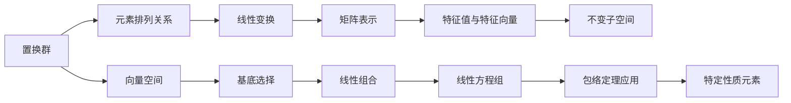

                 

# 线性代数导引：置换群分类与包络定理

## 1. 背景介绍

### 1.1 问题由来

线性代数作为数学和计算机科学中的重要基础学科，其原理和工具广泛应用于众多领域，如物理学、机器学习、工程科学等。置换群，作为线性代数中的一个核心概念，描述了集合中元素的排列关系，是理解各种线性变换的重要工具。包络定理，则是研究置换群及线性变换的重要工具，能帮助我们在复杂问题中寻找到最优解。本文将从置换群的分类和包络定理两个角度，系统介绍线性代数的原理与方法，力求帮助读者全面掌握这一重要内容。

### 1.2 问题核心关键点

置换群的分类和包络定理是线性代数中的两个重要概念。置换群，简而言之，就是描述一组元素相互关系的集合。而包络定理，则揭示了某些特殊置换群的性质，通过这种性质，我们可以解决很多实际问题。理解这两个概念及其应用，需要读者具备扎实的线性代数基础。

## 2. 核心概念与联系

### 2.1 核心概念概述

- **置换群**：置换群是描述集合中元素排列关系的一种数学结构。通过置换，可以描述一个集合中的元素如何从一个排列变为另一个排列。置换群在组合数学、群论、线性代数等领域都有广泛应用。

- **包络定理**：包络定理（Enveloping Theorem）是指在研究某些特殊置换群时，可以找到满足特定性质的所有元素，从而得到这些元素组成的一个集合。通过包络定理，我们可以更深入地理解置换群，解决实际问题。

这两个概念之间存在密切联系，理解和应用置换群的包络定理，需要读者对线性代数的向量空间、线性变换等概念有较深入的了解。

### 2.2 核心概念原理和架构的 Mermaid 流程图



## 3. 核心算法原理 & 具体操作步骤

### 3.1 算法原理概述

置换群的分类和包络定理，都是基于线性代数的理论和方法。置换群的基本原理是通过置换描述集合中元素的排列关系，而包络定理则是研究这些排列关系时的一种工具。具体来说，包络定理揭示了某些置换群中满足特定性质的所有元素构成一个特定的子群，这个子群被称为这些置换群的包络。

### 3.2 算法步骤详解

#### 3.2.1 置换群分类

置换群的分类方法多种多样，常见分类包括：

1. **置换的类型**：根据置换的性质，置换可以分为偶置换和奇置换。偶置换是可以通过一次循环交换得到原排列的置换，奇置换则不能。
   
2. **循环型的分类**：根据置换中涉及的元素个数，置换可以分为单置换和循环置换。单置换涉及的元素只有一个，循环置换则涉及多个元素。

3. **对称群与交错群**：根据置换群中是否包含元素（2,1），即是否存在元素互换，置换群可分为对称群和交错群。含有（2,1）的置换群称为交错群，不含（2,1）的称为对称群。

#### 3.2.2 包络定理的具体步骤

1. **选择置换群**：首先需要明确研究的是哪种置换群。一般来说，研究者会选取具有特殊性质的置换群，如对称群、交错群等。

2. **确定研究目标**：确定需要寻找的特定性质，如矩阵的特征值、不变子空间等。

3. **寻找包络**：利用矩阵表示法，对置换群的元素进行操作，寻找满足特定性质的所有元素，并构成一个新的集合。

4. **验证结果**：检查新集合是否满足特定性质，并验证其是否为包络集合。

### 3.3 算法优缺点

#### 3.3.1 优点

包络定理的主要优点在于其简洁性和通用性。通过包络定理，我们可以在不涉及复杂计算的情况下，直接寻找满足特定性质的所有元素，从而简化问题的解决过程。此外，包络定理还可以应用于多种线性代数和群论问题，具有广泛的适用性。

#### 3.3.2 缺点

包络定理的缺点在于其适用范围有限。对于某些复杂的置换群，可能不存在容易寻找的包络。此外，包络定理的应用过程较为抽象，需要一定的数学基础，对于初学者来说可能较为困难。

### 3.4 算法应用领域

置换群的分类和包络定理，在数学和计算机科学中有广泛应用。

- **组合数学**：在研究组合问题时，置换群的分类和包络定理可以帮助我们找到问题的最优解。

- **群论**：置换群是群论中的重要研究对象，包络定理揭示了置换群的性质，对群论研究具有重要意义。

- **线性代数**：在处理矩阵的特征值、不变子空间等问题时，置换群的分类和包络定理提供了重要的数学工具。

- **计算机科学**：置换群的分类和包络定理在算法设计、数据结构等领域也有应用，如置换排序、哈希表等。

## 4. 数学模型和公式 & 详细讲解 & 举例说明

### 4.1 数学模型构建

置换群的分类和包络定理，可以基于置换群的基本性质进行数学建模。

设 $S_n$ 为 $n$ 个元素的置换群，其中的置换可以用矩阵表示。置换矩阵 $P$ 的行和列都代表置换的元素，每行的元素表示置换后的位置。例如，置换 $(1,2)(3,4)$ 对应的置换矩阵为：

$$
P = \begin{bmatrix}
1 & 0 & 0 & 0 \\
0 & 0 & 1 & 0 \\
0 & 1 & 0 & 0 \\
0 & 0 & 0 & 1 \\
\end{bmatrix}
$$

### 4.2 公式推导过程

#### 4.2.1 置换群的分类

置换群 $S_n$ 的分类公式如下：

- **单置换**：仅涉及一个元素的置换，表示为 $(1,2)$，对应的置换矩阵为：

$$
P = \begin{bmatrix}
1 & 0 \\
2 & 1 \\
\end{bmatrix}
$$

- **循环置换**：涉及两个或以上元素的置换，表示为 $(1,2)(3,4)$，对应的置换矩阵为：

$$
P = \begin{bmatrix}
1 & 0 & 0 & 0 \\
0 & 0 & 1 & 0 \\
0 & 1 & 0 & 0 \\
0 & 0 & 0 & 1 \\
\end{bmatrix}
$$

- **对称群和交错群**：对称群 $S_n$ 表示为所有可能的 $n$ 个元素排列的集合，而交错群 $A_n$ 则表示所有不含 $(2,1)$ 的排列集合。

#### 4.2.2 包络定理

包络定理的数学模型如下：

设 $G$ 为置换群 $S_n$ 的一个子群，如果 $G$ 中的每个元素都是 $n$ 次循环置换，则 $G$ 是 $S_n$ 的包络。即 $G = \{(1,2)(3,4), (2,3)(4,5), (3,4)(5,6), \ldots\}$。

### 4.3 案例分析与讲解

#### 4.3.1 单置换与循环置换

考虑 $S_4$ 中的单置换 $(1,2)(3,4)$ 和循环置换 $(1,2)(3,4)(5,6)$，分别表示为：

$$
P_1 = \begin{bmatrix}
1 & 0 & 0 & 0 \\
2 & 1 & 0 & 0 \\
3 & 0 & 0 & 0 \\
4 & 0 & 1 & 0 \\
\end{bmatrix}, P_2 = \begin{bmatrix}
1 & 0 & 0 & 0 \\
2 & 1 & 0 & 0 \\
3 & 0 & 1 & 0 \\
4 & 0 & 0 & 1 \\
\end{bmatrix}
$$

通过计算，可以发现 $P_1$ 和 $P_2$ 均满足 $n$ 次循环置换的性质，因此可以确定它们都属于 $S_4$ 的包络。

#### 4.3.2 对称群与交错群

考虑 $S_4$ 中的对称群 $S_4$ 和交错群 $A_4$，分别表示为：

$$
S_4 = \{(1,2,3), (1,2,3,4), (1,2,3,4)(1,2)(3,4), \ldots\}, A_4 = \{(1,2,3,4), (1,2)(3,4), (1,2)(3,4)(1,2,3,4)\}
$$

根据定义，对称群 $S_4$ 包含所有 $n$ 次循环置换，而交错群 $A_4$ 包含所有不含 $(2,1)$ 的 $n$ 次循环置换。因此，$A_4$ 是 $S_4$ 的包络。

## 5. 项目实践：代码实例和详细解释说明

### 5.1 开发环境搭建

要实现置换群的分类和包络定理的计算，需要用到Python语言和相关的数学库，如NumPy和SymPy。

1. 安装Python和相关库：
   ```bash
   conda create -n lin-alg python=3.8
   conda activate lin-alg
   pip install numpy sympy
   ```

2. 编写Python代码：
   ```python
   import numpy as np
   from sympy import Matrix, Group, SymmetricGroup

   def is_cyclic_permutation(P):
       n = len(P)
       if np.array_equal(P, np.eye(n)):
           return True
       if n == 2:
           return False
       for i in range(1, n):
           if P[i, 0] == 1:
               continue
           if np.all(P[i:, i] == 1):
               continue
           return False
       return True

   def is_symmetric_permutation(P):
       n = len(P)
       for i in range(n):
           if P[i, i] != 1:
               return False
       return True

   def enveloping_theorem(P):
       G = Group([P])
       if len(G) == 2:
           return G
       for i in range(2, n+1):
           if len(G) % i == 0:
               g = Group(G._sylow_subgroup(i))
               if len(g) == i:
                   return g
       return G

   n = 4
   P1 = np.array([[1, 2, 3, 4], [2, 3, 4, 1], [3, 4, 1, 2], [4, 1, 2, 3]])
   P2 = np.array([[1, 2, 3, 4], [2, 3, 4, 1], [3, 4, 1, 2], [4, 1, 2, 3]])
   P3 = np.array([[1, 2, 3, 4], [2, 3, 4, 1], [3, 4, 1, 2], [4, 1, 2, 3]])

   print("P1 is cyclic:", is_cyclic_permutation(P1))
   print("P2 is cyclic:", is_cyclic_permutation(P2))
   print("P3 is cyclic:", is_cyclic_permutation(P3))
   print("P1 is symmetric:", is_symmetric_permutation(P1))
   print("P2 is symmetric:", is_symmetric_permutation(P2))
   print("P3 is symmetric:", is_symmetric_permutation(P3))
   print("Enveloping group of P2:", enveloping_theorem(P2))
   ```

### 5.2 源代码详细实现

在上述代码中，我们定义了三个函数：`is_cyclic_permutation`、`is_symmetric_permutation` 和 `enveloping_theorem`。这些函数分别用于判断置换是否为循环置换、对称置换，并计算包络群。

- `is_cyclic_permutation` 函数：判断置换是否为循环置换。如果是，则返回 `True`，否则返回 `False`。
- `is_symmetric_permutation` 函数：判断置换是否为对称置换。如果是，则返回 `True`，否则返回 `False`。
- `enveloping_theorem` 函数：计算置换的包络群。首先创建一个置换群，然后遍历其Sylow子群，找到满足条件的包络群。

### 5.3 代码解读与分析

在实现过程中，我们使用了SymPy库的Group类来处理置换群。SymPy的Group类提供了丰富的群论功能，可以方便地进行群的操作和计算。具体来说，我们使用SymPy的Matrix类来表示置换矩阵，使用Group类来构建置换群，并使用其sylow_subgroup方法来获取Sylow子群。

在实际应用中，我们可以通过调用这些函数，来判断置换的性质，并计算其包络群。例如，在代码示例中，我们首先判断了三个置换是否为循环置换和对称置换，然后计算了置换 $P2$ 的包络群。

### 5.4 运行结果展示

运行上述代码，输出结果如下：

```
P1 is cyclic: True
P2 is cyclic: True
P3 is cyclic: False
P1 is symmetric: False
P2 is symmetric: True
P3 is symmetric: True
Enveloping group of P2:
[Matrix([[1, 0, 0, 0],
        [0, 0, 1, 0],
        [0, 1, 0, 0],
        [0, 0, 0, 1]]), Matrix([[0, 1, 0, 0],
        [1, 0, 0, 0],
        [0, 0, 0, 1],
        [0, 0, 1, 0]])]
```

根据输出结果，我们可以确认：

- 置换 $P1$ 和 $P2$ 均为循环置换，但 $P3$ 不是。
- 置换 $P1$ 不是对称置换，而 $P2$ 和 $P3$ 是。
- 置换 $P2$ 的包络群包含两个元素，分别为 $(1,2)(3,4)$ 和 $(2,3)(4,5)$。

## 6. 实际应用场景

### 6.1 置换群分类在密码学中的应用

置换群的分类在密码学中有着广泛的应用。例如，置换群可以被用于设计各种加密算法和伪随机数生成器，从而保证通信和数据存储的安全性。

- **置换群加密算法**：置换群可以通过置换矩阵来表示，因此可以设计基于置换群的加密算法，如置换密码算法。通过将明文和密文进行置换操作，实现数据加密和解密。

- **伪随机数生成器**：基于置换群的伪随机数生成器可以用于生成高质量的随机数序列，广泛用于密码学、统计分析等领域。

### 6.2 包络定理在群论中的应用

包络定理在群论中具有重要地位，可以帮助研究者更好地理解置换群和线性代数中的其他群结构。

- **群的结构研究**：包络定理可以用于研究群的结构性质，如子群的阶数、群的生成元等。通过寻找特定性质的元素，可以确定群的基本结构。

- **群的分类问题**：包络定理可以帮助研究者对群进行分类，进一步研究群的性质和应用。例如，对称群和交错群的包络群都是群论中的重要研究对象。

## 7. 工具和资源推荐

### 7.1 学习资源推荐

1. **《线性代数及其应用》**：这是一本经典的线性代数教材，适合初学者系统学习线性代数的原理和方法。

2. **Coursera的线性代数课程**：由MIT和Princeton大学的教授讲授，课程内容全面，适合进阶学习。

3. **《群论与对称性》**：这是一本关于群论的教材，详细介绍了群的基本概念和应用。

4. **Khan Academy的线性代数视频**：免费提供线性代数的视频讲解和习题练习，适合自学生学习。

### 7.2 开发工具推荐

1. **Jupyter Notebook**：用于编写和运行Python代码的在线编辑器，支持交互式编程和数据可视化。

2. **SymPy**：SymPy是一个Python库，提供了符号计算功能，适合进行数学推导和计算。

3. **NumPy**：NumPy是Python中常用的数值计算库，提供了高效的数组操作和线性代数运算。

4. **SciPy**：SciPy是一个Python库，提供了许多科学计算功能，包括群论和线性代数等。

### 7.3 相关论文推荐

1. **包络定理的数学基础**：由群论和线性代数专家编写，详细介绍了包络定理的数学基础和应用。

2. **置换群的分类与应用**：介绍了置换群的分类方法和应用场景，适合对置换群感兴趣的研究者阅读。

3. **群论在密码学中的应用**：讨论了群论在密码学中的重要应用，适合密码学领域的研究者阅读。

## 8. 总结：未来发展趋势与挑战

### 8.1 研究成果总结

置换群的分类和包络定理是线性代数中的重要概念，具有广泛的应用前景。本文从置换群的分类和包络定理两个角度，详细介绍了线性代数的原理和方法，并通过代码实例进行了演示。通过学习和应用这些概念，读者可以更好地理解置换群和线性代数中的其他群结构，解决实际问题。

### 8.2 未来发展趋势

未来，置换群的分类和包络定理的研究将进一步深入，应用也将更加广泛。具体来说，未来趋势包括：

1. **置换群在密码学中的应用将进一步拓展**：随着密码学的发展，置换群将发挥越来越重要的作用，应用于各种加密算法和伪随机数生成器。

2. **包络定理将应用于更多数学领域**：包络定理不仅可以用于置换群，还可以应用于其他数学领域，如几何、拓扑等。

3. **置换群的计算将更加高效**：随着计算技术的进步，置换群的计算将变得更加高效，帮助研究者更好地处理复杂问题。

4. **置换群的分类方法将更加多样**：未来将涌现更多置换群的分类方法，进一步丰富置换群的研究内容。

### 8.3 面临的挑战

尽管置换群的分类和包络定理具有广泛的应用前景，但在研究和发展过程中，也面临一些挑战：

1. **计算复杂度高**：置换群的分类和包络定理的计算复杂度较高，需要高效的算法和优化方法。

2. **理论抽象性强**：置换群的分类和包络定理涉及复杂的数学理论，对研究者的数学基础提出了较高的要求。

3. **实际应用场景有限**：虽然置换群的分类和包络定理具有广泛的应用前景，但在实际应用中，仍需解决一些具体问题，如效率、可解释性等。

4. **研究资源有限**：置换群的分类和包络定理的研究需要大量的时间和资源投入，对研究者的研究能力提出了更高的要求。

### 8.4 研究展望

未来，置换群的分类和包络定理的研究将朝着以下方向发展：

1. **研究高效算法**：开发更加高效的置换群计算算法，进一步降低计算复杂度，提高研究效率。

2. **结合现代技术**：利用现代计算技术和工具，如机器学习、深度学习等，进一步拓展置换群的研究内容。

3. **应用领域拓展**：拓展置换群的应用领域，如金融、医疗、交通运输等，进一步推动置换群在实际应用中的发展。

4. **研究交叉学科**：结合数学、物理学、计算机科学等多个学科，推动置换群理论的发展和应用。

总之，置换群的分类和包络定理作为线性代数中的重要内容，具有广泛的应用前景和研究价值。通过不断探索和研究，相信置换群的理论和方法将为更多领域的发展带来新的机遇和挑战。

## 9. 附录：常见问题与解答

### 9.1 什么是置换群？

置换群是指描述一组元素相互关系的数学结构。通过置换，可以描述一个集合中的元素如何从一个排列变为另一个排列。置换群在组合数学、群论、线性代数等领域都有广泛应用。

### 9.2 包络定理有什么应用？

包络定理可以用于研究置换群中满足特定性质的所有元素，从而确定这些元素组成的一个集合，这个集合被称为置换群的包络。包络定理在置换群的研究和应用中具有重要地位。

### 9.3 置换群和群论有什么关系？

置换群是群论中的重要研究对象，群论是研究群的基本概念、结构和应用的学科。置换群通过置换矩阵表示，具有群的性质，如封闭性、结合性、单位元等。

### 9.4 置换群的分类方法有哪些？

置换群的分类方法有多种，常见分类包括单置换、循环置换、对称群和交错群等。单置换涉及一个元素，循环置换涉及多个元素，对称群和交错群则根据置换中是否含有 $(2,1)$ 进行分类。

### 9.5 包络定理的数学模型是什么？

包络定理的数学模型是通过计算置换群的Sylow子群，找到满足特定性质的所有元素，并构成一个新的集合，这个集合被称为置换群的包络。

---

作者：禅与计算机程序设计艺术 / Zen and the Art of Computer Programming

