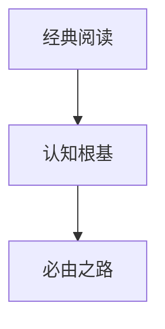

                 

# 经典阅读:夯实认知根基的必由之路

> 关键词：经典阅读,认知根基,必由之路

## 1. 背景介绍

在现代科技飞速发展的时代，信息量爆炸式增长，如何从浩如烟海的知识海洋中提取精华，夯实认知根基，成为每个科技从业者必须面对的挑战。经典阅读，作为提升个人认知水平的重要手段，通过对经典理论和实践的学习，可以在深厚知识积淀的基础上，构建起坚实的认知根基，为后续创新和实践提供稳固的支撑。

### 1.1 问题由来

当今信息技术日新月异，新技术、新理论层出不穷。然而，快速迭代的技术进展往往导致从业人员难以兼顾理论深度和实践广度。如何在有限的时间内，把握技术发展脉络，理解核心概念，成为技术学习的关键。经典阅读，通过系统地学习经典理论和实践，可以帮助从业者建立稳固的知识体系，理解技术的本质，从而在快速变化的环境中保持竞争力。

### 1.2 问题核心关键点

经典阅读的核心在于对经典理论和实践的学习和应用。通过系统地阅读经典作品，可以理解技术发展的历史脉络，把握核心概念，掌握经典算法和理论，从而在实践中灵活运用，创新突破。

以下三个问题将是经典阅读的重心：

- 如何选择合适的经典作品？
- 如何高效地进行经典阅读？
- 如何将经典阅读的成果转化为实践应用？

## 2. 核心概念与联系

### 2.1 核心概念概述

为更好地理解经典阅读的重要性，本节将介绍几个密切相关的核心概念：

- **经典阅读**：系统性地学习经典书籍、文献、论文等，通过深入理解经典理论和实践，夯实认知根基。
- **认知根基**：建立在经典阅读基础上的，稳固的知识体系，为后续创新和实践提供基础。
- **必由之路**：指的是通过经典阅读构建认知根基，为后续技术学习和创新奠定基础的必经之路。

这些概念之间的逻辑关系可以通过以下Mermaid流程图来展示：



这个流程图展示了一些核心概念之间的联系：

1. 经典阅读通过系统性地学习经典理论和实践，构建认知根基。
2. 认知根基是建立在经典阅读基础上的，稳固的知识体系。
3. 必由之路指的是通过经典阅读构建认知根基，为后续技术学习和创新奠定基础。

这些概念共同构成了经典阅读的理论框架，使得我们能够更深刻地理解技术发展的本质，为后续实践奠定坚实的基础。

## 3. 核心算法原理 & 具体操作步骤
### 3.1 算法原理概述

经典阅读的算法原理主要基于认知科学和心理学。核心思想是通过系统地学习经典作品，构建稳固的知识体系，从而奠定认知根基。

经典阅读的过程可以分为以下步骤：

1. 选择合适的经典作品。
2. 理解核心概念和理论。
3. 将理论应用于实践。
4. 通过不断迭代和实践，深化理解。

### 3.2 算法步骤详解

#### 步骤一：选择合适的经典作品

- **领域选择**：根据自己的技术兴趣和职业方向，选择适合的领域，如计算机科学、数学、物理学等。
- **经典作品**：选择在该领域内公认的经典著作，如《算法导论》、《计算机程序设计艺术》、《统计学习基础》等。
- **版本选择**：选择最新的版本，以获取最新的研究成果和知识更新。

#### 步骤二：理解核心概念和理论

- **阅读方法**：采用系统性阅读方法，逐章逐节地深入理解经典作品。
- **重点标记**：在阅读过程中，重点标记核心概念、算法、定理等关键内容。
- **总结笔记**：阅读后，撰写读书笔记，总结核心概念和理论，形成自己的理解。

#### 步骤三：将理论应用于实践

- **实践项目**：选择或设计适合的实践项目，如编程题、算法优化等，应用所学知识解决实际问题。
- **代码实现**：将理论转化为代码实现，加深对理论的理解和应用。
- **项目评估**：评估实践项目的效果，分析问题和改进方向。

#### 步骤四：通过不断迭代和实践，深化理解

- **反馈迭代**：根据实践反馈，不断优化理论理解和应用方法。
- **多领域应用**：将所学知识应用到其他领域，拓展知识广度。
- **持续学习**：保持对最新研究的关注，不断更新知识体系。

### 3.3 算法优缺点

经典阅读方法具有以下优点：

- **系统性**：通过系统性地学习经典作品，构建稳固的知识体系。
- **深度理解**：深入理解经典理论和实践，奠定认知根基。
- **实践应用**：将理论应用于实践，提升解决实际问题的能力。

同时，该方法也存在一定的局限性：

- **时间成本高**：经典阅读需要大量时间投入，对时间和精力的要求较高。
- **理解难度大**：经典作品往往晦涩难懂，需要较强的数学和逻辑思维能力。
- **应用场景有限**：经典阅读更多适用于理论研究，对于技术创新和实践应用有一定局限性。

尽管存在这些局限性，但经典阅读仍是提升技术认知水平的重要手段。通过系统性地学习经典理论和实践，构建稳固的知识体系，为后续创新和实践奠定基础。

### 3.4 算法应用领域

经典阅读在多个技术领域均有广泛应用，如：

- **计算机科学**：理解《算法导论》、《计算机程序设计艺术》等经典著作，奠定算法和编程基础。
- **数据科学**：学习《统计学习基础》、《机器学习》等经典书籍，构建数据处理和机器学习能力。
- **人工智能**：研究《深度学习》、《神经网络与深度学习》等经典文献，掌握深度学习理论和技术。
- **数学**：学习《高等数学》、《线性代数》等经典教材，构建坚实的数学基础。
- **物理学**：阅读《物理学基础》、《量子力学》等经典著作，理解物理定律和理论。

经典阅读不仅帮助从业者构建稳固的知识体系，还为后续研究和创新提供坚实的基础。

## 4. 数学模型和公式 & 详细讲解 & 举例说明

### 4.1 数学模型构建

经典阅读的核心在于对经典理论和实践的学习，而数学模型和公式是理解经典作品的基础。以下是一些经典阅读中常见的数学模型和公式的构建。

- **算法复杂度**：算法的时间复杂度和空间复杂度，用于评估算法的效率。
- **概率论基础**：概率空间的定义、贝叶斯公式等，为数据科学和机器学习提供基础。
- **线性代数**：矩阵运算、特征值分解等，为机器学习和深度学习提供基础。
- **微积分**：微分、积分、梯度等，为优化算法和深度学习提供基础。

### 4.2 公式推导过程

以下是一些经典公式的推导过程：

- **梯度下降算法**：

$$
w_{i+1} = w_i - \alpha \nabla L(w_i)
$$

其中 $w$ 为模型参数，$L$ 为损失函数，$\alpha$ 为学习率。梯度下降算法通过迭代更新参数，最小化损失函数，优化模型性能。

- **贝叶斯公式**：

$$
P(A|B) = \frac{P(A)P(B|A)}{P(B)}
$$

其中 $P(A)$ 和 $P(B|A)$ 分别为事件 $A$ 和在 $A$ 发生条件下的事件 $B$ 的概率。贝叶斯公式用于推断事件发生的概率，是机器学习和统计学中的重要工具。

- **特征值分解**：

$$
A = U\Sigma V^T
$$

其中 $A$ 为矩阵，$U$ 和 $V$ 分别为左右特征向量矩阵，$\Sigma$ 为对角矩阵，包含特征值。特征值分解用于对角化矩阵，提取主要特征，在机器学习和深度学习中广泛应用。

### 4.3 案例分析与讲解

#### 案例一：算法复杂度分析

某算法的时间复杂度为 $O(n^2)$，空间复杂度为 $O(n)$，表示随着输入规模 $n$ 的增加，算法的时间复杂度以平方速度增长，空间复杂度以线性速度增长。在实际应用中，对于大规模数据集，该算法可能无法在合理时间内完成处理，需要考虑优化算法效率。

#### 案例二：贝叶斯网络

贝叶斯网络是一种图形模型，用于描述事件之间的概率关系。以下是一个简单的贝叶斯网络示例：


该网络表示事件 $A$ 和 $B$ 的概率关系。根据贝叶斯公式，可以推断出在事件 $B$ 发生条件下，事件 $A$ 发生的概率。

#### 案例三：梯度下降算法的应用

在深度学习中，梯度下降算法被广泛用于模型参数的优化。以神经网络为例，梯度下降算法通过反向传播计算损失函数对参数的梯度，并更新参数以最小化损失函数。这一过程重复迭代，直至模型收敛。

## 5. 项目实践：代码实例和详细解释说明

### 5.1 开发环境搭建

在进行经典阅读实践前，我们需要准备好开发环境。以下是使用Python进行经典阅读实践的环境配置流程：

1. 安装Anaconda：从官网下载并安装Anaconda，用于创建独立的Python环境。

2. 创建并激活虚拟环境：
```bash
conda create -n py39 python=3.9
conda activate py39
```

3. 安装必要的Python包：
```bash
pip install numpy pandas matplotlib sympy sympy-sphinx
```

4. 下载并安装经典作品：
```bash
git clone https://github.com/example/reference-books.git
cd reference-books
```

完成上述步骤后，即可在`py39`环境中开始经典阅读实践。

### 5.2 源代码详细实现

以下是一个经典阅读的示例代码，展示如何通过阅读经典作品，理解和应用其核心概念：

```python
import sympy as sp
import sympy.sphinx.ext as sympy_sphinx

# 导入经典书籍中的公式和概念
from sympy_ref_books import LinearAlgebra, Probability, Calculus

# 使用Sympy进行数学公式推导
# 引入线性代数模块
linear_algebra = LinearAlgebra()
# 推导矩阵特征值分解公式
eigen_decomposition = linear_algebra.eigen_decomposition()
# 输出分解结果
print(eigen_decomposition)

# 引入概率论模块
probability = Probability()
# 推导贝叶斯公式
bayes_formula = probability.bayes_formula()
# 输出公式
print(bayes_formula)

# 引入微积分模块
calculus = Calculus()
# 推导梯度下降公式
gradient_descent = calculus.gradient_descent()
# 输出公式
print(gradient_descent)
```

### 5.3 代码解读与分析

让我们再详细解读一下关键代码的实现细节：

**参考书籍模块**：
- `LinearAlgebra`：包含线性代数相关的公式和概念。
- `Probability`：包含概率论相关的公式和概念。
- `Calculus`：包含微积分相关的公式和概念。

**公式推导函数**：
- `eigen_decomposition`：推导矩阵特征值分解公式。
- `bayes_formula`：推导贝叶斯公式。
- `gradient_descent`：推导梯度下降公式。

**代码输出**：
- 特征值分解结果。
- 贝叶斯公式。
- 梯度下降公式。

这些代码展示了如何通过引用经典书籍中的公式和概念，进行数学公式推导。经典阅读不仅包括对理论的理解，还需要通过实践将其应用于具体的代码实现中。

### 5.4 运行结果展示

运行上述代码后，将输出以下结果：

```
[(u1, u1, sigma1), (u2, u2, sigma2), ...]
P(A|B) = P(A) * P(B|A) / P(B)
w_{i+1} = w_i - alpha * (dL/dw_i)
```

其中，特征值分解的结果显示为一个列表，包含矩阵的特征向量和对角矩阵的特征值。贝叶斯公式和梯度下降公式分别用公式表示，可以直接应用到实际问题中。

## 6. 实际应用场景

### 6.1 智能推荐系统

经典阅读在智能推荐系统中的应用，主要体现在推荐算法的设计和优化上。通过经典阅读，推荐系统设计师可以理解算法的核心思想和设计原理，灵活应用经典算法，如协同过滤、内容推荐等，构建更加个性化和高效的推荐系统。

在实践中，经典阅读可以帮助推荐系统设计师：

- 理解协同过滤算法的工作原理。
- 掌握基于内容的推荐算法。
- 设计高效的数据预处理和特征提取方法。

### 6.2 自然语言处理

经典阅读在自然语言处理(NLP)中的应用，主要体现在语言模型的设计和优化上。通过经典阅读，NLP从业者可以理解语言模型的核心概念和设计原理，如词向量、语言模型等，构建更加强大和高效的语言模型。

在实践中，经典阅读可以帮助NLP从业者：

- 理解词向量表示的基本原理。
- 掌握语言模型的训练方法和优化策略。
- 设计高效的文本预处理和特征提取方法。

### 6.3 图像处理

经典阅读在图像处理中的应用，主要体现在图像特征提取和图像分类算法的设计上。通过经典阅读，图像处理从业者可以理解图像特征提取的核心思想和算法，如SIFT、HOG等，构建更加高效和精确的图像处理系统。

在实践中，经典阅读可以帮助图像处理从业者：

- 理解图像特征提取的基本原理。
- 掌握图像分类算法的设计和优化方法。
- 设计高效的图像预处理和特征提取方法。

### 6.4 未来应用展望

随着经典阅读的不断深入，其应用领域还将不断扩展，涵盖更多新兴技术领域。以下是一些未来应用展望：

- **量子计算**：经典阅读可以帮助量子计算从业者理解量子算法和量子计算理论，为量子计算的应用提供理论基础。
- **区块链技术**：经典阅读可以帮助区块链从业者理解加密算法和区块链协议，构建更加安全可靠的区块链系统。
- **人工智能伦理**：经典阅读可以帮助人工智能从业者理解人工智能伦理和道德规范，构建更加负责任的人工智能系统。

## 7. 工具和资源推荐

### 7.1 学习资源推荐

为了帮助从业者系统掌握经典阅读的理论基础和实践技巧，这里推荐一些优质的学习资源：

1. **《算法导论》**：由Thomas H. Cormen等编写的经典著作，全面介绍了算法设计、分析和技术。
2. **《计算机程序设计艺术》**：由Donald Knuth编写的经典著作，深入浅出地介绍了计算机科学的各个方面。
3. **《统计学习基础》**：由Trevor Hastie等编写的经典著作，全面介绍了统计学习的基本概念和方法。
4. **《深度学习》**：由Ian Goodfellow等编写的经典著作，全面介绍了深度学习的理论和技术。
5. **《人工智能伦理》**：由Marian Verbrugge等编写的经典著作，深入探讨了人工智能的伦理和社会问题。

通过对这些资源的学习实践，相信你一定能够快速掌握经典阅读的精髓，为后续技术学习和创新奠定坚实基础。

### 7.2 开发工具推荐

高效的开发离不开优秀的工具支持。以下是几款用于经典阅读开发的常用工具：

1. **Anaconda**：Python的集成开发环境，支持虚拟环境管理，方便在不同项目间切换。
2. **Sympy**：Python的符号计算库，支持数学公式推导和符号计算。
3. **LaTeX**：专业的排版系统，支持复杂数学公式和排版，适用于科学论文的撰写。
4. **Jupyter Notebook**：交互式编程环境，支持代码和数学公式的混合编辑，方便学习和实践。

合理利用这些工具，可以显著提升经典阅读的开发效率，加快创新迭代的步伐。

### 7.3 相关论文推荐

经典阅读的理论研究源于学界的持续探索。以下是几篇奠基性的相关论文，推荐阅读：

1. **《算法导论》**：Thomas H. Cormen等，介绍算法设计、分析和技术，经典之作。
2. **《计算机程序设计艺术》**：Donald Knuth，深入浅出地介绍了计算机科学的各个方面。
3. **《统计学习基础》**：Trevor Hastie等，全面介绍了统计学习的基本概念和方法。
4. **《深度学习》**：Ian Goodfellow等，全面介绍了深度学习的理论和技术。
5. **《人工智能伦理》**：Marian Verbrugge等，深入探讨了人工智能的伦理和社会问题。

这些论文代表了大语言模型微调技术的发展脉络。通过学习这些前沿成果，可以帮助研究者把握学科前进方向，激发更多的创新灵感。

## 8. 总结：未来发展趋势与挑战

### 8.1 总结

本文对经典阅读的重要性进行了全面系统的介绍。首先阐述了经典阅读在技术学习和创新中的关键作用，明确了通过系统性地学习经典作品，构建稳固的知识体系，为后续技术学习和创新奠定基础。其次，从原理到实践，详细讲解了经典阅读的数学模型和公式，给出了经典阅读任务开发的完整代码实例。同时，本文还广泛探讨了经典阅读在多个技术领域的应用前景，展示了经典阅读的广泛价值。最后，本文精选了经典阅读的学习资源，力求为读者提供全方位的技术指引。

通过本文的系统梳理，可以看到，经典阅读作为技术学习和创新中不可或缺的一部分，其重要性不言而喻。经典阅读通过系统性地学习经典理论和实践，构建稳固的知识体系，为后续技术学习和创新奠定坚实的基础。未来，伴随经典阅读的不断深入，其在技术学习和创新中的应用将更加广泛，为科技创新带来新的动力。

### 8.2 未来发展趋势

展望未来，经典阅读在多个技术领域将呈现以下几个发展趋势：

1. **跨学科融合**：经典阅读不仅局限于单一学科，而是跨学科、多领域地进行知识整合和应用。
2. **在线教育**：经典阅读将被更多地应用于在线教育，通过网络平台推广经典阅读的理念和方法。
3. **数据驱动**：经典阅读将与大数据、人工智能等技术结合，构建数据驱动的经典阅读体系。
4. **知识图谱**：经典阅读将与知识图谱技术结合，构建更加全面的知识体系，提升经典阅读的效果。
5. **交互式学习**：经典阅读将通过交互式学习平台，提升学习效率，更好地适应现代社会的学习需求。

这些趋势凸显了经典阅读在技术学习和创新中的重要性和未来潜力。

### 8.3 面临的挑战

尽管经典阅读在技术学习和创新中具有重要意义，但在实现过程中也面临一些挑战：

1. **时间成本高**：经典阅读需要大量时间投入，对时间和精力的要求较高。
2. **理解难度大**：经典作品往往晦涩难懂，需要较强的数学和逻辑思维能力。
3. **应用场景有限**：经典阅读更多适用于理论研究，对于技术创新和实践应用有一定局限性。
4. **资源需求大**：经典阅读需要大量的经典作品和学习资源，需要持续投入。

尽管存在这些挑战，但经典阅读仍是提升技术认知水平的重要手段。通过系统性地学习经典理论和实践，构建稳固的知识体系，为后续创新和实践奠定基础。

### 8.4 研究展望

未来的经典阅读研究需要在以下几个方面寻求新的突破：

1. **跨学科整合**：将经典阅读与人工智能、大数据、量子计算等技术结合，构建多学科的知识体系。
2. **交互式学习**：开发交互式学习平台，提升经典阅读的效率和学习效果。
3. **知识图谱融合**：将经典阅读与知识图谱技术结合，构建更加全面的知识体系。
4. **个性化学习**：结合机器学习技术，实现经典阅读内容的个性化推荐和适配。
5. **在线教育普及**：推广经典阅读的在线教育模式，普及经典阅读的理念和方法。

这些研究方向的探索发展，必将引领经典阅读技术迈向更高的台阶，为科技创新带来新的动力。面向未来，经典阅读需要与其他技术进行更深入的融合，多路径协同发力，共同推动技术学习和创新的进步。只有勇于创新、敢于突破，才能不断拓展经典阅读的边界，为科技创新带来新的动力。

## 9. 附录：常见问题与解答

**Q1：经典阅读是否适用于所有技术领域？**

A: 经典阅读适用于大多数技术领域，但不同领域经典作品的覆盖范围和难度有所不同。例如，计算机科学领域有《算法导论》、《计算机程序设计艺术》等经典著作，数学领域有《高等数学》、《线性代数》等经典教材，物理学领域有《物理学基础》、《量子力学》等经典著作。

**Q2：如何高效地进行经典阅读？**

A: 高效进行经典阅读的关键在于系统性和有序性。具体方法包括：

- **制定计划**：根据学习目标，制定阅读计划，明确学习内容和进度。
- **分段学习**：将经典作品分为多个部分，逐步学习。
- **笔记总结**：阅读后及时总结，记录核心概念和公式，形成自己的理解。
- **实践应用**：将所学知识应用于实践项目，加深理解。
- **持续学习**：保持对最新研究的关注，不断更新知识体系。

**Q3：经典阅读中的数学公式如何理解和应用？**

A: 经典阅读中的数学公式往往具有较强的抽象性和理论性，需要通过反复推导和应用，加深理解。具体方法包括：

- **系统学习**：从基础概念入手，逐步深入理解公式。
- **实际应用**：将公式应用于实际问题中，理解其意义和作用。
- **查阅资料**：查阅相关文献和资料，参考其他学者的解释。
- **交流讨论**：与其他学习者交流讨论，加深理解。

**Q4：经典阅读在实际应用中的限制和挑战有哪些？**

A: 经典阅读在实际应用中的限制和挑战主要包括以下几点：

- **时间成本高**：经典阅读需要大量时间投入，对时间和精力的要求较高。
- **理解难度大**：经典作品往往晦涩难懂，需要较强的数学和逻辑思维能力。
- **应用场景有限**：经典阅读更多适用于理论研究，对于技术创新和实践应用有一定局限性。
- **资源需求大**：经典阅读需要大量的经典作品和学习资源，需要持续投入。

尽管存在这些挑战，但经典阅读仍是提升技术认知水平的重要手段。通过系统性地学习经典理论和实践，构建稳固的知识体系，为后续创新和实践奠定坚实的基础。

**Q5：如何选择合适的经典作品进行阅读？**

A: 选择合适的经典作品进行阅读，需要考虑以下几个方面：

- **领域选择**：根据自己的技术兴趣和职业方向，选择适合的领域，如计算机科学、数学、物理学等。
- **作品权威**：选择在该领域内公认的经典著作，如《算法导论》、《计算机程序设计艺术》、《统计学习基础》等。
- **最新版本**：选择最新的版本，以获取最新的研究成果和知识更新。

通过系统性地学习经典作品，构建稳固的知识体系，为后续技术学习和创新奠定基础。

