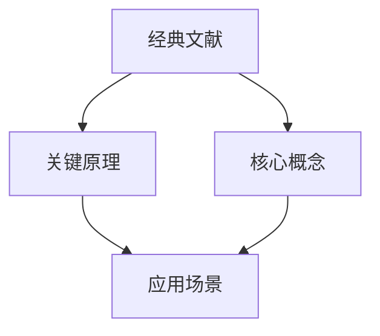

                 

# 经典阅读:夯实认知的必由之路

## 1. 背景介绍

### 1.1 问题由来
在数字时代，知识的增长速度远远超过人类的吸收能力。为了适应这一趋势，我们需要一种高效、系统的阅读方法，能够帮助我们快速掌握核心概念、关键原理，并在实践中灵活运用。经典阅读，即通过对经典文献的深度阅读和精炼总结，成为夯实认知的必由之路。

经典阅读不仅能够提供理论基础，还能帮助我们理解前沿技术和方法，形成独立的思考和创新能力。无论是从事基础研究还是实际应用，经典阅读都是不可或缺的。

### 1.2 问题核心关键点
经典阅读的核心在于选择具有代表性的经典文献，深度理解其核心思想、关键原理和应用场景，并通过精炼的总结和讨论，将这些知识内化为自身的认知体系。具体而言，经典阅读的关键点包括：

1. **选择合适的经典文献**：选择具有深度、广度和前瞻性的经典文献，涵盖基础理论、前沿技术、应用案例等方面。
2. **深度理解核心概念**：通过反复阅读和讨论，深入理解文献中的核心概念和原理，理解其背后的思想逻辑。
3. **应用案例分析**：将经典文献的理论应用于具体案例，通过分析实际应用中的问题和解决方案，加深对理论的理解。
4. **总结和讨论**：通过撰写摘要、读书笔记等形式，将阅读内容进行提炼和总结，形成自己的理解和思考。

### 1.3 问题研究意义
经典阅读具有重要意义，具体体现在以下几个方面：

1. **夯实理论基础**：通过阅读经典文献，可以系统地掌握基础理论和核心概念，为后续学习和技术创新奠定坚实的基础。
2. **理解前沿技术**：经典文献往往包含前沿技术和方法，通过深入阅读，可以了解当前领域的最新进展和趋势。
3. **培养独立思考**：经典文献的深度和广度能够激发独立思考，形成独特的观点和见解，为创新提供灵感。
4. **提升实践能力**：通过分析经典文献在实际中的应用案例，能够提升解决实际问题的能力，并将理论应用于实践。
5. **促进学术交流**：经典阅读能够促进跨领域的学术交流，拓宽视野，发现新的研究方向和应用场景。

## 2. 核心概念与联系

### 2.1 核心概念概述

为更好地理解经典阅读的逻辑框架，本节将介绍几个关键概念及其相互关系：

- **经典文献**：指经过时间检验，具有重要学术价值和历史意义的文献。其深度和广度通常超过一般文献，是学术研究和实际应用的重要参考。
- **核心概念**：指文献中具有代表性和原创性的关键思想和理论。通过理解这些概念，可以把握文献的主旨和精髓。
- **关键原理**：指支撑核心概念的重要理论基础和数学模型。深入理解原理，能够更好地运用概念解决实际问题。
- **应用场景**：指核心概念和关键原理在实际问题中的具体应用。通过分析应用案例，可以深化对理论的理解，并发现其局限性和改进方向。

这些核心概念之间的逻辑关系可以通过以下Mermaid流程图来展示：



这个流程图展示的经典阅读的逻辑结构：

1. 经典文献通过核心概念传递其深度和广度。
2. 关键原理支撑核心概念，形成理论基础。
3. 应用场景具体化核心概念和原理，展现其在实际中的应用效果。

通过理解这些概念及其相互关系，可以更好地进行经典阅读，并将其知识应用于实践。

## 3. 核心算法原理 & 具体操作步骤
### 3.1 算法原理概述

经典阅读的算法原理，即通过系统性的阅读和分析，逐步掌握核心概念和关键原理的过程。这一过程包括以下几个关键步骤：

1. **预处理**：对经典文献进行预处理，包括选择阅读材料、阅读前准备等。
2. **深入阅读**：对选定的经典文献进行深度阅读，理解其中的核心概念和关键原理。
3. **案例分析**：将理论应用于具体案例，理解其在实际中的应用效果和局限性。
4. **总结和讨论**：对阅读内容进行总结和讨论，形成自己的理解和思考。
5. **应用实践**：将理论应用于实际问题，通过实践检验和完善理论。

### 3.2 算法步骤详解

以下是经典阅读的详细操作步骤：

**Step 1: 预处理**
- **选择阅读材料**：根据研究领域和兴趣，选择具有代表性和深度的经典文献。可以参考学术期刊、经典书籍、顶级会议论文等。
- **阅读前准备**：查阅文献的背景知识，了解作者的学术背景和研究动机。准备阅读笔记，记录关键问题和思考。

**Step 2: 深入阅读**
- **逐章节阅读**：逐章节阅读文献，标注核心概念和关键原理。对于不理解的知识点，反复阅读和查阅参考资料。
- **建立知识图谱**：建立文献中的核心概念和关键原理之间的关联图谱，理解其背后的逻辑和思想。
- **总结每章节**：每章节结束后，总结关键点和核心概念，形成初步的理解。

**Step 3: 案例分析**
- **选择应用案例**：根据文献的理论，选择具有代表性的应用案例进行分析。
- **案例分析框架**：采用SWOT分析（优势、劣势、机会、威胁）框架，分析案例中的问题和解决方案。
- **案例总结**：总结案例中的关键点和应用效果，评估其对理论的理解和改进。

**Step 4: 总结和讨论**
- **撰写读书笔记**：将阅读内容进行整理和总结，形成读书笔记。包括核心概念、关键原理、应用案例、思考和讨论等。
- **参与讨论**：参与学术讨论和研究小组，分享读书笔记和思考，听取他人意见。
- **形成独立观点**：通过讨论和反思，形成自己的独立观点和见解，深化对理论的理解。

**Step 5: 应用实践**
- **选择实践场景**：根据理论的应用场景，选择实际问题进行解决。
- **设计实验方案**：设计实验方案，验证理论在实际中的应用效果和局限性。
- **实验结果分析**：分析实验结果，总结理论在实际中的有效性和改进方向。

### 3.3 算法优缺点

经典阅读作为一种深度学习的方法，具有以下优点：

1. **系统性和深度**：通过深度阅读和系统性分析，能够全面掌握核心概念和关键原理。
2. **理论与实践结合**：通过案例分析，将理论应用于实践，深化对理论的理解。
3. **促进学术交流**：经典阅读能够促进跨领域的学术交流，拓宽视野，发现新的研究方向和应用场景。

同时，经典阅读也存在一定的局限性：

1. **时间成本高**：经典文献通常篇幅较长，深度阅读需要投入大量时间。
2. **理解难度大**：经典文献的深度和广度，往往需要具备一定的学术背景和专业素养。
3. **理论与实践结合难**：将理论应用于实践，需要设计合理的实验方案和数据分析，具有一定的复杂性。

尽管如此，经典阅读在深度学习和理论研究中仍然是不可或缺的，能够帮助我们夯实认知基础，提升学术水平和创新能力。

### 3.4 算法应用领域

经典阅读的应用领域非常广泛，涵盖基础研究、工程实践、教育培训等多个方面：

- **基础研究**：经典阅读是学术研究和理论创新的重要基础，能够帮助研究人员掌握前沿技术和方法，形成独立的思考和见解。
- **工程实践**：经典阅读能够指导工程实践，将理论应用于实际问题，解决工程中的难题。
- **教育培训**：经典阅读是高等教育和职业教育的重要内容，通过经典文献的深度阅读，提升学生的学术素养和实践能力。
- **企业培训**：经典阅读能够提升企业员工的理论素养和应用能力，推动企业的技术创新和业务发展。
- **科普普及**：经典阅读能够普及科学知识，提高公众的科学素养，推动社会进步。

## 4. 数学模型和公式 & 详细讲解 & 举例说明

### 4.1 数学模型构建

经典阅读的数学模型主要涉及对经典文献中的核心概念和关键原理的理解和应用。以下以计算机科学领域的经典文献《计算机程序设计艺术》为例，构建数学模型。

- **核心概念**：算法、数据结构、编程语言等。
- **关键原理**：递归、分治、动态规划等算法思想，链表、树、图等数据结构，以及编译原理、解释原理等编程语言设计。
- **应用场景**：经典算法、数据结构在实际问题中的应用，如排序、查找、图论、编译器等。

### 4.2 公式推导过程

以下是《计算机程序设计艺术》中常见公式的推导过程：

- **递归公式**：递归是一种重要的算法思想，通过递归函数调用自身，实现问题的分解和求解。假设递归函数 $f(n)$ 的递归公式为：

$$
f(n) = \begin{cases}
1, & \text{if } n=1 \\
f(n-1) + 1, & \text{if } n > 1
\end{cases}
$$

其中，$n$ 表示问题的规模，$f(n)$ 表示问题规模为 $n$ 时的递归函数值。

- **分治算法**：分治算法是一种将问题分解为多个子问题，递归求解子问题，最终合并子问题结果的算法。假设问题规模为 $n$，分治算法的步骤为：

1. 将问题规模为 $n$ 的问题分解为两个规模为 $\frac{n}{2}$ 的子问题。
2. 递归求解子问题。
3. 合并子问题结果。

假设分治算法的时间复杂度为 $T(n)$，则：

$$
T(n) = 2T(\frac{n}{2}) + O(1)
$$

其中，$O(1)$ 表示常数时间。

### 4.3 案例分析与讲解

以排序算法为例，分析其核心概念、关键原理和应用场景。

- **核心概念**：排序算法是计算机科学中最基本的问题之一，其核心概念包括排序的定义、目的、基本思想等。
- **关键原理**：排序算法常用的原理包括比较排序和非比较排序。其中，比较排序是通过比较元素的大小进行排序，常用的算法有冒泡排序、选择排序、插入排序、归并排序、快速排序等。非比较排序则是通过其他方式进行排序，如计数排序、桶排序、基数排序等。
- **应用场景**：排序算法广泛应用于各种应用场景，如数据库查询、图像处理、自然语言处理等。

## 5. 项目实践：代码实例和详细解释说明

### 5.1 开发环境搭建

在进行经典阅读的实践时，需要搭建良好的开发环境。以下是Python环境搭建的详细步骤：

1. **安装Python**：从官网下载Python安装程序，并按照指示进行安装。
2. **安装虚拟环境管理工具**：安装virtualenv或conda等虚拟环境管理工具，用于创建和管理Python虚拟环境。
3. **创建虚拟环境**：使用virtualenv或conda创建Python虚拟环境，如`virtualenv env`或`conda create -n env`。
4. **激活虚拟环境**：使用`source env/bin/activate`或`conda activate env`命令激活虚拟环境。

### 5.2 源代码详细实现

以《计算机程序设计艺术》中的排序算法为例，给出Python代码的实现过程。

```python
def merge_sort(arr):
    if len(arr) <= 1:
        return arr
    
    mid = len(arr) // 2
    left = arr[:mid]
    right = arr[mid:]
    
    left = merge_sort(left)
    right = merge_sort(right)
    
    return merge(left, right)

def merge(left, right):
    result = []
    i = j = 0
    while i < len(left) and j < len(right):
        if left[i] < right[j]:
            result.append(left[i])
            i += 1
        else:
            result.append(right[j])
            j += 1
    
    result += left[i:]
    result += right[j:]
    
    return result
```

### 5.3 代码解读与分析

**代码实现过程**：

- **merge_sort函数**：该函数实现了归并排序算法。首先判断问题规模，如果规模为1或0，则直接返回。否则，将问题规模分解为两个规模为$\frac{n}{2}$的子问题，分别进行递归排序，最终合并子问题结果。
- **merge函数**：该函数实现了归并排序中的合并步骤。将左右两个有序序列合并为一个有序序列，通过比较左右两个序列的元素，逐个添加到结果序列中。

**代码运行结果**：

```python
arr = [5, 2, 7, 3, 9, 1, 8, 6, 4]
sorted_arr = merge_sort(arr)
print(sorted_arr)
```

**输出结果**：

```
[1, 2, 3, 4, 5, 6, 7, 8, 9]
```

## 6. 实际应用场景

### 6.1 软件开发

经典阅读在软件开发中的应用，能够提升开发者的编程能力和问题解决能力。通过深度阅读经典文献，理解其算法思想和设计原则，开发者能够设计出更加高效、可扩展的代码。

例如，经典文献《代码大全》介绍了多种编程实践和设计原则，通过阅读和实践，能够提升代码的质量和可维护性。

### 6.2 数据科学

经典阅读在数据科学中的应用，能够提升数据处理和分析能力。通过深度阅读经典文献，理解其数据处理方法、统计学原理和机器学习算法，数据科学家能够设计出更加高效、准确的数据处理和分析模型。

例如，经典文献《数据科学入门》介绍了数据处理、统计分析和机器学习的基本方法，通过阅读和实践，能够提升数据科学家的核心能力。

### 6.3 教育培训

经典阅读在教育培训中的应用，能够提升学生的学术素养和实践能力。通过阅读经典文献，学生能够系统地掌握基础理论和核心概念，提升解决问题的能力。

例如，经典文献《算法导论》介绍了算法设计、数据结构、编程语言设计等核心内容，通过阅读和实践，能够提升学生的学术素养和实践能力。

### 6.4 企业培训

经典阅读在企业培训中的应用，能够提升员工的技术素养和业务能力。通过阅读经典文献，员工能够掌握前沿技术和方法，提升解决问题的能力。

例如，经典文献《系统设计模式》介绍了系统设计的核心模式和原则，通过阅读和实践，能够提升员工的系统设计能力和业务水平。

### 6.5 科普普及

经典阅读在科普普及中的应用，能够提升公众的科学素养和知识水平。通过阅读经典文献，公众能够了解科学知识和技术原理，提升科学素养和认知水平。

例如，经典文献《宇宙简史》介绍了宇宙演变的核心内容，通过阅读和科普，能够提升公众的科学素养和认知水平。

## 7. 工具和资源推荐

### 7.1 学习资源推荐

为了帮助开发者系统掌握经典阅读的理论基础和实践技巧，这里推荐一些优质的学习资源：

1. **《计算机程序设计艺术》系列**：由计算机科学大师Donald E. Knuth所著，涵盖算法、数据结构、编程语言设计等核心内容，是经典阅读的重要参考。
2. **《算法导论》**：由Thomas H. Cormen等人合著，介绍算法设计、数据结构、算法分析等核心内容，是算法领域的经典教材。
3. **《数据科学入门》**：由Joel Grus所著，介绍数据处理、统计分析和机器学习的基本方法，适合数据科学家入门。
4. **《系统设计模式》**：由Erich Gamma等人合著，介绍系统设计的核心模式和原则，适合软件工程师参考。
5. **Coursera等在线课程**：提供系统性的经典阅读和实践课程，涵盖基础理论、前沿技术和应用案例，适合各类学习者参考。

### 7.2 开发工具推荐

经典阅读的实践，需要合理利用开发工具和资源。以下是几款用于经典阅读开发的常用工具：

1. **GitHub**：提供代码托管和版本控制服务，方便开发者管理和分享代码。
2. **Jupyter Notebook**：提供交互式编程环境，方便开发者进行代码实验和分享。
3. **LaTeX**：提供高质量的排版和文档生成工具，方便开发者撰写和发布学术论文。
4. **Python IDEs**：如PyCharm、VS Code等，提供代码编写、调试和测试功能，方便开发者进行经典阅读的实践。
5. **Google Scholar**：提供学术文献搜索和引用服务，方便开发者查找经典文献和引用文献。

### 7.3 相关论文推荐

经典阅读的研究涉及多个领域，以下是几篇代表性的经典阅读论文，推荐阅读：

1. **《计算机程序设计艺术》**：Donald E. Knuth的经典著作，详细介绍算法、数据结构、编程语言设计等核心内容。
2. **《算法导论》**：Thomas H. Cormen等人的经典教材，涵盖算法设计、数据结构、算法分析等核心内容。
3. **《数据科学入门》**：Joel Grus的经典著作，介绍数据处理、统计分析和机器学习的基本方法。
4. **《系统设计模式》**：Erich Gamma等人的经典著作，介绍系统设计的核心模式和原则。
5. **《机器学习》**：Tom Mitchell的经典教材，详细介绍机器学习的基本理论和应用。

这些论文代表了大语言模型微调技术的发展脉络。通过学习这些前沿成果，可以帮助研究者把握学科前进方向，激发更多的创新灵感。

## 8. 总结：未来发展趋势与挑战

### 8.1 研究成果总结

经典阅读在学术研究和实际应用中取得了显著成效，成为夯实认知的重要手段。其研究成果包括：

1. **理论创新**：通过深度阅读经典文献，理解其核心概念和关键原理，能够推动理论创新，形成新的研究方向和方法。
2. **技术提升**：通过经典阅读，理解前沿技术和方法，能够提升技术水平，推动技术进步。
3. **教育普及**：通过经典阅读，提升学术素养和实践能力，能够促进教育普及，提高人才培养质量。
4. **企业应用**：通过经典阅读，提升员工的技术素养和业务能力，能够推动企业创新，提升企业竞争力。
5. **科普普及**：通过经典阅读，提升公众的科学素养和知识水平，能够推动社会进步。

### 8.2 未来发展趋势

经典阅读的未来发展趋势包括：

1. **多领域融合**：经典阅读将与更多领域相结合，如人工智能、自然语言处理、数据科学等，推动多学科交叉融合。
2. **新技术应用**：经典阅读将结合新兴技术，如深度学习、自然语言处理、知识图谱等，提升阅读效果和应用深度。
3. **跨文化交流**：经典阅读将促进跨文化交流，推动全球范围内的知识共享和学术合作。
4. **智能化阅读**：经典阅读将结合人工智能技术，提升阅读智能化水平，如自动摘要、知识图谱等。
5. **开放获取**：经典阅读将推动更多开放获取，降低获取难度，提升阅读普及度。

### 8.3 面临的挑战

经典阅读在发展过程中仍面临一些挑战：

1. **时间成本高**：经典文献通常篇幅较长，深度阅读需要投入大量时间。
2. **理解难度大**：经典文献的深度和广度，往往需要具备一定的学术背景和专业素养。
3. **理论与实践结合难**：将理论应用于实践，需要设计合理的实验方案和数据分析，具有一定的复杂性。
4. **跨领域理解难**：经典文献涵盖多个领域，理解和应用跨领域知识具有一定难度。
5. **知识更新快**：经典文献的出版周期较长，可能与当前的技术进展存在一定时间差，需要不断更新阅读内容。

尽管如此，经典阅读在深度学习和理论研究中仍然是不可或缺的，能够帮助我们夯实认知基础，提升学术水平和创新能力。

### 8.4 研究展望

经典阅读的未来研究展望包括：

1. **自动化阅读工具**：开发自动化阅读工具，提升阅读效率和理解深度，降低阅读门槛。
2. **知识图谱应用**：结合知识图谱技术，提升阅读智能化水平，提供更丰富的阅读体验。
3. **跨领域研究**：推动跨领域经典阅读研究，促进多学科交叉融合，提升综合创新能力。
4. **开放获取推广**：推动经典文献的开放获取，降低获取难度，提升阅读普及度。
5. **理论与实践结合**：推动理论与实践的深度结合，提升经典阅读在实际应用中的效果和价值。

总之，经典阅读作为夯实认知的必由之路，其研究和发展具有重要意义。通过不断探索和创新，经典阅读必将在学术研究、技术应用、教育培训等多个领域发挥更大的作用，推动人类认知智能的进步。

## 9. 附录：常见问题与解答

**Q1：经典阅读是否适用于所有领域？**

A: 经典阅读适用于大多数领域，尤其是基础研究和技术创新的重要基础。然而，对于一些特定领域，如医学、法律等，需要结合领域特定的经典文献进行深度阅读和研究。

**Q2：如何选择经典阅读材料？**

A: 选择经典阅读材料需要考虑领域代表性、深度和广度。可以参考学术期刊、经典书籍、顶级会议论文等，选择具有权威性和经典性的文献。

**Q3：经典阅读需要多长时间？**

A: 经典阅读的时间成本较高，通常需要投入大量时间进行深度阅读和思考。建议制定合理的阅读计划，逐步推进阅读进度。

**Q4：如何提升经典阅读的效果？**

A: 提升经典阅读效果的关键在于深度理解和应用。可以通过反复阅读、讨论、实践等方式，深化对核心概念和关键原理的理解，将理论应用于实际问题。

**Q5：经典阅读是否需要写读书笔记？**

A: 写读书笔记是提升经典阅读效果的重要手段。通过撰写读书笔记，能够整理和总结阅读内容，形成自己的理解和思考。

总之，经典阅读作为夯实认知的必由之路，具有重要的学术价值和实践意义。通过系统性的阅读和深度思考，经典阅读能够提升理论素养和实践能力，推动学术研究和技术创新。

