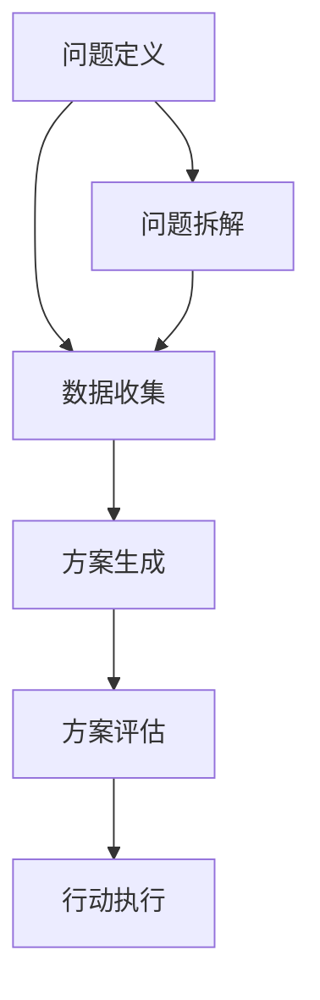

                 

# 结构化思维的力量：从思维到行动

> 关键词：结构化思维, 问题解决, 系统化方法, 决策框架, 项目管理, 效率提升

## 1. 背景介绍

### 1.1 问题由来

在当今快节奏、信息爆炸的时代，我们每天面临的决策和任务越来越多。从日常生活中的简单选择，到职业生涯中的重大决策，正确地思考和行动都变得至关重要。然而，由于信息复杂、选择多样，很多人常常感到困惑和迷茫，无法做出最优的决策。

结构化思维的提出，就是为了帮助人们更系统、更有条理地处理复杂问题，从而提升决策效率和质量。通过将问题拆解、分类，并采用系统化的方法和工具，结构化思维能够帮助我们更好地理解和解决问题，提高思维的效率和质量。

### 1.2 问题核心关键点

结构化思维的核心在于通过将问题进行拆解、分类和分析，形成系统的解决方案。它包括以下几个关键点：

- **问题定义**：明确问题是什么，包括问题的目标、范围和约束条件。
- **数据收集**：收集和分析相关数据，为问题提供依据。
- **方案生成**：基于数据，生成可能的解决方案。
- **方案评估**：对各个方案进行优劣分析，选择最佳方案。
- **行动执行**：根据选定的方案，制定详细的行动计划并执行。

结构化思维能够帮助人们避免陷入无序的思考和决策过程中，提高问题解决的效率和准确性。

## 2. 核心概念与联系

### 2.1 核心概念概述

结构化思维是基于系统化方法论的一套思考方式，旨在通过科学、有序的步骤，有效解决复杂问题。其核心概念包括：

- **问题定义**：明确问题是什么，包括问题的目标、范围和约束条件。
- **数据收集**：收集和分析相关数据，为问题提供依据。
- **方案生成**：基于数据，生成可能的解决方案。
- **方案评估**：对各个方案进行优劣分析，选择最佳方案。
- **行动执行**：根据选定的方案，制定详细的行动计划并执行。

这些概念通过一系列的逻辑流程和工具方法，形成了一套完整的思维和决策框架。

### 2.2 核心概念原理和架构的 Mermaid 流程图



这个流程图展示了结构化思维的主要流程。从问题定义开始，通过数据收集、方案生成、方案评估，最终形成可执行的行动计划。

## 3. 核心算法原理 & 具体操作步骤

### 3.1 算法原理概述

结构化思维的原理是基于系统化方法论的逻辑框架，通过将复杂问题分解为可管理的小部分，逐步解决每个部分，最终汇总得到完整解决方案。其主要算法包括：

- **问题定义算法**：通过系统化提问，明确问题的目标、范围和约束条件。
- **数据收集算法**：基于问题定义，收集相关数据，并对数据进行分析和处理。
- **方案生成算法**：基于数据，生成可能的解决方案。
- **方案评估算法**：对各个方案进行优劣分析，选择最佳方案。
- **行动执行算法**：根据选定的方案，制定详细的行动计划并执行。

### 3.2 算法步骤详解

#### 3.2.1 问题定义

问题定义是结构化思维的第一步，也是最重要的一步。通过系统化提问，可以确保问题的准确性和明确性，为后续步骤提供坚实的基础。

1. **明确目标**：首先，需要明确问题的目标，即希望通过解决问题达到什么目的。例如，提高销售额、提升客户满意度等。

2. **限定范围**：其次，需要限定问题的范围，即问题的边界和约束条件。例如，问题是否只限于某特定时间、地点或人群。

3. **收集需求**：最后，需要收集与问题相关的需求信息，包括用户需求、市场需求等。这些信息将为后续步骤提供依据。

#### 3.2.2 数据收集

数据收集是结构化思维的核心环节，通过收集和分析数据，可以为问题提供客观的依据，并指导后续的方案生成和评估。

1. **数据收集**：首先，需要确定需要收集哪些数据，并确定数据来源。例如，可以通过调查问卷、市场研究、历史数据等方式收集数据。

2. **数据分析**：其次，需要对收集到的数据进行分析和处理，以提取有用的信息。例如，可以通过统计分析、趋势分析等方法，找到数据中的关键信息和规律。

3. **数据验证**：最后，需要对分析结果进行验证，确保数据的准确性和可靠性。例如，可以通过交叉验证、对比实验等方式，验证分析结果的有效性。

#### 3.2.3 方案生成

方案生成是结构化思维的重要环节，通过生成可能的解决方案，为问题提供多种选择，并最终选择最佳方案。

1. **头脑风暴**：首先，需要通过头脑风暴等方法，生成尽可能多的解决方案。例如，可以通过头脑风暴会议、思维导图等方式，列出所有可能的解决方案。

2. **筛选方案**：其次，需要根据问题目标和数据，对生成的方案进行筛选。例如，可以使用决策树、优劣势分析等方法，筛选出最优的解决方案。

3. **评估方案**：最后，需要对筛选出的方案进行评估，以确定最佳方案。例如，可以使用成本-效益分析、ROI分析等方法，评估方案的可行性和效果。

#### 3.2.4 方案评估

方案评估是结构化思维的关键环节，通过优劣分析，确保选择最佳的解决方案。

1. **评估指标**：首先，需要确定评估方案的指标，例如成本、时间、效果等。

2. **对比分析**：其次，需要对各个方案进行对比分析，找到最优方案。例如，可以使用SWOT分析、成本效益分析等方法，进行对比分析。

3. **选择方案**：最后，根据评估结果，选择最佳方案。例如，可以根据综合评估结果，选择最优方案。

#### 3.2.5 行动执行

行动执行是结构化思维的最后环节，通过制定详细的行动计划并执行，将方案转化为实际行动。

1. **制定计划**：首先，需要制定详细的行动计划，包括时间、资源、人员等。例如，可以制定详细的项目计划书，明确各阶段的责任人和时间节点。

2. **分配任务**：其次，需要分配任务，确保每个人清楚自己的职责和任务。例如，可以使用项目管理工具，分配任务并跟踪进度。

3. **执行和监控**：最后，需要执行行动计划，并实时监控执行情况。例如，可以使用项目管理系统，跟踪进度并及时调整计划。

### 3.3 算法优缺点

结构化思维的优点包括：

- **系统性**：通过系统化方法，能够更全面、更深入地理解问题，并找到最优解决方案。
- **可操作性**：通过分步操作，将复杂问题分解为可管理的小部分，确保每个环节都能得到有效处理。
- **可控性**：通过明确的目标和约束条件，能够更好地控制项目的进展和结果。

结构化思维的缺点包括：

- **时间成本高**：系统化方法需要大量的时间和资源，可能会延长解决问题的时间。
- **灵活性差**：系统化方法强调规范和流程，可能会限制思维的灵活性。
- **复杂度高**：对于复杂问题，系统化方法可能会过于复杂，难以操作。

### 3.4 算法应用领域

结构化思维广泛适用于各种复杂问题的解决，包括但不限于：

- **项目管理**：通过系统化方法，确保项目按计划进行，并达成目标。
- **问题解决**：通过系统化方法，快速找到问题的根本原因，并制定解决方案。
- **决策分析**：通过系统化方法，提高决策的准确性和效率。
- **业务改进**：通过系统化方法，优化业务流程，提升业务绩效。

## 4. 数学模型和公式 & 详细讲解 & 举例说明

### 4.1 数学模型构建

结构化思维的数学模型主要基于系统化方法论，包括问题定义、数据收集、方案生成、方案评估和行动执行等步骤。

#### 4.1.1 问题定义

问题定义的数学模型可以表示为：

$$
\text{问题} = (\text{目标}, \text{范围}, \text{约束条件})
$$

其中，目标表示希望通过解决问题达到的目的，范围表示问题的边界，约束条件表示问题的限制条件。

#### 4.1.2 数据收集

数据收集的数学模型可以表示为：

$$
\text{数据} = \text{数据来源} \times \text{数据类型} \times \text{数据处理方式}
$$

其中，数据来源表示数据的获取方式，数据类型表示数据的具体形式，数据处理方式表示数据处理的方法。

#### 4.1.3 方案生成

方案生成的数学模型可以表示为：

$$
\text{方案} = \text{方案类型} \times \text{方案数量} \times \text{方案质量}
$$

其中，方案类型表示方案的具体形式，方案数量表示方案的数量，方案质量表示方案的优劣。

#### 4.1.4 方案评估

方案评估的数学模型可以表示为：

$$
\text{评估结果} = \text{评估指标} \times \text{评估方法} \times \text{评估结果}
$$

其中，评估指标表示评估方案的具体指标，评估方法表示评估方案的方法，评估结果表示最终的评估结果。

#### 4.1.5 行动执行

行动执行的数学模型可以表示为：

$$
\text{行动计划} = (\text{时间}, \text{资源}, \text{人员})
$$

其中，时间表示行动计划的时间节点，资源表示行动计划的资源需求，人员表示行动计划的执行人员。

### 4.2 公式推导过程

#### 4.2.1 问题定义

问题定义的公式推导过程如下：

$$
\text{问题} = \text{目标} \times \text{范围} \times \text{约束条件}
$$

其中，目标表示希望通过解决问题达到的目的，范围表示问题的边界，约束条件表示问题的限制条件。

#### 4.2.2 数据收集

数据收集的公式推导过程如下：

$$
\text{数据} = \text{数据来源} \times \text{数据类型} \times \text{数据处理方式}
$$

其中，数据来源表示数据的获取方式，数据类型表示数据的具体形式，数据处理方式表示数据处理的方法。

#### 4.2.3 方案生成

方案生成的公式推导过程如下：

$$
\text{方案} = \text{方案类型} \times \text{方案数量} \times \text{方案质量}
$$

其中，方案类型表示方案的具体形式，方案数量表示方案的数量，方案质量表示方案的优劣。

#### 4.2.4 方案评估

方案评估的公式推导过程如下：

$$
\text{评估结果} = \text{评估指标} \times \text{评估方法} \times \text{评估结果}
$$

其中，评估指标表示评估方案的具体指标，评估方法表示评估方案的方法，评估结果表示最终的评估结果。

#### 4.2.5 行动执行

行动执行的公式推导过程如下：

$$
\text{行动计划} = (\text{时间}, \text{资源}, \text{人员})
$$

其中，时间表示行动计划的时间节点，资源表示行动计划的资源需求，人员表示行动计划的执行人员。

### 4.3 案例分析与讲解

#### 4.3.1 案例一：项目管理

项目管理的数学模型可以表示为：

$$
\text{项目管理} = (\text{项目目标}, \text{项目范围}, \text{项目约束条件}) \times (\text{数据来源}, \text{数据类型}, \text{数据处理方式}) \times (\text{方案类型}, \text{方案数量}, \text{方案质量}) \times (\text{评估指标}, \text{评估方法}, \text{评估结果}) \times (\text{时间}, \text{资源}, \text{人员})
$$

其中，项目目标表示项目的具体目标，项目范围表示项目的边界，项目约束条件表示项目的限制条件，数据来源表示数据的获取方式，数据类型表示数据的具体形式，数据处理方式表示数据处理的方法，方案类型表示方案的具体形式，方案数量表示方案的数量，方案质量表示方案的优劣，评估指标表示评估方案的具体指标，评估方法表示评估方案的方法，评估结果表示最终的评估结果，时间表示行动计划的时间节点，资源表示行动计划的资源需求，人员表示行动计划的执行人员。

#### 4.3.2 案例二：问题解决

问题解决的数学模型可以表示为：

$$
\text{问题解决} = (\text{问题目标}, \text{问题范围}, \text{问题约束条件}) \times (\text{数据来源}, \text{数据类型}, \text{数据处理方式}) \times (\text{方案类型}, \text{方案数量}, \text{方案质量}) \times (\text{评估指标}, \text{评估方法}, \text{评估结果}) \times (\text{时间}, \text{资源}, \text{人员})
$$

其中，问题目标表示问题解决的目标，问题范围表示问题的边界，问题约束条件表示问题的限制条件，数据来源表示数据的获取方式，数据类型表示数据的具体形式，数据处理方式表示数据处理的方法，方案类型表示方案的具体形式，方案数量表示方案的数量，方案质量表示方案的优劣，评估指标表示评估方案的具体指标，评估方法表示评估方案的方法，评估结果表示最终的评估结果，时间表示行动计划的时间节点，资源表示行动计划的资源需求，人员表示行动计划的执行人员。

#### 4.3.3 案例三：决策分析

决策分析的数学模型可以表示为：

$$
\text{决策分析} = (\text{决策目标}, \text{决策范围}, \text{决策约束条件}) \times (\text{数据来源}, \text{数据类型}, \text{数据处理方式}) \times (\text{方案类型}, \text{方案数量}, \text{方案质量}) \times (\text{评估指标}, \text{评估方法}, \text{评估结果}) \times (\text{时间}, \text{资源}, \text{人员})
$$

其中，决策目标表示决策的目标，决策范围表示决策的边界，决策约束条件表示决策的限制条件，数据来源表示数据的获取方式，数据类型表示数据的具体形式，数据处理方式表示数据处理的方法，方案类型表示方案的具体形式，方案数量表示方案的数量，方案质量表示方案的优劣，评估指标表示评估方案的具体指标，评估方法表示评估方案的方法，评估结果表示最终的评估结果，时间表示行动计划的时间节点，资源表示行动计划的资源需求，人员表示行动计划的执行人员。

## 5. 项目实践：代码实例和详细解释说明

### 5.1 开发环境搭建

结构化思维的项目实践需要开发环境的支持。以下是Python开发环境的搭建步骤：

1. 安装Anaconda：从官网下载并安装Anaconda，用于创建独立的Python环境。

2. 创建并激活虚拟环境：
```bash
conda create -n structthinking python=3.8 
conda activate structthinking
```

3. 安装必要的Python库：
```bash
pip install numpy pandas scikit-learn matplotlib jupyter notebook
```

### 5.2 源代码详细实现

以下是一个结构化思维的项目实现案例，使用Python和Jupyter Notebook进行演示。

首先，定义问题定义函数：

```python
def define_problem(target, scope, constraints):
    problem = {
        'target': target,
        'scope': scope,
        'constraints': constraints
    }
    return problem
```

然后，定义数据收集函数：

```python
def collect_data(data_sources, data_types, data_processing):
    data = {
        'data_sources': data_sources,
        'data_types': data_types,
        'data_processing': data_processing
    }
    return data
```

接着，定义方案生成函数：

```python
def generate_solutions(solution_types, solution_counts, solution_qualities):
    solutions = {
        'solution_types': solution_types,
        'solution_counts': solution_counts,
        'solution_qualities': solution_qualities
    }
    return solutions
```

再定义方案评估函数：

```python
def evaluate_solutions(assessment_indicators, assessment_methods, evaluation_results):
    assessment = {
        'assessment_indicators': assessment_indicators,
        'assessment_methods': assessment_methods,
        'evaluation_results': evaluation_results
    }
    return assessment
```

最后，定义行动执行函数：

```python
def execute_action(time, resources, personnel):
    action_plan = {
        'time': time,
        'resources': resources,
        'personnel': personnel
    }
    return action_plan
```

### 5.3 代码解读与分析

以下是关键代码的实现细节：

**define_problem函数**：
- `target`表示问题的目标。
- `scope`表示问题的范围。
- `constraints`表示问题的约束条件。

**collect_data函数**：
- `data_sources`表示数据的获取方式。
- `data_types`表示数据的具体形式。
- `data_processing`表示数据处理的方法。

**generate_solutions函数**：
- `solution_types`表示方案的具体形式。
- `solution_counts`表示方案的数量。
- `solution_qualities`表示方案的优劣。

**evaluate_solutions函数**：
- `assessment_indicators`表示评估方案的具体指标。
- `assessment_methods`表示评估方案的方法。
- `evaluation_results`表示最终的评估结果。

**execute_action函数**：
- `time`表示行动计划的时间节点。
- `resources`表示行动计划的资源需求。
- `personnel`表示行动计划的执行人员。

### 5.4 运行结果展示

运行以上代码，可以验证结构化思维的各个步骤。例如，可以定义一个项目管理的案例，进行数据收集、方案生成、方案评估和行动执行，最终输出项目管理的完整计划。

## 6. 实际应用场景

### 6.1 案例一：项目管理

项目管理是结构化思维的典型应用场景。通过系统化方法，项目管理能够确保项目按时、按质完成。例如，可以使用结构化思维进行以下操作：

1. **问题定义**：明确项目目标、范围和约束条件。
2. **数据收集**：收集项目相关的历史数据、人员信息等。
3. **方案生成**：生成各种可能的方案，如项目进度计划、资源分配等。
4. **方案评估**：评估各种方案的优劣，选择最佳方案。
5. **行动执行**：制定详细的行动计划，并按照计划执行。

### 6.2 案例二：问题解决

问题解决也是结构化思维的重要应用场景。通过系统化方法，问题解决能够快速找到问题的根本原因，并制定有效的解决方案。例如，可以使用结构化思维进行以下操作：

1. **问题定义**：明确问题的目标、范围和约束条件。
2. **数据收集**：收集与问题相关的数据，如历史数据、用户反馈等。
3. **方案生成**：生成各种可能的解决方案，如技术改进、流程优化等。
4. **方案评估**：评估各种方案的优劣，选择最佳方案。
5. **行动执行**：制定详细的行动计划，并按照计划执行。

### 6.3 案例三：决策分析

决策分析是结构化思维的另一个重要应用场景。通过系统化方法，决策分析能够提高决策的准确性和效率。例如，可以使用结构化思维进行以下操作：

1. **问题定义**：明确决策目标、范围和约束条件。
2. **数据收集**：收集与决策相关的数据，如市场调研数据、财务数据等。
3. **方案生成**：生成各种可能的方案，如产品定价、市场推广等。
4. **方案评估**：评估各种方案的优劣，选择最佳方案。
5. **行动执行**：制定详细的行动计划，并按照计划执行。

## 7. 工具和资源推荐

### 7.1 学习资源推荐

为了帮助开发者系统掌握结构化思维的理论基础和实践技巧，这里推荐一些优质的学习资源：

1. 《结构化思维》书籍：系统介绍了结构化思维的理论基础、应用方法和实际案例。
2. Coursera《系统化思考》课程：由斯坦福大学开设的课程，深入浅出地介绍了结构化思维的核心概念和方法。
3. Udemy《结构化思维应用》课程：详细讲解了结构化思维在实际工作中的应用技巧和案例。

### 7.2 开发工具推荐

结构化思维的实现需要开发环境的支持。以下是几个常用的开发工具：

1. Python：Python是一种广泛使用的编程语言，支持科学计算和数据分析。
2. Jupyter Notebook：Jupyter Notebook是一种交互式开发环境，支持代码、文本和图表的混合编辑。
3. Microsoft Excel：Microsoft Excel是一种强大的数据分析工具，支持各种数据处理和可视化功能。

### 7.3 相关论文推荐

结构化思维的研究得到了广泛关注。以下是几篇经典的结构化思维论文，推荐阅读：

1. 《Systematic Problem Solving: How to Manage Complexity》：介绍系统化问题解决的理论和方法。
2. 《Design Thinking: Understanding How Designers Think and Work》：探讨设计思维的原理和应用。
3. 《The Thinking, Fast and Slow》：介绍双峰思维的理论和应用。

## 8. 总结：未来发展趋势与挑战

### 8.1 未来发展趋势

展望未来，结构化思维将继续在各个领域发挥重要作用。以下是一些未来发展趋势：

1. **自动化和智能化**：随着人工智能和自动化技术的发展，结构化思维将更加智能化，能够自动分析和生成解决方案。
2. **跨领域应用**：结构化思维将在更多领域得到应用，如医疗、教育、金融等。
3. **数据驱动**：结构化思维将更加依赖数据，通过数据分析和机器学习提高决策的科学性和准确性。
4. **用户体验优化**：结构化思维将更多地关注用户体验，通过优化流程和界面，提升用户的满意度和体验。
5. **协作和团队管理**：结构化思维将更加注重团队协作和项目管理，通过明确分工和角色，提高团队的效率和协作效果。

### 8.2 面临的挑战

结构化思维虽然在很多场景下表现出色，但仍然面临一些挑战：

1. **复杂性**：结构化思维在处理复杂问题时，可能需要多轮迭代和调整，过程较为复杂。
2. **主观性**：结构化思维的方案生成和评估，可能受到主观因素的影响，导致方案的偏差。
3. **数据质量**：结构化思维的数据收集和处理，对数据的准确性和完整性要求较高。
4. **时间成本**：结构化思维的实施，可能需要大量的时间和资源，影响效率。
5. **灵活性**：结构化思维的流程和规范，可能限制思维的灵活性和创造性。

### 8.3 研究展望

未来，结构化思维的研究方向包括：

1. **自动化和智能化**：研究如何通过机器学习和自动化技术，提高结构化思维的效率和准确性。
2. **跨领域应用**：研究结构化思维在更多领域的应用，如医疗、教育、金融等。
3. **数据驱动**：研究如何通过数据分析和机器学习，提升结构化思维的科学性和准确性。
4. **用户体验优化**：研究如何通过优化流程和界面，提升用户的满意度和体验。
5. **协作和团队管理**：研究如何通过结构化思维，提高团队的效率和协作效果。

## 9. 附录：常见问题与解答

**Q1：结构化思维和传统思维有什么区别？**

A: 结构化思维是一种系统化的思维方式，通过将问题分解为可管理的小部分，逐步解决每个部分，最终汇总得到完整解决方案。传统思维则往往没有明确的框架和流程，容易陷入无序的思考和决策过程中。

**Q2：结构化思维是否适用于所有问题？**

A: 结构化思维适用于大多数复杂问题，特别是需要系统化处理的问题。但对于一些简单或紧急的问题，结构化思维的流程可能过于繁琐，效率较低。

**Q3：结构化思维是否需要大量的数据？**

A: 结构化思维在数据驱动下表现更好，数据质量对结构化思维的评估和方案生成影响较大。因此，在数据充足的情况下，结构化思维能更好地发挥作用。

**Q4：结构化思维能否处理不确定性和风险？**

A: 结构化思维在处理不确定性和风险时，通常需要更多的假设和预案。然而，通过系统化方法，结构化思维能够更好地应对不确定性和风险，提高决策的科学性和准确性。

**Q5：结构化思维如何提高团队的协作效果？**

A: 结构化思维通过明确的目标和角色分工，使团队成员了解自己的职责和任务，减少沟通成本，提高协作效率。同时，结构化思维的流程和规范，也有助于团队成员在协作中保持一致性和透明度。

---

作者：禅与计算机程序设计艺术 / Zen and the Art of Computer Programming

