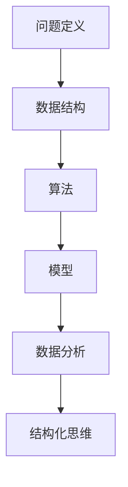

                 

# 结构化思维：理解世界的钥匙

## 1. 背景介绍

### 1.1 问题由来
结构化思维作为一种重要的认知工具，在信息处理、问题解决、决策分析等领域发挥着核心作用。然而，在复杂多变的现代社会中，信息量的爆炸性增长和问题解决的复杂性提升，使得结构化思维面临新的挑战。如何有效地组织信息、分析问题、做出决策，已成为各个领域从业者共同关注的焦点。

结构化思维的核心在于将复杂问题拆分为可管理的小问题，通过系统化的方法进行处理。这一过程不仅需要跨学科的知识储备，更需要一套科学严谨的思维框架和工具。

### 1.2 问题核心关键点
结构化思维的关键在于其系统化、结构化的方法，强调从整体到局部、从抽象到具体的分析路径。具体而言，结构化思维包括以下几个核心要点：

- **问题拆分**：将复杂问题分解为可操作的小问题。
- **层级结构**：建立问题的层次结构，明确各层级间的关系。
- **模型构建**：使用数学、逻辑等模型描述问题结构。
- **数据驱动**：通过数据收集和分析，辅助决策和问题解决。
- **推导验证**：使用逻辑推理和数学推导，验证假设和模型。
- **动态调整**：根据实际情况，动态调整问题结构和方法。

理解这些核心要点，可以帮助我们更好地把握结构化思维的精髓，应用于各种实际场景中。

### 1.3 问题研究意义
结构化思维在数据时代的应用尤为重要。随着数据的广泛普及和计算能力的提升，数据分析和决策支持系统已成为各行各业的重要工具。结构化思维不仅能够提高问题解决效率，还能增强决策的科学性和可解释性，是现代从业者必备的技能。

在信息处理领域，结构化思维帮助用户快速识别数据中的关键信息，减少噪音干扰，提高信息提取的准确性。在决策分析中，结构化思维通过系统化的方法，辅助决策者识别问题和机会，评估不同方案的优劣，从而做出更加明智的决策。

## 2. 核心概念与联系

### 2.1 核心概念概述

为更好地理解结构化思维，本节将介绍几个密切相关的核心概念：

- **结构化思维**：将复杂问题拆分为可管理的小问题，通过系统化的方法进行处理。
- **数据结构**：指数据元素之间的组织关系，是结构化思维的重要载体。
- **算法**：指解决问题的具体步骤，是结构化思维的实施手段。
- **问题定义**：明确问题的边界和目标，是结构化思维的出发点。
- **模型**：指用于描述和推理问题的数学或逻辑框架，是结构化思维的逻辑依据。
- **数据分析**：指通过数据收集、处理和分析，辅助结构化思维的过程。

这些概念之间的逻辑关系可以通过以下Mermaid流程图来展示：



这个流程图展示了几大核心概念之间的关系：

1. 问题定义是结构化思维的起点，明确问题的边界和目标。
2. 数据结构是问题的载体，数据元素的组织关系直接影响算法和模型的设计。
3. 算法是解决问题的具体步骤，是结构化思维的实施手段。
4. 模型是逻辑依据，用于描述和推理问题。
5. 数据分析辅助问题解决，是结构化思维的重要工具。
6. 结构化思维是将以上要素系统化、结构化的过程。

这些概念共同构成了结构化思维的框架，使其能够有效地应用于各种实际问题中。

## 3. 核心算法原理 & 具体操作步骤
### 3.1 算法原理概述

结构化思维的算法原理在于通过系统化的方法，逐步分解和解决问题。其核心思想是：

1. 将复杂问题拆分为若干子问题，明确每个子问题的主要目标。
2. 为每个子问题设计相应的解决方案，确保每个子问题的解决。
3. 通过合理的逻辑推理和数学推导，验证解决方案的合理性和准确性。
4. 整合各个子问题的解决方案，形成整体问题的解。

这一过程通常包括以下几个步骤：

- **问题拆分**：将复杂问题拆分为若干子问题。
- **算法设计**：为每个子问题设计相应的算法。
- **模型推导**：使用数学或逻辑模型推导出每个子问题的解。
- **数据验证**：通过数据验证每个子问题的解的准确性。
- **整合解法**：将各个子问题的解整合，形成整体问题的解。

### 3.2 算法步骤详解

结构化思维的算法步骤可以具体细化为以下几个环节：

1. **问题定义与拆分**：明确问题的边界和目标，将问题拆分为若干子问题。
2. **模型构建**：根据子问题的特点，选择或设计相应的数学或逻辑模型。
3. **算法设计**：为每个子问题设计具体的算法步骤。
4. **数据收集与处理**：收集相关的数据，并进行预处理，如清洗、归一化等。
5. **模型推导与验证**：通过数学或逻辑模型推导出每个子问题的解，并使用数据验证其准确性。
6. **结果整合**：将各个子问题的解整合，形成整体问题的解。
7. **动态调整**：根据实际情况，对问题结构和算法进行动态调整。

### 3.3 算法优缺点

结构化思维具有以下优点：
1. 系统化：将复杂问题分解为小问题，便于处理和理解。
2. 结构化：通过逻辑模型和算法，形成系统化的解决方案。
3. 可验证性：使用数据验证模型和算法，增强解决方案的准确性。
4. 可扩展性：算法和模型可以应用于多种类似的问题，具有广泛的应用范围。

同时，结构化思维也存在一些局限性：
1. 复杂性：对于过于复杂的问题，分解过程可能变得繁琐。
2. 固定性：模型和算法的设计需要一定的领域知识和经验，可能难以适用于所有场景。
3. 数据依赖：结构化思维高度依赖数据的质量和量级，数据不足或质量不高将直接影响解决方案的准确性。

尽管存在这些局限性，但结构化思维仍然是一种高效、实用的问题解决方法，广泛应用于各个领域。

### 3.4 算法应用领域

结构化思维在各个领域的应用广泛，以下是几个典型的应用场景：

- **软件开发**：用于需求分析、架构设计、编码实现等各个环节，帮助开发者系统化地解决问题。
- **项目管理**：用于项目规划、进度跟踪、风险管理等，通过结构化思维提升项目管理的科学性和有效性。
- **金融分析**：用于财务预测、投资分析、风险评估等，通过系统化的模型和算法，辅助决策支持。
- **医疗诊断**：用于病历分析、症状匹配、治疗方案设计等，通过结构化思维提高诊断的准确性和效率。
- **市场营销**：用于市场调研、客户分析、策略设计等，通过结构化思维制定精准的市场营销策略。

## 4. 数学模型和公式 & 详细讲解 & 举例说明

### 4.1 数学模型构建

在结构化思维的算法实现中，数学模型起到了核心作用。以下介绍几个常见的数学模型及其构建方法：

1. **线性回归模型**：用于处理线性相关性较强的问题，通常用于预测和估计。
2. **逻辑回归模型**：用于处理分类问题，输出概率分布。
3. **决策树模型**：用于处理分类和回归问题，通过树形结构展示决策路径。
4. **支持向量机模型**：用于处理分类和回归问题，通过构建超平面进行分类。
5. **随机森林模型**：用于处理分类和回归问题，通过多个决策树集成提升性能。

### 4.2 公式推导过程

以线性回归模型为例，其数学公式为：

$$
y = \theta_0 + \theta_1x_1 + \theta_2x_2 + \cdots + \theta_nx_n
$$

其中，$y$ 为预测值，$x_1, x_2, \cdots, x_n$ 为输入特征，$\theta_0, \theta_1, \theta_2, \cdots, \theta_n$ 为模型参数。

假设给定一组训练数据 $\{(x_i, y_i)\}_{i=1}^n$，使用最小二乘法求解模型参数，其推导过程如下：

1. **目标函数**：最小化残差平方和，即 $\min \sum_{i=1}^n(y_i - \hat{y}_i)^2$。
2. **梯度下降**：求解目标函数的梯度，并使用梯度下降法更新参数。
3. **正规方程**：求解正规方程 $\mathbf{X}^T\mathbf{X}\theta = \mathbf{X}^T\mathbf{y}$，直接求解模型参数。

### 4.3 案例分析与讲解

以线性回归模型在房价预测中的应用为例：

1. **问题定义**：预测给定房屋特征的房价。
2. **数据收集**：收集房屋面积、地理位置、周边设施等特征数据。
3. **数据预处理**：清洗数据，去除异常值和缺失值，进行归一化处理。
4. **模型构建**：选择线性回归模型，构建预测公式。
5. **算法设计**：使用梯度下降法或正规方程求解模型参数。
6. **数据验证**：在测试数据集上验证模型性能，计算均方误差等指标。
7. **结果整合**：使用模型对新房屋的特征进行预测，得到房价预测值。

## 5. 项目实践：代码实例和详细解释说明

### 5.1 开发环境搭建

在进行结构化思维的算法实践前，我们需要准备好开发环境。以下是使用Python进行Scikit-learn开发的环境配置流程：

1. 安装Anaconda：从官网下载并安装Anaconda，用于创建独立的Python环境。

2. 创建并激活虚拟环境：
```bash
conda create -n sklearn-env python=3.8 
conda activate sklearn-env
```

3. 安装Scikit-learn：
```bash
pip install -U scikit-learn
```

4. 安装NumPy、Pandas等工具包：
```bash
pip install numpy pandas matplotlib seaborn
```

完成上述步骤后，即可在`sklearn-env`环境中开始结构化思维的算法实践。

### 5.2 源代码详细实现

下面我们以线性回归模型为例，给出使用Scikit-learn库进行房价预测的Python代码实现。

```python
from sklearn.linear_model import LinearRegression
from sklearn.metrics import mean_squared_error
from sklearn.datasets import load_boston
from sklearn.model_selection import train_test_split

# 加载波士顿房价数据集
boston = load_boston()
X = boston.data
y = boston.target

# 划分训练集和测试集
X_train, X_test, y_train, y_test = train_test_split(X, y, test_size=0.2, random_state=42)

# 构建线性回归模型
model = LinearRegression()
model.fit(X_train, y_train)

# 预测测试集结果
y_pred = model.predict(X_test)

# 计算均方误差
mse = mean_squared_error(y_test, y_pred)
print(f"均方误差：{mse:.2f}")
```

以上代码展示了使用Scikit-learn库进行线性回归模型的训练、预测和性能评估。

### 5.3 代码解读与分析

让我们再详细解读一下关键代码的实现细节：

1. `load_boston()`：从Scikit-learn库中加载波士顿房价数据集，包含13个特征和目标变量。
2. `train_test_split()`：将数据集划分为训练集和测试集，用于模型训练和性能评估。
3. `LinearRegression()`：创建线性回归模型，用于房价预测。
4. `model.fit()`：在训练集上训练模型，学习模型参数。
5. `model.predict()`：在测试集上进行预测，得到房价预测值。
6. `mean_squared_error()`：计算预测值与真实值之间的均方误差，评估模型性能。

可以看到，Scikit-learn库的强大封装使得结构化思维的算法实践变得简洁高效。开发者可以将更多精力放在问题分析和算法改进上，而不必过多关注底层的实现细节。

## 6. 实际应用场景

### 6.1 金融风险管理

金融行业面临复杂的风险管理任务，包括信用风险、市场风险、操作风险等。结构化思维通过系统化的模型和算法，能够帮助金融机构有效地识别、评估和管理风险。

具体而言，可以使用线性回归、逻辑回归等模型，构建信用评分、市场波动预测等模型，通过数据验证模型性能，辅助风险决策。同时，通过结构化思维进行风险管理方案的优化，提高风险控制的效果。

### 6.2 医疗诊断

医疗领域面临诸多复杂问题，如疾病诊断、治疗方案选择等。结构化思维通过建立模型和算法，能够帮助医生系统化地进行诊断和治疗决策。

例如，可以使用决策树模型构建疾病诊断树，通过规则匹配和概率推理，辅助医生进行疾病诊断。同时，使用逻辑回归模型预测患者病情发展趋势，制定个性化的治疗方案。

### 6.3 供应链管理

供应链管理涉及多方的协作和协调，包括需求预测、库存管理、物流规划等。结构化思维通过系统化的模型和算法，能够帮助企业优化供应链管理，提高运营效率。

具体而言，可以使用线性回归模型预测需求变化，优化库存管理。使用支持向量机模型进行供应商选择，提高供应链的稳定性和可靠性。同时，通过结构化思维进行供应链风险评估，制定应急预案。

### 6.4 未来应用展望

随着结构化思维算法的不断演进，未来在更多领域将有更广泛的应用：

1. **智慧城市**：通过结构化思维优化城市管理，提升城市运行效率和居民生活质量。例如，使用随机森林模型预测交通流量，优化交通信号灯控制策略。
2. **智能制造**：通过结构化思维优化生产流程，提高生产效率和产品质量。例如，使用决策树模型优化设备维护计划，延长设备寿命。
3. **智能营销**：通过结构化思维制定精准的营销策略，提升客户满意度和市场份额。例如，使用逻辑回归模型预测客户行为，优化广告投放策略。
4. **智能交通**：通过结构化思维优化交通管理，提高交通运行效率和安全性。例如，使用线性回归模型预测交通流量，优化交通信号控制策略。

## 7. 工具和资源推荐

### 7.1 学习资源推荐

为了帮助开发者系统掌握结构化思维的算法基础和实践技巧，这里推荐一些优质的学习资源：

1. 《结构化思维与数据分析》系列博文：由结构化思维专家撰写，深入浅出地介绍了结构化思维的原理、方法和应用案例。

2. 《Python机器学习》书籍：通过Python实现机器学习算法，系统介绍了结构化思维在实际项目中的应用。

3. 《统计学习方法》书籍：介绍了常见的统计学习算法，如线性回归、逻辑回归等，适用于结构化思维算法的学习和理解。

4. 《机器学习实战》书籍：提供了丰富的实战案例，通过具体项目展示了结构化思维算法的实现过程。

5. Kaggle数据科学竞赛平台：提供了大量结构化思维算法的竞赛和数据集，适合实践和提升算法技能。

通过对这些资源的学习实践，相信你一定能够快速掌握结构化思维的精髓，并用于解决实际的业务问题。

### 7.2 开发工具推荐

高效的开发离不开优秀的工具支持。以下是几款用于结构化思维算法开发的常用工具：

1. Jupyter Notebook：支持Python代码的交互式执行，方便代码测试和调试。
2. Scikit-learn：Python机器学习库，提供了丰富的模型和算法实现，适合结构化思维算法的开发。
3. Pandas：数据处理和分析库，提供了强大的数据结构和数据分析功能，支持结构化思维的数据处理。
4. Matplotlib：数据可视化库，用于生成各类图表，辅助数据理解和模型验证。
5. TensorFlow：深度学习框架，支持复杂模型和算法的开发和训练。

合理利用这些工具，可以显著提升结构化思维算法的开发效率，加快创新迭代的步伐。

### 7.3 相关论文推荐

结构化思维算法的不断发展源于学界的持续研究。以下是几篇奠基性的相关论文，推荐阅读：

1. 《一种基于结构化思维的供应链风险评估方法》：提出了一种基于结构化思维的供应链风险评估模型，通过逻辑推理和数据验证，提升了风险评估的准确性。

2. 《机器学习实战：结构化思维在金融风险管理中的应用》：介绍了机器学习算法在金融风险管理中的应用，通过结构化思维提升了风险管理的效率和效果。

3. 《结构化思维在医疗诊断中的方法与实践》：讨论了结构化思维在医疗诊断中的应用，通过模型和算法辅助医生进行诊断和治疗决策。

4. 《基于结构化思维的智能推荐系统》：介绍了一种基于结构化思维的推荐系统，通过模型和算法提高了推荐效果和用户满意度。

5. 《结构化思维在智能交通中的应用》：讨论了结构化思维在智能交通中的应用，通过模型和算法提升了交通管理效率和安全性。

这些论文代表了大语言模型微调技术的发展脉络。通过学习这些前沿成果，可以帮助研究者把握学科前进方向，激发更多的创新灵感。

## 8. 总结：未来发展趋势与挑战

### 8.1 总结

本文对结构化思维算法进行了全面系统的介绍。首先阐述了结构化思维算法的研究背景和意义，明确了算法在问题解决、决策分析等领域的重要性。其次，从原理到实践，详细讲解了结构化思维算法的数学模型和操作步骤，给出了算法实践的完整代码实例。同时，本文还广泛探讨了结构化思维算法在金融、医疗、供应链等各个领域的应用前景，展示了算法的强大应用能力。

通过本文的系统梳理，可以看到，结构化思维算法正在成为各行业问题解决的重要工具，其高效、实用的特点使其具有广泛的应用价值。未来，伴随算法技术的不断演进，结构化思维算法必将在更多领域中大放异彩。

### 8.2 未来发展趋势

展望未来，结构化思维算法的发展将呈现以下几个趋势：

1. **自动化**：结构化思维算法的自动化程度将进一步提升，通过机器学习和自然语言处理技术，实现自动化的数据分析和模型优化。
2. **智能化**：结构化思维算法将与人工智能技术深度融合，通过深度学习模型和强化学习技术，提升算法在复杂问题上的处理能力。
3. **泛化性**：结构化思维算法将具备更强的泛化能力，通过迁移学习和多模态融合技术，实现不同领域和场景的应用。
4. **可解释性**：结构化思维算法将具备更强的可解释性，通过因果分析和可视化技术，提升算法的可理解性和透明度。
5. **动态调整**：结构化思维算法将具备更强的动态调整能力，通过在线学习和自适应技术，实时调整模型和算法，应对数据和环境的变化。

以上趋势凸显了结构化思维算法的广阔前景。这些方向的探索发展，必将进一步提升算法的应用效果，为各行各业带来新的创新和突破。

### 8.3 面临的挑战

尽管结构化思维算法已经取得了显著成就，但在迈向更加智能化、普适化应用的过程中，仍面临诸多挑战：

1. **数据质量和量级**：数据质量和量级直接影响了算法的性能，数据不足或数据质量差将导致模型性能下降。如何获取高质量、高量级的数据，是未来需要解决的关键问题。
2. **算法复杂性**：结构化思维算法涉及复杂的模型和算法，需要一定的领域知识和经验，可能难以应用于所有场景。如何简化算法，降低使用门槛，是未来需要关注的重点。
3. **算法可解释性**：结构化思维算法通常被认为是"黑盒"模型，难以解释其内部工作机制和决策逻辑。如何提升算法的可解释性，增强其透明度和可信度，是未来需要解决的重要课题。
4. **实时性要求**：结构化思维算法在实时性要求高的场景下，可能面临计算资源和时间成本的挑战。如何优化算法和模型，提高其实时性，是未来需要重点解决的问题。

### 8.4 研究展望

面向未来，结构化思维算法的研究需要在以下几个方面寻求新的突破：

1. **自动化**：开发更加自动化的数据分析和模型优化工具，降低对专业技能和知识的需求。
2. **智能化**：通过深度学习、强化学习等技术，提升算法在复杂问题上的处理能力，增强算法的泛化能力和适应性。
3. **可解释性**：引入可解释性技术，如因果分析、可视化等，提升算法的透明度和可信度。
4. **动态调整**：开发动态调整算法，使其能够实时响应数据和环境的变化，提高算法的适应性和灵活性。
5. **多模态融合**：将结构化思维算法与多模态数据融合技术结合，提升其在多模态数据上的处理能力。

这些研究方向的探索，必将引领结构化思维算法迈向更高的台阶，为各行各业带来新的创新和突破。只有勇于创新、敢于突破，才能不断拓展结构化思维算法的边界，让算法更好地服务于人类社会。

## 9. 附录：常见问题与解答

**Q1：如何选择合适的模型和算法？**

A: 选择合适的模型和算法需要考虑多个因素，包括数据类型、问题特点、应用场景等。一般来说，如果数据量较小且特征较少，可以使用简单的线性回归、逻辑回归等算法；如果数据量较大且特征较多，可以使用复杂的决策树、随机森林等算法。同时，根据问题特点选择适当的模型和算法，如分类问题使用逻辑回归，回归问题使用线性回归等。

**Q2：数据预处理有哪些关键步骤？**

A: 数据预处理是结构化思维算法的重要环节，包括以下关键步骤：
1. 数据清洗：去除异常值和缺失值，确保数据的完整性和一致性。
2. 数据归一化：将数据转化为标准范围，便于模型处理。
3. 特征选择：选择对问题有影响的特征，去除无关或冗余的特征。
4. 特征工程：通过数据变换、组合等方式，生成新的特征，增强模型的表达能力。
5. 数据划分：将数据划分为训练集、验证集和测试集，用于模型训练和性能评估。

**Q3：结构化思维算法在金融领域的应用有哪些？**

A: 结构化思维算法在金融领域的应用广泛，包括但不限于：
1. 信用评分：使用逻辑回归模型预测借款人的信用风险。
2. 市场波动预测：使用ARIMA模型预测股市和商品市场的波动趋势。
3. 风险评估：使用决策树模型评估贷款和投资的风险。
4. 欺诈检测：使用异常检测算法识别异常交易行为。
5. 收益预测：使用时间序列分析模型预测收益和回报。

**Q4：结构化思维算法在医疗领域的应用有哪些？**

A: 结构化思维算法在医疗领域的应用包括但不限于：
1. 疾病诊断：使用决策树模型和逻辑回归模型诊断疾病。
2. 治疗方案选择：使用随机森林模型预测治疗效果和副作用。
3. 风险评估：使用支持向量机模型评估手术风险和并发症。
4. 基因分析：使用机器学习模型分析基因数据，预测疾病风险。
5. 健康预测：使用时间序列分析模型预测疾病发展趋势。

**Q5：结构化思维算法在供应链管理中的应用有哪些？**

A: 结构化思维算法在供应链管理中的应用包括但不限于：
1. 需求预测：使用时间序列分析模型预测需求变化。
2. 库存管理：使用线性回归模型优化库存水平。
3. 供应商选择：使用支持向量机模型评估供应商绩效。
4. 物流规划：使用遗传算法优化物流路径。
5. 风险评估：使用决策树模型评估供应链风险。

---

作者：禅与计算机程序设计艺术 / Zen and the Art of Computer Programming

