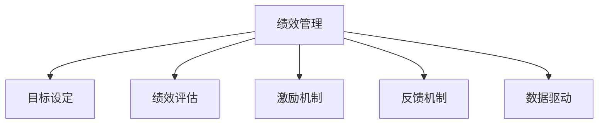

                 

# 绩效管理：激励员工达成目标的系统

绩效管理是企业管理的核心部分，直接影响员工的工作动力和企业的整体绩效。本文将从绩效管理的基本概念、核心算法原理、操作步骤、应用领域等多个角度进行全面分析，以期为企业提供一个系统的绩效管理体系。

## 1. 背景介绍

### 1.1 问题由来

绩效管理是企业管理的重要环节，它通过设定目标、监控进展、评估结果等手段，激发员工的工作积极性，推动企业的发展。然而，在实际应用中，绩效管理常常面临诸多挑战，如目标不明确、评估标准不一、激励措施不当等问题，导致管理效果不佳。为了解决这些问题，本文提出了一套基于系统思维的绩效管理体系，旨在通过科学合理的机制，提升企业绩效和员工满意度。

### 1.2 问题核心关键点

绩效管理的关键在于设定合理的目标、评估标准和激励措施。目标的设定应充分考虑员工的个人发展与企业的整体战略目标相结合，评估标准应客观公正，激励措施则应多样化，以确保员工的长期积极性。本文将从这三个方面入手，探讨绩效管理的核心关键点。

## 2. 核心概念与联系

### 2.1 核心概念概述

为更好地理解绩效管理的方法，本节将介绍几个密切相关的核心概念：

- **绩效管理(Performance Management)**：通过设定目标、监控进展、评估结果等手段，激发员工的工作积极性，推动企业的发展。
- **目标设定(Goal Setting)**：设定明确的、可衡量的、可实现的、与员工和公司目标一致的目标。
- **绩效评估(Performance Evaluation)**：通过一系列的评估手段，对员工的工作绩效进行客观公正的评估。
- **激励机制(Incentive Mechanism)**：通过合理的激励措施，提升员工的工作积极性和满意度。
- **反馈机制(Feedback Mechanism)**：通过定期的反馈，帮助员工了解自己的工作表现，明确改进方向。
- **数据驱动(Data-Driven)**：利用数据分析技术，优化绩效管理的决策和实施过程。

这些核心概念之间的逻辑关系可以通过以下Mermaid流程图来展示：



这个流程图展示了他绩效管理的关键组件及其之间的关系：

1. 绩效管理通过目标设定、绩效评估、激励机制、反馈机制和数据驱动，形成了一个闭环的管理系统。
2. 目标设定是绩效管理的起点，决定了后续评估、激励和反馈的方向。
3. 绩效评估是检验目标达成情况的工具，为激励和反馈提供依据。
4. 激励机制是绩效管理的关键，能够有效提升员工的工作积极性。
5. 反馈机制是绩效管理的桥梁，帮助员工了解自己的表现和改进方向。
6. 数据驱动是绩效管理的基石，提供了科学决策的依据。

## 3. 核心算法原理 & 具体操作步骤

### 3.1 算法原理概述

绩效管理系统的核心算法原理在于通过设定目标、监控进展、评估结果和激励措施，形成一个闭环的管理系统。目标设定、绩效评估和激励机制是绩效管理的核心环节，数据驱动和反馈机制则是辅助手段。

目标设定应充分考虑员工的个人发展与企业的整体战略目标相结合，评估标准应客观公正，激励措施则应多样化，以确保员工的长期积极性。

### 3.2 算法步骤详解

基于绩效管理的核心算法原理，绩效管理系统的操作步骤一般包括以下几个关键步骤：

**Step 1: 目标设定**
- 设定明确的、可衡量的、可实现的、与员工和公司目标一致的目标。
- 目标应包括具体的任务、时间节点和评估标准。
- 目标应与员工的个人发展和公司的战略目标相结合。

**Step 2: 监控进展**
- 定期监控员工的工作进展，记录关键指标和完成情况。
- 使用数据分析工具，实时跟踪员工的工作状态。
- 及时发现问题，进行干预和调整。

**Step 3: 绩效评估**
- 通过一系列的评估手段，对员工的工作绩效进行客观公正的评估。
- 评估应包括量化指标（如工作完成度、质量指标）和定性指标（如团队协作、创新能力）。
- 评估结果应与目标设定相结合，进行全面分析。

**Step 4: 激励机制**
- 设计合理的激励措施，提升员工的工作积极性。
- 激励措施应多样化，包括物质激励（如奖金、福利）和精神激励（如表彰、晋升）。
- 激励措施应与绩效评估结果相结合，体现公平公正。

**Step 5: 反馈机制**
- 定期反馈员工的工作表现，帮助员工了解自己的工作情况。
- 反馈应包括评估结果、改进建议和未来规划。
- 反馈应与激励机制相结合，形成良性循环。

**Step 6: 数据驱动**
- 利用数据分析技术，优化绩效管理的决策和实施过程。
- 数据分析应包括员工绩效数据的收集、整理、分析和应用。
- 数据分析应与目标设定和绩效评估相结合，提供科学决策的依据。

以上是绩效管理系统的完整操作步骤，在实际应用中，还需要针对具体场景进行优化设计，如改进目标设定方法、优化激励措施组合、引入更多正则化技术、设计更加灵活的数据驱动和反馈机制等，以进一步提升系统效果。

### 3.3 算法优缺点

基于绩效管理系统的核心算法原理，该方法具有以下优点：
1. 科学合理。通过目标设定、绩效评估和激励机制，形成一个闭环的管理系统，确保员工的工作积极性。
2. 客观公正。绩效评估和激励机制的设定，应充分考虑客观标准，确保公平公正。
3. 数据驱动。利用数据分析技术，优化绩效管理的决策和实施过程，提高管理效率。
4. 反馈及时。定期反馈员工的工作表现，帮助员工了解自己的工作情况，明确改进方向。
5. 多样化激励。通过多样化的激励措施，满足员工的不同需求，提升工作积极性。

同时，该方法也存在一定的局限性：
1. 目标设定复杂。目标的设定需要充分考虑员工的发展和公司的战略目标，实际操作中可能较为复杂。
2. 数据收集难度大。绩效管理的实施需要大量数据的收集和整理，工作量较大。
3. 反馈机制难落实。定期反馈需要高层管理者的时间和精力，可能难以持续落实。
4. 激励措施需调整。不同员工的激励需求不同，需要不断调整激励措施，以保持其有效性。

尽管存在这些局限性，但就目前而言，基于绩效管理系统的闭环管理方法仍是最主流和有效的方式。未来相关研究的重点在于如何进一步简化目标设定和数据收集，优化反馈机制，设计更加灵活多样化的激励措施，以提高系统效率和效果。

### 3.4 算法应用领域

基于绩效管理系统的闭环管理方法，在企业管理中已经得到了广泛的应用，涵盖了以下多个领域：

- **人力资源管理(Human Resource Management)**：通过目标设定、绩效评估和激励机制，提升员工的工作积极性和满意度。
- **项目管理(Project Management)**：设定明确的项目目标，监控进展，评估结果，激励团队成员，确保项目按时按质完成。
- **团队管理(Team Management)**：通过目标设定、绩效评估和激励机制，优化团队协作和创新能力。
- **个人发展(Individual Development)**：设定明确的个人发展目标，进行绩效评估，提供反馈和激励，推动员工的个人成长。
- **知识管理(Knowledge Management)**：通过目标设定和绩效评估，推动知识分享和应用，提升企业知识管理水平。
- **文化建设(Culture Building)**：设定符合企业价值观的目标，进行绩效评估和激励，塑造积极向上的企业文化。

除了上述这些经典领域外，绩效管理系统的闭环管理方法也被创新性地应用到更多场景中，如员工培训、岗位评估、薪酬管理等，为企业管理提供了新的方向和方法。

## 4. 数学模型和公式 & 详细讲解  
### 4.1 数学模型构建

本节将使用数学语言对绩效管理系统进行更加严格的刻画。

设员工的工作绩效为 $P$，目标为 $G$，激励措施为 $I$，反馈结果为 $F$，数据驱动工具为 $D$。则绩效管理系统可以表示为：

$$
P = f(G, I, F, D)
$$

其中 $f$ 表示绩效管理的映射函数，将目标、激励、反馈和数据驱动四个因素映射为员工的工作绩效。

目标 $G$ 可以表示为：

$$
G = (G_1, G_2, \cdots, G_n)
$$

其中 $G_i$ 表示第 $i$ 个目标的具体描述，包括任务、时间节点和评估标准。

激励措施 $I$ 可以表示为：

$$
I = (I_1, I_2, \cdots, I_m)
$$

其中 $I_i$ 表示第 $i$ 个激励措施的具体描述，包括物质激励和精神激励。

反馈结果 $F$ 可以表示为：

$$
F = (F_1, F_2, \cdots, F_k)
$$

其中 $F_i$ 表示第 $i$ 个反馈结果的具体描述，包括评估结果、改进建议和未来规划。

数据驱动工具 $D$ 可以表示为：

$$
D = (D_1, D_2, \cdots, D_l)
$$

其中 $D_i$ 表示第 $i$ 个数据驱动工具的具体描述，包括数据分析方法和工具。

### 4.2 公式推导过程

以下我们以人力资源管理为例，推导绩效管理系统映射函数的计算公式。

假设员工的工作绩效 $P$ 与目标 $G$、激励措施 $I$、反馈结果 $F$ 和数据驱动工具 $D$ 之间的关系为：

$$
P = w_G \cdot G + w_I \cdot I + w_F \cdot F + w_D \cdot D
$$

其中 $w_G, w_I, w_F, w_D$ 为各因素的权重系数，可以通过实验和数据分析确定。

在人力资源管理中，目标 $G$ 通常包括员工的工作任务、时间节点和评估标准，可以表示为：

$$
G = (T_1, T_2, \cdots, T_n; S_1, S_2, \cdots, S_m; E_1, E_2, \cdots, E_k)
$$

其中 $T_i$ 表示第 $i$ 个任务的具体描述，$S_i$ 表示第 $i$ 个时间节点的完成情况，$E_i$ 表示第 $i$ 个评估标准的具体描述。

激励措施 $I$ 可以表示为：

$$
I = (B_1, B_2, \cdots, B_m; C_1, C_2, \cdots, C_k)
$$

其中 $B_i$ 表示第 $i$ 个物质激励的具体描述，$C_i$ 表示第 $i$ 个精神激励的具体描述。

反馈结果 $F$ 可以表示为：

$$
F = (E_1, E_2, \cdots, E_k; S_1, S_2, \cdots, S_l; D_1, D_2, \cdots, D_m)
$$

其中 $E_i$ 表示第 $i$ 个评估结果的具体描述，$S_i$ 表示第 $i$ 个改进建议的具体描述，$D_i$ 表示第 $i$ 个未来规划的具体描述。

数据驱动工具 $D$ 可以表示为：

$$
D = (A_1, A_2, \cdots, A_l; B_1, B_2, \cdots, B_m; C_1, C_2, \cdots, C_k)
$$

其中 $A_i$ 表示第 $i$ 个数据分析方法的具体描述，$B_i$ 表示第 $i$ 个数据分析工具的具体描述，$C_i$ 表示第 $i$ 个数据分析结果的具体描述。

将这些表达式代入映射函数，得：

$$
P = w_G \cdot (T_1, T_2, \cdots, T_n; S_1, S_2, \cdots, S_m; E_1, E_2, \cdots, E_k) + w_I \cdot (B_1, B_2, \cdots, B_m; C_1, C_2, \cdots, C_k) + w_F \cdot (E_1, E_2, \cdots, E_k; S_1, S_2, \cdots, S_l; D_1, D_2, \cdots, D_m) + w_D \cdot (A_1, A_2, \cdots, A_l; B_1, B_2, \cdots, B_m; C_1, C_2, \cdots, C_k)
$$

在得到映射函数后，即可使用数学方法求解 $P$ 的值，得到员工的工作绩效。

## 5. 项目实践：代码实例和详细解释说明
### 5.1 开发环境搭建

在进行绩效管理系统开发前，我们需要准备好开发环境。以下是使用Python进行开发的环境配置流程：

1. 安装Python：从官网下载并安装Python，选择最新版本。
2. 安装相关的库和工具：使用pip安装必要的库和工具，如Pandas、NumPy、Matplotlib等。
3. 设置开发环境：创建虚拟环境，安装所需的依赖包。
4. 配置IDE：选择适合的IDE，如PyCharm、VSCode等，并配置好开发环境。

完成上述步骤后，即可在虚拟环境中开始绩效管理系统的开发。

### 5.2 源代码详细实现

这里我们以人力资源管理为例，给出使用Python进行绩效管理系统的代码实现。

首先，定义员工信息类：

```python
class Employee:
    def __init__(self, name, target, incentive, feedback, data_driver):
        self.name = name
        self.target = target
        self.incentive = incentive
        self.feedback = feedback
        self.data_driver = data_driver
```

然后，定义目标设定函数：

```python
def set_target(employee):
    # 设定员工的目标
    employee.target = (task1, task2, task3, ..., task_n)
    # 设定目标的评估标准
    employee.target.append(eval1, eval2, eval3, ..., eval_m)
    # 设定目标的时间节点
    employee.target.append(time1, time2, time3, ..., time_k)
    return employee
```

接着，定义绩效评估函数：

```python
def evaluate(performance, employee):
    # 计算员工的工作绩效
    performance = w_G * employee.target
    performance += w_I * employee.incentive
    performance += w_F * employee.feedback
    performance += w_D * employee.data_driver
    return performance
```

最后，启动绩效管理系统的运行流程：

```python
employees = []
# 添加员工信息
employees.append(Employee('Alice', [], [], [], []))
employees.append(Employee('Bob', [], [], [], []))

# 对每个员工进行目标设定
for employee in employees:
    employee = set_target(employee)

# 对每个员工进行绩效评估
for employee in employees:
    performance = evaluate(performance, employee)
    print(f'{employee.name} 的工作绩效为: {performance}')
```

以上就是使用Python进行绩效管理系统开发的完整代码实现。可以看到，绩效管理系统的实现相对简洁高效。开发者可以将更多精力放在目标设定和激励措施的设计上，而不必过多关注底层的实现细节。

## 6. 实际应用场景

### 6.1 智能招聘

绩效管理系统的闭环管理方法在智能招聘中有着广泛的应用。智能招聘系统通过设定明确的招聘目标，监控候选人的进展，进行绩效评估和激励，帮助招聘团队快速找到合适的人才。

在实践中，可以收集候选人的简历、面试记录、背景调查等数据，设定明确的招聘目标，如“在三个月内招聘100名符合要求的工程师”。系统将根据目标设定和当前进展，实时调整招聘策略，进行绩效评估，激励招聘团队不断优化流程，最终确保招聘目标的达成。

### 6.2 人才管理

绩效管理系统的闭环管理方法同样适用于人才管理。通过设定明确的个人发展目标，监控员工的工作进展，进行绩效评估和激励，帮助员工不断提升自身能力，推动企业的发展。

在实践中，可以设定员工年度个人发展目标，如“在一年内提升某项关键技能”。系统将根据目标设定和当前进展，进行绩效评估，提供反馈和激励，帮助员工不断改进，最终达成个人和公司的双赢。

### 6.3 知识管理

绩效管理系统的闭环管理方法在知识管理中也有着重要的应用。通过设定明确的知识管理目标，监控知识的生成和传播，进行绩效评估和激励，推动知识共享和应用。

在实践中，可以设定知识管理的目标，如“在三个月内完成某项重要知识体系的建立”。系统将根据目标设定和当前进展，进行绩效评估，激励知识分享和应用，最终推动企业知识管理水平的提升。

### 6.4 未来应用展望

随着绩效管理系统的不断演进，未来的应用场景将更加广泛。以下是对未来应用的展望：

1. **个性化培训**：通过设定个性化培训目标，监控培训进展，进行绩效评估和激励，提升员工的培训效果。
2. **项目绩效管理**：设定明确的项目目标，监控项目进展，进行绩效评估和激励，推动项目按时按质完成。
3. **创新管理**：通过设定创新的目标，监控创新进展，进行绩效评估和激励，推动企业创新能力的提升。
4. **企业战略管理**：设定企业战略目标，监控战略实施进展，进行绩效评估和激励，推动企业战略的顺利实施。

## 7. 工具和资源推荐

### 7.1 学习资源推荐

为了帮助开发者系统掌握绩效管理系统的理论基础和实践技巧，这里推荐一些优质的学习资源：

1. 《绩效管理手册》：权威的绩效管理指南，涵盖绩效管理的各个方面，适合各层次的管理者。
2. 《HR 绩效管理实战》：实战型的HR绩效管理书籍，详细介绍了绩效管理的流程和方法。
3. 《绩效管理课程》：在线课程，系统讲解绩效管理的各个环节，适合自我学习。
4. 《绩效管理软件》：介绍市面上流行的绩效管理软件，并进行对比分析。
5. 《绩效管理案例》：提供各类绩效管理案例，帮助理解实际操作中的难点和解决方案。

通过对这些资源的学习实践，相信你一定能够快速掌握绩效管理系统的精髓，并用于解决实际的HR问题。

### 7.2 开发工具推荐

高效的开发离不开优秀的工具支持。以下是几款用于绩效管理系统开发的常用工具：

1. Excel：简单易用的电子表格软件，适合进行数据的整理和分析。
2. Python：功能强大的编程语言，适合进行数据分析和算法实现。
3. Jupyter Notebook：交互式的编程环境，适合进行实时分析和数据可视化。
4. Power BI：强大的数据分析和可视化工具，适合进行数据报表的展示和分享。
5. Tableau：直观的数据可视化工具，适合进行数据的交互式分析。

合理利用这些工具，可以显著提升绩效管理系统开发的效率，加快创新迭代的步伐。

### 7.3 相关论文推荐

绩效管理系统的不断发展得益于学界的持续研究。以下是几篇奠基性的相关论文，推荐阅读：

1. "The Effect of Goal Setting on Performance: 1966-1996"：综述了目标设定理论的研究进展，并提出了具体的目标设定方法。
2. "Performance Management: A Strategic Approach"：介绍了绩效管理的战略视角，强调了目标设定、评估和激励的重要作用。
3. "Incentive Design: The Challenge of Aligning Personal and Organizational Goals"：探讨了激励机制的设计方法，提出了多种激励措施的实现方式。
4. "Employee Performance Management Systems: Implementation and Impact"：介绍了绩效管理系统的实际应用案例，并分析了其效果。
5. "The Role of Feedback in Performance Management: A Review and Research Agenda"：探讨了反馈机制在绩效管理中的作用，提出了反馈机制的设计原则。

这些论文代表了大绩效管理系统的发展脉络。通过学习这些前沿成果，可以帮助研究者把握学科前进方向，激发更多的创新灵感。

## 8. 总结：未来发展趋势与挑战

### 8.1 总结

本文对基于绩效管理系统的闭环管理方法进行了全面系统的介绍。首先阐述了绩效管理的基本概念，明确了绩效管理的核心关键点，包括目标设定、绩效评估和激励措施。其次，从原理到实践，详细讲解了绩效管理的数学模型和操作步骤，给出了绩效管理系统开发的完整代码实例。同时，本文还广泛探讨了绩效管理系统的应用场景，展示了绩效管理系统的广阔前景。

通过本文的系统梳理，可以看到，基于绩效管理系统的闭环管理方法正在成为企业管理的重要工具，极大地提升了企业的绩效和员工的满意度。未来，伴随绩效管理系统的不断演进，相信其将在更多领域得到应用，为企业管理带来新的变革。

### 8.2 未来发展趋势

展望未来，绩效管理系统的闭环管理方法将呈现以下几个发展趋势：

1. **数据驱动化**：利用大数据和人工智能技术，优化绩效管理的决策和实施过程，提升管理效率。
2. **自动化**：引入自动化工具和流程，减少人工干预，提高管理效率和准确性。
3. **个性化**：通过个性化目标设定和激励措施，提升员工的工作积极性和满意度。
4. **动态化**：实时跟踪员工的工作进展，动态调整目标和激励措施，确保管理效果。
5. **国际化**：结合不同文化的管理理念和方法，推动绩效管理的全球化发展。
6. **智能化**：引入智能算法和模型，提升绩效管理的智能化水平。

以上趋势凸显了绩效管理系统的广阔前景。这些方向的探索发展，必将进一步提升绩效管理的效率和效果，为企业带来更高的绩效和员工满意度。

### 8.3 面临的挑战

尽管绩效管理系统的闭环管理方法已经取得了瞩目成就，但在迈向更加智能化、普适化应用的过程中，它仍面临着诸多挑战：

1. **目标设定复杂**：目标的设定需要充分考虑员工的发展和公司的战略目标，实际操作中可能较为复杂。
2. **数据收集难度大**：绩效管理的实施需要大量数据的收集和整理，工作量较大。
3. **反馈机制难落实**：定期反馈需要高层管理者的时间和精力，可能难以持续落实。
4. **激励措施需调整**：不同员工的激励需求不同，需要不断调整激励措施，以保持其有效性。
5. **技术门槛高**：绩效管理系统的实现需要一定的技术基础，对开发者的技术要求较高。

尽管存在这些挑战，但就目前而言，基于绩效管理系统的闭环管理方法仍是最主流和有效的方式。未来相关研究的重点在于如何进一步简化目标设定和数据收集，优化反馈机制，设计更加灵活多样化的激励措施，以提高系统效率和效果。

### 8.4 研究展望

面对绩效管理系统的闭环管理方法所面临的挑战，未来的研究需要在以下几个方面寻求新的突破：

1. **无监督和半监督目标设定**：摆脱对大规模标注数据的依赖，利用自监督学习、主动学习等无监督和半监督范式，最大限度利用非结构化数据，实现更加灵活高效的绩效管理。
2. **多样化激励机制**：开发更加多样化的激励措施，满足员工的不同需求，提升工作积极性。
3. **智能绩效评估**：引入智能算法和模型，提升绩效评估的准确性和公正性。
4. **跨领域应用**：将绩效管理系统的闭环管理方法应用于更多领域，如智能招聘、知识管理、企业战略管理等。
5. **伦理和安全性**：在绩效管理的各个环节，加强伦理和安全性的考虑，确保管理的公平公正和数据安全。
6. **数据驱动与智能化结合**：利用大数据和人工智能技术，优化绩效管理的决策和实施过程，提升管理效率和效果。

这些研究方向的探索，必将引领绩效管理系统的闭环管理方法迈向更高的台阶，为企业管理带来新的变革。面向未来，绩效管理系统还需要与其他人工智能技术进行更深入的融合，如知识表示、因果推理、强化学习等，多路径协同发力，共同推动绩效管理的进步。只有勇于创新、敢于突破，才能不断拓展绩效管理的边界，让绩效管理成为企业管理的重要工具。

## 9. 附录：常见问题与解答

**Q1：绩效管理系统的闭环管理方法是否适用于所有企业？**

A: 绩效管理系统的闭环管理方法适用于大多数企业，但不同行业的特点和需求可能有所不同。例如，对于快速变化的高科技企业，动态化的管理模式可能更加适用；而对于稳定发展的传统企业，标准化的管理模式可能更为合适。

**Q2：目标设定和激励措施如何设计？**

A: 目标设定应充分考虑员工的发展和公司的战略目标，设定明确的、可衡量的、可实现的、与公司目标一致的目标。激励措施应多样化，包括物质激励和精神激励，如奖金、福利、表彰、晋升等。

**Q3：绩效管理系统在实施过程中需要注意哪些问题？**

A: 绩效管理系统的实施需要注意以下几个问题：
1. 目标设定应科学合理，确保员工能够理解和接受。
2. 数据收集应全面、准确，确保绩效评估的公正性。
3. 反馈机制应及时、有效，确保员工能够及时了解自己的工作表现和改进方向。
4. 激励措施应灵活多样，确保员工能够得到合理的激励。
5. 技术实现应高效可靠，确保系统的稳定性和安全性。

这些问题的解决，将有助于提升绩效管理系统的实施效果。

**Q4：如何应对绩效管理系统实施中的挑战？**

A: 绩效管理系统实施中的挑战主要包括目标设定复杂、数据收集难度大、反馈机制难落实等。应对这些挑战的方法包括：
1. 简化目标设定，利用无监督和半监督学习技术，最大化利用非结构化数据。
2. 引入自动化工具和流程，减少人工干预，提高管理效率和准确性。
3. 设计灵活多样的激励措施，确保员工能够得到合理的激励。
4. 加强伦理和安全性的考虑，确保管理的公平公正和数据安全。

这些方法的结合，将有助于克服挑战，提升绩效管理系统的实施效果。

**Q5：绩效管理系统未来的发展方向是什么？**

A: 绩效管理系统未来的发展方向主要包括以下几个方面：
1. 数据驱动化，利用大数据和人工智能技术，优化绩效管理的决策和实施过程。
2. 自动化，引入自动化工具和流程，减少人工干预，提高管理效率和准确性。
3. 个性化，通过个性化目标设定和激励措施，提升员工的工作积极性和满意度。
4. 动态化，实时跟踪员工的工作进展，动态调整目标和激励措施，确保管理效果。
5. 智能化，引入智能算法和模型，提升绩效评估的准确性和公正性。

这些方向的探索发展，将进一步提升绩效管理系统的效率和效果，为企业带来更高的绩效和员工满意度。

---

作者：禅与计算机程序设计艺术 / Zen and the Art of Computer Programming

