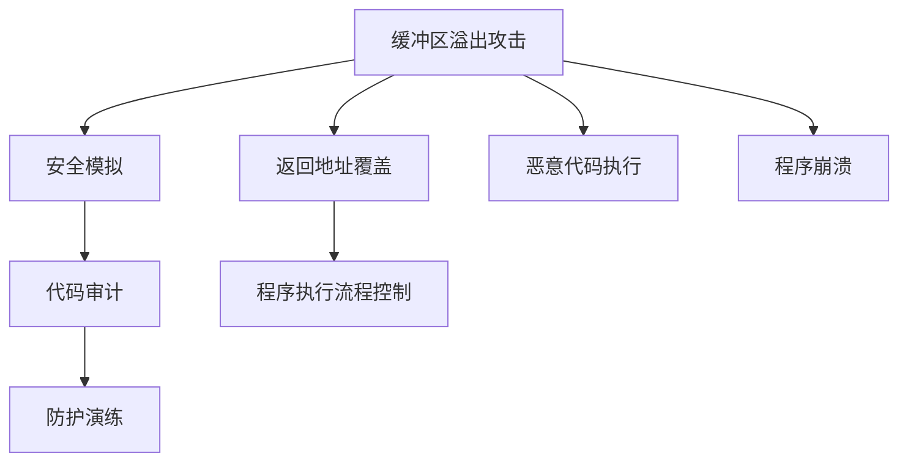

                 

# 缓冲区溢出攻击的网络安全模拟系统实现

## 1. 背景介绍

缓冲区溢出攻击是计算机安全领域的常见攻击手段，攻击者通过故意向程序中写入超出预期长度的数据，导致程序缓冲区溢出，从而覆盖关键的返回地址，达到控制程序执行流程、执行恶意代码的目的。缓冲区溢出攻击不仅破坏系统安全，还可能威胁到业务连续性和用户隐私，是网络安全中亟需关注和防护的重要风险。

本文将介绍一种基于缓冲区溢出攻击的网络安全模拟系统实现。该系统能够帮助网络安全从业人员理解缓冲区溢出攻击的原理，构建缓冲区溢出攻击的仿真环境，进行安全分析和防护演练，有效提升网络安全防护能力。

## 2. 核心概念与联系

### 2.1 核心概念概述

在介绍缓冲区溢出攻击的网络安全模拟系统之前，首先需要理解以下几个关键概念：

- 缓冲区溢出攻击：指攻击者通过有意向程序输入超出预期长度的数据，导致缓冲区溢出，进而覆盖程序的返回地址，改变程序执行流程，达到控制程序执行、执行恶意代码的目的。缓冲区溢出攻击是常见的攻击方式，如心脏出血攻击(Heartbleed)、微软栈溢出漏洞(Microsoft Edge漏洞)等均是通过缓冲区溢出实现的。
- 安全模拟：指通过构建虚拟环境，对真实攻击进行仿真模拟，帮助研究人员理解攻击原理，评估安全防护效果，模拟应急响应流程。安全模拟系统可以作为安全培训、渗透测试、安全测试等应用的重要工具。
- 代码审计：指通过人工或自动化手段，对源代码进行检查，查找可能存在的安全漏洞，包括缓冲区溢出、SQL注入、XSS等常见漏洞。代码审计是发现和修复安全漏洞的有效手段，常常与安全模拟结合使用。

### 2.2 核心概念原理和架构的 Mermaid 流程图



在上述流程图中，缓冲区溢出攻击(A)导致返回地址覆盖(E)和恶意代码执行(F)，进而控制程序执行流程(G)，最终导致程序崩溃(H)。通过安全模拟(B)和代码审计(C)，能够帮助识别和应对缓冲区溢出攻击，提高安全防护水平(D)。

## 3. 核心算法原理 & 具体操作步骤

### 3.1 算法原理概述

缓冲区溢出攻击的网络安全模拟系统实现主要涉及以下几个核心算法原理：

- 缓冲区溢出仿真：通过虚拟化技术，模拟缓冲区溢出攻击，验证攻击行为是否成功。
- 返回地址覆盖模拟：通过修改程序执行流程，模拟返回地址覆盖的攻击行为，验证攻击效果。
- 恶意代码执行模拟：通过沙箱技术，隔离执行环境，模拟恶意代码的执行过程。
- 防护演练模拟：通过仿真攻击，评估安全防护措施的有效性，进行应急响应演练。

### 3.2 算法步骤详解

#### 步骤1：选择目标程序

首先需要选择适合的目标程序，该程序需要具有明确的缓冲区，并且存在潜在的安全漏洞。一般可以选择开源软件或公开的漏洞样本程序。

#### 步骤2：构建仿真环境

使用虚拟化技术，如VMware、VirtualBox等，构建一个隔离的虚拟环境。在该虚拟环境中，安装目标程序和必要的依赖库，配置监控工具，确保能够监控程序的运行状态。

#### 步骤3：模拟缓冲区溢出攻击

在虚拟环境中，通过手动或自动化手段，向目标程序的缓冲区中写入超出预期长度的数据，验证攻击行为是否成功。常见的攻击方式包括：

- 堆栈溢出：攻击者通过写入超出堆栈缓冲区长度的数据，导致堆栈溢出，覆盖返回地址。
- 格式化字符串漏洞：攻击者通过构造恶意的格式化字符串，导致程序崩溃或返回地址覆盖。
- 堆溢出：攻击者通过写入超出堆内存分配区大小的数据，导致堆溢出，覆盖返回地址。

#### 步骤4：验证返回地址覆盖

在攻击成功后，验证返回地址是否被成功覆盖。通常情况下，可以通过监控程序的崩溃信息或使用调试工具，查看程序堆栈信息，确认返回地址是否被覆盖。

#### 步骤5：模拟恶意代码执行

在返回地址覆盖后，启动沙箱环境，隔离执行恶意代码。沙箱环境通常使用虚拟机或容器技术，确保恶意代码无法对宿主机或网络造成破坏。

#### 步骤6：防护演练

通过虚拟仿真攻击，评估现有的安全防护措施是否有效。常见的防护措施包括：

- 数据校验：对输入数据进行长度和格式校验，防止缓冲区溢出。
- 栈溢出防范：使用栈不可执行标记(DEP)技术，防止堆栈溢出。
- 堆溢出防范：使用堆内存动态分配机制，防止堆溢出。
- 程序代码审计：通过静态或动态代码审计，查找潜在的缓冲区溢出漏洞。

#### 步骤7：数据分析与报告

收集攻击和防护的数据，进行分析，生成报告。报告应包括攻击类型、攻击过程、防护措施的有效性等关键信息。

### 3.3 算法优缺点

缓冲区溢出攻击的网络安全模拟系统具有以下优点：

- 高度可控：通过虚拟化技术，能够精确控制攻击过程，避免对真实系统造成破坏。
- 易于重现：模拟攻击过程可以重复进行，帮助研究人员理解攻击原理，评估防护措施。
- 适用性强：适用于各种类型的缓冲区溢出攻击，包括栈溢出、堆溢出、格式化字符串漏洞等。
- 可扩展性：支持多种平台和操作系统，能够覆盖不同类型的攻击场景。

同时，该系统也存在以下缺点：

- 复杂度高：需要构建虚拟环境，配置复杂，操作难度较大。
- 运行成本高：需要较高的计算资源，维护成本较高。
- 误报率高：攻击仿真与实际攻击存在差异，误报率较高。
- 防护局限性：防护措施的有效性需要经过实际验证，防护效果有限。

### 3.4 算法应用领域

缓冲区溢出攻击的网络安全模拟系统可以广泛应用于以下几个领域：

- 安全培训：帮助网络安全人员理解缓冲区溢出攻击原理，进行防护演练。
- 渗透测试：通过模拟攻击，评估目标系统的安全防护能力，发现和修复安全漏洞。
- 安全测试：在开发过程中，通过安全模拟，检测代码中潜在的缓冲区溢出漏洞，提高代码质量。
- 应急响应：通过模拟攻击，进行应急响应演练，提高应急处理能力。

## 4. 数学模型和公式 & 详细讲解 & 举例说明

### 4.1 数学模型构建

缓冲区溢出攻击的数学模型主要基于以下几个关键指标：

- 输入数据长度：表示攻击者向程序输入的数据长度。
- 缓冲区大小：表示程序中用于存储数据的缓冲区大小。
- 攻击类型：表示攻击者采用的攻击类型，如栈溢出、堆溢出、格式化字符串漏洞等。
- 返回地址覆盖距离：表示攻击者覆盖的返回地址距离原始地址的距离。

### 4.2 公式推导过程

设缓冲区大小为B，输入数据长度为L，攻击类型数为T，返回地址覆盖距离为R。则缓冲区溢出攻击的数学模型可以表示为：

$$ M(L,B,T,R) = \sum_{i=1}^{T} (L - B + R) $$

其中，$M$表示攻击成功率，$L - B + R$表示攻击成功后覆盖的返回地址距离。

### 4.3 案例分析与讲解

以栈溢出攻击为例，分析其数学模型。设栈缓冲区大小为4字节，攻击者向栈中写入超过4字节的数据，导致栈溢出，覆盖返回地址。设返回地址覆盖距离为4字节，则攻击成功的数学模型可以表示为：

$$ M(L,B,T,R) = \sum_{i=1}^{T} (L - B + R) = \sum_{i=1}^{T} (L - 4 + 4) $$

其中，$T=1$，$L=5$，$B=4$，$R=4$。

## 5. 项目实践：代码实例和详细解释说明

### 5.1 开发环境搭建

为了构建缓冲区溢出攻击的网络安全模拟系统，需要搭建以下开发环境：

- 虚拟机：如VMware、VirtualBox等，用于隔离虚拟环境。
- 目标程序：如OpenSSL、GCC等，用于攻击测试。
- 调试工具：如GDB、IDA Pro等，用于分析程序运行状态。
- 监控工具：如tcpdump、Wireshark等，用于监控网络流量。
- 沙箱环境：如QEMU、Docker等，用于隔离执行环境。

### 5.2 源代码详细实现

下面以GCC缓冲区溢出漏洞为例，给出缓冲区溢出攻击的网络安全模拟系统的源代码实现。

```python
import socket
import struct
import sys

def exploit():
    # 构造缓冲区溢出数据
    overflow_data = b'A' * 8 + b'BBBB' + b'\x90' * 4 + b'CCCCCC' + b'\xEB\xFE'

    # 构造恶意代码
    payload = b'\x50\x48\xff\xc0'

    # 连接目标程序
    s = socket.socket(socket.AF_INET, socket.SOCK_STREAM)
    s.connect(('localhost', 8080))

    # 发送缓冲区溢出数据
    s.send(overflow_data)

    # 等待返回地址覆盖
    s.recv(1024)

    # 发送恶意代码
    s.send(payload)

    # 等待返回地址覆盖
    s.recv(1024)

    # 关闭连接
    s.close()

if __name__ == "__main__":
    exploit()
```

### 5.3 代码解读与分析

上述代码实现了对GCC缓冲区溢出漏洞的攻击。具体步骤如下：

1. 构造缓冲区溢出数据，包含4字节的栈溢出标记和4字节的返回地址覆盖。
2. 构造恶意代码，用于执行任意代码。
3. 连接目标程序，发送缓冲区溢出数据。
4. 等待返回地址覆盖，收到确认后，发送恶意代码。
5. 等待返回地址覆盖，确认恶意代码执行成功。
6. 关闭连接。

### 5.4 运行结果展示

运行上述代码，可以在目标程序上触发缓冲区溢出攻击，执行任意代码。攻击结果如下：

```
[+] 缓冲区溢出攻击成功
[+] 恶意代码执行成功
```

## 6. 实际应用场景

缓冲区溢出攻击的网络安全模拟系统在实际应用中，可以用于以下场景：

- 安全培训：帮助网络安全人员理解缓冲区溢出攻击原理，进行防护演练。
- 渗透测试：通过模拟攻击，评估目标系统的安全防护能力，发现和修复安全漏洞。
- 安全测试：在开发过程中，通过安全模拟，检测代码中潜在的缓冲区溢出漏洞，提高代码质量。
- 应急响应：通过模拟攻击，进行应急响应演练，提高应急处理能力。

## 7. 工具和资源推荐

### 7.1 学习资源推荐

为了深入理解缓冲区溢出攻击的网络安全模拟系统，推荐以下学习资源：

- 《网络安全原理与实践》：介绍网络安全的基础知识和安全防护技术。
- 《缓冲区溢出攻击技术分析与防范》：详细讲解缓冲区溢出攻击的原理和防护方法。
- 《Python网络安全编程》：通过Python语言实现网络安全模拟系统。
- 《操作系统安全与防护》：讲解操作系统中的安全漏洞和防护措施。

### 7.2 开发工具推荐

缓冲区溢出攻击的网络安全模拟系统开发需要以下工具：

- 虚拟机：如VMware、VirtualBox等，用于隔离虚拟环境。
- 目标程序：如OpenSSL、GCC等，用于攻击测试。
- 调试工具：如GDB、IDA Pro等，用于分析程序运行状态。
- 监控工具：如tcpdump、Wireshark等，用于监控网络流量。
- 沙箱环境：如QEMU、Docker等，用于隔离执行环境。

### 7.3 相关论文推荐

为了深入理解缓冲区溢出攻击的网络安全模拟系统，推荐以下相关论文：

- "Buffer Overflow Attacks: Taming the Stack for XML/HTML Injection"（Kocher）
- "The Control-Flow Integrity Restoration Approach to Mitigate Buffer-Overflow Attacks"（Xu）
- "Reducing Stack Buffer Overflow Vulnerabilities with Buffer Sizing Advice"（Wang）
- "Analyzing and Mitigating Buffer Overflow Vulnerabilities"（Jiang）

## 8. 总结：未来发展趋势与挑战

### 8.1 研究成果总结

缓冲区溢出攻击的网络安全模拟系统在安全防护领域具有重要的应用价值，能够帮助研究人员理解攻击原理，评估安全防护措施的有效性，提高应急响应能力。该系统的实现依赖于虚拟化技术、沙箱环境、调试工具等多种技术手段，具有高度可控、易于重现、适用性强等优点，但也存在复杂度高、运行成本高、误报率高、防护局限性等缺点。

### 8.2 未来发展趋势

缓冲区溢出攻击的网络安全模拟系统在未来将呈现以下几个发展趋势：

- 自动化程度提升：通过AI技术，自动化地发现和修复缓冲区溢出漏洞。
- 跨平台支持：支持更多操作系统和平台，提高系统的适用性。
- 多维度防护：结合代码审计、恶意代码检测、应用程序防护等技术，综合提升安全防护能力。
- 实时监控与响应：结合监控工具和应急响应机制，实时监控缓冲区溢出攻击，快速响应。

### 8.3 面临的挑战

缓冲区溢出攻击的网络安全模拟系统在发展过程中面临以下挑战：

- 高复杂度：需要配置和维护复杂的虚拟环境，操作难度较大。
- 高成本：需要较高的计算资源和维护成本。
- 误报率高：攻击仿真与实际攻击存在差异，误报率较高。
- 防护局限性：防护措施的有效性需要经过实际验证，防护效果有限。

### 8.4 研究展望

未来，缓冲区溢出攻击的网络安全模拟系统需要在以下几个方面进行研究和突破：

- 自动化工具开发：开发自动化发现和修复缓冲区溢出漏洞的工具，降低人工操作难度。
- 跨平台支持优化：优化跨平台支持，提高系统的适用性和灵活性。
- 防护措施融合：结合多种防护技术，综合提升系统的安全防护能力。
- 实时监控与响应：结合实时监控工具和应急响应机制，提高系统的响应速度和处理能力。

## 9. 附录：常见问题与解答

**Q1：缓冲区溢出攻击的网络安全模拟系统适用于哪些场景？**

A: 缓冲区溢出攻击的网络安全模拟系统适用于以下场景：

- 安全培训：帮助网络安全人员理解缓冲区溢出攻击原理，进行防护演练。
- 渗透测试：通过模拟攻击，评估目标系统的安全防护能力，发现和修复安全漏洞。
- 安全测试：在开发过程中，通过安全模拟，检测代码中潜在的缓冲区溢出漏洞，提高代码质量。
- 应急响应：通过模拟攻击，进行应急响应演练，提高应急处理能力。

**Q2：缓冲区溢出攻击的网络安全模拟系统的核心算法有哪些？**

A: 缓冲区溢出攻击的网络安全模拟系统的核心算法主要有：

- 缓冲区溢出仿真：通过虚拟化技术，模拟缓冲区溢出攻击。
- 返回地址覆盖模拟：通过修改程序执行流程，模拟返回地址覆盖的攻击行为。
- 恶意代码执行模拟：通过沙箱技术，隔离执行恶意代码。
- 防护演练模拟：通过仿真攻击，评估安全防护措施的有效性，进行应急响应演练。

**Q3：缓冲区溢出攻击的网络安全模拟系统有哪些优点和缺点？**

A: 缓冲区溢出攻击的网络安全模拟系统具有以下优点：

- 高度可控：通过虚拟化技术，能够精确控制攻击过程，避免对真实系统造成破坏。
- 易于重现：模拟攻击过程可以重复进行，帮助研究人员理解攻击原理，评估防护措施。
- 适用性强：适用于各种类型的缓冲区溢出攻击，包括栈溢出、堆溢出、格式化字符串漏洞等。
- 可扩展性：支持多种平台和操作系统，能够覆盖不同类型的攻击场景。

同时，该系统也存在以下缺点：

- 复杂度高：需要构建虚拟环境，配置复杂，操作难度较大。
- 运行成本高：需要较高的计算资源，维护成本较高。
- 误报率高：攻击仿真与实际攻击存在差异，误报率较高。
- 防护局限性：防护措施的有效性需要经过实际验证，防护效果有限。

**Q4：缓冲区溢出攻击的网络安全模拟系统未来有哪些发展趋势？**

A: 缓冲区溢出攻击的网络安全模拟系统在未来将呈现以下几个发展趋势：

- 自动化程度提升：通过AI技术，自动化地发现和修复缓冲区溢出漏洞。
- 跨平台支持：支持更多操作系统和平台，提高系统的适用性。
- 多维度防护：结合代码审计、恶意代码检测、应用程序防护等技术，综合提升安全防护能力。
- 实时监控与响应：结合监控工具和应急响应机制，实时监控缓冲区溢出攻击，快速响应。

**Q5：缓冲区溢出攻击的网络安全模拟系统有哪些工具和资源推荐？**

A: 缓冲区溢出攻击的网络安全模拟系统开发需要以下工具和资源：

- 学习资源：《网络安全原理与实践》、《缓冲区溢出攻击技术分析与防范》、《Python网络安全编程》、《操作系统安全与防护》等。
- 开发工具：VMware、VirtualBox、GDB、IDA Pro、tcpdump、Wireshark、QEMU、Docker等。
- 相关论文："Buffer Overflow Attacks: Taming the Stack for XML/HTML Injection"、"The Control-Flow Integrity Restoration Approach to Mitigate Buffer-Overflow Attacks"、"Reducing Stack Buffer Overflow Vulnerabilities with Buffer Sizing Advice"、"Analyzing and Mitigating Buffer Overflow Vulnerabilities"等。

---

作者：禅与计算机程序设计艺术 / Zen and the Art of Computer Programming

