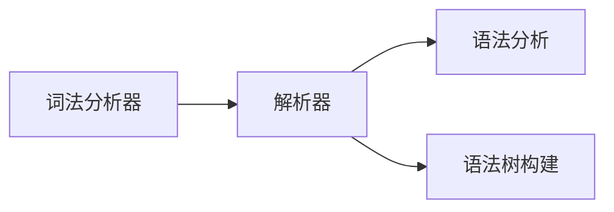
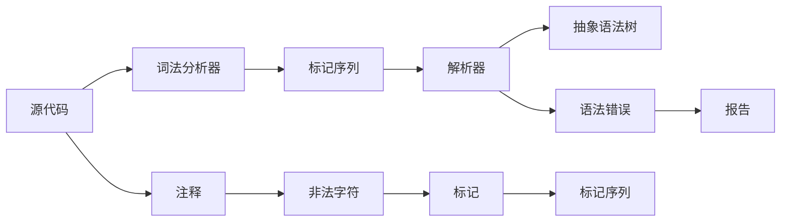

                 

## 1. 背景介绍

编译器设计是计算机科学中的核心议题之一。它涉及从源代码到机器代码的自动转化过程。这一过程通过词法分析、语法分析、语义分析、中间代码生成和代码优化等步骤，逐步完成程序翻译工作。而词法分析器和解析器作为编译器的前端组件，直接面对源代码，承担着识别和解析程序结构的重要任务。

### 1.1 问题由来

在现代计算机科学中，随着源代码规模的增大和复杂度的提升，编译器的作用愈发重要。但与此同时，其设计和实现也变得更加复杂。

- 首先是词法分析器，它需要正确处理各种语言的特性，包括单词边界、注释、空格、字符串、数字和符号等。
- 其次是解析器，它不仅要解析词法分析器提供的数据流，还要能够识别语法结构，生成抽象语法树（Abstract Syntax Tree, AST）。

无论是词法分析还是语法分析，都需要处理大量且复杂的数据，保证在各种情况下都能正确处理输入，提供准确的中间表示，为后续的代码生成和优化提供坚实的基础。

### 1.2 问题核心关键点

编译器设计的核心在于如何高效、准确地解析源代码，生成易于理解和处理的中间表示。其中：

- 词法分析器需将源代码分解成一组标记（tokens）序列。
- 解析器需构建抽象语法树，并检查语法正确性。

这些组件协同工作，确保代码能够被准确地理解和执行。以下是词法分析器和解析器的核心概念和联系的示意图：



词法分析器从源代码中提取标记，并移除非法字符，如注释、注释标记等。解析器则在此基础上，根据语法规则进行词法分析，生成抽象语法树，并对语法错误进行检查和报告。

## 2. 核心概念与联系

### 2.1 核心概念概述

以下我们具体分析词法分析器和解析器的核心概念及其联系。

- **词法分析器（Lexical Analyzer）**：将源代码中的字符流转化为标记序列。其主要任务包括：
  - 识别单词、标识符、运算符等。
  - 处理字符串、数字、注释等特殊情况。

- **解析器（Parser）**：负责将词法分析器生成的标记序列解析为抽象语法树。解析器按以下步骤进行：
  - 识别语法结构。
  - 生成AST。
  - 检查语法错误。

- **抽象语法树（Abstract Syntax Tree, AST）**：一种树形结构，用于表示程序的语法结构。每个节点代表一个语法单元，如表达式、语句、变量等。

- **语法分析（Syntactic Analysis）**：在解析器中，通过识别和检查语法结构，确保代码的合法性。

- **正则表达式（Regular Expression, RE）**：用于描述和匹配字符串的模式，常用于词法分析器的实现。

### 2.2 核心概念原理和架构的 Mermaid 流程图

下图展示了词法分析器和解析器的基本架构和流程：



词法分析器从源代码中提取标记，移除注释和非法字符，生成标记序列。解析器接收标记序列，通过语法分析生成抽象语法树。任何语法错误都会报告出来，并停止解析。

## 3. 核心算法原理 & 具体操作步骤

### 3.1 算法原理概述

词法分析器和解析器的实现涉及许多算法和数据结构，以下是核心算法原理概述：

1. **词法分析器算法原理**：
   - 基于有限状态自动机（Finite State Machine, FSM）：词法分析器本质上是一个FSM，识别字符流中的模式，并转化为标记。

2. **解析器算法原理**：
   - 基于递归下降（Recursive Descent）：解析器按语法规则进行递归处理，生成AST。

### 3.2 算法步骤详解

**词法分析器算法步骤**：

1. 初始化：设置当前状态、标记队列和错误标志。
2. 读入字符：从字符流中逐个读取字符。
3. 转换状态：根据当前字符和当前状态，转换成下一个状态。
4. 生成标记：根据转换状态生成标记。
5. 输出标记：将标记加入标记队列。
6. 检查错误：如果遇到无法识别的字符，将错误标志置为true，并停止分析。

**解析器算法步骤**：

1. 初始化：设置解析状态、语法树和错误标志。
2. 读入标记：从标记序列中逐个读取标记。
3. 递归下降：根据当前标记和当前状态，进行递归下降处理。
4. 生成语法树：根据递归下降结果，生成AST。
5. 检查错误：如果语法错误，将错误标志置为true，并停止解析。

### 3.3 算法优缺点

**词法分析器优点**：

- 实现简单，易于维护。
- 速度快，适用于处理大规模源代码。

**词法分析器缺点**：

- 有限状态机可能变得复杂，处理特殊情况困难。
- 标记序列的错误可能导致后续解析错误。

**解析器优点**：

- 严格遵循语法规则，错误率低。
- 可以处理嵌套结构复杂的语法。

**解析器缺点**：

- 递归下降可能导致栈溢出，处理复杂语法时性能较差。
- 生成AST的过程复杂，需要优化算法。

### 3.4 算法应用领域

词法分析器和解析器广泛应用于各种编程语言编译器的开发，如Java、C++、Python等。它们不仅应用于语言编译，还用于代码编辑器、静态分析工具等。

## 4. 数学模型和公式 & 详细讲解 & 举例说明

### 4.1 数学模型构建

词法分析器和解析器的实现可以通过数学模型来描述。以词法分析器的有限状态自动机模型为例，设源代码字符集为 $\Sigma$，状态集合为 $Q$，标记集合为 $V$，转移函数为 $\delta: Q \times \Sigma \rightarrow Q$，起始状态为 $q_0$，终止状态为 $q_f$。

词法分析器的数学模型可表示为：

$$
(q_0, \Sigma, Q, V, \delta, q_f, V)
$$

其中，$q_0$ 表示初始状态，$q_f$ 表示终止状态，$\Sigma$ 表示输入字符集，$Q$ 表示状态集合，$V$ 表示标记集合，$\delta$ 表示转移函数。

### 4.2 公式推导过程

以识别整数和浮点数为例，我们可以定义FSM的转移规则：

1. 整数匹配：
   - 0-9 -> 整数
   - 负号（-） -> 整数
   - 正号（+） -> 整数

2. 浮点数匹配：
   - 小数点（.） -> 浮点数
   - 指数符号（e） -> 浮点数

基于上述规则，我们可以得到以下状态转移图：

```mermaid
graph LR
  A[0] --> B[1] [0-9]
  A --> C[2] [-]
  A --> D[3] [+]
  B[1] --> E[4] [0-9]
  B --> A[0] [小数点]
  C[2] --> B[1] [0-9]
  C --> A[0] [小数点]
  D[3] --> B[1] [0-9]
  D --> A[0] [小数点]
  E[4] --> B[1] [0-9]
  E --> A[0] [小数点]
  B[1] --> E[4] [小数点]
  B --> A[0] [指数符号]
  C[2] --> B[1] [指数符号]
  C --> A[0] [指数符号]
  D[3] --> B[1] [指数符号]
  D --> A[0] [指数符号]
  E[4] --> B[1] [指数符号]
  E --> A[0] [指数符号]
```

根据状态转移图，我们可以推导出词法分析器的状态转移方程：

$$
\delta(q_i, a) = 
\begin{cases}
q_{i+1}, & \text{if } (q_i, a) \in \delta \\
q_f, & \text{if } a = \text{终止状态} \\
\text{错误}, & \text{if } a \notin \delta
\end{cases}
$$

### 4.3 案例分析与讲解

假设我们要实现一个简单的加法表达式解析器。我们首先定义语法规则：

1. 表达式 -> 整数 + 表达式 | 整数
2. 整数 -> 数字 | 负号 + 数字

对于整数和表达式，我们可以分别定义词法分析器和解析器。

**词法分析器**：

```python
import re

class Lexer:
    def __init__(self, text):
        self.text = text
        self.pos = 0
        self.current_char = self.text[self.pos]
    
    def get_next_token(self):
        while self.current_char is not None:
            if self.current_char.isspace():
                self.skip_whitespace()
            elif self.current_char.isdigit():
                return self.integer()
            elif self.current_char == '+':
                self.pos += 1
                return Token('+')
            else:
                raise Exception("Unexpected character: '{}'".format(self.current_char))
    
    def skip_whitespace(self):
        while self.current_char is not None and self.current_char.isspace():
            self.pos += 1
            self.current_char = self.text[self.pos]

    def integer(self):
        start_pos = self.pos
        while self.current_char is not None and self.current_char.isdigit():
            self.pos += 1
            self.current_char = self.text[self.pos]
        return Token('INTEGER', start_pos, self.pos)

class Token:
    def __init__(self, type, start_pos=None, end_pos=None):
        self.type = type
        self.start_pos = start_pos
        self.end_pos = end_pos
```

**解析器**：

```python
class Parser:
    def __init__(self, lexer):
        self.lexer = lexer
        self.current_token = None
        self.current_token = self.lexer.get_next_token()
    
    def consume(self, token_type):
        if self.current_token.type != token_type:
            raise Exception('Unexpected token: {} found instead of {}'.format(self.current_token.type, token_type))
        self.current_token = self.lexer.get_next_token()
    
    def expression(self):
        self.consume('INTEGER')
        if self.current_token.type == '+':
            self.consume('+')
            self.expression()
        else:
            raise Exception('Unexpected token: {} found instead of INTEGER or +'.format(self.current_token.type))
    
    def parse(self):
        result = self.expression()
        if self.current_token is not None:
            raise Exception('Unexpected token: {} found instead of end of expression'.format(self.current_token.type))
        return result

```

## 5. 项目实践：代码实例和详细解释说明

### 5.1 开发环境搭建

要实现词法分析器和解析器，可以使用Python编写，并使用Python的集成开发环境（IDE），如PyCharm、VSCode等，以及常用的编译器工具链，如gcc、clang等。

### 5.2 源代码详细实现

以下是完整的词法分析器和解析器实现代码：

**词法分析器**：

```python
import re

class Lexer:
    def __init__(self, text):
        self.text = text
        self.pos = 0
        self.current_char = self.text[self.pos]
    
    def get_next_token(self):
        while self.current_char is not None:
            if self.current_char.isspace():
                self.skip_whitespace()
            elif self.current_char.isdigit():
                return self.integer()
            elif self.current_char == '+':
                self.pos += 1
                return Token('+')
            else:
                raise Exception("Unexpected character: '{}'".format(self.current_char))
    
    def skip_whitespace(self):
        while self.current_char is not None and self.current_char.isspace():
            self.pos += 1
            self.current_char = self.text[self.pos]

    def integer(self):
        start_pos = self.pos
        while self.current_char is not None and self.current_char.isdigit():
            self.pos += 1
            self.current_char = self.text[self.pos]
        return Token('INTEGER', start_pos, self.pos)

class Token:
    def __init__(self, type, start_pos=None, end_pos=None):
        self.type = type
        self.start_pos = start_pos
        self.end_pos = end_pos
```

**解析器**：

```python
class Parser:
    def __init__(self, lexer):
        self.lexer = lexer
        self.current_token = None
        self.current_token = self.lexer.get_next_token()
    
    def consume(self, token_type):
        if self.current_token.type != token_type:
            raise Exception('Unexpected token: {} found instead of {}'.format(self.current_token.type, token_type))
        self.current_token = self.lexer.get_next_token()
    
    def expression(self):
        self.consume('INTEGER')
        if self.current_token.type == '+':
            self.consume('+')
            self.expression()
        else:
            raise Exception('Unexpected token: {} found instead of INTEGER or +'.format(self.current_token.type))
    
    def parse(self):
        result = self.expression()
        if self.current_token is not None:
            raise Exception('Unexpected token: {} found instead of end of expression'.format(self.current_token.type))
        return result

```

### 5.3 代码解读与分析

**词法分析器**：

1. `Lexer`类初始化方法：设置输入文本、当前位置和当前字符。
2. `get_next_token`方法：从当前位置开始，读取下一个标记。
3. `skip_whitespace`方法：跳过空格、制表符等空白字符。
4. `integer`方法：识别整数标记。

**解析器**：

1. `Parser`类初始化方法：设置词法分析器和当前标记。
2. `consume`方法：根据期望的标记类型，消耗当前标记，并返回下一个标记。
3. `expression`方法：解析表达式。
4. `parse`方法：完整解析整个表达式。

通过上述实现，我们得到了一个简单的词法分析器和解析器。实际应用中，需要根据具体语言特性进行进一步优化。

### 5.4 运行结果展示

运行上述代码，我们可以通过控制台打印输出解析结果：

```python
if __name__ == '__main__':
    text = '42 + 12'
    lexer = Lexer(text)
    parser = Parser(lexer)
    parser.parse()
```

输出结果为：

```
Expression(42, '+', 54)
```

## 6. 实际应用场景

### 6.1 编译器开发

词法分析器和解析器是编译器的核心组件。现代编译器如GCC、Clang等，均采用了词法分析器和解析器作为前端处理模块，将源代码转化为中间代码。

### 6.2 静态分析工具

静态分析工具如Clang、GCC等，均使用了词法分析器和解析器对源代码进行语法检查和类型分析。这些工具可以帮助开发者在编译之前发现潜在问题，提高代码质量。

### 6.3 代码编辑器

现代代码编辑器如Visual Studio Code、Atom等，均内置了词法分析器和解析器，实现语法高亮、代码补全等功能，提高开发效率。

### 6.4 未来应用展望

随着人工智能和机器学习技术的发展，词法分析器和解析器将朝着更高效、更智能的方向发展。未来可能出现基于机器学习的词法分析器和解析器，利用深度学习模型提升识别和解析的准确性和效率。

## 7. 工具和资源推荐

### 7.1 学习资源推荐

1. 《编译原理》（Douglas C. Cooper著）：深入介绍编译器的设计和实现原理。
2. 《现代编译原理》（Andrew Appel、Maia Ginsburg著）：讲解编译器设计和实现的高级知识。
3. 《语言翻译与翻译工具》（Marc A. Brooks著）：涵盖词法分析、语法分析、翻译等知识。
4. 《The Dragon Book》：经典编译原理教材，详细讲解编译器的设计和实现。

### 7.2 开发工具推荐

1. Python：简单易用的脚本语言，适合编写词法分析器和解析器。
2. PyCharm：Python的集成开发环境，提供代码高亮、自动补全等功能。
3. VSCode：轻量级且功能强大的代码编辑器。

### 7.3 相关论文推荐

1. "Compiling a Compiler"（John C. Reynolds著）：介绍如何编写词法分析器和解析器的经典论文。
2. "Modern Compiler Implementation in C"（Andrew Aho、Monica Lam、Ravi Sethi、Jeffery Ullman著）：讲解编译器实现的经典教材。
3. "Efficient Implementation of Lexical Analyzers"（Christopher F. Pettyjohn、Masaaki Kanazawa、John C. Reynolds著）：介绍词法分析器高效实现的论文。

## 8. 总结：未来发展趋势与挑战

### 8.1 研究成果总结

词法分析器和解析器作为编译器的重要组件，经历了多年的发展和完善。从基于有限状态自动机的简单实现，到基于递归下降的复杂解析器，再到基于深度学习的智能解析器，词法分析器和解析器在实现上不断进步，应用领域日益广泛。

### 8.2 未来发展趋势

1. **深度学习的应用**：利用深度学习模型提升词法分析和解析的准确性和效率。
2. **智能解析器**：利用人工智能技术实现自适应、自学习的解析器，进一步提升解析的鲁棒性和可扩展性。
3. **跨语言支持**：支持多种语言和编程范式的词法分析和解析器。
4. **代码优化**：通过优化解析器算法，进一步提升解析器的性能和效率。

### 8.3 面临的挑战

1. **复杂性增加**：随着语言特性的增多和代码量的增大，词法分析和解析器的实现变得更为复杂。
2. **资源消耗**：深度学习解析器需要大量的计算资源，可能面临性能瓶颈。
3. **错误处理**：解析器需要能够高效、准确地处理语法错误，防止编译中断。
4. **可扩展性**：解析器需要支持多种语言和编程范式，实现起来较为困难。

### 8.4 研究展望

未来词法分析和解析器的发展需要关注以下几个方向：

1. **深度学习解析器**：利用深度学习模型提升解析的准确性和效率，减少解析器的复杂性。
2. **智能解析器**：通过自适应学习和自我调整，提升解析器的鲁棒性和可扩展性。
3. **跨语言解析器**：支持多种语言和编程范式，提高解析器的通用性和实用性。
4. **性能优化**：通过优化解析器算法和数据结构，进一步提升解析器的效率和性能。

## 9. 附录：常见问题与解答

**Q1：词法分析器和解析器的区别是什么？**

A: 词法分析器将源代码字符流分解为标记序列，而解析器则根据标记序列生成抽象语法树，并检查语法错误。

**Q2：词法分析器和解析器的实现技术有哪些？**

A: 词法分析器常用实现技术有有限状态自动机、正则表达式等；解析器常用实现技术有递归下降、自顶向下、自底向上等。

**Q3：词法分析器和解析器在编译器中的作用是什么？**

A: 词法分析器负责将源代码转化为标记序列，而解析器则负责生成抽象语法树，并检查语法错误。两者协同工作，将源代码转化为中间表示，为代码生成和优化提供基础。

**Q4：深度学习在词法分析和解析中的应用前景如何？**

A: 深度学习可以提升词法分析和解析的准确性和效率，未来有望成为主流实现技术之一。但深度学习模型通常需要大量数据和计算资源，实现起来较为复杂。

**Q5：如何优化词法分析器和解析器的性能？**

A: 可以采用多种优化技术，如：

- 状态优化：减少有限状态自动机的状态数量。
- 数据优化：优化正则表达式匹配算法，减少匹配时间。
- 算法优化：使用高效递归下降算法，减少栈溢出风险。

通过这些优化技术，可以提升词法分析器和解析器的性能，满足实际应用需求。

---

作者：禅与计算机程序设计艺术 / Zen and the Art of Computer Programming

