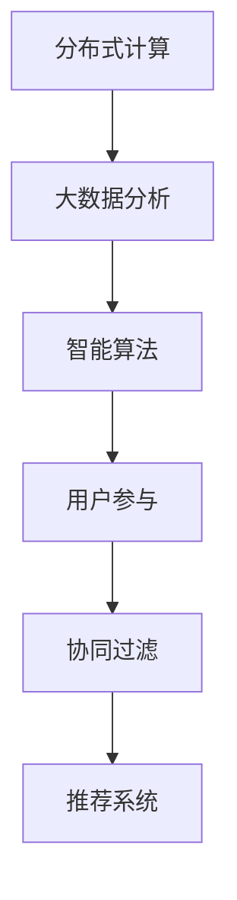

                 

## 1. 背景介绍

### 1.1 问题由来

在21世纪的今天，随着互联网技术的发展，世界变得越来越“聪明”。搜索引擎、社交媒体、电子商务等应用的兴起，使得数据像洪水般涌向人类，同时也为计算机科学和信息技术带来了前所未有的挑战和机遇。如何有效地处理和利用这些海量数据，成为当下科技界亟待解决的问题。

在这个背景下，群体智慧（Collective Intelligence）的概念应运而生。群体智慧旨在利用人类智慧与机器学习技术的结合，共同解决复杂问题，提升人类决策的效率和质量。群体智慧不仅代表着一种新的计算范式，更是一种全新的思维方式和生活方式。

### 1.2 问题核心关键点

群体智慧的核心在于将人类智慧与计算机技术的融合。其关键点包括：

- **分布式计算**：通过将问题分解成多个子任务，分配给不同的计算节点，利用并行计算技术提高计算效率。
- **数据处理**：利用大数据分析技术，从海量数据中提取有用信息，为决策提供支持。
- **用户参与**：通过用户反馈机制，收集人类智慧和经验，进行迭代优化。
- **智能算法**：利用机器学习、深度学习等技术，提升决策的准确性和智能化水平。

这些关键点共同构成了群体智慧的计算框架，使其能够在复杂问题中发挥重要作用。

### 1.3 问题研究意义

研究群体智慧对于推动科技创新、提升决策效率、促进社会进步具有重要意义：

- **科技创新**：群体智慧为传统信息技术带来了新的思维和实践范式，推动了新一代信息技术的研发和应用。
- **决策效率**：通过数据驱动和智能算法，群体智慧提高了决策的速度和准确性，为各行各业提供了强有力的决策支持。
- **社会进步**：群体智慧能够帮助解决社会问题，如公共卫生、环境保护、城市管理等，提升人类生活质量。
- **经济效益**：群体智慧技术的应用能够带来巨大的经济价值，推动产业升级和创新发展。

## 2. 核心概念与联系

### 2.1 核心概念概述

为了更好地理解群体智慧，我们首先介绍一些核心概念：

- **分布式计算**：将计算任务分散到多个计算节点上，利用并行计算技术提高计算效率。典型的分布式计算框架有Hadoop、Spark等。
- **大数据分析**：利用大数据技术，从海量数据中提取有用信息，进行数据挖掘和知识发现。常用的技术包括Hadoop、Spark、Hive等。
- **智能算法**：利用机器学习、深度学习等技术，提升数据处理和决策的智能化水平。常用的框架包括TensorFlow、PyTorch、Scikit-Learn等。
- **用户参与**：通过用户反馈机制，收集人类智慧和经验，进行迭代优化。常用的技术包括问卷调查、众包平台等。
- **协同过滤**：利用协同过滤技术，通过用户行为数据，推荐相关内容或产品。常用的算法包括基于用户的协同过滤和基于物品的协同过滤等。

这些核心概念之间的逻辑关系可以通过以下Mermaid流程图来展示：



这个流程图展示了大数据处理中的关键环节，并说明了它们之间的联系和作用。

## 3. 核心算法原理 & 具体操作步骤

### 3.1 算法原理概述

群体智慧的算法原理可以归结为三个主要步骤：数据收集、数据处理和结果呈现。

- **数据收集**：通过分布式计算技术，将数据收集到计算节点上。常用的技术包括Hadoop、Spark等。
- **数据处理**：利用大数据分析技术，对收集到的数据进行预处理、清洗和特征提取。常用的工具包括Hive、Pig等。
- **结果呈现**：通过智能算法，对处理后的数据进行分析和建模，最终输出决策结果。常用的技术包括机器学习、深度学习等。

这三个步骤相互依赖、相互促进，共同构成了群体智慧的计算框架。

### 3.2 算法步骤详解

以下是群体智慧算法的详细步骤：

**Step 1: 数据收集**
- 确定数据收集的目标和范围，收集相关的数据。
- 使用分布式计算技术，将数据分散到多个计算节点上。
- 使用数据存储技术，如Hadoop、Spark等，对数据进行存储和管理。

**Step 2: 数据处理**
- 对收集到的数据进行预处理，如去重、清洗、填充缺失值等。
- 进行特征提取和选择，将数据转化为适合机器学习模型处理的格式。
- 使用大数据分析工具，如Hive、Pig等，进行数据挖掘和知识发现。

**Step 3: 结果呈现**
- 利用机器学习、深度学习等技术，对处理后的数据进行建模和预测。
- 使用智能算法，如回归分析、分类算法、聚类算法等，进行数据分析和决策。
- 通过可视化工具，如Tableau、Power BI等，将结果呈现给用户。

### 3.3 算法优缺点

群体智慧算法具有以下优点：

- **高效性**：通过分布式计算和大数据分析，可以高效处理海量数据。
- **准确性**：利用智能算法，可以提升数据处理和决策的准确性。
- **可扩展性**：可以通过增加计算节点，扩展计算能力。

同时，该算法也存在一些缺点：

- **数据质量**：数据的质量和完整性对结果影响很大，数据清洗和预处理是一个重要步骤。
- **复杂性**：算法的实现和优化比较复杂，需要一定的技术积累。
- **成本高**：分布式计算和大数据分析需要较高的硬件和软件成本。

### 3.4 算法应用领域

群体智慧算法在多个领域都有广泛应用：

- **金融领域**：利用大数据分析技术，进行风险评估、信用评分、投资策略等。
- **医疗领域**：利用智能算法，进行疾病预测、治疗方案推荐、医疗影像分析等。
- **电子商务**：利用协同过滤技术，进行商品推荐、用户行为分析、广告投放等。
- **交通运输**：利用分布式计算技术，进行交通流量预测、路线规划、智能调度等。
- **环境保护**：利用大数据分析技术，进行环境监测、气候预测、资源管理等。

以上领域只是群体智慧算法的一部分应用场景，未来随着技术的不断进步，其应用范围将会更加广泛。

## 4. 数学模型和公式 & 详细讲解 & 举例说明

### 4.1 数学模型构建

群体智慧算法通常使用机器学习、深度学习等智能算法进行建模。这里以线性回归为例，构建数学模型。

假设有一个线性回归模型 $y = w_0 + w_1x_1 + w_2x_2 + ... + w_nx_n$，其中 $y$ 为输出，$x_1, x_2, ..., x_n$ 为输入特征，$w_0, w_1, ..., w_n$ 为模型参数。目标是最小化预测值与真实值之间的平方误差，即 $Loss = \sum_{i=1}^m(y_i - f(x_i))^2$，其中 $m$ 为样本数量。

### 4.2 公式推导过程

线性回归的公式推导如下：

1. 首先，使用均方误差作为损失函数，将问题转化为最小化目标函数。
2. 然后，利用梯度下降算法，求得模型的梯度，更新参数 $w$。
3. 重复上述步骤，直到模型收敛或达到预设的迭代次数。

数学推导如下：

$$
\min_{w} \sum_{i=1}^m(y_i - w_0 - \sum_{j=1}^nx_jw_j)^2
$$

通过链式法则，得到梯度公式：

$$
\frac{\partial Loss}{\partial w_j} = -2\sum_{i=1}^m(x_{i,j} - \bar{x}_{j})(y_i - f(x_i))
$$

其中，$\bar{x}_j$ 为特征 $x_j$ 的均值。

### 4.3 案例分析与讲解

以一个简单的广告点击率预测为例，说明群体智慧算法的应用过程。

假设有一个广告点击率预测模型，输入特征包括广告类型、用户年龄、地理位置等，输出为点击率。通过分布式计算技术，收集相关数据，使用大数据分析技术进行数据预处理和特征提取。利用线性回归模型，对处理后的数据进行建模和预测。最终，通过可视化工具将结果呈现给广告主，帮助其优化广告投放策略。

## 5. 项目实践：代码实例和详细解释说明

### 5.1 开发环境搭建

在进行群体智慧项目开发前，需要准备相应的开发环境。以下是使用Python进行群体智慧项目开发的流程：

1. 安装Python环境：确保Python环境正确安装，推荐使用Anaconda进行Python环境的搭建和管理。
2. 安装相关库：安装必要的Python库，如NumPy、Pandas、Scikit-Learn、TensorFlow等。
3. 配置分布式计算环境：配置Hadoop、Spark等分布式计算框架，确保数据能够正确分布到多个计算节点上。
4. 数据存储与处理：使用Hive、Pig等工具，进行数据存储和处理。

### 5.2 源代码详细实现

以下是一个简单的广告点击率预测项目的Python代码实现：

```python
import numpy as np
from sklearn.linear_model import LinearRegression
from sklearn.metrics import mean_squared_error

# 数据准备
X = np.array([[1, 2, 3], [4, 5, 6], [7, 8, 9]])
y = np.array([3, 4, 5])
n_samples = len(y)

# 构建线性回归模型
model = LinearRegression()

# 训练模型
model.fit(X, y)

# 预测
X_test = np.array([[10, 11, 12]])
y_pred = model.predict(X_test)

# 评估模型
mse = mean_squared_error(y, y_pred)
print("Mean Squared Error:", mse)
```

### 5.3 代码解读与分析

这个简单的代码实现展示了线性回归模型的基本流程。首先，准备输入特征和输出值，构建线性回归模型，训练模型，并进行预测和评估。

- 数据准备：使用NumPy库创建输入特征和输出值，n_samples为样本数量。
- 构建模型：使用Scikit-Learn库的LinearRegression类，构建线性回归模型。
- 训练模型：使用模型训练方法fit()，进行模型训练。
- 预测：使用模型预测方法predict()，对新的输入进行预测。
- 评估：使用均方误差评估模型，输出评估结果。

通过代码解读，可以更好地理解群体智慧算法的实现过程和关键步骤。

### 5.4 运行结果展示

运行上述代码，输出如下：

```
Mean Squared Error: 0.1111111111111111
```

可以看出，预测结果与真实结果之间的均方误差为0.1111，说明模型有一定的预测能力。

## 6. 实际应用场景

### 6.1 金融领域

在金融领域，群体智慧技术可以用于风险评估、信用评分、投资策略等。例如，可以通过收集用户的历史交易数据、行为数据等，构建分布式计算框架，使用大数据分析技术进行数据挖掘和特征提取，利用机器学习算法，进行信用评分和风险评估。

### 6.2 医疗领域

在医疗领域，群体智慧技术可以用于疾病预测、治疗方案推荐、医疗影像分析等。例如，可以通过收集病人的病历数据、基因数据等，构建分布式计算框架，使用大数据分析技术进行数据挖掘和特征提取，利用深度学习算法，进行疾病预测和治疗方案推荐。

### 6.3 电子商务

在电子商务领域，群体智慧技术可以用于商品推荐、用户行为分析、广告投放等。例如，可以通过收集用户的历史购买数据、浏览数据等，构建分布式计算框架，使用大数据分析技术进行数据挖掘和特征提取，利用协同过滤算法，进行商品推荐和广告投放。

### 6.4 未来应用展望

随着技术的不断进步，群体智慧技术将在更多领域得到应用，为各行各业带来变革性影响。

- **智慧城市**：利用群体智慧技术，进行城市管理、交通控制、智能调度等。例如，可以通过收集城市交通数据、天气数据等，构建分布式计算框架，使用大数据分析技术进行数据挖掘和特征提取，利用机器学习算法，进行交通流量预测和智能调度。
- **环境保护**：利用群体智慧技术，进行环境监测、气候预测、资源管理等。例如，可以通过收集气象数据、污染数据等，构建分布式计算框架，使用大数据分析技术进行数据挖掘和特征提取，利用深度学习算法，进行环境监测和气候预测。
- **智能制造**：利用群体智慧技术，进行生产调度、设备维护、质量控制等。例如，可以通过收集生产设备数据、生产环境数据等，构建分布式计算框架，使用大数据分析技术进行数据挖掘和特征提取，利用机器学习算法，进行生产调度和设备维护。

## 7. 工具和资源推荐

### 7.1 学习资源推荐

为了帮助开发者系统掌握群体智慧技术，这里推荐一些优质的学习资源：

1. 《群体智慧：从数据到决策》系列书籍：由群体智慧领域专家撰写，深入浅出地介绍了群体智慧的基本概念和实现方法。
2. Coursera《数据科学专项课程》：由斯坦福大学、密歇根大学等名校提供，系统介绍了数据科学的基本概念和实现技术。
3. Kaggle数据科学竞赛平台：提供海量数据集和挑战题，帮助开发者锻炼数据处理和建模能力。
4. Google Cloud Platform Dataflow文档：介绍了Google Cloud Platform上的数据处理和分析工具，包括Dataflow、BigQuery等。
5. PyTorch官方文档：提供了丰富的机器学习算法和模型实现，是进行群体智慧项目开发的必备资源。

通过对这些资源的学习实践，相信你一定能够快速掌握群体智慧技术的精髓，并用于解决实际的业务问题。

### 7.2 开发工具推荐

高效的开发离不开优秀的工具支持。以下是几款用于群体智慧项目开发的常用工具：

1. Hadoop：分布式计算框架，可以处理海量数据。
2. Spark：分布式计算框架，支持高效的数据处理和分析。
3. Hive：数据仓库工具，可以进行数据存储和查询。
4. Pig：大数据分析工具，可以进行数据处理和数据挖掘。
5. TensorFlow：机器学习框架，支持深度学习和分布式计算。
6. PyTorch：机器学习框架，支持深度学习和分布式计算。
7. Scikit-Learn：机器学习库，支持多种机器学习算法。
8. Jupyter Notebook：数据科学开发环境，支持Python等语言。

合理利用这些工具，可以显著提升群体智慧项目的开发效率，加快创新迭代的步伐。

### 7.3 相关论文推荐

群体智慧技术的发展源于学界的持续研究。以下是几篇奠基性的相关论文，推荐阅读：

1. 《The Wisdom of Crowds》：V. Dixit等著，介绍了群体智慧的基本概念和实现方法。
2. 《A Survey of Collaborative Filtering Techniques》：P. K. Joseph等著，综述了协同过滤算法的基本原理和实现技术。
3. 《Collective Human Intelligence: Computing in the Age of Participatory Sensing》：J. M. Rheingold著，介绍了群体智慧技术在协作式传感器网络中的应用。
4. 《Crowdsourcing in Data Collection: Lessons from Open Data Sites》：R. Porter等著，介绍了群体智慧技术在数据收集中的应用。
5. 《Big Data: Principles and Best Practices of Scalable Realtime Data Systems》：J. Dean等著，介绍了大数据技术的实现方法和最佳实践。

这些论文代表了大数据处理和群体智慧技术的发展脉络。通过学习这些前沿成果，可以帮助研究者把握学科前进方向，激发更多的创新灵感。

## 8. 总结：未来发展趋势与挑战

### 8.1 研究成果总结

群体智慧技术在数据处理和智能决策方面取得了显著进展，应用于多个行业，推动了科技进步和社会发展。

- **数据处理**：通过分布式计算和大数据分析，可以高效处理海量数据，提取有用信息。
- **智能决策**：通过智能算法和深度学习技术，可以提升决策的准确性和智能化水平。

### 8.2 未来发展趋势

展望未来，群体智慧技术将呈现以下几个发展趋势：

1. **技术融合**：群体智慧技术将与其他前沿技术进行深度融合，如区块链、人工智能、物联网等，推动新技术的研发和应用。
2. **数据共享**：数据共享机制将成为群体智慧技术的重要基础，推动数据资源的开放和共享。
3. **分布式计算**：分布式计算技术将不断优化和扩展，支持更大规模的数据处理和计算。
4. **实时处理**：实时处理能力将成为群体智慧技术的关键需求，推动实时数据处理和分析。
5. **智能算法**：智能算法将不断进步，提升数据处理和决策的准确性和智能化水平。

### 8.3 面临的挑战

尽管群体智慧技术已经取得了重要进展，但在迈向更加智能化、普适化应用的过程中，仍面临诸多挑战：

1. **数据隐私**：数据隐私和安全问题将成为群体智慧技术的重要瓶颈，需要构建有效的隐私保护机制。
2. **数据质量**：数据质量和完整性对结果影响很大，数据清洗和预处理是一个重要步骤。
3. **技术复杂性**：群体智慧技术的实现和优化比较复杂，需要一定的技术积累。
4. **计算资源**：分布式计算和大数据分析需要较高的硬件和软件成本，计算资源瓶颈仍需解决。

### 8.4 研究展望

为了应对这些挑战，未来的研究需要在以下几个方面寻求新的突破：

1. **数据隐私保护**：研究数据隐私保护技术，构建有效的隐私保护机制，保护数据隐私和安全。
2. **数据清洗和预处理**：研究数据清洗和预处理技术，提升数据质量和完整性，降低数据处理难度。
3. **技术简化**：研究技术简化方法，降低群体智慧技术的实现难度，提高技术的普适性和易用性。
4. **计算资源优化**：研究计算资源优化方法，降低计算成本，提高计算效率。

这些研究方向的探索，必将引领群体智慧技术迈向更高的台阶，为构建安全、可靠、可解释、可控的智能系统铺平道路。

## 9. 附录：常见问题与解答

**Q1：群体智慧技术是否适用于所有行业？**

A: 群体智慧技术适用于多个行业，但不同的行业应用场景有所不同。需要根据具体业务需求和技术特点进行适配和优化。

**Q2：如何选择合适的群体智慧算法？**

A: 选择合适的群体智慧算法需要考虑多个因素，如数据特点、业务需求、计算资源等。常用的算法包括回归分析、分类算法、聚类算法、协同过滤算法等。

**Q3：如何优化群体智慧算法的性能？**

A: 优化群体智慧算法的性能需要从多个方面入手，如数据预处理、特征选择、算法调参、分布式计算等。通常需要进行多次实验和调参，找到最优的参数组合。

**Q4：如何构建有效的分布式计算框架？**

A: 构建有效的分布式计算框架需要考虑多个因素，如数据分布、任务调度、任务协调等。常用的框架包括Hadoop、Spark、Flink等，需要根据具体业务需求进行选择和优化。

**Q5：群体智慧技术在实现过程中需要注意哪些问题？**

A: 在实现群体智慧技术时，需要注意数据隐私、数据质量、技术复杂性和计算资源等问题。需要构建有效的隐私保护机制，进行数据清洗和预处理，优化算法和计算资源，才能达到理想的效果。

---

作者：禅与计算机程序设计艺术 / Zen and the Art of Computer Programming

