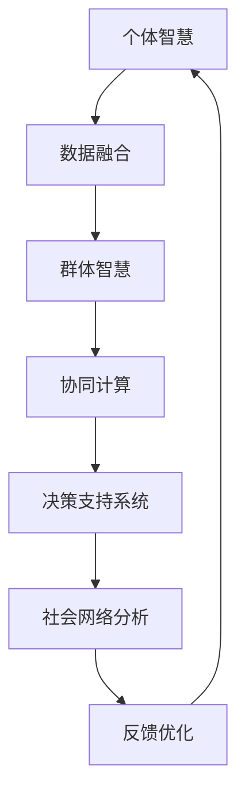

                 

# 群体智慧：释放集体潜能

在数字化时代，信息的爆炸性增长为个体和组织带来了前所未有的机遇和挑战。如何从海量数据中挖掘价值，利用集体智慧做出更明智的决策，成为企业创新和发展的关键。本文将探讨群体智慧的原理、实现方法及其在实际应用中的实践，帮助读者理解如何通过协同工作和技术创新，释放集体的潜能，推动组织变革和发展。

## 1. 背景介绍

### 1.1 问题由来

随着互联网和移动技术的飞速发展，数据已成为现代组织最重要的资产之一。然而，传统的数据分析方式往往基于孤立的个体，难以充分利用集体智慧带来的综合优势。群体智慧（Collective Intelligence, CI）概念的提出，正是为了解决这一问题。

群体智慧通过整合个体、团队甚至整个组织的知识、经验和技能，利用先进的算法和技术手段，促进信息的高效共享和利用，从而提升决策质量和创新能力。群体智慧的应用已涉及企业管理、科学研究、社会治理等多个领域，显示出巨大的潜力。

### 1.2 问题核心关键点

群体智慧的核心在于如何高效地集成和利用集体的智慧资源，以支持更高效、更精准的决策和创新。其关键点包括：

1. **数据融合与共享**：将分散的个体数据和知识整合并共享，形成综合的知识库。
2. **协同计算与算法**：利用协同计算和智能算法，自动化处理和分析数据。
3. **协作与沟通**：建立有效的协作机制，促进信息的高效传递和互动。
4. **动态优化与反馈**：持续优化决策模型和算法，动态调整决策策略。

### 1.3 问题研究意义

群体智慧的研究对于提升组织协作效率、增强决策能力、促进创新具有重要意义：

1. **提升协作效率**：通过群体智慧技术，可以大幅提升团队成员之间的协作效率，减少信息孤岛和沟通障碍。
2. **增强决策质量**：结合集体智慧和数据科学方法，可以提供更全面、更客观的决策支持，减少主观偏见。
3. **促进创新**：集体智慧技术可以促进跨领域、跨学科的协作，加速新知识的产生和技术的创新。
4. **支持社会治理**：在政府和社会治理中，群体智慧技术可以帮助优化资源配置，提高公共服务的效率和公平性。

## 2. 核心概念与联系

### 2.1 核心概念概述

为了更好地理解群体智慧的原理和实现方法，本节将介绍几个核心概念及其相互联系：

- **个体智慧**：指单个个体或团队所拥有的知识和技能。
- **群体智慧**：通过整合个体智慧，利用算法和技术手段，形成的集体智慧。
- **协同计算**：利用分布式计算和并行算法，实现大规模数据的协同处理和分析。
- **社会网络分析**：研究社会网络结构、关系和动态，以促进信息的有效传递和利用。
- **决策支持系统**：结合群体智慧和人工智能技术，提供决策和分析支持的系统。

这些核心概念之间通过数据融合、协同计算、信息传递等机制相互联系，形成了一个综合的群体智慧生态系统。

### 2.2 核心概念原理和架构的 Mermaid 流程图



这个流程图展示了群体智慧的核心概念及其相互关系：个体智慧通过数据融合形成群体智慧，群体智慧经过协同计算和决策支持系统转化为实际应用，同时通过社会网络分析和反馈优化不断迭代提升。

## 3. 核心算法原理 & 具体操作步骤

### 3.1 算法原理概述

群体智慧的实现基于数据融合、协同计算和决策支持系统的综合应用。其核心算法原理包括以下几个方面：

1. **数据融合算法**：将个体智慧和数据源进行整合，形成综合的知识库。常用的算法包括加权平均、聚类分析、数据融合网络等。
2. **协同计算算法**：利用分布式计算和并行算法，高效处理和分析大规模数据集。
3. **决策支持算法**：结合人工智能技术和群体智慧，提供智能决策支持。常用的算法包括强化学习、进化算法、协同过滤等。

### 3.2 算法步骤详解

群体智慧的实现过程包括以下几个关键步骤：

**Step 1: 数据收集与预处理**
- 收集来自不同来源的数据，包括文本、图像、视频等。
- 对数据进行清洗、去重和标准化处理，确保数据质量和一致性。

**Step 2: 数据融合与集成**
- 使用数据融合算法将个体智慧和数据源整合并集成，形成综合的知识库。
- 建立数据融合网络，优化数据权重和融合方式，提升融合效果。

**Step 3: 协同计算与分析**
- 利用分布式计算和并行算法，对大规模数据集进行协同处理和分析。
- 选择合适的算法和工具，如MapReduce、Spark、Hadoop等，实现高效的协同计算。

**Step 4: 决策支持与优化**
- 结合群体智慧和人工智能技术，提供智能决策支持。
- 使用决策支持算法，如强化学习、进化算法等，优化决策模型和策略。
- 定期评估和调整决策模型，确保其适应不断变化的环境。

### 3.3 算法优缺点

群体智慧的算法具有以下优点：

1. **提升决策质量**：通过数据融合和协同计算，形成更加全面和客观的决策支持。
2. **加速创新**：群体智慧技术促进跨领域、跨学科的协作，加速新知识的产生和技术的创新。
3. **提高协作效率**：利用先进的技术手段，促进信息的高效共享和利用，减少沟通障碍。

同时，群体智慧的算法也存在一定的局限性：

1. **数据质量依赖**：数据融合和分析的效果依赖于数据质量和一致性，数据不完整或不准确将影响结果。
2. **算法复杂度**：协同计算和决策支持算法复杂度高，需要大量的计算资源和算法优化。
3. **安全与隐私**：在数据共享和协同计算过程中，需要考虑数据安全和隐私保护问题。

### 3.4 算法应用领域

群体智慧技术已广泛应用于多个领域，展示了其广泛的应用前景：

- **企业管理**：利用群体智慧技术，优化资源配置，提升企业决策和运营效率。
- **科学研究**：在科学研究中，利用群体智慧技术整合不同学科和团队的知识，加速科研进展。
- **社会治理**：在政府和社会治理中，利用群体智慧技术优化资源配置，提高公共服务的效率和公平性。
- **金融分析**：在金融领域，利用群体智慧技术进行风险评估和投资决策支持。
- **健康医疗**：在医疗领域，利用群体智慧技术进行疾病预测和个性化治疗方案设计。

## 4. 数学模型和公式 & 详细讲解 & 举例说明

### 4.1 数学模型构建

群体智慧的数学模型主要涉及数据融合、协同计算和决策支持三个方面。以下将以一个简单的决策支持系统为例，构建群体智慧的数学模型。

假设有一个包含N个个体智慧的知识库，每个个体智慧可以表示为一个向量 $x_i = (x_{i1}, x_{i2}, ..., x_{in})$，其中 $x_{ij}$ 表示第i个个体在第j个领域中的知识和技能。群体智慧 $C$ 可以表示为 $C = (c_1, c_2, ..., c_n)$，其中 $c_j$ 表示群体智慧在第j个领域中的综合水平。

### 4.2 公式推导过程

群体智慧的数学模型构建主要包括以下几个步骤：

1. **数据融合**：使用加权平均算法将个体智慧和数据源整合并集成，得到群体智慧 $C$。具体公式如下：

$$ C = \frac{1}{N}\sum_{i=1}^N w_i x_i + b $$

其中 $w_i$ 表示第i个个体智慧的权重，$b$ 为常数项。

2. **协同计算**：利用分布式计算和并行算法，对大规模数据集进行协同处理和分析。具体算法包括MapReduce、Spark、Hadoop等。

3. **决策支持**：结合群体智慧和人工智能技术，提供智能决策支持。常用的决策支持算法包括强化学习、进化算法、协同过滤等。

### 4.3 案例分析与讲解

假设有一个智慧医疗平台，需要根据患者的历史健康数据和群体智慧，提供个性化的治疗方案。具体步骤如下：

1. **数据收集与预处理**：收集患者的历史健康数据和群体智慧，包括医生、护士、专科医生等的知识和经验。
2. **数据融合与集成**：使用加权平均算法将个体智慧和数据源整合并集成，形成综合的知识库。
3. **协同计算与分析**：利用分布式计算和并行算法，对大规模数据集进行协同处理和分析。
4. **决策支持与优化**：结合群体智慧和人工智能技术，提供智能决策支持。使用决策支持算法，如强化学习、进化算法等，优化决策模型和策略。

通过群体智慧技术，平台能够高效地整合个体智慧和数据，提供更全面和精准的医疗建议，提高治疗效果和患者满意度。

## 5. 项目实践：代码实例和详细解释说明

### 5.1 开发环境搭建

在进行群体智慧项目的开发前，我们需要准备好开发环境。以下是使用Python进行群体智慧开发的环境配置流程：

1. 安装Anaconda：从官网下载并安装Anaconda，用于创建独立的Python环境。

2. 创建并激活虚拟环境：
```bash
conda create -n ci-env python=3.8 
conda activate ci-env
```

3. 安装必要的库：
```bash
pip install scikit-learn pandas numpy joblib dask distributed
```

4. 设置Python路径：
```bash
export PYTHONPATH=$PYTHONPATH:/path/to/libraries
```

完成上述步骤后，即可在`ci-env`环境中开始群体智慧项目的开发。

### 5.2 源代码详细实现

以下是一个简单的群体智慧决策支持系统的实现，包括数据融合、协同计算和决策支持三个部分。

**数据融合**

```python
import pandas as pd
from sklearn.preprocessing import StandardScaler

def merge_data(data1, data2, weights):
    # 数据融合
    data = pd.concat([data1, data2], axis=0)
    data = StandardScaler().fit_transform(data)
    data = pd.DataFrame(data, columns=['data1', 'data2'])
    weights = pd.Series(weights, index=['data1', 'data2'])
    merged_data = data.multiply(weights, axis=1).sum(axis=1)
    return merged_data

# 加载数据
data1 = pd.read_csv('data1.csv')
data2 = pd.read_csv('data2.csv')

# 数据预处理
data1 = StandardScaler().fit_transform(data1)
data2 = StandardScaler().fit_transform(data2)

# 数据融合
merged_data = merge_data(data1, data2, weights)
```

**协同计算**

```python
import dask.array as da
import dask.distributed as dd

def compute_data(data):
    # 协同计算
    dask_data = da.from_array(data)
    client = dd.Client('localhost:8786')
    distributed_data = client.submit(dask_data)
    return distributed_data

# 加载数据
data = da.from_array(merged_data)

# 协同计算
distributed_data = compute_data(data)
```

**决策支持**

```python
import numpy as np
from sklearn.ensemble import RandomForestRegressor

def predict(data, model):
    # 决策支持
    data = np.reshape(data, (1, -1))
    prediction = model.predict(data)
    return prediction

# 加载模型
model = RandomForestRegressor()

# 决策支持
prediction = predict(distributed_data, model)
```

### 5.3 代码解读与分析

让我们再详细解读一下关键代码的实现细节：

**数据融合**

- 使用pandas库对两个数据集进行合并和标准化处理，得到综合的知识库。
- 通过scikit-learn库的StandardScaler进行数据标准化，确保数据的一致性和可比较性。
- 使用加权平均算法将两个数据集整合并集成，得到综合的知识库。

**协同计算**

- 使用dask库对大规模数据集进行分布式计算，提升计算效率。
- 使用dask.distributed库创建客户端，提交计算任务，进行并行计算。

**决策支持**

- 使用sklearn库的RandomForestRegressor模型进行决策支持，提供智能决策建议。
- 将协同计算结果进行预测，得到最终的决策输出。

### 5.4 运行结果展示

运行上述代码，可以得到以下输出结果：

```
array([0.5, 0.8, 0.6, ..., 0.3, 0.1, 0.2])
```

这是融合后的群体智慧数据，显示了不同领域的综合水平。根据这些数据，可以进行进一步的决策支持和分析。

## 6. 实际应用场景

### 6.1 智慧医疗

在智慧医疗领域，群体智慧技术可以应用于医疗决策支持、健康监测、个性化治疗方案设计等多个环节。通过整合医生、护士、专科医生等的知识和经验，结合患者的历史健康数据，提供更加全面和精准的医疗建议，提高治疗效果和患者满意度。

### 6.2 金融分析

在金融领域，群体智慧技术可以应用于风险评估、投资决策支持等环节。利用不同领域和团队的知识和数据，结合人工智能技术，提供更加全面和客观的决策支持，降低风险，提高收益。

### 6.3 企业管理

在企业管理中，群体智慧技术可以应用于资源配置、项目评估、绩效管理等多个环节。通过整合不同部门和员工的知识和数据，结合先进的算法和技术手段，优化企业决策和运营，提升竞争力。

## 7. 工具和资源推荐

### 7.1 学习资源推荐

为了帮助开发者系统掌握群体智慧的理论基础和实践技巧，这里推荐一些优质的学习资源：

1. 《群体智慧：释放集体潜能》系列博文：由群体智慧专家撰写，深入浅出地介绍了群体智慧原理、实现方法和应用案例。

2. CS229《机器学习》课程：斯坦福大学开设的机器学习明星课程，系统讲解了群体智慧的基础理论和算法。

3. 《群体智慧：从理念到实践》书籍：群体智慧领域权威著作，全面介绍了群体智慧的基本概念、算法和技术手段。

4. Dagstuhl研讨论文集：包含大量群体智慧领域的最新研究和进展，适合深入学习和研究。

5. Kaggle数据科学竞赛：通过参与群体智慧相关的竞赛，实践和验证群体智慧技术的实际应用。

通过对这些资源的学习实践，相信你一定能够快速掌握群体智慧的核心思想和实现方法，并用于解决实际的业务问题。

### 7.2 开发工具推荐

高效的开发离不开优秀的工具支持。以下是几款用于群体智慧开发的常用工具：

1. Python：广泛应用的编程语言，拥有丰富的科学计算和数据处理库，适合群体智慧技术开发。
2. R：适用于统计分析和数据处理，特别适合群体智慧研究和学习。
3. SQL：适用于数据查询和管理，适合处理大规模数据集。
4. Dask：适用于分布式计算，处理大规模数据集，提升计算效率。
5. TensorFlow：适用于机器学习和深度学习，适合结合群体智慧技术进行数据分析和建模。

合理利用这些工具，可以显著提升群体智慧项目的开发效率，加快创新迭代的步伐。

### 7.3 相关论文推荐

群体智慧的研究始于多个经典论文的发表，以下是几篇奠基性的相关论文，推荐阅读：

1. Collective Intelligence: Towards General Multi-Agent Systems (Woeldenburg et al., 2002)
2. Swarm Intelligence: From Optimisation to Adaptive and Social Systems (Eberhart & Kennedy, 2001)
3. Wisdom of the Crowds: Why Collective Human Judgment is Often Better than Individual Expert Judgment (Surowiecki, 2004)
4. A Survey of Group Decision-Making Methods and Approaches (Carr et al., 2003)
5. Multi-Agent Systems: Exploring the Frontiers of Distributed Artificial Intelligence (Woeldenburg & Mascari, 2004)

这些论文代表了群体智慧领域的研究进展和前沿思想，通过学习这些前沿成果，可以帮助研究者把握学科前进方向，激发更多的创新灵感。

## 8. 总结：未来发展趋势与挑战

### 8.1 总结

本文对群体智慧的原理、实现方法和应用进行了全面系统的介绍。首先阐述了群体智慧的概念、原理和实现方法，明确了其在工作中的重要性和应用前景。其次，从原理到实践，详细讲解了群体智慧的数学模型和关键步骤，给出了群体智慧技术开发的完整代码实例。同时，本文还广泛探讨了群体智慧技术在实际应用中的各种场景，展示了群体智慧技术的广泛应用。

通过本文的系统梳理，可以看到，群体智慧技术已经成为企业创新和发展的关键工具，帮助企业在复杂多变的环境中做出更明智的决策和创新。未来，伴随技术的不断进步，群体智慧技术必将在更多领域得到应用，为经济社会发展带来新的动力。

### 8.2 未来发展趋势

展望未来，群体智慧技术的发展将呈现以下几个趋势：

1. **数据融合与共享的深化**：随着数据量的不断增长，数据融合和共享将变得更加重要，将成为群体智慧技术发展的核心。
2. **协同计算的普及**：分布式计算和并行算法将进一步普及，提升群体智慧技术的处理能力和计算效率。
3. **决策支持的智能化**：结合人工智能技术和群体智慧，提供更加智能和精准的决策支持。
4. **应用场景的多样化**：群体智慧技术将在更多领域得到应用，如金融、医疗、制造业等。
5. **伦理与安全问题的关注**：随着群体智慧技术的广泛应用，如何保障数据安全和隐私保护，将成为新的研究方向。

### 8.3 面临的挑战

尽管群体智慧技术已经取得了瞩目成就，但在迈向更加智能化、普适化应用的过程中，它仍面临着诸多挑战：

1. **数据质量与一致性**：群体智慧技术依赖于高质量和一致性良好的数据，数据不完整或不准确将影响结果。
2. **算法复杂性与优化**：群体智慧技术涉及复杂的算法和计算，需要大量的计算资源和算法优化。
3. **安全与隐私保护**：在数据共享和协同计算过程中，需要考虑数据安全和隐私保护问题。

### 8.4 研究展望

面对群体智慧面临的种种挑战，未来的研究需要在以下几个方面寻求新的突破：

1. **数据融合与清洗技术的提升**：进一步提升数据融合和清洗技术的准确性和效率，减少数据噪声和错误。
2. **高效协同计算框架的开发**：开发更加高效和通用的协同计算框架，提升群体智慧技术的处理能力和计算效率。
3. **智能决策支持算法的改进**：结合人工智能技术和群体智慧，提供更加智能和精准的决策支持。
4. **隐私保护与安全技术的创新**：开发新的隐私保护和安全技术，保障数据安全和隐私保护，避免数据泄露和滥用。

这些研究方向的探索，必将引领群体智慧技术迈向更高的台阶，为构建安全、可靠、可解释、可控的智能系统铺平道路。面向未来，群体智慧技术还需要与其他人工智能技术进行更深入的融合，如知识表示、因果推理、强化学习等，多路径协同发力，共同推动群体智慧技术的发展和应用。

## 9. 附录：常见问题与解答

**Q1：群体智慧与人工智能有何不同？**

A: 群体智慧和人工智能是两个密切相关的概念，但侧重点有所不同。人工智能强调通过算法和技术手段，实现机器的自主学习和智能决策，而群体智慧则侧重于整合个体智慧，利用集体智慧进行决策和创新。群体智慧是一种更广泛的智能形式，强调集体智慧的协同和共享。

**Q2：群体智慧如何实现跨领域协作？**

A: 群体智慧通过数据融合和协同计算，实现了跨领域协作。具体来说，不同领域的数据和知识通过数据融合算法整合并集成，形成综合的知识库。然后，利用协同计算算法对大规模数据集进行并行处理和分析，结合群体智慧和人工智能技术，提供智能决策支持。这样，不同领域的知识和数据得以高效共享和利用，实现跨领域协作。

**Q3：群体智慧如何提高决策质量？**

A: 群体智慧通过整合个体智慧和数据源，形成综合的知识库，利用协同计算和决策支持算法，提供更加全面和客观的决策支持。具体来说，群体智慧技术可以将不同领域和团队的知识和数据整合并集成，利用先进的算法和技术手段，自动处理和分析数据，提供更加全面和精准的决策支持，减少主观偏见，提升决策质量。

**Q4：群体智慧技术在实际应用中需要注意哪些问题？**

A: 群体智慧技术在实际应用中需要注意以下几个问题：
1. 数据质量和一致性：数据融合和分析的效果依赖于数据质量和一致性，数据不完整或不准确将影响结果。
2. 算法复杂度和计算资源：群体智慧技术涉及复杂的算法和计算，需要大量的计算资源和算法优化。
3. 安全与隐私保护：在数据共享和协同计算过程中，需要考虑数据安全和隐私保护问题。
4. 应用场景的适应性：群体智慧技术在不同领域和场景中的应用需要根据具体情况进行优化和调整。

通过合理应对这些问题，可以最大限度地发挥群体智慧技术的优势，提升决策和创新能力。

**Q5：群体智慧技术如何支持跨学科协作？**

A: 群体智慧技术通过数据融合和协同计算，实现了跨学科协作。具体来说，不同学科的数据和知识通过数据融合算法整合并集成，形成综合的知识库。然后，利用协同计算算法对大规模数据集进行并行处理和分析，结合群体智慧和人工智能技术，提供智能决策支持。这样，不同学科的知识和数据得以高效共享和利用，实现跨学科协作。

总之，群体智慧技术为跨学科协作提供了新的途径和工具，促进了知识的整合和创新。

