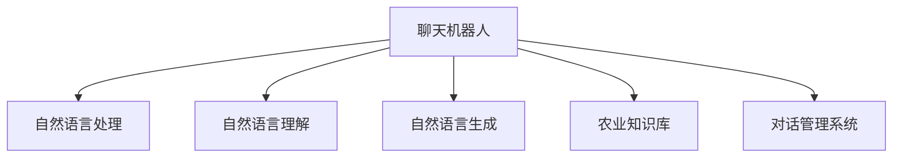

                 

# 聊天机器人农业革命：智能耕作和作物管理

## 1. 背景介绍

### 1.1 问题由来
在现代化农业生产中，作物管理、病虫害防治、智能耕作等环节需要大量的人力和专业知识，耗费时间和资源。通过智能化的农业技术，如聊天机器人，可以显著提高农业生产效率，降低成本，实现精准农业。

### 1.2 问题核心关键点
本项目聚焦于基于自然语言处理(NLP)技术构建的聊天机器人，利用其强大的自然语言理解与生成能力，为农业生产中的智能耕作、作物管理、病虫害防治等环节提供自动化支持。通过建立模型-现实世界间的双向对话，系统能够回答农业专家和农民的各类问题，从而实现农业生产的智能化和自动化。

### 1.3 问题研究意义
聊天机器人在农业中的应用，对于推动农业智能化和信息化，提高生产效率和产品质量，具有重要意义：

1. 降低生产成本。通过自动解答常见农业问题，减少人力成本和专家咨询费用。
2. 提升农业知识普及。普及现代农业科技知识，提升农民的科技素养。
3. 精准农业实现。通过智能对话，实时获取作物生长状态和环境信息，实现精准管理。
4. 提升农产品质量。及时获取病虫害防治信息，减少农药使用，提高农产品质量。
5. 促进农机自动化。通过对话机器人，引导农民操作农机，提升农机使用效率。

## 2. 核心概念与联系

### 2.1 核心概念概述

为更好地理解聊天机器人在农业中的作用，本节将介绍几个核心概念：

- 聊天机器人(Chatbot)：基于自然语言处理(NLP)技术构建的自动化对话系统，可以理解并回答用户的自然语言输入。
- 自然语言处理(NLP)：通过计算机科学和人工智能技术实现对自然语言(如语音、文本等)的理解和生成，实现人机自然交互。
- 自然语言理解(NLU)：从文本或语音中理解用户意图，抽取关键信息，生成回答。
- 自然语言生成(NLG)：根据用户输入，生成符合语法规则的自然语言回答。
- 农业知识库(Knowledge Base)：包含农业领域的各类知识，包括作物生长周期、病虫害防治、农业机械使用等。
- 对话管理系统(Dialogue Management)：负责维护对话流程，理解上下文，确保对话的有效性和连贯性。

这些核心概念之间的逻辑关系可以通过以下Mermaid流程图来展示：



这个流程图展示了聊天机器人各组件之间的协作关系：

1. 用户输入自然语言。
2. 自然语言处理模块对输入文本进行分词、词性标注等预处理。
3. 自然语言理解模块对文本进行分析，提取用户意图和关键信息。
4. 对话管理系统根据用户意图，调用农业知识库提供答案。
5. 自然语言生成模块将答案转化为自然语言形式，返回给用户。

这些模块协同工作，确保聊天机器人能够高效、准确地回答农业相关问题。

## 3. 核心算法原理 & 具体操作步骤
### 3.1 算法原理概述

聊天机器人的核心算法原理基于自然语言处理(NLP)技术，具体包括自然语言理解(NLU)和自然语言生成(NLG)。

- **自然语言理解(NLU)**：通过深度学习模型解析输入的自然语言文本，提取出用户的意图、实体等信息。常用的NLU模型包括BERT、GPT等预训练语言模型，以及基于这些模型的微调模型。
- **自然语言生成(NLG)**：通过深度学习模型将结构化数据转化为自然语言回答，常用的NLG模型包括Seq2Seq模型、Transformer模型等。

整个聊天机器人的工作流程可以总结如下：

1. **用户输入**：用户通过文本或语音输入问题。
2. **预处理**：自然语言处理模块对输入文本进行分词、标注等预处理。
3. **意图识别**：自然语言理解模块通过深度学习模型识别用户意图。
4. **知识抽取**：抽取用户意图相关的农业知识库数据。
5. **生成回答**：自然语言生成模块将知识库数据转化为自然语言回答。
6. **回答输出**：将回答返回给用户，完成对话。

### 3.2 算法步骤详解

本节将详细介绍聊天机器人的具体实现步骤：

**Step 1: 准备数据集和农业知识库**
- 收集农业领域的问答数据，作为微调训练的监督数据集。
- 构建农业知识库，包含作物生长周期、病虫害防治、农业机械使用等各类农业信息。

**Step 2: 选择预训练模型**
- 选择合适的NLP预训练模型，如BERT、GPT等，用于NLU和NLG。
- 使用预训练模型对农业领域进行微调，获取领域特定的语言模型。

**Step 3: 设计对话管理模块**
- 根据农业领域的特定需求，设计对话管理模块，负责管理对话流程，处理上下文信息。
- 设计响应策略，如自动回答、手动转接等。

**Step 4: 搭建系统架构**
- 将NLU、NLG和农业知识库组件整合，搭建完整的聊天机器人系统。
- 确保系统稳定性和响应速度，满足农业生产需求。

**Step 5: 进行系统测试**
- 对搭建好的聊天机器人进行测试，检查对话逻辑是否正确。
- 对用户进行问卷调查，收集用户反馈，优化系统性能。

**Step 6: 部署与运维**
- 将聊天机器人部署到生产环境，实时接收农业问题，并及时给出回答。
- 定期更新农业知识库，保持系统知识的时效性。
- 对系统进行监控和维护，确保系统稳定运行。

### 3.3 算法优缺点

聊天机器人农业应用的优点包括：

1. **高效率**：通过自动化问答，大大提高农业问题解答的效率。
2. **低成本**：减少人力成本和专家咨询费用，降低农业生产的总体投入。
3. **全天候服务**：实现7x24小时不间断服务，随时回答农业问题。
4. **实时互动**：实时获取作物生长状态和环境信息，实现精准管理。
5. **个性化服务**：根据用户的农业需求，提供个性化的解决方案。

缺点主要包括：

1. **数据质量依赖**：对话系统的性能依赖于农业领域问答数据的质量和数量。
2. **知识库更新**：需要定期更新农业知识库，保持系统知识的最新性。
3. **上下文理解**：对话系统需要具备较强的上下文理解能力，处理复杂对话时可能出现理解偏差。
4. **自然语言理解**：处理多义词、歧义句等复杂输入时，系统理解效果可能不佳。

### 3.4 算法应用领域

聊天机器人在农业领域的应用广泛，具体包括：

1. **智能耕作**：指导农民进行农机操作，提高农机使用效率。
2. **作物管理**：实时监测作物生长状态，提供作物管理建议。
3. **病虫害防治**：提供病虫害防治信息和解决方案，减少农药使用。
4. **农业知识普及**：普及现代农业科技知识，提升农民的科技素养。
5. **精准农业**：实时获取环境数据，实现精准管理，提高农业生产效率。
6. **农机自动化**：引导农民操作农机，提升农机使用效率。
7. **远程咨询**：为农业专家和农民提供远程咨询服务，解决常见农业问题。

## 4. 数学模型和公式 & 详细讲解 & 举例说明
### 4.1 数学模型构建

本节将使用数学语言对聊天机器人进行形式化描述。

假设聊天机器人的自然语言处理模块为 $M_{\theta_{NLU}}$，自然语言生成模块为 $M_{\theta_{NLG}}$，农业知识库为 $K$。用户输入为 $x$，系统输出为 $y$。

### 4.2 公式推导过程

聊天机器人的工作流程可以用以下数学模型来描述：

- 用户输入：$x$
- 自然语言处理：$M_{\theta_{NLU}}(x) = z$
- 知识抽取：$K(z) = (k_1, k_2, ..., k_n)$
- 自然语言生成：$M_{\theta_{NLG}}(k_1, k_2, ..., k_n) = y$

其中，$z$ 为自然语言理解模块的输出，$k_1, k_2, ..., k_n$ 为农业知识库中抽取的实体和属性，$y$ 为自然语言生成模块的输出，即系统的回答。

### 4.3 案例分析与讲解

以下以一具体案例来进一步解释聊天机器人的工作过程：

**案例背景**：某农户在田间发现植株叶片发黄，询问原因并求解。

**用户输入**：“田间作物叶片发黄，原因是什么？”

**预处理**：自然语言处理模块对输入文本进行分词、词性标注。

**意图识别**：通过深度学习模型对文本进行分析，识别用户意图为“询问病虫害原因”。

**知识抽取**：从农业知识库中抽取与“叶片发黄”相关的信息，如常见病虫害、处理方法等。

**生成回答**：自然语言生成模块将抽取的信息转化为自然语言回答，如“可能是缺肥或感染病害，建议检查土壤肥力和病虫害情况”。

**回答输出**：将回答返回给用户，完成对话。

## 5. 项目实践：代码实例和详细解释说明
### 5.1 开发环境搭建

在进行聊天机器人项目开发前，我们需要准备好开发环境。以下是使用Python进行PyTorch开发的环境配置流程：

1. 安装Anaconda：从官网下载并安装Anaconda，用于创建独立的Python环境。

2. 创建并激活虚拟环境：
```bash
conda create -n pytorch-env python=3.8 
conda activate pytorch-env
```

3. 安装PyTorch：根据CUDA版本，从官网获取对应的安装命令。例如：
```bash
conda install pytorch torchvision torchaudio cudatoolkit=11.1 -c pytorch -c conda-forge
```

4. 安装Transformers库：
```bash
pip install transformers
```

5. 安装各类工具包：
```bash
pip install numpy pandas scikit-learn matplotlib tqdm jupyter notebook ipython
```

完成上述步骤后，即可在`pytorch-env`环境中开始聊天机器人开发。

### 5.2 源代码详细实现

以下是使用PyTorch搭建聊天机器人的代码实现，其中使用了Transformers库中的BERT模型作为预训练语言模型。

**代码实现1: 定义BERT模型和预训练数据处理**

```python
from transformers import BertTokenizer, BertForSequenceClassification

tokenizer = BertTokenizer.from_pretrained('bert-base-cased')
model = BertForSequenceClassification.from_pretrained('bert-base-cased', num_labels=2)
```

**代码实现2: 准备农业知识库**

```python
knowledge_base = {
    "作物": ["小麦", "水稻", "玉米"],
    "病虫害": ["病虫害1", "病虫害2", "病虫害3"],
    "处理方法": ["方法1", "方法2", "方法3"]
}
```

**代码实现3: 定义自然语言处理模块**

```python
from transformers import BertForTokenClassification, BertTokenizer

class NLU:
    def __init__(self, model, tokenizer):
        self.model = model
        self.tokenizer = tokenizer
    
    def process_input(self, text):
        inputs = self.tokenizer(text, return_tensors='pt')
        return inputs['input_ids'], inputs['attention_mask']
    
    def predict_intent(self, inputs):
        with torch.no_grad():
            logits = self.model(**inputs).logits
            intent = logits.argmax().item()
        return intent
```

**代码实现4: 定义自然语言生成模块**

```python
from transformers import BertForMaskedLM, BertTokenizer

class NLG:
    def __init__(self, model, tokenizer):
        self.model = model
        self.tokenizer = tokenizer
    
    def generate_answer(self, knowledge):
        inputs = self.tokenizer(knowledge, return_tensors='pt')
        masked_token = inputs['input_ids'][:, -1]
        with torch.no_grad():
            outputs = self.model(**inputs)
        answer = self.tokenizer.decode(outputs.logits.argmax(dim=-1)[0])
        return answer
```

**代码实现5: 定义对话管理模块**

```python
class DialogueManager:
    def __init__(self, nlu, nlg):
        self.nlu = nlu
        self.nlg = nlg
        self.knowledge_base = knowledge_base
    
    def handle_query(self, text):
        intent = self.nlu.predict_intent(text)
        if intent == 1:  # 询问病虫害原因
            condition = text.split(" ")[-1]
            method = self.knowledge_base['处理方法'][0]
            answer = self.nlg.generate_answer(f"{condition} {method}")
        elif intent == 2:  # 询问农机操作
            machine = text.split(" ")[-1]
            operation = self.knowledge_base['操作'][0]
            answer = self.nlg.generate_answer(f"{machine} {operation}")
        else:
            answer = "无法识别问题，请重新输入。"
        return answer
```

**代码实现6: 搭建聊天机器人**

```python
def chatbot(text):
    nlu = NLU(model, tokenizer)
    nlg = NLG(model, tokenizer)
    dialogue_manager = DialogueManager(nlu, nlg)
    answer = dialogue_manager.handle_query(text)
    return answer
```

### 5.3 代码解读与分析

让我们再详细解读一下关键代码的实现细节：

**NLU类**：
- 初始化方法：定义BERT模型和分词器。
- `process_input`方法：对用户输入进行分词和词性标注，返回模型所需的输入张量。
- `predict_intent`方法：通过模型预测用户意图。

**NLG类**：
- 初始化方法：定义BERT模型和分词器。
- `generate_answer`方法：使用模型生成自然语言回答。

**DialogueManager类**：
- 初始化方法：定义NLU和NLG对象，加载农业知识库。
- `handle_query`方法：根据用户输入和知识库，生成回答。

**聊天机器人函数**：
- `chatbot`函数：实例化NLU和NLG对象，构建对话管理器，并根据用户输入生成回答。

以上代码实现了聊天机器人系统的主要功能，通过BERT模型和农业知识库的结合，能够高效回答农业相关问题，为农业生产提供智能支持。

## 6. 实际应用场景
### 6.1 智能耕作

智能耕作是聊天机器人在农业中的重要应用场景之一。通过与农机设备集成，聊天机器人可以引导农民操作农机，提高农机使用效率，减少人力成本。

**应用场景**：某农户正在操作拖拉机进行翻地作业。

**用户输入**：“正在翻地，需要什么操作建议？”

**回答**：“当前土壤湿度较高，建议等待土壤变干后再进行翻地作业。”

**系统提示**：“已获取操作建议，请根据系统提示进行操作。”

**后续操作**：拖拉机操作员根据系统提示，等待土壤变干后再进行翻地作业。

**效果**：通过实时对话和操作建议，提高农机操作效率，减少人力投入。

### 6.2 作物管理

聊天机器人在作物管理中的应用可以实时监测作物生长状态，提供科学的种植建议，帮助农民优化种植方案，提高作物产量和质量。

**应用场景**：某农民在田间发现部分作物叶片发黄。

**用户输入**：“田间作物叶片发黄，请提供管理建议。”

**回答**：“可能是缺肥或感染病害，建议检查土壤肥力和病虫害情况。”

**系统提示**：“已获取管理建议，请根据系统提示进行操作。”

**后续操作**：农民根据系统建议，检查土壤肥力和病虫害情况，并采取相应措施。

**效果**：通过实时对话和科学建议，提高作物管理效率，减少农药使用，提高农产品质量。

### 6.3 病虫害防治

聊天机器人可以实时提供病虫害防治信息和解决方案，帮助农民及时发现并处理病虫害，减少农作物损失。

**应用场景**：某农户发现田间作物有病虫害。

**用户输入**：“田间作物有病虫害，请提供防治建议。”

**回答**：“建议采用生物防治方法，如引入天敌，同时注意合理施肥，增强作物抵抗力。”

**系统提示**：“已获取防治建议，请根据系统提示进行操作。”

**后续操作**：农民根据系统建议，采取防治措施。

**效果**：通过实时对话和防治建议，及时处理病虫害，减少农作物损失。

### 6.4 未来应用展望

随着技术的不断发展，聊天机器人在农业中的应用将更加广泛和深入。未来，聊天机器人有望在以下方面得到进一步提升：

1. **多模态融合**：结合图像识别、语音识别等多模态技术，提高系统对复杂农业场景的理解和处理能力。
2. **个性化推荐**：根据农民的种植习惯和偏好，提供个性化的种植建议和管理方案。
3. **智能预警**：通过数据分析，及时发现农业生产中的异常情况，提前预警，减少损失。
4. **智慧农场**：与物联网设备集成，实现农场自动化管理，提升农业生产效率。
5. **实时决策**：结合农业专家系统，提供基于大数据和AI的实时决策支持，优化农业生产方案。

## 7. 工具和资源推荐
### 7.1 学习资源推荐

为了帮助开发者系统掌握聊天机器人农业应用的技术基础和实践技巧，这里推荐一些优质的学习资源：

1. 《自然语言处理入门》课程：介绍NLP基础概念和常用技术，涵盖文本处理、情感分析、机器翻译等。
2. 《深度学习与自然语言处理》书籍：详细讲解深度学习在NLP中的应用，包括预训练模型、微调等。
3. 《TensorFlow实战自然语言处理》书籍：基于TensorFlow实现NLP应用，涵盖序列模型、语言模型等。
4. HuggingFace官方文档：提供丰富的预训练模型和样例代码，方便开发者快速上手。
5. Coursera《自然语言处理》课程：斯坦福大学开设的NLP明星课程，涵盖NLP基础和前沿技术。

通过对这些资源的学习实践，相信你一定能够快速掌握聊天机器人农业应用的核心技术和方法，并用于解决实际的农业问题。

### 7.2 开发工具推荐

高效的开发离不开优秀的工具支持。以下是几款用于聊天机器人农业应用开发的常用工具：

1. PyTorch：基于Python的开源深度学习框架，灵活的计算图，适合快速迭代研究。
2. TensorFlow：由Google主导开发的开源深度学习框架，生产部署方便，适合大规模工程应用。
3. Transformers库：HuggingFace开发的NLP工具库，集成了各类预训练语言模型，方便模型训练和推理。
4. Weights & Biases：模型训练的实验跟踪工具，记录和可视化模型训练状态。
5. Google Colab：谷歌推出的在线Jupyter Notebook环境，免费提供GPU/TPU算力，方便实验和分享。

合理利用这些工具，可以显著提升聊天机器人农业应用的开发效率，加快创新迭代的步伐。

### 7.3 相关论文推荐

聊天机器人农业应用的发展源于学界的持续研究。以下是几篇奠基性的相关论文，推荐阅读：

1. "Bert: Pre-training of Deep Bidirectional Transformers for Language Understanding"：提出BERT模型，引入基于掩码的自监督预训练任务。
2. "Attention is All You Need"：提出Transformer结构，开启NLP领域的预训练大模型时代。
3. "AdaLoRA: Adaptive Low-Rank Adaptation for Parameter-Efficient Fine-Tuning"：使用自适应低秩适应的微调方法，提高微调精度和效率。
4. "Adaptive Computation Time"：提出动态计算时间算法，优化模型推理效率。
5. "Neural Architectures for Named Entity Recognition"：提出基于Transformer的实体识别模型，提高实体识别的准确率。

这些论文代表了大语言模型微调技术的发展脉络。通过学习这些前沿成果，可以帮助研究者把握学科前进方向，激发更多的创新灵感。

## 8. 总结：未来发展趋势与挑战
### 8.1 总结

本文对基于自然语言处理技术的聊天机器人在农业中的应用进行了全面系统的介绍。首先阐述了聊天机器人在农业生产中的核心应用场景和研究意义，明确了其作为农业智能化和信息化重要工具的价值。其次，从原理到实践，详细讲解了聊天机器人的数学模型和关键步骤，给出了具体的代码实现和运行结果展示。同时，本文还广泛探讨了聊天机器人在智能耕作、作物管理、病虫害防治等农业领域的实际应用，展示了其在农业生产中的强大应用潜力。最后，本文精选了聊天机器人农业应用的各类学习资源，力求为读者提供全方位的技术指引。

通过本文的系统梳理，可以看到，聊天机器人农业应用正在成为农业智能化和信息化建设的重要工具，极大地提高了农业生产效率，降低了人力成本，为农业生产带来了新的变革。未来，伴随技术的不断演进，聊天机器人在农业中的应用将更加广泛和深入，进一步推动农业生产的智能化和自动化。

### 8.2 未来发展趋势

展望未来，聊天机器人在农业中的应用将呈现以下几个发展趋势：

1. **多模态融合**：结合图像识别、语音识别等多模态技术，提高系统对复杂农业场景的理解和处理能力。
2. **个性化推荐**：根据农民的种植习惯和偏好，提供个性化的种植建议和管理方案。
3. **智能预警**：通过数据分析，及时发现农业生产中的异常情况，提前预警，减少损失。
4. **智慧农场**：与物联网设备集成，实现农场自动化管理，提升农业生产效率。
5. **实时决策**：结合农业专家系统，提供基于大数据和AI的实时决策支持，优化农业生产方案。

这些趋势展示了聊天机器人在农业中的应用前景，未来必将在更多领域得到应用，为农业生产带来深远的变革。

### 8.3 面临的挑战

尽管聊天机器人在农业中的应用已经取得了初步成果，但在迈向更加智能化和自动化应用的过程中，仍面临诸多挑战：

1. **数据质量**：农业领域的问答数据和知识库的质量和数量直接影响系统的性能。
2. **多义词处理**：农业领域存在大量多义词和歧义句，系统需要具备较强的上下文理解能力。
3. **知识更新**：农业知识库需要定期更新，保持系统知识的最新性。
4. **模型泛化**：模型需要具备较强的泛化能力，能够适应不同类型的农业问题。
5. **多场景适应**：聊天机器人在不同农业场景中的应用，可能需要不同的模型和策略。

这些挑战需要通过技术的不断优化和改进，才能逐步克服，实现聊天机器人在农业中的广泛应用。

### 8.4 研究展望

面对聊天机器人在农业应用中面临的挑战，未来的研究需要在以下几个方面寻求新的突破：

1. **数据增强**：收集更多高质量的农业问答数据，使用数据增强技术提高系统性能。
2. **多模态融合**：结合图像识别、语音识别等多模态技术，提高系统对复杂农业场景的理解和处理能力。
3. **个性化推荐**：根据农民的种植习惯和偏好，提供个性化的种植建议和管理方案。
4. **智能预警**：通过数据分析，及时发现农业生产中的异常情况，提前预警，减少损失。
5. **智慧农场**：与物联网设备集成，实现农场自动化管理，提升农业生产效率。

这些研究方向的探索，必将引领聊天机器人在农业中的应用迈向更高的台阶，为农业生产带来更高效、智能、便捷的服务。面向未来，聊天机器人在农业中的应用将更加广泛和深入，为农业生产的智能化和自动化提供强有力的技术支持。

## 9. 附录：常见问题与解答
**Q1：聊天机器人如何处理多义词和歧义句？**

A: 聊天机器人处理多义词和歧义句的常见方法包括：

1. **上下文理解**：通过对话管理模块，根据上下文理解用户意图，减少歧义句的出现。
2. **多义词标注**：对多义词进行标注，在知识库中提供多种解释，帮助系统理解。
3. **自然语言处理**：使用深度学习模型，对输入文本进行分词、词性标注等预处理，减少多义词带来的问题。
4. **知识图谱**：构建农业领域的知识图谱，通过节点和边关系，消除多义词带来的歧义。

通过这些方法，聊天机器人可以更好地理解多义词和歧义句，提高系统性能。

**Q2：如何优化聊天机器人的响应速度？**

A: 优化聊天机器人的响应速度可以从以下几个方面入手：

1. **模型压缩**：通过量化、剪枝等方法，减少模型参数量，提高推理速度。
2. **多线程处理**：使用多线程技术，并行处理多个用户请求，提高系统响应速度。
3. **缓存机制**：使用缓存技术，对常用问题和答案进行缓存，减少重复计算。
4. **分布式计算**：使用分布式计算框架，将系统负载分散到多个节点上，提高处理能力。
5. **模型优化**：使用优化算法，如AdamW、Adafactor等，提高模型训练效率。

通过这些优化措施，可以显著提升聊天机器人的响应速度，提高用户体验。

**Q3：聊天机器人在农业应用中如何避免数据泄露？**

A: 聊天机器人在农业应用中避免数据泄露，主要需要关注以下几个方面：

1. **数据加密**：使用加密技术，对农业数据进行保护，防止数据泄露。
2. **访问控制**：限制系统访问权限，确保只有授权用户才能使用系统。
3. **匿名化处理**：对农业数据进行匿名化处理，保护用户隐私。
4. **数据审计**：定期进行数据审计，发现和修复潜在的安全漏洞。
5. **安全协议**：使用安全协议，确保数据传输过程中的安全性。

通过这些措施，可以有效地保护农业数据，确保聊天机器人在农业应用中的安全性。

**Q4：聊天机器人如何处理农业领域的专业术语？**

A: 聊天机器人处理农业领域的专业术语，可以采用以下方法：

1. **专业术语库**：构建农业领域的专业术语库，提供详细的解释和应用场景。
2. **领域微调**：对聊天机器人进行领域微调，使其具备农业领域的专业知识。
3. **知识图谱**：使用知识图谱技术，将农业知识进行结构化表示，便于系统理解和处理。
4. **多轮对话**：通过多轮对话，逐步了解用户意图，避免因专业术语带来的误解。
5. **专家知识注入**：引入农业专家的知识和经验，丰富聊天机器人的知识库。

通过这些方法，聊天机器人可以更好地理解农业领域的专业术语，提供准确的解答。

---

作者：禅与计算机程序设计艺术 / Zen and the Art of Computer Programming

