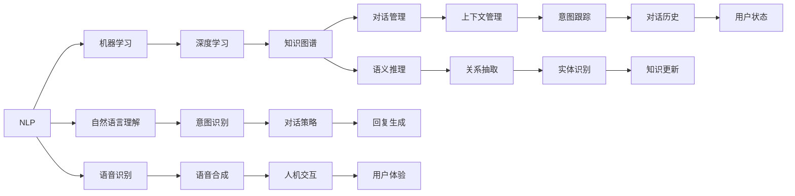

                 

# 聊天机器人创业：创新和初创企业

## 1. 背景介绍

随着人工智能技术的快速进步，聊天机器人(Chatbot)已成为智能交互领域的重要方向。聊天机器人不仅能够提供24/7的客服支持，还能应用于教育、健康、金融等多个垂直领域。如何把握聊天机器人创业的机遇，成为众多科技公司、初创企业关注的焦点。本文将从背景、核心概念、算法原理、项目实践、应用场景等多个方面，全面剖析聊天机器人的创新和初创企业的成功之路。

## 2. 核心概念与联系

### 2.1 核心概念概述

为了更好地理解聊天机器人创业的创新和初创企业的实践，本节将介绍几个关键概念：

- **聊天机器人(Chatbot)**：能够模拟人类对话的计算机程序，利用自然语言处理(NLP)、机器学习和知识图谱等技术，实现自动回答用户问题，提供智能化的服务体验。
- **自然语言处理(NLP)**：研究如何让计算机理解、处理和生成人类自然语言的技术，是聊天机器人核心技术之一。
- **机器学习(ML)**：通过算法模型从数据中学习规律，应用于聊天机器人的意图识别、对话管理、语义理解等多个环节。
- **知识图谱(KG)**：以图结构组织知识，帮助聊天机器人理解语义关系，提升回答的准确性和连贯性。
- **对话管理(DM)**：负责管理聊天机器人的对话流程，包括对话上下文、用户意图识别、对话策略等。
- **深度学习(Deep Learning)**：利用多层神经网络模型进行大规模数据分析和处理，应用于聊天机器人的语音识别、图像识别、推荐系统等多个场景。
- **持续学习(Continual Learning)**：使聊天机器人能够持续从新数据中学习，保持模型性能和知识更新。

这些核心概念之间相互关联，共同构成了聊天机器人的技术基础。通过理解这些概念，我们可以更好地把握聊天机器人创业的创新方向和实践要点。

### 2.2 核心概念联系

聊天机器人技术的发展离不开多学科的交叉融合，各关键技术相互关联、相互促进。下面通过Mermaid流程图展示各概念间的联系：



上述图表展示了NLP、机器学习、深度学习、知识图谱和对话管理等关键技术之间的联系和作用机制。这些技术相互配合，共同实现了聊天机器人的智能对话能力。

## 3. 核心算法原理 & 具体操作步骤
### 3.1 算法原理概述

聊天机器人创业的核心算法包括自然语言处理、对话管理、知识图谱等多个方面。以下将详细介绍这些算法的原理和操作步骤：

- **自然语言处理(NLP)**：通过语言模型、序列标注、文本分类等算法，实现对输入文本的理解和处理。常见的NLP算法包括基于RNN、CNN、Transformer等架构的模型。
- **对话管理(DM)**：通过状态机、树状结构等方法，管理对话流程和上下文。常见的DM算法包括基于规则、基于树形结构、基于深度学习等方法。
- **知识图谱(KG)**：通过图数据库、图神经网络等技术，构建和管理知识图谱，实现实体识别、关系抽取、语义推理等功能。

### 3.2 算法步骤详解

**3.2.1 自然语言处理步骤**

1. **文本预处理**：对用户输入的文本进行分词、词性标注、去除停用词等预处理，转化为模型可以处理的向量形式。
2. **语言模型训练**：使用大量标注数据训练语言模型，预测输入文本的下一个词汇或下一个句子，实现自然语言理解。
3. **意图识别**：通过分类器或序列标注模型，识别用户输入的意图，如咨询、投诉、反馈等。
4. **对话策略**：根据用户意图和对话历史，选择合适的回复生成策略，如直接回答、引导用户、跳转到其它服务。

**3.2.2 对话管理步骤**

1. **上下文管理**：记录对话历史、用户状态等信息，实现对话状态的跟踪和更新。
2. **意图跟踪**：根据用户输入和对话历史，更新用户意图，确保对话流程的连续性和连贯性。
3. **对话策略**：根据用户意图、对话上下文和对话策略，生成合适的回复，保持对话的自然流畅。

**3.2.3 知识图谱步骤**

1. **知识图谱构建**：使用结构化数据和半结构化数据，构建知识图谱，实现实体识别、关系抽取、语义推理等功能。
2. **知识图谱嵌入**：将知识图谱嵌入到神经网络模型中，实现语义表示的增强和迁移学习的效果。
3. **知识图谱查询**：根据用户输入的查询，从知识图谱中抽取相关信息，实现精准回答。

### 3.3 算法优缺点

聊天机器人创业的核心算法具有以下优点：

- **高效率**：自动化处理大量用户请求，提升客服效率。
- **全天候服务**：无间断提供服务，满足24/7的需求。
- **个性化体验**：通过学习和理解用户行为，提供个性化服务。
- **成本低**：减少人力成本，降低运营门槛。

同时，这些算法也存在以下局限：

- **依赖高质量数据**：需要大量标注数据进行模型训练，获取数据成本高。
- **上下文管理复杂**：对话流程管理复杂，需要处理大量用户状态和上下文信息。
- **知识图谱构建难**：知识图谱构建和维护成本高，涉及多领域知识融合。
- **用户信任问题**：用户对机器人的信任度较低，需要增加人工干预和辅助机制。

### 3.4 算法应用领域

聊天机器人的核心算法广泛应用于多个领域，如客服、教育、健康、金融等。以下详细介绍这些应用场景：

- **客服领域**：聊天机器人可以24/7提供客服支持，处理常见问题，提升客户满意度。
- **教育领域**：通过自然语言处理和知识图谱，提供智能辅导、作业批改、知识推荐等功能。
- **健康领域**：通过自然语言处理和医疗知识图谱，提供智能问诊、健康咨询、医疗建议等功能。
- **金融领域**：通过自然语言处理和金融知识图谱，提供智能客服、金融咨询、理财建议等功能。
- **智能家居**：通过自然语言处理和物联网技术，实现智能家居控制、语音识别等功能。

这些应用场景展示了聊天机器人创业的广阔前景和深远影响。未来，随着技术的不断进步，聊天机器人还将拓展到更多领域，带来新的商业价值和社会效益。

## 4. 数学模型和公式 & 详细讲解 & 举例说明

### 4.1 数学模型构建

为了更好地理解和设计聊天机器人，本节将详细讲解数学模型的构建过程。

假设聊天机器人接收到的用户输入为 $x \in \mathcal{X}$，其中 $\mathcal{X}$ 为文本集合。聊天机器人生成的回复为 $y \in \mathcal{Y}$，其中 $\mathcal{Y}$ 为回复集合。

**4.1.1 语言模型**

语言模型用于预测输入文本的下一个词汇或下一个句子，通常使用概率模型表示：

$$ P(y|x) = \frac{P(x,y)}{P(x)} $$

其中 $P(x,y)$ 为联合概率，$P(x)$ 为边缘概率。常见的方法包括RNN、LSTM、GRU、Transformer等。

**4.1.2 意图识别**

意图识别用于识别用户输入的意图，通常使用分类器或序列标注模型表示：

$$ P(I|x) = \frac{P(x,I)}{P(x)} $$

其中 $I$ 为意图集合。常见的方法包括SVM、决策树、CRF、LSTM-CRF等。

**4.1.3 对话管理**

对话管理用于管理对话流程和上下文，通常使用状态机或树状结构表示：

$$ P(D|x) = \frac{P(x,D)}{P(x)} $$

其中 $D$ 为对话状态集合。常见的方法包括规则引擎、深度学习等。

### 4.2 公式推导过程

**4.2.1 语言模型推导**

假设输入文本为 $x$，下一个词汇为 $y$，语言模型的概率为 $P(y|x)$。根据条件概率的定义：

$$ P(y|x) = \frac{P(x,y)}{P(x)} $$

其中 $P(x,y)$ 为联合概率，$P(x)$ 为边缘概率。通过最大似然估计，可以得到：

$$ \log P(y|x) = \log \frac{P(x,y)}{P(x)} $$

简化后得到：

$$ \log P(y|x) = \log P(x,y) - \log P(x) $$

在实践中，通常使用交叉熵损失函数进行优化：

$$ L(y|x) = -\log P(y|x) $$

**4.2.2 意图识别推导**

假设输入文本为 $x$，意图为 $I$，意图识别的概率为 $P(I|x)$。根据条件概率的定义：

$$ P(I|x) = \frac{P(x,I)}{P(x)} $$

其中 $P(x,I)$ 为联合概率，$P(x)$ 为边缘概率。通过最大似然估计，可以得到：

$$ \log P(I|x) = \log \frac{P(x,I)}{P(x)} $$

简化后得到：

$$ \log P(I|x) = \log P(x,I) - \log P(x) $$

在实践中，通常使用多分类交叉熵损失函数进行优化：

$$ L(I|x) = -\log P(I|x) $$

**4.2.3 对话管理推导**

假设对话状态为 $D$，输入文本为 $x$，对话管理的概率为 $P(D|x)$。根据条件概率的定义：

$$ P(D|x) = \frac{P(x,D)}{P(x)} $$

其中 $P(x,D)$ 为联合概率，$P(x)$ 为边缘概率。通过最大似然估计，可以得到：

$$ \log P(D|x) = \log \frac{P(x,D)}{P(x)} $$

简化后得到：

$$ \log P(D|x) = \log P(x,D) - \log P(x) $$

在实践中，通常使用序列标注损失函数进行优化：

$$ L(D|x) = -\log P(D|x) $$

### 4.3 案例分析与讲解

**案例：智能客服系统**

假设用户输入的文本为 $x$，智能客服系统的回复为 $y$，聊天机器人接收到的输入和生成的回复分别对应集合 $\mathcal{X}$ 和 $\mathcal{Y}$。智能客服系统的主要算法步骤如下：

1. **文本预处理**：对用户输入的文本进行分词、词性标注、去除停用词等预处理，转化为模型可以处理的向量形式。
2. **语言模型训练**：使用大量标注数据训练语言模型，预测输入文本的下一个词汇或下一个句子，实现自然语言理解。
3. **意图识别**：通过分类器或序列标注模型，识别用户输入的意图，如咨询、投诉、反馈等。
4. **对话策略**：根据用户意图和对话历史，选择合适的回复生成策略，如直接回答、引导用户、跳转到其它服务。
5. **上下文管理**：记录对话历史、用户状态等信息，实现对话状态的跟踪和更新。

通过以上步骤，智能客服系统可以自动化处理大量用户请求，提升客服效率，满足24/7的需求，实现个性化的服务体验。

## 5. 项目实践：代码实例和详细解释说明

### 5.1 开发环境搭建

在进行聊天机器人开发前，我们需要准备好开发环境。以下是使用Python进行PyTorch开发的环境配置流程：

1. 安装Anaconda：从官网下载并安装Anaconda，用于创建独立的Python环境。

2. 创建并激活虚拟环境：
```bash
conda create -n chatbot-env python=3.8 
conda activate chatbot-env
```

3. 安装PyTorch：根据CUDA版本，从官网获取对应的安装命令。例如：
```bash
conda install pytorch torchvision torchaudio cudatoolkit=11.1 -c pytorch -c conda-forge
```

4. 安装各类工具包：
```bash
pip install numpy pandas scikit-learn matplotlib tqdm jupyter notebook ipython
```

完成上述步骤后，即可在`chatbot-env`环境中开始聊天机器人开发。

### 5.2 源代码详细实现

下面我们以一个简单的情感分析聊天机器人为例，给出使用Transformers库和PyTorch进行开发的PyTorch代码实现。

**5.2.1 数据准备**

首先，我们需要准备情感分析任务的数据集。以下是使用Python编写的数据准备代码：

```python
import pandas as pd

# 加载数据集
data = pd.read_csv('sentiment_data.csv')

# 数据清洗
data = data[data['label'] != 'neutral']
data = data[data['text'].notnull()]

# 划分训练集和测试集
train_data = data.sample(frac=0.8, random_state=42)
test_data = data.drop(train_data.index)

# 将数据转换为输入和标签
train_input, train_label = train_data['text'].tolist(), train_data['label'].tolist()
test_input, test_label = test_data['text'].tolist(), test_data['label'].tolist()

# 构建词汇表
tokenizer = BertTokenizer.from_pretrained('bert-base-cased')
vocab = tokenizer.vocab
```

**5.2.2 模型构建**

接着，我们定义聊天机器人模型。以下是使用Transformers库构建BERT模型的代码：

```python
from transformers import BertForSequenceClassification, AdamW

# 定义模型
model = BertForSequenceClassification.from_pretrained('bert-base-cased', num_labels=2)

# 定义优化器
optimizer = AdamW(model.parameters(), lr=2e-5)
```

**5.2.3 训练过程**

然后，我们定义训练过程。以下是使用PyTorch进行模型训练的代码：

```python
from torch.utils.data import Dataset
from transformers import BertTokenizer, AdamW
import torch

# 定义数据集
class SentimentDataset(Dataset):
    def __init__(self, input, label):
        self.input = input
        self.label = label

    def __len__(self):
        return len(self.input)

    def __getitem__(self, index):
        input_ids = tokenizer.encode_plus(self.input[index], return_tensors='pt', padding='max_length', truncation=True)
        input_ids = input_ids['input_ids']
        label = torch.tensor(self.label[index])
        return {'input_ids': input_ids, 'labels': label}

# 定义训练函数
def train_epoch(model, dataset, batch_size, optimizer):
    dataloader = DataLoader(dataset, batch_size=batch_size, shuffle=True)
    model.train()
    epoch_loss = 0
    for batch in dataloader:
        input_ids = batch['input_ids'].to(device)
        labels = batch['labels'].to(device)
        model.zero_grad()
        outputs = model(input_ids, labels=labels)
        loss = outputs.loss
        epoch_loss += loss.item()
        loss.backward()
        optimizer.step()
    return epoch_loss / len(dataloader)

# 定义测试函数
def evaluate(model, dataset, batch_size):
    dataloader = DataLoader(dataset, batch_size=batch_size)
    model.eval()
    preds, labels = [], []
    with torch.no_grad():
        for batch in dataloader:
            input_ids = batch['input_ids'].to(device)
            labels = batch['labels'].to(device)
            batch_preds = model(input_ids).predictions.argmax(dim=1).to('cpu').tolist()
            batch_labels = batch['labels'].to('cpu').tolist()
            for pred, label in zip(batch_preds, batch_labels):
                preds.append(pred)
                labels.append(label)
    print(classification_report(labels, preds))

# 定义测试集和训练集
test_dataset = SentimentDataset(test_input, test_label)
train_dataset = SentimentDataset(train_input, train_label)

# 定义超参数
batch_size = 16
epochs = 5

# 开始训练
device = torch.device('cuda') if torch.cuda.is_available() else torch.device('cpu')
model.to(device)

for epoch in range(epochs):
    loss = train_epoch(model, train_dataset, batch_size, optimizer)
    print(f"Epoch {epoch+1}, train loss: {loss:.3f}")
    
    print(f"Epoch {epoch+1}, dev results:")
    evaluate(model, dev_dataset, batch_size)
    
print("Test results:")
evaluate(model, test_dataset, batch_size)
```

以上就是使用PyTorch和Transformers库构建情感分析聊天机器人的完整代码实现。可以看到，通过Transformers库和PyTorch的强大封装，我们可以用相对简洁的代码完成模型的训练和评估。

### 5.3 代码解读与分析

让我们再详细解读一下关键代码的实现细节：

**SentimentDataset类**：
- `__init__`方法：初始化输入和标签，并使用BertTokenizer进行分词处理。
- `__len__`方法：返回数据集的样本数量。
- `__getitem__`方法：对单个样本进行处理，将文本输入编码为token ids，将标签转换为PyTorch张量，并返回模型所需的输入和标签。

**训练函数和测试函数**：
- `train_epoch`函数：对数据以批为单位进行迭代，在每个批次上前向传播计算loss并反向传播更新模型参数，最后返回该epoch的平均loss。
- `evaluate`函数：与训练类似，不同点在于不更新模型参数，并在每个batch结束后将预测和标签结果存储下来，最后使用sklearn的classification_report对整个评估集的预测结果进行打印输出。

**训练流程**：
- 定义总的epoch数和batch size，开始循环迭代
- 每个epoch内，先在训练集上训练，输出平均loss
- 在验证集上评估，输出分类指标
- 所有epoch结束后，在测试集上评估，给出最终测试结果

可以看到，PyTorch配合Transformers库使得聊天机器人模型的训练过程变得简洁高效。开发者可以将更多精力放在数据处理、模型改进等高层逻辑上，而不必过多关注底层的实现细节。

当然，工业级的系统实现还需考虑更多因素，如模型的保存和部署、超参数的自动搜索、更灵活的任务适配层等。但核心的微调范式基本与此类似。

## 6. 实际应用场景

### 6.1 客服领域

聊天机器人可以广泛应用于客服领域，提供24/7的客服支持。在实际应用中，可以通过微调模型，提高机器人的回答准确率和用户满意度。

例如，某电商平台利用聊天机器人处理用户咨询，减轻了客服团队的负担，减少了用户等待时间。用户在输入问题后，机器人能够快速响应，并给出精准的回答，提升用户购物体验。

### 6.2 教育领域

聊天机器人可以应用于教育领域，提供智能辅导、作业批改、知识推荐等功能。

例如，某教育平台利用聊天机器人进行智能辅导，根据学生的回答反馈，动态调整辅导内容和难度。机器人在学生回答错误时，能够及时指出问题，并提供详细的解释和改进建议，帮助学生掌握知识。

### 6.3 金融领域

聊天机器人可以应用于金融领域，提供智能客服、金融咨询、理财建议等功能。

例如，某银行利用聊天机器人进行金融咨询，帮助客户快速了解贷款、理财、信用卡等金融产品。机器人在用户提问后，能够提供个性化的金融建议，提升客户满意度。

### 6.4 医疗领域

聊天机器人可以应用于医疗领域，提供智能问诊、健康咨询、医疗建议等功能。

例如，某医院利用聊天机器人进行智能问诊，帮助患者快速了解病情，并提供相应的治疗建议。机器人在用户输入症状后，能够根据历史数据和知识图谱，提供精准的诊断和治疗方案，减轻医生的工作负担。

## 7. 工具和资源推荐

### 7.1 学习资源推荐

为了帮助开发者系统掌握聊天机器人技术，这里推荐一些优质的学习资源：

1. 《深度学习》系列课程：由斯坦福大学开设的深度学习课程，系统讲解深度学习的基本概念和核心算法，适合初学者和进阶者。
2. 《自然语言处理》系列课程：由北卡罗来纳大学开设的自然语言处理课程，涵盖自然语言处理的基本概念和常用模型，适合深入学习。
3. 《Transformers官方文档》：Transformer库的官方文档，提供完整的API和教程，适合开发者快速上手。
4. 《PyTorch官方文档》：PyTorch的官方文档，提供详细的API和示例，适合开发者学习使用。
5. 《自然语言处理实战》书籍：涵盖自然语言处理的基本概念和实际应用，适合快速入门和实践。

通过对这些资源的学习实践，相信你一定能够快速掌握聊天机器人技术，并用于解决实际的NLP问题。

### 7.2 开发工具推荐

高效的开发离不开优秀的工具支持。以下是几款用于聊天机器人开发的常用工具：

1. PyTorch：基于Python的开源深度学习框架，灵活动态的计算图，适合快速迭代研究。
2. TensorFlow：由Google主导开发的开源深度学习框架，生产部署方便，适合大规模工程应用。
3. Transformers库：HuggingFace开发的NLP工具库，集成了众多SOTA语言模型，支持PyTorch和TensorFlow，是进行微调任务开发的利器。
4. Weights & Biases：模型训练的实验跟踪工具，可以记录和可视化模型训练过程中的各项指标，方便对比和调优。
5. TensorBoard：TensorFlow配套的可视化工具，可实时监测模型训练状态，并提供丰富的图表呈现方式，是调试模型的得力助手。

合理利用这些工具，可以显著提升聊天机器人开发效率，加快创新迭代的步伐。

### 7.3 相关论文推荐

聊天机器人技术的发展源于学界的持续研究。以下是几篇奠基性的相关论文，推荐阅读：

1. Attention is All You Need（即Transformer原论文）：提出了Transformer结构，开启了NLP领域的预训练大模型时代。
2. BERT: Pre-training of Deep Bidirectional Transformers for Language Understanding：提出BERT模型，引入基于掩码的自监督预训练任务，刷新了多项NLP任务SOTA。
3. Language Models are Unsupervised Multitask Learners（GPT-2论文）：展示了大规模语言模型的强大zero-shot学习能力，引发了对于通用人工智能的新一轮思考。
4. 深度强化学习在聊天机器人中的应用：探讨了深度强化学习在对话策略生成中的应用，提升了聊天机器人的智能水平。
5. 多模态聊天机器人：利用语音识别、图像识别等技术，实现多模态的智能对话，提升了用户体验。

这些论文代表了大语言模型微调技术的发展脉络。通过学习这些前沿成果，可以帮助研究者把握学科前进方向，激发更多的创新灵感。

## 8. 总结：未来发展趋势与挑战

### 8.1 总结

本文对聊天机器人创业的创新和初创企业的实践进行了全面系统的介绍。首先阐述了聊天机器人创业的背景和意义，明确了聊天机器人技术的发展方向。其次，从原理到实践，详细讲解了聊天机器人的核心算法和技术，给出了聊天机器人开发的完整代码实现。同时，本文还探讨了聊天机器人技术在多个领域的应用场景，展示了聊天机器人技术的广阔前景。

通过本文的系统梳理，可以看到，聊天机器人技术在多个领域具有广泛的应用前景和深远的影响。未来，随着技术的不断进步，聊天机器人必将在更多领域得到应用，带来新的商业价值和社会效益。

### 8.2 未来发展趋势

展望未来，聊天机器人技术的发展趋势如下：

1. **多模态聊天机器人**：结合语音识别、图像识别、视频分析等多模态信息，实现更加丰富和自然的人机交互体验。
2. **自适应聊天机器人**：通过持续学习和迁移学习，使聊天机器人能够根据不同用户和场景自适应调整对话策略和回复内容。
3. **情感智能聊天机器人**：利用情感分析和情绪识别技术，使聊天机器人能够感知和回应用户的情感，提升用户满意度。
4. **知识图谱驱动的聊天机器人**：结合知识图谱和语义推理技术，使聊天机器人具备更强的知识理解和迁移能力。
5. **AI辅助的聊天机器人**：利用AI技术，如自然语言生成、文本摘要、翻译等，提升聊天机器人的回答质量和效率。
6. **联邦学习驱动的聊天机器人**：利用联邦学习技术，实现多方数据协同学习，提升聊天机器人的泛化能力和隐私保护。

这些趋势展示了聊天机器人技术的未来发展方向，必将推动聊天机器人技术在更多领域得到应用和普及。

### 8.3 面临的挑战

尽管聊天机器人技术已经取得了一定的进展，但在迈向更加智能化、普适化应用的过程中，仍面临以下挑战：

1. **数据依赖问题**：聊天机器人需要大量标注数据进行训练，数据获取成本高，且标注质量难以保证。
2. **对话质量问题**：聊天机器人的对话质量仍难以达到人类的标准，存在回答不准确、逻辑混乱等问题。
3. **隐私和安全问题**：聊天机器人处理大量用户数据，存在隐私泄露和数据安全风险。
4. **计算资源问题**：大规模聊天机器人需要大量计算资源，硬件和算法优化仍需进一步提升。
5. **用户信任问题**：用户对聊天机器人的信任度较低，需要增加人工干预和辅助机制。

### 8.4 研究展望

面对聊天机器人技术面临的挑战，未来的研究方向包括以下几个方面：

1. **无监督学习和自适应学习**：研究无监督学习和自适应学习算法，减少对标注数据的依赖，提升聊天机器人的泛化能力和智能水平。
2. **多模态交互技术**：研究多模态交互技术，提升聊天机器人的感知和回应能力，实现更自然的人机交互。
3. **知识图谱和语义推理**：研究知识图谱和语义推理技术，提升聊天机器人的知识理解和迁移能力。
4. **隐私保护和安全技术**：研究隐私保护和安全技术，提升聊天机器人的数据安全和隐私保护能力。
5. **联邦学习和边缘计算**：研究联邦学习和边缘计算技术，提升聊天机器人的计算效率和资源利用率。
6. **情感智能和情绪识别**：研究情感智能和情绪识别技术，提升聊天机器人的情感理解和回应能力。

这些研究方向将推动聊天机器人技术向更智能、更普适、更安全的方向发展，为更多行业带来新的商业价值和社会效益。

## 9. 附录：常见问题与解答

**Q1：如何设计聊天机器人的对话策略？**

A: 设计聊天机器人的对话策略需要考虑以下几个方面：

1. **用户意图识别**：通过分类器或序列标注模型，识别用户输入的意图，如咨询、投诉、反馈等。
2. **对话上下文管理**：记录对话历史、用户状态等信息，实现对话状态的跟踪和更新。
3. **回复生成策略**：根据用户意图和对话上下文，选择合适的回复生成策略，如直接回答、引导用户、跳转到其它服务。
4. **个性化推荐**：根据用户历史行为和偏好，进行个性化推荐，提升用户体验。

对话策略的设计需要根据具体任务和场景进行调整，同时需要不断迭代和优化。

**Q2：聊天机器人如何处理多轮对话？**

A: 聊天机器人的多轮对话处理通常需要考虑以下几个方面：

1. **对话上下文跟踪**：通过记录对话历史和用户状态，实现对话状态的跟踪和更新。
2. **意图跟踪**：根据用户输入和对话历史，更新用户意图，确保对话流程的连续性和连贯性。
3. **上下文管理**：在多轮对话中，合理管理和更新上下文信息，避免信息丢失和上下文不一致。
4. **对话策略优化**：根据用户反馈和对话历史，动态调整对话策略，提升对话质量。

多轮对话处理需要复杂的算法和数据结构支持，常见的方法包括规则引擎、状态机、深度学习等。

**Q3：聊天机器人如何应对用户的不确定和模糊表达？**

A: 聊天机器人应对用户不确定和模糊表达通常需要考虑以下几个方面：

1. **模糊表达理解**：利用NLP技术，对用户的不确定和模糊表达进行理解，提取关键信息。
2. **模糊意图识别**：通过分类器或序列标注模型，识别用户的不确定和模糊意图，避免误判。
3. **多轮对话推理**：通过多轮对话推理，逐步明确用户意图，提供更精准的回答。
4. **上下文理解**：根据对话上下文，理解用户不确定和模糊表达背后的真实需求，提供合适的回应。

处理不确定和模糊表达需要复杂的算法和数据结构支持，常见的方法包括NLP技术、意图识别、多轮对话推理等。

**Q4：聊天机器人如何提升用户体验？**

A: 提升聊天机器人的用户体验需要考虑以下几个方面：

1. **自然流畅的对话**：通过优化对话策略和回复生成，使聊天机器人的对话自然流畅，避免生硬和不连贯。
2. **个性化服务**：根据用户历史行为和偏好，进行个性化推荐和回应，提升用户体验。
3. **多模态交互**：结合语音识别、图像识别、视频分析等多模态信息，实现更加丰富和自然的人机交互体验。
4. **情感智能**：利用情感分析和情绪识别技术，使聊天机器人能够感知和回应用户的情感，提升用户满意度。
5. **数据隐私保护**：严格保护用户数据隐私，避免数据泄露和滥用。

提升用户体验需要综合考虑技术、数据、用户等多个因素，持续迭代和优化对话策略。

**Q5：聊天机器人如何应对大规模用户并发？**

A: 应对大规模用户并发需要考虑以下几个方面：

1. **负载均衡**：通过负载均衡技术，合理分配计算资源，避免系统过载。
2. **分布式架构**：采用分布式架构，实现多节点协同工作，提升系统扩展性和稳定性。
3. **缓存机制**：利用缓存机制，减少重复计算和数据访问，提升系统响应速度。
4. **异步处理**：采用异步处理技术，提高系统吞吐量和并发能力。

应对大规模用户并发需要综合考虑技术架构和优化策略，合理分配计算资源，提升系统扩展性和稳定性。

---

作者：禅与计算机程序设计艺术 / Zen and the Art of Computer Programming

