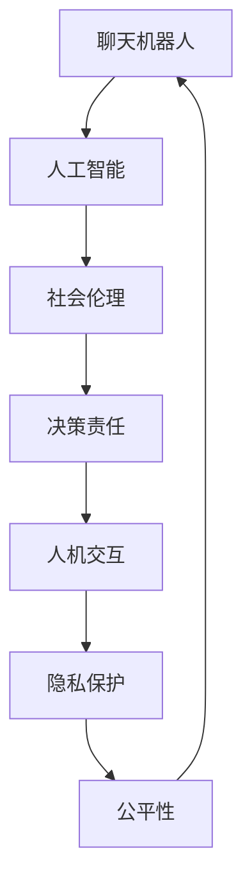

                 

# 聊天机器人社会影响：道德和责任

> 关键词：聊天机器人,人工智能,社会伦理,决策责任,人机交互,隐私保护,公平性

## 1. 背景介绍

### 1.1 问题由来
随着人工智能技术的迅猛发展，聊天机器人已经成为现代社会不可或缺的一部分。从客服机器人到智能助手，从虚拟健康顾问到在线教育平台，聊天机器人的应用场景日益广泛。然而，随之而来的道德和责任问题也日益凸显。如何设计公平、透明、可靠的聊天机器人，保障用户隐私，应对潜在的偏见和歧视，成为当前人工智能研究的热点问题。

### 1.2 问题核心关键点
聊天机器人设计中涉及的道德和责任问题，主要体现在以下几个方面：
1. **隐私保护**：如何在聊天过程中保护用户隐私，防止个人信息泄露。
2. **公平性**：聊天机器人是否公平对待所有用户，避免对某些群体的偏见和歧视。
3. **透明度**：聊天机器人如何让用户理解其决策过程，增强用户信任。
4. **责任归属**：在机器人出现错误决策时，如何明确责任归属，保障用户权益。
5. **人类监督**：如何平衡机器人的自主性和人类监督，确保其行为符合伦理标准。

这些核心问题不仅关乎聊天机器人的用户体验，更关系到社会伦理和法律责任，具有重要的研究意义。

## 2. 核心概念与联系

### 2.1 核心概念概述

为了更好地理解聊天机器人在社会中的作用和影响，本节将介绍几个密切相关的核心概念：

- **聊天机器人(Chatbot)**：基于自然语言处理(NLP)技术的智能程序，能够与人类进行自然语言交互。常见类型包括基于规则的、基于统计的、基于深度学习的等。

- **人工智能(AI)**：通过模拟人类智能行为，实现自主学习、决策和推理的技术体系。聊天机器人是AI应用的重要组成部分。

- **社会伦理(Social Ethics)**：涉及道德、法律、文化等多方面的规范，指导AI系统设计和使用，确保其行为符合社会价值观。

- **决策责任(Decision Responsibility)**：在AI系统中，如何界定决策者（机器或人类）的责任，保障用户的权益和系统的透明性。

- **人机交互(Human-Computer Interaction, HCI)**：研究人机之间自然、高效、友好的交互方式，提升用户体验和系统性能。

- **隐私保护(Privacy Protection)**：保障用户隐私信息不被未经授权的访问和使用，确保用户数据的安全性和机密性。

- **公平性(Fairness)**：指AI系统在处理数据和决策时不应产生偏见和歧视，确保对所有用户的平等对待。

这些核心概念之间存在密切联系，共同构成聊天机器人设计和应用的伦理框架。

### 2.2 核心概念原理和架构的 Mermaid 流程图



这个流程图展示了聊天机器人在人工智能体系中的位置，以及与各核心概念之间的关联。聊天机器人依赖于人工智能技术实现，受社会伦理和法律约束，通过人机交互提供服务，并在设计和使用中注重隐私保护和公平性。

## 3. 核心算法原理 & 具体操作步骤

### 3.1 算法原理概述

聊天机器人的设计不仅依赖于自然语言处理技术，还需要考虑伦理、隐私、公平等多个维度。其核心算法原理可以概括为以下几点：

1. **基于规则和模板**：早期的聊天机器人多采用规则和模板匹配的方式，通过预定义的逻辑和规则处理用户输入，实现特定任务。这种方法易于实现和维护，但缺乏灵活性。

2. **基于统计的机器学习**：利用统计学习方法，如朴素贝叶斯、支持向量机等，构建聊天机器人模型，从大量语料中学习语言模式和交互策略。这种方法在处理大规模数据时效果较好，但需要大量标注数据。

3. **深度学习和预训练模型**：近年来，基于深度学习和预训练模型（如BERT、GPT等）的聊天机器人获得了广泛应用。这些模型通过在大规模语料上进行预训练，学习通用语言表示，然后在特定任务上进行微调，能够处理更复杂的交互任务。

### 3.2 算法步骤详解

聊天机器人的设计步骤可以分为以下几个环节：

1. **需求分析和用户调研**：明确聊天机器人的目标用户群体和应用场景，了解用户需求和期望，制定设计和开发计划。

2. **模型选择和架构设计**：根据任务复杂度和数据可用性，选择合适的模型架构，如基于规则、统计模型或深度学习模型。设计合理的对话流程和数据流图，确保系统高效稳定。

3. **数据准备和预处理**：收集和整理大量语料数据，进行清洗、标注和划分，准备好训练和验证数据集。数据预处理包括文本分词、去除停用词、构建特征向量等。

4. **模型训练和微调**：利用准备好的数据集，在目标任务上训练聊天机器人模型，并进行必要的微调，优化模型参数。训练过程中，需要考虑模型的公平性和隐私保护问题。

5. **评估和测试**：通过评估指标（如准确率、召回率、用户满意度等）对模型进行评估，进行测试和优化。可以采用A/B测试、用户调研等方式获取反馈。

6. **部署和监控**：将训练好的模型部署到实际应用环境中，进行实时监控和维护，确保系统的稳定性和用户体验。

### 3.3 算法优缺点

聊天机器人的算法设计存在以下优缺点：

**优点**：
1. **灵活性**：深度学习和预训练模型能够处理复杂的多轮对话，具有较强的灵活性和适应性。
2. **高性能**：基于统计和深度学习的模型在处理大规模数据时效果较好，能够提供高质量的交互体验。
3. **可扩展性**：聊天机器人能够轻松集成到各类应用场景中，如客服、教育、健康等。

**缺点**：
1. **数据依赖**：模型需要大量标注数据进行训练，获取高质量数据成本较高。
2. **公平性和隐私问题**：模型可能存在偏见和歧视，用户隐私难以完全保障。
3. **复杂度**：深度学习模型需要较复杂的计算资源，部署和维护成本较高。
4. **可解释性**：部分深度学习模型缺乏解释性，用户难以理解其决策过程。

### 3.4 算法应用领域

聊天机器人技术在多个领域得到了广泛应用，具体如下：

- **客户服务**：在电商、金融、旅游等行业的客服中心，聊天机器人能够处理常见问题，提供24/7服务，提升客户满意度。
- **教育培训**：在线教育平台和智能辅导机器人，能够提供个性化学习建议和问题解答，提升学习效果。
- **医疗健康**：虚拟健康顾问和在线诊疗系统，提供初步健康咨询和诊断建议，减轻医生负担。
- **娱乐休闲**：游戏、影视推荐、社交平台等，提供互动和娱乐服务，丰富用户体验。
- **政府服务**：政务咨询、公共事务管理等，提供高效便捷的服务，提升政府效率。

## 4. 数学模型和公式 & 详细讲解 & 举例说明

### 4.1 数学模型构建

聊天机器人的设计涉及到自然语言处理和人工智能等多个领域。下面以自然语言推理任务为例，介绍聊天机器人中的数学模型构建。

自然语言推理（Natural Language Inference, NLI）是指判断两个句子之间的逻辑关系，如蕴含、矛盾、中性等。在聊天机器人中，NLI可以用于判断用户输入是否合理，预测聊天机器人下一步的动作。

**数学模型构建**：
- **输入表示**：将输入的句子表示为向量形式，通常使用词嵌入（Word Embedding）技术将单词映射到向量空间。
- **模型结构**：常见模型包括LSTM、Transformer等，其中Transformer因其出色的性能，被广泛应用于自然语言推理任务。
- **输出表示**：输出逻辑关系标签，如正例（蕴含、矛盾）和负例（中性）。

### 4.2 公式推导过程

以Transformer为例，自然语言推理任务的公式推导过程如下：

1. **自注意力机制**：将输入的句子表示为多个向量，通过自注意力机制计算句子内部的关系。
2. **前向传播**：将计算得到的向量输入全连接层和激活函数，得到每个单词的表示向量。
3. **池化层**：对每个单词的表示向量进行池化操作，得到句子的向量表示。
4. **分类层**：将句子向量表示输入到分类层，输出逻辑关系标签。

### 4.3 案例分析与讲解

以BERT模型为例，自然语言推理任务的实现步骤如下：

1. **输入表示**：将输入句子转换为BERT向量表示，获取上下文向量。
2. **自注意力机制**：利用BERT的Transformer结构，计算句子内部的关系，得到向量表示。
3. **池化层**：取句子的[CLS]向量的最后一层表示，作为最终的向量表示。
4. **分类层**：将最终的向量表示输入到全连接层和Softmax函数，得到逻辑关系概率分布。
5. **输出**：根据概率分布预测逻辑关系标签。

## 5. 项目实践：代码实例和详细解释说明

### 5.1 开发环境搭建

聊天机器人的开发需要搭建Python环境，使用TensorFlow或PyTorch等深度学习框架。具体步骤如下：

1. **安装Python和相关库**：
   - 安装Anaconda：从官网下载并安装Anaconda，用于创建独立的Python环境。
   - 创建并激活虚拟环境：
     ```bash
     conda create -n chatbot-env python=3.8
     conda activate chatbot-env
     ```
   - 安装必要的深度学习库：
     ```bash
     pip install tensorflow
     pip install pytorch
     ```

2. **搭建计算资源**：
   - 使用GPU/TPU等高性能设备进行模型训练。
   - 安装相关的计算资源管理工具，如Docker、Kubernetes等。

### 5.2 源代码详细实现

下面以基于BERT的自然语言推理任务为例，介绍聊天机器人的代码实现。

```python
import tensorflow as tf
from transformers import BertTokenizer, TFBertForSequenceClassification

# 定义模型结构
model = TFBertForSequenceClassification.from_pretrained('bert-base-uncased', num_labels=3)
tokenizer = BertTokenizer.from_pretrained('bert-base-uncased')

# 准备数据集
train_data = # 训练数据集
dev_data = # 验证数据集
test_data = # 测试数据集

# 定义训练函数
def train_epoch(model, train_data, dev_data, batch_size, learning_rate, epochs):
    # 定义优化器
    optimizer = tf.keras.optimizers.Adam(learning_rate)
    # 定义损失函数
    loss_fn = tf.keras.losses.SparseCategoricalCrossentropy(from_logits=True)
    # 定义评估指标
    eval_fn = tf.keras.metrics.SparseCategoricalAccuracy()
    # 训练过程
    for epoch in range(epochs):
        model.trainable = True
        for batch in train_data:
            input_ids = batch['input_ids']
            attention_mask = batch['attention_mask']
            labels = batch['labels']
            with tf.GradientTape() as tape:
                outputs = model(input_ids, attention_mask=attention_mask, labels=labels)
                loss = loss_fn(labels, outputs)
            grads = tape.gradient(loss, model.trainable_variables)
            optimizer.apply_gradients(zip(grads, model.trainable_variables))
            eval_fn(labels, outputs)
        eval_fn.reset_state()
        dev_loss = loss_fn(dev_data['labels'], model(dev_data['input_ids'], attention_mask=dev_data['attention_mask']))
        print(f"Epoch {epoch+1}, train loss: {train_loss:.4f}, dev loss: {dev_loss:.4f}")
    return model

# 训练模型
model = train_epoch(model, train_data, dev_data, batch_size=32, learning_rate=2e-5, epochs=5)

# 测试模型
test_loss = loss_fn(test_data['labels'], model(test_data['input_ids'], attention_mask=test_data['attention_mask']))
print(f"Test loss: {test_loss:.4f}")
```

### 5.3 代码解读与分析

1. **模型加载和准备**：使用Hugging Face提供的BERT模型和Tokenizer，进行模型的初始化。
2. **数据集准备**：收集并整理训练、验证和测试数据集，包括输入和标签等。
3. **训练函数定义**：使用TensorFlow进行模型训练，包括定义优化器、损失函数和评估指标。
4. **模型训练过程**：在训练集上循环迭代，更新模型参数，并在验证集上进行评估和调整。
5. **模型测试**：在测试集上评估模型性能，计算测试损失。

## 6. 实际应用场景

### 6.1 客户服务

聊天机器人在客户服务领域具有广泛应用，可以显著提升客户体验和满意度。具体应用场景包括：

1. **自动客服**：通过聊天机器人处理常见问题，减轻客服人员负担，提高服务效率。
2. **个性化推荐**：根据用户历史互动，提供个性化服务建议，提升用户体验。
3. **情感分析**：分析用户情感，及时识别负面情绪，进行有效干预。

### 6.2 教育培训

聊天机器人在教育培训领域的应用包括：

1. **智能辅导**：提供个性化学习建议和问题解答，辅助学生学习。
2. **虚拟教室**：与学生进行互动式教学，提升学习效果。
3. **作业批改**：自动批改学生作业，提供即时反馈。

### 6.3 医疗健康

聊天机器人在医疗健康领域的应用包括：

1. **虚拟健康顾问**：提供初步健康咨询和诊断建议，减轻医生负担。
2. **心理辅导**：与患者进行互动式心理辅导，缓解压力。
3. **疾病监控**：监测患者健康状况，提供实时提醒和建议。

### 6.4 未来应用展望

未来，聊天机器人的应用将进一步扩展，覆盖更多领域。以下展望未来应用场景：

1. **智能家居**：与智能家居设备进行互动，提供个性化服务。
2. **城市治理**：提供城市信息查询和问题处理，提升城市治理效率。
3. **金融服务**：提供金融咨询和风险评估，提升金融服务质量。
4. **农业管理**：与农业设备进行互动，提供农业管理建议。
5. **工业制造**：进行工业设备维护和故障诊断，提升生产效率。

## 7. 工具和资源推荐

### 7.1 学习资源推荐

为了帮助开发者系统掌握聊天机器人的设计和应用，以下是推荐的资源：

1. **《深度学习自然语言处理》课程**：斯坦福大学开设的NLP明星课程，涵盖NLP基础和最新技术，提供详细的课程视频和作业指导。
2. **《Transformers: From Discrete to Continuous》博文**：深入介绍Transformer模型及其在自然语言处理中的应用。
3. **《自然语言处理入门》书籍**：提供NLP基础知识和最新技术，涵盖聊天机器人设计、语言模型、数据预处理等。
4. **Hugging Face官方文档**：提供丰富的预训练模型和代码示例，支持TensorFlow和PyTorch等框架。
5. **CLUE开源项目**：提供中文NLP数据集和基准测试，支持基于微调的聊天机器人开发。

### 7.2 开发工具推荐

聊天机器人的开发需要依赖多种工具和技术，以下是推荐的工具：

1. **TensorFlow**：开源深度学习框架，支持分布式训练和模型部署。
2. **PyTorch**：灵活的深度学习框架，易于调试和优化。
3. **Hugging Face Transformers库**：提供预训练模型和工具，支持自然语言处理任务。
4. **TensorBoard**：可视化工具，监测模型训练过程和性能指标。
5. **Weights & Biases**：模型实验跟踪工具，记录和分析训练结果。

### 7.3 相关论文推荐

以下是聊天机器人研究领域的几篇经典论文：

1. **"Towards General-Purpose AI: A Survey of Recent Progress and Open Questions for AI Research"**：总结了近年来AI领域的最新进展和开放问题，包括聊天机器人的发展方向。
2. **"Bert Attention Mechanism"**：介绍BERT模型的注意力机制，详细分析其在自然语言推理任务中的应用。
3. **"Deep Learning for Conversational Agents: The Road Ahead"**：探讨了深度学习在聊天机器人中的应用，提出未来的研究方向和挑战。
4. **"Ethical and Fair AI"**：讨论了AI系统的伦理和公平性问题，为聊天机器人的设计和应用提供了伦理指导。

## 8. 总结：未来发展趋势与挑战

### 8.1 研究成果总结

本文从多个角度探讨了聊天机器人技术的设计和应用，涵盖了自然语言处理、人工智能、社会伦理等关键领域。聊天机器人技术在客户服务、教育培训、医疗健康等领域具有广泛应用，提升了用户体验和系统效率。然而，聊天机器人也面临着隐私保护、公平性、责任归属等道德和责任问题，需要从技术、伦理和社会多个层面进行综合考虑。

### 8.2 未来发展趋势

未来，聊天机器人技术将呈现以下发展趋势：

1. **多模态交互**：结合语音、图像、视频等多模态信息，提升交互的自然性和丰富性。
2. **自适应学习**：通过持续学习和适应，增强聊天机器人的灵活性和智能性。
3. **大规模定制**：提供个性化定制服务，满足不同用户的需求和偏好。
4. **社会协同**：与人类进行协同工作，提升系统的透明性和可信度。
5. **伦理和安全**：重视聊天机器人的伦理和社会责任，保障用户隐私和安全。

### 8.3 面临的挑战

聊天机器人在应用过程中面临以下挑战：

1. **隐私保护**：在处理用户数据时，如何保障用户隐私和数据安全。
2. **公平性和偏见**：如何避免模型中的偏见和歧视，确保对所有用户的平等对待。
3. **可解释性**：如何增强模型的可解释性，让用户理解其决策过程。
4. **责任归属**：在机器人出现错误决策时，如何界定责任归属，保障用户权益。
5. **人类监督**：如何平衡机器人的自主性和人类监督，确保系统行为符合伦理标准。

### 8.4 研究展望

未来，聊天机器人技术的研究将聚焦于以下几个方向：

1. **隐私保护技术**：开发更加高效、安全的隐私保护算法，保障用户数据隐私。
2. **公平性和偏见检测**：研究检测和纠正模型偏见的算法，确保模型的公平性和公正性。
3. **可解释性增强**：提升模型的可解释性，增强用户信任和理解。
4. **多模态交互**：开发多模态交互技术，提升系统的自然性和丰富性。
5. **伦理和社会责任**：建立聊天机器人的伦理和社会责任框架，保障用户权益和系统公正性。

## 9. 附录：常见问题与解答

**Q1：聊天机器人如何处理用户隐私问题？**

A: 聊天机器人处理用户隐私问题主要从以下几个方面入手：

1. **数据匿名化**：在处理用户数据时，对敏感信息进行脱敏处理，保护用户隐私。
2. **数据加密**：采用加密技术保护数据传输和存储的安全性，防止数据泄露。
3. **用户控制**：提供用户隐私设置选项，允许用户控制数据使用范围和权限。
4. **合规审查**：遵循相关法律法规和标准，如GDPR、CCPA等，确保数据处理的合规性。

**Q2：聊天机器人如何确保公平性？**

A: 聊天机器人确保公平性主要从以下几个方面入手：

1. **数据多样化**：在数据集构建时，确保数据的多样性和代表性，防止数据偏见。
2. **模型校准**：在模型训练时，引入公平性约束，防止模型输出偏见。
3. **偏见检测**：在模型部署后，定期检测和纠正模型中的偏见，提升公平性。
4. **用户反馈**：通过用户反馈机制，及时发现和处理模型偏见问题。

**Q3：聊天机器人如何处理偏见和歧视问题？**

A: 聊天机器人处理偏见和歧视问题主要从以下几个方面入手：

1. **数据筛选**：在数据集构建时，去除可能带有偏见和歧视的数据。
2. **模型公平性约束**：在模型训练时，引入公平性约束，防止模型输出偏见。
3. **偏见检测**：在模型部署后，定期检测和纠正模型中的偏见，提升公平性。
4. **用户反馈**：通过用户反馈机制，及时发现和处理模型偏见问题。

**Q4：聊天机器人如何确保可解释性？**

A: 聊天机器人确保可解释性主要从以下几个方面入手：

1. **模型透明性**：设计透明的模型结构，让用户理解模型的工作原理。
2. **中间结果展示**：在模型输出前，展示中间结果和推理过程，增强用户理解。
3. **解释性模型**：使用可解释性模型，如决策树、规则模型等，增强可解释性。
4. **用户引导**：通过引导用户提供更多背景信息，增强模型的可解释性。

---

作者：禅与计算机程序设计艺术 / Zen and the Art of Computer Programming

