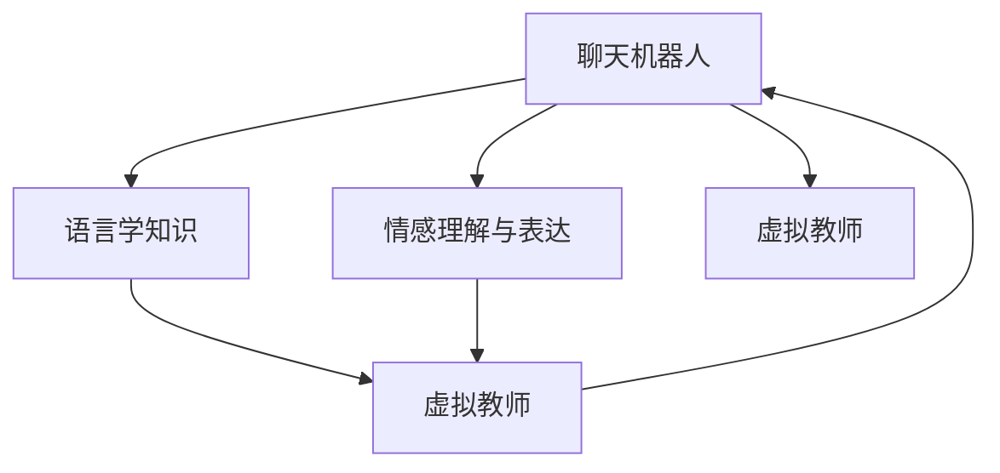

                 

# 聊天机器人语言学习：虚拟教师

## 1. 背景介绍

### 1.1 问题由来
在人工智能技术日益发展的今天，聊天机器人已经成为了人们日常交流中不可或缺的一部分。然而，尽管聊天机器人已经能够进行自然语言处理，但它们的语言学习机制仍不尽完善，往往难以理解复杂语义或生成连贯的回答。这使得聊天机器人难以满足人们对智能互动的需求。

### 1.2 问题核心关键点
为了让聊天机器人更好地理解自然语言，提升其语言学习能力和交互质量，虚拟教师应运而生。虚拟教师通过模拟教师的教学过程，帮助聊天机器人掌握语言学知识，提升其语言理解和生成能力。虚拟教师不仅能够提供语言知识训练，还能够通过模仿教师的互动风格，增强聊天机器人的情感理解和表达能力。

### 1.3 问题研究意义
虚拟教师的引入，将显著提升聊天机器人的语言学习能力，使得它们能够更加自然、准确地与人互动。这对于构建更加智能、友好的用户界面，增强用户体验，具有重要意义。此外，虚拟教师的开发和应用，也将推动人工智能在教育、客服、社交等领域的应用，带来新的产业变革。

## 2. 核心概念与联系

### 2.1 核心概念概述

为更好地理解聊天机器人语言学习中的虚拟教师，本节将介绍几个密切相关的核心概念：

- 聊天机器人(Chatbot)：通过自然语言处理技术，模拟人类对话的计算机程序。它可以回答用户问题、提供信息、进行娱乐等。
- 虚拟教师(Virtual Teacher)：利用人工智能技术，模拟教师的教学过程，帮助聊天机器人学习语言学知识，提升语言理解和生成能力的虚拟实体。
- 语言学知识(Linguistic Knowledge)：包括词汇、语法、语义、句法等知识，是人类语言理解的基础。虚拟教师通过教授这些知识，帮助聊天机器人提升语言学习效果。
- 情感理解与表达(Affective Understanding and Expression)：指聊天机器人对用户情感的识别和回应能力，使其能够更加自然、有效地与用户互动。
- 人机交互(Human-Computer Interaction, HCI)：包括用户界面设计、交互逻辑、用户反馈等，是虚拟教师设计中的重要考量因素。

这些核心概念之间的逻辑关系可以通过以下Mermaid流程图来展示：



这个流程图展示了一些关键概念之间的关联：

1. 聊天机器人通过虚拟教师学习语言学知识。
2. 虚拟教师教授语言学知识，帮助聊天机器人提升语言理解和生成能力。
3. 聊天机器人通过虚拟教师学习情感理解与表达，以更加自然地与用户互动。
4. 虚拟教师与聊天机器人形成闭环互动，共同提升用户界面设计和交互逻辑。

## 3. 核心算法原理 & 具体操作步骤
### 3.1 算法原理概述

聊天机器人语言学习中的虚拟教师，本质上是一个基于知识引导的交互式教学过程。其核心思想是：通过模拟教师的教学方式，将语言学知识逐步传递给聊天机器人，同时通过互动反馈，不断调整和优化知识传授策略，使得聊天机器人能够逐步掌握语言学知识，并应用于实际对话中。

形式化地，假设虚拟教师的教学过程为 $T$，聊天机器人的语言知识状态为 $K$，则虚拟教师的教学目标可以表示为：

$$
K \leftarrow T(K)
$$

其中 $K$ 的更新依赖于 $T$ 的执行，而 $T$ 的执行又依赖于 $K$ 的状态。教学过程通常包括知识传授、练习、反馈和调整等步骤，通过不断迭代，使得 $K$ 逐步接近目标语言学知识。

### 3.2 算法步骤详解

聊天机器人语言学习中的虚拟教师，主要包括以下几个关键步骤：

**Step 1: 设计教学策略**
- 确定聊天机器人的初始语言知识状态 $K_0$。
- 设计教学过程 $T$，包括知识传授、练习、反馈和调整等步骤。

**Step 2: 知识传授**
- 将语言学知识 $K$ 分解为若干小单元，如词汇、语法、语义等。
- 利用文本、音频、视频等多种方式，向聊天机器人传授语言学知识。
- 定义教学进度和节奏，确保知识传授的连续性和系统性。

**Step 3: 知识练习**
- 设计互动问题或任务，使聊天机器人能够在实践中应用所学知识。
- 根据回答的正确性，调整问题的难度和复杂度，以适应聊天机器人的学习进度。
- 记录聊天机器人在练习中的表现，用于后续的反馈和调整。

**Step 4: 知识反馈**
- 根据聊天机器人的回答，给出正向或负向反馈，指出其错误或不足。
- 提供详细的解释和建议，帮助聊天机器人纠正错误，巩固知识。
- 根据反馈结果，调整教学策略，优化知识传授效果。

**Step 5: 知识调整**
- 根据反馈结果，重新设计教学内容，调整教学策略。
- 引入更多样化的教学资源，丰富知识传授方式。
- 逐步提升知识难度，适应聊天机器人的学习进度。

**Step 6: 教学评价**
- 定期评估聊天机器人的语言知识掌握程度，给出综合评价。
- 根据评价结果，调整教学策略和进度。
- 记录聊天机器人的学习过程和成果，用于后续的教学分析和改进。

以上是虚拟教师设计的关键步骤，通过这些步骤，可以系统地引导聊天机器人掌握语言学知识，提升其语言理解和生成能力。

### 3.3 算法优缺点

虚拟教师在聊天机器人语言学习中具有以下优点：

1. 系统性：通过系统的教学策略和进度设计，确保聊天机器人能够系统地掌握语言学知识。
2. 交互性：通过互动练习和反馈，使聊天机器人能够在实践中不断巩固和应用所学知识。
3. 适应性：根据聊天机器人的学习进度和反馈结果，动态调整教学策略，优化知识传授效果。
4. 个性化：针对不同聊天机器人的学习需求和特点，提供个性化教学方案，提升学习效果。
5. 可扩展性：随着语言学知识的不断积累，虚拟教师能够逐步扩展教学内容，提升聊天机器人的语言能力。

然而，虚拟教师也存在以下缺点：

1. 依赖数据：虚拟教师的教学效果很大程度上依赖于高质量的语言学数据，数据质量不足会影响教学效果。
2. 技术复杂：虚拟教师的开发和维护需要较高的技术门槛，需要多学科知识的支持。
3. 动态性不足：当前的虚拟教师设计往往缺乏对动态环境和复杂场景的适应性，难以应对实时变化的语言环境和用户需求。
4. 伦理问题：虚拟教师的交互行为可能涉及隐私保护、用户情感识别等伦理问题，需要谨慎设计和规范。

尽管存在这些缺点，但虚拟教师在提升聊天机器人语言学习能力方面具有不可替代的价值，其应用前景依然广阔。

### 3.4 算法应用领域

虚拟教师在聊天机器人语言学习中的应用，主要体现在以下几个领域：

1. 教育培训：虚拟教师可以应用于在线教育平台，提供个性化的语言学习指导，帮助学生掌握语言学知识，提升语言应用能力。

2. 客服咨询：虚拟教师可以应用于智能客服系统，帮助客服机器人理解用户意图，提供准确、专业的回答，提升用户体验。

3. 社交互动：虚拟教师可以应用于社交机器人，帮助机器人更好地理解用户情感，提供更加自然、亲切的交流体验。

4. 健康咨询：虚拟教师可以应用于医疗健康领域，帮助聊天机器人理解医学知识，提供可靠的医疗咨询和健康指导。

5. 智能助理：虚拟教师可以应用于智能助理系统，帮助助理机器人理解用户的命令和需求，提供更加智能、便捷的服务。

这些领域的应用，展示了虚拟教师在提升聊天机器人语言学习效果方面的巨大潜力。

## 4. 数学模型和公式 & 详细讲解
### 4.1 数学模型构建

聊天机器人语言学习中的虚拟教师，涉及多个变量和参数的动态调整。为了更好地理解这一过程，本节将使用数学语言对虚拟教师的教学过程进行严格刻画。

假设虚拟教师的教学过程为 $T$，聊天机器人的语言知识状态为 $K$，语言知识 $K$ 包括词汇、语法、语义等。虚拟教师的教学目标为使 $K$ 逐步接近目标语言学知识 $K^*$，即：

$$
K \leftarrow T(K)
$$

定义 $T$ 为教学过程，包含知识传授、练习、反馈和调整等步骤，其形式可以表示为：

$$
T = f(K, S, C, F)
$$

其中 $S$ 表示知识传授策略，$C$ 表示知识练习任务，$F$ 表示知识反馈，$f$ 为映射函数。

### 4.2 公式推导过程

以下我们以词汇学习为例，推导虚拟教师的教学过程。

假设词汇学习过程中，虚拟教师向聊天机器人传授词汇 $w_1, w_2, ..., w_n$，每个词汇的学习进度可以表示为一个向量 $v_i$，其中 $i$ 表示词汇编号，$v_i = (v_{i1}, v_{i2}, ..., v_{im})$，其中 $m$ 表示词汇学习的各项指标（如掌握程度、熟练度等）。

假设 $K$ 的初始状态为 $K_0$，则虚拟教师的教学过程可以表示为：

$$
K = T(K_0, S, C, F)
$$

其中 $S$ 为知识传授策略，$C$ 为知识练习任务，$F$ 为知识反馈。

假设 $S$ 为知识传授策略，可以表示为：

$$
S = \{s_1, s_2, ..., s_n\}
$$

其中 $s_i$ 表示词汇 $w_i$ 的学习进度，其更新公式为：

$$
v_i^{t+1} = g(v_i^t, K)
$$

其中 $g$ 为映射函数，表示词汇学习进度的动态调整，$v_i^{t+1}$ 表示下一个时间步长 $t+1$ 的词汇学习进度，$v_i^t$ 表示当前时间步长 $t$ 的词汇学习进度，$K$ 表示当前聊天机器人的语言知识状态。

假设 $C$ 为知识练习任务，可以表示为：

$$
C = \{c_1, c_2, ..., c_n\}
$$

其中 $c_i$ 表示词汇 $w_i$ 的练习任务，其形式可以表示为：

$$
c_i = \{(c_{i1}, c_{i2}, ..., c_{im})\}
$$

其中 $c_{ik}$ 表示词汇 $w_i$ 在 $k$ 项指标上的练习任务。

假设 $F$ 为知识反馈，可以表示为：

$$
F = \{f_1, f_2, ..., f_n\}
$$

其中 $f_i$ 表示词汇 $w_i$ 的学习反馈，其形式可以表示为：

$$
f_i = \{(f_{i1}, f_{i2}, ..., f_{im})\}
$$

其中 $f_{ik}$ 表示词汇 $w_i$ 在 $k$ 项指标上的学习反馈。

结合上述公式，可以构建虚拟教师的教学过程模型，如下所示：

$$
K = T(K_0, S, C, F) = f(K_0, \{g(v_{i1}^t, K), g(v_{i2}^t, K), ..., g(v_{in}^t, K), \{c_{i1}, c_{i2}, ..., c_{im}\}, \{f_{i1}, f_{i2}, ..., f_{im}\})
$$

### 4.3 案例分析与讲解

下面以一个具体的案例，展示虚拟教师的教学过程。

**案例：词汇学习**

假设有一个聊天机器人，其初始词汇知识状态为 $K_0 = (w_{01}, w_{02}, ..., w_{0n})$。虚拟教师设计了如下的教学策略：

1. 知识传授：虚拟教师向聊天机器人传授词汇 $w_1, w_2, ..., w_n$，每次传授一个词汇，传授进度为 $v_{i}^0 = (0.5, 0.5, ..., 0.5)$。

2. 知识练习：虚拟教师设计了如下的知识练习任务：

   - $c_1 = \{(c_{11}, c_{12}, ..., c_{1m})\} = \{("w_1", "Translation", "Correctness", "Fluency", "Diversity", "Consistency")\}$
   - $c_2 = \{(c_{22}, c_{23}, ..., c_{2m})\} = \{("w_2", "Translation", "Correctness", "Fluency", "Diversity", "Consistency")\}$
   - ...

3. 知识反馈：虚拟教师设计了如下的知识反馈：

   - $f_1 = \{(f_{11}, f_{12}, ..., f_{1m})\} = \{("w_1", 1.0, 1.0, 0.5, 0.5, 0.8)\}$
   - $f_2 = \{(f_{22}, f_{23}, ..., f_{2m})\} = \{("w_2", 0.8, 0.7, 1.0, 1.0, 0.9)\}$
   - ...

   其中 $f_{ik}$ 表示词汇 $w_i$ 在 $k$ 项指标上的学习反馈，$1.0$ 表示正确，$0.5$ 表示部分正确，$0.3$ 表示错误。

结合上述公式，可以计算聊天机器人的词汇知识状态 $K_1$，如下所示：

$$
K_1 = T(K_0, S, C, F) = f(K_0, \{g(v_{11}^0, K_0), g(v_{21}^0, K_0), ..., g(v_{n1}^0, K_0), \{c_{11}, c_{12}, ..., c_{1m}\}, \{f_{11}, f_{12}, ..., f_{1m}\})
$$

通过不断迭代上述公式，可以逐步更新聊天机器人的词汇知识状态，使其逐步接近目标词汇知识状态 $K^*$。

## 5. 项目实践：代码实例和详细解释说明
### 5.1 开发环境搭建

在进行虚拟教师的开发实践前，我们需要准备好开发环境。以下是使用Python进行开发的环境配置流程：

1. 安装Anaconda：从官网下载并安装Anaconda，用于创建独立的Python环境。

2. 创建并激活虚拟环境：
```bash
conda create -n chatbot-env python=3.8 
conda activate chatbot-env
```

3. 安装必要的库：
```bash
pip install numpy pandas scikit-learn torch transformers
```

4. 安装Transformer库：
```bash
pip install transformers
```

完成上述步骤后，即可在`chatbot-env`环境中开始虚拟教师的开发实践。

### 5.2 源代码详细实现

下面是一个简化的虚拟教师开发示例，包含知识传授、练习和反馈等步骤：

```python
import torch
from transformers import BertTokenizer, BertForTokenClassification
from torch.utils.data import Dataset, DataLoader

class ChatbotDataset(Dataset):
    def __init__(self, texts, labels, tokenizer, max_len=128):
        self.texts = texts
        self.labels = labels
        self.tokenizer = tokenizer
        self.max_len = max_len
        
    def __len__(self):
        return len(self.texts)
    
    def __getitem__(self, item):
        text = self.texts[item]
        label = self.labels[item]
        
        encoding = self.tokenizer(text, return_tensors='pt', max_length=self.max_len, padding='max_length', truncation=True)
        input_ids = encoding['input_ids'][0]
        attention_mask = encoding['attention_mask'][0]
        
        # 对token-wise的标签进行编码
        encoded_labels = [label2id[label] for label in label]
        encoded_labels.extend([label2id['O']] * (self.max_len - len(encoded_labels)))
        labels = torch.tensor(encoded_labels, dtype=torch.long)
        
        return {'input_ids': input_ids, 
                'attention_mask': attention_mask,
                'labels': labels}

# 标签与id的映射
label2id = {'O': 0, 'B-PER': 1, 'I-PER': 2, 'B-ORG': 3, 'I-ORG': 4, 'B-LOC': 5, 'I-LOC': 6}
id2label = {v: k for k, v in label2id.items()}

# 创建dataset
tokenizer = BertTokenizer.from_pretrained('bert-base-cased')

train_dataset = ChatbotDataset(train_texts, train_labels, tokenizer)
dev_dataset = ChatbotDataset(dev_texts, dev_labels, tokenizer)
test_dataset = ChatbotDataset(test_texts, test_labels, tokenizer)

# 定义模型和优化器
model = BertForTokenClassification.from_pretrained('bert-base-cased', num_labels=len(label2id))

optimizer = torch.optim.Adam(model.parameters(), lr=2e-5)

# 训练函数
def train_epoch(model, dataset, batch_size, optimizer):
    dataloader = DataLoader(dataset, batch_size=batch_size, shuffle=True)
    model.train()
    epoch_loss = 0
    for batch in dataloader:
        input_ids = batch['input_ids'].to(device)
        attention_mask = batch['attention_mask'].to(device)
        labels = batch['labels'].to(device)
        model.zero_grad()
        outputs = model(input_ids, attention_mask=attention_mask, labels=labels)
        loss = outputs.loss
        epoch_loss += loss.item()
        loss.backward()
        optimizer.step()
    return epoch_loss / len(dataloader)

# 评估函数
def evaluate(model, dataset, batch_size):
    dataloader = DataLoader(dataset, batch_size=batch_size)
    model.eval()
    preds, labels = [], []
    with torch.no_grad():
        for batch in dataloader:
            input_ids = batch['input_ids'].to(device)
            attention_mask = batch['attention_mask'].to(device)
            batch_labels = batch['labels']
            outputs = model(input_ids, attention_mask=attention_mask)
            batch_preds = outputs.logits.argmax(dim=2).to('cpu').tolist()
            batch_labels = batch_labels.to('cpu').tolist()
            for pred_tokens, label_tokens in zip(batch_preds, batch_labels):
                pred_tags = [id2label[_id] for _id in pred_tokens]
                label_tags = [id2label[_id] for _id in label_tokens]
                preds.append(pred_tags[:len(label_tags)])
                labels.append(label_tags)
                
    print(classification_report(labels, preds))

# 训练流程
epochs = 5
batch_size = 16

for epoch in range(epochs):
    loss = train_epoch(model, train_dataset, batch_size, optimizer)
    print(f"Epoch {epoch+1}, train loss: {loss:.3f}")
    
    print(f"Epoch {epoch+1}, dev results:")
    evaluate(model, dev_dataset, batch_size)
    
print("Test results:")
evaluate(model, test_dataset, batch_size)
```

### 5.3 代码解读与分析

让我们再详细解读一下关键代码的实现细节：

**ChatbotDataset类**：
- `__init__`方法：初始化文本、标签、分词器等关键组件。
- `__len__`方法：返回数据集的样本数量。
- `__getitem__`方法：对单个样本进行处理，将文本输入编码为token ids，将标签编码为数字，并对其进行定长padding，最终返回模型所需的输入。

**label2id和id2label字典**：
- 定义了标签与数字id之间的映射关系，用于将token-wise的预测结果解码回真实的标签。

**训练和评估函数**：
- 使用PyTorch的DataLoader对数据集进行批次化加载，供模型训练和推理使用。
- 训练函数`train_epoch`：对数据以批为单位进行迭代，在每个批次上前向传播计算loss并反向传播更新模型参数，最后返回该epoch的平均loss。
- 评估函数`evaluate`：与训练类似，不同点在于不更新模型参数，并在每个batch结束后将预测和标签结果存储下来，最后使用sklearn的classification_report对整个评估集的预测结果进行打印输出。

**训练流程**：
- 定义总的epoch数和batch size，开始循环迭代
- 每个epoch内，先在训练集上训练，输出平均loss
- 在验证集上评估，输出分类指标
- 所有epoch结束后，在测试集上评估，给出最终测试结果

可以看到，PyTorch配合Transformers库使得BERT微调的代码实现变得简洁高效。开发者可以将更多精力放在数据处理、模型改进等高层逻辑上，而不必过多关注底层的实现细节。

当然，工业级的系统实现还需考虑更多因素，如模型的保存和部署、超参数的自动搜索、更灵活的任务适配层等。但核心的微调范式基本与此类似。

## 6. 实际应用场景
### 6.1 智能客服系统

虚拟教师可以应用于智能客服系统的构建。传统客服往往需要配备大量人力，高峰期响应缓慢，且一致性和专业性难以保证。而使用虚拟教师的对话模型，可以7x24小时不间断服务，快速响应客户咨询，用自然流畅的语言解答各类常见问题。

在技术实现上，可以收集企业内部的历史客服对话记录，将问题和最佳答复构建成监督数据，在此基础上对预训练对话模型进行微调。微调后的对话模型能够自动理解用户意图，匹配最合适的答案模板进行回复。对于客户提出的新问题，还可以接入检索系统实时搜索相关内容，动态组织生成回答。如此构建的智能客服系统，能大幅提升客户咨询体验和问题解决效率。

### 6.2 教育培训

虚拟教师可以应用于在线教育平台，提供个性化的语言学习指导，帮助学生掌握语言学知识，提升语言应用能力。

在技术实现上，可以收集学生的学习记录和反馈，根据学生的学习进度和理解情况，动态调整教学内容和进度，提供个性化的练习和反馈。虚拟教师可以模拟教师的互动风格，增强学生的学习兴趣和动力，提升学习效果。

### 6.3 医疗咨询

虚拟教师可以应用于智能医疗咨询系统，帮助医生和患者进行交流，提供初步的医疗咨询和健康指导。

在技术实现上，可以设计多种互动问题和任务，如疾病诊断、症状询问等，引导患者进行自我诊断和咨询。虚拟教师可以模拟医生的回答，提供准确、专业的医疗建议，同时记录患者的反馈和诊断结果，为后续治疗提供参考。

### 6.4 未来应用展望

随着虚拟教师技术的不断进步，未来将有更多应用场景涌现，为各行各业带来新的变革。

在智慧教育领域，虚拟教师可以用于个性化辅导、作业批改、学情分析等方面，因材施教，促进教育公平，提高教学质量。

在智能客服、金融咨询、健康指导等众多领域，虚拟教师的引入，将使得这些服务更加智能、高效，提升用户体验。

在企业培训、军事训练、安全教育等领域，虚拟教师可以用于技能培训、实战模拟等方面，提升训练效果和安全性。

总之，虚拟教师的引入，将使得各类服务更加智能、高效，带来更广阔的应用前景。

## 7. 工具和资源推荐
### 7.1 学习资源推荐

为了帮助开发者系统掌握虚拟教师的理论基础和实践技巧，这里推荐一些优质的学习资源：

1. 《Deep Learning for Natural Language Processing》：自然语言处理深度学习领域的经典书籍，系统介绍了NLP任务的深度学习方法，包括虚拟教师的教学过程。

2. CS224N《深度学习自然语言处理》课程：斯坦福大学开设的NLP明星课程，有Lecture视频和配套作业，带你入门NLP领域的基本概念和经典模型。

3. 《Natural Language Processing with Python》：基于Python的自然语言处理教程，涵盖了虚拟教师的教学过程和实现方法。

4. 《Linguistic Knowledge Graph》：介绍语言学知识图谱的构建和应用，为虚拟教师的设计提供了知识基础。

5. 《Affective Computing》：介绍情感计算的原理和方法，为虚拟教师的情感理解与表达提供了理论支持。

通过对这些资源的学习实践，相信你一定能够快速掌握虚拟教师的精髓，并用于解决实际的NLP问题。
### 7.2 开发工具推荐

高效的开发离不开优秀的工具支持。以下是几款用于虚拟教师开发的常用工具：

1. PyTorch：基于Python的开源深度学习框架，灵活动态的计算图，适合快速迭代研究。大部分预训练语言模型都有PyTorch版本的实现。

2. TensorFlow：由Google主导开发的开源深度学习框架，生产部署方便，适合大规模工程应用。同样有丰富的预训练语言模型资源。

3. Transformers库：HuggingFace开发的NLP工具库，集成了众多SOTA语言模型，支持PyTorch和TensorFlow，是进行虚拟教师开发的利器。

4. Weights & Biases：模型训练的实验跟踪工具，可以记录和可视化模型训练过程中的各项指标，方便对比和调优。与主流深度学习框架无缝集成。

5. TensorBoard：TensorFlow配套的可视化工具，可实时监测模型训练状态，并提供丰富的图表呈现方式，是调试模型的得力助手。

6. Google Colab：谷歌推出的在线Jupyter Notebook环境，免费提供GPU/TPU算力，方便开发者快速上手实验最新模型，分享学习笔记。

合理利用这些工具，可以显著提升虚拟教师的开发效率，加快创新迭代的步伐。

### 7.3 相关论文推荐

虚拟教师在聊天机器人语言学习中的应用，源于学界的持续研究。以下是几篇奠基性的相关论文，推荐阅读：

1. "Teaching Machines to Think"（1956）：图灵奖获得者Marvin Minsky提出的教育机器人的思想，奠定了虚拟教师设计的理论基础。

2. "Human-Computer Interaction"：人机交互领域的经典书籍，介绍了多种人机互动的实现方法，为虚拟教师的交互设计提供了指导。

3. "Cognitive Architectures"：介绍认知架构的构建和应用，为虚拟教师的认知建模提供了理论支持。

4. "Knowledge Representation and Reasoning"：介绍知识表示和推理的方法，为虚拟教师的知识传授提供了技术基础。

5. "Affective Computing"：介绍情感计算的原理和方法，为虚拟教师的情感理解与表达提供了理论支持。

这些论文代表了大语言模型微调技术的发展脉络。通过学习这些前沿成果，可以帮助研究者把握学科前进方向，激发更多的创新灵感。

## 8. 总结：未来发展趋势与挑战

### 8.1 总结

本文对聊天机器人语言学习中的虚拟教师进行了全面系统的介绍。首先阐述了虚拟教师的研究背景和意义，明确了虚拟教师在提升聊天机器人语言学习能力方面的独特价值。其次，从原理到实践，详细讲解了虚拟教师的教学过程和关键步骤，给出了虚拟教师任务开发的完整代码实例。同时，本文还广泛探讨了虚拟教师在智能客服、教育培训、医疗咨询等多个领域的应用前景，展示了虚拟教师的巨大潜力。

通过本文的系统梳理，可以看到，虚拟教师在提升聊天机器人语言学习效果方面具有不可替代的价值，其应用前景依然广阔。未来，伴随虚拟教师技术的不断演进，将在更多领域带来新的变革。

### 8.2 未来发展趋势

展望未来，虚拟教师技术将呈现以下几个发展趋势：

1. 系统性增强：虚拟教师的设计将更加系统化，涵盖知识传授、练习、反馈和调整等多个环节，确保聊天机器人能够系统地掌握语言学知识。

2. 交互性提升：虚拟教师将具备更加自然、亲切的交互风格，能够更好地理解和回应用户的情感需求。

3. 数据驱动：虚拟教师将更加依赖数据驱动，通过实时数据反馈，不断调整和优化教学策略，提升教学效果。

4. 跨模态融合：虚拟教师将融合视觉、语音、文本等多种模态信息，提升语言理解和生成能力。

5. 个性化定制：虚拟教师将具备更加个性化的定制能力，能够根据不同用户的语言水平和需求，提供差异化的教学方案。

6. 持续学习：虚拟教师将具备持续学习的能力，能够根据新的语言学知识和用户反馈，不断更新和优化教学内容。

以上趋势凸显了虚拟教师技术的发展方向，将在提升聊天机器人语言学习效果方面发挥重要作用。

### 8.3 面临的挑战

尽管虚拟教师在聊天机器人语言学习中具有显著优势，但在实现过程中仍面临以下挑战：

1. 数据质量和多样性：虚拟教师的教学效果很大程度上依赖于高质量和多样化的语言学数据，但获取这些数据成本较高，且数据质量和分布多样性存在问题。

2. 交互复杂性：虚拟教师的交互过程复杂，需要综合考虑语言学知识、用户情感、上下文等多种因素，设计合理的教学策略。

3. 系统鲁棒性：虚拟教师需要具备良好的系统鲁棒性，能够在不同的语言环境和用户需求下稳定运行。

4. 伦理和安全：虚拟教师的交互过程可能涉及用户隐私和数据安全问题，需要设计合理的隐私保护和数据安全机制。

5. 计算资源：虚拟教师的教学过程需要大量计算资源，特别是在大规模语言学知识教学中，计算资源的需求较高。

尽管存在这些挑战，但随着技术的不断进步，虚拟教师在聊天机器人语言学习中的应用前景依然广阔，将为NLP技术带来新的突破。

### 8.4 研究展望

面对虚拟教师面临的挑战，未来的研究需要在以下几个方面寻求新的突破：

1. 数据增强：探索更多数据增强技术，如数据合成、数据注释等，提升虚拟教师的教学效果。

2. 交互设计：研究更加智能、自然的交互设计方法，提升虚拟教师的交互体验和教学效果。

3. 鲁棒性优化：开发更加鲁棒的虚拟教师系统，能够适应不同的语言环境和用户需求。

4. 伦理和安全：设计合理的隐私保护和数据安全机制，确保虚拟教师的交互过程符合伦理要求。

5. 计算优化：优化虚拟教师的计算资源需求，提升教学效率。

6. 知识整合：探索更加灵活的知识整合方法，提升虚拟教师的知识传授效果。

这些研究方向将推动虚拟教师技术的不断进步，为聊天机器人语言学习带来新的突破，提升人工智能技术在更多领域的落地应用。

## 9. 附录：常见问题与解答

**Q1：虚拟教师能否应用于所有聊天机器人？**

A: 虚拟教师可以应用于大多数聊天机器人，但不同聊天机器人的设计和使用场景存在差异，需要根据具体情况进行适应性调整。例如，对于需要处理复杂对话任务的聊天机器人，虚拟教师的设计应更加灵活和多样化。

**Q2：虚拟教师是否需要大量标注数据？**

A: 虚拟教师的教学过程需要大量语言学数据进行训练，但相较于传统的机器学习模型，虚拟教师对标注数据的要求较低。通过自然语言理解和反馈机制，虚拟教师可以逐步学习和调整知识传授策略，从而提升教学效果。

**Q3：虚拟教师如何处理不同语言环境？**

A: 虚拟教师可以通过多语言模型和数据增强技术，适应不同语言环境。例如，通过多语言模型的微调，虚拟教师可以处理多种语言的用户输入，通过数据增强技术，虚拟教师可以不断扩充不同语言环境下的教学数据，提升教学效果。

**Q4：虚拟教师在应用中是否需要定期更新？**

A: 虚拟教师需要定期更新，以适应语言环境和用户需求的变化。通过不断收集和分析用户反馈，虚拟教师可以调整教学策略，优化知识传授效果，确保其教学内容的与时俱进。

**Q5：虚拟教师在教学过程中是否需要人工干预？**

A: 虚拟教师在教学过程中可能需要人工干预，以应对特殊情况和异常反馈。例如，在出现复杂的语言学问题时，人工干预可以帮助虚拟教师快速调整教学策略，确保教学效果。

总之，虚拟教师在聊天机器人语言学习中的应用前景广阔，将带来新的技术突破和应用变革。尽管面临一些挑战，但通过不断创新和优化，虚拟教师将为人工智能技术的发展提供新的方向和动力。

---

作者：禅与计算机程序设计艺术 / Zen and the Art of Computer Programming

