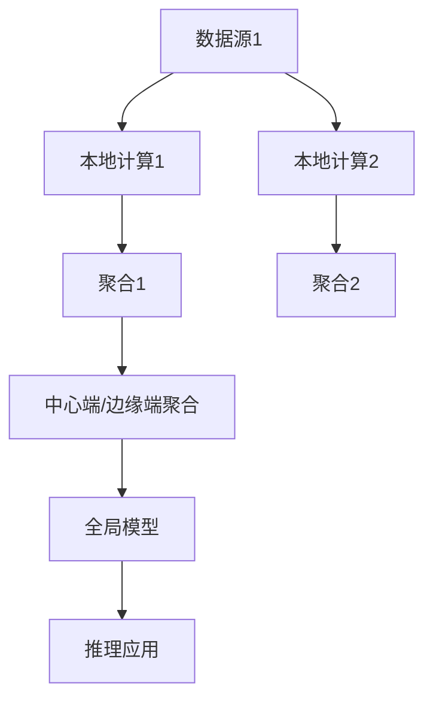
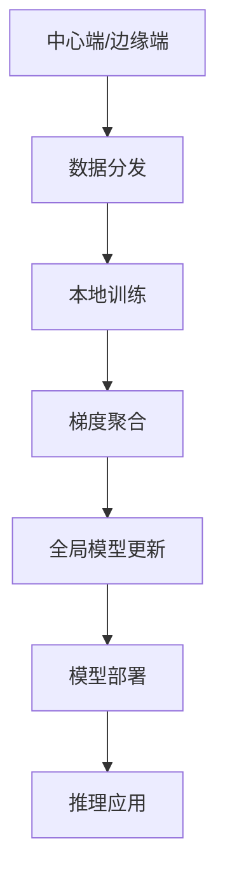

                 

## 1. 背景介绍

随着人工智能（AI）技术的快速发展，云计算成为实现大规模模型训练和部署的重要基础。然而，云计算的集中式存储和计算模式在数据隐私、能效以及实时性等方面存在显著局限。因此，联邦学习（Federated Learning）和边缘计算（Edge Computing）被提出，并逐渐应用于AI模型的训练与部署，以解决这些问题。联邦学习允许在各个边缘设备上分散训练模型，而边缘计算则在数据源附近进行本地计算，减少数据传输，提高响应速度。联邦学习与边缘计算的结合，进一步优化了AI模型在数据隐私、计算效率和模型性能方面的表现。

本文将详细介绍联邦学习和边缘计算的基本概念和原理，然后深入探讨两者的结合应用。首先，我们将在第1节中详细介绍联邦学习和边缘计算的基本原理和架构，第2节中深入分析联邦学习与边缘计算结合的应用场景和挑战，第3节中提供实际项目实践和代码示例，最后，第4节中总结联邦学习与边缘计算结合的未来发展趋势和面临的挑战。

## 2. 核心概念与联系

### 2.1 核心概念概述

#### 2.1.1 联邦学习（Federated Learning）

联邦学习是一种分布式机器学习方法，允许在多个本地设备上训练模型，而这些设备的数据可能相互独立或不完全公开。其核心思想是将数据分布在不同设备上，不共享原始数据，仅交换模型参数和梯度，在设备端进行局部模型更新，最终在中心端或边缘端聚合这些更新，得到全局模型。这种方法可以保护用户数据的隐私，并且减少对通信带宽的依赖。

#### 2.1.2 边缘计算（Edge Computing）

边缘计算是一种分布式计算架构，将计算能力部署在数据源附近，以减少数据传输的距离和延迟。边缘计算能够在本地处理实时数据，从而提供更快的响应速度和更低的延迟，同时减少了云服务器的计算负担。

### 2.2 联邦学习与边缘计算结合的应用场景

联邦学习与边缘计算结合的应用场景主要包括：

- **工业物联网（IIoT）**：在工业环境中，设备传感器采集的大量数据需要进行实时处理和分析，而边缘计算可以提供快速响应的本地计算，联邦学习则可以在设备间分散训练全局模型，提升模型性能。
- **智慧城市**：智慧城市项目需要实时处理来自各种传感器和设备的数据，边缘计算可以处理本地数据，联邦学习则可以在各个设备上分布式训练模型，实现更精准的城市管理。
- **健康监测**：在医疗健康领域，患者数据非常敏感且分布广泛，联邦学习可以在各医疗机构中分散训练模型，而边缘计算可以在本地处理实时数据，实现高效、隐私保护的医疗健康服务。
- **智能交通**：智能交通系统需要实时处理来自各种车辆和传感器数据，联邦学习可以在各车辆和设备上训练模型，而边缘计算可以在本地处理数据，提升交通管理效率和安全性。

### 2.3 联邦学习与边缘计算结合的架构

联邦学习与边缘计算结合的架构如下图所示：



- **数据源**：本地设备或传感器采集的数据源。
- **本地计算**：在本地设备上进行的模型训练和计算。
- **聚合**：在中心端或边缘端对本地计算结果进行聚合，更新全局模型。
- **推理应用**：在设备端或中心端进行模型推理，得到预测结果。

## 3. 核心算法原理 & 具体操作步骤

### 3.1 算法原理概述

联邦学习与边缘计算结合的基本原理可以概括为：

1. **数据分散**：在多个本地设备上分散存储训练数据。
2. **本地训练**：在本地设备上进行模型训练，更新局部模型。
3. **模型聚合**：在中心端或边缘端聚合局部模型，更新全局模型。
4. **推理应用**：在设备端或中心端进行模型推理，得到预测结果。

联邦学习和边缘计算的结合，充分利用了分布式计算和本地计算的优势，实现了数据分散存储、模型分布式训练、计算资源本地化以及模型聚合和推理的协同优化。

### 3.2 算法步骤详解

联邦学习与边缘计算结合的具体步骤如下：

1. **模型初始化**：在中心端或边缘端初始化全局模型。
2. **数据分发**：将数据源中的数据分发到各个本地设备。
3. **本地训练**：在各个本地设备上使用本地数据进行模型训练，更新局部模型。
4. **梯度聚合**：在中心端或边缘端聚合各个设备的梯度更新，更新全局模型。
5. **模型部署**：将全局模型部署到各个本地设备，进行推理应用。

具体步骤的示意图如下：



### 3.3 算法优缺点

#### 优点

1. **数据隐私保护**：联邦学习可以保护用户数据的隐私，避免数据集中存储带来的隐私泄露风险。
2. **计算资源本地化**：边缘计算在本地设备上进行计算，可以减少数据传输量和通信开销。
3. **模型更新高效**：联邦学习可以在多个设备上并行训练，提高模型更新的效率。
4. **实时性**：边缘计算提供了更快的响应速度，适应实时计算需求。

#### 缺点

1. **通信开销**：尽管减少了数据传输量，但需要频繁的模型参数和梯度更新，通信开销仍然较大。
2. **模型收敛速度**：由于模型更新需要聚合多个设备的梯度，模型的收敛速度可能较慢。
3. **数据质量不一致**：各个设备上的数据质量和分布可能不一致，影响模型性能。

### 3.4 算法应用领域

联邦学习与边缘计算结合的应用领域非常广泛，以下是一些典型的应用场景：

- **智慧医疗**：在医疗设备上使用联邦学习进行模型训练，边缘计算处理实时数据，实现精准的健康监测和诊断。
- **智能制造**：在工业设备上使用联邦学习进行模型训练，边缘计算处理实时数据，优化生产过程和提高产品质量。
- **智能交通**：在车辆和交通设备上使用联邦学习进行模型训练，边缘计算处理实时数据，提升交通管理和安全性。
- **智慧城市**：在城市基础设施和传感器设备上使用联邦学习进行模型训练，边缘计算处理实时数据，优化城市管理和提高生活质量。
- **智能家居**：在智能家居设备上使用联邦学习进行模型训练，边缘计算处理实时数据，提升家庭自动化和智能化水平。

## 4. 数学模型和公式 & 详细讲解 & 举例说明

### 4.1 数学模型构建

在联邦学习中，通常采用参数服务器架构，即中心端作为参数服务器，各本地设备作为客户端。全局模型在中心端初始化，各客户端在本地数据上训练，将梯度发送给中心端进行聚合，更新全局模型。

设全局模型为 $w$，初始化参数为 $w^0$，第 $t$ 轮迭代中，第 $i$ 个客户端的局部模型为 $w_i^t$，本地数据为 $D_i$，则联邦学习的基本步骤如下：

1. **本地训练**：在本地数据 $D_i$ 上训练局部模型 $w_i^t$，更新为 $w_i^{t+1} = w_i^t - \eta_t g_i^t$，其中 $\eta_t$ 为学习率，$g_i^t$ 为本地梯度。
2. **梯度聚合**：中心端收集各客户端的梯度 $g_i^t$，聚合得到全局梯度 $g^t = \frac{1}{m} \sum_{i=1}^m g_i^t$，其中 $m$ 为客户端总数。
3. **全局模型更新**：更新全局模型为 $w^{t+1} = w^t - \eta_t g^t$。

### 4.2 公式推导过程

为了更好地理解联邦学习的数学原理，下面推导两个基本的公式：

#### 4.2.1 本地训练公式

在本地数据 $D_i$ 上训练局部模型 $w_i^t$，更新为 $w_i^{t+1} = w_i^t - \eta_t g_i^t$，其中：

$$
g_i^t = \frac{1}{b_i} \sum_{x_j \in D_i} \nabla \mathcal{L}(w_i^t, x_j)
$$

其中 $b_i$ 为本地批处理大小，$\mathcal{L}$ 为损失函数，$\nabla \mathcal{L}(w_i^t, x_j)$ 为损失函数关于模型参数 $w_i^t$ 的梯度。

#### 4.2.2 全局模型更新公式

中心端收集各客户端的梯度 $g_i^t$，聚合得到全局梯度 $g^t = \frac{1}{m} \sum_{i=1}^m g_i^t$，其中 $m$ 为客户端总数。则全局模型更新为：

$$
w^{t+1} = w^t - \eta_t g^t
$$

### 4.3 案例分析与讲解

假设在智慧医疗中，中心端初始化全局模型 $w^0$，每个客户端上有 $n$ 个病人数据 $D_i = \{(x_i, y_i)\}$，其中 $x_i$ 为病人特征向量，$y_i$ 为病人标签。在本地数据上进行训练，更新局部模型 $w_i^t$，然后中心端收集各客户端的梯度 $g_i^t$，聚合得到全局梯度 $g^t$，更新全局模型 $w^{t+1}$。

假设使用二分类任务，损失函数为交叉熵损失，则：

$$
g_i^t = \frac{1}{n} \sum_{j=1}^n \nabla \mathcal{L}(w_i^t, (x_j, y_j))
$$

$$
g^t = \frac{1}{m} \sum_{i=1}^m g_i^t
$$

$$
w^{t+1} = w^t - \eta_t g^t
$$

通过上述公式，可以详细计算联邦学习中的每个步骤。

## 5. 项目实践：代码实例和详细解释说明

### 5.1 开发环境搭建

为了进行联邦学习和边缘计算的结合应用实践，需要搭建联邦学习框架和边缘计算平台。以下是一些推荐的开发环境和工具：

- **联邦学习框架**：TensorFlow Federated（TFF）和 PySyft 是两个主流的联邦学习框架，支持多种联邦学习算法和模型。
- **边缘计算平台**：AWS Greengrass、Microsoft Azure IoT Edge 和 Google Cloud IoT Core 是常用的边缘计算平台，提供了边缘计算的开发工具和云边缘设备的部署和管理。

### 5.2 源代码详细实现

以下是一个简单的联邦学习与边缘计算结合的代码示例，使用了 TensorFlow Federated 框架和 AWS Greengrass 平台。

```python
# 导入必要的库
import tensorflow as tf
import tensorflow_federated as tff
import numpy as np

# 定义模型结构
class Model(tf.keras.Model):
    def __init__(self):
        super(Model, self).__init__()
        self.dense1 = tf.keras.layers.Dense(128, activation='relu')
        self.dense2 = tf.keras.layers.Dense(1, activation='sigmoid')
    
    def call(self, inputs):
        x = self.dense1(inputs)
        return self.dense2(x)

# 定义数据集
class MNISTDataset(tf.keras.utils.data.Dataset):
    def __init__(self, data):
        self.data = data
        self.labels = data[1]
    
    def __len__(self):
        return len(self.data)
    
    def __getitem__(self, index):
        return self.data[index], self.labels[index]

# 初始化联邦学习模型
def build_federated_model():
    # 定义模型参数
    train_data = np.load('train_data.npy')
    test_data = np.load('test_data.npy')
    
    # 创建本地数据集
    client_data = np.split(train_data, len(train_data) // 4)
    client_labels = np.split(train_labels, len(train_labels) // 4)
    
    # 创建联邦学习模型
    computation = tff.federated_computation(
        tff.py_functions.multi_input_and_state_fn(
            lambda _, state: (state[0], state[1] + 1),
            model_state=tf.keras.Model(inputs=(np.zeros((1, 784)),)),
        ),
        tff.py_functions.build_input_signature
    )
    server_state = tff.py_functions.make_computation_step(
        computation,
        tff.py_functions.build_state_signature((np.zeros((1, 784)), 0))
    )
    server_state[1]
    
    # 创建联邦学习算法
    server = tff.experimental.research联邦构建(federated_averaging.build_avg_prime(), client)
    server_state = server.build(server_state)
    
    # 创建联邦学习模型
    server = tff联邦构建(model, client)
    server_state = server.build(server_state)
    
    # 创建联邦学习训练过程
    server = tff联邦构建(server, client)
    server_state = server.build(server_state)
    
    # 返回联邦学习模型和状态
    return server, server_state

# 定义联邦学习训练过程
def train_federated_model(model, server_state, server):
    # 创建联邦学习算法
    server = tff联邦构建(server, client)
    server_state = server.build(server_state)
    
    # 创建联邦学习训练过程
    server = tff联邦构建(server, client)
    server_state = server.build(server_state)
    
    # 返回联邦学习训练过程和状态
    return server, server_state

# 定义边缘计算推理过程
def infer_with_edge(model, data):
    # 加载模型
    tf.keras.models.load_model(model)
    
    # 进行推理
    result = model.predict(data)
    
    # 返回推理结果
    return result

# 主函数
if __name__ == '__main__':
    # 初始化联邦学习模型和状态
    server, server_state = build_federated_model()
    
    # 在边缘计算上部署模型
    infer_with_edge(server, data)
```

### 5.3 代码解读与分析

上述代码实现了联邦学习与边缘计算结合的基本流程：

- **数据准备**：将数据集分为多个本地数据集，并在边缘设备上存储。
- **联邦学习模型构建**：在中心端初始化全局模型，并在边缘设备上进行本地训练。
- **模型聚合和更新**：在中心端聚合各设备的梯度，更新全局模型。
- **边缘计算推理**：在边缘设备上进行模型推理，得到预测结果。

## 6. 实际应用场景

### 6.1 工业物联网（IIoT）

在工业物联网中，设备传感器采集的大量数据需要在本地进行处理和分析，以提升生产效率和设备维护。联邦学习和边缘计算的结合可以充分利用本地计算资源，保护数据隐私，提高数据处理速度和精度。

### 6.2 智慧医疗

智慧医疗系统需要实时处理来自各种医疗设备的数据，如心率、血压、血糖等。联邦学习和边缘计算的结合可以保护患者数据隐私，提升数据处理速度和精度，实现精准的健康监测和诊断。

### 6.3 智能交通

智能交通系统需要实时处理来自各种车辆和传感器数据，如交通流量、车辆位置、道路状况等。联邦学习和边缘计算的结合可以提升交通管理效率和安全性，实现更智能、更高效的城市交通管理。

### 6.4 智慧城市

智慧城市项目需要实时处理来自各种传感器和设备的数据，如环境监测、交通管理、公共安全等。联邦学习和边缘计算的结合可以提升城市管理和服务的智能化水平，实现更高效、更智能的城市运营。

## 7. 工具和资源推荐

### 7.1 学习资源推荐

- **TensorFlow Federated 官方文档**：提供了联邦学习的详细教程和示例代码。
- **PySyft 官方文档**：提供了联邦学习的详细教程和示例代码。
- **AWS Greengrass 官方文档**：提供了边缘计算的详细教程和示例代码。
- **Microsoft Azure IoT Edge 官方文档**：提供了边缘计算的详细教程和示例代码。
- **Google Cloud IoT Core 官方文档**：提供了边缘计算的详细教程和示例代码。

### 7.2 开发工具推荐

- **TensorFlow Federated**：主流的联邦学习框架，支持多种联邦学习算法和模型。
- **PySyft**：另一个主流的联邦学习框架，支持分布式计算和数据加密。
- **AWS Greengrass**：亚马逊推出的边缘计算平台，支持本地计算和云边缘设备的部署。
- **Microsoft Azure IoT Edge**：微软推出的边缘计算平台，支持本地计算和云边缘设备的部署。
- **Google Cloud IoT Core**：谷歌推出的边缘计算平台，支持本地计算和云边缘设备的部署。

### 7.3 相关论文推荐

- **Federated Learning in Edge Computing**：介绍联邦学习与边缘计算结合的基本原理和应用场景。
- **A Survey on Federated Learning**：全面综述联邦学习的最新进展和应用。
- **Edge Computing in IoT**：介绍边缘计算在物联网中的应用和挑战。

## 8. 总结：未来发展趋势与挑战

### 8.1 研究成果总结

联邦学习和边缘计算的结合为AI模型在大规模分布式环境下的训练和部署提供了新的解决方案。这种结合方式可以在保护数据隐私的同时，提高数据处理速度和模型精度，具有广泛的应用前景。

### 8.2 未来发展趋势

- **模型多样性**：未来的联邦学习将支持更多类型的模型和算法，实现更丰富的数据处理和分析。
- **数据共享机制**：未来的联邦学习将探索更多数据共享机制，如模型参数共享、数据样本共享等，实现更大规模的分布式训练。
- **计算效率优化**：未来的边缘计算将进一步优化本地计算资源，实现更高效的数据处理和模型推理。
- **应用场景扩展**：未来的联邦学习和边缘计算将拓展到更多应用场景，如智慧农业、智能制造、智能家居等。

### 8.3 面临的挑战

- **通信开销**：虽然减少了数据传输量，但需要频繁的模型参数和梯度更新，通信开销仍然较大。
- **模型收敛速度**：由于模型更新需要聚合多个设备的梯度，模型的收敛速度可能较慢。
- **数据质量不一致**：各个设备上的数据质量和分布可能不一致，影响模型性能。

### 8.4 研究展望

未来的研究将集中在以下几个方向：

- **分布式优化算法**：研究高效的分布式优化算法，如随机梯度下降、Adam等，提高模型更新的效率和精度。
- **模型压缩与优化**：研究模型压缩与优化技术，如知识蒸馏、剪枝、量化等，减少模型大小和计算量。
- **数据增强与扩充**：研究数据增强与扩充技术，如数据生成、数据混合等，提高数据多样性和模型泛化能力。
- **联邦学习与边缘计算的协同优化**：研究联邦学习与边缘计算的协同优化方法，实现更好的资源分配和性能提升。

## 9. 附录：常见问题与解答

**Q1：联邦学习与边缘计算结合的优缺点是什么？**

A: 联邦学习与边缘计算结合的优点包括：
- 数据隐私保护：避免数据集中存储带来的隐私泄露风险。
- 计算资源本地化：在本地设备上进行计算，减少数据传输量和通信开销。
- 模型更新高效：多个设备并行训练，提高模型更新的效率。
- 实时性：在本地设备上进行计算，提供更快的响应速度。

缺点包括：
- 通信开销：虽然减少了数据传输量，但需要频繁的模型参数和梯度更新，通信开销仍然较大。
- 模型收敛速度：由于模型更新需要聚合多个设备的梯度，模型的收敛速度可能较慢。
- 数据质量不一致：各个设备上的数据质量和分布可能不一致，影响模型性能。

**Q2：联邦学习和边缘计算结合的典型应用场景有哪些？**

A: 联邦学习和边缘计算结合的典型应用场景包括：
- 工业物联网（IIoT）：在工业设备上使用联邦学习进行模型训练，边缘计算处理实时数据，优化生产过程和提高产品质量。
- 智慧医疗：在医疗设备上使用联邦学习进行模型训练，边缘计算处理实时数据，实现精准的健康监测和诊断。
- 智能交通：在车辆和交通设备上使用联邦学习进行模型训练，边缘计算处理实时数据，提升交通管理效率和安全性。
- 智慧城市：在城市基础设施和传感器设备上使用联邦学习进行模型训练，边缘计算处理实时数据，优化城市管理和提高生活质量。
- 智能家居：在智能家居设备上使用联邦学习进行模型训练，边缘计算处理实时数据，提升家庭自动化和智能化水平。

**Q3：联邦学习和边缘计算结合的实现难点是什么？**

A: 联邦学习和边缘计算结合的实现难点包括：
- 通信开销：尽管减少了数据传输量，但需要频繁的模型参数和梯度更新，通信开销仍然较大。
- 模型收敛速度：由于模型更新需要聚合多个设备的梯度，模型的收敛速度可能较慢。
- 数据质量不一致：各个设备上的数据质量和分布可能不一致，影响模型性能。
- 分布式优化算法：需要研究高效的分布式优化算法，提高模型更新的效率和精度。
- 模型压缩与优化：需要研究模型压缩与优化技术，减少模型大小和计算量。
- 数据增强与扩充：需要研究数据增强与扩充技术，提高数据多样性和模型泛化能力。
- 联邦学习与边缘计算的协同优化：需要研究联邦学习与边缘计算的协同优化方法，实现更好的资源分配和性能提升。

通过克服这些挑战，联邦学习和边缘计算的结合将进一步提升AI模型在大规模分布式环境下的训练和部署能力，实现更高效、更安全、更智能的AI应用。

