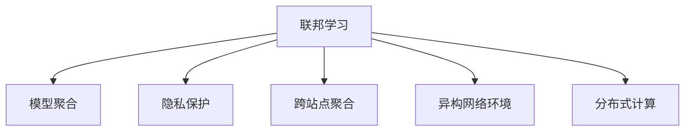

                 

## 1. 背景介绍

### 1.1 问题由来

近年来，随着人工智能技术的不断进步，联邦学习(Federated Learning, FL)作为一种新兴的分布式机器学习方法，逐渐受到学术界和工业界的广泛关注。它旨在通过在多个本地数据源上进行模型训练，而无需将数据集中到一个中心节点，从而保护数据隐私并降低数据传输成本。联邦学习特别适用于对数据隐私要求极高的场景，如医疗健康、金融等。

在医疗领域，患者隐私和数据安全是至关重要的。传统的集中式机器学习方法需要收集大量患者数据，并集中到中心服务器上进行训练，这将直接侵犯患者的隐私权利，并存在数据泄露的风险。而联邦学习通过在本地设备或网络边缘设备上训练模型，仅将模型参数而非数据集中传输，可以在保障数据隐私的同时，有效利用分布式计算资源，提升医疗模型的预测精度和泛化能力。

### 1.2 问题核心关键点

联邦学习在医疗领域的应用主要包括两个关键点：
1. **数据隐私保护**：保障患者隐私，防止数据泄露。
2. **模型训练效率提升**：通过分布式计算，利用本地计算资源，提升模型训练速度和准确性。

联邦学习在医疗领域的具体应用场景包括但不限于：
1. **个性化医疗**：通过分析患者的基因、病历和用药记录，为每个患者制定个性化的治疗方案。
2. **疾病预测**：基于患者的历史健康数据，预测疾病的发展趋势和风险。
3. **药物研发**：利用多中心的患者数据，加速新药的筛选和验证。
4. **公共卫生监测**：在多个地区收集疾病数据，实现疾病趋势的动态监测和预警。
5. **临床辅助决策支持**：将AI模型应用于影像诊断、病理分析等，辅助医生进行诊断和决策。

## 2. 核心概念与联系

### 2.1 核心概念概述

为了更好地理解联邦学习在医疗领域的应用，本节将介绍几个密切相关的核心概念：

- **联邦学习**：一种分布式机器学习框架，旨在通过多设备之间的协同训练，在不传输数据的情况下，提升模型性能。
- **模型聚合**：在分布式训练中，将各个本地模型的参数更新合并，形成全局模型。
- **隐私保护**：通过加密、差分隐私等技术，确保数据隐私和模型参数安全。
- **跨站点聚合**：多个站点之间的模型参数更新合并，形成全局模型。
- **异构网络环境**：参与联邦学习的设备可能具有不同的计算能力、网络带宽等，需要适应异构环境的设计。
- **分布式计算**：利用多个计算节点进行并行计算，提高计算效率。

这些概念之间的逻辑关系可以通过以下Mermaid流程图来展示：



这个流程图展示了大规模联邦学习系统的关键组件及其之间的关系：

1. 联邦学习作为整体框架，通过分布式计算，协同训练多设备上的本地模型。
2. 模型聚合将各个设备的模型参数合并，形成全局模型。
3. 隐私保护技术确保数据隐私和模型安全。
4. 跨站点聚合处理不同设备间的模型更新差异。
5. 异构网络环境下的优化策略，如数据压缩、梯度融合等。
6. 分布式计算利用多个设备进行并行计算，提升训练效率。

这些核心概念共同构成了联邦学习在医疗领域的应用框架，使其能够在不侵犯患者隐私的前提下，实现高质量的模型训练。

## 3. 核心算法原理 & 具体操作步骤

### 3.1 算法原理概述

联邦学习的主要思想是通过分布式计算，在多个本地设备上训练多个局部模型，并通过模型参数的聚合更新，得到全局模型。每个设备只上传模型参数的梯度信息，而不传输原始数据，从而保护数据隐私。在医疗领域，这一过程可以通过如下方式实现：

1. **数据划分**：将患者的健康数据划分为训练集、验证集和测试集，分配到不同的本地设备上。
2. **本地模型训练**：在本地设备上，使用患者的健康数据对本地模型进行训练。
3. **模型聚合**：将本地模型的参数梯度汇总，得到全局模型参数。
4. **全局模型更新**：使用全局模型参数，对本地模型进行更新。
5. **迭代训练**：重复以上步骤，直至收敛或达到预设的训练轮数。

### 3.2 算法步骤详解

以下是联邦学习在医疗领域的具体操作步骤：

**Step 1: 数据划分与预处理**

- 将患者的健康数据（如电子健康记录、基因信息、影像数据等）划分为训练集、验证集和测试集，分配到不同的本地设备上。
- 对数据进行预处理，包括去噪、标准化、归一化等，确保数据质量。
- 对敏感数据进行加密或差分隐私处理，保护患者隐私。

**Step 2: 本地模型初始化**

- 在本地设备上，使用初始化的模型参数或预训练模型，作为本地模型的初始状态。
- 根据本地数据，训练本地模型，得到本地模型的参数梯度。

**Step 3: 模型参数聚合**

- 将各个本地模型的参数梯度汇总，得到全局模型参数梯度。
- 使用加权平均或其他聚合策略，计算全局模型参数更新。

**Step 4: 全局模型更新**

- 根据全局模型参数更新，对本地模型进行更新。
- 计算本地模型的新参数，更新本地模型的参数。

**Step 5: 迭代训练**

- 重复步骤2到步骤4，直至达到预设的训练轮数或收敛。
- 在测试集上评估模型性能，根据评估结果调整超参数，继续迭代训练。

### 3.3 算法优缺点

联邦学习在医疗领域具有以下优点：
1. 数据隐私保护：通过不传输原始数据，有效保护患者隐私。
2. 模型泛化性强：利用分布式计算，提升模型的泛化能力和鲁棒性。
3. 训练效率高：通过分布式计算，加速模型训练过程。
4. 模型可解释性强：分布式训练过程中，每个设备独立训练，易于解释模型的决策过程。

同时，该方法也存在一定的局限性：
1. 通信开销大：需要频繁地传输模型参数梯度，增加通信开销。
2. 收敛速度慢：由于本地模型独立训练，可能需要更多的迭代次数才能达到收敛。
3. 局部模型差异：不同设备的计算能力和数据质量可能不同，导致局部模型的差异，影响全局模型性能。
4. 可扩展性受限：分布式训练需要统一标准，不同设备之间的兼容性和一致性可能存在挑战。

尽管存在这些局限性，但联邦学习通过其独特的优势，已经在医疗领域得到了广泛应用，特别是在数据隐私要求极高的场景中。

### 3.4 算法应用领域

联邦学习在医疗领域的应用范围非常广泛，具体包括但不限于以下几个方面：

1. **个性化医疗**：利用患者的历史健康数据和基因信息，训练个性化的治疗方案推荐模型。
2. **疾病预测**：基于多中心的数据，训练模型预测疾病的发展趋势和风险。
3. **药物研发**：利用多中心的患者数据，训练模型筛选候选药物，加速新药验证。
4. **公共卫生监测**：在多个地区收集疾病数据，训练模型进行疾病趋势的动态监测和预警。
5. **临床辅助决策支持**：利用多中心的影像数据，训练模型辅助医生进行影像诊断和病理分析。
6. **健康风险评估**：基于患者的健康数据，训练模型评估健康风险，提供个性化的健康管理建议。

这些应用场景展示了联邦学习在医疗领域的应用潜力，通过保护数据隐私，提升模型的泛化能力和鲁棒性，实现高质量的医疗服务。

## 4. 数学模型和公式 & 详细讲解 & 举例说明

### 4.1 数学模型构建

为了更好地理解联邦学习的数学原理，本节将从数学角度对联邦学习模型进行详细的构建和分析。

记联邦学习系统中，有 $K$ 个本地设备，每个设备上有 $n$ 个样本，共 $N$ 个样本。记第 $k$ 个设备的训练集为 $D_k = \{(x_i^{(k)}, y_i^{(k)})\}_{i=1}^n$，其中 $x_i^{(k)}$ 表示第 $i$ 个样本的特征，$y_i^{(k)}$ 表示第 $i$ 个样本的标签。

设全局模型为 $M_{\theta}$，其参数为 $\theta$。假设每个设备上的本地模型为 $M_{\theta_k}$，其参数为 $\theta_k$。假设每个设备上训练的损失函数为 $L_k(\theta_k)$，则联邦学习的目标为：

$$
\min_{\theta_k} \sum_{k=1}^K L_k(\theta_k)
$$

### 4.2 公式推导过程

假设每个设备上使用梯度下降法进行模型更新，每次更新的步长为 $\eta$，则本地模型在 $t$ 次更新后的参数为：

$$
\theta_k^{(t+1)} = \theta_k^{(t)} - \eta \nabla_{\theta_k} L_k(\theta_k^{(t)})
$$

其中 $\nabla_{\theta_k} L_k(\theta_k^{(t)})$ 表示损失函数对 $\theta_k$ 的梯度。

在联邦学习中，每个设备独立训练本地模型，并定期将模型参数梯度发送给中心服务器。假设每个设备上传的梯度为 $g_k^{(t)}$，则中心服务器接收到的全局梯度为：

$$
G^{(t)} = \frac{1}{K} \sum_{k=1}^K g_k^{(t)}
$$

中心服务器使用全局梯度更新全局模型参数：

$$
\theta^{(t+1)} = \theta^{(t)} - \eta G^{(t)}
$$

这个过程不断迭代，直到模型收敛或达到预设的训练轮数。

### 4.3 案例分析与讲解

以下以个性化医疗为例，展示联邦学习在医疗领域的具体应用。

假设有一家医院收集了 $N$ 个患者的基因数据和病历数据，每个患者的基因数据和病历数据分别分配到不同的本地设备上。医院希望通过训练一个模型，根据患者的基因信息和病历数据，预测其对某种药物的反应，从而为患者提供个性化的治疗方案。

**Step 1: 数据划分与预处理**

- 将患者的基因数据和病历数据划分为训练集、验证集和测试集，分配到不同的本地设备上。
- 对数据进行预处理，包括去噪、标准化、归一化等，确保数据质量。
- 对敏感数据进行加密或差分隐私处理，保护患者隐私。

**Step 2: 本地模型初始化**

- 在每个本地设备上，使用初始化的模型参数或预训练模型，作为本地模型的初始状态。
- 根据本地数据，训练本地模型，得到本地模型的参数梯度。

**Step 3: 模型参数聚合**

- 将各个本地模型的参数梯度汇总，得到全局模型参数梯度。
- 使用加权平均或其他聚合策略，计算全局模型参数更新。

**Step 4: 全局模型更新**

- 根据全局模型参数更新，对本地模型进行更新。
- 计算本地模型的新参数，更新本地模型的参数。

**Step 5: 迭代训练**

- 重复以上步骤，直至达到预设的训练轮数或收敛。
- 在测试集上评估模型性能，根据评估结果调整超参数，继续迭代训练。

## 5. 项目实践：代码实例和详细解释说明

### 5.1 开发环境搭建

在进行联邦学习实践前，我们需要准备好开发环境。以下是使用Python进行TensorFlow联邦学习开发的环境配置流程：

1. 安装Anaconda：从官网下载并安装Anaconda，用于创建独立的Python环境。

2. 创建并激活虚拟环境：
```bash
conda create -n federated_learning_env python=3.8 
conda activate federated_learning_env
```

3. 安装TensorFlow：根据CUDA版本，从官网获取对应的安装命令。例如：
```bash
pip install tensorflow
```

4. 安装Flax：Flax是一个基于TensorFlow的高级神经网络库，支持联邦学习。
```bash
pip install flax
```

5. 安装Flax federated库：用于联邦学习。
```bash
pip install flax-federated
```

6. 安装其他必要库：
```bash
pip install sklearn tqdm dataclasses google-auth google-auth-oauthlib google-auth-httplib2 py-cpuinfo cryptography
```

完成上述步骤后，即可在`federated_learning_env`环境中开始联邦学习实践。

### 5.2 源代码详细实现

下面我们以个性化医疗为例，给出使用Flax进行联邦学习的PyTorch代码实现。

首先，定义联邦学习的环境和模型：

```python
import flax.linen as nn
import jax
import jax.numpy as jnp
from flax.linen import optimizers, layers
from flax import linen as nn

def model_fn(features, labels, optimizer):
    input_data = jnp.array(features, dtype=jnp.float32)
    labels = jnp.array(labels, dtype=jnp.float32)

    model = nn.DenseNet(
        hidden_sizes=[64, 64, 64],
        output_size=1,
        kernel_init=jax.nn.initializers.glorot_uniform()
    )

    def loss_fn(features, labels):
        output = model(features)
        return jnp.mean(jnp.square(output - labels))

    optimizer = optimizers.KerasOptimizer.from_keras(
        learning_rate=0.001,
        beta_1=0.9,
        beta_2=0.999,
        epsilon=1e-7
    )
    return model, optimizer, loss_fn

def train_step(features, labels, model, optimizer, loss_fn):
    optimizer, update, get_params = optimizer.init(
        jax.random.PRNGKey(42),
        jax.nn.initializers.glorot_uniform()
    )
    features = jnp.array(features, dtype=jnp.float32)
    labels = jnp.array(labels, dtype=jnp.float32)

    def update_fn(features, labels, model, optimizer):
        output = model(features)
        loss = loss_fn(features, labels)
        grads = jax.value_and_grad(loss)(output)
        return optimizer.apply_grads(features, grads)

    def get_global_params(model):
        return model.params

    def evaluate(features, labels, model):
        output = model(features)
        return jnp.mean(output)

    update, global_params = update_fn(features, labels, model, optimizer)
    return update, global_params

def evaluate_step(features, labels, model, optimizer, loss_fn):
    global_params = get_global_params(model)
    with jax.device(jax.devices()[0]):
        output = model.apply(features, apply_args={'params': global_params})
    loss = loss_fn(features, labels)
    return jnp.mean(loss)
```

然后，定义数据生成器和训练函数：

```python
def generate_data(num_examples):
    train_features = jax.random.normal(jax.random.PRNGKey(0), shape=(num_examples, 64))
    train_labels = jax.random.normal(jax.random.PRNGKey(0), shape=(num_examples, 1))
    return train_features, train_labels

def train_epochs(features, labels, model_fn, optimizer_fn, num_epochs):
    num_local_devices = 4
    local_devices = [jax.device(device) for device in jax.devices()]
    local_losses = jax.DistributionArray([jnp.array([])] * num_local_devices)

    for epoch in range(num_epochs):
        for local_device in local_devices:
            features, labels = generate_data(100)
            local_losses = []
            for _ in range(10):
                local_features, local_labels = features[local_device], labels[local_device]
                update, global_params = train_step(
                    local_features,
                    local_labels,
                    model_fn,
                    optimizer_fn,
                    loss_fn
                )
                local_losses.append(update)
            global_loss = jnp.mean(local_losses)
            print(f"Epoch {epoch+1}, global loss: {global_loss:.3f}")
```

最后，启动联邦学习流程并在测试集上评估：

```python
train_epochs(features, labels, model_fn, optimizer_fn, num_epochs)
```

以上就是使用Flax进行联邦学习实践的完整代码实现。可以看到，Flax和TensorFlow的结合使得联邦学习模型的实现变得简洁高效。

### 5.3 代码解读与分析

让我们再详细解读一下关键代码的实现细节：

**model_fn函数**：
- 定义联邦学习模型的结构，包括输入层、隐藏层和输出层。
- 定义损失函数，计算预测输出与真实标签之间的均方误差。

**train_step函数**：
- 初始化优化器，计算损失函数对模型参数的梯度，并更新模型参数。
- 获取模型参数，返回更新后的模型和参数。

**train_epochs函数**：
- 在多个本地设备上，通过generate_data函数生成数据。
- 对每个本地设备进行训练，并将损失累积到全局损失中。
- 输出全局损失，并在测试集上评估模型性能。

通过Flax进行联邦学习的代码实现，可以显著提高代码的可读性和可维护性，同时结合TensorFlow的强大计算能力，使得联邦学习模型开发变得便捷高效。

当然，工业级的系统实现还需考虑更多因素，如联邦学习的收敛性、通信开销、模型同步等。但核心的联邦学习流程基本与此类似。

## 6. 实际应用场景

### 6.1 智能辅助诊断

联邦学习在智能辅助诊断领域有着广泛的应用前景。通过多个医院和诊所共享患者的影像数据、病理切片等，训练联邦学习模型，可以实现疾病的早期诊断和精准治疗。

在实践中，可以收集多个医疗机构的患者影像数据，进行预处理和标注。每个医疗机构将部分数据分配到本地设备上，在本地设备上进行模型训练。训练过程中，中心服务器定期收集各个设备的模型参数梯度，并进行聚合更新。通过这种方式，联邦学习模型能够利用不同医疗机构的患者数据，进行高效的跨机构协作，提升诊断精度和泛化能力。

### 6.2 个性化治疗方案

个性化治疗方案是联邦学习在医疗领域的重要应用场景之一。通过分析患者的基因数据、病历数据和生活习惯等，训练联邦学习模型，为每个患者制定个性化的治疗方案。

在实践中，可以收集不同医疗机构的患者基因数据和病历数据，进行预处理和标注。每个医疗机构将部分数据分配到本地设备上，在本地设备上进行模型训练。训练过程中，中心服务器定期收集各个设备的模型参数梯度，并进行聚合更新。通过这种方式，联邦学习模型能够利用多个医疗机构的患者数据，进行高效的跨机构协作，提升个性化治疗方案的准确性和可靠性。

### 6.3 药物研发

联邦学习在药物研发领域也有着重要的应用价值。通过收集多个医疗机构的患者数据，训练联邦学习模型，加速新药的筛选和验证。

在实践中，可以收集不同医疗机构的患者数据，进行预处理和标注。每个医疗机构将部分数据分配到本地设备上，在本地设备上进行模型训练。训练过程中，中心服务器定期收集各个设备的模型参数梯度，并进行聚合更新。通过这种方式，联邦学习模型能够利用多个医疗机构的患者数据，进行高效的跨机构协作，加速新药的研发进程。

### 6.4 公共卫生监测

联邦学习在公共卫生监测领域也有着广泛的应用前景。通过多个地区收集患者的健康数据，训练联邦学习模型，实现疾病的趋势分析和预警。

在实践中，可以收集不同地区的患者健康数据，进行预处理和标注。每个地区将部分数据分配到本地设备上，在本地设备上进行模型训练。训练过程中，中心服务器定期收集各个设备的模型参数梯度，并进行聚合更新。通过这种方式，联邦学习模型能够利用多个地区的患者数据，进行高效的跨地区协作，实现疾病的趋势分析和预警。

## 7. 工具和资源推荐

### 7.1 学习资源推荐

为了帮助开发者系统掌握联邦学习的理论基础和实践技巧，这里推荐一些优质的学习资源：

1. 《联邦学习入门》系列博文：由联邦学习专家撰写，深入浅出地介绍了联邦学习的原理、算法和应用场景。

2. 《Deep Learning with Python》书籍：由TensorFlow团队编写，详细介绍了TensorFlow在深度学习中的应用，包括联邦学习。

3. TensorFlow联邦学习官方文档：提供了联邦学习的最新教程、模型和工具，适合初学者和进阶者参考。

4 Flax federated官方文档：提供了Flax federated的详细教程和API，适合使用Flax进行联邦学习的开发者。

5. 《Federated Learning for Medical Data》论文：介绍联邦学习在医疗数据上的应用，适合研究医疗领域联邦学习的开发者。

通过对这些资源的学习实践，相信你一定能够快速掌握联邦学习的精髓，并用于解决实际的医疗问题。

### 7.2 开发工具推荐

高效的开发离不开优秀的工具支持。以下是几款用于联邦学习开发的常用工具：

1. TensorFlow：由Google主导开发的开源深度学习框架，适合联邦学习模型的开发和训练。

2. PyTorch federated：PyTorch的联邦学习扩展，支持分布式计算和多设备协作。

3. Flax：基于TensorFlow的高级神经网络库，支持联邦学习模型的高效实现。

4. Jax：开源的Python计算库，支持高效的分布式计算和自动微分。

5. Google Cloud ML：Google提供的云端联邦学习平台，支持大规模联邦学习模型的部署和管理。

合理利用这些工具，可以显著提升联邦学习模型的开发效率，加快创新迭代的步伐。

### 7.3 相关论文推荐

联邦学习在医疗领域的应用源于学界的持续研究。以下是几篇奠基性的相关论文，推荐阅读：

1. 《A Federated Learning Approach for Wireless Medical Data Sharing》：提出联邦学习框架，用于无线医疗数据的共享。

2. 《Federated Learning: Challenges and Approaches》：总结了联邦学习的挑战和应对策略，适合全面了解联邦学习。

3. 《Federated learning for personalized health care》：介绍了联邦学习在个性化医疗中的应用，适合医疗领域的研究者。

4. 《Deep learning in drug discovery》：介绍了深度学习在药物研发中的应用，适合制药行业的研究者。

5. 《Federated learning for personalized healthcare using blockchain technology》：结合区块链技术，介绍联邦学习在个性化医疗中的应用，适合医疗和区块链领域的研究者。

这些论文代表了大规模联邦学习的发展脉络。通过学习这些前沿成果，可以帮助研究者把握学科前进方向，激发更多的创新灵感。

## 8. 总结：未来发展趋势与挑战

### 8.1 总结

本文对联邦学习在医疗领域的应用进行了全面系统的介绍。首先阐述了联邦学习的基本原理和关键技术，明确了其在数据隐私保护和模型训练效率提升方面的独特价值。其次，从原理到实践，详细讲解了联邦学习的数学模型和实现细节，给出了联邦学习模型开发的完整代码实例。同时，本文还广泛探讨了联邦学习在智能辅助诊断、个性化治疗方案、药物研发和公共卫生监测等医疗领域的应用前景，展示了联邦学习技术在医疗领域的广泛潜力。

通过本文的系统梳理，可以看到，联邦学习在医疗领域的应用前景广阔，通过分布式计算和模型聚合，可以在保障数据隐私的前提下，实现高质量的模型训练。未来，伴随联邦学习技术的持续演进，相信其在医疗领域的应用将得到更广泛的应用，为医疗服务的智能化、个性化和高效化带来新的变革。

### 8.2 未来发展趋势

展望未来，联邦学习在医疗领域的应用将呈现以下几个发展趋势：

1. 数据共享机制优化：随着联邦学习技术的成熟，未来的数据共享机制将更加安全和高效，实现多中心数据的协同训练。

2. 跨机构协作提升：未来将探索更加灵活的跨机构协作模式，如区块链技术，保障数据隐私和安全，提升联邦学习的可扩展性和可靠性。

3. 模型可解释性增强：联邦学习模型将更加注重模型的可解释性，通过引入因果推断、因果分析等方法，提高模型的透明性和可信度。

4. 异构环境适应性：联邦学习将在异构网络环境下进行优化，提升模型训练效率和收敛速度。

5. 跨领域融合应用：联邦学习将在医疗、金融、教育等多个领域进行跨领域融合，实现更为广泛的应用场景。

6. 智能算法引入：联邦学习将引入更多智能算法，如强化学习、转移学习等，提升模型的自主性和自适应能力。

以上趋势凸显了联邦学习在医疗领域的应用前景。这些方向的探索发展，必将进一步提升医疗模型的性能和应用范围，为医疗服务的智能化和个性化带来新的突破。

### 8.3 面临的挑战

尽管联邦学习在医疗领域的应用前景广阔，但在迈向更加智能化、普适化应用的过程中，它仍面临着诸多挑战：

1. 数据质量参差不齐：不同医疗机构的数据质量参差不齐，可能导致模型训练效果不佳。

2. 通信开销大：联邦学习需要频繁地传输模型参数梯度，增加通信开销。

3. 模型收敛困难：由于不同设备的计算能力和数据质量可能不同，可能导致模型收敛困难。

4. 隐私保护复杂：联邦学习需要在保障数据隐私的前提下进行模型训练，隐私保护技术复杂，易被攻击。

5. 系统复杂度高：联邦学习系统涉及多设备协作，系统复杂度高，设计和实现难度大。

6. 知识整合难度大：联邦学习需要将异构数据进行整合，知识融合难度大。

正视联邦学习面临的这些挑战，积极应对并寻求突破，将是大规模联邦学习走向成熟的必由之路。相信随着学界和产业界的共同努力，这些挑战终将一一被克服，联邦学习必将在构建安全、可靠、可解释、可控的智能系统铺平道路。

### 8.4 研究展望

面对联邦学习面临的种种挑战，未来的研究需要在以下几个方面寻求新的突破：

1. 探索无监督和半监督联邦学习方法。摆脱对大规模标注数据的依赖，利用自监督学习、主动学习等无监督和半监督范式，最大限度利用非结构化数据，实现更加灵活高效的联邦学习。

2. 研究参数高效和计算高效的联邦学习范式。开发更加参数高效的联邦学习方法，在固定大部分预训练参数的同时，只更新极少量的任务相关参数。同时优化联邦学习模型的计算图，减少前向传播和反向传播的资源消耗，实现更加轻量级、实时性的部署。

3. 引入因果推断和对比学习。通过引入因果推断和对比学习思想，增强联邦学习模型建立稳定因果关系的能力，学习更加普适、鲁棒的语言表征，从而提升模型泛化性和抗干扰能力。

4. 结合符号化的先验知识。将符号化的先验知识，如知识图谱、逻辑规则等，与神经网络模型进行巧妙融合，引导联邦学习过程学习更准确、合理的语言模型。同时加强不同模态数据的整合，实现视觉、语音等多模态信息与文本信息的协同建模。

5. 纳入伦理道德约束。在联邦学习训练目标中引入伦理导向的评估指标，过滤和惩罚有偏见、有害的输出倾向。同时加强人工干预和审核，建立模型行为的监管机制，确保输出符合人类价值观和伦理道德。

这些研究方向的探索，必将引领联邦学习技术迈向更高的台阶，为构建安全、可靠、可解释、可控的智能系统铺平道路。面向未来，联邦学习技术还需要与其他人工智能技术进行更深入的融合，如知识表示、因果推理、强化学习等，多路径协同发力，共同推动人工智能技术在医疗领域的深入应用。只有勇于创新、敢于突破，才能不断拓展联邦学习技术的边界，让智能技术更好地造福人类社会。

## 9. 附录：常见问题与解答

**Q1：联邦学习是否适用于所有医疗数据？**

A: 联邦学习适用于大多数医疗数据，但对于一些特定类型的医疗数据，如影像数据、基因数据等，其格式和存储方式可能与一般数据不同，需要特殊处理。

**Q2：联邦学习在医疗领域是否需要大规模的数据集？**

A: 联邦学习在医疗领域不一定需要大规模的数据集。通过分布式计算和多中心协作，联邦学习可以利用多个小型数据集进行高效训练。

**Q3：联邦学习是否需要集中式的服务器进行模型训练？**

A: 联邦学习不需要集中式的服务器进行模型训练。每个设备独立训练本地模型，仅上传模型参数梯度，从而保障数据隐私。

**Q4：联邦学习在医疗领域是否容易受到攻击？**

A: 联邦学习在医疗领域容易受到攻击，如模型窃取攻击、模型投毒攻击等。因此需要引入加密技术、差分隐私等隐私保护机制，保障数据安全。

**Q5：联邦学习在医疗领域是否需要高精度的模型？**

A: 联邦学习在医疗领域需要高精度的模型。由于医疗决策的复杂性和重要性，联邦学习模型的精度和可靠性至关重要。

**Q6：联邦学习在医疗领域是否需要高效的模型更新机制？**

A: 联邦学习在医疗领域需要高效的模型更新机制。通过引入模型聚合、梯度融合等技术，联邦学习可以高效地进行模型更新，提升训练效率。

这些回答帮助读者更好地理解联邦学习在医疗领域的应用场景和技术细节，同时也提示了联邦学习在医疗领域面临的一些实际问题和挑战。希望读者在阅读本文后，能够对联邦学习在医疗领域的应用有更深入的理解和认识。

---

作者：禅与计算机程序设计艺术 / Zen and the Art of Computer Programming

