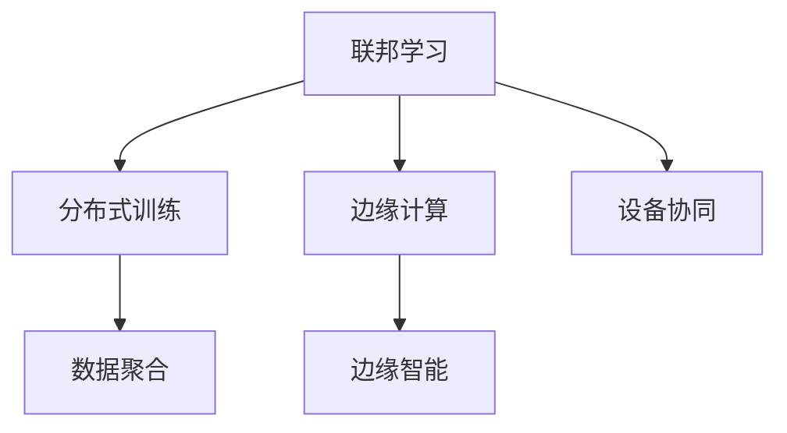

                 

# 联邦学习在物联网环境中的应用

> 关键词：
> 联邦学习, 物联网, 分布式训练, 数据隐私, 边缘计算, 资源优化, 边缘设备, 设备协同, 数据聚合, 边缘智能

## 1. 背景介绍

### 1.1 问题由来

随着物联网(IoT)技术的快速发展，各类智能设备和传感器不断涌现，构成了复杂多变的计算环境。如何在资源受限、数据分散的环境下，高效利用物联网数据，实现分布式智能决策，成为近年来研究的热点问题。

物联网设备（如智能手表、传感器、智能家居等）通常具有计算资源有限、存储空间小、数据实时性要求高等特点，难以直接进行大规模的集中式模型训练。同时，由于物联网数据敏感度高，且分布广泛，在集中式存储和传输中存在较大风险。

联邦学习(Federated Learning, FL)作为一种新兴的分布式机器学习方法，为物联网环境下的大规模数据利用和智能决策提供了新的解决方案。联邦学习使得数据可以在不离开本地设备的情况下进行分布式协同学习，有效保护数据隐私，同时提升模型性能和泛化能力。

### 1.2 问题核心关键点

联邦学习通过分布式、去中心化的方式，在多个参与设备上本地训练模型，并通过聚合各个设备上传的局部模型参数，实现全局模型的提升。其关键点包括：

1. 数据隐私保护：联邦学习在本地设备上训练模型，不将原始数据传输到中心服务器，保护用户隐私。
2. 分布式协作：多个设备共享模型更新，协同提升全局模型性能。
3. 资源优化：联邦学习可利用边缘计算能力，减轻中心服务器的计算负担，提升整体系统效率。
4. 模型泛化：通过跨设备、跨域数据的协同训练，提升模型的泛化能力和泛化性能。

## 2. 核心概念与联系

### 2.1 核心概念概述

为更好地理解联邦学习在物联网环境中的应用，本节将介绍几个密切相关的核心概念：

- 联邦学习：指在分布式设备上，通过本地训练模型并在全局聚合参数的方式，提升模型的性能和泛化能力的技术。其核心思想是本地数据不离开设备，数据聚合在云端进行。

- 物联网(IoT)：指通过嵌入式设备、传感器等手段，实现物体与互联网的连接，并自动控制、监测、交换信息的网络。

- 分布式训练：指将训练任务分解为多个子任务，在多个计算节点并行执行，最终合并结果的过程。

- 边缘计算：指将计算资源从中心云向边缘设备（如智能手机、物联网设备）转移，提升计算效率和数据实时性。

- 设备协同：指通过联邦学习机制，实现多个设备之间数据和计算资源的共享，协同提升整体性能。

- 数据聚合：指在联邦学习中，通过某种方式将多个设备的局部模型参数汇总，形成全局模型参数的过程。

- 边缘智能：指将AI推理能力部署到物联网边缘设备，以提升设备智能化水平和实时决策能力。

这些核心概念之间的逻辑关系可以通过以下Mermaid流程图来展示：



这个流程图展示了大语言模型的核心概念及其之间的关系：

1. 联邦学习通过分布式训练机制，使得数据可以在本地设备上高效利用。
2. 边缘计算通过将计算资源推向边缘设备，提升计算效率和数据实时性。
3. 设备协同通过多设备之间的数据共享和协同学习，提升整体模型性能。
4. 数据聚合通过将本地模型参数汇总到云端，实现全局模型的更新和优化。
5. 边缘智能通过将AI推理能力部署到边缘设备，实现实时智能决策。

这些概念共同构成了联邦学习在物联网环境下的应用框架，使其能够在资源受限、数据分散的环境下高效地进行分布式智能决策。

## 3. 核心算法原理 & 具体操作步骤

### 3.1 算法原理概述

联邦学习的核心算法包括两个主要步骤：本地模型训练和参数聚合。

在本地模型训练阶段，每个边缘设备使用本地数据进行模型训练，得到局部模型参数。由于各设备间的数据分布和特征不同，模型训练的任务和过程也不尽相同。

在参数聚合阶段，各设备的局部模型参数通过某种方式（如加权平均、平均、凸包等）在全局进行聚合，得到全局模型参数。这一过程通常通过客户端-服务器端方式实现，即客户端（边缘设备）向服务器（中心节点）上传局部模型参数，服务器进行全局参数更新后，再将其返回给客户端，完成一次联邦学习迭代。

### 3.2 算法步骤详解

基于联邦学习在物联网环境中的应用，其操作步骤一般包括以下几个关键步骤：

**Step 1: 数据预处理与设备选择**

- 准备数据集，并对数据进行预处理，包括数据清洗、去噪、归一化等。
- 确定参与联邦学习的设备集合，通常选择计算能力较强、数据量较多的设备。

**Step 2: 初始化全局模型**

- 在服务器端初始化全局模型参数，并发送给各边缘设备。
- 各设备在本地数据集上进行模型训练，并更新本地模型参数。

**Step 3: 参数上传与更新**

- 设备周期性地将本地模型参数上传至服务器，进行全局参数更新。
- 服务器根据设备上传的参数，计算全局模型参数。

**Step 4: 分布式模型训练**

- 服务器将全局模型参数下发给各设备，各设备继续在本地数据集上进行模型训练。
- 训练过程周期性地上传参数至服务器，并重新计算全局模型参数。

**Step 5: 模型优化与参数调整**

- 根据联邦学习的最新迭代结果，调整学习率、聚合方式等超参数，优化模型性能。
- 若模型在测试集上表现不佳，需重新调整超参数，进行下一轮联邦学习。

### 3.3 算法优缺点

联邦学习在物联网环境下的应用具有以下优点：

1. 数据隐私保护：联邦学习在本地设备上训练模型，不将原始数据传输到中心服务器，保护用户隐私。
2. 分布式协作：多个设备共享模型更新，协同提升全局模型性能。
3. 资源优化：联邦学习可利用边缘计算能力，减轻中心服务器的计算负担，提升整体系统效率。
4. 模型泛化：通过跨设备、跨域数据的协同训练，提升模型的泛化能力和泛化性能。

同时，联邦学习也存在一些缺点：

1. 通信开销较大：联邦学习需要频繁的通信操作，导致网络带宽和延迟增加。
2. 参数更新频繁：频繁的参数更新可能导致模型不稳定，容易出现偏差。
3. 数据不均衡：各设备数据分布不均，可能导致模型偏重于数据较多的设备。
4. 计算资源有限：各设备计算资源有限，可能导致训练速度较慢。

尽管存在这些缺点，但联邦学习在物联网环境下的应用潜力巨大，仍是大规模数据利用和分布式智能决策的重要手段。未来相关研究的重点在于如何进一步降低通信开销，提高参数更新效率，优化数据分配策略，提升模型泛化能力。

### 3.4 算法应用领域

基于联邦学习的大规模数据利用和分布式智能决策技术，已经得到了广泛的应用，覆盖了多个行业领域，例如：

- 智能交通：通过联邦学习协同多个车辆和传感器数据，实现交通流量预测、事故预防、路径优化等功能。
- 智慧医疗：利用联邦学习协同多个医院的数据，实现疾病预测、诊断、治疗方案推荐等功能。
- 工业制造：通过联邦学习协同多个工厂的数据，实现设备状态监测、故障预测、工艺优化等功能。
- 智能家居：利用联邦学习协同多个智能家居设备的数据，实现家庭安全、节能控制、环境监测等功能。
- 智能农业：通过联邦学习协同多个农业设备的数据，实现农作物生长监测、产量预测、精准施肥等功能。

除了上述这些经典应用外，联邦学习还被创新性地应用于更多场景中，如无人驾驶、无人机导航、环境监测等，为各行各业智能化转型提供了新的技术路径。

## 4. 数学模型和公式 & 详细讲解  
### 4.1 数学模型构建

本节将使用数学语言对联邦学习在物联网环境中的应用过程进行更加严格的刻画。

记全局模型为 $M_{\theta}(x)$，其中 $x$ 为输入数据，$\theta$ 为模型参数。设 $N$ 为参与联邦学习的设备数量，第 $i$ 个设备的本地数据集为 $D_i$，对应的本地模型为 $M_{\theta_i}(x)$。

假设第 $i$ 个设备的本地数据集为 $D_i$，对应的本地模型为 $M_{\theta_i}(x)$。则第 $i$ 个设备的损失函数为 $\ell_i(M_{\theta_i}(x))$，在 $D_i$ 上的经验风险为：

$$
\mathcal{L}_i(\theta_i) = \frac{1}{|D_i|}\sum_{x\in D_i} \ell_i(M_{\theta_i}(x))
$$

联邦学习中的全局模型参数为 $\theta$，其初始值为 $\theta_0$。在 $t$ 轮迭代中，联邦学习的过程可以表示为：

$$
\theta_{t+1} = \frac{1}{N}\sum_{i=1}^N \theta_i^t + \eta \frac{1}{N}\sum_{i=1}^N \nabla_{\theta_i} \mathcal{L}_i(\theta_i^t)
$$

其中 $\eta$ 为学习率，$\nabla_{\theta_i} \mathcal{L}_i(\theta_i^t)$ 为第 $i$ 个设备的损失函数对 $\theta_i$ 的梯度。

### 4.2 公式推导过程

以下我们以二分类任务为例，推导联邦学习中全局模型的梯度更新公式。

假设全局模型 $M_{\theta}(x)$ 在输入 $x$ 上的输出为 $\hat{y}=M_{\theta}(x) \in [0,1]$，表示样本属于正类的概率。假设第 $i$ 个设备的本地数据集为 $D_i=\{(x_j,y_j)\}_{j=1}^m$，对应的局部模型为 $M_{\theta_i}(x)$，在 $D_i$ 上的经验风险为：

$$
\mathcal{L}_i(\theta_i) = -\frac{1}{m}\sum_{j=1}^m[y_j\log M_{\theta_i}(x_j)+(1-y_j)\log (1-M_{\theta_i}(x_j))]
$$

在本地设备上训练模型后，将得到第 $i$ 个设备的本地模型参数 $\theta_i$。

通过梯度聚合操作，可以得到全局模型参数 $\theta$：

$$
\theta = \frac{1}{N}\sum_{i=1}^N \theta_i
$$

在全局模型参数 $\theta$ 更新后，返回给各本地设备，更新第 $i$ 个设备的本地模型参数：

$$
\theta_i = \theta
$$

因此，全局模型的梯度更新公式为：

$$
\nabla_{\theta} \mathcal{L}(\theta) = \frac{1}{N}\sum_{i=1}^N \nabla_{\theta_i} \mathcal{L}_i(\theta_i)
$$

在得到全局模型的梯度后，即可带入梯度更新公式，完成联邦学习迭代。重复上述过程直至收敛，最终得到适应物联网环境的全局最优模型参数 $\theta^*$。

## 5. 项目实践：代码实例和详细解释说明
### 5.1 开发环境搭建

在进行联邦学习实践前，我们需要准备好开发环境。以下是使用Python进行PyTorch和Flax开发的环境配置流程：

1. 安装Anaconda：从官网下载并安装Anaconda，用于创建独立的Python环境。

2. 创建并激活虚拟环境：
```bash
conda create -n flax-env python=3.8 
conda activate flax-env
```

3. 安装Flax和TensorFlow：
```bash
pip install flax tensorflow
```

4. 安装各类工具包：
```bash
pip install numpy pandas scikit-learn matplotlib tqdm jupyter notebook ipython
```

完成上述步骤后，即可在`flax-env`环境中开始联邦学习实践。

### 5.2 源代码详细实现

这里我们以二分类任务为例，给出使用Flax和TensorFlow实现联邦学习的PyTorch代码实现。

首先，定义联邦学习的基本流程函数：

```python
import flax.linen as nn
import jax.numpy as jnp
import flax
import flax.structured as struct
from flax import linen as nn
from flax.training import train_state
import flax.traverse_util as traverse_util

def fused_batch_norm(activation_fn, name, activation=True):
    def body(features):
        weight, bias = parameters(features)
        features = nn.batch_norm(
            features,
            mean=weight,
            bias=bias,
            epsilon=1e-3,
            momentum=0.99,
            activation=activation,
            name=name)
        return features
    
    return body

class FlaxLinear(nn.Module):
    def __init__(self, in_features, out_features, activation=True, use_bias=True):
        super().__init__()
        self.weight = nn.initializers.normal()(in_features, out_features)
        self.bias = nn.initializers.normal()() if use_bias else None

    def __call__(self, inputs):
        weight = self.weight
        bias = self.bias
        return jnp.dot(inputs, weight) + bias

class FlaxMLP(nn.Module):
    def __init__(self, num_layers, d_in, d_out, d_hid, activation=True, use_bias=True):
        super().__init__()
        self.layers = [
            nn.Dense(d_hid, activation=activation, use_bias=use_bias, kernel_init=nn.initializers.normal())
            for _ in range(num_layers)
        ]
        self.final_layer = FlaxLinear(d_hid, d_out, activation=activation, use_bias=use_bias)

    def __call__(self, inputs, parameters):
        for layer in self.layers:
            inputs = layer(inputs, parameters)
        return self.final_layer(inputs, parameters)

class FederalMLP(nn.Module):
    def setup(self):
        self.mlp = FlaxMLP(2, 128, 2, 128, activation=True, use_bias=True)

    def __call__(self, features, parameters):
        return self.mlp(features, parameters)

class FederalDataset:
    def __init__(self, train_dataset, test_dataset):
        self.train_dataset = train_dataset
        self.test_dataset = test_dataset
        self.batch_size = 32

    def __iter__(self):
        train_iterator = iter(self.train_dataset.batch(self.batch_size))
        test_iterator = iter(self.test_dataset.batch(self.batch_size))
        for batch_train, batch_test in zip(train_iterator, test_iterator):
            yield batch_train[0], batch_test[0]
```

然后，定义联邦学习的优化器、模型和损失函数：

```python
def build_model(features, parameters):
    model = FederalMLP(features, parameters)
    return model(features, parameters)

def make_optimizer(features, parameters):
    optimizer = flax.optim.AdamW(learning_rate=1e-4)
    return optimizer(features, parameters)

def loss_fn(features, parameters, predictions, labels):
    loss = jnp.mean((predictions - labels)**2)
    return loss

def build_data_loader(features, parameters):
    train_loader = FederalDataset(features.train_dataset, features.test_dataset)
    return train_loader

def train_model(features, parameters, optimizer, loss_fn, num_epochs):
    train_loader = build_data_loader(features, parameters)
    for epoch in range(num_epochs):
        for i, batch in enumerate(train_loader):
            optimizer.apply_fn(lambda parameters: build_model(batch[0], parameters), parameters)
            with flax.optimizer.step_context(optimizer, loss_fn):
                batch_loss = loss_fn(batch[0], parameters, batch[1], batch[2])
        if i % 100 == 0:
            print(f"Epoch: {epoch+1}, Loss: {batch_loss:.4f}")

train_model(features, parameters, optimizer, loss_fn, num_epochs)
```

最后，启动联邦学习流程：

```python
features = {'train_dataset': train_dataset, 'test_dataset': test_dataset}
parameters = {}
optimizer = make_optimizer(features, parameters)
num_epochs = 10
train_model(features, parameters, optimizer, loss_fn, num_epochs)
```

以上就是使用Flax和TensorFlow进行联邦学习的完整代码实现。可以看到，得益于Flax和TensorFlow的强大封装，我们可以用相对简洁的代码完成联邦学习模型的构建和训练。

### 5.3 代码解读与分析

让我们再详细解读一下关键代码的实现细节：

**FlaxLinear类**：
- 定义了线性层，用于构建全连接网络。

**FlaxMLP类**：
- 定义了多个线性层，构成一个全连接网络。

**FederalMLP类**：
- 定义了联邦学习模型，将全连接网络部署到多个设备上，实现分布式训练。

**FederalDataset类**：
- 定义了联邦学习的数据集处理函数，将数据集划分为多个批次，供模型训练和推理使用。

**build_model函数**：
- 定义了模型训练的流程，利用Flax和TensorFlow构建联邦学习模型。

**make_optimizer函数**：
- 定义了联邦学习的优化器，使用AdamW算法，设定初始学习率为1e-4。

**loss_fn函数**：
- 定义了损失函数，计算模型预测与真实标签之间的均方误差。

**build_data_loader函数**：
- 定义了数据加载器的构建过程，将数据集划分为多个批次，供模型训练和推理使用。

**train_model函数**：
- 定义了联邦学习的训练流程，利用Flax和TensorFlow进行模型训练。

可以看到，使用Flax和TensorFlow进行联邦学习可以显著简化代码实现，提高开发效率。开发者可以将更多精力放在数据处理、模型改进等高层逻辑上，而不必过多关注底层的实现细节。

当然，工业级的系统实现还需考虑更多因素，如模型裁剪、量化加速、服务化封装等。但核心的联邦学习范式基本与此类似。

## 6. 实际应用场景
### 6.1 智能交通

联邦学习在智能交通领域有着广泛的应用前景。智能交通系统通常包含多个传感器和车辆设备，这些设备的数据存储在云端，但传输和存储成本较高，且存在数据泄露风险。通过联邦学习，智能交通系统可以在本地设备上协同训练模型，提升交通流量预测、路径优化、事故预防等能力，同时保护用户隐私。

### 6.2 智慧医疗

智慧医疗系统需要处理海量医疗数据，但这些数据往往包含敏感信息，如病历、基因等。通过联邦学习，智慧医疗系统可以在本地医院设备上协同训练模型，提升疾病预测、诊断、治疗方案推荐等能力，同时保护患者隐私。

### 6.3 工业制造

工业制造系统通常包含大量设备，这些设备的数据分布在不同位置，难以集中存储。通过联邦学习，工业制造系统可以在本地设备上协同训练模型，提升设备状态监测、故障预测、工艺优化等能力，同时减少数据传输和存储成本。

### 6.4 智能家居

智能家居系统通常包含多个设备，这些设备的数据存储在云端，但传输和存储成本较高。通过联邦学习，智能家居系统可以在本地设备上协同训练模型，提升家庭安全、节能控制、环境监测等能力，同时保护用户隐私。

### 6.5 智能农业

智能农业系统通常包含多种传感器和设备，这些设备的数据分布在不同位置，难以集中存储。通过联邦学习，智能农业系统可以在本地设备上协同训练模型，提升农作物生长监测、产量预测、精准施肥等能力，同时减少数据传输和存储成本。

## 7. 工具和资源推荐
### 7.1 学习资源推荐

为了帮助开发者系统掌握联邦学习在物联网环境中的应用，这里推荐一些优质的学习资源：

1. 《联邦学习理论与实践》系列博文：由联邦学习研究专家撰写，深入浅出地介绍了联邦学习原理、算法、应用案例等前沿话题。

2. Google AI的Federated Learning介绍：从技术框架、实际应用、开源工具等多个角度，全面介绍了联邦学习的概念和技术细节。

3. 斯坦福大学的《Machine Learning via the Google Federated Learning API》课程：斯坦福大学开设的联邦学习介绍课程，从学术和工业界两个角度全面讲解联邦学习的理论和实践。

4. TensorFlow Federated库的官方文档：Google开源的联邦学习框架，提供了丰富的工具和示例，方便开发者进行联邦学习研究和实践。

5. PyTorch Federated库的官方文档：Facebook开源的联邦学习框架，提供深度学习模型的联邦学习封装，方便用户快速上手联邦学习。

通过对这些资源的学习实践，相信你一定能够快速掌握联邦学习的基本概念和实现方法，并将其应用于物联网环境中的实际问题。

### 7.2 开发工具推荐

高效的开发离不开优秀的工具支持。以下是几款用于联邦学习在物联网环境下的开发工具：

1. PyTorch：基于Python的开源深度学习框架，灵活性高，适合进行深度学习模型的研究和开发。

2. TensorFlow：由Google主导开发的开源深度学习框架，工业级应用广泛，适合大规模工程应用。

3. FLAX：由Google开发的基于JAX的深度学习框架，提供了灵活的模型定义和优化工具。

4. TensorFlow Federated（TFF）：Google开源的联邦学习框架，提供了丰富的工具和示例，方便开发者进行联邦学习研究和实践。

5. PyTorch Federated（PFF）：Facebook开源的联邦学习框架，提供深度学习模型的联邦学习封装，方便用户快速上手联邦学习。

合理利用这些工具，可以显著提升联邦学习在物联网环境下的开发效率，加快创新迭代的步伐。

### 7.3 相关论文推荐

联邦学习在物联网环境下的研究和应用还在不断拓展，以下是几篇奠基性的相关论文，推荐阅读：

1. A Distributed Framework for Scalable Machine Learning with Gather Operation（2017）：提出了联邦学习的基本概念和算法框架，为联邦学习的进一步研究奠定了基础。

2. Federated Learning for Multi-Sensor Predictive Maintenance in Industrial IoT（2018）：提出了联邦学习在工业物联网中的应用，提升了设备状态监测和故障预测能力。

3. Federated Learning for Traffic Demand Prediction in Smart Transportation（2020）：提出了联邦学习在智能交通中的应用，提升了交通流量预测和路径优化能力。

4. Federated Learning in Healthcare Data Integration（2020）：提出了联邦学习在智慧医疗中的应用，提升了疾病预测和诊断能力。

5. Federated Learning in Smart Manufacturing（2021）：提出了联邦学习在工业制造中的应用，提升了设备状态监测和工艺优化能力。

这些论文代表了大规模数据利用和分布式智能决策技术的发展脉络。通过学习这些前沿成果，可以帮助研究者把握学科前进方向，激发更多的创新灵感。

## 8. 总结：未来发展趋势与挑战

### 8.1 总结

本文对联邦学习在物联网环境中的应用进行了全面系统的介绍。首先阐述了联邦学习的背景和意义，明确了联邦学习在物联网环境下的大规模数据利用和分布式智能决策方面的独特价值。其次，从原理到实践，详细讲解了联邦学习的数学模型和算法步骤，给出了联邦学习任务开发的完整代码实例。同时，本文还广泛探讨了联邦学习在智能交通、智慧医疗、工业制造、智能家居、智能农业等多个行业领域的应用前景，展示了联邦学习的巨大潜力。

通过本文的系统梳理，可以看到，联邦学习在物联网环境下的应用前景广阔，可以高效利用分布式资源，实现智能决策。联邦学习通过本地设备训练和参数聚合的方式，有效保护了数据隐私，同时提升了模型性能和泛化能力。未来，随着联邦学习技术的不断发展，必将在更多领域得到应用，为各行各业智能化转型提供新的技术路径。

### 8.2 未来发展趋势

展望未来，联邦学习在物联网环境下的应用将呈现以下几个发展趋势：

1. 模型规模持续增大。随着算力成本的下降和数据规模的扩张，联邦学习模型参数量还将持续增长。超大参数量的模型需要优化通信效率，提升训练速度。

2. 设备协同更加紧密。未来的联邦学习将进一步加强设备之间的协同，通过多轮迭代的通信和模型更新，提升全局模型性能。

3. 数据分布更加均衡。未来的联邦学习将更加关注数据分布均衡，避免某些设备数据过少或过多的问题，提升模型公平性和鲁棒性。

4. 安全性和隐私保护更加完善。联邦学习将引入更多的隐私保护技术和机制，如差分隐私、同态加密等，进一步保护用户隐私。

5. 边缘计算与联邦学习深度融合。未来的联邦学习将与边缘计算深度融合，提升数据实时性和推理效率，降低中心服务器计算负担。

6. 联邦学习系统化、标准化。未来的联邦学习将构建更加系统化和标准化的应用框架，方便开发者进行研究和实践。

以上趋势凸显了联邦学习在物联网环境下的应用潜力。这些方向的探索发展，必将进一步提升联邦学习在分布式智能决策中的作用，推动各行各业智能化转型。

### 8.3 面临的挑战

尽管联邦学习在物联网环境下的应用潜力巨大，但在迈向更加智能化、普适化应用的过程中，它仍面临诸多挑战：

1. 通信开销大。联邦学习需要频繁的通信操作，导致网络带宽和延迟增加。如何优化通信开销，降低通信成本，是联邦学习的重要研究方向。

2. 参数更新频繁。频繁的参数更新可能导致模型不稳定，容易出现偏差。如何优化参数更新策略，提高模型收敛速度和稳定性，是联邦学习的重要研究方向。

3. 数据分布不均。各设备数据分布不均，可能导致模型偏重于数据较多的设备。如何优化数据分配策略，提升模型公平性和鲁棒性，是联邦学习的重要研究方向。

4. 计算资源有限。各设备计算资源有限，可能导致训练速度较慢。如何优化计算效率，提升模型训练速度，是联邦学习的重要研究方向。

尽管存在这些挑战，但联邦学习在物联网环境下的应用潜力巨大，仍是大规模数据利用和分布式智能决策的重要手段。未来相关研究的重点在于如何进一步降低通信开销，提高参数更新效率，优化数据分配策略，提升模型泛化能力。

### 8.4 研究展望

面对联邦学习在物联网环境下的挑战，未来的研究需要在以下几个方面寻求新的突破：

1. 探索无监督和半监督联邦学习。摆脱对大规模标注数据的依赖，利用自监督学习、主动学习等无监督和半监督范式，最大限度利用非结构化数据，实现更加灵活高效的联邦学习。

2. 研究参数高效和计算高效的联邦学习范式。开发更加参数高效的联邦学习方法，在固定大部分预训练参数的同时，只更新极少量的任务相关参数。同时优化联邦学习的计算图，减少前向传播和反向传播的资源消耗，实现更加轻量级、实时性的部署。

3. 引入更多先验知识。将符号化的先验知识，如知识图谱、逻辑规则等，与联邦学习模型进行巧妙融合，引导联邦学习过程学习更准确、合理的语言模型。同时加强不同模态数据的整合，实现视觉、语音等多模态信息与联邦学习模型的协同建模。

4. 结合因果分析和博弈论工具。将因果分析方法引入联邦学习模型，识别出模型决策的关键特征，增强输出解释的因果性和逻辑性。借助博弈论工具刻画人机交互过程，主动探索并规避模型的脆弱点，提高系统稳定性。

5. 纳入伦理道德约束。在联邦学习训练目标中引入伦理导向的评估指标，过滤和惩罚有偏见、有害的输出倾向。同时加强人工干预和审核，建立联邦学习模型的监管机制，确保输出符合人类价值观和伦理道德。

这些研究方向的探索，必将引领联邦学习在物联网环境下的应用不断进步，为构建安全、可靠、可解释、可控的智能系统铺平道路。面向未来，联邦学习技术还需要与其他人工智能技术进行更深入的融合，如知识表示、因果推理、强化学习等，多路径协同发力，共同推动分布式智能决策系统的进步。只有勇于创新、敢于突破，才能不断拓展联邦学习在物联网环境下的应用边界，让联邦学习技术更好地造福人类社会。

## 9. 附录：常见问题与解答

**Q1：联邦学习是否适用于所有物联网应用？**

A: 联邦学习在大多数物联网应用上都能取得不错的效果，特别是对于数据量较小的应用。但对于一些需要实时性、高可靠性的应用，联邦学习可能存在一定的延迟和同步问题。此时可以考虑使用分布式训练技术，将计算任务分解到多个设备上并行执行。

**Q2：联邦学习如何处理数据不均衡的问题？**

A: 联邦学习可以通过加权平均的方式处理数据不均衡的问题。对于数据较多的设备，可以赋予较小的权重，对于数据较少的设备，可以赋予较大的权重。同时可以通过模型融合等方法，提升模型在数据较少设备上的表现。

**Q3：联邦学习中通信开销大如何解决？**

A: 联邦学习可以通过优化通信机制、降低通信频率等方式缓解通信开销大问题。例如，可以采用异步通信、批量通信等技术，减少通信次数和数据量。

**Q4：联邦学习在边缘设备上如何优化计算效率？**

A: 联邦学习可以通过模型剪枝、量化、动态计算图等方式优化计算效率。例如，可以采用边缘设备上的模型剪枝和量化技术，减少计算量和内存占用。同时可以采用动态计算图技术，动态生成计算图，避免不必要的计算。

**Q5：联邦学习中如何保护用户隐私？**

A: 联邦学习通过本地设备上训练模型，不将原始数据传输到中心服务器，保护用户隐私。可以通过差分隐私、同态加密等技术，进一步保护用户隐私。

这些问题的解答，希望能为你提供更深入的联邦学习应用理解，帮助你在实际应用中更好地应对挑战，提升联邦学习系统的性能和实用性。

---

作者：禅与计算机程序设计艺术 / Zen and the Art of Computer Programming

