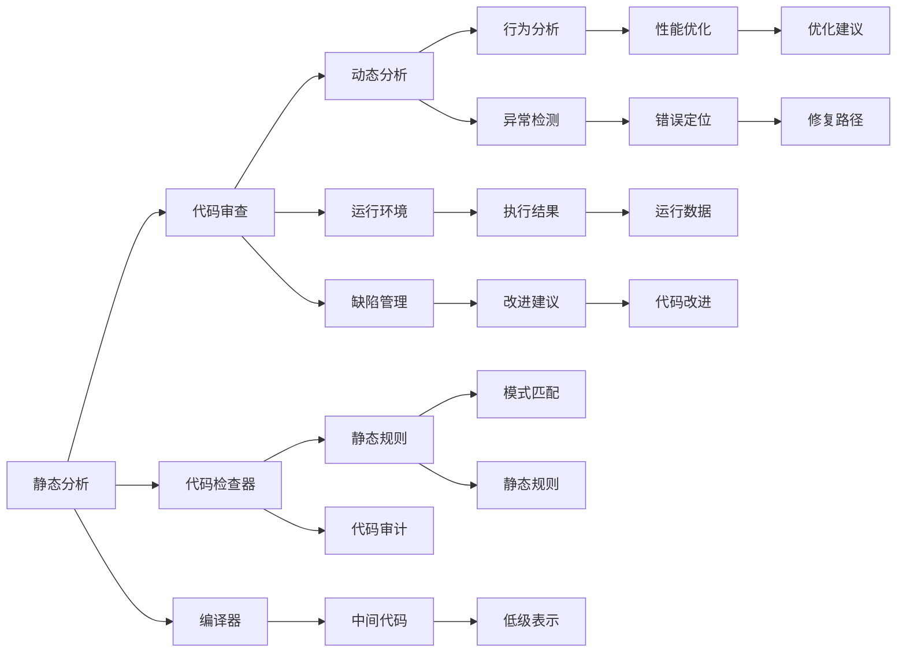

                 

# 自动化代码审查与AI的结合

> 关键词：自动化代码审查, AI驱动, 静态分析, 动态分析, 模型训练, 代码质量, 工具链

## 1. 背景介绍

在软件开发的过程中，代码审查（Code Review）是确保代码质量、维护代码风格一致性以及防止潜在错误的关键环节。传统的代码审查依赖于人工进行，不仅耗时耗力，还容易出现人为疏漏。随着软件项目规模的不断扩大和开发效率的持续提升，传统的代码审查方法已难以适应现代软件开发的快速迭代和需求变更。为此，AI技术的引入为自动化代码审查提供了新的可能性。AI驱动的代码审查不仅能够大幅度提高审查效率，还能挖掘出人类审查难以发现的潜在问题，为软件项目的质量保障提供强有力的支持。

### 1.1 自动化代码审查的现状

在过去的几年里，自动化代码审查工具（如SonarQube、CodeClimate等）已经开始在大型企业中得到广泛应用。这些工具利用静态分析和动态分析技术，对代码进行深入的审查，能够自动检测出许多常见的代码错误，如内存泄漏、空指针引用、类型不匹配等问题。然而，这些工具仍存在一定的局限性：

- **准确性**：虽然静态和动态分析技术已经相当成熟，但它们仍然不能保证绝对的准确性，特别是在处理复杂的业务逻辑和算法时。
- **灵活性**：自动化工具往往只能检测出一些固定的错误模式，对于特定领域或特定业务场景的审查效果可能较差。
- **适用性**：不同的项目和团队可能需要不同的审查策略，标准化工具往往难以满足所有需求。

### 1.2 AI技术在代码审查中的应用

近年来，随着深度学习、自然语言处理（NLP）等AI技术的迅猛发展，AI驱动的代码审查开始成为可能。AI技术能够利用机器学习算法和大数据处理能力，实现对代码的高效、灵活和精准审查，弥补传统自动化工具的不足。通过结合静态分析和动态分析，AI驱动的代码审查能够在自动化工具的基础上进一步提升代码质量，为软件开发团队提供更强有力的支持。

## 2. 核心概念与联系

### 2.1 核心概念概述

在自动化代码审查和AI驱动的框架下，以下是几个核心概念及其联系：

- **静态分析**：指在代码编写阶段进行的分析，通过检查代码的语法、结构和模式，找出潜在的错误和不良编码习惯。
- **动态分析**：指在代码运行阶段进行的分析，通过执行代码并观察其行为，发现运行时错误和性能问题。
- **机器学习**：利用算法和模型，从数据中学习并提取模式，用于预测和分类等任务。
- **自然语言处理**：通过算法处理和理解人类语言，实现文本分析和信息提取等任务。
- **代码审查**：通过检查代码的编写过程和运行结果，找出潜在的错误和问题，确保代码质量。
- **人工智能**：结合机器学习和自然语言处理等技术，实现智能化的代码审查和质量管理。

这些概念之间存在着紧密的联系，如图中的Mermaid流程图所示：



这个流程图展示了代码审查和AI技术在静态分析和动态分析中的集成和协同作用：

1. **静态分析**：通过代码检查器和静态规则，自动检测出语法错误、潜在问题和不良编码习惯。
2. **动态分析**：在运行环境中执行代码，通过行为分析和异常检测，发现运行时错误和性能问题。
3. **代码审查**：结合静态分析和动态分析的结果，进行缺陷管理和改进建议。
4. **机器学习**：通过学习和分析代码审查结果，发现和解决模式匹配和规则定义中的问题。
5. **自然语言处理**：通过处理和理解代码审查的文本信息，提取和分类问题的本质。

这些概念共同构成了AI驱动的代码审查框架，为软件开发过程的质量保障提供了强有力的技术支持。

## 3. 核心算法原理 & 具体操作步骤

### 3.1 算法原理概述

AI驱动的代码审查结合了机器学习和自然语言处理等技术，通过深度学习模型和规则库，对代码进行智能化的分析和审查。其核心原理如下：

1. **数据准备**：收集和整理代码审查数据，包括代码片段、注释、缺陷报告等，作为训练模型的数据集。
2. **模型训练**：利用机器学习算法，训练模型以识别代码中的问题和模式。
3. **模型应用**：将训练好的模型应用于新的代码片段，进行智能化的审查和分析。
4. **结果反馈**：根据模型输出，生成详细的审查报告，帮助开发者识别和解决问题。

### 3.2 算法步骤详解

以下是AI驱动代码审查的具体操作步骤：

**Step 1: 数据收集与预处理**

- 收集历史代码审查数据，包括代码片段、注释、缺陷报告等。
- 对数据进行清洗和预处理，去除重复数据和无用信息，形成干净的训练集。
- 对代码片段进行分词、标注等预处理，为机器学习模型提供输入。

**Step 2: 模型训练**

- 选择合适的机器学习算法，如卷积神经网络（CNN）、循环神经网络（RNN）、长短期记忆网络（LSTM）等。
- 将预处理后的代码片段输入模型，进行训练，并调整超参数以优化模型性能。
- 使用交叉验证等技术，评估模型在测试集上的表现。

**Step 3: 模型应用**

- 将训练好的模型应用于新的代码片段，进行自动化的代码审查。
- 根据模型输出，生成详细的审查报告，指出代码中的问题和改进建议。
- 对于复杂问题，结合静态分析工具进行进一步的确认和处理。

**Step 4: 结果反馈与改进**

- 将审查结果反馈给开发者，并记录在缺陷管理系统中。
- 定期回顾审查结果，根据反馈数据进一步训练和优化模型。
- 结合人工审查结果，综合评估模型的准确性和适用性，不断改进模型。

### 3.3 算法优缺点

AI驱动的代码审查方法具有以下优点：

- **高效性**：自动化处理代码审查，大幅度提高审查效率，减少人力成本。
- **灵活性**：能够根据具体项目和需求，灵活调整审查策略和模型参数。
- **准确性**：利用机器学习算法和大数据处理能力，提高审查的准确性和全面性。
- **可扩展性**：能够应用于各种编程语言和开发环境，具有广泛的应用前景。

然而，该方法也存在一些缺点：

- **数据依赖**：模型的性能很大程度上依赖于训练数据的规模和质量，数据不足时可能效果不佳。
- **复杂性**：模型训练和调优过程较为复杂，需要专业知识和技术积累。
- **误报率**：模型在处理复杂业务逻辑时，可能会产生误报，增加开发者的工作负担。

### 3.4 算法应用领域

AI驱动的代码审查方法可以应用于多种开发场景，包括但不限于：

- **软件开发团队**：对代码进行持续的自动审查，确保代码质量。
- **自动化测试**：结合静态和动态分析，提升测试覆盖率和测试质量。
- **持续集成（CI）**：在代码提交时进行自动化审查，确保代码变更符合质量标准。
- **代码质量评估**：对项目整体代码质量进行评估和改进，提升项目整体水平。

## 4. 数学模型和公式 & 详细讲解 & 举例说明

### 4.1 数学模型构建

在AI驱动的代码审查中，我们通常使用基于深度学习的方法进行模型构建。以自然语言处理（NLP）为例，假设输入为代码片段$x$，输出为代码审查结果$y$。则可以使用如下的数学模型进行建模：

$$ y = f(x; \theta) $$

其中，$f(\cdot)$为模型函数，$\theta$为模型参数。

### 4.2 公式推导过程

以代码片段分类为例，假设我们的目标是判断代码片段$x$是否包含某种特定错误。我们可以使用二分类模型，通过学习代码片段与错误标签之间的关系，进行错误检测和分类。

假设$x$为输入代码片段，$y$为错误标签（0表示不包含错误，1表示包含错误）。模型的损失函数为交叉熵损失函数：

$$ \mathcal{L} = -\frac{1}{N}\sum_{i=1}^N (y_i \log \hat{y_i} + (1-y_i) \log (1-\hat{y_i})) $$

其中，$\hat{y_i}$为模型对第$i$个代码片段的预测结果。

模型的训练过程可以通过反向传播算法进行优化：

$$ \theta \leftarrow \theta - \eta \nabla_{\theta}\mathcal{L}(\theta) - \eta\lambda\theta $$

其中，$\eta$为学习率，$\lambda$为正则化系数。

### 4.3 案例分析与讲解

以检查代码中是否存在内存泄漏为例，假设我们的训练数据集包含以下代码片段和对应的错误标签：

| 代码片段 | 错误标签 |
|---------|---------|
| int *p = malloc(sizeof(int)); | 1 |
| free(p); | 0 |
| int *q = malloc(sizeof(int)); | 1 |
| free(q); | 0 |
| int *r = malloc(sizeof(int)); | 1 |

我们可以使用卷积神经网络（CNN）作为模型，对代码片段进行特征提取和分类。假设模型训练得到如下的分类边界：

| 代码片段 | 预测结果 |
|---------|---------|
| int *p = malloc(sizeof(int)); | 1 |
| free(p); | 0 |
| int *q = malloc(sizeof(int)); | 1 |
| free(q); | 0 |
| int *r = malloc(sizeof(int)); | 1 |

根据模型的输出，我们可以判断代码片段$r$可能存在内存泄漏问题，建议开发者进一步检查和修正。

## 5. 项目实践：代码实例和详细解释说明

### 5.1 开发环境搭建

在进行AI驱动的代码审查实践前，我们需要准备好开发环境。以下是使用Python进行TensorFlow和Keras开发的环境配置流程：

1. 安装Anaconda：从官网下载并安装Anaconda，用于创建独立的Python环境。

2. 创建并激活虚拟环境：
```bash
conda create -n tensorflow-env python=3.8 
conda activate tensorflow-env
```

3. 安装TensorFlow和Keras：
```bash
conda install tensorflow keras
```

4. 安装各类工具包：
```bash
pip install numpy pandas scikit-learn matplotlib tqdm jupyter notebook ipython
```

完成上述步骤后，即可在`tensorflow-env`环境中开始代码审查实践。

### 5.2 源代码详细实现

下面我们以代码片段分类为例，给出使用TensorFlow和Keras对代码进行自动化的二分类模型训练和应用的完整代码实现。

首先，定义模型：

```python
from tensorflow import keras
from tensorflow.keras import layers

model = keras.Sequential([
    layers.Embedding(input_dim=vocab_size, output_dim=embedding_dim, input_length=max_len),
    layers.Conv1D(filters=64, kernel_size=3, activation='relu'),
    layers.GlobalMaxPooling1D(),
    layers.Dense(1, activation='sigmoid')
])
```

然后，定义数据集和标签：

```python
train_dataset = tf.data.Dataset.from_tensor_slices((train_x, train_y))
train_dataset = train_dataset.batch(batch_size)

dev_dataset = tf.data.Dataset.from_tensor_slices((dev_x, dev_y))
dev_dataset = dev_dataset.batch(batch_size)

test_dataset = tf.data.Dataset.from_tensor_slices((test_x, test_y))
test_dataset = test_dataset.batch(batch_size)
```

接着，定义训练和评估函数：

```python
def train_step(iterator, model, optimizer):
    with tf.GradientTape() as tape:
        predictions = model(x)
        loss = tf.reduce_mean(tf.nn.sigmoid_cross_entropy_with_logits(labels=y, logits=predictions))
        gradients = tape.gradient(loss, model.trainable_variables)
    optimizer.apply_gradients(zip(gradients, model.trainable_variables))
    return loss

def evaluate_step(iterator, model):
    predictions = model(x)
    return tf.reduce_mean(tf.nn.sigmoid_cross_entropy_with_logits(labels=y, logits=predictions))

def train_epoch(model, dataset, batch_size, optimizer, epochs):
    for epoch in range(epochs):
        for x, y in train_dataset:
            loss = train_step(iterator, model, optimizer)
            tf.print(f'Epoch {epoch+1}/{epochs}, Loss: {loss:.4f}')
        for x, y in dev_dataset:
            dev_loss = evaluate_step(iterator, model)
            tf.print(f'Epoch {epoch+1}/{epochs}, Dev Loss: {dev_loss:.4f}')

train_epoch(model, train_dataset, batch_size, optimizer, epochs)

for x, y in test_dataset:
    test_loss = evaluate_step(iterator, model)
    tf.print(f'Test Loss: {test_loss:.4f}')
```

最后，启动训练流程并在测试集上评估：

```python
epochs = 5
batch_size = 32
optimizer = tf.keras.optimizers.Adam(learning_rate=0.001)
vocab_size = 10000
embedding_dim = 64
max_len = 128

train_x, train_y = ...
dev_x, dev_y = ...
test_x, test_y = ...

train_epoch(model, train_dataset, batch_size, optimizer, epochs)

for x, y in test_dataset:
    test_loss = evaluate_step(iterator, model)
    tf.print(f'Test Loss: {test_loss:.4f}')
```

以上就是使用TensorFlow和Keras对代码片段进行二分类模型训练和应用的完整代码实现。可以看到，TensorFlow和Keras的强大封装使得代码实现变得简洁高效。开发者可以将更多精力放在数据处理、模型改进等高层逻辑上，而不必过多关注底层的实现细节。

### 5.3 代码解读与分析

让我们再详细解读一下关键代码的实现细节：

**模型定义**：
- `layers.Embedding`：将输入的单词序列转换为密集向量表示。
- `layers.Conv1D`：使用卷积层进行特征提取。
- `layers.GlobalMaxPooling1D`：使用全局最大池化层对卷积层的输出进行聚合。
- `layers.Dense`：输出层进行二分类预测。

**数据集定义**：
- `train_dataset`、`dev_dataset`、`test_dataset`：通过`tf.data.Dataset.from_tensor_slices`将输入数据和标签转换为TensorFlow可处理的格式。
- `batch_size`：定义批大小，方便模型训练。

**训练和评估函数**：
- `train_step`：定义一个训练步骤，计算损失并反向传播。
- `evaluate_step`：定义一个评估步骤，计算模型在测试集上的损失。
- `train_epoch`：定义一个完整的训练周期，包含多个训练步骤和评估步骤。

**训练流程**：
- 定义总epoch数和批大小，开始循环迭代
- 每个epoch内，在训练集上训练，并输出平均损失
- 在验证集上评估，输出平均损失
- 所有epoch结束后，在测试集上评估，给出最终测试结果

可以看到，TensorFlow和Keras使得代码审查的实现变得简单直观，大大降低了开发门槛，有助于更多人快速上手和实践。

## 6. 实际应用场景

### 6.1 软件开发团队

在软件开发团队中，自动化代码审查可以用于持续集成（CI）流程，实时监控代码变更，确保代码质量。通过结合静态分析和动态分析，AI驱动的代码审查能够快速检测出代码中的错误和问题，帮助开发者及时修复，减少代码提交后的反馈周期。

### 6.2 自动化测试

在自动化测试过程中，AI驱动的代码审查可以用于测试用例的设计和执行，确保测试用例的有效性和覆盖率。通过分析历史测试数据，AI模型可以自动生成新的测试用例，并预测测试结果，提高测试效率和质量。

### 6.3 持续集成（CI）

在持续集成流程中，AI驱动的代码审查可以用于代码提交时的即时审查，确保代码变更符合质量标准。通过在CI流程中集成自动化代码审查，可以快速发现并修复代码问题，提高代码交付速度和质量。

### 6.4 未来应用展望

随着AI技术的不断发展，未来的代码审查将更加智能化和自动化。我们可以预见以下趋势：

1. **跨语言支持**：AI驱动的代码审查将不再局限于特定编程语言，能够支持多种语言和框架。
2. **多模态融合**：结合代码审查、静态分析、动态分析等多种数据源，实现更全面、准确的审查。
3. **实时审查**：通过云平台和大数据处理能力，实现实时代码审查，快速响应代码变更。
4. **人机协同**：结合AI算法和人类审查，提升审查的准确性和灵活性。
5. **深度学习**：使用更先进的深度学习模型，如Transformer、BERT等，提高代码审查的准确性和泛化能力。

## 7. 工具和资源推荐

### 7.1 学习资源推荐

为了帮助开发者系统掌握AI驱动代码审查的理论基础和实践技巧，这里推荐一些优质的学习资源：

1. 《TensorFlow官方文档》：提供了完整的TensorFlow学习路径，包括基础教程、高级应用和案例实战。
2. 《Keras官方文档》：提供了Keras的全面介绍和用法示例，是学习和实践Keras的重要参考。
3. 《深度学习入门：基于Python的理论与实现》：介绍深度学习的基本理论和TensorFlow的实践方法，适合初学者入门。
4. 《自然语言处理入门》：介绍NLP的基本概念和TensorFlow的NLP应用，帮助理解NLP在代码审查中的应用。

通过对这些资源的学习实践，相信你一定能够快速掌握AI驱动代码审查的精髓，并用于解决实际的代码质量问题。

### 7.2 开发工具推荐

高效的开发离不开优秀的工具支持。以下是几款用于AI驱动代码审查开发的常用工具：

1. TensorFlow：由Google主导开发的开源深度学习框架，生产部署方便，适合大规模工程应用。
2. Keras：Keras是一个高层次的深度学习API，能够快速搭建和训练模型，适合快速原型开发。
3. Weights & Biases：模型训练的实验跟踪工具，可以记录和可视化模型训练过程中的各项指标，方便对比和调优。
4. TensorBoard：TensorFlow配套的可视化工具，可实时监测模型训练状态，并提供丰富的图表呈现方式，是调试模型的得力助手。

合理利用这些工具，可以显著提升AI驱动代码审查的开发效率，加快创新迭代的步伐。

### 7.3 相关论文推荐

AI驱动的代码审查技术源于学界的持续研究。以下是几篇奠基性的相关论文，推荐阅读：

1. "Static Code Review via Deep Learning"：介绍使用深度学习模型进行静态代码审查的方法。
2. "Automatic Code Review for Consistency Checks"：提出使用神经网络模型进行代码一致性审查的技术。
3. "Code Review and Analysis with Neural Networks"：总结了神经网络在代码审查中的应用，包括分类、回归等任务。
4. "Modeling Code Review Quality with Machine Learning"：探讨了使用机器学习模型评估代码审查质量的方法。

这些论文代表了大语言模型微调技术的发展脉络。通过学习这些前沿成果，可以帮助研究者把握学科前进方向，激发更多的创新灵感。

## 8. 总结：未来发展趋势与挑战

### 8.1 总结

本文对AI驱动的代码审查方法进行了全面系统的介绍。首先阐述了自动化代码审查和AI技术在软件开发中的应用现状和潜力，明确了AI驱动代码审查在提高代码质量和审查效率方面的独特价值。其次，从原理到实践，详细讲解了AI驱动代码审查的数学模型和操作步骤，给出了代码审查任务开发的完整代码实例。同时，本文还广泛探讨了AI驱动代码审查在软件开发团队、自动化测试、持续集成等多个行业领域的应用前景，展示了AI驱动代码审查的广泛应用价值。最后，本文精选了代码审查技术的各类学习资源，力求为读者提供全方位的技术指引。

通过本文的系统梳理，可以看到，AI驱动的代码审查技术正在成为软件开发质量保障的重要工具，极大地拓展了软件开发的自动化和智能化水平。未来，伴随AI技术的持续发展，代码审查技术也将不断提升，为软件开发质量保障带来更多的可能性。

### 8.2 未来发展趋势

展望未来，AI驱动的代码审查技术将呈现以下几个发展趋势：

1. **数据驱动**：通过更大规模、更高质量的数据集，训练更准确的审查模型，提升审查的准确性和全面性。
2. **模型优化**：结合深度学习、强化学习等技术，优化审查模型，提高模型的泛化能力和鲁棒性。
3. **人机协同**：结合AI算法和人类审查，提升审查的准确性和灵活性。
4. **跨平台支持**：支持多种编程语言和开发平台，实现跨语言、跨平台的代码审查。
5. **实时审查**：通过云平台和大数据处理能力，实现实时代码审查，快速响应代码变更。
6. **多模态融合**：结合代码审查、静态分析、动态分析等多种数据源，实现更全面、准确的审查。

以上趋势凸显了AI驱动代码审查技术的广阔前景。这些方向的探索发展，必将进一步提升代码审查的质量和效率，为软件开发过程的质量保障提供强有力的支持。

### 8.3 面临的挑战

尽管AI驱动的代码审查技术已经取得了显著进展，但在迈向更加智能化、普适化应用的过程中，仍面临诸多挑战：

1. **数据依赖**：模型的性能很大程度上依赖于训练数据的规模和质量，数据不足时可能效果不佳。
2. **复杂性**：模型训练和调优过程较为复杂，需要专业知识和技术积累。
3. **误报率**：模型在处理复杂业务逻辑时，可能会产生误报，增加开发者的工作负担。
4. **鲁棒性**：模型在面对不同编程风格和语言特性时，可能出现鲁棒性不足的问题。

### 8.4 研究展望

面对AI驱动代码审查所面临的挑战，未来的研究需要在以下几个方面寻求新的突破：

1. **数据增强**：通过数据增强技术，扩充训练数据集，提高模型的泛化能力。
2. **模型优化**：结合深度学习、强化学习等技术，优化审查模型，提高模型的泛化能力和鲁棒性。
3. **跨平台支持**：支持多种编程语言和开发平台，实现跨语言、跨平台的代码审查。
4. **实时审查**：通过云平台和大数据处理能力，实现实时代码审查，快速响应代码变更。
5. **多模态融合**：结合代码审查、静态分析、动态分析等多种数据源，实现更全面、准确的审查。
6. **人机协同**：结合AI算法和人类审查，提升审查的准确性和灵活性。

这些研究方向的探索，必将引领AI驱动代码审查技术迈向更高的台阶，为软件开发质量保障提供更多的技术支持。面向未来，我们需要在数据、算法、工程、业务等多个维度协同发力，不断提升代码审查的质量和效率，推动软件开发过程的智能化和自动化。总之，AI驱动的代码审查需要开发者根据具体项目，不断迭代和优化模型、数据和算法，方能得到理想的效果。

---

作者：禅与计算机程序设计艺术 / Zen and the Art of Computer Programming

