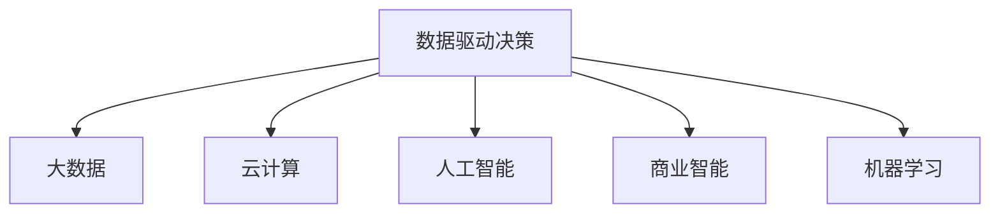

                 

# 自动化创业中的数据驱动决策

## 1. 背景介绍

### 1.1 问题由来

在自动化创业的浪潮中，数据驱动决策扮演着至关重要的角色。随着云计算、大数据、人工智能等技术的不断成熟，越来越多的创业公司在产品研发、市场推广、用户运营等方面采用数据驱动的方法，以期在激烈的市场竞争中脱颖而出。然而，数据驱动决策并非易事。许多创业公司往往面临数据获取、数据处理、数据分析、数据应用等诸多挑战，导致其数据驱动决策能力不足，从而在竞争中处于劣势。

### 1.2 问题核心关键点

数据驱动决策的核心在于利用数据资源，结合先进的技术手段，为决策者提供准确、及时的业务洞察，以支持战略制定、运营优化、产品迭代等各项业务活动。然而，如何高效地获取、存储、处理、分析数据，如何将数据转化为可操作的业务决策，如何建立健全的决策执行机制，是创业者在自动化创业中需要解决的关键问题。

### 1.3 问题研究意义

在自动化创业中，数据驱动决策能够显著提升企业的决策质量和运营效率，降低成本，增强市场竞争力。通过数据分析和机器学习等技术手段，企业能够实时监测市场动态，精准识别用户需求，及时调整运营策略，快速响应市场变化。此外，数据驱动决策还能够有效防范风险，保障企业的长期可持续发展。

## 2. 核心概念与联系

### 2.1 核心概念概述

为更好地理解数据驱动决策在自动化创业中的应用，本节将介绍几个密切相关的核心概念：

- **数据驱动决策**：指通过分析数据，提取有用信息，辅助决策者进行科学决策的方法。数据驱动决策的核心在于以数据为基础，结合业务知识，做出更有依据的决策。

- **大数据**：指规模庞大、复杂多变、来源多样化的数据集。大数据能够为数据驱动决策提供丰富的数据源，为决策者提供多样化的视角和分析手段。

- **云计算**：指通过互联网提供可扩展、按需、高可靠性的计算资源和服务。云计算能够为数据驱动决策提供强大的计算能力和数据存储能力，支持大规模数据分析和机器学习应用。

- **人工智能**：指利用算法和模型，赋予机器学习、推理、决策等智能行为的学科。人工智能能够为数据驱动决策提供强大的分析工具和预测能力，提高决策的准确性和及时性。

- **商业智能(BI)**：指将数据分析、数据可视化、数据报表等技术手段应用于企业决策支持，以提升企业的战略决策能力。商业智能能够帮助企业从历史数据中提取知识，指导未来决策。

- **机器学习**：指让机器通过数据学习，自动改进算法，提升决策准确性。机器学习能够帮助企业从海量数据中提取规律，进行预测和推荐，支持自动化决策。

这些核心概念之间的逻辑关系可以通过以下Mermaid流程图来展示：



这个流程图展示了数据驱动决策的核心概念及其之间的关系：

1. 数据驱动决策以大数据为基础，利用云计算提供强大的计算能力。
2. 人工智能和机器学习为数据驱动决策提供技术支持，提高决策的准确性和及时性。
3. 商业智能将数据分析、数据可视化等技术应用于企业决策，提升决策支持能力。

## 3. 核心算法原理 & 具体操作步骤
### 3.1 算法原理概述

数据驱动决策的核心在于利用数据资源，结合先进的技术手段，为决策者提供准确、及时的业务洞察，以支持战略制定、运营优化、产品迭代等各项业务活动。具体而言，数据驱动决策的算法原理如下：

1. **数据采集与预处理**：通过爬虫、API、日志等手段获取业务数据，并进行清洗、去重、归一化等预处理操作，保证数据质量。

2. **数据分析与建模**：利用统计学、机器学习等方法，对数据进行分析，建立模型，提取规律和趋势。

3. **决策支持与优化**：根据数据分析结果，结合业务知识，辅助决策者进行决策，优化业务流程，提升运营效率。

### 3.2 算法步骤详解

数据驱动决策的算法步骤主要包括以下几个关键步骤：

**Step 1: 数据采集与预处理**
- 通过爬虫、API、日志等手段获取业务数据。
- 进行清洗、去重、归一化等预处理操作，保证数据质量。
- 将数据存储到数据仓库中，便于后续分析和应用。

**Step 2: 数据分析与建模**
- 利用统计学方法，对数据进行描述性分析，提取关键指标和统计特征。
- 利用机器学习算法，对数据进行预测和分类，建立业务模型。
- 使用可视化工具，将分析结果可视化展示，便于决策者理解。

**Step 3: 决策支持与优化**
- 结合业务知识，对数据分析结果进行解读，形成业务洞察。
- 辅助决策者进行战略制定、运营优化、产品迭代等决策。
- 定期评估决策效果，调整优化策略，提高决策准确性和及时性。

### 3.3 算法优缺点

数据驱动决策具有以下优点：
1. 决策科学性：利用数据和算法，提高决策的科学性和准确性。
2. 决策效率高：通过自动化工具和模型，快速生成决策方案。
3. 数据驱动：依托数据，减少主观偏见，提升决策的客观性。
4. 可扩展性强：利用云计算和大数据，可以处理大规模数据集，支持企业快速扩张。

同时，该方法也存在一定的局限性：
1. 数据依赖性强：决策质量高度依赖数据质量，数据收集和处理需要大量人力和技术支持。
2. 技术门槛高：需要较高的技术能力和专业背景，小型企业难以快速实施。
3. 数据隐私问题：数据采集和使用可能涉及隐私问题，需要严格的数据保护措施。
4. 模型复杂度高：建立复杂模型可能需要较长时间，且难以解释和优化。

尽管存在这些局限性，但就目前而言，数据驱动决策在自动化创业中仍然是最主流的方法。未来相关研究的重点在于如何降低数据驱动决策的技术门槛，提高数据获取和处理的自动化程度，同时兼顾隐私保护和模型解释性等因素。

### 3.4 算法应用领域

数据驱动决策在自动化创业中广泛应用于多个领域，例如：

- 市场分析：利用数据驱动决策，分析市场趋势，预测市场需求，指导产品开发和市场推广。
- 用户运营：通过数据驱动决策，优化用户留存和活跃度，提升用户满意度和忠诚度。
- 产品迭代：利用数据驱动决策，识别用户痛点，优化产品功能，满足用户需求。
- 供应链管理：通过数据驱动决策，优化库存管理，降低物流成本，提升供应链效率。
- 风险管理：利用数据驱动决策，识别和防范风险，保障企业稳健运营。
- 营销效果分析：通过数据驱动决策，评估营销活动效果，优化营销策略。

此外，数据驱动决策还可以应用于更多场景中，如智能客服、个性化推荐、智能投顾等，为企业提供全方位的智能决策支持。

## 4. 数学模型和公式 & 详细讲解 & 举例说明（备注：数学公式请使用latex格式，latex嵌入文中独立段落使用 $$，段落内使用 $)
### 4.1 数学模型构建

本节将使用数学语言对数据驱动决策的基本原理进行更加严格的刻画。

假设有一个电商企业，其每日订单量 $y$ 受到广告投放、促销活动、用户行为等多种因素影响。设 $X_1, X_2, \ldots, X_k$ 为影响订单量的 $k$ 个变量，假设这些变量满足线性关系：

$$
y = \beta_0 + \beta_1 X_1 + \beta_2 X_2 + \ldots + \beta_k X_k + \epsilon
$$

其中，$\beta_0, \beta_1, \ldots, \beta_k$ 为回归系数，$\epsilon$ 为随机误差项。

在实际应用中，我们可以利用最小二乘法对模型进行参数估计，求解回归系数：

$$
\hat{\beta} = (X^T X)^{-1} X^T y
$$

其中，$\hat{\beta}$ 为回归系数的估计值，$X^T$ 和 $y$ 分别为自变量和因变量的转置和转置矩阵。

### 4.2 公式推导过程

以下我们以广告投放决策为例，推导广告投放效果预测模型及其梯度计算公式。

假设电商企业想要预测广告投放后的订单量变化，通过历史数据 $(x_i, y_i)$ 进行回归模型训练，其中 $x_i$ 为广告投放特征，$y_i$ 为订单量变化。回归模型可以表示为：

$$
y = \theta_0 + \theta_1 x_1 + \theta_2 x_2 + \ldots + \theta_n x_n + \epsilon
$$

其中，$\theta_0, \theta_1, \ldots, \theta_n$ 为回归系数，$\epsilon$ 为随机误差项。

利用最小二乘法，求解回归系数：

$$
\hat{\theta} = (X^T X)^{-1} X^T y
$$

其中，$X$ 为特征矩阵，$y$ 为订单量变化数据。

根据梯度下降算法，模型的梯度公式为：

$$
\frac{\partial \mathcal{L}}{\partial \theta_i} = -\frac{2}{N} \sum_{i=1}^N (y_i - (\hat{\theta}_0 + \hat{\theta}_1 x_{i1} + \ldots + \hat{\theta}_n x_{in})) x_{ij}
$$

其中，$\mathcal{L}$ 为损失函数，$N$ 为样本数，$x_{ij}$ 为第 $i$ 个样本的第 $j$ 个特征。

通过上述公式，我们可以计算出回归系数 $\hat{\theta}$ 的梯度，进而使用梯度下降算法更新模型参数，完成回归模型的训练。

### 4.3 案例分析与讲解

假设电商企业有 1000 个历史订单数据，包括广告投放、促销活动、用户行为等特征。利用回归模型对广告投放后的订单量变化进行预测，具体步骤如下：

1. 收集历史订单数据，整理成特征和标签的数据集。
2. 利用最小二乘法对回归模型进行训练，求解回归系数 $\hat{\theta}$。
3. 对于新的广告投放数据，将其特征代入回归模型，预测订单量变化。
4. 利用梯度下降算法优化回归系数 $\hat{\theta}$，提高模型精度。

通过不断迭代，电商企业可以实时监控广告投放效果，根据预测结果及时调整广告投放策略，优化广告投放预算，提升广告ROI。

## 5. 项目实践：代码实例和详细解释说明
### 5.1 开发环境搭建

在进行数据驱动决策项目实践前，我们需要准备好开发环境。以下是使用Python进行Pandas、Scikit-learn、TensorFlow等库的环境配置流程：

1. 安装Anaconda：从官网下载并安装Anaconda，用于创建独立的Python环境。

2. 创建并激活虚拟环境：
```bash
conda create -n data-driven-decisions python=3.8 
conda activate data-driven-decisions
```

3. 安装相关库：
```bash
conda install pandas scikit-learn tensorflow
```

4. 安装各类工具包：
```bash
pip install numpy matplotlib jupyter notebook ipython
```

完成上述步骤后，即可在`data-driven-decisions`环境中开始项目实践。

### 5.2 源代码详细实现

下面我们以广告投放效果预测为例，给出使用Pandas、Scikit-learn库对回归模型进行训练和预测的Python代码实现。

```python
import pandas as pd
from sklearn.linear_model import LinearRegression
from sklearn.metrics import mean_squared_error
from sklearn.model_selection import train_test_split

# 读取历史订单数据
data = pd.read_csv('orders.csv')

# 数据预处理
features = ['ad_id', 'promotion_id', 'user_bea_his', 'user_age', 'user_region']
target = 'order_change'
X = data[features]
y = data[target]

# 分割训练集和测试集
X_train, X_test, y_train, y_test = train_test_split(X, y, test_size=0.2, random_state=42)

# 建立回归模型
model = LinearRegression()
model.fit(X_train, y_train)

# 预测新广告投放效果
new_ad_data = pd.DataFrame({'ad_id': [10001], 'promotion_id': [5001], 'user_bea_his': ['abc', 'def', 'ghi'], 'user_age': [30], 'user_region': ['beijing']})
new_ad_features = model.predict(new_ad_data)

# 评估模型效果
mse = mean_squared_error(y_test, y_pred)
print(f'广告投放效果预测的MSE为: {mse:.2f}')
```

以上就是使用Python进行回归模型训练和预测的完整代码实现。可以看到，利用Pandas、Scikit-learn库，可以轻松实现数据驱动决策的基本流程，从数据采集、数据处理、模型训练到结果预测，每一步都变得简洁高效。

### 5.3 代码解读与分析

让我们再详细解读一下关键代码的实现细节：

**数据读取与预处理**：
- `pd.read_csv('orders.csv')`：读取历史订单数据文件，并将其存储为Pandas数据框。
- `features = ['ad_id', 'promotion_id', 'user_bea_his', 'user_age', 'user_region']`：定义特征列和标签列。
- `X = data[features]`：提取特征列作为自变量。
- `y = data[target]`：提取标签列作为因变量。
- `X_train, X_test, y_train, y_test = train_test_split(X, y, test_size=0.2, random_state=42)`：将数据集分割为训练集和测试集，保持80%的训练集和20%的测试集比例，随机化分割结果。

**模型训练**：
- `model = LinearRegression()`：创建线性回归模型。
- `model.fit(X_train, y_train)`：使用训练集数据训练回归模型。

**预测与评估**：
- `new_ad_data = pd.DataFrame({'ad_id': [10001], 'promotion_id': [5001], 'user_bea_his': ['abc', 'def', 'ghi'], 'user_age': [30], 'user_region': ['beijing']})`：创建新的广告投放数据，包含广告ID、促销ID、用户行为、用户年龄、用户区域等信息。
- `new_ad_features = model.predict(new_ad_data)`：使用训练好的模型预测新广告投放效果。
- `mse = mean_squared_error(y_test, y_pred)`：计算预测结果与真实标签之间的均方误差，评估模型效果。

可以看到，利用Python和Pandas、Scikit-learn库，我们可以轻松实现数据驱动决策的基本流程，从数据采集、数据处理、模型训练到结果预测，每一步都变得简洁高效。

## 6. 实际应用场景
### 6.1 广告投放优化

广告投放是电商企业的核心业务之一，数据驱动决策能够帮助企业优化广告投放策略，提升广告效果和ROI。具体而言，通过数据分析，企业可以识别出哪些广告投放渠道效果最好，哪些用户群体最有可能转化为订单，从而优化广告预算和投放策略。

在技术实现上，可以收集历史广告投放数据，包括广告ID、投放时间、广告费用、用户行为等，将这些数据作为输入特征。将广告效果（如订单量变化）作为输出标签，利用回归模型进行训练，得到广告投放效果的预测模型。根据预测结果，企业可以调整广告投放策略，优先投放效果较好的渠道和广告，减少无效投放，提高广告投放效果。

### 6.2 供应链管理

供应链管理是企业运营的重要环节，数据驱动决策能够帮助企业优化库存管理，降低物流成本，提升供应链效率。具体而言，通过数据分析，企业可以识别出哪些商品在哪些时间节点需求较大，从而优化库存水平和采购计划。

在技术实现上，可以收集历史订单数据和库存数据，将这些数据作为输入特征。将库存水平作为输出标签，利用回归模型进行训练，得到库存变化的预测模型。根据预测结果，企业可以动态调整库存水平，避免库存过高或过低，降低物流成本，提升供应链效率。

### 6.3 用户运营优化

用户运营是企业获取和保留用户的重要手段，数据驱动决策能够帮助企业优化用户运营策略，提升用户留存和活跃度。具体而言，通过数据分析，企业可以识别出哪些用户群体对新功能、新活动的响应较好，哪些用户行为与流失风险较高，从而进行针对性的运营策略优化。

在技术实现上，可以收集用户行为数据，包括登录时间、浏览内容、购买行为等，将这些数据作为输入特征。将用户留存和活跃度作为输出标签，利用分类模型进行训练，得到用户行为的预测模型。根据预测结果，企业可以优化用户运营策略，如推出个性化推荐、优化用户体验等，提升用户留存和活跃度。

### 6.4 未来应用展望

随着数据驱动决策技术的不断发展，其在自动化创业中的应用前景将更加广阔。

在智慧医疗领域，数据驱动决策可以用于病患诊疗、药品推荐、疾病预防等方面，提升医疗服务的智能化水平，辅助医生诊疗，提升医疗效率。

在智能教育领域，数据驱动决策可以用于学生成绩分析、课程推荐、学习路径优化等方面，提升教育效果和资源利用率。

在智慧城市治理中，数据驱动决策可以用于城市事件监测、公共安全管理、交通管理等方面，提升城市治理的智能化水平，构建更安全、高效的城市。

此外，在企业生产、社会治理、文娱传媒等众多领域，数据驱动决策也将不断涌现，为各行各业带来新的变革性影响。

## 7. 工具和资源推荐
### 7.1 学习资源推荐

为了帮助开发者系统掌握数据驱动决策的理论基础和实践技巧，这里推荐一些优质的学习资源：

1. **《Python数据科学手册》**：系统介绍了Python在数据科学领域的应用，包括数据处理、数据可视化、机器学习等。

2. **Coursera的《Data Science》课程**：由Johns Hopkins大学开设，涵盖数据科学的基本概念和常用技术。

3. **Kaggle竞赛平台**：通过参与实际数据驱动决策竞赛，实践数据分析和模型训练，提升实战能力。

4. **Google Colab**：谷歌提供的免费在线Jupyter Notebook环境，支持GPU/TPU算力，方便快速实验新模型。

5. **Github上的数据驱动决策开源项目**：通过阅读和贡献开源项目，学习实际应用场景和最佳实践。

通过对这些资源的学习实践，相信你一定能够快速掌握数据驱动决策的精髓，并用于解决实际的自动化创业问题。

### 7.2 开发工具推荐

高效的开发离不开优秀的工具支持。以下是几款用于数据驱动决策开发的常用工具：

1. **Pandas**：Python中的数据分析库，支持数据清洗、转换、聚合等操作，是数据驱动决策的重要工具。

2. **Scikit-learn**：Python中的机器学习库，支持回归、分类、聚类等常用算法，是数据驱动决策的主要算法支持。

3. **TensorFlow**：谷歌开源的深度学习框架，支持分布式计算、自动微分等高级功能，是数据驱动决策的重要工具。

4. **Jupyter Notebook**：交互式的编程环境，支持代码编辑、执行、输出等操作，是数据驱动决策的常用开发工具。

5. **Matplotlib**：Python中的数据可视化库，支持丰富的图表类型和样式，是数据驱动决策的重要展示工具。

6. **Seaborn**：基于Matplotlib的高级数据可视化库，支持复杂的统计图表绘制，是数据驱动决策的重要展示工具。

合理利用这些工具，可以显著提升数据驱动决策的开发效率，加快创新迭代的步伐。

### 7.3 相关论文推荐

数据驱动决策的研究源于学界的持续研究。以下是几篇奠基性的相关论文，推荐阅读：

1. **G. T. Cawley, N. Niculescu-Mizil. An overview of classification and regression algorithms.** 2010

2. **T. Hastie, R. Tibshirani, J. Friedman. The Elements of Statistical Learning.** 2009

3. **P. Flach, S. Rosenthal. Understanding Machine Learning: From Theory to Algorithms.** 2010

4. **P. J. Huber, E. M. Ronchetti. Robust Statistics.** 2009

5. **J. M. Witten, E. Frank, M. A. Hall. Data Mining: Practical Machine Learning Tools and Techniques.** 2011

这些论文代表了大数据驱动决策的理论研究进展，通过学习这些前沿成果，可以帮助研究者把握学科前进方向，激发更多的创新灵感。

## 8. 总结：未来发展趋势与挑战

### 8.1 总结

本文对数据驱动决策在自动化创业中的应用进行了全面系统的介绍。首先阐述了数据驱动决策的背景和意义，明确了数据驱动决策在提升企业决策质量、运营效率、风险防范等方面的独特价值。其次，从原理到实践，详细讲解了数据驱动决策的算法原理和关键步骤，给出了数据驱动决策任务开发的完整代码实例。同时，本文还广泛探讨了数据驱动决策在广告投放优化、供应链管理、用户运营优化等多个行业领域的应用前景，展示了数据驱动决策范式的巨大潜力。

通过本文的系统梳理，可以看到，数据驱动决策在自动化创业中扮演着至关重要的角色。数据驱动决策能够通过分析数据，提取有用信息，辅助决策者进行科学决策，从而提升企业的决策质量和运营效率。未来，伴随数据驱动决策技术的不断发展，其在自动化创业中的应用前景将更加广阔，为各行各业带来新的变革性影响。

### 8.2 未来发展趋势

展望未来，数据驱动决策技术将呈现以下几个发展趋势：

1. **技术自动化**：随着AI技术的不断发展，数据驱动决策的自动化程度将不断提高，从数据收集、数据清洗、数据处理到模型训练、模型评估，每个环节都将实现自动化。

2. **数据融合**：不同数据源的数据将实现无缝融合，从孤立的数据源转向跨领域的融合数据，数据驱动决策将能够从更全面的视角进行分析和决策。

3. **模型优化**：机器学习模型的复杂度将不断提升，能够更好地捕捉数据的复杂性和多变性，提高决策的准确性和及时性。

4. **实时决策**：通过云计算和大数据技术，数据驱动决策将实现实时化，能够实时监控和调整决策，快速响应市场变化。

5. **跨学科应用**：数据驱动决策将与其他学科如心理学、社会学、经济学等深度融合，从多学科视角进行分析和决策，提升决策的全面性和科学性。

6. **智能算法**：通过引入智能算法如强化学习、神经网络等，数据驱动决策将具备更强的学习和决策能力，能够自适应地进行优化。

以上趋势凸显了数据驱动决策技术的广阔前景。这些方向的探索发展，必将进一步提升数据驱动决策的智能化和自动化水平，为各行各业带来更大的创新潜力。

### 8.3 面临的挑战

尽管数据驱动决策技术已经取得了瞩目成就，但在迈向更加智能化、普适化应用的过程中，仍面临诸多挑战：

1. **数据质量和隐私问题**：数据驱动决策依赖于高质量的数据，数据获取和处理需要大量人力和技术支持。同时，数据隐私保护也成为越来越重要的课题。

2. **模型复杂度**：建立复杂模型可能需要较长时间，且难以解释和优化。如何在保证模型精度的同时，降低模型复杂度，是未来的研究方向。

3. **实时决策和数据融合**：实现实时决策需要高效的数据处理和计算能力，数据融合需要不同数据源的协同工作，这些都将是未来技术发展的重点。

4. **跨学科融合**：数据驱动决策需要与其他学科深度融合，涉及心理学、社会学、经济学等多个领域的知识，需要跨学科的研究和实践。

5. **算法公平性和可解释性**：数据驱动决策的算法需要具备公平性和可解释性，避免算法偏见和黑箱问题，确保决策的透明性和公正性。

6. **安全和可靠性**：数据驱动决策需要具备强大的鲁棒性和可靠性，能够抵御攻击和恶意干扰，确保系统的安全和稳定。

正视数据驱动决策面临的这些挑战，积极应对并寻求突破，将是大数据驱动决策走向成熟的必由之路。相信随着学界和产业界的共同努力，这些挑战终将一一被克服，数据驱动决策必将在构建智能社会中扮演越来越重要的角色。

### 8.4 研究展望

面对数据驱动决策面临的挑战，未来的研究需要在以下几个方面寻求新的突破：

1. **自动化数据获取和处理**：探索自动化数据采集、数据清洗、数据处理等技术，减少人力成本，提高数据获取效率和质量。

2. **模型优化与可解释性**：开发更加高效、可解释的模型，降低模型复杂度，提高模型的可解释性和公平性。

3. **实时决策与跨学科融合**：研究实时数据处理和跨学科融合技术，实现实时决策和跨学科应用的深度融合。

4. **安全和隐私保护**：建立健全的数据隐私保护机制，确保数据的安全性和隐私保护，提高数据驱动决策的可靠性。

5. **智能决策与优化**：研究智能决策与优化算法，实现数据驱动决策的自主学习与自适应优化，提升决策的智能化水平。

这些研究方向的探索，必将引领数据驱动决策技术迈向更高的台阶，为构建智能社会提供强大的技术支撑。面向未来，数据驱动决策技术还需要与其他人工智能技术进行更深入的融合，如知识表示、因果推理、强化学习等，多路径协同发力，共同推动数据驱动决策技术的进步。只有勇于创新、敢于突破，才能不断拓展数据驱动决策的边界，让智能技术更好地造福人类社会。

## 9. 附录：常见问题与解答

**Q1：数据驱动决策是否适用于所有业务场景？**

A: 数据驱动决策在大多数业务场景中都能取得不错的效果，特别是数据量较大的场景。但对于一些数据稀缺或数据质量较低的场景，数据驱动决策的效果可能大打折扣。此时需要结合业务知识和经验，进行补充决策。

**Q2：如何选择合适的大数据工具？**

A: 选择合适的数据工具需要考虑业务需求、数据量、数据类型等因素。对于数据处理复杂、数据量大的场景，可以使用Hadoop、Spark等大数据处理工具。对于数据分析和机器学习任务，可以使用Pandas、Scikit-learn、TensorFlow等Python库。

**Q3：如何处理数据隐私问题？**

A: 数据隐私保护是数据驱动决策的重要问题。可以通过数据匿名化、数据加密、访问控制等手段，确保数据在传输和存储过程中的安全性和隐私保护。同时，遵守相关法律法规，如GDPR、CCPA等，保护用户隐私。

**Q4：如何提高数据驱动决策的实时性？**

A: 提高数据驱动决策的实时性需要采用高性能的数据处理和存储技术，如分布式计算、内存计算等。同时，优化数据处理流程，减少数据处理延迟，提高数据处理效率。

**Q5：如何降低数据驱动决策的复杂度？**

A: 降低数据驱动决策的复杂度需要优化算法模型，减少模型参数，提高模型的可解释性。同时，利用数据压缩、数据剪枝等技术，减小数据规模，提升数据处理效率。

**Q6：如何确保数据驱动决策的公平性和可解释性？**

A: 确保数据驱动决策的公平性和可解释性需要引入公平性约束和可解释性算法。建立公平性评估指标，确保模型不产生偏见。采用可解释性算法，如LIME、SHAP等，帮助理解模型决策过程。

**Q7：如何实现跨学科融合？**

A: 实现跨学科融合需要建立多学科合作机制，整合不同学科的知识和技术。可以通过跨学科研究项目、跨学科数据共享等方式，促进不同学科的合作和交流。

通过以上问题与解答，可以看出数据驱动决策在自动化创业中具有广泛的应用前景，但也面临诸多挑战。只有在数据获取、数据处理、数据分析、数据应用等各个环节进行全面优化，才能真正实现数据驱动决策的智能化和高效化。总之，数据驱动决策需要不断创新和突破，才能更好地服务于自动化创业，推动企业持续发展。

