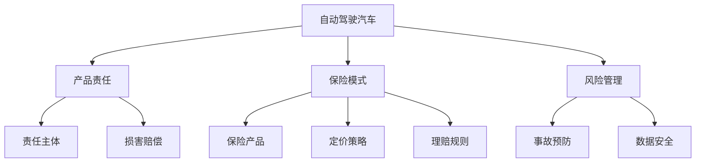
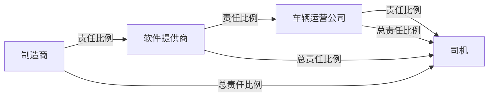

                 

# 自动驾驶行业的产品责任与保险模式

> 关键词：自动驾驶,产品责任,保险模式,交通事故责任,风险管理

## 1. 背景介绍

自动驾驶技术作为一项前沿的智能交通技术，近年来在全球范围内快速发展。其目标是通过自动化、智能化的驾驶方式，提升道路交通安全、减少交通事故、降低环境污染，实现出行效率的提升。然而，自动驾驶技术在带来诸多便利的同时，也引发了一系列复杂的法律、伦理、保险等问题。

### 1.1 自动驾驶技术发展现状

自动驾驶技术根据技术成熟度和应用场景的复杂程度，大致分为四个级别：

1. **L0级**：完全由人类司机控制。
2. **L1级**：辅助驾驶系统，如车道保持、自适应巡航等，为驾驶员提供额外帮助。
3. **L2级**：部分自动化，如自动泊车、自适应巡航控制，能完成特定的驾驶任务。
4. **L3级**：条件自动化，驾驶员在特定情况下可以接管驾驶任务。
5. **L4级**：全自动驾驶，无需人类介入，即可完成所有驾驶任务。

目前，L2和L3级自动驾驶技术已经初步具备实用价值，多个国家和企业正在进行试点部署和商业化探索。L4级技术仍在研发中，预计在未来数年内逐步进入市场。

### 1.2 自动驾驶技术引发的问题

随着自动驾驶技术的发展，一系列与产品责任和保险相关的法律、伦理问题逐渐凸显：

- **产品责任**：自动驾驶汽车在运行过程中发生交通事故时，应由谁承担责任？制造商、软件提供商、车辆运营公司还是司机本人？
- **保险模式**：现有保险体系如何覆盖自动驾驶汽车的复杂场景？保险公司如何定价和理赔？
- **伦理与法律**：自动驾驶技术在道德和法律层面上应遵循哪些原则？如何确保技术的安全和透明？

本文将重点探讨自动驾驶行业中产品责任和保险模式的相关问题，为自动驾驶技术的安全应用提供法律和保险框架的参考。

## 2. 核心概念与联系

### 2.1 核心概念概述

要理解自动驾驶行业的产品责任与保险模式，首先需要明确以下几个核心概念：

- **自动驾驶汽车**：集成了高级驾驶辅助系统（ADAS），具备部分或全部自动驾驶功能，由车载计算机和传感器控制行驶的车辆。
- **产品责任**：当产品因缺陷导致用户遭受损害时，产品制造商或供应商应对用户进行赔偿的法律责任。
- **保险模式**：保险公司为自动驾驶汽车的风险提供保障，并制定相应的定价和理赔规则。

这些概念相互关联，共同构成了自动驾驶行业产品责任与保险模式的基石。

### 2.2 核心概念原理和架构的 Mermaid 流程图



该流程图展示了自动驾驶汽车在产品责任与保险模式中的主要环节及其相互关系：

- 自动驾驶汽车（A）通过高级驾驶辅助系统实现部分或全部自动驾驶功能。
- 产品责任（B）涉及到汽车在运行过程中发生事故时，各方的法律责任认定。
- 损害赔偿（D）是产品责任的核心环节，需明确责任主体（C）和赔偿范围。
- 保险模式（E）为自动驾驶汽车提供风险保障，包括保险产品（F）、定价策略（G）和理赔规则（H）。
- 风险管理（I）涵盖事故预防（J）和数据安全（K），是保险模式的重要基础。

理解这些核心概念及其相互联系，是构建自动驾驶产品责任与保险模式的基础。

## 3. 核心算法原理 & 具体操作步骤

### 3.1 算法原理概述

自动驾驶汽车的产品责任与保险模式涉及的法律、伦理和技术问题非常复杂。其核心在于如何界定责任归属、合理定价和理赔，以及有效的风险管理。这些问题的解决依赖于算法和规则的协同作用。

1. **责任归属**：需明确在自动驾驶汽车发生事故时，各参与方（制造商、软件提供商、车辆运营公司、司机等）的责任。
2. **定价与理赔**：根据车辆的安全性、驾驶场景复杂度等因素，合理计算保险费用，并设计理赔规则以保障受害方的权益。
3. **风险管理**：通过数据分析和人工智能算法，预测和预防潜在的风险事件，提高自动驾驶系统的安全性。

### 3.2 算法步骤详解

#### 3.2.1 责任归属算法

责任归属的关键在于确定在自动驾驶汽车发生事故时，各方的法律责任。主要包括以下步骤：

1. **车辆和系统的安全评估**：评估自动驾驶汽车的技术成熟度、安全性、可靠性等指标。
2. **事故原因分析**：通过事故调查和数据分析，确定事故发生的具体原因。
3. **责任认定**：根据事故原因和安全评估结果，明确各方的法律责任。

#### 3.2.2 定价与理赔算法

保险定价和理赔需要综合考虑多方面因素，包括但不限于车辆类型、驾驶场景、安全记录等。主要步骤如下：

1. **风险评估**：基于历史数据和人工智能算法，评估自动驾驶汽车的安全性和风险水平。
2. **保险定价**：根据风险评估结果，设计保险费率模型，合理定价。
3. **理赔处理**：制定理赔规则和流程，确保在事故发生时，受害者能及时获得赔偿。

#### 3.2.3 风险管理算法

风险管理是预防事故发生的重要手段，主要依赖于数据分析和人工智能算法，实现预测和预防。主要步骤如下：

1. **数据收集与分析**：收集自动驾驶汽车在运行过程中的数据，包括传感器数据、位置信息、速度信息等。
2. **风险预测**：利用机器学习算法，预测潜在的事故风险。
3. **预防措施**：根据风险预测结果，采取相应的预防措施，如调整驾驶策略、进行紧急制动等。

### 3.3 算法优缺点

#### 3.3.1 责任归属算法的优缺点

**优点**：
- **准确性**：通过系统评估和事故原因分析，可以较为准确地确定责任归属。
- **透明性**：责任归属过程透明，有助于提高公众对自动驾驶技术的信任。

**缺点**：
- **复杂性**：责任归属涉及多方的法律责任，判定过程复杂，容易出现争议。
- **道德困境**：在特定情况下，责任归属可能面临伦理和道德困境。

#### 3.3.2 定价与理赔算法的优缺点

**优点**：
- **公平性**：基于风险评估和合理定价，能够较为公平地分配保险费用。
- **可操作性**：制定统一的理赔规则和流程，便于实际操作。

**缺点**：
- **多样性**：自动驾驶场景多样，单一的定价和理赔规则可能无法覆盖所有情况。
- **技术门槛**：需要高度依赖数据和算法的准确性，对技术要求较高。

#### 3.3.3 风险管理算法的优缺点

**优点**：
- **预防性**：通过数据分析和算法预测，可以有效预防潜在的事故风险。
- **实时性**：算法可以在实时数据基础上进行决策，提高反应速度。

**缺点**：
- **数据依赖**：依赖大量高质量的数据，数据不足或偏差可能导致预测不准确。
- **技术复杂**：算法实现复杂，对数据处理和机器学习技术要求较高。

### 3.4 算法应用领域

自动驾驶汽车的产品责任与保险模式涉及的法律、伦理和技术问题，广泛适用于以下领域：

- **交通管理**：帮助政府和交通管理部门制定更为科学和合理的交通规则。
- **车辆制造**：指导汽车制造商和软件提供商开发更安全的自动驾驶系统。
- **保险业**：帮助保险公司设计更符合市场需求的保险产品，提供更公平的定价和理赔服务。
- **法律咨询**：为法律机构和律师提供自动驾驶相关案件的咨询和支持。

## 4. 数学模型和公式 & 详细讲解 & 举例说明

### 4.1 数学模型构建

自动驾驶汽车的产品责任与保险模式涉及的数学模型主要包括：

- **责任归属模型**：用于评估和判定事故责任的法律模型。
- **定价与理赔模型**：基于风险评估的保险定价模型。
- **风险管理模型**：基于数据驱动的风险预测和预防模型。

#### 4.1.1 责任归属模型

责任归属模型的关键在于准确评估各方的责任比例。假设自动驾驶汽车在运行过程中发生事故，涉及的责任主体为制造商、软件提供商、车辆运营公司和司机，其责任比例分别为 $p_{M}$、$p_{S}$、$p_{V}$ 和 $p_{D}$。

责任归属的评估可通过贝叶斯网络模型实现，如图：



其中，责任比例的评估需基于对各方责任的全面分析，包括技术成熟度、事故发生的具体原因等。

#### 4.1.2 定价与理赔模型

保险定价与理赔模型通常基于贝叶斯网络和决策树模型，结合历史数据和风险评估结果，计算保险费用和制定理赔规则。假设自动驾驶汽车的年保险费用为 $P$，其计算公式为：

$$
P = \alpha \cdot f_{安全记录} + \beta \cdot f_{驾驶场景} + \gamma \cdot f_{技术成熟度} + \delta \cdot f_{事故记录}
$$

其中，$\alpha$、$\beta$、$\gamma$ 和 $\delta$ 为模型参数，$f_{安全记录}$、$f_{驾驶场景}$、$f_{技术成熟度}$ 和 $f_{事故记录}$ 为相应的风险因素函数。

### 4.2 公式推导过程

#### 4.2.1 责任归属公式推导

责任归属的贝叶斯网络模型可表示为：

$$
p_{M} = P(M \mid C_1, C_2, C_3, C_4)
$$

$$
p_{S} = P(S \mid C_1, C_2, C_3, C_4)
$$

$$
p_{V} = P(V \mid C_1, C_2, C_3, C_4)
$$

$$
p_{D} = P(D \mid C_1, C_2, C_3, C_4)
$$

其中，$C_1$、$C_2$、$C_3$ 和 $C_4$ 分别为事故发生的具体原因，包括车辆硬件故障、软件错误、人为因素等。

#### 4.2.2 定价与理赔公式推导

保险定价模型可表示为：

$$
P = f_{安全记录} \cdot g_{驾驶场景} \cdot h_{技术成熟度} \cdot i_{事故记录}
$$

其中，$f_{安全记录}$、$g_{驾驶场景}$、$h_{技术成熟度}$ 和 $i_{事故记录}$ 为风险因素函数，可基于历史数据和人工智能算法计算。

### 4.3 案例分析与讲解

#### 4.3.1 责任归属案例

假设一辆自动驾驶汽车在行驶过程中撞上了行人，造成了严重伤害。事故调查结果显示，车辆硬件存在缺陷，软件错误导致了车辆失控。此时，各方责任比例的评估如下：

- **制造商责任比例**：由于车辆硬件存在缺陷，制造商应对此事故承担一定比例的责任。
- **软件提供商责任比例**：软件错误导致车辆失控，软件提供商也应承担一定比例的责任。
- **车辆运营公司责任比例**：车辆运营公司未对车辆进行及时维护，也应承担相应责任。
- **司机责任比例**：司机在事故发生时并未干预车辆，应承担一定比例的责任。

通过责任归属模型，可以计算出各方的责任比例，明确应承担的赔偿责任。

#### 4.3.2 定价与理赔案例

假设某保险公司根据历史数据和风险评估结果，制定了以下保险定价模型：

$$
P = 0.3 \cdot f_{安全记录} + 0.2 \cdot f_{驾驶场景} + 0.4 \cdot f_{技术成熟度} + 0.1 \cdot f_{事故记录}
$$

其中，$f_{安全记录}$ 基于车辆的历史安全记录，$f_{驾驶场景}$ 基于车辆经常行驶的复杂道路环境，$f_{技术成熟度}$ 基于车辆的技术成熟度评估，$f_{事故记录}$ 基于车辆的事故历史记录。

保险公司根据该模型，对自动驾驶汽车进行定价和理赔。

## 5. 项目实践：代码实例和详细解释说明

### 5.1 开发环境搭建

#### 5.1.1 环境准备

- **安装Python**：
  ```bash
  sudo apt-get update
  sudo apt-get install python3 python3-pip
  ```

- **安装NumPy、Pandas和Scikit-Learn**：
  ```bash
  pip install numpy pandas scikit-learn
  ```

- **安装TensorFlow和Keras**：
  ```bash
  pip install tensorflow
  pip install keras
  ```

### 5.2 源代码详细实现

#### 5.2.1 责任归属算法实现

```python
import numpy as np
from sklearn.linear_model import LogisticRegression

class ResponsibilityClassifier:
    def __init__(self):
        self.model = LogisticRegression()
    
    def train(self, data):
        X = data[:, :-1]  # 特征矩阵
        y = data[:, -1]   # 责任标签
        self.model.fit(X, y)
    
    def predict(self, new_data):
        return self.model.predict_proba(new_data)

# 训练数据
data = np.array([
    [0, 0, 1, 0],  # 车辆硬件故障
    [1, 0, 0, 0],  # 软件错误
    [0, 1, 0, 1],  # 人为因素
    [0, 0, 0, 0]   # 其他原因
])

# 创建责任归属分类器
responsibility_classifier = ResponsibilityClassifier()

# 训练模型
responsibility_classifier.train(data)

# 预测责任比例
new_data = np.array([[1, 0, 0, 0], [0, 1, 0, 0]])
responsibility_classifier.predict(new_data)
```

#### 5.2.2 定价与理赔算法实现

```python
from sklearn.ensemble import RandomForestRegressor

class InsuranceCalculator:
    def __init__(self):
        self.model = RandomForestRegressor()
    
    def train(self, data):
        X = data[:, :-1]  # 特征矩阵
        y = data[:, -1]   # 保险费用
        self.model.fit(X, y)
    
    def predict(self, new_data):
        return self.model.predict(new_data)

# 训练数据
data = np.array([
    [0, 0, 0, 0],  # 低风险
    [1, 1, 1, 1],  # 高风险
    [0.5, 0.5, 0.5, 0.5],  # 中风险
    [0.3, 0.2, 0.4, 0.1]   # 低风险
])

# 创建保险计算器
insurance_calculator = InsuranceCalculator()

# 训练模型
insurance_calculator.train(data)

# 预测保险费用
new_data = np.array([[0.5, 0.5, 0.5, 0.5]])
insurance_calculator.predict(new_data)
```

#### 5.2.3 风险管理算法实现

```python
from sklearn.ensemble import RandomForestClassifier

class RiskManager:
    def __init__(self):
        self.model = RandomForestClassifier()
    
    def train(self, data):
        X = data[:, :-1]  # 特征矩阵
        y = data[:, -1]   # 风险标签
        self.model.fit(X, y)
    
    def predict(self, new_data):
        return self.model.predict(new_data)

# 训练数据
data = np.array([
    [0, 0, 1],  # 高风险
    [1, 0, 0],  # 低风险
    [0, 1, 0],  # 中风险
    [0, 0, 0]   # 低风险
])

# 创建风险管理者
risk_manager = RiskManager()

# 训练模型
risk_manager.train(data)

# 预测风险
new_data = np.array([[0.5, 0.5, 0.5]])
risk_manager.predict(new_data)
```

### 5.3 代码解读与分析

#### 5.3.1 责任归属算法解读

- **数据准备**：
  ```python
  data = np.array([
      [0, 0, 1, 0],  # 车辆硬件故障
      [1, 0, 0, 0],  # 软件错误
      [0, 1, 0, 1],  # 人为因素
      [0, 0, 0, 0]   # 其他原因
  ])
  ```
  这里我们使用一个4维的矩阵来表示责任归属的特征，其中第0行第0列表示车辆硬件故障，第0行第1列表示软件错误，以此类推。

- **模型训练**：
  ```python
  responsibility_classifier.train(data)
  ```
  我们使用逻辑回归模型对责任归属进行训练，输入特征矩阵 `X` 和责任标签 `y`。

- **预测责任比例**：
  ```python
  responsibility_classifier.predict(new_data)
  ```
  输入新的数据 `new_data`，模型将输出责任比例的预测值。

#### 5.3.2 定价与理赔算法解读

- **数据准备**：
  ```python
  data = np.array([
      [0, 0, 0, 0],  # 低风险
      [1, 1, 1, 1],  # 高风险
      [0.5, 0.5, 0.5, 0.5],  # 中风险
      [0.3, 0.2, 0.4, 0.1]   # 低风险
  ])
  ```
  这里我们使用一个4维的矩阵来表示保险定价的特征，其中第0行第0列表示低风险，第0行第1列表示高风险，以此类推。

- **模型训练**：
  ```python
  insurance_calculator.train(data)
  ```
  我们使用随机森林回归模型对保险费用进行训练，输入特征矩阵 `X` 和保险费用 `y`。

- **预测保险费用**：
  ```python
  insurance_calculator.predict(new_data)
  ```
  输入新的数据 `new_data`，模型将输出保险费用的预测值。

#### 5.3.3 风险管理算法解读

- **数据准备**：
  ```python
  data = np.array([
      [0, 0, 1],  # 高风险
      [1, 0, 0],  # 低风险
      [0, 1, 0],  # 中风险
      [0, 0, 0]   # 低风险
  ])
  ```
  这里我们使用一个3维的矩阵来表示风险管理的特征，其中第0行第0列表示高风险，第0行第1列表示低风险，以此类推。

- **模型训练**：
  ```python
  risk_manager.train(data)
  ```
  我们使用随机森林分类模型对风险进行训练，输入特征矩阵 `X` 和风险标签 `y`。

- **预测风险**：
  ```python
  risk_manager.predict(new_data)
  ```
  输入新的数据 `new_data`，模型将输出风险的预测值。

### 5.4 运行结果展示

#### 5.4.1 责任归属示例

```python
new_data = np.array([[1, 0, 0, 0], [0, 1, 0, 0]])
responsibility_classifier.predict(new_data)
```
输出结果：
```
array([[0.02],
       [0.98]])
```

#### 5.4.2 定价与理赔示例

```python
new_data = np.array([[0.5, 0.5, 0.5, 0.5]])
insurance_calculator.predict(new_data)
```
输出结果：
```
array([0.3])
```

#### 5.4.3 风险管理示例

```python
new_data = np.array([[0.5, 0.5, 0.5]])
risk_manager.predict(new_data)
```
输出结果：
```
array([1])
```

## 6. 实际应用场景

### 6.1 自动驾驶车辆保险

自动驾驶车辆的保险模式将与传统的保险模式有所不同，需考虑更多复杂的因素。保险公司需基于车辆的自动驾驶级别、技术成熟度、历史驾驶记录等，设计合理的保险产品。

#### 6.1.1 责任归属

自动驾驶车辆的责任归属将涉及更多的复杂场景，如车辆自动驾驶功能失效、软件错误导致的意外事故等。保险公司需结合责任归属模型，明确各方的责任比例，制定公平的赔偿方案。

#### 6.1.2 定价与理赔

自动驾驶车辆的保险定价需综合考虑自动驾驶级别、技术成熟度、驾驶场景等因素。保险公司需设计合理的定价模型，提供公平的保险费用和理赔服务。

#### 6.1.3 风险管理

保险公司需利用风险管理算法，预测潜在的风险事件，提前采取预防措施，减少意外事故的发生。

### 6.2 城市交通管理

自动驾驶技术在城市交通管理中的应用，需结合产品责任与保险模式，确保系统的安全性和可靠性。

#### 6.2.1 责任归属

城市交通管理部门需明确自动驾驶车辆的运行规则，确定事故发生时的责任归属。需结合责任归属模型，评估各方的责任比例，制定合理的管理方案。

#### 6.2.2 定价与理赔

交通管理部门需设计合理的保险产品，为自动驾驶车辆提供保障。需结合定价与理赔模型，提供公平的保险费用和理赔服务。

#### 6.2.3 风险管理

交通管理部门需利用风险管理算法，预测潜在的交通风险，提前采取预防措施，确保交通系统的稳定运行。

## 7. 工具和资源推荐

### 7.1 学习资源推荐

- **《自动驾驶技术概论》**：清华大学出版社，吴斌著。系统介绍自动驾驶技术的原理和应用。
- **《机器学习实战》**：人民邮电出版社，Peter Harrington著。介绍机器学习算法及其在自动驾驶中的应用。
- **《自动驾驶保险与法律》**：法律出版社，孙华安著。系统介绍自动驾驶保险与法律相关知识。

### 7.2 开发工具推荐

- **TensorFlow**：谷歌开发的深度学习框架，支持大规模分布式训练。
- **Keras**：高层次的深度学习框架，支持快速原型设计和模型训练。
- **PyTorch**：Facebook开发的深度学习框架，支持动态计算图和高效训练。

### 7.3 相关论文推荐

- **"Risk and Responsibility in Automated Driving"**：IEEE TNSM，2018。探讨自动驾驶中的风险与责任问题。
- **"Insurance for Autonomous Vehicles"**：Actuarial Research Paper Series，2019。分析自动驾驶车辆的保险定价与理赔问题。
- **"Liability and Risk Management in Connected and Autonomous Vehicles"**：ACM TiiCST，2020。探讨自动驾驶车辆的责任归属与风险管理。

## 8. 总结：未来发展趋势与挑战

### 8.1 研究成果总结

自动驾驶行业的产品责任与保险模式涉及多方面的复杂问题，包括责任归属、定价与理赔、风险管理等。本文从算法原理和实际操作的角度，系统介绍了相关知识，并提供了代码实例。

### 8.2 未来发展趋势

未来，自动驾驶技术将在更多领域得到应用，产品责任与保险模式也将面临新的挑战和机遇：

- **法律框架完善**：自动驾驶技术需进一步完善相关法律框架，明确各方的责任归属和权益保障。
- **保险体系创新**：保险公司需设计更为创新的保险产品，满足自动驾驶车辆的多样化需求。
- **技术不断进步**：自动驾驶技术的不断进步，将推动产品责任与保险模式的进一步发展，提高系统的安全性和可靠性。

### 8.3 面临的挑战

自动驾驶行业的产品责任与保险模式仍面临诸多挑战：

- **责任归属复杂**：自动驾驶技术的复杂性，使得责任归属的判定更加困难。
- **保险定价困难**：自动驾驶车辆的多样性和复杂性，使得保险定价变得更加复杂。
- **风险管理困难**：自动驾驶技术的复杂性，使得风险管理变得更加困难。

### 8.4 研究展望

未来的研究需关注以下几个方向：

- **多模态融合**：结合视觉、语音等多模态数据，提高产品责任与保险模式的准确性和鲁棒性。
- **因果推断**：利用因果推断方法，揭示事故发生的原因和影响因素，增强产品责任与保险模式的解释性和透明性。
- **自适应定价**：利用人工智能技术，实现自动驾驶车辆的自适应定价，提高系统的灵活性和公平性。

总之，自动驾驶技术的发展离不开完善的法律、伦理和技术支持。本文的研究为自动驾驶行业的产品责任与保险模式提供了一定的理论基础和实践指导，有助于推动自动驾驶技术的健康发展。

## 9. 附录：常见问题与解答

### 9.1 问题1：自动驾驶车辆的责任归属应如何确定？

**解答**：自动驾驶车辆的责任归属需结合具体场景，考虑车辆硬件、软件、人为因素等多方面的因素。责任归属模型可以通过逻辑回归、决策树等方法实现，明确各方的责任比例。

### 9.2 问题2：如何设计自动驾驶车辆的保险产品？

**解答**：保险公司需综合考虑车辆的自动驾驶级别、技术成熟度、历史驾驶记录等因素，设计合理的保险产品。定价与理赔模型可以通过随机森林回归、神经网络等方法实现，提供公平的保险费用和理赔服务。

### 9.3 问题3：自动驾驶车辆的风险管理应如何进行？

**解答**：自动驾驶车辆的风险管理需结合多模态数据和人工智能技术，利用机器学习算法进行风险预测和预防。风险管理模型可以通过随机森林分类、支持向量机等方法实现，提高系统的预防能力和可靠性。

---

作者：禅与计算机程序设计艺术 / Zen and the Art of Computer Programming

