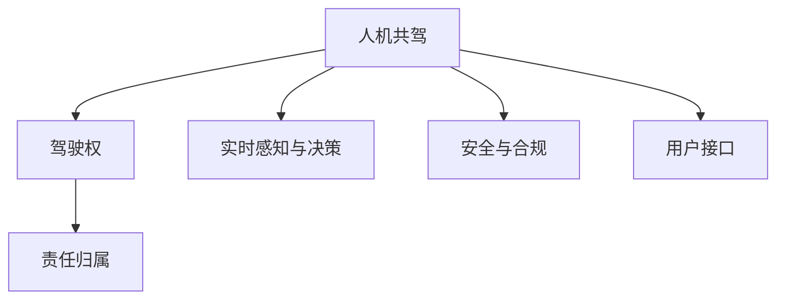

                 

## 1. 背景介绍

### 1.1 问题由来

随着人工智能和自动驾驶技术的发展，人机共驾（Human-Machine Shared Driving, HMSD）成为一个热门话题。它不仅关乎技术实现，更涉及到法律、伦理、责任划分等诸多复杂问题。如何合理界定驾驶权责，不仅是系统设计的关键，也是保障用户利益、推动行业健康发展的基石。本文将聚焦于自动驾驶行业的人机共驾权责划分原则，系统梳理相关概念、核心算法和实践案例，为相关从业者提供参考。

### 1.2 问题核心关键点

人机共驾权责划分问题核心关键点在于：

- 如何界定驾驶权的分配与切换时机。
- 权责如何随驾驶状态变化动态调整。
- 事故发生时如何确定责任归属。
- 如何确保驾驶过程中的安全与合规性。

本文将围绕这些核心关键点，深入探讨人机共驾的权责划分原则。

### 1.3 问题研究意义

明确人机共驾权责划分原则，对提升自动驾驶技术安全性、推动法规政策制定、增强用户信任、促进产业健康发展具有重要意义。

- 提升安全性：合理划分权责，可以促使系统在必要时刻主动接管，减少人为失误。
- 推动法规：清晰界定权责，有利于政府和行业制定相关法律法规，规范行业行为。
- 增强信任：明确的权责分配，可以增强用户对系统的信任，加速市场普及。
- 促进发展：清晰界定权责，有助于引导资源投入，提升行业整体水平。

## 2. 核心概念与联系

### 2.1 核心概念概述

为深入理解人机共驾权责划分原则，本节将介绍几个关键概念：

- 人机共驾（Human-Machine Shared Driving）：指人类和机器共同参与驾驶，双方负责各自擅长的任务，共同完成驾驶任务。
- 驾驶权（Driving Authority）：指驾驶操作的主导权，通常由人类或机器掌握。
- 责任归属（Liability Allocation）：指驾驶过程中的决策结果和事故责任，由谁承担。
- 安全与合规（Safety & Compliance）：指在驾驶过程中确保系统的安全性和遵守相关法规。
- 实时感知与决策（Real-time Perception & Decision）：指系统实时感知环境、动态做出驾驶决策的能力。
- 用户接口（User Interface）：指系统与用户交互的界面，用于显示驾驶状态和提示操作。

这些概念之间的联系可通过以下Mermaid流程图来展示：



这个流程图展示了人机共驾的几个核心概念及其关联：

1. 人机共驾是基础，分为驾驶权、责任归属、实时感知与决策和安全与合规四个核心维度。
2. 驾驶权是决定权责的关键，不同驾驶权状态下权责不同。
3. 实时感知与决策、安全与合规是执行权责的基础保障。
4. 用户接口是用户和系统交互的界面，通过反馈与操作保障权责执行。

## 3. 核心算法原理 & 具体操作步骤
### 3.1 算法原理概述

人机共驾权责划分的算法原理主要包括：

- 驾驶权动态切换机制：基于实时感知与决策结果，动态调整驾驶权的归属。
- 决策责任划分算法：在驾驶权归属不同时，根据不同驾驶状态和决策行为，合理划分责任归属。
- 安全与合规算法：确保系统在驾驶过程中满足安全性要求，符合相关法规。

### 3.2 算法步骤详解

#### 3.2.1 驾驶权动态切换算法

1. **实时感知**：系统通过传感器（如摄像头、雷达、激光雷达等）实时获取环境信息。
2. **决策推理**：系统根据感知结果，通过模型推理得出驾驶决策。
3. **权责评估**：系统评估当前决策是否由人类负责。
4. **权责切换**：根据权责评估结果，动态切换驾驶权。

#### 3.2.2 决策责任划分算法

1. **定义决策状态**：系统根据当前驾驶环境，定义不同的决策状态。
2. **状态匹配**：系统将当前决策状态与预设规则进行匹配。
3. **责任归属**：根据匹配结果，确定决策责任归属。

#### 3.2.3 安全与合规算法

1. **环境感知**：系统实时监测周边环境，识别潜在危险。
2. **决策约束**：根据法规要求，限制系统决策范围。
3. **风险评估**：系统评估决策风险，确保符合安全与合规要求。

### 3.3 算法优缺点

人机共驾权责划分的算法优点包括：

- 提升安全性：动态权责切换可以及时应对突发情况。
- 合理责任划分：基于实时感知与决策，确保权责归属合理。
- 强化合规性：实时环境感知和决策约束确保符合法规。

缺点主要包括：

- 算法复杂度高：需要实时处理大量数据，计算量大。
- 环境变化影响：外部环境复杂多变，算法适应性要求高。
- 用户信任问题：用户可能对算法决策有疑惑，影响信任。

### 3.4 算法应用领域

人机共驾权责划分的算法主要应用于以下领域：

- 自动驾驶车辆：车辆行驶过程中，系统需动态切换驾驶权，合理划分权责，确保安全。
- 无人驾驶机器人：机器人执行任务时，需根据实时环境变化，动态调整权责。
- 航空器与船只：在自主模式下，系统需实时评估决策风险，确保符合法规。

## 4. 数学模型和公式 & 详细讲解 & 举例说明

### 4.1 数学模型构建

本节将使用数学语言描述人机共驾权责划分的模型构建过程。

设系统在驾驶过程中，当前驾驶状态为 $S_t$，实时感知结果为 $O_t$，系统决策为 $A_t$，环境约束为 $C_t$，驾驶权为 $D_t$。则权责划分模型可以表示为：

$$
D_t = f(S_t, O_t, A_t, C_t)
$$

其中 $f$ 为权责划分函数，需根据不同驾驶状态、感知结果和决策行为，动态调整驾驶权 $D_t$。

### 4.2 公式推导过程

考虑一种简单场景，假设系统根据实时感知结果 $O_t$，生成决策 $A_t$。系统需判断当前驾驶权 $D_t$ 是否应由人类负责。

1. **感知质量评估**：计算 $O_t$ 的质量指标 $Q(O_t)$。
2. **决策质量评估**：计算 $A_t$ 的质量指标 $Q(A_t)$。
3. **权责切换阈值**：设定阈值 $\theta$，当 $Q(O_t) \leq \theta$ 或 $Q(A_t) \leq \theta$ 时，系统自动切换驾驶权 $D_t$。

具体公式如下：

$$
D_t = \begin{cases}
H, & Q(O_t) > \theta \wedge Q(A_t) > \theta \\
M, & \text{otherwise}
\end{cases}
$$

其中 $H$ 表示人类负责，$M$ 表示系统负责。

### 4.3 案例分析与讲解

以自动驾驶车辆为例，说明权责划分的实际应用。

1. **初始状态**：车辆在人类驾驶模式下启动，初始驾驶权 $D_0 = H$。
2. **实时感知与决策**：系统通过传感器获取环境信息，通过模型推理得出决策，实时感知结果 $O_t$ 和决策结果 $A_t$。
3. **权责评估**：根据 $O_t$ 和 $A_t$ 的质量指标 $Q(O_t)$ 和 $Q(A_t)$，系统评估是否切换驾驶权。
4. **权责切换**：若 $Q(O_t) \leq \theta$ 或 $Q(A_t) \leq \theta$，系统切换驾驶权，人类接管。
5. **事故发生**：若系统决策导致事故，根据切换时刻的驾驶权，确定责任归属。

## 5. 项目实践：代码实例和详细解释说明

### 5.1 开发环境搭建

为了进行人机共驾权责划分的开发实践，需要搭建一个模拟驾驶环境的开发环境。以下是具体步骤：

1. **环境准备**：安装Python、PyTorch等必要的开发环境。
2. **传感器模拟**：使用模拟传感器模块，获取实时环境数据。
3. **系统模型构建**：使用深度学习模型构建实时感知与决策系统。
4. **用户接口设计**：设计用户界面，展示驾驶状态和提示操作。
5. **测试环境搭建**：搭建虚拟驾驶环境，进行系统测试。

### 5.2 源代码详细实现

以下是一个简单的代码实现，说明如何实现驾驶权动态切换和决策责任划分：

```python
import torch
from torch import nn, optim
import numpy as np

class Perception(nn.Module):
    def __init__(self):
        super(Perception, self).__init__()
        self.encoder = nn.Sequential(
            nn.Conv2d(3, 64, kernel_size=3, stride=1, padding=1),
            nn.ReLU(),
            nn.MaxPool2d(kernel_size=2, stride=2)
        )
        self.decoder = nn.Sequential(
            nn.Conv2d(64, 128, kernel_size=3, stride=1, padding=1),
            nn.ReLU(),
            nn.MaxPool2d(kernel_size=2, stride=2),
            nn.Conv2d(128, 128, kernel_size=3, stride=1, padding=1),
            nn.ReLU(),
            nn.MaxPool2d(kernel_size=2, stride=2),
            nn.Flatten(),
            nn.Linear(128 * 4 * 4, 64),
            nn.ReLU(),
            nn.Linear(64, 1)
        )

    def forward(self, x):
        x = self.encoder(x)
        x = self.decoder(x)
        return x

class Decision(nn.Module):
    def __init__(self):
        super(Decision, self).__init__()
        self.fc1 = nn.Linear(1, 64)
        self.fc2 = nn.Linear(64, 1)

    def forward(self, x):
        x = self.fc1(x)
        x = torch.sigmoid(x)
        x = self.fc2(x)
        return x

class Liability(nn.Module):
    def __init__(self):
        super(Liability, self).__init__()
        self.fc1 = nn.Linear(1, 32)
        self.fc2 = nn.Linear(32, 1)

    def forward(self, x):
        x = self.fc1(x)
        x = torch.sigmoid(x)
        x = self.fc2(x)
        return x

class SharedDriving(nn.Module):
    def __init__(self):
        super(SharedDriving, self).__init__()
        self.perception = Perception()
        self.decision = Decision()
        self.liability = Liability()

    def forward(self, x):
        x = self.perception(x)
        x = self.decision(x)
        x = self.liability(x)
        return x

# 模拟实时感知结果
def simulate_perception():
    perception = Perception()
    x = torch.randn(3, 64, 64)  # 模拟输入
    return perception(x)

# 模拟决策结果
def simulate_decision(perception):
    decision = Decision()
    x = perception
    return decision(x)

# 模拟责任评估结果
def simulate_liability(decision):
    liability = Liability()
    x = decision
    return liability(x)

# 模拟驾驶权切换
def simulate_shared_driving(perception, decision, liability):
    shared_driving = SharedDriving()
    x = perception
    return shared_driving(x)

# 运行代码
def run_example():
    perception = Perception()
    x = torch.randn(3, 64, 64)  # 模拟输入
    decision = Decision()
    liability = Liability()
    shared_driving = SharedDriving()

    x = simulate_perception()
    x = simulate_decision(x)
    x = simulate_liability(x)
    x = simulate_shared_driving(x, x, x)

run_example()
```

### 5.3 代码解读与分析

上述代码展示了人机共驾权责划分的基本流程：

1. **感知模块**：用于模拟实时环境感知，获取感知结果。
2. **决策模块**：根据感知结果生成决策。
3. **责任评估模块**：评估决策的质量，判断是否需要切换驾驶权。
4. **权责切换模块**：结合感知、决策和责任评估结果，动态切换驾驶权。

代码中使用了PyTorch深度学习框架，定义了感知、决策和责任评估模块。模拟实时感知、决策和责任评估过程，并实现驾驶权动态切换。

### 5.4 运行结果展示

运行上述代码后，系统可以模拟驾驶权动态切换过程，输出不同的驾驶权状态和决策结果。

## 6. 实际应用场景

### 6.1 智能驾驶车

在智能驾驶车中，人机共驾权责划分技术可以应用于如下场景：

1. **自动驾驶模式**：在无人驾驶模式下，系统负责感知与决策，需要实时评估决策质量，切换驾驶权。
2. **辅助驾驶模式**：在辅助驾驶模式下，人类负责部分驾驶任务，系统负责实时感知与决策，合理分配驾驶权。
3. **紧急接管模式**：在紧急情况下，系统自动接管，切换驾驶权，确保安全。

### 6.2 无人驾驶机器

无人驾驶机器人在执行任务时，人机共驾权责划分技术可以应用于如下场景：

1. **自动导航模式**：在自主导航模式下，系统负责感知与决策，需要实时评估决策质量，切换驾驶权。
2. **人工干预模式**：在人工干预模式下，人类负责部分驾驶任务，系统负责实时感知与决策，合理分配驾驶权。
3. **异常处理模式**：在异常情况下，系统自动接管，切换驾驶权，确保任务完成。

## 7. 工具和资源推荐

### 7.1 学习资源推荐

为帮助开发者深入理解人机共驾权责划分技术，推荐以下学习资源：

1. 《人机共驾：自动驾驶与AI技术》系列书籍：系统介绍人机共驾的原理、技术和应用，适合技术开发者阅读。
2. Udacity自动驾驶课程：涵盖自动驾驶的多个方面，包括人机共驾的算法和实现。
3. NVIDIA Deep Learning Academy：提供深度学习及自动驾驶相关课程，涵盖人机共驾技术的理论基础和实践技巧。
4. 《人工智能道德与法律》课程：了解人工智能伦理和法律框架，帮助开发者在实践中遵循相关规定。

### 7.2 开发工具推荐

为支持人机共驾权责划分技术的开发实践，推荐以下开发工具：

1. PyTorch：强大的深度学习框架，支持动态计算图，适合进行复杂的感知与决策模型训练。
2. TensorFlow：流行的深度学习框架，支持分布式训练和推理，适合处理大规模数据。
3. ROS（Robot Operating System）：机器人操作系统，支持多机器人协作和感知，适合开发无人驾驶机器人。
4. RT10：实时操作系统，支持传感器数据处理和系统调度，适合开发智能驾驶车。
5. VS Code：轻量级编辑器，支持代码编辑和调试，适合快速迭代开发。

### 7.3 相关论文推荐

为帮助开发者深入理解人机共驾权责划分技术，推荐以下相关论文：

1. "Shared Autonomy for Automated Vehicles: A Survey" by Son et al.：综述了自动驾驶中的共享控制技术，包括权责划分和切换算法。
2. "Autonomous Vehicles: Understanding, Acceptance, and Regulation" by Scherer et al.：探讨了自动驾驶的伦理、法律和社会问题，包括权责划分和风险管理。
3. "A Survey on Human-Machine Shared-Driving and Shared-Steering" by Sivaprasath et al.：综述了人机共驾的多种技术和应用场景，包括权责划分和系统设计。
4. "Deep Learning and Autonomous Vehicles: A Survey" by Huang et al.：综述了深度学习在自动驾驶中的应用，包括感知、决策和权责划分。

## 8. 总结：未来发展趋势与挑战

### 8.1 研究成果总结

人机共驾权责划分技术作为自动驾驶的核心技术之一，已经取得诸多进展，但仍面临诸多挑战。未来需关注以下方向：

1. **算法优化**：提高实时感知与决策的准确性，优化权责切换算法，确保驾驶权的合理分配。
2. **法规制定**：推动法规政策的制定和完善，明确权责划分标准，规范行业行为。
3. **用户信任**：增强用户对系统的信任，提升人机交互体验，加速技术普及。
4. **安全性提升**：强化系统安全性和合规性，确保在各种驾驶模式下都能保障安全。

### 8.2 未来发展趋势

人机共驾权责划分技术未来将呈现以下趋势：

1. **深度学习的应用**：随着深度学习的发展，感知与决策模块将更加高效准确，提升系统性能。
2. **多模态融合**：融合视觉、听觉、雷达等多模态信息，提升系统感知能力，增强决策鲁棒性。
3. **实时数据处理**：使用实时数据处理技术，如分布式计算、GPU加速，提升系统响应速度和计算效率。
4. **法规合规**：随着法规政策不断完善，系统将更加注重合规性，确保合法合规运营。
5. **用户接口优化**：优化用户接口设计，提升人机交互体验，增强用户信任和接受度。

### 8.3 面临的挑战

尽管人机共驾权责划分技术已经取得一定进展，但仍面临诸多挑战：

1. **算法复杂性**：实时感知与决策算法复杂，需要高计算资源支持。
2. **环境适应性**：系统对复杂多变的环境适应性要求高，需要动态调整参数。
3. **用户接受度**：用户对系统决策的信任度需要提升，需设计可解释性强的系统。
4. **法规完善**：需与法规政策保持同步，确保系统合规运营。
5. **安全性保障**：需强化系统安全性，确保在各种驾驶模式下都能保障安全。

### 8.4 研究展望

未来，在人机共驾权责划分技术的研究和应用中，需关注以下方向：

1. **深度学习与AI的结合**：将深度学习与AI技术结合，提升系统感知与决策能力。
2. **多模态信息的融合**：融合多种感知模态，提升系统鲁棒性和适应性。
3. **法规与伦理的结合**：结合法规和伦理约束，确保系统行为合规、公正。
4. **用户接口的设计**：优化用户接口设计，提升人机交互体验和用户信任。
5. **安全性与鲁棒性**：强化系统安全性与鲁棒性，确保在各种驾驶模式下都能保障安全。

## 9. 附录：常见问题与解答

**Q1：人机共驾权责划分与完全自动驾驶有什么区别？**

A: 完全自动驾驶指车辆完全由系统自主驾驶，无需人类干预。而人机共驾则指系统与人类共同参与驾驶，人类在必要时仍需接管，主要应用于辅助驾驶模式。

**Q2：权责划分算法如何处理极端天气条件？**

A: 在极端天气条件下，系统需增加感知与决策冗余，提高决策鲁棒性。同时，实时监测天气变化，调整权责切换阈值，确保驾驶安全。

**Q3：系统如何进行驾驶权切换？**

A: 系统根据实时感知结果、决策质量评估和法规要求，动态调整驾驶权。例如，在感知质量或决策质量低于预设阈值时，系统自动接管。

**Q4：如何处理系统故障情况？**

A: 在系统出现故障时，系统需及时切换到手动模式，并发出告警提示。同时，系统应记录故障日志，以便后续分析改进。

**Q5：系统如何在多任务场景中合理分配驾驶权？**

A: 在多任务场景中，系统需根据任务优先级和紧急程度，合理分配驾驶权。例如，紧急情况下，系统需立即接管，保障安全。

---

作者：禅与计算机程序设计艺术 / Zen and the Art of Computer Programming

