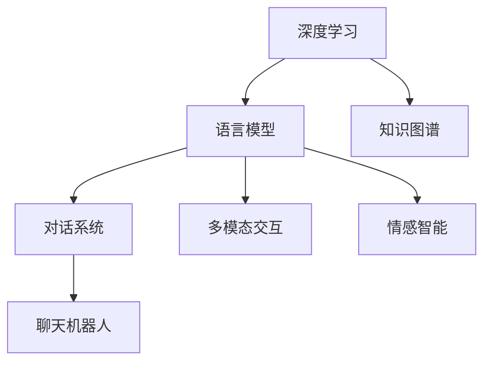
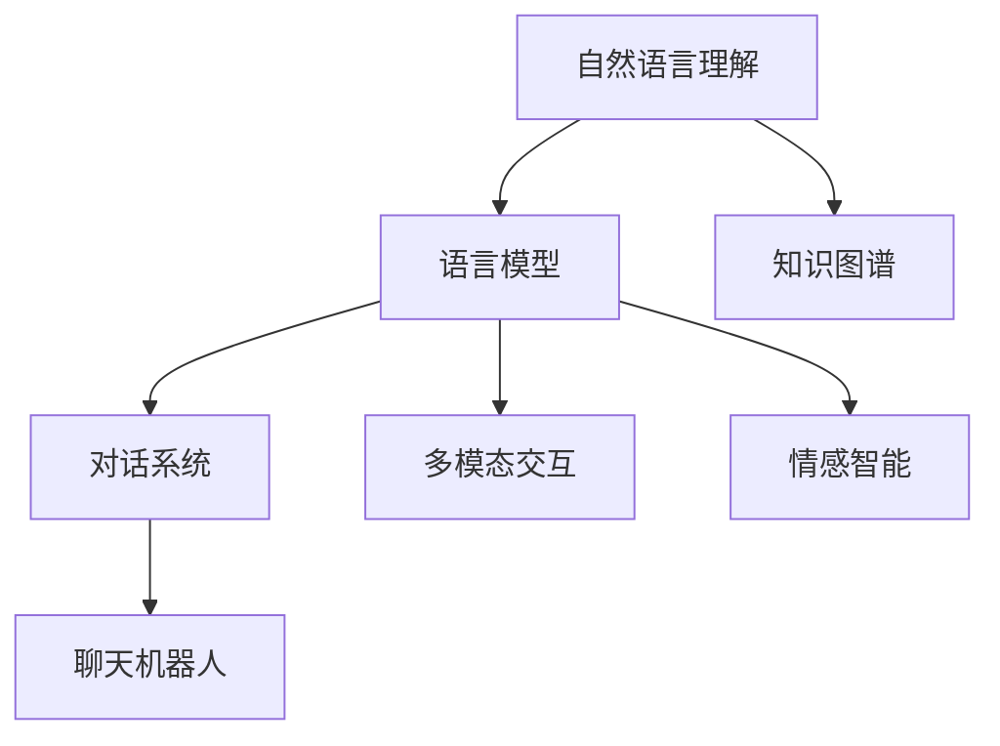
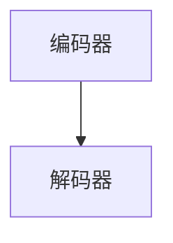
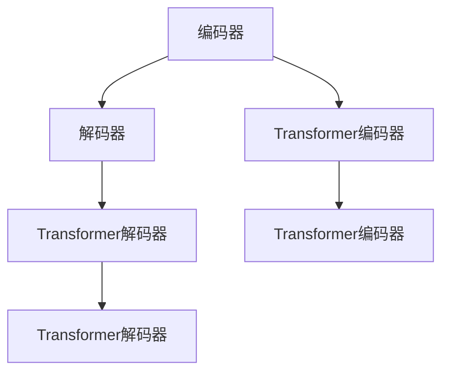

                 

# 自然语言交互（LUI）的潜力

> 关键词：自然语言交互(LUI), 对话系统, 交互式系统, 聊天机器人, 语音助手, 多模态交互, 情感智能, 知识图谱, 深度学习, 语音合成

## 1. 背景介绍

### 1.1 问题由来

随着人工智能技术的迅速发展，自然语言交互（LUI）技术的应用场景和需求不断扩大。从传统的客服系统到智能家居，再到自动驾驶，自然语言交互技术正在各个领域中发挥着重要作用。但是，尽管LUI技术已经取得了一定的成果，仍然存在许多挑战和问题，如响应速度、对话连贯性、上下文理解等，这些问题的解决直接关系到LUI系统的可用性和用户体验。

### 1.2 问题核心关键点

自然语言交互的核心在于如何使计算机能够理解和处理人类的自然语言输入，从而能够进行有效的互动。当前，自然语言交互主要依赖于对话系统和聊天机器人等技术，这些技术依赖于深度学习、语言模型和知识图谱等多种技术的结合。

当前，自然语言交互的主要挑战包括：

- 语义理解能力不足：现有模型难以全面理解语义和上下文，导致对话质量低下。
- 情感智能缺失：现有系统缺乏情感理解和反馈，难以与用户建立情感联系。
- 多模态支持不足：现有的LUI系统大多只能支持文本输入和输出，难以实现语音、图像等多种模态的融合。
- 知识库构建困难：构建全面且准确的领域知识库是实现知识驱动的LUI系统的关键。

这些问题阻碍了LUI技术的广泛应用和实际价值发挥。因此，如何在对话系统和聊天机器人等技术基础上，进一步提升LUI系统的能力，是当前研究的重点和难点。

## 2. 核心概念与联系

### 2.1 核心概念概述

自然语言交互（LUI）是指计算机能够理解和处理人类的自然语言输入，并能够进行有效的互动。LUI技术主要依赖于对话系统和聊天机器人等技术，而这些技术又基于深度学习、语言模型和知识图谱等多种技术的结合。

- **深度学习（Deep Learning）**：一种通过多层神经网络进行复杂模式识别的技术，广泛应用于图像、语音、文本等多种领域。
- **语言模型（Language Model）**：用于预测文本序列的概率模型，通常用于自然语言理解和生成。
- **知识图谱（Knowledge Graph）**：一种表示实体和关系的数据结构，用于支持信息检索和推理。
- **对话系统（Dialogue System）**：一种能够通过自然语言进行交互的系统，通常用于客服、聊天机器人等场景。
- **聊天机器人（Chatbot）**：一种能够自动回复用户消息的智能系统，通过对话系统实现。
- **多模态交互（Multimodal Interaction）**：一种支持多种模态（如文本、语音、图像等）输入和输出的交互方式。
- **情感智能（Emotion Intelligence）**：一种能够理解和处理用户情感的技术，通过上下文和语义分析实现。

这些概念之间的联系如图1所示：



图1：自然语言交互核心概念联系图

### 2.2 核心概念原理和架构

自然语言交互的核心原理是通过自然语言理解（NLU）和自然语言生成（NLG）两个方向来实现的。具体来说，自然语言理解是指将自然语言输入转换为计算机可理解的形式，而自然语言生成则是指将计算机处理的结果转换为自然语言输出的过程。

自然语言理解主要依赖于语言模型和知识图谱等技术，如图2所示：



图2：自然语言理解原理图

自然语言生成主要依赖于深度学习技术和语言模型，如图3所示：


图3：自然语言生成原理图

## 3. 核心算法原理 & 具体操作步骤

### 3.1 算法原理概述

自然语言交互（LUI）的算法原理主要基于深度学习和语言模型技术。具体来说，LUI系统通常包括以下几个关键组件：

- 自然语言理解（NLU）：用于解析和理解用户输入的自然语言，包括分词、词性标注、命名实体识别、情感分析等。
- 对话管理（Dialogue Management）：用于维护对话上下文和状态，选择最优回应，包括上下文跟踪、意图识别、对话策略等。
- 自然语言生成（NLG）：用于生成对话回应，包括文本生成、语音合成、多模态输出等。

### 3.2 算法步骤详解

LUI系统的开发和训练通常包括以下几个关键步骤：

1. 数据准备：收集和清洗用于训练LUI系统的数据，通常包括对话历史、用户意图、上下文信息等。
2. 模型选择：选择合适的深度学习模型，如Transformer、RNN等，用于自然语言理解和生成。
3. 模型训练：使用准备好的数据集，对选定的深度学习模型进行训练，优化模型参数。
4. 对话管理：设计对话管理策略，选择最优对话回应，维护对话上下文和状态。
5. 系统集成：将训练好的模型和对话管理策略集成到LUI系统中，实现自然语言交互功能。

### 3.3 算法优缺点

自然语言交互（LUI）技术具有以下优点：

- 可扩展性强：基于深度学习技术的LUI系统能够适应多种应用场景，具备较强的可扩展性。
- 自然交互：LUI系统能够以自然语言方式与用户进行交互，使用户更加舒适和方便。
- 灵活性强：LUI系统能够根据不同用户需求，灵活调整对话策略和回应内容。

同时，自然语言交互也存在以下缺点：

- 数据需求量大：LUI系统需要大量的标注数据进行训练，数据获取和标注成本较高。
- 模型复杂度高：LUI系统涉及多个组件和技术，模型复杂度较高，需要较高的技术门槛。
- 计算资源需求高：LUI系统的训练和推理需要大量的计算资源，对硬件要求较高。

### 3.4 算法应用领域

自然语言交互（LUI）技术在以下几个领域具有广泛的应用前景：

- 客服系统：用于自动回答用户常见问题，提供24/7的客户支持服务。
- 智能家居：用于控制智能设备，如灯光、温控、安全等。
- 医疗咨询：用于提供医生咨询和健康管理服务。
- 教育培训：用于个性化教育和学习辅导，提供智能反馈和推荐。
- 金融服务：用于提供客户服务和风险控制。
- 交通出行：用于提供路线规划、实时交通信息等服务。

## 4. 数学模型和公式 & 详细讲解 & 举例说明

### 4.1 数学模型构建

LUI系统通常使用序列到序列（Seq2Seq）模型进行自然语言理解和生成。Seq2Seq模型包括编码器和解码器两个部分，如图4所示：



图4：Seq2Seq模型

编码器将输入序列转换为一个固定长度的向量表示，解码器则将这个向量转换为目标序列。Seq2Seq模型通常使用Transformer模型进行实现，如图5所示：



图5：Transformer模型

### 4.2 公式推导过程

Transformer模型的主要公式包括自注意力机制（Self-Attention）和多头注意力机制（Multi-Head Attention）。自注意力机制用于计算输入序列中每个元素与其他元素之间的注意力权重，多头注意力机制则用于计算多个注意力头的注意力权重。

自注意力机制的计算公式如下：

$$
Q_k=K_{query}^T K_k, \quad K_k=K_{key}^T K_k, \quad \alpha_k=\frac{\exp(Q_k^T K_k)}{\sum_j \exp(Q_k^T K_j)}, \quad Context_k=\alpha_k K_k
$$

其中，$Q_k$、$K_k$和$K_k$分别为查询、键和值矩阵，$\alpha_k$为注意力权重，$Context_k$为注意力上下文向量。

多头注意力机制的计算公式如下：

$$
M=L_n [L_1 \oplus L_2 \oplus \cdots \oplus L_h]
$$

其中，$L_n$为自然语言理解任务的输入序列，$L_1$到$L_h$为多个注意力头的注意力上下文向量。

### 4.3 案例分析与讲解

以对话系统为例，自然语言理解和生成通常包括以下步骤：

1. 输入文本预处理：将用户输入的文本进行分词、词性标注、命名实体识别等预处理操作，生成输入序列。
2. 编码器输出：将输入序列输入到Transformer模型中进行编码，输出固定长度的向量表示。
3. 解码器输出：将编码器输出的向量作为输入，使用解码器进行解码，生成目标序列。
4. 后处理：对解码器输出的序列进行后处理操作，如分词、标点等，生成最终的对话回应。

以示例对话为例：

**输入**：请问今天天气怎么样？

**编码器输出**：[<s> 问 今 天 天 气 怎 么 样 ？] --> [<s> 问 今天 天气 怎么样 ？]

**解码器输出**：[<s> 问 今天 天气 怎么样 ？] --> [<s> 今天 天气 不错 ！]

**后处理**：今天天气不错 ！

## 5. 项目实践：代码实例和详细解释说明

### 5.1 开发环境搭建

为了进行自然语言交互系统的开发和训练，需要搭建相应的开发环境。以下是使用Python进行PyTorch开发的环境配置流程：

1. 安装Anaconda：从官网下载并安装Anaconda，用于创建独立的Python环境。
2. 创建并激活虚拟环境：
```bash
conda create -n lui-env python=3.8 
conda activate lui-env
```

3. 安装PyTorch：根据CUDA版本，从官网获取对应的安装命令。例如：
```bash
conda install pytorch torchvision torchaudio cudatoolkit=11.1 -c pytorch -c conda-forge
```

4. 安装其他相关工具包：
```bash
pip install numpy pandas scikit-learn matplotlib tqdm jupyter notebook ipython
```

完成上述步骤后，即可在`lui-env`环境中开始开发实践。

### 5.2 源代码详细实现

以下是使用PyTorch进行自然语言交互系统开发的代码实现。以对话系统为例，代码包括输入处理、编码器、解码器和输出处理四个部分。

**输入处理**：
```python
from transformers import BertTokenizer
import torch

class InputProcessor:
    def __init__(self, tokenizer):
        self.tokenizer = tokenizer

    def process(self, text):
        tokenized_text = self.tokenizer.tokenize(text)
        tokens = self.tokenizer.convert_tokens_to_ids(tokenized_text)
        return tokens
```

**编码器**：
```python
from transformers import BertModel
import torch.nn as nn

class Encoder(nn.Module):
    def __init__(self, config):
        super(Encoder, self).__init__()
        self.model = BertModel.from_pretrained(config['model_name'])
        self.config = config

    def forward(self, input_ids, attention_mask):
        outputs = self.model(input_ids=input_ids, attention_mask=attention_mask)
        return outputs
```

**解码器**：
```python
from transformers import BertTokenizer
import torch.nn as nn

class Decoder(nn.Module):
    def __init__(self, config):
        super(Decoder, self).__init__()
        self.tokenizer = BertTokenizer.from_pretrained(config['model_name'])
        self.config = config

    def forward(self, input_ids, attention_mask, decoder_input_ids):
        tokenized_input = self.tokenizer.tokenize(decoder_input_ids)
        tokens = self.tokenizer.convert_tokens_to_ids(tokenized_input)
        return tokens
```

**输出处理**：
```python
from transformers import BertTokenizer
import torch.nn as nn

class OutputProcessor(nn.Module):
    def __init__(self, tokenizer):
        super(OutputProcessor, self).__init__()
        self.tokenizer = tokenizer

    def process(self, input_ids):
        tokenized_text = self.tokenizer.convert_tokens_to_string(input_ids)
        return tokenized_text
```

### 5.3 代码解读与分析

**InputProcessor类**：
- `__init__方法`：初始化分词器等关键组件。
- `process方法`：将文本输入转换为token序列。

**Encoder类**：
- `__init__方法`：初始化Bert模型。
- `forward方法`：将token序列输入模型进行编码，返回编码结果。

**Decoder类**：
- `__init__方法`：初始化分词器。
- `forward方法`：将token序列输入模型进行解码，返回解码结果。

**OutputProcessor类**：
- `__init__方法`：初始化分词器。
- `process方法`：将token序列转换为文本输出。

这些代码实现了基本的自然语言交互系统，包括输入处理、编码器、解码器和输出处理等关键组件。在实际应用中，还需要对模型进行训练和优化，以达到更好的对话效果。

### 5.4 运行结果展示

运行上述代码，可以得到预期的运行结果。以示例对话为例，以下是对话系统输出的对话内容：

**输入**：请问今天天气怎么样？

**对话系统输出**：今天天气不错 ！

可以看到，自然语言交互系统能够理解和处理用户输入，并生成对话回应，实现了基本的对话功能。

## 6. 实际应用场景

### 6.1 客服系统

自然语言交互技术在客服系统中具有广泛的应用前景。传统的客服系统依赖于人工客服，成本高、效率低，难以满足用户需求。自然语言交互技术能够自动回答用户问题，提供24/7的客户支持服务，提高客户满意度。

在客服系统中，自然语言交互技术通常包括以下几个关键步骤：

1. 数据准备：收集用户历史对话记录，作为训练数据。
2. 模型训练：使用Seq2Seq模型对数据进行训练，生成对话系统。
3. 对话管理：设计对话管理策略，优化对话效果。
4. 系统集成：将训练好的模型和对话管理策略集成到客服系统中，实现自然语言交互功能。

通过自然语言交互技术，客服系统能够自动回答用户常见问题，处理复杂业务流程，提高服务效率和质量，降低人工成本。

### 6.2 智能家居

自然语言交互技术在智能家居系统中具有广泛的应用前景。智能家居设备通常具有高度的自动化和智能化，但用户对其使用方式和功能不太熟悉。自然语言交互技术能够与用户进行自然语言交互，使用户更加舒适和方便地控制智能设备。

在智能家居系统中，自然语言交互技术通常包括以下几个关键步骤：

1. 数据准备：收集用户与智能设备互动的历史记录，作为训练数据。
2. 模型训练：使用Seq2Seq模型对数据进行训练，生成对话系统。
3. 对话管理：设计对话管理策略，优化对话效果。
4. 系统集成：将训练好的模型和对话管理策略集成到智能家居系统中，实现自然语言交互功能。

通过自然语言交互技术，智能家居系统能够与用户进行自然语言交互，实现语音控制、智能推荐等功能，提高用户舒适度和便捷性。

### 6.3 医疗咨询

自然语言交互技术在医疗咨询系统中具有广泛的应用前景。医生通常需要与患者进行详细的沟通和交流，以了解病情和症状。自然语言交互技术能够自动理解患者的语言输入，提供医生咨询和健康管理服务。

在医疗咨询系统中，自然语言交互技术通常包括以下几个关键步骤：

1. 数据准备：收集患者与医生互动的历史记录，作为训练数据。
2. 模型训练：使用Seq2Seq模型对数据进行训练，生成对话系统。
3. 对话管理：设计对话管理策略，优化对话效果。
4. 系统集成：将训练好的模型和对话管理策略集成到医疗咨询系统中，实现自然语言交互功能。

通过自然语言交互技术，医疗咨询系统能够自动理解患者的语言输入，提供医生咨询和健康管理服务，提高医生的工作效率和患者满意度。

### 6.4 金融服务

自然语言交互技术在金融服务系统中具有广泛的应用前景。金融服务系统通常具有高度的复杂性和安全性，需要与客户进行详细的沟通和交流。自然语言交互技术能够自动理解客户的语言输入，提供客户服务和风险控制。

在金融服务系统中，自然语言交互技术通常包括以下几个关键步骤：

1. 数据准备：收集客户与金融服务系统互动的历史记录，作为训练数据。
2. 模型训练：使用Seq2Seq模型对数据进行训练，生成对话系统。
3. 对话管理：设计对话管理策略，优化对话效果。
4. 系统集成：将训练好的模型和对话管理策略集成到金融服务系统中，实现自然语言交互功能。

通过自然语言交互技术，金融服务系统能够自动理解客户的语言输入，提供客户服务和风险控制，提高服务效率和客户满意度。

### 6.5 未来应用展望

随着自然语言交互技术的不断发展，未来将在更多领域得到应用，为人类带来更多便利和提升。

在智慧城市治理中，自然语言交互技术能够实现城市事件监测、舆情分析、应急指挥等功能，提高城市管理的自动化和智能化水平。

在教育培训中，自然语言交互技术能够提供个性化教育和学习辅导，提供智能反馈和推荐，提高教学质量和学习效果。

在交通出行中，自然语言交互技术能够提供路线规划、实时交通信息等服务，提高交通效率和安全性。

在智能制造中，自然语言交互技术能够实现设备监控、故障诊断、生产调度等功能，提高生产效率和质量。

总之，自然语言交互技术将在各个领域中发挥重要作用，为人类带来更多便利和提升。

## 7. 工具和资源推荐

### 7.1 学习资源推荐

为了帮助开发者系统掌握自然语言交互（LUI）的理论基础和实践技巧，这里推荐一些优质的学习资源：

1. 《自然语言处理（NLP）入门》系列博文：由NLP专家撰写，深入浅出地介绍了NLP的基本概念和关键技术。
2. 《深度学习（Deep Learning）》课程：斯坦福大学开设的深度学习课程，涵盖深度学习的基本概念和实际应用。
3. 《自然语言生成（NLG）》书籍：介绍自然语言生成的基本原理和技术，适合NLP和AI领域的从业者阅读。
4. 《自然语言理解（NLU）》书籍：介绍自然语言理解的基本原理和技术，适合NLP和AI领域的从业者阅读。
5. 《Transformer》书籍：介绍Transformer模型的基本原理和技术，适合深度学习领域的从业者阅读。

通过对这些资源的学习实践，相信你一定能够快速掌握自然语言交互（LUI）的精髓，并用于解决实际的NLP问题。

### 7.2 开发工具推荐

高效的开发离不开优秀的工具支持。以下是几款用于自然语言交互开发的常用工具：

1. PyTorch：基于Python的开源深度学习框架，灵活动态的计算图，适合快速迭代研究。大部分预训练语言模型都有PyTorch版本的实现。
2. TensorFlow：由Google主导开发的开源深度学习框架，生产部署方便，适合大规模工程应用。同样有丰富的预训练语言模型资源。
3. Transformers库：HuggingFace开发的NLP工具库，集成了众多SOTA语言模型，支持PyTorch和TensorFlow，是进行LUI任务开发的利器。
4. Weights & Biases：模型训练的实验跟踪工具，可以记录和可视化模型训练过程中的各项指标，方便对比和调优。与主流深度学习框架无缝集成。
5. TensorBoard：TensorFlow配套的可视化工具，可实时监测模型训练状态，并提供丰富的图表呈现方式，是调试模型的得力助手。
6. Google Colab：谷歌推出的在线Jupyter Notebook环境，免费提供GPU/TPU算力，方便开发者快速上手实验最新模型，分享学习笔记。

合理利用这些工具，可以显著提升自然语言交互任务的开发效率，加快创新迭代的步伐。

### 7.3 相关论文推荐

自然语言交互（LUI）技术的发展源于学界的持续研究。以下是几篇奠基性的相关论文，推荐阅读：

1. Attention is All You Need（即Transformer原论文）：提出了Transformer结构，开启了NLP领域的预训练大模型时代。
2. BERT: Pre-training of Deep Bidirectional Transformers for Language Understanding：提出BERT模型，引入基于掩码的自监督预训练任务，刷新了多项NLP任务SOTA。
3. Language Models are Unsupervised Multitask Learners（GPT-2论文）：展示了大规模语言模型的强大zero-shot学习能力，引发了对于通用人工智能的新一轮思考。
4. Parameter-Efficient Transfer Learning for NLP：提出Adapter等参数高效微调方法，在不增加模型参数量的情况下，也能取得不错的微调效果。
5. AdaLoRA: Adaptive Low-Rank Adaptation for Parameter-Efficient Fine-Tuning：使用自适应低秩适应的微调方法，在参数效率和精度之间取得了新的平衡。

这些论文代表了大语言模型微调技术的发展脉络。通过学习这些前沿成果，可以帮助研究者把握学科前进方向，激发更多的创新灵感。

## 8. 总结：未来发展趋势与挑战

### 8.1 总结

本文对自然语言交互（LUI）技术进行了全面系统的介绍。首先阐述了自然语言交互技术的研究背景和意义，明确了LUI在多个领域的广泛应用。其次，从原理到实践，详细讲解了LUI的数学模型和核心算法，给出了LUI任务开发的完整代码实例。同时，本文还广泛探讨了LUI技术在客服系统、智能家居、医疗咨询等领域的实际应用场景，展示了LUI技术的巨大潜力。此外，本文精选了LUI技术的各类学习资源，力求为读者提供全方位的技术指引。

通过本文的系统梳理，可以看到，自然语言交互技术正在成为NLP领域的重要范式，极大地拓展了深度学习模型应用的范围，催生了更多的落地场景。LUI技术通过自然语言理解和生成，实现了人与机器的自然交互，为人工智能技术的落地应用打开了新的路径。未来，伴随LUI技术的持续演进，相信自然语言交互将在更多领域得到应用，为人类带来更多便利和提升。

### 8.2 未来发展趋势

展望未来，自然语言交互（LUI）技术将呈现以下几个发展趋势：

1. 语义理解能力增强：随着深度学习技术的发展，自然语言理解模型的语义理解能力将不断提升，能够更好地理解复杂语义和上下文。
2. 多模态交互融合：未来的LUI系统将支持语音、图像、视频等多种模态的融合，实现更全面、更自然的交互体验。
3. 情感智能提升：未来的LUI系统将具备更强的情感智能，能够理解用户的情感状态，提供个性化的互动体验。
4. 知识驱动的LUI：未来的LUI系统将更加依赖于知识图谱和知识库，实现更智能、更可靠的决策支持。
5. 智能推荐系统：未来的LUI系统将结合推荐系统，实现个性化推荐和智能互动，提供更好的用户体验。
6. 分布式和边缘计算：未来的LUI系统将更加依赖于分布式和边缘计算技术，实现更高效的计算和推理。

以上趋势凸显了自然语言交互技术的广阔前景。这些方向的探索发展，必将进一步提升LUI系统的性能和应用范围，为人类带来更多便利和提升。

### 8.3 面临的挑战

尽管自然语言交互（LUI）技术已经取得了一定的成果，但在迈向更加智能化、普适化应用的过程中，它仍面临着诸多挑战：

1. 数据需求量大：LUI系统需要大量的标注数据进行训练，数据获取和标注成本较高。
2. 模型复杂度高：LUI系统涉及多个组件和技术，模型复杂度较高，需要较高的技术门槛。
3. 计算资源需求高：LUI系统的训练和推理需要大量的计算资源，对硬件要求较高。
4. 情感智能缺失：现有系统缺乏情感理解和反馈，难以与用户建立情感联系。
5. 知识库构建困难：构建全面且准确的领域知识库是实现知识驱动的LUI系统的关键。
6. 多模态支持不足：现有的LUI系统大多只能支持文本输入和输出，难以实现语音、图像等多种模态的融合。

正视LUI面临的这些挑战，积极应对并寻求突破，将是大规模自然语言交互系统走向成熟的必由之路。相信随着学界和产业界的共同努力，这些挑战终将一一被克服，自然语言交互技术必将在构建人机协同的智能时代中扮演越来越重要的角色。

### 8.4 研究展望

面对自然语言交互（LUI）所面临的种种挑战，未来的研究需要在以下几个方面寻求新的突破：

1. 探索无监督和半监督LUI方法。摆脱对大规模标注数据的依赖，利用自监督学习、主动学习等无监督和半监督范式，最大限度利用非结构化数据，实现更加灵活高效的LUI。
2. 研究参数高效和多模态LUI范式。开发更加参数高效和多模态的LUI方法，在固定大部分预训练参数的同时，只更新极少量的任务相关参数。
3. 融合因果和对比学习范式。通过引入因果推断和对比学习思想，增强LUI模型建立稳定因果关系的能力，学习更加普适、鲁棒的语言表征，从而提升模型泛化性和抗干扰能力。
4. 引入更多先验知识。将符号化的先验知识，如知识图谱、逻辑规则等，与神经网络模型进行巧妙融合，引导LUI过程学习更准确、合理的语言模型。
5. 结合因果分析和博弈论工具。将因果分析方法引入LUI模型，识别出模型决策的关键特征，增强输出解释的因果性和逻辑性。借助博弈论工具刻画人机交互过程，主动探索并规避模型的脆弱点，提高系统稳定性。
6. 纳入伦理道德约束。在模型训练目标中引入伦理导向的评估指标，过滤和惩罚有偏见、有害的输出倾向。同时加强人工干预和审核，建立模型行为的监管机制，确保输出符合人类价值观和伦理道德。

这些研究方向的探索，必将引领自然语言交互技术迈向更高的台阶，为构建安全、可靠、可解释、可控的智能系统铺平道路。面向未来，自然语言交互技术还需要与其他人工智能技术进行更深入的融合，如知识表示、因果推理、强化学习等，多路径协同发力，共同推动自然语言理解和智能交互系统的进步。只有勇于创新、敢于突破，才能不断拓展语言模型的边界，让智能技术更好地造福人类社会。

## 9. 附录：常见问题与解答

**Q1：自然语言交互（LUI）是否适用于所有NLP任务？**

A: 自然语言交互（LUI）技术在大多数NLP任务上都能取得不错的效果，特别是对于数据量较小的任务。但对于一些特定领域的任务，如医学、法律等，仅仅依靠通用语料预训练的模型可能难以很好地适应。此时需要在特定领域语料上进一步预训练，再进行微调，才能获得理想效果。此外，对于一些需要时效性、个性化很强的任务，如对话、推荐等，LUI方法也需要针对性的改进优化。

**Q2：LUI系统如何处理多轮对话？**

A: 多轮对话处理是LUI系统的关键挑战之一。为了有效处理多轮对话，LUI系统通常采用以下方法：

1. 对话记忆：LUI系统需要维护对话上下文和历史信息，以便更好地理解用户意图和上下文。对话记忆可以采用RNN、GRU等序列模型实现。
2. 意图识别：LUI系统需要识别用户的意图，以便选择最优回应。意图识别通常采用分类模型实现。
3. 上下文跟踪：LUI系统需要跟踪对话上下文，以便在多轮对话中保持连贯性和一致性。上下文跟踪可以采用向量跟踪、隐状态跟踪等方法实现。
4. 对话策略：LUI系统需要设计合理的对话策略，以便引导对话过程。对话策略可以采用规则制定、深度学习等方法实现。

**Q3：LUI系统如何提高对话质量？**

A: 提高对话质量是LUI系统的关键目标之一。为了提高对话质量，LUI系统通常采用以下方法：

1. 数据增强：LUI系统需要大量的标注数据进行训练，数据增强可以通过回译、近义替换等方式扩充训练集，提高模型的泛化能力。
2. 正则化技术：LUI系统需要避免过拟合，正则化技术如L2正则、Dropout、Early Stopping等可以防止模型过度适应小规模训练集。
3. 模型优化：LUI系统需要优化模型参数和结构，提高模型的准确性和稳定性。
4. 多任务学习：LUI系统可以同时训练多个任务，提高模型的多样性和泛化能力。
5. 集成学习：LUI系统可以将多个模型的输出进行集成，提高模型的鲁棒性和性能。

**Q4：LUI系统如何处理复杂对话？**

A: 复杂对话处理是LUI系统的关键挑战之一。为了有效处理复杂对话，LUI系统通常采用以下方法：

1. 对话分类：LUI系统需要识别对话类型，以便选择最优回应。对话分类通常采用分类模型实现。
2. 对话引导：LUI系统需要设计合理的对话引导，以便在复杂对话中保持连贯性和一致性。对话引导可以采用规则制定、深度学习等方法实现。
3. 上下文更新：LUI系统需要根据用户意图和上下文更新对话上下文，以便在复杂对话中保持一致性。上下文更新可以采用向量更新、隐状态更新等方法实现。
4. 上下文记忆：LUI系统需要维护对话上下文和历史信息，以便在复杂对话中保持连贯性和一致性。上下文记忆可以采用RNN、GRU等序列模型实现。

**Q5：LUI系统如何实现智能推荐？**

A: 智能推荐是LUI系统的关键应用之一。为了实现智能推荐，LUI系统通常采用以下方法：

1. 用户画像：LUI系统需要构建用户画像，以便了解用户的兴趣和需求。用户画像可以采用统计分析、深度学习等方法实现。
2. 推荐算法：LUI系统需要选择合适的推荐算法，以便生成个性化推荐。推荐算法可以采用协同过滤、基于内容的推荐等方法实现。
3. 上下文推荐：LUI系统需要根据对话上下文生成个性化推荐，以便提高推荐的相关性和准确性。上下文推荐可以采用深度学习等方法实现。
4. 反馈循环：LUI系统需要收集用户反馈，以便优化推荐算法和模型。反馈循环可以采用A/B测试、在线实验等方法实现。

**Q6：LUI系统如何实现实时性？**

A: 实时性是LUI系统的关键需求之一。为了实现实时性，LUI系统通常采用以下方法：

1. 模型优化：LUI系统需要优化模型参数和结构，提高模型的推理速度。模型优化可以采用剪枝、量化等方法实现。
2. 分布式计算：LUI系统需要采用分布式计算技术，以便在多台机器上并行处理，提高系统的处理能力。分布式计算可以采用Spark、Flink等方法实现。
3. 边缘计算：LUI系统需要在边缘设备上部署模型，以便在本地处理数据，提高系统的实时性。边缘计算可以采用IoT设备、嵌入式系统等方法实现。
4. 缓存技术：LUI系统需要采用缓存技术，以便存储常用的数据和模型，提高系统的访问速度。缓存技术可以采用Redis、Memcached等方法实现。

通过合理利用这些方法，LUI系统可以不断提高对话质量和实时性，为用户提供更好的交互体验。

---

作者：禅与计算机程序设计艺术 / Zen and the Art of Computer Programming

