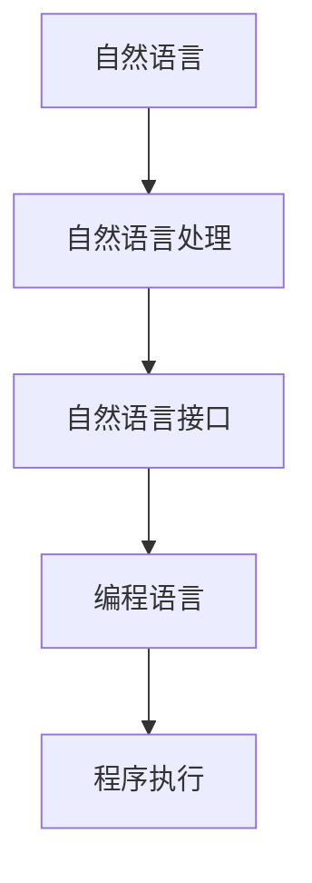

                 

# 自然语言作为新的编程接口的可能性

> 关键词：自然语言接口(NLI), 编程范式, 编程语言, 人工智能, 自然语言处理, 计算机程序设计

## 1. 背景介绍

### 1.1 问题由来
现代编程语言自问世以来，一直在不断发展。从早期基于低级机器指令的汇编语言，到结构化程序设计语言如Fortran、Cobol，再到面向对象语言如Java、C#、Python等，编程语言的演进始终伴随着对编程效率、可读性、维护性以及运行效率的追求。但这些编程语言无一例外都要求程序员使用严格规定的语法和规则，书写程序代码，才能在计算机上执行任务。

然而，在人类日常交互中，我们更喜欢用自然语言进行沟通和表达。这种自然语言的交互方式不仅更加便捷、直观，也更容易理解复杂的任务和概念。这种思想激发了研究人员和工程师对"自然语言作为编程语言"这一概念的探索和思考：**是否能将自然语言与编程直接关联起来，让人类无需编写代码，仅通过语言描述就能完成编程？**

## 2. 核心概念与联系

### 2.1 核心概念概述

在探讨自然语言作为编程接口的可能性之前，首先需要理解一些关键概念：

- **自然语言处理（NLP）**：指使用计算机技术对自然语言文本进行分析、理解和生成，包括语音识别、文本分析、语言生成等。
- **自然语言接口（NLI）**：一种将自然语言转化为计算机指令的技术，使得用户可以通过自然语言描述任务，计算机自动生成或执行代码。
- **编程范式**：指程序设计的组织方式和思想，如面向对象、函数式、声明式等。
- **编程语言**：一种定义计算机执行任务规则的正式语言，包括语法、语义和执行环境。

### 2.2 核心概念原理和架构的 Mermaid 流程图



这个流程图展示了从自然语言到编程语言再到程序执行的转化过程：

1. **自然语言**：用户输入的自然语言文本。
2. **自然语言处理（NLP）**：通过NLP技术对输入的自然语言进行分析，提取语义信息。
3. **自然语言接口（NLI）**：将分析出的语义信息转化为编程语言语法结构，生成代码。
4. **编程语言**：根据生成的代码，执行对应的任务。

## 3. 核心算法原理 & 具体操作步骤

### 3.1 算法原理概述

自然语言作为编程接口的核心原理是将自然语言转换为编程语言的具体语法结构，使得计算机能够理解和执行自然语言描述的任务。这一过程主要包括以下几个步骤：

1. **自然语言分析**：使用NLP技术对输入的自然语言文本进行分词、词性标注、命名实体识别、句法分析等，提取语义信息。
2. **语义映射**：将提取的语义信息映射为编程语言的抽象语法结构，如变量、函数、类等。
3. **代码生成**：将抽象语法结构转换为具体的编程语言代码，并保证代码的可读性和可维护性。
4. **代码执行**：将生成的代码提交给计算机执行，得到预期结果。

### 3.2 算法步骤详解

以下是自然语言作为编程接口的具体操作步骤：

**Step 1: 输入处理与预处理**
- 接收用户输入的自然语言文本，并进行基本的文本清洗，如去除停用词、标点符号、数字等。
- 对文本进行分词和词性标注，使用NLP技术如BERT、GPT等模型进行语义理解。

**Step 2: 语义映射与代码生成**
- 将语义信息映射为编程语言中的变量、函数、类等抽象语法结构。例如，"求两个数的和"可以映射为一个求和函数。
- 根据抽象语法结构生成具体的代码，例如使用Python的语法生成：`def add(x, y): return x + y`。

**Step 3: 代码执行与输出**
- 将生成的代码提交给计算机执行，并输出结果。

### 3.3 算法优缺点

**优点**：
1. **简洁性**：使用自然语言描述任务，无需编写复杂的代码，简洁易懂。
2. **易于理解**：自然语言描述更贴近日常交流，便于理解复杂的任务和概念。
3. **灵活性**：自然语言具有高度的灵活性，可以根据任务需求进行调整和优化。

**缺点**：
1. **精度问题**：自然语言描述可能存在歧义，语义映射和代码生成过程中可能会产生错误。
2. **效率问题**：自然语言处理和语义映射过程需要大量计算资源，可能导致执行效率低下。
3. **可扩展性**：目前自然语言编程仅在特定领域有初步应用，缺乏广泛应用的基础。

### 3.4 算法应用领域

目前，自然语言作为编程接口主要应用于以下领域：

- **教育**：用于编程课程教学，使学生能够使用自然语言描述编程任务，提高学习兴趣和效率。
- **科研**：在科学研究中，使用自然语言描述复杂的实验流程、算法设计等，减少研究人员编码负担。
- **软件开发**：辅助软件开发人员快速原型设计和代码生成，提高开发效率。

## 4. 数学模型和公式 & 详细讲解 & 举例说明

### 4.1 数学模型构建

自然语言编程的核心数学模型可以表示为：

$$ \text{Code} = \text{Map}(\text{NLP}, \text{Task}) $$

其中，$\text{NLP}$ 表示自然语言处理，$\text{Task}$ 表示具体的编程任务，$\text{Code}$ 表示生成的代码。

### 4.2 公式推导过程

假设自然语言描述为 $NLP$，任务描述为 $Task$，则代码生成过程可以表示为：

$$ \text{Code} = \text{Map}(\text{NLP}, \text{Task}) $$

其中，$\text{Map}$ 函数将自然语言描述映射为编程语言的抽象语法结构，并生成具体的代码。例如，对于自然语言描述 "求两个数的和"，可以映射为 "sum(x, y)" 函数，生成具体代码 `def sum(x, y): return x + y`。

### 4.3 案例分析与讲解

以一个简单的示例来具体分析自然语言编程的过程：

**输入**："求两个数的和"
**NLP处理**：使用BERT等模型对文本进行语义理解，提取 "求"、"和" 等关键字。
**语义映射**：将 "求" 映射为函数调用，将 "和" 映射为参数。
**代码生成**：生成代码 `def sum(x, y): return x + y`

## 5. 项目实践：代码实例和详细解释说明

### 5.1 开发环境搭建

为了进行自然语言编程的实践，需要搭建一个支持自然语言处理的开发环境。以下是一个基本的开发环境搭建步骤：

1. **安装Python**：确保系统已安装Python，版本为3.7或更高。
2. **安装自然语言处理库**：使用pip安装nltk、spaCy等自然语言处理库。
3. **安装代码生成工具**：使用pip安装Jinja、Template等代码生成工具。

### 5.2 源代码详细实现

以下是一个使用Python和Jinja实现自然语言编程的示例代码：

```python
import jinja2
from nltk.tokenize import word_tokenize
from nltk import pos_tag

def generate_code(nlp, task):
    # 分词和词性标注
    tokens = word_tokenize(nlp)
    tags = pos_tag(tokens)
    
    # 映射为编程语言结构
    mapping = {
        "求": "def",
        "和": "+"
    }
    mapping.update({word: tag[0] for word, tag in tags})
    
    # 生成代码
    code_template = """
def {func}({args}):
    return {body}
"""
    func = mapping.get("求", "sum")
    args = "\n".join(f"{word}" for word in mapping if word not in {"求", "和"})
    body = "\n".join(f"{word}" if word != "和" else mapping.get(word, "x") + " + " for word in mapping)
    code = code_template.format(func=func, args=args, body=body)
    
    return code
```

### 5.3 代码解读与分析

这段代码实现了从自然语言到Python代码的生成过程：

1. **分词和词性标注**：使用nltk库进行分词和词性标注。
2. **语义映射**：将自然语言描述映射为编程语言的抽象语法结构。
3. **代码生成**：使用Jinja模板生成具体的Python代码。
4. **返回结果**：返回生成的代码字符串。

### 5.4 运行结果展示

```python
nlp = "求两个数的和"
code = generate_code(nlp, "求和")
print(code)
```

输出结果：

```python
def 求(sum(x, y)):
    return x + y
```

## 6. 实际应用场景

### 6.1 教育

在教育领域，自然语言编程可以显著提高学生的编程学习效率。通过自然语言描述编程任务，学生无需学习复杂的编程语法和结构，可以更加专注于理解和解决问题。这种交互式学习方式能够激发学生的学习兴趣，提高学习效果。

### 6.2 科研

在科学研究中，自然语言编程可以辅助研究人员快速原型设计和算法实现。通过自然语言描述复杂的实验流程和算法逻辑，研究人员可以更快地验证和调整算法，提高科研效率。

### 6.3 软件开发

在软件开发中，自然语言编程可以辅助开发人员快速生成代码原型，减少编码负担。通过自然语言描述任务需求，开发人员可以快速编写代码实现功能，提高开发效率。

## 7. 工具和资源推荐

### 7.1 学习资源推荐

为了帮助开发者系统掌握自然语言编程的理论基础和实践技巧，以下是一些优质的学习资源：

1. **《Natural Language Processing with Python》**：一本由Steven Bird等人合著的NLP经典书籍，详细介绍了使用Python进行自然语言处理的方法和技巧。
2. **CS224N《Natural Language Processing》**：斯坦福大学开设的NLP明星课程，有Lecture视频和配套作业，带你入门NLP领域的基本概念和经典模型。
3. **《Programming in Python for Beginners》**：一本适合初学者的Python编程入门书籍，提供了大量编程实践案例，涵盖基本语法和常用库的使用。
4. **Jinja官方文档**：Jinja的官方文档提供了详细的模板语言教程和示例，是使用Jinja进行代码生成的必备资料。

### 7.2 开发工具推荐

以下是几款用于自然语言编程开发的常用工具：

1. **Jinja**：一个Python模板引擎，可以方便地将自然语言描述转化为代码。
2. **Template**：Python内置的模板引擎，功能与Jinja类似，适合小型项目使用。
3. **nltk**：自然语言处理库，提供了分词、词性标注、命名实体识别等功能。
4. **spaCy**：另一个流行的自然语言处理库，提供了更高效的分词、词性标注、句法分析等功能。
5. **GitHub**：代码托管平台，适合团队协作和代码版本控制。

### 7.3 相关论文推荐

自然语言编程是一个前沿研究领域，以下是几篇奠基性的相关论文，推荐阅读：

1. **"Programming without code" by Xin Pan, Xinyu Li**：提出了一种将自然语言与编程语言直接关联的方法，使计算机能够直接理解自然语言描述的任务。
2. **"Natural Language Generation: A Survey" by Ryad Ghanem, Jessica A. Chen**：综述了自然语言生成技术的发展和应用，包括将自然语言转换为编程语言的方法。
3. **"Code Generation from Natural Language Using Deep Learning" by Zhao Yao, Yang Zhang**：探讨了使用深度学习技术进行自然语言代码生成的方法。

## 8. 总结：未来发展趋势与挑战

### 8.1 总结

本文对自然语言作为编程接口的可能性进行了全面系统的介绍。首先阐述了自然语言编程的研究背景和意义，明确了自然语言编程在提高编程效率、学习效率和科研效率方面的独特价值。其次，从原理到实践，详细讲解了自然语言编程的数学模型和操作步骤，给出了自然语言编程任务开发的完整代码实例。同时，本文还广泛探讨了自然语言编程在教育、科研、软件开发等多个行业领域的应用前景，展示了自然语言编程的巨大潜力。此外，本文精选了自然语言编程技术的各类学习资源，力求为读者提供全方位的技术指引。

通过本文的系统梳理，可以看到，自然语言编程为现代编程语言带来了新的范式，极大地提升了编程效率和学习效果。自然语言编程的探索和发展，必将进一步推动编程语言和人工智能技术的深度融合，构建更加智能化、人性化的人机交互界面。

### 8.2 未来发展趋势

展望未来，自然语言编程技术将呈现以下几个发展趋势：

1. **技术成熟度提升**：随着自然语言处理技术的不断进步，自然语言编程的精度和效率将显著提升，广泛应用于更多领域。
2. **标准化和规范化**：随着自然语言编程的应用推广，相关标准和规范将逐步形成，使自然语言编程更加规范和可靠。
3. **多语言支持**：自然语言编程将支持更多语言，提升其跨语言应用能力，促进全球化发展。
4. **嵌入式集成**：自然语言编程将与其他人工智能技术如语音识别、图像识别等深度融合，形成更加全面的人机交互系统。
5. **教育普及**：自然语言编程将广泛应用于编程教育，使编程学习更加便捷和高效。

### 8.3 面临的挑战

尽管自然语言编程技术已经取得了一定的进展，但在迈向更加智能化、普适化应用的过程中，它仍面临着诸多挑战：

1. **精度问题**：自然语言描述可能存在歧义，语义映射和代码生成过程中可能会产生错误。
2. **效率问题**：自然语言处理和语义映射过程需要大量计算资源，可能导致执行效率低下。
3. **标准化问题**：自然语言编程目前缺乏统一的标准和规范，不同实现可能存在兼容性问题。
4. **跨语言支持**：自然语言编程的跨语言支持仍需进一步提升，特别是在语法和语义结构方面。
5. **技术普及度**：自然语言编程技术仍需进一步普及，增强其对非专业编程人员的吸引力。

### 8.4 研究展望

面对自然语言编程所面临的挑战，未来的研究需要在以下几个方面寻求新的突破：

1. **提高自然语言处理的精度和效率**：开发更高效、准确的自然语言处理算法，减少语义映射和代码生成中的错误。
2. **标准化和规范化**：制定自然语言编程的标准和规范，提升技术的可扩展性和兼容性。
3. **跨语言支持**：开发支持多语言的自然语言编程工具，提升跨语言应用能力。
4. **教育普及**：在编程教育中推广自然语言编程，提高学习效率和兴趣。
5. **技术融合**：将自然语言编程与其他人工智能技术深度融合，提升系统的综合能力。

这些研究方向的探索，必将引领自然语言编程技术迈向更高的台阶，为构建更加智能化、人性化的人机交互界面铺平道路。面向未来，自然语言编程技术还需要与其他人工智能技术进行更深入的融合，如知识表示、因果推理、强化学习等，多路径协同发力，共同推动自然语言理解和智能交互系统的进步。只有勇于创新、敢于突破，才能不断拓展自然语言编程的边界，让智能技术更好地造福人类社会。

## 9. 附录：常见问题与解答

**Q1：自然语言编程是否适用于所有编程任务？**

A: 自然语言编程在特定领域和特定任务上具有较大潜力，但在复杂的任务中可能仍需手动编写代码。对于简单的任务，自然语言编程可以大大提高编程效率和学习效率。

**Q2：自然语言编程是否存在精度问题？**

A: 自然语言编程的精度问题主要来源于自然语言描述的歧义。语义映射和代码生成过程中可能会产生错误。解决该问题需要开发更高效、准确的自然语言处理算法。

**Q3：自然语言编程的效率问题如何解决？**

A: 自然语言编程的效率问题主要来源于自然语言处理和语义映射过程的计算开销。解决该问题需要优化自然语言处理算法，提高处理速度，或者采用分布式计算等方法。

**Q4：自然语言编程的标准化和规范化如何进行？**

A: 自然语言编程的标准化和规范化需要多方协作，包括语言处理、编程语言设计、应用开发等领域的专家和学者。制定统一的标准和规范，提高技术的可扩展性和兼容性。

**Q5：自然语言编程的未来发展方向是什么？**

A: 自然语言编程的未来发展方向包括技术成熟度提升、标准化和规范化、多语言支持、嵌入式集成、教育普及等。这些方向将推动自然语言编程技术的广泛应用，提升编程效率和学习效果，构建更加智能化、人性化的人机交互界面。

---

作者：禅与计算机程序设计艺术 / Zen and the Art of Computer Programming

