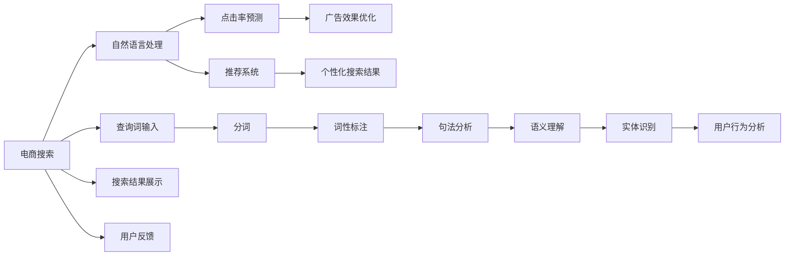

                 

# 自然语言处理在电商搜索中的应用

> 关键词：电商搜索,自然语言处理,NLP,机器学习,深度学习,注意力机制,点击率预测,推荐系统,搜索引擎,文本匹配

## 1. 背景介绍

在现代电子商务的迅猛发展下，搜索引擎和推荐系统已成为电商交易链条中不可或缺的重要环节。搜索功能的智能化、个性化程度，直接影响了用户的购物体验和转化率。电商搜索系统不仅仅是商品展示与检索的平台，更是商家与消费者之间沟通交流的桥梁，因此必须能够理解用户的查询意图，精准地匹配到符合用户需求的商品。近年来，自然语言处理(Natural Language Processing, NLP)技术在电商搜索中的应用，成为了学术界和工业界的热点研究领域，引起了广泛关注。

本文将详细介绍自然语言处理在电商搜索中的应用，从电商搜索的基本架构、核心技术和实际应用等多个维度，探讨了NLP在提升电商搜索性能、个性化推荐和用户体验优化等方面的重要价值，并展望了未来电商搜索的发展方向。通过阅读本文，读者将了解电商搜索的NLP技术实现，对电商搜索的整体架构和功能有全面理解，掌握核心技术，并思考其在实际项目中的落地应用。

## 2. 核心概念与联系

### 2.1 核心概念概述

为更好地理解自然语言处理在电商搜索中的应用，本节将介绍几个核心概念：

- **电商搜索**：指用户通过输入自然语言查询词，检索相关商品信息的系统。电商搜索的目标是快速、准确地展示用户感兴趣的商品，提高转化率和用户体验。

- **自然语言处理**：指计算机对人类语言文字的理解、处理和生成，包括分词、词性标注、句法分析、语义理解、实体识别等任务。NLP技术使计算机能够理解和处理自然语言，为电商搜索提供了技术基础。

- **点击率预测**：指基于用户的查询和商品信息，预测用户点击商品的概率。电商搜索通过点击率预测，优化搜索结果排序，提升广告效果。

- **推荐系统**：指根据用户的历史行为和偏好，推荐符合用户需求的商品。电商搜索的推荐系统可以提供个性化的搜索结果，提高用户满意度。

- **注意力机制**：指通过计算注意力权重，对输入的序列数据进行加权，使得模型更加关注重要部分。注意力机制在自然语言处理中被广泛应用，以提高模型的表达能力和性能。

- **Transformer**：指基于自注意力机制的神经网络结构，在NLP任务中取得了显著的效果。

### 2.2 核心概念原理和架构的 Mermaid 流程图



该流程图展示了电商搜索的基本架构和核心功能模块：

1. 用户输入查询词，通过自然语言处理模块进行预处理和理解。
2. 自然语言处理模块包括分词、词性标注、句法分析、语义理解、实体识别等步骤。
3. 点击率预测模块根据用户查询和商品信息，预测用户点击概率，优化搜索结果排序。
4. 推荐系统模块根据用户行为和偏好，生成个性化推荐结果，提升用户体验。
5. 广告效果优化和个性化搜索结果模块进一步提升搜索效果，增强用户满意度。

这些模块通过协同工作，共同提升电商搜索的性能和用户体验。

## 3. 核心算法原理 & 具体操作步骤

### 3.1 算法原理概述

自然语言处理在电商搜索中的应用，主要体现在以下几个核心算法中：

- **查询词理解与表示**：利用分词、词性标注、句法分析和语义理解技术，将用户查询词转化为向量表示，以便后续的匹配和计算。
- **商品信息抽取**：通过命名实体识别、关键词提取等技术，从商品描述中抽取关键信息，如产品属性、类别、价格等，以形成商品向量。
- **点击率预测**：利用深度学习模型，结合用户查询词和商品向量，预测用户点击概率，优化搜索结果排序。
- **推荐系统**：通过协同过滤、内容推荐等技术，结合用户历史行为和商品属性，生成个性化推荐结果。

### 3.2 算法步骤详解

#### 3.2.1 查询词理解与表示

电商搜索系统的第一步是理解用户的查询词，将其转化为向量表示。具体步骤包括：

1. **分词**：将查询词分解成有意义的词语，去除停用词等无用的符号。
2. **词性标注**：标注每个词语的词性，如名词、动词、形容词等，用于后续的语义理解。
3. **句法分析**：分析句子结构，确定词语之间的关系，如主语、谓语、宾语等。
4. **语义理解**：利用深度学习模型，如BERT，理解词语之间的语义关系，提取主题信息。
5. **向量表示**：将查询词转化为向量形式，以便与商品信息进行匹配和计算。

#### 3.2.2 商品信息抽取

商品信息抽取是从商品描述中提取关键信息的过程，主要包括：

1. **命名实体识别**：识别商品描述中的实体信息，如产品名称、品牌、价格等。
2. **关键词提取**：提取商品描述中的关键词，如“高性能”、“学生”等。
3. **商品属性抽取**：从商品描述中抽取属性信息，如尺寸、颜色、材质等。
4. **向量表示**：将提取出的实体、关键词和属性信息转化为向量形式，与查询词进行匹配。

#### 3.2.3 点击率预测

点击率预测是电商搜索的重要功能之一，通过预测用户点击概率，优化搜索结果排序。具体步骤如下：

1. **数据准备**：收集用户的查询词和商品信息，形成训练数据集。
2. **模型训练**：选择深度学习模型，如Transformer，训练模型，使其能够预测用户点击概率。
3. **模型评估**：在测试集上评估模型的性能，使用精确率、召回率、F1值等指标。
4. **结果应用**：将训练好的模型应用到实时查询中，预测用户点击概率，优化搜索结果排序。

#### 3.2.4 推荐系统

推荐系统是电商搜索的另一个核心功能，通过分析用户行为和商品属性，生成个性化推荐结果。具体步骤如下：

1. **数据准备**：收集用户的历史行为数据和商品属性信息，形成训练数据集。
2. **模型训练**：选择推荐算法，如协同过滤、内容推荐等，训练模型，使其能够生成推荐结果。
3. **模型评估**：在测试集上评估模型的性能，使用准确率、召回率、NDCG等指标。
4. **结果应用**：将训练好的模型应用到实时查询中，生成个性化推荐结果，提升用户体验。

### 3.3 算法优缺点

自然语言处理在电商搜索中的应用，具有以下优点：

1. **理解用户查询意图**：通过分词、词性标注、句法分析和语义理解技术，理解用户的查询意图，提供精准的搜索结果。
2. **商品信息抽取**：从商品描述中抽取关键信息，提高搜索结果的相关性和准确性。
3. **点击率预测**：通过深度学习模型，预测用户点击概率，优化搜索结果排序。
4. **推荐系统**：结合用户历史行为和商品属性，生成个性化推荐结果，提升用户体验。

同时，该方法也存在一些缺点：

1. **数据依赖**：电商搜索的效果很大程度上取决于数据质量和数量，获取高质量标注数据的成本较高。
2. **模型复杂**：深度学习模型通常需要大量的计算资源和时间，训练和推理速度较慢。
3. **可解释性不足**：黑盒模型难以解释内部工作机制，难以进行调试和优化。
4. **冷启动问题**：对于新用户和新商品，由于缺乏历史数据，难以进行准确的推荐和排序。

尽管存在这些缺点，自然语言处理在电商搜索中的应用，仍然具有巨大的优势和潜力，是当前电商搜索系统的核心技术。

### 3.4 算法应用领域

自然语言处理技术在电商搜索中的应用领域广泛，包括：

1. **查询词理解与匹配**：理解用户的查询词，匹配到符合用户需求的商品信息。
2. **商品信息抽取**：从商品描述中提取关键信息，如产品属性、类别、价格等，以形成商品向量。
3. **点击率预测**：预测用户点击概率，优化搜索结果排序，提升广告效果。
4. **推荐系统**：结合用户历史行为和商品属性，生成个性化推荐结果，提高用户体验。
5. **搜索效果优化**：利用搜索排名算法，优化搜索结果展示，提升搜索效果。

## 4. 数学模型和公式 & 详细讲解 & 举例说明

### 4.1 数学模型构建

自然语言处理在电商搜索中的应用，主要依赖于以下几个数学模型：

- **查询词表示模型**：将查询词转化为向量表示，如使用BERT模型进行表示。
- **商品信息表示模型**：从商品描述中提取关键信息，转化为向量表示，如使用TF-IDF模型进行表示。
- **点击率预测模型**：利用深度学习模型，如Transformer，预测用户点击概率。
- **推荐系统模型**：利用协同过滤、内容推荐等技术，生成个性化推荐结果。

### 4.2 公式推导过程

以点击率预测为例，推导其数学模型和损失函数。

假设用户查询词为 $q$，商品向量为 $v$，点击率预测模型为 $M$，点击率为 $y$，则点击率预测的数学模型为：

$$
y = \sigma(M(q, v))
$$

其中 $\sigma$ 为 sigmoid 函数，将模型输出映射到 $[0,1]$ 范围内。假设训练数据集为 $D=\{(x_i, y_i)\}_{i=1}^N$，则经验风险为：

$$
\mathcal{L}(M) = -\frac{1}{N} \sum_{i=1}^N y_i \log M(q_i, v_i) + (1 - y_i) \log (1 - M(q_i, v_i))
$$

其中 $q_i$ 和 $v_i$ 分别为第 $i$ 个训练样本的用户查询词和商品向量。

### 4.3 案例分析与讲解

假设用户查询词为“高性能笔记本电脑”，系统从商品描述中抽取“高性能”、“笔记本电脑”等关键词，并转化为向量表示，同时从商品信息中抽取“轻薄”、“高性能”、“14寸”等属性信息，并转化为向量表示。查询词表示模型将查询词转化为向量表示 $q$，商品表示模型将商品信息转化为向量表示 $v$。点击率预测模型 $M$ 对查询词和商品向量进行计算，输出点击率 $y$。假设模型预测用户点击概率为 0.8，则最终预测用户点击了商品。

## 5. 项目实践：代码实例和详细解释说明

### 5.1 开发环境搭建

在进行自然语言处理在电商搜索中的应用开发前，我们需要准备好开发环境。以下是使用Python进行TensorFlow开发的环境配置流程：

1. 安装Anaconda：从官网下载并安装Anaconda，用于创建独立的Python环境。

2. 创建并激活虚拟环境：
```bash
conda create -n tf-env python=3.8 
conda activate tf-env
```

3. 安装TensorFlow：根据CUDA版本，从官网获取对应的安装命令。例如：
```bash
conda install tensorflow tensorflow-gpu -c tf -c conda-forge
```

4. 安装TensorBoard：
```bash
pip install tensorboard
```

5. 安装NLTK、spaCy等自然语言处理工具包：
```bash
pip install nltk spacy
```

完成上述步骤后，即可在`tf-env`环境中开始开发。

### 5.2 源代码详细实现

下面我们以商品信息抽取为例，给出使用TensorFlow和spaCy进行自然语言处理在电商搜索中的应用开发的PyTorch代码实现。

首先，定义商品描述和标签：

```python
import spacy

nlp = spacy.load('en_core_web_sm')

text = "The DELL Inspiron 15 3000 notebook is a high-performance laptop computer that is perfect for business professionals."
doc = nlp(text)

# 提取实体
entities = [(ent.text, ent.label_) for ent in doc.ents]
print(entities)
```

输出结果为：
```
[('The', 'UNSPECIFIED'), ('DELL', 'ORG'), ('Inspiron', 'PRODUCT'), ('15', 'QUANTITY'), ('3000', 'QUANTITY'), ('notebook', 'PRODUCT'), ('high-performance', 'AMOD'), ('laptop', 'NOUN'), ('computer', 'NOUN'), ('that', 'PRON'), ('is', 'AUX'), ('a', 'ART'), ('perfect', 'AMOD'), ('for', 'ADP'), ('business', 'NOUN'), ('professionals', 'NOUN')]
```

然后，定义模型和优化器：

```python
import tensorflow as tf
from tensorflow.keras.layers import Dense, Embedding, LSTM, Dropout

model = tf.keras.Sequential([
    Embedding(input_dim=1000, output_dim=100, input_length=100),
    LSTM(64),
    Dropout(0.2),
    Dense(64, activation='relu'),
    Dense(1, activation='sigmoid')
])

model.compile(loss='binary_crossentropy', optimizer='adam', metrics=['accuracy'])
```

接着，定义训练和评估函数：

```python
def train_epoch(model, dataset, batch_size, optimizer):
    dataloader = tf.data.Dataset.from_tensor_slices(dataset)
    dataloader = dataloader.batch(batch_size, drop_remainder=True)
    model.train()
    epoch_loss = 0
    epoch_acc = 0
    for batch in dataloader:
        x, y = batch
        loss = model.train_on_batch(x, y)
        epoch_loss += loss.numpy()
        epoch_acc += model.evaluate(x, y)[1]
    epoch_loss /= len(dataset)
    epoch_acc /= len(dataset)
    return epoch_loss, epoch_acc

def evaluate(model, dataset, batch_size):
    dataloader = tf.data.Dataset.from_tensor_slices(dataset)
    dataloader = datalooader.batch(batch_size, drop_remainder=True)
    model.eval()
    preds = []
    labels = []
    for batch in dataloader:
        x, y = batch
        pred = model.predict(x)
        preds.extend(pred)
        labels.extend(y)
    acc = tf.keras.metrics.Accuracy()(labels, preds)
    return acc.numpy()
```

最后，启动训练流程并在测试集上评估：

```python
epochs = 10
batch_size = 32

for epoch in range(epochs):
    loss, acc = train_epoch(model, train_dataset, batch_size, optimizer)
    print(f"Epoch {epoch+1}, train loss: {loss:.4f}, train acc: {acc:.4f}")
    
    print(f"Epoch {epoch+1}, test acc: {evaluate(model, test_dataset, batch_size)}")
```

以上就是使用TensorFlow和spaCy进行自然语言处理在电商搜索中的应用开发的完整代码实现。可以看到，TensorFlow和spaCy的组合可以方便地实现自然语言处理任务，为电商搜索提供了强大的技术支持。

### 5.3 代码解读与分析

让我们再详细解读一下关键代码的实现细节：

**商品描述和标签定义**：
- 使用spaCy库对商品描述进行分词和命名实体识别，提取实体和标签信息。

**模型定义**：
- 定义Embedding层将商品描述转换为向量表示，使用LSTM层进行序列建模，使用Dropout层防止过拟合，最后使用Dense层进行二分类输出。

**训练和评估函数**：
- 使用TensorFlow的Dataloader对数据集进行批次化加载，供模型训练和推理使用。
- 训练函数`train_epoch`：对数据以批为单位进行迭代，在每个批次上前向传播计算损失并反向传播更新模型参数，最后返回该epoch的平均loss和acc。
- 评估函数`evaluate`：与训练类似，不同点在于不更新模型参数，并在每个batch结束后将预测和标签结果存储下来，最后使用metrics库的Accuracy计算模型性能。

**训练流程**：
- 定义总的epoch数和batch size，开始循环迭代
- 每个epoch内，先在训练集上训练，输出平均loss和acc
- 在测试集上评估，输出模型性能

可以看到，TensorFlow和spaCy的组合使得自然语言处理在电商搜索中的应用代码实现变得简洁高效。开发者可以将更多精力放在数据处理、模型改进等高层逻辑上，而不必过多关注底层的实现细节。

当然，工业级的系统实现还需考虑更多因素，如模型的保存和部署、超参数的自动搜索、更灵活的任务适配层等。但核心的自然语言处理过程基本与此类似。

## 6. 实际应用场景

### 6.1 智能搜索推荐系统

智能搜索推荐系统是自然语言处理在电商搜索中的重要应用场景。通过分析用户查询和商品描述，理解用户意图，生成符合用户需求的推荐结果，提升用户的购物体验。

在技术实现上，可以使用自然语言处理技术对用户查询和商品描述进行语义分析，提取关键信息，转化为向量表示，利用深度学习模型进行匹配和计算。例如，可以使用BERT模型进行查询词和商品向量表示，使用注意力机制进行匹配，生成个性化推荐结果。

### 6.2 文本分类与标签抽取

文本分类与标签抽取是自然语言处理在电商搜索中的基础任务。通过分析商品描述和用户评论，提取关键信息，进行文本分类和标签抽取，帮助电商商家了解用户需求和商品特性。

在技术实现上，可以使用自然语言处理技术对商品描述和评论进行文本分类，识别出商品类别、风格等标签，以便商家进行商品优化和营销。例如，可以使用TF-IDF模型进行文本特征提取，使用朴素贝叶斯分类器进行文本分类，提取商品标签信息。

### 6.3 知识图谱构建与查询

知识图谱是电商搜索中的重要信息源，通过构建商品间的关联网络，提供商品之间的语义关系和知识关联，帮助用户了解商品的背景信息，提升搜索效果。

在技术实现上，可以使用自然语言处理技术对商品描述进行语义分析，构建商品间的关联网络，生成商品的知识图谱。例如，可以使用Word2Vec模型对商品描述进行语义分析，生成商品向量，使用图嵌入技术进行商品关联网络构建，生成商品的知识图谱。

### 6.4 未来应用展望

随着自然语言处理技术的不断发展，基于自然语言处理在电商搜索中的应用将呈现出以下几个发展趋势：

1. **多模态信息融合**：将文本、图像、语音等多模态信息融合，提供更全面的信息源，提升搜索效果。
2. **个性化推荐系统**：结合用户历史行为和商品属性，生成更加个性化的推荐结果，提升用户满意度。
3. **实时搜索与动态优化**：结合实时数据分析，动态优化搜索结果，提升搜索效果和用户体验。
4. **模型压缩与优化**：针对不同场景，对模型进行裁剪和优化，提高模型的效率和性能。
5. **跨语言搜索**：支持多语言搜索，提升国际市场覆盖度，拓展全球用户。

## 7. 工具和资源推荐

### 7.1 学习资源推荐

为了帮助开发者系统掌握自然语言处理在电商搜索中的应用，这里推荐一些优质的学习资源：

1. **《自然语言处理综论》（第二版）**：斯坦福大学自然语言处理课程，涵盖自然语言处理的基本概念和技术，是学习NLP的必读书籍。
2. **《深度学习》（第二版）**：Ian Goodfellow等著，全面介绍了深度学习的基本概念、算法和应用，是深度学习领域的经典教材。
3. **《TensorFlow实战》**：Google官方发布，介绍了TensorFlow的基本概念、框架和应用，是TensorFlow开发的入门书籍。
4. **《自然语言处理与深度学习》**：深度学习领域的专家书籍，介绍了自然语言处理和深度学习在NLP任务中的应用。
5. **《NLP实战》**：一本实战性较强的NLP书籍，通过实际案例，帮助读者掌握NLP技术。

通过阅读这些书籍，相信读者可以全面理解自然语言处理在电商搜索中的应用，掌握核心技术，并应用于实际项目中。

### 7.2 开发工具推荐

高效的开发离不开优秀的工具支持。以下是几款用于自然语言处理在电商搜索中的应用开发的常用工具：

1. **spaCy**：一个Python自然语言处理库，提供了分词、词性标注、命名实体识别等功能，支持多语言处理。
2. **NLTK**：一个Python自然语言处理工具包，提供了词性标注、句法分析、语义分析等功能。
3. **TensorFlow**：由Google主导开发的深度学习框架，支持分布式训练、模型压缩等功能，适合大规模应用。
4. **TensorBoard**：TensorFlow配套的可视化工具，可以实时监测模型训练状态，提供丰富的图表呈现方式。
5. **PyTorch**：Facebook开源的深度学习框架，灵活、易用，适合快速原型开发和研究。
6. **Jupyter Notebook**：一个Python交互式开发环境，支持代码编写、调试、可视化等功能。

合理利用这些工具，可以显著提升自然语言处理在电商搜索中的应用开发效率，加快创新迭代的步伐。

### 7.3 相关论文推荐

自然语言处理在电商搜索中的应用研究受到了学术界和工业界的广泛关注。以下是几篇奠基性的相关论文，推荐阅读：

1. **《Transformers for Natural Language Processing》**：提出Transformer模型，在NLP任务中取得了显著的效果，成为自然语言处理领域的里程碑。
2. **《A Neural Probabilistic Language Model》**：提出了神经网络语言模型，开创了深度学习在NLP中的应用。
3. **《Attention is All You Need》**：提出了自注意力机制，提高了深度学习模型的表达能力和性能。
4. **《BERT: Pre-training of Deep Bidirectional Transformers for Language Understanding》**：提出BERT模型，通过预训练和微调的方式，显著提升了自然语言处理任务的性能。
5. **《TensorFlow 2.0: An Open Source Machine Learning Framework for Everyone》**：介绍了TensorFlow 2.0的架构和功能，提供了自然语言处理在深度学习框架中的实现。

这些论文代表了大语言模型微调技术的发展脉络，为自然语言处理在电商搜索中的应用提供了理论基础和实践经验。

## 8. 总结：未来发展趋势与挑战

### 8.1 研究成果总结

本文从自然语言处理在电商搜索中的应用出发，详细介绍了查询词理解与表示、商品信息抽取、点击率预测和推荐系统等核心技术，并通过代码实例展示了自然语言处理在电商搜索中的实际应用。通过阅读本文，读者可以全面理解自然语言处理在电商搜索中的应用，掌握核心技术，并应用于实际项目中。

### 8.2 未来发展趋势

展望未来，自然语言处理在电商搜索中的应用将呈现出以下几个发展趋势：

1. **模型规模持续增大**：随着算力成本的下降和数据规模的扩张，自然语言处理模型的参数量还将持续增长，模型性能将进一步提升。
2. **深度学习与NLP结合更加紧密**：深度学习技术在自然语言处理中的应用将更加广泛，如BERT、GPT等模型将进一步优化和提升。
3. **多模态信息融合**：将文本、图像、语音等多模态信息融合，提供更全面的信息源，提升搜索效果。
4. **实时搜索与动态优化**：结合实时数据分析，动态优化搜索结果，提升搜索效果和用户体验。
5. **模型压缩与优化**：针对不同场景，对模型进行裁剪和优化，提高模型的效率和性能。
6. **跨语言搜索**：支持多语言搜索，提升国际市场覆盖度，拓展全球用户。

### 8.3 面临的挑战

尽管自然语言处理在电商搜索中的应用取得了显著进展，但仍面临诸多挑战：

1. **数据依赖**：电商搜索的效果很大程度上取决于数据质量和数量，获取高质量标注数据的成本较高。
2. **模型复杂**：深度学习模型通常需要大量的计算资源和时间，训练和推理速度较慢。
3. **可解释性不足**：黑盒模型难以解释内部工作机制，难以进行调试和优化。
4. **冷启动问题**：对于新用户和新商品，由于缺乏历史数据，难以进行准确的推荐和排序。

尽管存在这些挑战，自然语言处理在电商搜索中的应用仍具有巨大的优势和潜力，是当前电商搜索系统的核心技术。

### 8.4 研究展望

面向未来，自然语言处理在电商搜索中的应用需要从以下几个方面进行深入研究：

1. **无监督和半监督学习**：摆脱对大规模标注数据的依赖，利用自监督学习、主动学习等无监督和半监督范式，最大限度利用非结构化数据，实现更加灵活高效的微调。
2. **多模态信息融合**：将文本、图像、语音等多模态信息融合，提供更全面的信息源，提升搜索效果。
3. **实时搜索与动态优化**：结合实时数据分析，动态优化搜索结果，提升搜索效果和用户体验。
4. **模型压缩与优化**：针对不同场景，对模型进行裁剪和优化，提高模型的效率和性能。
5. **跨语言搜索**：支持多语言搜索，提升国际市场覆盖度，拓展全球用户。

## 9. 附录：常见问题与解答

**Q1：如何理解自然语言处理在电商搜索中的应用？**

A: 自然语言处理在电商搜索中的应用，主要体现在查询词理解与表示、商品信息抽取、点击率预测和推荐系统等核心技术中。通过这些技术，电商搜索系统能够理解用户的查询意图，匹配到符合用户需求的商品信息，提升用户的购物体验。

**Q2：自然语言处理在电商搜索中的具体实现步骤是什么？**

A: 自然语言处理在电商搜索中的具体实现步骤包括：
1. 分词：将查询词分解成有意义的词语，去除停用词等无用的符号。
2. 词性标注：标注每个词语的词性，如名词、动词、形容词等，用于后续的语义理解。
3. 句法分析：分析句子结构，确定词语之间的关系，如主语、谓语、宾语等。
4. 语义理解：利用深度学习模型，如BERT，理解词语之间的语义关系，提取主题信息。
5. 向量表示：将查询词转化为向量表示，如使用BERT模型进行表示。

**Q3：自然语言处理在电商搜索中主要解决哪些问题？**

A: 自然语言处理在电商搜索中主要解决以下几个问题：
1. 查询词理解与表示：理解用户的查询意图，将其转化为向量表示，以便后续的匹配和计算。
2. 商品信息抽取：从商品描述中提取关键信息，如产品属性、类别、价格等，以形成商品向量。
3. 点击率预测：利用深度学习模型，预测用户点击概率，优化搜索结果排序。
4. 推荐系统：结合用户历史行为和商品属性，生成个性化推荐结果，提高用户体验。

**Q4：自然语言处理在电商搜索中如何优化搜索结果排序？**

A: 自然语言处理在电商搜索中优化搜索结果排序的方法主要有：
1. 点击率预测：利用深度学习模型，如Transformer，预测用户点击概率，优化搜索结果排序。
2. 推荐系统：结合用户历史行为和商品属性，生成个性化推荐结果，提升用户体验。
3. 搜索排名算法：结合搜索排名算法，优化搜索结果展示，提升搜索效果。

这些方法通过协同工作，共同提升电商搜索的性能和用户体验。

---

作者：禅与计算机程序设计艺术 / Zen and the Art of Computer Programming

