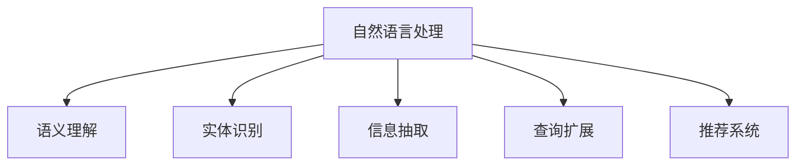

                 

# 自然语言处理在电商搜索中的应用：挑战与机遇

## 1. 背景介绍

在电商行业，用户通过搜索界面查询商品信息，电商平台则需要理解并准确响应用户的查询，提供相关的商品信息。自然语言处理（NLP）技术在电商搜索中的应用，已经成为提升用户体验、提高转化率的关键手段。

### 1.1 问题由来

随着互联网和电子商务的迅速发展，电商搜索需求变得复杂多样，用户查询意图模糊，需要更智能化的搜索系统。目前，常见的电商搜索系统包括Google购物、京东、淘宝等，这些系统多依赖于文本匹配和检索技术。但这些系统对用户查询的理解仅限于关键词匹配，缺乏语义理解能力，导致搜索结果不够精准。

为了提升电商搜索的准确性和用户体验，电商企业开始引入基于自然语言处理的搜索技术。这种技术通过分析用户查询的自然语言，能够更好地理解用户的意图，从而提供更匹配的结果。

### 1.2 问题核心关键点

电商搜索的自然语言处理主要关注以下几个方面：

1. 用户查询意图理解：如何准确识别用户查询的真实意图，区分出查询中的关键词和非关键词。
2. 商品信息抽取：如何从商品描述、评价等信息中抽取出与查询相关的信息。
3. 相关商品推荐：如何将查询与商品关联，推荐最相关的商品。
4. 查询扩展：在用户输入模糊或不完整时，自动扩展查询，提高匹配效果。

## 2. 核心概念与联系

### 2.1 核心概念概述

为更好地理解电商搜索中的NLP应用，本节将介绍几个密切相关的核心概念：

- 自然语言处理（NLP）：指利用计算机技术，使计算机能够理解、解释、生成自然语言的技术。
- 语义理解（Semantic Understanding）：指计算机能够理解词语在语境中的意义，而不是简单地匹配关键词。
- 实体识别（Named Entity Recognition, NER）：指从文本中识别出具体的实体，如人名、地名、机构名等。
- 信息抽取（Information Extraction, IE）：指从文本中抽取出结构化的信息，如关系、事件等。
- 查询扩展（Query Expansion）：指通过语义分析，自动扩展查询，扩大搜索范围，提高召回率。
- 推荐系统（Recommendation System）：指根据用户行为和偏好，推荐相关商品或内容的技术。

这些核心概念之间的逻辑关系可以通过以下Mermaid流程图来展示：



这个流程图展示了大语言模型在电商搜索中的应用，主要包括以下几个方面：

1. 通过语义理解，准确理解用户查询意图。
2. 通过实体识别，从商品描述中抽取出相关的实体。
3. 通过信息抽取，提取商品属性、关系等信息。
4. 通过查询扩展，自动扩展用户查询，提高匹配效果。
5. 通过推荐系统，根据用户行为和偏好，推荐相关商品。

## 3. 核心算法原理 & 具体操作步骤

### 3.1 算法原理概述

电商搜索中的自然语言处理主要依赖于以下算法：

- 序列标注算法：用于识别文本中的实体和关键词，如NER算法。
- 信息抽取算法：用于从文本中抽取出结构化的信息，如IE算法。
- 相似度计算算法：用于计算用户查询与商品描述的相似度，如余弦相似度算法。
- 文本表示算法：用于将文本转化为计算机可以处理的向量表示，如Word2Vec算法。
- 推荐算法：用于根据用户行为和商品属性推荐相关商品，如协同过滤算法。

### 3.2 算法步骤详解

电商搜索中的自然语言处理主要包括以下几个关键步骤：

**Step 1: 用户查询解析**

首先，对用户输入的查询进行解析，提取出查询的关键词和意图。可以采用基于规则的方法，如正则表达式匹配，或者基于统计模型的方法，如Bert+CRF模型。

**Step 2: 商品信息抽取**

然后，对商品描述、评价等信息进行实体识别和信息抽取，提取出与查询相关的实体和属性。可以采用基于词典的方法，如BERT+EIM模型，或者基于深度学习的方法，如BERT+CRF模型。

**Step 3: 查询扩展**

接着，根据用户查询的意图，自动扩展查询，提高匹配效果。可以采用基于向量空间模型的方法，如LDA模型，或者基于深度学习的方法，如BERT+VE模型。

**Step 4: 相关商品推荐**

最后，将查询与商品关联，推荐最相关的商品。可以采用基于协同过滤的方法，如ALS模型，或者基于深度学习的方法，如BERT+RNN模型。

### 3.3 算法优缺点

基于自然语言处理的电商搜索技术有以下优点：

1. 理解用户意图：通过语义理解，能够更准确地理解用户的查询意图，提高搜索精度。
2. 提取商品信息：通过实体识别和信息抽取，能够从商品描述中提取出更丰富的信息，提高匹配效果。
3. 自动扩展查询：通过查询扩展，能够自动扩展模糊或不完整的查询，提高召回率。
4. 推荐商品：通过推荐系统，能够根据用户行为和偏好推荐相关商品，提高转化率。

但同时，这些技术也存在一定的局限性：

1. 对标注数据依赖高：需要大量标注好的数据，才能训练出高质量的模型。
2. 计算资源消耗大：深度学习模型的计算复杂度高，需要大量的计算资源。
3. 对新领域适应性不足：当前模型多基于通用领域的训练，对特定领域的适应性不足。

## 4. 数学模型和公式 & 详细讲解 & 举例说明

### 4.1 数学模型构建

电商搜索中的自然语言处理主要基于以下数学模型：

1. 词嵌入模型：将词语转化为向量表示，如Word2Vec、GloVe等。
2. 实体识别模型：识别文本中的实体，如Bert+EIM模型。
3. 信息抽取模型：从文本中抽取出结构化的信息，如BERT+CRF模型。
4. 查询扩展模型：通过向量空间模型或深度学习模型扩展查询，如LDA、BERT+VE模型。
5. 推荐模型：根据用户行为和商品属性推荐相关商品，如ALS、BERT+RNN模型。

### 4.2 公式推导过程

下面以Bert+CRF模型为例，介绍实体识别模型的公式推导过程。

假设输入的文本为 $x$，实体类别集合为 $\mathcal{T}$，目标为识别出所有实体的类别。则模型的目标函数为：

$$
\mathcal{L} = -\sum_{t \in \mathcal{T}} \log P(y_t|x)
$$

其中 $y_t$ 表示实体的类别标签。

模型的条件概率为：

$$
P(y_t|x) = \frac{e^{s_t(x)}}{\sum_{y' \in \mathcal{T}} e^{s_{y'}(x)}}
$$

其中 $s_t(x)$ 为实体的得分函数，可以表示为：

$$
s_t(x) = \sum_{i=1}^n s_i(x)
$$

其中 $s_i(x)$ 表示词语 $i$ 对实体的贡献，可以通过预训练语言模型和CRF模型联合训练得到。

在得到实体识别模型的目标函数后，可以采用梯度下降等优化算法进行模型训练。

### 4.3 案例分析与讲解

下面以京东商品搜索为例，介绍NLP技术在电商搜索中的应用。

京东的商品搜索系统主要采用了以下NLP技术：

1. 用户查询解析：采用Bert+CRF模型，对用户查询进行分词和实体识别，提取出关键词和实体。
2. 商品信息抽取：采用BERT+CRF模型，对商品描述进行实体识别和信息抽取，提取出商品属性和实体。
3. 查询扩展：采用BERT+VE模型，自动扩展用户查询，提高匹配效果。
4. 商品推荐：采用BERT+RNN模型，根据用户行为和商品属性推荐相关商品。

这些技术的应用，使得京东的商品搜索系统在精度、召回率和用户体验上取得了显著提升。

## 5. 项目实践：代码实例和详细解释说明

### 5.1 开发环境搭建

在进行电商搜索中的NLP实践前，我们需要准备好开发环境。以下是使用Python进行PyTorch开发的环境配置流程：

1. 安装Anaconda：从官网下载并安装Anaconda，用于创建独立的Python环境。

2. 创建并激活虚拟环境：
```bash
conda create -n pytorch-env python=3.8 
conda activate pytorch-env
```

3. 安装PyTorch：根据CUDA版本，从官网获取对应的安装命令。例如：
```bash
conda install pytorch torchvision torchaudio cudatoolkit=11.1 -c pytorch -c conda-forge
```

4. 安装Transformers库：
```bash
pip install transformers
```

5. 安装各类工具包：
```bash
pip install numpy pandas scikit-learn matplotlib tqdm jupyter notebook ipython
```

完成上述步骤后，即可在`pytorch-env`环境中开始微调实践。

### 5.2 源代码详细实现

下面我们以实体识别任务为例，给出使用Transformers库对BERT模型进行实体识别的PyTorch代码实现。

首先，定义实体识别任务的数据处理函数：

```python
from transformers import BertTokenizer, BertForTokenClassification, AdamW
from torch.utils.data import Dataset
import torch

class ERDataset(Dataset):
    def __init__(self, texts, tags, tokenizer, max_len=128):
        self.texts = texts
        self.tags = tags
        self.tokenizer = tokenizer
        self.max_len = max_len
        
    def __len__(self):
        return len(self.texts)
    
    def __getitem__(self, item):
        text = self.texts[item]
        tags = self.tags[item]
        
        encoding = self.tokenizer(text, return_tensors='pt', max_length=self.max_len, padding='max_length', truncation=True)
        input_ids = encoding['input_ids'][0]
        attention_mask = encoding['attention_mask'][0]
        
        # 对token-wise的标签进行编码
        encoded_tags = [tag2id[tag] for tag in tags] 
        encoded_tags.extend([tag2id['O']] * (self.max_len - len(encoded_tags)))
        labels = torch.tensor(encoded_tags, dtype=torch.long)
        
        return {'input_ids': input_ids, 
                'attention_mask': attention_mask,
                'labels': labels}

# 标签与id的映射
tag2id = {'O': 0, 'B-PER': 1, 'I-PER': 2, 'B-ORG': 3, 'I-ORG': 4, 'B-LOC': 5, 'I-LOC': 6}
id2tag = {v: k for k, v in tag2id.items()}

# 创建dataset
tokenizer = BertTokenizer.from_pretrained('bert-base-cased')

train_dataset = ERDataset(train_texts, train_tags, tokenizer)
dev_dataset = ERDataset(dev_texts, dev_tags, tokenizer)
test_dataset = ERDataset(test_texts, test_tags, tokenizer)
```

然后，定义模型和优化器：

```python
model = BertForTokenClassification.from_pretrained('bert-base-cased', num_labels=len(tag2id))

optimizer = AdamW(model.parameters(), lr=2e-5)
```

接着，定义训练和评估函数：

```python
from torch.utils.data import DataLoader
from tqdm import tqdm
from sklearn.metrics import classification_report

device = torch.device('cuda') if torch.cuda.is_available() else torch.device('cpu')
model.to(device)

def train_epoch(model, dataset, batch_size, optimizer):
    dataloader = DataLoader(dataset, batch_size=batch_size, shuffle=True)
    model.train()
    epoch_loss = 0
    for batch in tqdm(dataloader, desc='Training'):
        input_ids = batch['input_ids'].to(device)
        attention_mask = batch['attention_mask'].to(device)
        labels = batch['labels'].to(device)
        model.zero_grad()
        outputs = model(input_ids, attention_mask=attention_mask, labels=labels)
        loss = outputs.loss
        epoch_loss += loss.item()
        loss.backward()
        optimizer.step()
    return epoch_loss / len(dataloader)

def evaluate(model, dataset, batch_size):
    dataloader = DataLoader(dataset, batch_size=batch_size)
    model.eval()
    preds, labels = [], []
    with torch.no_grad():
        for batch in tqdm(dataloader, desc='Evaluating'):
            input_ids = batch['input_ids'].to(device)
            attention_mask = batch['attention_mask'].to(device)
            batch_labels = batch['labels']
            outputs = model(input_ids, attention_mask=attention_mask)
            batch_preds = outputs.logits.argmax(dim=2).to('cpu').tolist()
            batch_labels = batch_labels.to('cpu').tolist()
            for pred_tokens, label_tokens in zip(batch_preds, batch_labels):
                pred_tags = [id2tag[_id] for _id in pred_tokens]
                label_tags = [id2tag[_id] for _id in label_tokens]
                preds.append(pred_tags[:len(label_tokens)])
                labels.append(label_tags)
                
    print(classification_report(labels, preds))
```

最后，启动训练流程并在测试集上评估：

```python
epochs = 5
batch_size = 16

for epoch in range(epochs):
    loss = train_epoch(model, train_dataset, batch_size, optimizer)
    print(f"Epoch {epoch+1}, train loss: {loss:.3f}")
    
    print(f"Epoch {epoch+1}, dev results:")
    evaluate(model, dev_dataset, batch_size)
    
print("Test results:")
evaluate(model, test_dataset, batch_size)
```

以上就是使用PyTorch对BERT进行实体识别任务微调的完整代码实现。可以看到，得益于Transformers库的强大封装，我们可以用相对简洁的代码完成BERT模型的加载和微调。

### 5.3 代码解读与分析

让我们再详细解读一下关键代码的实现细节：

**ERDataset类**：
- `__init__`方法：初始化文本、标签、分词器等关键组件。
- `__len__`方法：返回数据集的样本数量。
- `__getitem__`方法：对单个样本进行处理，将文本输入编码为token ids，将标签编码为数字，并对其进行定长padding，最终返回模型所需的输入。

**tag2id和id2tag字典**：
- 定义了标签与数字id之间的映射关系，用于将token-wise的预测结果解码回真实的标签。

**训练和评估函数**：
- 使用PyTorch的DataLoader对数据集进行批次化加载，供模型训练和推理使用。
- 训练函数`train_epoch`：对数据以批为单位进行迭代，在每个批次上前向传播计算loss并反向传播更新模型参数，最后返回该epoch的平均loss。
- 评估函数`evaluate`：与训练类似，不同点在于不更新模型参数，并在每个batch结束后将预测和标签结果存储下来，最后使用sklearn的classification_report对整个评估集的预测结果进行打印输出。

**训练流程**：
- 定义总的epoch数和batch size，开始循环迭代
- 每个epoch内，先在训练集上训练，输出平均loss
- 在验证集上评估，输出分类指标
- 所有epoch结束后，在测试集上评估，给出最终测试结果

可以看到，PyTorch配合Transformers库使得BERT微调的代码实现变得简洁高效。开发者可以将更多精力放在数据处理、模型改进等高层逻辑上，而不必过多关注底层的实现细节。

当然，工业级的系统实现还需考虑更多因素，如模型的保存和部署、超参数的自动搜索、更灵活的任务适配层等。但核心的微调范式基本与此类似。

## 6. 实际应用场景

### 6.1 智能客服系统

基于自然语言处理的智能客服系统，可以广泛应用于电商客服场景。传统客服往往需要配备大量人力，高峰期响应缓慢，且一致性和专业性难以保证。而使用NLP技术构建的智能客服系统，可以7x24小时不间断服务，快速响应客户咨询，用自然流畅的语言解答各类常见问题。

在技术实现上，可以收集企业内部的历史客服对话记录，将问题和最佳答复构建成监督数据，在此基础上对预训练模型进行微调。微调后的模型能够自动理解用户意图，匹配最合适的答案模板进行回复。对于客户提出的新问题，还可以接入检索系统实时搜索相关内容，动态组织生成回答。如此构建的智能客服系统，能大幅提升客户咨询体验和问题解决效率。

### 6.2 金融舆情监测

金融机构需要实时监测市场舆论动向，以便及时应对负面信息传播，规避金融风险。传统的人工监测方式成本高、效率低，难以应对网络时代海量信息爆发的挑战。基于NLP技术构建的舆情监测系统，可以实时抓取网络文本数据，通过自然语言处理技术分析舆情动向，及时预警，帮助金融机构快速应对潜在风险。

具体而言，可以收集金融领域相关的新闻、报道、评论等文本数据，并对其进行主题标注和情感标注。在此基础上对预训练语言模型进行微调，使其能够自动判断文本属于何种主题，情感倾向是正面、中性还是负面。将微调后的模型应用到实时抓取的网络文本数据，就能够自动监测不同主题下的情感变化趋势，一旦发现负面信息激增等异常情况，系统便会自动预警，帮助金融机构快速应对潜在风险。

### 6.3 个性化推荐系统

当前的推荐系统往往只依赖用户的历史行为数据进行物品推荐，无法深入理解用户的真实兴趣偏好。基于NLP技术构建的个性化推荐系统，可以更好地挖掘用户行为背后的语义信息，从而提供更精准、多样的推荐内容。

在实践中，可以收集用户浏览、点击、评论、分享等行为数据，提取和用户交互的物品标题、描述、标签等文本内容。将文本内容作为模型输入，用户的后续行为（如是否点击、购买等）作为监督信号，在此基础上微调预训练语言模型。微调后的模型能够从文本内容中准确把握用户的兴趣点。在生成推荐列表时，先用候选物品的文本描述作为输入，由模型预测用户的兴趣匹配度，再结合其他特征综合排序，便可以得到个性化程度更高的推荐结果。

### 6.4 未来应用展望

随着NLP技术的发展，基于NLP技术的电商搜索将呈现以下几个发展趋势：

1. 更智能的语义理解：未来电商搜索系统将能够更好地理解用户查询的真实意图，提高搜索的精准度。
2. 更全面的商品信息抽取：未来电商搜索系统将能够从商品描述中抽取更丰富的信息，提高匹配效果。
3. 更高效的查询扩展：未来电商搜索系统将能够自动扩展模糊或不完整的查询，提高召回率。
4. 更个性化的推荐：未来电商搜索系统将能够根据用户行为和偏好推荐更符合用户需求的商品，提高转化率。

这些趋势将使得电商搜索系统更加智能、高效、个性化，为电商平台带来更大的商业价值。

## 7. 工具和资源推荐
### 7.1 学习资源推荐

为了帮助开发者系统掌握NLP技术在电商搜索中的应用，这里推荐一些优质的学习资源：

1. 《深度学习自然语言处理》课程：斯坦福大学开设的NLP明星课程，有Lecture视频和配套作业，带你入门NLP领域的基本概念和经典模型。

2. CS224N《自然语言处理与深度学习》：斯坦福大学的另一门NLP课程，覆盖NLP的深度学习技术和经典算法。

3. 《自然语言处理综述》：清华大学出版社出版的NLP经典教材，全面介绍了NLP技术的理论和实践。

4. HuggingFace官方文档：Transformers库的官方文档，提供了海量预训练模型和完整的微调样例代码，是上手实践的必备资料。

5. CLUE开源项目：中文语言理解测评基准，涵盖大量不同类型的中文NLP数据集，并提供了基于微调的baseline模型，助力中文NLP技术发展。

通过对这些资源的学习实践，相信你一定能够快速掌握NLP技术在电商搜索中的应用，并用于解决实际的电商问题。

### 7.2 开发工具推荐

高效的开发离不开优秀的工具支持。以下是几款用于电商搜索中NLP开发的常用工具：

1. PyTorch：基于Python的开源深度学习框架，灵活动态的计算图，适合快速迭代研究。大部分预训练语言模型都有PyTorch版本的实现。

2. TensorFlow：由Google主导开发的开源深度学习框架，生产部署方便，适合大规模工程应用。同样有丰富的预训练语言模型资源。

3. Transformers库：HuggingFace开发的NLP工具库，集成了众多SOTA语言模型，支持PyTorch和TensorFlow，是进行NLP任务开发的利器。

4. Weights & Biases：模型训练的实验跟踪工具，可以记录和可视化模型训练过程中的各项指标，方便对比和调优。与主流深度学习框架无缝集成。

5. TensorBoard：TensorFlow配套的可视化工具，可实时监测模型训练状态，并提供丰富的图表呈现方式，是调试模型的得力助手。

6. Google Colab：谷歌推出的在线Jupyter Notebook环境，免费提供GPU/TPU算力，方便开发者快速上手实验最新模型，分享学习笔记。

合理利用这些工具，可以显著提升NLP任务开发的效率，加快创新迭代的步伐。

### 7.3 相关论文推荐

NLP技术在电商搜索中的应用得益于学界的持续研究。以下是几篇奠基性的相关论文，推荐阅读：

1. Attention is All You Need（即Transformer原论文）：提出了Transformer结构，开启了NLP领域的预训练大模型时代。

2. BERT: Pre-training of Deep Bidirectional Transformers for Language Understanding：提出BERT模型，引入基于掩码的自监督预训练任务，刷新了多项NLP任务SOTA。

3. Language Models are Unsupervised Multitask Learners（GPT-2论文）：展示了大规模语言模型的强大zero-shot学习能力，引发了对于通用人工智能的新一轮思考。

4. Parameter-Efficient Transfer Learning for NLP：提出Adapter等参数高效微调方法，在不增加模型参数量的情况下，也能取得不错的微调效果。

5. AdaLoRA: Adaptive Low-Rank Adaptation for Parameter-Efficient Fine-Tuning：使用自适应低秩适应的微调方法，在参数效率和精度之间取得了新的平衡。

6. BioBERT: Pre-training of a Multilingual BERT for Biomedical Task：利用BioBERT模型进行生物领域的NLP任务，展示了NLP技术在特定领域的潜力。

这些论文代表了大语言模型在电商搜索中微调技术的发展脉络。通过学习这些前沿成果，可以帮助研究者把握学科前进方向，激发更多的创新灵感。

## 8. 总结：未来发展趋势与挑战

### 8.1 总结

本文对基于自然语言处理的电商搜索技术进行了全面系统的介绍。首先阐述了NLP技术在电商搜索中的应用背景和意义，明确了NLP技术在提升用户体验、提高转化率等方面的重要作用。其次，从原理到实践，详细讲解了电商搜索中的自然语言处理流程，包括用户查询解析、商品信息抽取、查询扩展、商品推荐等关键步骤，给出了微调任务开发的完整代码实例。同时，本文还探讨了NLP技术在智能客服、金融舆情、个性化推荐等多个行业领域的应用前景，展示了NLP技术的广阔应用空间。

通过本文的系统梳理，可以看到，NLP技术在电商搜索中的应用已经进入成熟阶段，为电商平台的智能化转型提供了有力支持。未来，随着NLP技术的进一步发展，电商搜索系统将变得更加智能、高效、个性化，为用户带来更好的购物体验。

### 8.2 未来发展趋势

展望未来，电商搜索中的NLP技术将呈现以下几个发展趋势：

1. 深度融合人工智能技术：NLP技术将与其他人工智能技术，如知识表示、因果推理、强化学习等，进行更深入的融合，构建更加智能的电商搜索系统。

2. 更多任务支持：随着NLP技术的发展，未来电商搜索系统将能够支持更多任务，如意图识别、命名实体识别、关系抽取等，提升用户体验。

3. 实时交互体验：基于自然语言处理的实时交互系统，将成为未来电商搜索的重要方向。通过聊天机器人等形式，实时与用户交互，提供更个性化的推荐和服务。

4. 跨领域泛化能力：未来的NLP技术将具备更强的跨领域泛化能力，能够在不同领域、不同任务中取得理想的效果。

5. 自主学习与适应用户行为：未来的电商搜索系统将具备自主学习能力，能够根据用户行为和反馈，动态调整模型参数，提高推荐效果。

6. 安全性与隐私保护：随着NLP技术的广泛应用，如何保障用户数据隐私，保护用户权益，也将成为重要的研究方向。

以上趋势凸显了NLP技术在电商搜索中的巨大潜力。这些方向的探索发展，必将进一步提升电商搜索系统的性能和用户体验，为电商平台带来更大的商业价值。

### 8.3 面临的挑战

尽管NLP技术在电商搜索中已经取得了显著成果，但在迈向更加智能化、普适化应用的过程中，仍面临诸多挑战：

1. 数据质量与标注成本：高质量标注数据的获取成本高，对小规模领域的标注更是难以实现。如何降低数据标注成本，获取更多的训练样本，是亟待解决的问题。

2. 模型鲁棒性与泛化能力：NLP模型在特定领域或小规模数据上表现良好，但在更大范围的语料上泛化能力不足，容易发生偏差。如何提高模型的鲁棒性，保障模型的泛化能力，是未来研究方向。

3. 计算资源消耗：深度学习模型的计算复杂度高，对计算资源和存储空间要求高。如何在保证模型效果的同时，降低计算成本，是亟待优化的问题。

4. 用户隐私与安全：在电商搜索中，用户数据隐私和安全至关重要。如何保护用户隐私，防止数据泄露和滥用，是未来的研究重点。

5. 可解释性与可控性：NLP模型的决策过程复杂，难以解释。如何提高模型的可解释性和可控性，增强用户信任，是未来的研究方向。

6. 跨领域模型迁移：如何将通用领域的NLP模型迁移应用到特定领域，提高模型的迁移能力，是未来的研究重点。

这些挑战需要跨学科的合作，从数据、算法、工程、伦理等多个维度进行深入研究，才能实现NLP技术的更好应用。

### 8.4 研究展望

面对NLP技术在电商搜索中面临的挑战，未来的研究方向可以从以下几个方面寻求新的突破：

1. 探索无监督和半监督学习：通过利用未标注数据进行模型训练，降低对标注数据的依赖，提高模型的泛化能力。

2. 研究多任务学习：将多个NLP任务融合训练，提高模型的多任务学习能力和泛化能力。

3. 开发轻量级模型：通过模型压缩和参数优化技术，构建轻量级模型，提高模型的实时性和效率。

4. 引入外部知识：将符号化的先验知识，如知识图谱、逻辑规则等，与神经网络模型进行融合，增强模型的解释性和鲁棒性。

5. 提升模型跨领域适应性：通过迁移学习和多领域泛化技术，提高模型在不同领域和任务上的适应性。

6. 提高模型安全性与隐私保护：通过数据匿名化和差分隐私技术，保障用户数据隐私，防止数据泄露。

这些研究方向将引领NLP技术在电商搜索中的应用不断进步，推动电商搜索系统向更智能化、安全化、高效化的方向发展。

## 9. 附录：常见问题与解答

**Q1：电商搜索中的NLP技术是否适用于所有电商平台？**

A: 电商搜索中的NLP技术适用于绝大多数电商平台，尤其是那些用户查询意图复杂、商品信息多样的平台。但对于一些特定领域的电商平台，如B2B、B2C等，由于用户查询模式和商品属性不同，需要根据具体情况进行调整和优化。

**Q2：电商搜索中的NLP技术对计算资源有哪些要求？**

A: 电商搜索中的NLP技术需要大量的计算资源，包括高性能GPU/TPU、大容量内存等。具体来说，深度学习模型的训练和推理需要高效的并行计算，以及足够的数据存储和加载速度。

**Q3：电商搜索中的NLP技术如何处理多语言搜索需求？**

A: 电商搜索中的NLP技术可以通过多语言预训练模型或语言翻译技术，支持多语言搜索需求。常见的做法是在预训练模型中加入多语言语言模型，或者使用机器翻译技术将查询转换为统一的语种进行处理。

**Q4：电商搜索中的NLP技术如何处理噪声数据？**

A: 电商搜索中的NLP技术可以通过数据清洗和噪声过滤技术，处理噪声数据。常见的做法是去除低质量的文本数据，标注错误的数据，或者使用异常检测技术识别并剔除异常样本。

**Q5：电商搜索中的NLP技术如何处理冷启动问题？**

A: 电商搜索中的NLP技术可以通过推荐算法和协同过滤技术，处理冷启动问题。常见的做法是根据用户历史行为和偏好，生成推荐列表，或者使用协同过滤技术推荐用户可能感兴趣的商品。

通过本文的系统梳理，可以看到，NLP技术在电商搜索中的应用已经进入成熟阶段，为电商平台的智能化转型提供了有力支持。未来，随着NLP技术的进一步发展，电商搜索系统将变得更加智能、高效、个性化，为用户带来更好的购物体验。

---

作者：禅与计算机程序设计艺术 / Zen and the Art of Computer Programming

