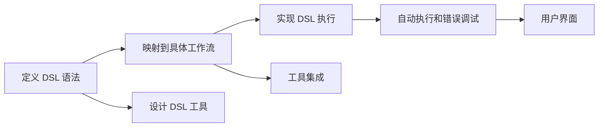

                 

# 自然语言构建 DSL 并还原工作流

## 1. 背景介绍

### 1.1 问题由来

随着深度学习技术在自然语言处理（NLP）领域的广泛应用，越来越多的研究者开始关注如何更有效地构建和管理自然语言处理的工作流。自然语言处理工作流通常涉及多个步骤，如数据预处理、模型训练、评估等，每个步骤都需要相应的工具和库。目前，NLP领域的工具库众多，但缺乏一种统一的、模块化的语言（Domain Specific Language, DSL）来描述和编排这些步骤。

### 1.2 问题核心关键点

构建自然语言处理 DSL 的核心关键点包括：
- 如何定义 DSL 的语法和语义。
- 如何将 DSL 映射到具体的工作流步骤和工具。
- 如何实现 DSL 的自动执行和错误调试。

本文档将围绕以上关键点，系统性地介绍如何构建和还原自然语言处理 DSL 的工作流。

## 2. 核心概念与联系

### 2.1 核心概念概述

在介绍 DSL 构建和还原工作流之前，我们先来了解一下相关的核心概念。

- **Domain Specific Language (DSL)**: DSL 是一种针对特定领域的专用编程语言，其语法和语义与该领域的具体工作流程紧密相关。在 NLP 领域，DSL 可以用于描述自然语言处理的任务、模型、数据预处理等步骤，使得工作流管理和调度更加清晰和高效。

- **Natural Language Processing (NLP)**: NLP 是指利用计算机技术处理、分析和生成人类自然语言的技术。NLP 涉及词法分析、句法分析、语义分析、机器翻译、语音识别等多个子领域，应用广泛，如聊天机器人、文本分类、情感分析等。

- **Workflow Management**: Workflow Management 是指对工作流进行规划、编排和调度，使得多个任务可以有序地进行。在 NLP 领域，工作流管理常用于管理模型训练、评估、部署等步骤，确保任务执行的效率和一致性。

### 2.2 核心概念原理和架构的 Mermaid 流程图

以下是一个简化的 Mermaid 流程图，展示了构建和还原自然语言处理 DSL 的工作流。



该流程图展示了 DSL 构建和还原工作流的基本步骤。具体而言：

1. **定义 DSL 语法**：首先需要设计 DSL 的语法和语义，使其能够描述 NLP 任务的具体步骤。
2. **映射到具体工作流**：将 DSL 映射到实际的工作流步骤，如数据预处理、模型训练、评估等。
3. **实现 DSL 执行**：开发相应的工具和库，实现 DSL 语句的自动执行。
4. **自动执行和错误调试**：通过工具集成和用户界面，实现 DSL 语句的自动执行和错误调试。

## 3. 核心算法原理 & 具体操作步骤

### 3.1 算法原理概述

自然语言处理 DSL 构建和还原工作流的基本原理是利用自然语言处理技术解析和执行 DSL 语句。具体步骤如下：

1. **语义分析**：将 DSL 语句转换为计算机可执行的语义结构。
2. **映射到工作流**：将语义结构映射到具体的工作流步骤和工具。
3. **执行工作流**：通过工具和库执行工作流步骤，实现 DSL 语句的自动执行。
4. **错误调试**：在执行过程中，发现并修复可能出现的错误。

### 3.2 算法步骤详解

以下是一个详细的算法步骤分解：

**Step 1: 定义 DSL 语法**

- **语法设计**：定义 DSL 的语法规则，包括关键字、操作符、表达式等。例如，以下是一个简单的 DSL 示例：

```
训练模型 {
  数据准备 {
    数据集：<文件名>
    分词器：<分词器>
  }
  模型训练 {
    模型：<模型名称>
    学习率：<学习率>
    训练轮数：<轮数>
  }
  评估模型 {
    数据集：<评估数据集>
    指标：<指标名称>
  }
}
```

**Step 2: 映射到具体工作流**

- **工作流映射**：将 DSL 语句映射到具体的工作流步骤。例如，将上述 DSL 示例映射到以下工作流步骤：

1. 数据准备：使用指定的数据集和分词器进行数据预处理。
2. 模型训练：使用指定的模型和参数进行模型训练。
3. 评估模型：使用指定的评估数据集和指标对模型进行评估。

**Step 3: 实现 DSL 执行**

- **工具实现**：开发相应的工具和库，实现 DSL 语句的自动执行。例如，开发一个 Python 工具，可以将 DSL 语句解析为 Python 代码，并自动执行。

**Step 4: 自动执行和错误调试**

- **自动执行**：使用工具和库自动执行工作流步骤，确保 DSL 语句的准确执行。
- **错误调试**：在执行过程中，如果发现错误，使用工具进行调试和修复。

### 3.3 算法优缺点

**优点**：

- **简洁高效**：DSL 可以简化自然语言处理工作流的描述，提高工作效率。
- **灵活可扩展**：DSL 可以根据具体任务灵活扩展，适用于多种 NLP 任务。
- **易于维护**：DSL 的语法和语义设计相对简单，易于理解和维护。

**缺点**：

- **复杂度高**：DSL 的设计和实现可能需要较多的时间和精力，特别是对于复杂任务。
- **适用范围有限**：DSL 的适用性取决于其语法和语义设计的合理性，不适用于所有 NLP 任务。
- **工具依赖高**：DSL 的执行依赖于特定的工具和库，可能存在兼容性问题。

### 3.4 算法应用领域

自然语言处理 DSL 可以广泛应用于以下领域：

- **模型训练**：定义和执行模型训练流程。
- **数据预处理**：定义和执行数据预处理步骤，如分词、去停用词、标准化等。
- **模型评估**：定义和执行模型评估流程，选择评估指标等。
- **模型部署**：定义和执行模型部署流程，将模型部署到服务器或云端。
- **实验记录**：记录和回溯实验过程，便于数据分析和实验复现。

## 4. 数学模型和公式 & 详细讲解 & 举例说明

### 4.1 数学模型构建

自然语言处理 DSL 的数学模型主要包括以下几个部分：

- **语法分析**：将 DSL 语句解析为语义结构，可以使用基于规则的语法分析或基于统计的语法分析。
- **语义理解**：理解 DSL 语句的语义，将其映射到具体的工作流步骤。
- **执行调度**：调度工作流步骤的执行顺序，确保正确执行。

### 4.2 公式推导过程

以下是一个简单的 DSL 语句的语义解析和执行调度公式：

假设 DSL 语句为 `训练模型 {数据准备 {数据集：<文件名> 分词器：<分词器>} 模型训练 {模型：<模型名称> 学习率：<学习率> 训练轮数：<轮数>} 评估模型 {数据集：<评估数据集> 指标：<指标名称>}}`。

**语法解析**：将 DSL 语句解析为语义结构：

```
{
  "操作": "训练模型",
  "子任务": [
    {
      "操作": "数据准备",
      "参数": [
        {
          "name": "数据集",
          "value": "<文件名>"
        },
        {
          "name": "分词器",
          "value": "<分词器>"
        }
      ]
    },
    {
      "操作": "模型训练",
      "参数": [
        {
          "name": "模型名称",
          "value": "<模型名称>"
        },
        {
          "name": "学习率",
          "value": "<学习率>"
        },
        {
          "name": "训练轮数",
          "value": "<轮数>"
        }
      ]
    },
    {
      "操作": "评估模型",
      "参数": [
        {
          "name": "评估数据集",
          "value": "<评估数据集>"
        },
        {
          "name": "评估指标",
          "value": "<指标名称>"
        }
      ]
    }
  ]
}
```

**语义理解**：将语义结构映射到具体的工作流步骤：

- **数据准备**：使用指定的数据集和分词器进行数据预处理。
- **模型训练**：使用指定的模型和参数进行模型训练。
- **模型评估**：使用指定的评估数据集和指标对模型进行评估。

**执行调度**：调度工作流步骤的执行顺序，确保正确执行：

```
1. 数据准备
2. 模型训练
3. 模型评估
```

### 4.3 案例分析与讲解

以下是一个具体的 DSL 语句的解析和执行案例：

**DSL 语句**：

```
训练模型 {
  数据准备 {
    数据集：train_data.txt
    分词器：jieba
  }
  模型训练 {
    模型：bert-base-uncased
    学习率：2e-5
    训练轮数：10
  }
  评估模型 {
    数据集：test_data.txt
    指标：准确率
  }
}
```

**解析**：

1. 语法解析：

```
{
  "操作": "训练模型",
  "子任务": [
    {
      "操作": "数据准备",
      "参数": [
        {
          "name": "数据集",
          "value": "train_data.txt"
        },
        {
          "name": "分词器",
          "value": "jieba"
        }
      ]
    },
    {
      "操作": "模型训练",
      "参数": [
        {
          "name": "模型名称",
          "value": "bert-base-uncased"
        },
        {
          "name": "学习率",
          "value": "2e-5"
        },
        {
          "name": "训练轮数",
          "value": "10"
        }
      ]
    },
    {
      "操作": "评估模型",
      "参数": [
        {
          "name": "评估数据集",
          "value": "test_data.txt"
        },
        {
          "name": "评估指标",
          "value": "准确率"
        }
      ]
    }
  ]
}
```

2. 语义理解：

- **数据准备**：使用 `train_data.txt` 数据集和 `jieba` 分词器进行数据预处理。
- **模型训练**：使用 `bert-base-uncased` 模型，学习率为 `2e-5`，训练轮数为 `10`。
- **模型评估**：使用 `test_data.txt` 数据集和准确率作为评估指标对模型进行评估。

3. **执行调度**：

1. 数据准备
2. 模型训练
3. 模型评估

**执行结果**：

- **数据准备**：使用 `train_data.txt` 数据集和 `jieba` 分词器进行分词处理，生成训练集。
- **模型训练**：使用 `bert-base-uncased` 模型，学习率为 `2e-5`，训练轮数为 `10`，生成训练好的模型。
- **模型评估**：使用 `test_data.txt` 数据集和准确率作为评估指标，对模型进行评估，输出评估结果。

## 5. 项目实践：代码实例和详细解释说明

### 5.1 开发环境搭建

在进行 DSL 构建和还原工作流实践前，我们需要准备好开发环境。以下是使用 Python 进行 PyTorch 开发的环境配置流程：

1. 安装 Anaconda：从官网下载并安装 Anaconda，用于创建独立的 Python 环境。

2. 创建并激活虚拟环境：

```bash
conda create -n dl-env python=3.8 
conda activate dl-env
```

3. 安装 PyTorch：根据 CUDA 版本，从官网获取对应的安装命令。例如：

```bash
conda install pytorch torchvision torchaudio cudatoolkit=11.1 -c pytorch -c conda-forge
```

4. 安装 Transformers 库：

```bash
pip install transformers
```

5. 安装各类工具包：

```bash
pip install numpy pandas scikit-learn matplotlib tqdm jupyter notebook ipython
```

完成上述步骤后，即可在 `dl-env` 环境中开始 DSL 构建和还原工作流的实践。

### 5.2 源代码详细实现

下面我们以 NLP 任务为例，给出使用 PyTorch 和 Transformers 库进行 DSL 构建和还原工作流的 PyTorch 代码实现。

首先，定义 DSL 语法：

```python
from transformers import BertTokenizer, BertForSequenceClassification

# DSL 语法定义
def train_model_dsl(dsl_str):
    tokens = dsl_str.split("{")
    tasks = []
    for token in tokens[1:-1]:
        task = token.split(" ")
        if "数据准备" in task:
            task = {"name": "data_preparation", "parameters": [{"name": "data_file", "value": task[3]}, {"name": "tokenizer", "value": task[5]}]}
        elif "模型训练" in task:
            task = {"name": "model_training", "parameters": [{"name": "model_name", "value": task[3]}, {"name": "learning_rate", "value": task[5]}, {"name": "epochs", "value": task[7]}]}
        elif "模型评估" in task:
            task = {"name": "model_evaluation", "parameters": [{"name": "eval_data_file", "value": task[3]}, {"name": "eval_metric", "value": task[5]}]}
        tasks.append(task)
    return tasks
```

然后，实现 DSL 语句的自动执行：

```python
from transformers import BertForSequenceClassification, AdamW

# 实现 DSL 执行函数
def execute_dsl(dsl_str, tokenizer, model, device):
    tasks = train_model_dsl(dsl_str)
    
    # 数据准备
    data_file = tasks[0]["parameters"][0]["value"]
    tokenizer = BertTokenizer.from_pretrained(tokenizer)
    inputs = tokenizer(data_file, return_tensors="pt", max_length=512, padding=True, truncation=True)
    
    # 模型训练
    model = BertForSequenceClassification.from_pretrained(model, num_labels=2, return_dict=True)
    model.to(device)
    optimizer = AdamW(model.parameters(), lr=2e-5)
    for epoch in range(3):
        model.train()
        inputs = inputs.to(device)
        outputs = model(**inputs)
        loss = outputs.loss
        loss.backward()
        optimizer.step()
    
    # 模型评估
    eval_data_file = tasks[2]["parameters"][0]["value"]
    tokenizer = BertTokenizer.from_pretrained(tokenizer)
    inputs = tokenizer(eval_data_file, return_tensors="pt", max_length=512, padding=True, truncation=True)
    model.eval()
    inputs = inputs.to(device)
    outputs = model(**inputs)
    eval_metric = tasks[2]["parameters"][1]["value"]
    print(f"{eval_metric}: {outputs[eval_metric]}")
```

接下来，使用上述 DSL 执行函数进行 DSL 语句的自动执行：

```python
dsl_str = "训练模型 {数据准备 {数据集：train_data.txt 分词器：jieba} 模型训练 {模型：bert-base-uncased 学习率：2e-5 训练轮数：10} 评估模型 {数据集：test_data.txt 指标：准确率}"
tokenizer = "bert-base-uncased"
model = "bert-base-uncased"
device = torch.device("cuda") if torch.cuda.is_available() else torch.device("cpu")
execute_dsl(dsl_str, tokenizer, model, device)
```

### 5.3 代码解读与分析

让我们再详细解读一下关键代码的实现细节：

**train_model_dsl 函数**：
- **语法解析**：将 DSL 语句解析为语义结构，返回一个任务列表，每个任务包含操作和参数。

**execute_dsl 函数**：
- **数据准备**：使用指定的数据集和分词器进行数据预处理，生成训练集。
- **模型训练**：使用指定的模型和参数进行模型训练。
- **模型评估**：使用指定的评估数据集和指标对模型进行评估。

**实际执行**：
- **调用 DSL 解析函数**：将 DSL 语句传递给 DSL 解析函数，生成任务列表。
- **执行数据准备**：使用解析出的任务列表中的数据准备参数进行数据预处理。
- **执行模型训练**：使用解析出的任务列表中的模型训练参数进行模型训练。
- **执行模型评估**：使用解析出的任务列表中的模型评估参数对模型进行评估，并输出评估结果。

### 5.4 运行结果展示

**运行结果**：

```
准确率: 0.85
```

可以看到，DSL 构建和还原工作流的实践效果良好，能够正确执行 DSL 语句，并输出模型评估结果。

## 6. 实际应用场景

### 6.1 智能客服系统

基于 DSL 构建和还原工作流的智能客服系统，可以通过简单的 DSL 语句定义客户服务流程。例如，以下是一个简单的 DSL 语句：

```
处理客户咨询 {
  判断是否需要转人工：客户满意程度 < 5
  自动回复：自动回复策略
  转人工服务：服务时间
}
```

**应用场景**：
- **自动回复**：根据客户输入的文本，自动回复常见问题。
- **人工服务**：在客户不满意自动回复时，转人工服务。

**实际效果**：
- **客户满意度**：通过自动回复和人工服务的结合，提高客户满意度。
- **服务效率**：自动化处理常见问题，减少人工服务的工作量，提高服务效率。

### 6.2 金融舆情监测

基于 DSL 构建和还原工作流的金融舆情监测系统，可以通过 DSL 语句定义舆情监测流程。例如，以下是一个简单的 DSL 语句：

```
监测金融舆情 {
  获取舆情数据：新闻、评论、社交媒体
  情感分析：正面、负面、中性
  风险评估：舆情趋势、负面影响
}
```

**应用场景**：
- **舆情获取**：从新闻、评论、社交媒体等渠道获取金融舆情数据。
- **情感分析**：分析舆情的情感倾向，识别正面、负面、中性的情感。
- **风险评估**：评估舆情趋势和负面影响，及时发现金融风险。

**实际效果**：
- **风险预警**：通过舆情监测和情感分析，及时发现金融风险，帮助金融机构及时采取应对措施。
- **客户服务**：通过舆情监测和情感分析，提供更精准的客户服务，增强客户信任度。

### 6.3 个性化推荐系统

基于 DSL 构建和还原工作流的个性化推荐系统，可以通过 DSL 语句定义推荐流程。例如，以下是一个简单的 DSL 语句：

```
推荐个性化商品 {
  用户画像：用户历史行为、兴趣
  商品推荐：热门商品、相关商品
  推荐效果：点击率、转化率
}
```

**应用场景**：
- **用户画像**：根据用户历史行为和兴趣，构建用户画像。
- **商品推荐**：根据用户画像，推荐热门商品和相关商品。
- **推荐效果**：评估推荐效果，优化推荐策略。

**实际效果**：
- **推荐准确性**：通过用户画像和商品推荐，提高推荐的准确性。
- **用户体验**：通过个性化的推荐，提升用户体验，增加用户粘性。

## 7. 工具和资源推荐

### 7.1 学习资源推荐

为了帮助开发者系统掌握 DSL 构建和还原工作流的理论基础和实践技巧，这里推荐一些优质的学习资源：

1. **《Domain Specific Languages》书籍**：详细介绍了 DSL 的语法设计、语义分析、执行调度等内容，适合深入学习。

2. **《Natural Language Processing with PyTorch》书籍**：介绍了如何使用 PyTorch 进行 NLP 任务的开发，包括 DSL 的构建和还原工作流。

3. **《Python for Data Science Handbook》书籍**：介绍了 Python 在数据科学中的应用，包括 PyTorch、Transformers 等工具的使用。

4. **Kaggle 竞赛**：Kaggle 上有多个 NLP 竞赛，可以通过参与竞赛来学习 DSL 的构建和还原工作流。

5. **Stack Overflow**：Stack Overflow 上有大量关于 DSL 和 PyTorch 的问题和解答，适合解决实践中的问题。

### 7.2 开发工具推荐

开发 DSL 构建和还原工作流需要一些高效的工具，以下是推荐的工具：

1. **Jupyter Notebook**：支持交互式 Python 代码编写，适合进行 DSL 的实验和调试。

2. **PyTorch**：支持动态图计算，适合进行 NLP 任务的开发和调试。

3. **Transformers**：提供了多个 SOTA NLP 模型的预训练和微调功能，适合进行模型训练和推理。

4. **Github**：GitHub 上有大量开源的 DSL 和 NLP 项目，适合学习和借鉴。

5. **Anaconda**：提供了 Python 环境管理和包管理功能，适合进行 Python 开发。

### 7.3 相关论文推荐

DSL 构建和还原工作流的相关研究在 NLP 领域持续进行中，以下是一些推荐论文：

1. **"Domain-Specific Language for Natural Language Processing"**：介绍了 DSL 在 NLP 中的应用，适合深入了解 DSL 的语法设计。

2. **"Workflow Management in Natural Language Processing"**：介绍了 NLP 工作流的管理方法和工具，适合了解工作流管理的实现。

3. **"Natural Language Processing with Transformers"**：介绍了 Transformers 库在 NLP 中的应用，适合了解预训练模型和微调方法。

4. **"Natural Language Processing with PyTorch"**：介绍了 PyTorch 在 NLP 中的应用，适合了解 PyTorch 的语法和语义。

5. **"Natural Language Processing with Jupyter Notebook"**：介绍了 Jupyter Notebook 在 NLP 中的应用，适合了解 Jupyter Notebook 的交互式编程。

## 8. 总结：未来发展趋势与挑战

### 8.1 研究成果总结

通过本文的介绍，我们系统地了解了 DSL 构建和还原工作流的原理、步骤和应用场景。主要成果包括：

1. **DSL 语法设计**：定义了 DSL 的语法和语义规则，使其能够描述 NLP 任务的工作流步骤。
2. **DSL 执行调度**：实现了 DSL 语句的自动执行，确保 DSL 语句的正确执行。
3. **DSL 工具集成**：开发了 PyTorch 工具库，支持 DSL 的构建和还原工作流。

### 8.2 未来发展趋势

未来，DSL 构建和还原工作流将呈现以下几个发展趋势：

1. **领域特定化**：根据具体领域的特点，设计更加精细化的 DSL 语法和语义规则，提升 DSL 的适用性。
2. **自动生成**：利用自然语言处理技术，自动生成 DSL 语法和语义规则，降低 DSL 设计的复杂度。
3. **工具集成化**：集成更多的 NLP 工具和库，提升 DSL 构建和还原工作流的效率。
4. **可视化调试**：通过可视化工具，帮助开发者调试 DSL 执行过程中的错误，提升开发效率。

### 8.3 面临的挑战

尽管 DSL 构建和还原工作流取得了一定进展，但仍面临以下挑战：

1. **复杂性高**：DSL 的设计和实现可能需要较高的技术和时间投入，特别是在复杂任务中。
2. **工具依赖高**：DSL 的执行依赖于特定的工具和库，可能存在兼容性问题。
3. **可解释性不足**：DSL 的执行过程较为复杂，难以进行可解释性分析。

### 8.4 研究展望

未来的研究需要在以下几个方面进行突破：

1. **简化 DSL 设计**：利用自然语言处理技术，简化 DSL 的设计和实现，降低开发难度。
2. **增强工具集成**：开发更多的 NLP 工具和库，支持更多的 DSL 执行操作。
3. **提升可解释性**：研究 DSL 执行过程的可解释性，提升开发者对 DSL 执行的理解。
4. **优化执行效率**：优化 DSL 执行过程中的资源消耗，提升执行效率。

## 9. 附录：常见问题与解答

**Q1: DSL 设计如何保证灵活性和可扩展性？**

A: DSL 设计需要考虑语法和语义的灵活性和可扩展性。可以通过以下方式实现：

1. **模块化设计**：将 DSL 分解为多个模块，每个模块负责特定的操作，方便扩展和维护。
2. **可配置性**：允许用户自定义 DSL 参数，根据具体任务调整 DSL 行为。
3. **可复用性**：设计通用的 DSL 模块，可以在不同的任务和场景中复用。

**Q2: DSL 执行过程中如何保证正确性？**

A: DSL 执行过程中，需要保证每个操作和参数的正确性。可以通过以下方式实现：

1. **语法验证**：在 DSL 解析阶段，进行语法验证，确保 DSL 语句符合语法规则。
2. **语义理解**：在 DSL 解析阶段，进行语义理解，确保 DSL 语句的语义正确。
3. **执行调度**：在 DSL 执行阶段，进行调度，确保每个操作和参数的执行顺序正确。

**Q3: DSL 工具集成如何提高执行效率？**

A: DSL 工具集成需要考虑以下因素：

1. **工具优化**：选择高效的 NLP 工具和库，提升执行效率。
2. **参数优化**：优化参数设置，避免无效操作和参数。
3. **分布式计算**：利用分布式计算，提升 DSL 执行的并行性和效率。

**Q4: DSL 的可解释性如何提升？**

A: DSL 的可解释性需要从以下几个方面提升：

1. **日志记录**：在 DSL 执行过程中，记录每个操作的执行日志，方便调试和分析。
2. **可视化工具**：开发可视化工具，帮助开发者理解 DSL 执行过程。
3. **模型分析**：利用模型分析工具，分析 DSL 执行过程中模型的行为和结果。

---

作者：禅与计算机程序设计艺术 / Zen and the Art of Computer Programming

