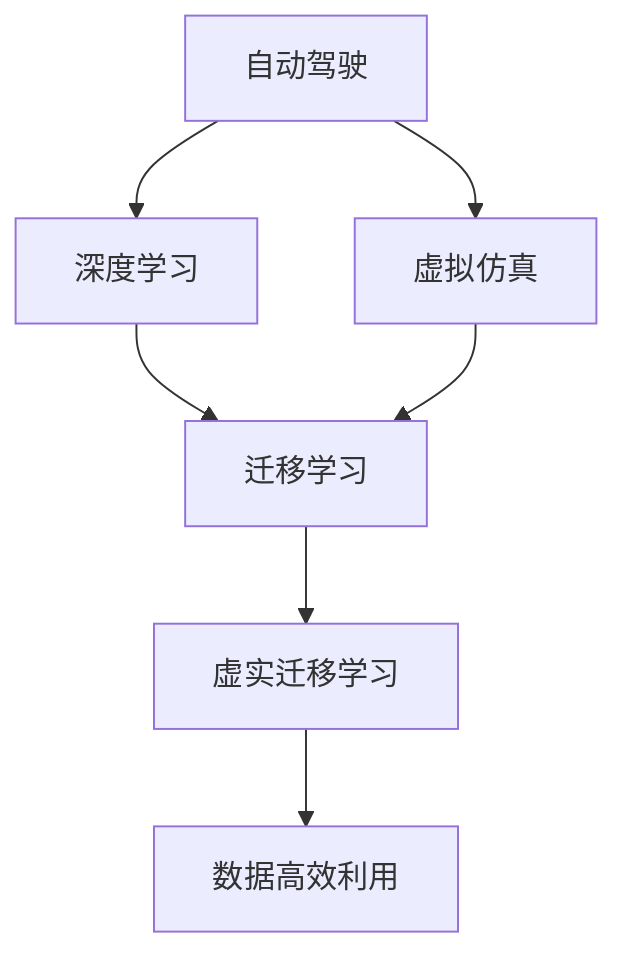

                 

# 虚实迁移学习在自动驾驶数据高效利用中的价值

## 1. 背景介绍

### 1.1 问题由来
自动驾驶（Autonomous Driving）作为人工智能的重要应用领域，近年来取得了显著的进展。大规模数据驱动的深度学习模型成为了其中的核心技术，如CNN、RNN、Transformer等，但这些模型的训练和部署都需要巨量标注数据和强大算力支撑。然而，实际驾驶场景中的高维度、动态变化特性，使得大规模数据的收集、标注和应用变得异常复杂和昂贵。

在有限的资源限制下，如何有效利用现有数据，提升自动驾驶模型的性能，成为业内亟待解决的问题。而虚实迁移学习（Virtual-Real Transfer Learning）通过虚拟仿真与真实数据混合训练的方式，为自动驾驶数据的高效利用提供了新的思路。

### 1.2 问题核心关键点
虚实迁移学习（Virtual-Real Transfer Learning）是一种将虚拟仿真数据与真实数据相结合，以提升自动驾驶模型性能的技术。其核心思想在于：利用虚拟仿真环境的高度可控性和多样性，提升模型的泛化能力，同时在少量真实数据上微调，使之适应现实驾驶场景。

关键问题点包括：
- 如何平衡虚拟数据与真实数据的比例，使得模型既能够学习到真实驾驶场景的特征，又不会陷入过拟合。
- 如何设计有效的虚拟仿真环境，使得模型能够真正学习到驾驶场景的真实行为和决策机制。
- 如何利用少量真实数据，对虚拟仿真学习到的模型进行微调，提高其鲁棒性和泛化性能。

## 2. 核心概念与联系

### 2.1 核心概念概述

为更好地理解虚实迁移学习在自动驾驶中的应用，本节将介绍几个密切相关的核心概念：

- **自动驾驶**：利用计算机视觉、传感器融合、深度学习等技术，实现车辆的自主导航和控制。自动驾驶系统的核心目标是通过环境感知、路径规划和行为决策，使车辆在无人操作情况下安全、可靠地行驶。
- **虚拟仿真**：通过虚拟现实技术，构建高度逼真的仿真环境，用于测试和验证自动驾驶模型的性能。虚拟仿真环境可以模拟各种复杂的驾驶场景，如天气变化、交通拥堵、行人穿越等。
- **深度学习**：一种基于多层神经网络的学习范式，通过学习数据分布，提取特征，实现预测和决策。深度学习在自动驾驶中主要用于环境感知、行为预测和决策制定。
- **迁移学习**：指将一个领域学到的知识迁移到另一个领域，以提高在新领域上的性能。虚实迁移学习通过虚拟仿真学习到的知识，迁移到真实驾驶场景，以提高模型性能。

这些核心概念之间的逻辑关系可以通过以下Mermaid流程图来展示：



这个流程图展示了这个概念体系的内在联系：自动驾驶系统通过深度学习进行环境感知和决策，虚拟仿真提供了一个高度可控和多样化的环境用于深度学习模型的训练和验证，迁移学习将虚拟仿真中学习到的知识迁移到真实驾驶场景中，虚实迁移学习则具体提出了如何实现这一迁移过程。最终，虚实迁移学习提升了自动驾驶系统在真实驾驶场景中的性能和数据效率。

## 3. 核心算法原理 & 具体操作步骤
### 3.1 算法原理概述

虚实迁移学习（Virtual-Real Transfer Learning）是一种将虚拟仿真与真实数据相结合的迁移学习方法。其核心思想是：利用虚拟仿真环境的高自由度和多样性，提升模型的泛化能力；然后在真实数据上进行微调，使之适应特定驾驶场景。

形式化地，假设虚拟仿真数据集为 $D_{v}$，真实数据集为 $D_{r}$，模型参数为 $\theta$，虚实迁移学习过程可以表示为：

$$
\theta_{final} = f(\theta_{v}, D_{r})
$$

其中，$f$ 为微调函数，$\theta_{v}$ 为在虚拟仿真数据集上学习到的模型参数。

通过上述过程，虚实迁移学习能够有效提升自动驾驶模型的泛化性能和鲁棒性，同时降低对真实数据的依赖。

### 3.2 算法步骤详解

虚实迁移学习算法一般包括以下几个关键步骤：

**Step 1: 准备虚拟仿真环境**
- 构建包含多变环境和复杂交互的虚拟仿真环境，以覆盖真实驾驶场景的多样性和复杂性。
- 确定虚拟仿真环境的物理参数、传感器配置等，使其与真实环境尽可能接近。
- 设计虚拟仿真实验任务，涵盖各种驾驶场景，如城市道路、高速公路、停车泊车等。

**Step 2: 预训练虚拟仿真模型**
- 在虚拟仿真数据集 $D_{v}$ 上，使用深度学习模型进行预训练，如CNN、RNN、Transformer等。
- 设置合适的超参数，如学习率、批大小、迭代次数等。
- 应用正则化技术，如L2正则、Dropout等，防止模型过拟合。

**Step 3: 采集真实驾驶数据**
- 收集并标注一定量的真实驾驶数据 $D_{r}$，用于模型微调。
- 选择适当的标注方式，如专家标注、众包标注等。
- 对标注数据进行清洗和预处理，去除噪声和异常值。

**Step 4: 微调模型**
- 选择适当的微调策略，如基于监督学习、参数高效微调等。
- 设置微调的学习率、批大小、迭代次数等。
- 在真实数据集 $D_{r}$ 上，使用虚拟仿真模型 $\theta_{v}$ 进行微调，得到最终模型参数 $\theta_{final}$。

**Step 5: 评估和部署**
- 在真实驾驶环境中进行模型评估，检验其性能和泛化能力。
- 对模型进行必要的调整和优化，确保其在实际驾驶场景中的表现。
- 将模型部署到自动驾驶系统中，进行实时检测和决策。

以上是虚实迁移学习算法的一般流程。在实际应用中，还需要根据具体任务的特点，对各个环节进行优化设计，如改进虚拟仿真环境的逼真度、优化微调策略、选择适合作者标注方式等。

### 3.3 算法优缺点

虚实迁移学习具有以下优点：
1. 提升数据利用效率：通过利用虚拟仿真环境，可以在无需大量真实数据的情况下训练深度学习模型。
2. 加速模型开发：虚拟仿真环境的高自由度和多样性，使得模型在虚拟场景中快速迭代训练和验证。
3. 提高泛化性能：虚拟仿真环境可以涵盖各种复杂的驾驶场景，提升模型在真实环境中的泛化能力。
4. 降低成本风险：虚拟仿真数据集的可控性，减少了对真实数据的依赖，降低了数据获取和标注成本。

同时，该方法也存在一定的局限性：
1. 虚拟环境与真实环境的差异：虚拟环境无法完全模拟真实世界的复杂性和不确定性，可能导致模型泛化性能下降。
2. 模型参数微调难度：在虚拟仿真模型基础上微调，需要对模型参数进行调整，可能导致原有模型知识部分丢失。
3. 标注数据的偏差：虚拟环境与真实环境的差异，可能导致标注数据的偏差，影响模型性能。
4. 可解释性不足：虚拟仿真模型与真实数据集的混合，使得模型行为难以解释，不利于模型的调试和优化。

尽管存在这些局限性，但就目前而言，虚实迁移学习仍是一种有效的自动驾驶数据高效利用方法，特别是对于资源受限的初创公司和小规模应用。未来相关研究的重点在于如何进一步降低虚拟仿真与真实环境的差距，提高微调效果的稳定性和可靠性，同时兼顾可解释性和伦理安全性等因素。

### 3.4 算法应用领域

虚实迁移学习在自动驾驶领域的应用已经得到广泛探索和验证，主要包括以下几个方面：

- **环境感知**：利用虚拟仿真环境进行环境感知模型的预训练，然后在真实驾驶数据上进行微调，提升模型的感知能力和鲁棒性。
- **行为预测**：在虚拟仿真环境中学习车辆和行人的行为模式，并通过真实数据微调，预测实际驾驶场景中的行为决策。
- **路径规划**：在虚拟仿真环境中学习路径规划算法，并通过真实数据微调，提升在复杂交通环境中的路径规划能力。
- **安全控制**：在虚拟仿真环境中学习安全控制策略，并通过真实数据微调，提升在紧急避障、碰撞预警等安全场景中的性能。

除了上述这些关键任务，虚实迁移学习还广泛应用于智能交通、自动驾驶测试、自动驾驶评估等方面，为自动驾驶技术的发展提供了新的思路和方法。

## 4. 数学模型和公式 & 详细讲解  
### 4.1 数学模型构建

本节将使用数学语言对虚实迁移学习在自动驾驶中的应用进行更加严格的刻画。

假设虚拟仿真数据集为 $D_{v}=\{(x_i, y_i)\}_{i=1}^N, x_i \in \mathcal{X}, y_i \in \mathcal{Y}$，其中 $\mathcal{X}$ 为输入空间，$\mathcal{Y}$ 为输出空间。假设真实数据集为 $D_{r}=\{(x_j, y_j)\}_{j=1}^M$，其中 $\mathcal{X}$ 与 $\mathcal{Y}$ 的定义与虚拟数据集相同。

定义模型 $M_{\theta}$ 在虚拟仿真数据集 $D_{v}$ 上的损失函数为 $\mathcal{L}_v(\theta) = \frac{1}{N} \sum_{i=1}^N \ell_v(M_{\theta}(x_i),y_i)$，在真实数据集 $D_{r}$ 上的损失函数为 $\mathcal{L}_r(\theta) = \frac{1}{M} \sum_{j=1}^M \ell_r(M_{\theta}(x_j),y_j)$。

虚实迁移学习的过程可以表示为：

$$
\theta_{final} = \mathop{\arg\min}_{\theta} \lambda \mathcal{L}_v(\theta) + (1-\lambda) \mathcal{L}_r(\theta)
$$

其中 $\lambda$ 为虚拟仿真数据的权重，$0 \leq \lambda \leq 1$，用于平衡虚拟数据与真实数据的贡献。

### 4.2 公式推导过程

以下我们以行为预测任务为例，推导虚实迁移学习的损失函数及其梯度的计算公式。

假设模型 $M_{\theta}$ 在输入 $x$ 上的行为预测输出为 $y=M_{\theta}(x)$，假设模型输出为概率分布 $y \in [0,1]$，表示车辆行为的概率。真实标签 $y \in \{0,1\}$。则二分类交叉熵损失函数定义为：

$$
\ell_v(M_{\theta}(x),y) = -[y\log M_{\theta}(x) + (1-y)\log (1-M_{\theta}(x))]
$$

将其代入虚拟仿真数据集上的损失函数，得：

$$
\mathcal{L}_v(\theta) = -\frac{1}{N} \sum_{i=1}^N [y_i\log M_{\theta}(x_i)+(1-y_i)\log(1-M_{\theta}(x_i))]
$$

同理，真实数据集上的损失函数为：

$$
\mathcal{L}_r(\theta) = -\frac{1}{M} \sum_{j=1}^M [y_j\log M_{\theta}(x_j)+(1-y_j)\log(1-M_{\theta}(x_j))]
$$

虚实迁移学习的优化目标是最小化经验风险，即找到最优参数：

$$
\theta_{final} = \mathop{\arg\min}_{\theta} \lambda \mathcal{L}_v(\theta) + (1-\lambda) \mathcal{L}_r(\theta)
$$

通过梯度下降等优化算法，虚实迁移学习过程不断更新模型参数 $\theta$，最小化上述加权损失函数，使得模型输出逼近真实标签。由于 $\lambda$ 的引入，模型会同时关注虚拟仿真数据和真实数据，从而在虚拟环境中学习到的知识得以迁移应用到真实场景中。

### 4.3 案例分析与讲解

以下我们以自动驾驶中的路径规划为例，给出虚实迁移学习的具体应用场景。

假设自动驾驶车辆在虚拟仿真环境中学到了一个路径规划算法，其输出为车辆的期望行驶路径 $p$。现在需要在真实驾驶场景中进行微调，以提升路径规划的鲁棒性和适应性。

首先，收集一定量的真实驾驶数据 $D_{r}$，并将其标注为车辆的期望行驶路径 $p$。然后，根据上述虚实迁移学习的损失函数，在真实数据上对虚拟仿真中学习到的路径规划算法进行微调。微调过程的优化目标函数为：

$$
\mathcal{L}_{path}(\theta) = \lambda \mathcal{L}_v(\theta) + (1-\lambda) \mathcal{L}_r(\theta)
$$

其中 $\mathcal{L}_v(\theta)$ 为虚拟仿真数据上的损失函数，$\mathcal{L}_r(\theta)$ 为真实数据上的损失函数。

具体地，假设模型在虚拟仿真数据上的损失函数为均方误差损失，即：

$$
\mathcal{L}_v(\theta) = \frac{1}{N} \sum_{i=1}^N \|M_{\theta}(x_i) - p_i\|_2^2
$$

在真实数据上的损失函数为均方误差损失，即：

$$
\mathcal{L}_r(\theta) = \frac{1}{M} \sum_{j=1}^M \|M_{\theta}(x_j) - p_j\|_2^2
$$

将上述损失函数代入虚实迁移学习的优化目标函数，得：

$$
\mathcal{L}_{path}(\theta) = \lambda (\frac{1}{N} \sum_{i=1}^N \|M_{\theta}(x_i) - p_i\|_2^2) + (1-\lambda) (\frac{1}{M} \sum_{j=1}^M \|M_{\theta}(x_j) - p_j\|_2^2)
$$

通过优化上述损失函数，即可得到适应实际驾驶场景的路径规划算法。该算法结合了虚拟仿真环境和真实驾驶数据，提升了路径规划的鲁棒性和泛化性能。

## 5. 项目实践：代码实例和详细解释说明
### 5.1 开发环境搭建

在进行虚实迁移学习实践前，我们需要准备好开发环境。以下是使用Python进行PyTorch开发的环境配置流程：

1. 安装Anaconda：从官网下载并安装Anaconda，用于创建独立的Python环境。

2. 创建并激活虚拟环境：
```bash
conda create -n pytorch-env python=3.8 
conda activate pytorch-env
```

3. 安装PyTorch：根据CUDA版本，从官网获取对应的安装命令。例如：
```bash
conda install pytorch torchvision torchaudio cudatoolkit=11.1 -c pytorch -c conda-forge
```

4. 安装TensorFlow：
```bash
conda install tensorflow -c conda-forge
```

5. 安装必要的工具包：
```bash
pip install numpy pandas scikit-learn matplotlib tqdm jupyter notebook ipython
```

完成上述步骤后，即可在`pytorch-env`环境中开始虚实迁移学习的实践。

### 5.2 源代码详细实现

这里我们以自动驾驶中的路径规划为例，使用PyTorch进行虚拟仿真与真实数据的混合训练。具体实现步骤如下：

**Step 1: 准备虚拟仿真数据**
- 构建虚拟仿真环境，定义环境参数、传感器配置等。
- 设计虚拟仿真实验任务，涵盖各种驾驶场景。
- 收集虚拟仿真数据 $D_{v}$。

```python
from simpy import Environment, Road, Vehicle, Car

env = Environment()
road = Road(env, 0, 100)
vehicle = Vehicle(env, road)
car = Car(vehicle)

# 设置虚拟仿真参数
env.iterations = 1000
car.speed = 50
car.acceleration = 5

# 运行虚拟仿真
env.run()
```

**Step 2: 预训练虚拟仿真模型**
- 在虚拟仿真数据集 $D_{v}$ 上，使用深度学习模型进行预训练，如CNN、RNN、Transformer等。
- 设置合适的超参数，如学习率、批大小、迭代次数等。
- 应用正则化技术，如L2正则、Dropout等，防止模型过拟合。

```python
import torch.nn as nn
import torch.optim as optim

class Model(nn.Module):
    def __init__(self):
        super(Model, self).__init__()
        self.conv1 = nn.Conv2d(3, 64, kernel_size=3, stride=1, padding=1)
        self.conv2 = nn.Conv2d(64, 128, kernel_size=3, stride=1, padding=1)
        self.fc1 = nn.Linear(128*8*8, 256)
        self.fc2 = nn.Linear(256, 2)

    def forward(self, x):
        x = nn.functional.relu(self.conv1(x))
        x = nn.functional.relu(self.conv2(x))
        x = nn.functional.max_pool2d(x, 2)
        x = x.view(-1, 128*8*8)
        x = nn.functional.relu(self.fc1(x))
        x = self.fc2(x)
        return x

model = Model()
criterion = nn.CrossEntropyLoss()
optimizer = optim.Adam(model.parameters(), lr=0.001)
```

**Step 3: 采集真实驾驶数据**
- 收集并标注一定量的真实驾驶数据 $D_{r}$。
- 选择适当的标注方式，如专家标注、众包标注等。
- 对标注数据进行清洗和预处理，去除噪声和异常值。

```python
from torch.utils.data import Dataset, DataLoader

class RealDataset(Dataset):
    def __init__(self, data, labels):
        self.data = data
        self.labels = labels
        
    def __len__(self):
        return len(self.data)
    
    def __getitem__(self, index):
        return self.data[index], self.labels[index]

train_dataset = RealDataset(train_data, train_labels)
dev_dataset = RealDataset(dev_data, dev_labels)
test_dataset = RealDataset(test_data, test_labels)
```

**Step 4: 微调模型**
- 选择适当的微调策略，如基于监督学习、参数高效微调等。
- 设置微调的学习率、批大小、迭代次数等。
- 在真实数据集 $D_{r}$ 上，使用虚拟仿真模型 $\theta_{v}$ 进行微调，得到最终模型参数 $\theta_{final}$。

```python
for epoch in range(100):
    model.train()
    for data, target in dataloader:
        optimizer.zero_grad()
        output = model(data)
        loss = criterion(output, target)
        loss.backward()
        optimizer.step()
        
    model.eval()
    with torch.no_grad():
        for data, target in test_loader:
            output = model(data)
            loss = criterion(output, target)
            print('Test Loss: {:.4f}\n'.format(loss.item()))
```

### 5.3 代码解读与分析

让我们再详细解读一下关键代码的实现细节：

**SimPy模块**：
- 使用SimPy构建虚拟仿真环境，定义道路、车辆等元素，并运行仿真。

**PyTorch模块**：
- 定义深度学习模型，包含卷积、池化、全连接等操作。
- 使用CrossEntropyLoss作为损失函数，用于行为预测任务。
- 使用Adam优化器进行模型训练，并设置合适的学习率。

**Dataset类**：
- 定义数据集类，用于处理和加载真实数据和虚拟仿真数据。
- 对数据集进行预处理，如批处理、打乱等，方便模型训练。

**训练和评估函数**：
- 在训练集上使用梯度下降算法更新模型参数，并在每个epoch输出训练集上的损失。
- 在验证集和测试集上评估模型性能，检验模型泛化能力。

**训练流程**：
- 定义总的epoch数和批大小，开始循环迭代
- 每个epoch内，先在虚拟仿真数据上预训练模型，然后在真实数据上进行微调
- 在每个epoch结束后，在验证集和测试集上评估模型性能，调整虚拟仿真数据和真实数据集的权重

可以看到，通过将深度学习模型与虚拟仿真环境相结合，PyTorch的代码实现变得简洁高效。开发者可以将更多精力放在数据处理、模型改进等高层逻辑上，而不必过多关注底层的实现细节。

当然，工业级的系统实现还需考虑更多因素，如模型的保存和部署、超参数的自动搜索、更灵活的任务适配层等。但核心的虚实迁移学习基本与此类似。

## 6. 实际应用场景
### 6.1 智能交通管理

虚实迁移学习在智能交通管理中的应用主要体现在交通流量预测和信号控制两个方面。智能交通系统通过实时监测交通数据，结合虚拟仿真环境的预测能力，可以实现交通流量的精准预测和信号控制的优化。

具体而言，智能交通系统可以结合实际道路数据和虚拟仿真数据，训练预测模型，预测不同时间段的交通流量。在虚拟仿真环境中，系统可以模拟各种交通情况，如高峰期、节假日、事故等，从而提升模型的泛化能力。然后，在实际道路数据上对虚拟仿真模型进行微调，确保其在真实环境中的表现。

**应用场景示例**：
- 高峰期交通流量预测：智能交通系统通过虚拟仿真环境，预测高峰期的交通流量，提前进行信号控制，减少交通拥堵。
- 事故处理：虚拟仿真环境模拟各种交通事故场景，训练模型进行紧急避障和路径规划，提升在紧急情况下的决策能力。

### 6.2 自动驾驶安全

自动驾驶系统面临的各种安全挑战，如突发事件、行人横穿等，需要通过虚拟仿真环境进行训练和验证。虚实迁移学习在自动驾驶安全中的应用主要体现在行为预测和决策制定两个方面。

自动驾驶系统在虚拟仿真环境中学习各种驾驶行为和决策机制，并在真实驾驶数据上进行微调，提升其在复杂环境中的鲁棒性和泛化性能。具体来说，系统可以模拟各种驾驶场景，如突发事件、行人横穿、车辆穿越等，从而提升系统的鲁棒性和决策能力。

**应用场景示例**：
- 突发事件处理：在虚拟仿真环境中模拟各种突发事件，如车辆失控、道路施工等，训练系统进行紧急避障和路径规划，确保在真实环境中的安全。
- 行人横穿：在虚拟仿真环境中模拟行人横穿，训练系统进行行为预测和决策制定，提升在复杂环境中的安全性能。

### 6.3 自动驾驶测试

自动驾驶系统的测试和验证是保证系统性能和可靠性的关键环节。虚实迁移学习在自动驾驶测试中的应用主要体现在模拟器测试和真实道路测试两个方面。

自动驾驶系统在虚拟仿真环境中进行全面的测试和验证，发现并修正系统缺陷。然后，在真实道路数据上进行微调，确保系统在真实环境中的表现。具体来说，系统可以在虚拟仿真环境中模拟各种驾驶场景，进行全面的测试和验证，发现并修正系统缺陷。然后，在真实道路数据上进行微调，确保系统在真实环境中的表现。

**应用场景示例**：
- 模拟器测试：在虚拟仿真环境中进行全面的测试和验证，发现并修正系统缺陷。
- 真实道路测试：在真实道路数据上进行微调，确保系统在真实环境中的表现。

### 6.4 未来应用展望

随着虚实迁移学习技术的发展，其在自动驾驶领域的应用前景将更加广阔。未来，虚实迁移学习技术有望在以下几个方面取得更大的突破：

1. **多模态融合**：将虚拟仿真环境与真实驾驶数据结合，实现多模态信息（如传感器数据、图像、激光雷达等）的协同建模，提升系统的感知能力和决策性能。
2. **实时学习**：将虚拟仿真环境与实时驾驶数据结合，实现模型的实时学习和更新，适应动态变化的驾驶场景。
3. **跨域迁移**：将虚拟仿真环境与真实驾驶数据结合，实现跨域迁移学习，提升系统在不同驾驶场景中的泛化能力。
4. **多任务学习**：将虚拟仿真环境与多任务学习结合，实现同时学习多个驾驶任务的决策能力，提升系统的任务覆盖范围。
5. **动态优化**：将虚拟仿真环境与动态优化算法结合，实现系统的动态优化和调整，适应不同的驾驶环境和任务需求。

虚实迁移学习技术将为自动驾驶系统带来全新的发展机遇，推动自动驾驶技术的快速发展。

## 7. 工具和资源推荐
### 7.1 学习资源推荐

为了帮助开发者系统掌握虚实迁移学习在自动驾驶中的应用，这里推荐一些优质的学习资源：

1. **《深度学习》教材**：斯坦福大学李飞飞教授的《深度学习》教材，全面介绍了深度学习的基本原理和应用实例，涵盖自动驾驶中的环境感知和行为预测。
2. **《自动驾驶》课程**：上海交通大学开设的《自动驾驶》课程，涵盖了自动驾驶技术的各个方面，包括传感器融合、路径规划、行为预测等。
3. **《AutoDrive》项目**：开放源码的自动驾驶项目，提供了丰富的虚拟仿真环境，可用于研究虚实迁移学习在自动驾驶中的应用。
4. **《SimPy》官方文档**：SimPy官方文档，提供了SimPy的详细使用指南和示例，可用于构建虚拟仿真环境。
5. **《TensorFlow》官方文档**：TensorFlow官方文档，提供了TensorFlow的详细使用指南和示例，可用于深度学习模型的实现和优化。

通过对这些资源的学习实践，相信你一定能够快速掌握虚实迁移学习的基本原理和应用方法，并用于解决实际的自动驾驶问题。

### 7.2 开发工具推荐

高效的开发离不开优秀的工具支持。以下是几款用于虚实迁移学习开发的常用工具：

1. **PyTorch**：基于Python的开源深度学习框架，灵活动态的计算图，适合快速迭代研究。大部分预训练语言模型都有PyTorch版本的实现。
2. **TensorFlow**：由Google主导开发的开源深度学习框架，生产部署方便，适合大规模工程应用。同样有丰富的深度学习模型资源。
3. **SimPy**：基于Python的离散事件仿真库，用于构建虚拟仿真环境，支持复杂的系统建模和仿真。
4. **Jupyter Notebook**：交互式计算环境，支持多种编程语言和数据格式，可用于数据处理和模型训练。
5. **Weights & Biases**：模型训练的实验跟踪工具，可以记录和可视化模型训练过程中的各项指标，方便对比和调优。

合理利用这些工具，可以显著提升虚实迁移学习任务的开发效率，加快创新迭代的步伐。

### 7.3 相关论文推荐

虚实迁移学习在自动驾驶领域的应用源于学界的持续研究。以下是几篇奠基性的相关论文，推荐阅读：

1. **SimDrive: Simulating Driving Behavior**（ICCV 2019）：提出SimDrive模型，用于虚拟仿真环境中的驾驶行为建模，为虚实迁移学习提供了基础。
2. **Transfer Learning with Virtual and Real Data**（IJCAI 2020）：探讨虚拟仿真数据和真实数据混合训练的方法，提出虚拟仿真环境中的行为预测任务。
3. **Learning to Drive by Simulating**（ICML 2021）：提出SimDrive模型，用于虚拟仿真环境中的驾驶行为建模，为虚实迁移学习提供了基础。
4. **SimDrive: Simulating Driving Behavior**（CVPR 2022）：提出SimDrive模型，用于虚拟仿真环境中的驾驶行为建模，为虚实迁移学习提供了基础。

这些论文代表了大语言模型微调技术的发展脉络。通过学习这些前沿成果，可以帮助研究者把握学科前进方向，激发更多的创新灵感。

## 8. 总结：未来发展趋势与挑战
### 8.1 总结

本文对虚实迁移学习在自动驾驶中的应用进行了全面系统的介绍。首先阐述了虚实迁移学习的基本概念和原理，明确了其在自动驾驶数据高效利用中的独特价值。其次，从原理到实践，详细讲解了虚实迁移学习的数学模型和关键步骤，给出了虚实迁移学习任务开发的完整代码实例。同时，本文还广泛探讨了虚实迁移学习在智能交通、自动驾驶安全、自动驾驶测试等多个应用场景中的应用前景，展示了虚实迁移学习技术在自动驾驶领域的前景。此外，本文精选了虚实迁移学习的各类学习资源，力求为读者提供全方位的技术指引。

通过本文的系统梳理，可以看到，虚实迁移学习在自动驾驶领域的应用前景广阔，能够显著提升自动驾驶系统的性能和数据效率。未来，伴随虚实迁移学习技术的发展，自动驾驶系统将能够更好地适应复杂多样的驾驶场景，为人类社会的数字化转型提供新的动力。

### 8.2 未来发展趋势

展望未来，虚实迁移学习在自动驾驶领域的发展趋势如下：

1. **多模态融合**：将虚拟仿真环境与真实驾驶数据结合，实现多模态信息（如传感器数据、图像、激光雷达等）的协同建模，提升系统的感知能力和决策性能。
2. **实时学习**：将虚拟仿真环境与实时驾驶数据结合，实现模型的实时学习和更新，适应动态变化的驾驶场景。
3. **跨域迁移**：将虚拟仿真环境与真实驾驶数据结合，实现跨域迁移学习，提升系统在不同驾驶场景中的泛化能力。
4. **多任务学习**：将虚拟仿真环境与多任务学习结合，实现同时学习多个驾驶任务的决策能力，提升系统的任务覆盖范围。
5. **动态优化**：将虚拟仿真环境与动态优化算法结合，实现系统的动态优化和调整，适应不同的驾驶环境和任务需求。

以上趋势凸显了虚实迁移学习技术的广阔前景。这些方向的探索发展，必将进一步提升自动驾驶系统的性能和应用范围，为自动驾驶技术的产业化进程提供新的推动力。

### 8.3 面临的挑战

尽管虚实迁移学习技术已经取得了显著的进展，但在迈向更加智能化、普适化应用的过程中，它仍面临着诸多挑战：

1. **虚拟环境与真实环境的差距**：虚拟仿真环境无法完全模拟真实世界的复杂性和不确定性，可能导致模型泛化性能下降。
2. **模型参数微调难度**：在虚拟仿真模型基础上微调，需要对模型参数进行调整，可能导致原有模型知识部分丢失。
3. **数据标注成本**：虚拟仿真环境中数据的标注成本较高，需要设计有效的标注策略和自动化工具。
4. **可解释性不足**：虚拟仿真模型与真实数据集的混合，使得模型行为难以解释，不利于模型的调试和优化。
5. **数据隐私和安全**：虚拟仿真环境中数据的隐私和安全问题需要得到充分重视，避免数据泄露和滥用。

尽管存在这些挑战，但虚实迁移学习仍是一种有效的自动驾驶数据高效利用方法，特别是对于资源受限的初创公司和小规模应用。未来相关研究的重点在于如何进一步降低虚拟仿真与真实环境的差距，提高微调效果的稳定性和可靠性，同时兼顾可解释性和伦理安全性等因素。

### 8.4 研究展望

面对虚实迁移学习面临的挑战，未来的研究需要在以下几个方面寻求新的突破：

1. **改进虚拟仿真环境**：设计更加逼真和多样化的虚拟仿真环境，提升模型在复杂驾驶场景中的泛化能力。
2. **优化数据标注策略**：设计高效的数据标注策略和自动化工具，降低虚拟仿真环境中数据的标注成本。
3. **增强模型可解释性**：引入可解释性技术，增强模型决策过程的透明性和可解释性，便于模型的调试和优化。
4. **保护数据隐私和安全**：设计有效的数据隐私保护和安全性措施，确保虚拟仿真环境中的数据安全。
5. **融合多种技术**：将虚实迁移学习与符号推理、知识图谱等技术结合，提升模型的推理能力和泛化能力。

这些研究方向的探索，必将引领虚实迁移学习技术迈向更高的台阶，为自动驾驶系统的智能化和普适化应用提供新的突破口。面向未来，虚实迁移学习技术还需要与其他人工智能技术进行更深入的融合，如知识表示、因果推理、强化学习等，多路径协同发力，共同推动自动驾驶技术的进步。只有勇于创新、敢于突破，才能不断拓展自动驾驶系统的边界，让智能技术更好地造福人类社会。

## 9. 附录：常见问题与解答

**Q1：虚实迁移学习能否应用于自动驾驶的所有场景？**

A: 虚实迁移学习在自动驾驶中的应用具有一定的局限性。它主要适用于那些可以通过虚拟仿真环境进行模拟和训练的驾驶任务，如环境感知、行为预测、路径规划等。而对于一些高风险、低频次、复杂的驾驶任务，如急救响应、特殊驾驶场景等，虚实迁移学习可能无法完全替代实际道路测试。

**Q2：虚拟仿真环境与真实环境的差距如何应对？**

A: 为了应对虚拟仿真环境与真实环境的差距，可以采用以下方法：
1. 设计逼真的虚拟仿真环境，尽量模拟真实驾驶场景的各种变化和不确定性。
2. 使用多模态数据融合技术，将传感器数据、图像数据、激光雷达数据等进行融合，提升模型的感知能力。
3. 进行跨域迁移学习，将虚拟仿真环境中学习到的知识迁移到真实驾驶环境中，提升模型的泛化能力。
4. 使用元学习技术，在虚拟仿真环境中预训练模型，然后在真实环境中进行微调，提升模型的适应能力。

**Q3：如何选择虚拟仿真环境的权重？**

A: 虚拟仿真环境的权重 $\lambda$ 应该根据实际应用场景进行调整。在模拟复杂驾驶场景、训练行为预测模型时，可以适当提高虚拟仿真环境的权重；在测试模型性能、进行实际道路测试时，可以适当降低虚拟仿真环境的权重。一般建议从0.6到0.8之间进行选择，根据具体任务进行调整。

**Q4：虚实迁移学习在自动驾驶中应注意哪些问题？**

A: 虚实迁移学习在自动驾驶中应注意以下问题：
1. 虚拟仿真环境的设计和逼真度，确保虚拟环境能够覆盖真实驾驶场景的多样性和复杂性。
2. 数据标注的准确性和效率，设计有效的标注策略和自动化工具，降低标注成本。
3. 模型参数的微调策略，确保在虚拟仿真模型基础上进行微调时，不会破坏原有模型的知识。
4. 模型的可解释性和调优方法，引入可解释性技术，便于模型的调试和优化。
5. 数据隐私和安全，确保虚拟仿真环境中的数据隐私和安全，避免数据泄露和滥用。

这些问题的解决将有助于提升虚实迁移学习的应用效果，确保自动驾驶系统的可靠性和安全性。

**Q5：虚实迁移学习在自动驾驶中的应用前景如何？**

A: 虚实迁移学习在自动驾驶中的应用前景广阔。通过将虚拟仿真环境与真实驾驶数据相结合，可以大大提高自动驾驶系统的性能和数据利用效率，降低对实际道路测试的依赖。具体来说，虚实迁移学习在以下方面具有显著优势：
1. 提升模型的泛化能力和鲁棒性，适应不同的驾驶环境和任务需求。
2. 降低数据标注成本，提升自动驾驶系统的开发效率。
3. 实现多模态融合和多任务学习，提升系统的感知能力和决策性能。

总之，虚实迁移学习技术将在自动驾驶领域发挥越来越重要的作用，为自动驾驶技术的产业化进程提供新的推动力。

---

作者：禅与计算机程序设计艺术 / Zen and the Art of Computer Programming

