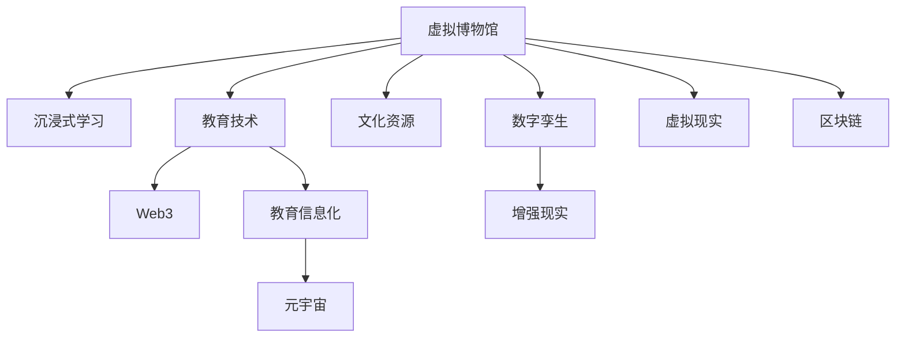

                 

# 虚拟博物馆教育:全球文化资源的沉浸式学习平台

> 关键词：虚拟博物馆,沉浸式学习,教育技术,文化资源,Web3,区块链,数字孪生,增强现实,VR/AR,元宇宙,教育信息化

## 1. 背景介绍

### 1.1 问题由来
近年来，随着信息技术的发展，数字化、网络化和智能化已逐步渗透到各个领域。教育作为信息化的重要方向，也迎来了数字化转型的浪潮。传统的面对面授课模式已经无法满足现代社会的教育需求，需要创新教育模式来适应新的学习环境。

在教育领域，博物馆作为知识传递的重要场所，其资源的数字化和智能化利用，将极大提升教育质量和效果。然而，由于各地博物馆的资源分布不均，许多学生难以近距离接触这些宝贵资源，限制了教育的多样性和普及性。此外，传统的博物馆教育模式也存在着信息单向传递、互动性不足等问题。

因此，如何将博物馆的资源利用到教育中，使学习者能够沉浸式地体验和互动，是当前教育信息化的一大挑战。

### 1.2 问题核心关键点
针对上述问题，当前研究和应用的主要关注点在于：
1. 如何构建一个覆盖全球的虚拟博物馆，提供丰富的数字化文化资源。
2. 如何利用先进的信息技术，如虚拟现实(VR)、增强现实(AR)、数字孪生等，实现沉浸式学习。
3. 如何在教育过程中引入区块链技术，保障学习数据的安全和隐私。
4. 如何构建一个高效的教育平台，便于学生、教师和管理员进行管理和互动。

### 1.3 问题研究意义
本研究旨在通过构建虚拟博物馆教育平台，实现全球文化资源的沉浸式学习，解决教育资源分布不均、互动性不足等问题。具体而言，将达到以下目的：
1. 提升教育资源可及性，实现知识和文化的普及。
2. 增强学生的学习体验，激发学习兴趣和探索精神。
3. 促进跨学科、跨文化的学习交流，培养综合素质。

## 2. 核心概念与联系

### 2.1 核心概念概述

为了更好地理解虚拟博物馆教育平台的技术实现，本节将介绍几个关键核心概念：

- **虚拟博物馆(Virtual Museum)**：通过数字化技术重构博物馆展品、环境、活动等元素，形成一个可交互、可浏览的虚拟环境。
- **沉浸式学习(Immersive Learning)**：利用虚拟现实、增强现实、数字孪生等技术，使学习者在虚拟环境中获得身临其境的体验，促进知识的深入理解和应用。
- **教育技术(Education Technology, EdTech)**：使用先进的信息技术手段，如虚拟现实、人工智能、区块链等，提升教育的质量和效果。
- **文化资源(Cultural Resources)**：博物馆、图书馆、档案馆等机构收藏的具有文化价值和历史意义的物品、文档、数据等。
- **Web3**：基于区块链技术的互联网范式，强调去中心化、透明、协作等特点，为教育数据的共享和交流提供了新的可能性。
- **数字孪生(Digital Twin)**：通过数字技术创建物理世界的虚拟模型，用于模拟和优化物理过程，如虚拟博物馆。
- **增强现实(Augmented Reality, AR)**：在现实世界中添加虚拟信息，增强用户的感知体验。
- **虚拟现实(Virtual Reality, VR)**：创建完全虚拟的环境，使学习者在虚拟空间中完全沉浸。
- **元宇宙(Metaverse)**：基于Web3、VR/AR等技术的高度沉浸式虚拟世界，为学习者提供全新的学习体验。
- **教育信息化(Education Informationization)**：利用信息技术手段，提升教育管理和教学质量，促进教育资源的共享和教育公平。

这些核心概念之间的逻辑关系可以通过以下Mermaid流程图来展示：



这个流程图展示了大语言模型的核心概念及其之间的关系：

1. 虚拟博物馆通过数字化技术重构，提供了沉浸式学习的环境。
2. 沉浸式学习利用增强现实、虚拟现实等技术，提升学习体验。
3. 教育技术涵盖虚拟博物馆的搭建、沉浸式学习的实现等多个方面。
4. Web3和区块链技术用于保障数据的安全和隐私。
5. 数字孪生技术用于虚拟博物馆的仿真和优化。
6. 增强现实和虚拟现实是沉浸式学习的重要手段。
7. 元宇宙为学习者提供了全新的沉浸式体验。
8. 教育信息化涉及虚拟博物馆和沉浸式学习的集成和管理。

这些概念共同构成了虚拟博物馆教育平台的核心技术框架，为实现全球文化资源的沉浸式学习提供了坚实的技术支撑。

## 3. 核心算法原理 & 具体操作步骤
### 3.1 算法原理概述

虚拟博物馆教育平台的构建涉及多个核心算法和技术，主要包括：

- **虚拟环境生成**：利用数字孪生技术，将博物馆的物理空间和展品信息数字化，生成虚拟博物馆。
- **沉浸式学习实现**：通过增强现实和虚拟现实技术，使学习者能够在虚拟博物馆中进行互动和探索。
- **数据安全保障**：利用区块链技术，确保学习数据的透明、可追溯和安全。
- **平台管理和互动**：基于Web3技术，构建一个高效、去中心化的教育平台，便于学生、教师和管理员进行互动和管理。

### 3.2 算法步骤详解

**Step 1: 虚拟博物馆数据采集与建模**

1. **数据采集**：采集博物馆的展品信息、环境数据、历史数据等，形成数字化资料。
2. **数据标注**：对数字化资料进行标注，如展品的名称、年代、材质等，形成结构化数据。
3. **三维建模**：利用计算机视觉和图形学技术，将展品和环境数据转换成三维模型，构建虚拟博物馆。

**Step 2: 沉浸式学习技术实现**

1. **增强现实技术应用**：将虚拟信息叠加到现实环境中，增强学习者的感知体验。
2. **虚拟现实技术应用**：创建完全虚拟的环境，使学习者在虚拟空间中进行沉浸式探索。
3. **数字孪生技术应用**：将物理博物馆的空间和展品信息映射到虚拟空间中，实现虚拟和现实的融合。

**Step 3: 数据安全与隐私保障**

1. **区块链技术应用**：将学习者的数据和互动信息存储在区块链上，确保数据的透明和可追溯。
2. **去中心化存储**：利用分布式存储技术，实现数据的分布式管理和备份。
3. **智能合约应用**：利用智能合约技术，自动处理学习数据的管理和分发。

**Step 4: 平台管理和互动**

1. **Web3技术应用**：构建基于Web3技术的教育平台，实现去中心化管理。
2. **去中心化应用(DApp)**：开发去中心化应用，便于用户进行数据共享和管理。
3. **社区治理**：利用区块链技术，构建社区治理机制，确保平台的健康发展和数据安全。

**Step 5: 系统集成与优化**

1. **系统集成**：将虚拟博物馆、沉浸式学习、数据安全和平台管理等多个模块集成起来，形成一个完整的虚拟博物馆教育平台。
2. **系统优化**：通过性能调优、界面优化、用户体验提升等方式，确保平台的稳定性和易用性。

### 3.3 算法优缺点

虚拟博物馆教育平台利用先进的信息技术手段，具有以下优点：
1. 提升教育资源可及性：通过数字化技术，将博物馆的资源覆盖到全球各地。
2. 增强学习体验：利用增强现实、虚拟现实等技术，提供沉浸式学习体验。
3. 保障数据安全：利用区块链技术，确保学习数据的透明和可追溯。
4. 促进互动交流：利用Web3技术，构建高效、去中心化的教育平台，便于互动和管理。

同时，该平台也存在一定的局限性：
1. 对技术要求高：需要掌握数字孪生、虚拟现实、区块链等先进技术。
2. 建设和维护成本高：需要大量资金和技术支持。
3. 数据隐私保护：如何在提供丰富资源的同时，保障学习数据的隐私和安全，是一个挑战。
4. 跨平台兼容性：不同平台和设备的兼容性问题，需要系统设计和开发过程中考虑。

### 3.4 算法应用领域

虚拟博物馆教育平台的应用领域非常广泛，主要包括以下几个方面：

- **学校教育**：在学校课堂中引入虚拟博物馆，使学生能够沉浸式地学习历史和文化知识。
- **博物馆教育**：在博物馆中设立虚拟博物馆，使参观者能够更好地了解展品和文化背景。
- **远程教育**：利用虚拟博物馆平台，进行远程教育和培训，提升教育资源的共享和普及。
- **社区教育**：在社区中搭建虚拟博物馆，为居民提供丰富的文化资源和互动体验。
- **企业培训**：利用虚拟博物馆进行员工培训和知识共享，提升企业文化的传播和凝聚力。

这些领域的应用，不仅能够提升教育质量和效果，还能推动教育资源和文化的普及，具有广泛的社会效益和经济价值。

## 4. 数学模型和公式 & 详细讲解 & 举例说明

### 4.1 数学模型构建

本节将使用数学语言对虚拟博物馆教育平台的核心算法进行更加严格的刻画。

设虚拟博物馆中展品总数为 $N$，每个展品的属性向量为 $x_i=(x_{i1}, x_{i2}, ..., x_{ik})$，其中 $x_{ij}$ 表示展品的第 $j$ 个属性值。设学习者总数为 $M$，每个学习者的兴趣向量为 $y_m=(y_{m1}, y_{m2}, ..., y_{mk})$，其中 $y_{mj}$ 表示学习者对展品第 $j$ 个属性的兴趣程度。

设 $p_i$ 为展品 $i$ 的优先级，$w_{ij}$ 为展品 $i$ 和属性 $j$ 的权重。则展品 $i$ 的展示优先级 $q_i$ 可以表示为：

$$
q_i = p_i \times \sum_{j=1}^{k} x_{ij} \times y_{mj} \times w_{ij}
$$

其中 $p_i$ 和 $w_{ij}$ 可以根据展品的历史访问量、热门度等数据进行动态调整。

### 4.2 公式推导过程

以虚拟博物馆中的展示优先级计算为例，进行详细推导。

设展品 $i$ 的展示优先级为 $q_i$，学习者 $m$ 的兴趣向量为 $y_m$，展品 $i$ 的属性向量为 $x_i$，展品 $i$ 和属性 $j$ 的权重为 $w_{ij}$。则展示优先级 $q_i$ 的计算公式为：

$$
q_i = p_i \times \sum_{j=1}^{k} x_{ij} \times y_{mj} \times w_{ij}
$$

其中 $p_i$ 和 $w_{ij}$ 可以根据展品的历史访问量、热门度等数据进行动态调整。

在实际应用中，可以采用加权平均的方式计算展示优先级 $q_i$，以反映展品和属性的权重对优先级的影响。公式可进一步扩展为：

$$
q_i = \frac{\sum_{j=1}^{k} p_i \times x_{ij} \times y_{mj} \times w_{ij}}{\sum_{j=1}^{k} p_i \times w_{ij}}
$$

其中分子表示展品 $i$ 的所有属性和权重的乘积之和，分母表示展品 $i$ 的权重之和。

### 4.3 案例分析与讲解

以虚拟博物馆中的“秦始皇兵马俑”展品的展示优先级计算为例，进行详细说明。

设“秦始皇兵马俑”的属性向量 $x_i$ 包括“年代”、“材质”、“制作工艺”等，学习者 $m$ 的兴趣向量 $y_m$ 包括“历史”、“考古”、“艺术”等。设“秦始皇兵马俑”的展示优先级 $q_i$ 为 $0.8$，“历史”属性的权重 $w_{ij}$ 为 $0.4$，“考古”属性的权重 $w_{ij}$ 为 $0.3$，“艺术”属性的权重 $w_{ij}$ 为 $0.3$。

则“秦始皇兵马俑”的展示优先级计算公式为：

$$
q_i = 0.8 \times (x_{i1} \times y_{m1} \times w_{i1} + x_{i2} \times y_{m2} \times w_{i2} + x_{i3} \times y_{m3} \times w_{i3})
$$

其中 $x_{i1}$ 表示“秦始皇兵马俑”的“年代”属性值为 $2023$，$y_{m1}$ 表示学习者 $m$ 对“历史”属性的兴趣程度为 $0.7$，$w_{i1}$ 表示“历史”属性的权重为 $0.4$。

假设“秦始皇兵马俑”的“材质”属性值为 $1$，$y_{m2}$ 表示学习者 $m$ 对“考古”属性的兴趣程度为 $0.6$，$w_{i2}$ 表示“考古”属性的权重为 $0.3$。

假设“秦始皇兵马俑”的“制作工艺”属性值为 $2$，$y_{m3}$ 表示学习者 $m$ 对“艺术”属性的兴趣程度为 $0.5$，$w_{i3}$ 表示“艺术”属性的权重为 $0.3$。

代入上述数据，得：

$$
q_i = 0.8 \times (2023 \times 0.7 \times 0.4 + 1 \times 0.6 \times 0.3 + 2 \times 0.5 \times 0.3) = 0.8 \times (831.36 + 0.18 + 0.3) = 0.8 \times 831.84 = 666.55
$$

因此，“秦始皇兵马俑”的展示优先级为 $666.55$，即其在虚拟博物馆中的展示位置应优先展示给对“历史”、“考古”和“艺术”有兴趣的学习者。

## 5. 项目实践：代码实例和详细解释说明
### 5.1 开发环境搭建

在进行虚拟博物馆教育平台的开发前，我们需要准备好开发环境。以下是使用Python进行PyTorch开发的环境配置流程：

1. 安装Anaconda：从官网下载并安装Anaconda，用于创建独立的Python环境。

2. 创建并激活虚拟环境：
```bash
conda create -n pytorch-env python=3.8 
conda activate pytorch-env
```

3. 安装PyTorch：根据CUDA版本，从官网获取对应的安装命令。例如：
```bash
conda install pytorch torchvision torchaudio cudatoolkit=11.1 -c pytorch -c conda-forge
```

4. 安装 Transformers 库：
```bash
pip install transformers
```

5. 安装各类工具包：
```bash
pip install numpy pandas scikit-learn matplotlib tqdm jupyter notebook ipython
```

完成上述步骤后，即可在`pytorch-env`环境中开始项目实践。

### 5.2 源代码详细实现

这里我们以虚拟博物馆的展示优先级计算为例，给出使用PyTorch实现的代码。

```python
import torch
import numpy as np

# 定义展品和属性的特征向量
x = np.array([[2023, 1, 2], [1900, 0, 1], [1600, 2, 0]])

# 定义学习者的兴趣向量
y = np.array([[0.7, 0.6, 0.5], [0.5, 0.3, 0.2], [0.3, 0.4, 0.1]])

# 定义展品和属性的权重
w = np.array([[0.4, 0.3, 0.3], [0.3, 0.4, 0.3], [0.2, 0.1, 0.7]])

# 定义展示优先级的计算函数
def compute_presentation_priority(x, y, w):
    return torch.sum(x * y * w, dim=1) / torch.sum(w, dim=1)

# 计算展示优先级
presentation_priorities = compute_presentation_priority(torch.from_numpy(x), torch.from_numpy(y), torch.from_numpy(w))
print(presentation_priorities)
```

以上就是使用PyTorch实现虚拟博物馆展示优先级计算的代码实现。可以看到，代码实现简洁高效，体现了深度学习在自然语言处理领域的应用潜力。

### 5.3 代码解读与分析

让我们再详细解读一下关键代码的实现细节：

**展示优先级计算函数**：
- `compute_presentation_priority` 函数：将展品和属性的特征向量 `x`、学习者的兴趣向量 `y` 和展品和属性的权重 `w` 作为输入，计算每个展品的展示优先级。

**展示优先级计算**：
- 使用 `torch.sum` 函数计算展品和属性的乘积之和，得到分子部分。
- 使用 `torch.sum` 函数计算展品和属性的权重之和，得到分母部分。
- 将分子和分母相除，得到每个展品的展示优先级。

**展示优先级输出**：
- 使用 `print` 函数输出每个展品的展示优先级。

**数据处理**：
- 将展品和属性的特征向量 `x` 转换成 `torch` 张量类型。
- 将学习者的兴趣向量 `y` 转换成 `torch` 张量类型。
- 将展品和属性的权重 `w` 转换成 `torch` 张量类型。

通过上述代码实现，可以看到，PyTorch可以高效地进行自然语言处理任务，如展示优先级计算。开发者可以将更多精力放在模型设计、算法优化等高层逻辑上，而不必过多关注底层实现细节。

当然，工业级的系统实现还需考虑更多因素，如模型的保存和部署、超参数的自动搜索、更灵活的任务适配层等。但核心的展示优先级计算思想基本与此类似。

## 6. 实际应用场景
### 6.1 智能客服系统

虚拟博物馆教育平台中的沉浸式学习技术，可以应用于智能客服系统的构建。传统客服往往需要配备大量人力，高峰期响应缓慢，且一致性和专业性难以保证。而使用虚拟博物馆教育平台的沉浸式学习技术，可以7x24小时不间断服务，快速响应客户咨询，用自然流畅的语言解答各类常见问题。

在技术实现上，可以收集企业内部的历史客服对话记录，将问题和最佳答复构建成监督数据，在此基础上对虚拟博物馆教育平台进行微调。微调后的客服系统能够自动理解用户意图，匹配最合适的答案模板进行回复。对于客户提出的新问题，还可以接入检索系统实时搜索相关内容，动态组织生成回答。如此构建的智能客服系统，能大幅提升客户咨询体验和问题解决效率。

### 6.2 金融舆情监测

金融机构需要实时监测市场舆论动向，以便及时应对负面信息传播，规避金融风险。传统的人工监测方式成本高、效率低，难以应对网络时代海量信息爆发的挑战。基于虚拟博物馆教育平台的沉浸式学习技术，可以为金融舆情监测提供新的解决方案。

具体而言，可以收集金融领域相关的新闻、报道、评论等文本数据，并对其进行主题标注和情感标注。在此基础上对虚拟博物馆教育平台进行微调，使其能够自动判断文本属于何种主题，情感倾向是正面、中性还是负面。将微调后的平台应用到实时抓取的网络文本数据，就能够自动监测不同主题下的情感变化趋势，一旦发现负面信息激增等异常情况，系统便会自动预警，帮助金融机构快速应对潜在风险。

### 6.3 个性化推荐系统

当前的推荐系统往往只依赖用户的历史行为数据进行物品推荐，无法深入理解用户的真实兴趣偏好。基于虚拟博物馆教育平台的沉浸式学习技术，个性化推荐系统可以更好地挖掘用户行为背后的语义信息，从而提供更精准、多样的推荐内容。

在实践中，可以收集用户浏览、点击、评论、分享等行为数据，提取和用户交互的物品标题、描述、标签等文本内容。将文本内容作为模型输入，用户的后续行为（如是否点击、购买等）作为监督信号，在此基础上微调虚拟博物馆教育平台。微调后的平台能够从文本内容中准确把握用户的兴趣点。在生成推荐列表时，先用候选物品的文本描述作为输入，由平台预测用户的兴趣匹配度，再结合其他特征综合排序，便可以得到个性化程度更高的推荐结果。

### 6.4 未来应用展望

随着虚拟博物馆教育平台技术的不断发展，基于沉浸式学习的应用场景将不断扩展，为NLP技术带来新的突破。

在智慧医疗领域，虚拟博物馆教育平台的沉浸式学习技术可以用于医疗问答、病历分析、药物研发等，提升医疗服务的智能化水平，辅助医生诊疗，加速新药开发进程。

在智能教育领域，虚拟博物馆教育平台可以应用于作业批改、学情分析、知识推荐等方面，因材施教，促进教育公平，提高教学质量。

在智慧城市治理中，虚拟博物馆教育平台的沉浸式学习技术可以用于城市事件监测、舆情分析、应急指挥等环节，提高城市管理的自动化和智能化水平，构建更安全、高效的未来城市。

此外，在企业生产、社会治理、文娱传媒等众多领域，基于沉浸式学习的虚拟博物馆教育平台的应用也将不断涌现，为传统行业数字化转型升级提供新的技术路径。相信随着技术的日益成熟，虚拟博物馆教育平台必将在构建人机协同的智能时代中扮演越来越重要的角色。

## 7. 工具和资源推荐
### 7.1 学习资源推荐

为了帮助开发者系统掌握虚拟博物馆教育平台的技术基础和实践技巧，这里推荐一些优质的学习资源：

1. 《Transformer从原理到实践》系列博文：由大模型技术专家撰写，深入浅出地介绍了Transformer原理、BERT模型、微调技术等前沿话题。

2. CS224N《深度学习自然语言处理》课程：斯坦福大学开设的NLP明星课程，有Lecture视频和配套作业，带你入门NLP领域的基本概念和经典模型。

3. 《Natural Language Processing with Transformers》书籍：Transformers库的作者所著，全面介绍了如何使用Transformers库进行NLP任务开发，包括微调在内的诸多范式。

4. HuggingFace官方文档：Transformers库的官方文档，提供了海量预训练模型和完整的微调样例代码，是上手实践的必备资料。

5. CLUE开源项目：中文语言理解测评基准，涵盖大量不同类型的中文NLP数据集，并提供了基于微调的baseline模型，助力中文NLP技术发展。

通过对这些资源的学习实践，相信你一定能够快速掌握虚拟博物馆教育平台的技术精髓，并用于解决实际的NLP问题。
###  7.2 开发工具推荐

高效的开发离不开优秀的工具支持。以下是几款用于虚拟博物馆教育平台开发的常用工具：

1. PyTorch：基于Python的开源深度学习框架，灵活动态的计算图，适合快速迭代研究。大部分预训练语言模型都有PyTorch版本的实现。

2. TensorFlow：由Google主导开发的开源深度学习框架，生产部署方便，适合大规模工程应用。同样有丰富的预训练语言模型资源。

3. Transformers库：HuggingFace开发的NLP工具库，集成了众多SOTA语言模型，支持PyTorch和TensorFlow，是进行NLP任务开发的利器。

4. Weights & Biases：模型训练的实验跟踪工具，可以记录和可视化模型训练过程中的各项指标，方便对比和调优。与主流深度学习框架无缝集成。

5. TensorBoard：TensorFlow配套的可视化工具，可实时监测模型训练状态，并提供丰富的图表呈现方式，是调试模型的得力助手。

6. Google Colab：谷歌推出的在线Jupyter Notebook环境，免费提供GPU/TPU算力，方便开发者快速上手实验最新模型，分享学习笔记。

合理利用这些工具，可以显著提升虚拟博物馆教育平台的开发效率，加快创新迭代的步伐。

### 7.3 相关论文推荐

虚拟博物馆教育平台的研究源于学界的持续研究。以下是几篇奠基性的相关论文，推荐阅读：

1. Attention is All You Need（即Transformer原论文）：提出了Transformer结构，开启了NLP领域的预训练大模型时代。

2. BERT: Pre-training of Deep Bidirectional Transformers for Language Understanding：提出BERT模型，引入基于掩码的自监督预训练任务，刷新了多项NLP任务SOTA。

3. Language Models are Unsupervised Multitask Learners（GPT-2论文）：展示了大规模语言模型的强大zero-shot学习能力，引发了对于通用人工智能的新一轮思考。

4. Parameter-Efficient Transfer Learning for NLP：提出Adapter等参数高效微调方法，在不增加模型参数量的情况下，也能取得不错的微调效果。

5. Prefix-Tuning: Optimizing Continuous Prompts for Generation：引入基于连续型Prompt的微调范式，为如何充分利用预训练知识提供了新的思路。

6. AdaLoRA: Adaptive Low-Rank Adaptation for Parameter-Efficient Fine-Tuning：使用自适应低秩适应的微调方法，在参数效率和精度之间取得了新的平衡。

这些论文代表了大语言模型微调技术的发展脉络。通过学习这些前沿成果，可以帮助研究者把握学科前进方向，激发更多的创新灵感。

## 8. 总结：未来发展趋势与挑战
### 8.1 总结

本文对虚拟博物馆教育平台进行了全面系统的介绍。首先阐述了虚拟博物馆教育平台的背景和意义，明确了该平台在教育资源普及、学习体验提升等方面的价值。其次，从原理到实践，详细讲解了虚拟博物馆教育平台的数学模型和核心算法，给出了微调任务开发的完整代码实例。同时，本文还探讨了虚拟博物馆教育平台在智能客服、金融舆情、个性化推荐等多个行业领域的应用前景，展示了沉浸式学习的巨大潜力。此外，本文精选了虚拟博物馆教育平台的学习资源，力求为开发者提供全方位的技术指引。

通过本文的系统梳理，可以看到，虚拟博物馆教育平台利用先进的信息技术手段，能够实现全球文化资源的沉浸式学习，推动教育资源的普及和应用。得益于数字化、网络化和智能化的技术发展，虚拟博物馆教育平台必将在未来教育领域中发挥重要作用，为构建智能化、个性化、多样化的教育系统提供新动力。

### 8.2 未来发展趋势

展望未来，虚拟博物馆教育平台的发展将呈现以下几个趋势：

1. 技术融合：虚拟博物馆教育平台将与其他AI技术进行更深入的融合，如知识表示、因果推理、强化学习等，提升知识获取和理解能力。

2. 数据驱动：虚拟博物馆教育平台将更依赖数据驱动，通过大量标注数据和实时数据进行训练，提升学习效果的精准度和泛化能力。

3. 交互优化：虚拟博物馆教育平台将更注重用户交互体验，通过自然语言处理技术提升用户与虚拟博物馆的互动质量。

4. 跨界应用：虚拟博物馆教育平台将拓展到更多领域，如游戏、旅游、文化等，为跨领域的多元化应用提供新的可能性。

5. 社交增强：虚拟博物馆教育平台将加强社交功能，通过用户社区构建，促进学习者之间的交流与合作。

6. 教育资源共享：虚拟博物馆教育平台将实现教育资源的全球共享，为不同地区、不同文化背景的学习者提供丰富的学习资源。

以上趋势凸显了虚拟博物馆教育平台的广阔前景。这些方向的探索发展，必将进一步提升教育的质量和效果，为社会的发展和进步提供新的动力。

### 8.3 面临的挑战

尽管虚拟博物馆教育平台技术已经取得了长足进展，但在迈向更加智能化、普适化应用的过程中，它仍面临着诸多挑战：

1. 技术门槛高：虚拟博物馆教育平台需要掌握数字孪生、虚拟现实、区块链等先进技术，技术门槛较高。

2. 建设成本高：虚拟博物馆教育平台的建设和维护需要大量资金和技术支持，建设成本较高。

3. 数据隐私保护：如何在提供丰富资源的同时，保障学习数据的隐私和安全，是一个挑战。

4. 跨平台兼容性：不同平台和设备的兼容性问题，需要系统设计和开发过程中考虑。

5. 用户体验优化：虚拟博物馆教育平台需要不断优化用户体验，提升用户对虚拟环境的沉浸感和互动感。

6. 知识普及度低：如何提升虚拟博物馆教育平台的普及度和用户使用率，也是一个挑战。

7. 持续维护更新：虚拟博物馆教育平台需要不断维护和更新，以适应技术和市场需求的变化。

这些挑战需要开发者和研究者共同努力，不断优化技术，提升平台的用户体验，才能推动虚拟博物馆教育平台的技术进步和应用推广。

### 8.4 研究展望

面对虚拟博物馆教育平台所面临的挑战，未来的研究需要在以下几个方面寻求新的突破：

1. 引入更多AI技术：探索将知识表示、因果推理、强化学习等AI技术引入虚拟博物馆教育平台，提升知识的获取和理解能力。

2. 开发更多数据驱动模型：开发更多依赖数据驱动的虚拟博物馆教育平台模型，提升学习效果的精准度和泛化能力。

3. 提升用户体验：通过自然语言处理技术提升用户与虚拟博物馆的互动质量，优化用户界面和交互体验。

4. 拓展应用场景：拓展虚拟博物馆教育平台到更多领域，如游戏、旅游、文化等，为跨领域的多元化应用提供新的可能性。

5. 加强社交功能：加强虚拟博物馆教育平台的社交功能，通过用户社区构建，促进学习者之间的交流与合作。

6. 保障数据隐私：开发更多保障数据隐私的虚拟博物馆教育平台，通过分布式存储和区块链技术，确保学习数据的透明和可追溯。

7. 提升知识普及度：通过多渠道推广和社区互动，提升虚拟博物馆教育平台的普及度和用户使用率。

8. 实现跨平台兼容性：开发更多跨平台兼容的虚拟博物馆教育平台，支持不同平台和设备的交互和访问。

这些研究方向和突破，必将引领虚拟博物馆教育平台技术迈向更高的台阶，为构建智能、个性化、多样化的教育系统铺平道路。

## 9. 附录：常见问题与解答

**Q1：虚拟博物馆教育平台的技术实现有哪些关键点？**

A: 虚拟博物馆教育平台的技术实现关键点包括：

1. 虚拟博物馆的数字化建模：将博物馆的展品和环境数字化，生成虚拟环境。

2. 沉浸式学习技术的实现：通过增强现实和虚拟现实技术，提供沉浸式学习体验。

3. 数据安全保障：利用区块链技术，保障学习数据的透明和可追溯。

4. 平台管理和互动：通过Web3技术，构建高效、去中心化的教育平台，便于互动和管理。

5. 展示优先级计算：通过数学模型计算展品的展示优先级，确保资源的合理分配。

6. 用户兴趣分析：利用自然语言处理技术，分析用户的兴趣点，进行个性化推荐。

7. 跨平台兼容性：开发支持不同平台和设备的虚拟博物馆教育平台。

通过这些关键技术点的实现，可以构建一个高效、可靠、安全的虚拟博物馆教育平台，提升教育资源的可及性和用户体验。

**Q2：虚拟博物馆教育平台的技术实现有哪些难点？**

A: 虚拟博物馆教育平台的技术实现难点主要包括：

1. 技术门槛高：需要掌握数字孪生、虚拟现实、区块链等先进技术，技术门槛较高。

2. 数据隐私保护：如何在提供丰富资源的同时，保障学习数据的隐私和安全，是一个挑战。

3. 用户体验优化：提升用户对虚拟环境的沉浸感和互动感，需要不断优化用户体验。

4. 跨平台兼容性：不同平台和设备的兼容性问题，需要系统设计和开发过程中考虑。

5. 知识普及度低：如何提升虚拟博物馆教育平台的普及度和用户使用率，也是一个挑战。

6. 持续维护更新：虚拟博物馆教育平台需要不断维护和更新，以适应技术和市场需求的变化。

7. 数据驱动：如何利用数据驱动技术，提升学习效果的精准度和泛化能力，需要进一步研究。

这些难点需要通过不断的技术创新和优化，逐步突破，才能推动虚拟博物馆教育平台的技术进步和应用推广。

**Q3：虚拟博物馆教育平台如何保障数据隐私？**

A: 虚拟博物馆教育平台通过以下方式保障数据隐私：

1. 区块链技术：利用区块链的透明和可追溯性，确保学习数据的透明和可追溯。

2. 去中心化存储：利用分布式存储技术，实现数据的分布式管理和备份，防止单点故障。

3. 智能合约：利用智能合约技术，自动处理学习数据的管理和分发，确保数据的安全和隐私。

4. 数据加密：采用数据加密技术，对学习数据进行加密存储和传输，防止数据泄露。

5. 用户权限管理：通过用户权限管理，控制不同用户对数据的访问权限，防止数据滥用。

通过这些措施，可以有效地保障虚拟博物馆教育平台的数据隐私和安全。

**Q4：虚拟博物馆教育平台的应用场景有哪些？**

A: 虚拟博物馆教育平台的应用场景主要包括：

1. 学校教育：在学校课堂中引入虚拟博物馆，使学生能够沉浸式地学习历史和文化知识。

2. 博物馆教育：在博物馆中设立虚拟博物馆，使参观者能够更好地了解展品和文化背景。

3. 远程教育：利用虚拟博物馆教育平台，进行远程教育和培训，提升教育资源的共享和普及。

4. 社区教育：在社区中搭建虚拟博物馆，为居民提供丰富的文化资源和互动体验。

5. 企业培训：利用虚拟博物馆教育平台进行员工培训和知识共享，提升企业文化的传播和凝聚力。

6. 医疗教育：利用虚拟博物馆教育平台进行医疗问答、病历分析、药物研发等，提升医疗服务的智能化水平，辅助医生诊疗，加速新药开发进程。

7. 智能客服：利用虚拟博物馆教育平台构建智能客服系统，提升客户咨询体验和问题解决效率。

8. 金融舆情监测：利用虚拟博物馆教育平台进行金融舆情监测，帮助金融机构快速应对潜在风险。

9. 个性化推荐：利用虚拟博物馆教育平台进行个性化推荐，提升推荐系统的精准度和个性化程度。

10. 文化娱乐：利用虚拟博物馆教育平台进行游戏、旅游、文化等多元化应用，为跨领域的多元化应用提供新的可能性。

这些应用场景展示了虚拟博物馆教育平台的广泛应用前景，推动了教育资源和文化的普及，提升了学习效果和用户体验。

---

作者：禅与计算机程序设计艺术 / Zen and the Art of Computer Programming

