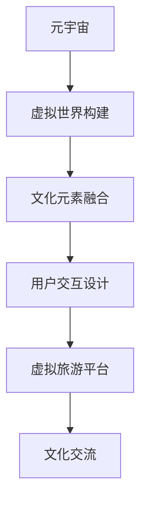

                 

# 虚拟旅游：元宇宙中的文化交流新方式

## 1. 背景介绍

### 1.1 问题由来
随着元宇宙概念的兴起，虚拟旅游作为元宇宙中极具吸引力的应用场景之一，正在成为全球科技公司和学术界竞相探索的热点领域。虚拟旅游不仅能够提供沉浸式、交互性的旅行体验，还能让人们跨越地域限制，探索世界各地文化景观，促进文化交流与理解。本文旨在探讨虚拟旅游在元宇宙中的实现机制，揭示其在文化交流中发挥的独特作用，并展望其未来的发展趋势。

### 1.2 问题核心关键点
虚拟旅游的核心在于如何通过数字技术重现真实世界的旅游体验，同时加入元宇宙的创新特性。本文将从以下几个方面展开讨论：

1. **虚拟世界构建**：如何构建逼真的虚拟世界环境，涵盖自然景观、建筑、交通等要素。
2. **用户交互设计**：如何设计自然、互动的用户体验，增强沉浸感。
3. **文化元素的融合**：如何在虚拟环境中融合各地的文化元素，丰富文化体验。
4. **虚拟旅游的经济模式**：如何通过虚拟旅游实现商业模式创新，推动产业发展。

通过深入分析这些关键点，本文将为虚拟旅游在元宇宙中的实现提供全面、系统的见解。

## 2. 核心概念与联系

### 2.1 核心概念概述

为了更好地理解虚拟旅游在元宇宙中的实现机制，首先需要明确几个核心概念：

- **元宇宙（Metaverse）**：由多个虚拟世界构成的、基于分布式计算的3D互联网环境，具有开放性、互动性和沉浸感。
- **虚拟旅游（Virtual Tourism）**：利用虚拟现实（VR）、增强现实（AR）等技术，提供沉浸式旅游体验的应用。
- **文化交流（Cultural Exchange）**：通过虚拟旅游促进不同文化背景的人之间的交流和理解。
- **虚拟场景构建（Virtual Scenery Construction）**：利用计算机图形学和虚拟现实技术，构建逼真的虚拟景观。
- **用户交互设计（User Interaction Design）**：通过交互设计提升用户沉浸感和体验舒适度。
- **虚拟旅游平台（Virtual Tourism Platform）**：提供在线旅游服务，支持虚拟景点游览、文化体验等功能的平台。

这些概念之间通过虚拟旅游技术的应用，构成了紧密的联系。例如，虚拟场景构建为虚拟旅游提供了基础，而用户交互设计则提升了用户体验，文化交流则是虚拟旅游的核心价值所在。

### 2.2 核心概念原理和架构的 Mermaid 流程图(Mermaid 流程节点中不要有括号、逗号等特殊字符)


这个流程图展示了元宇宙、虚拟旅游、文化交流之间的关系，以及它们是如何通过虚拟世界构建、用户交互设计、虚拟旅游平台等关键技术环节实现的。

## 3. 核心算法原理 & 具体操作步骤

### 3.1 算法原理概述

虚拟旅游的核心算法原理主要涉及以下几个方面：

1. **虚拟世界构建**：通过3D建模技术，生成逼真的虚拟景观和建筑，包括地形、植物、天气等自然元素的模拟。
2. **用户交互设计**：通过手势识别、语音控制、动作追踪等技术，实现用户在虚拟环境中的自然交互。
3. **文化元素的融合**：通过算法将各地的文化元素（如建筑风格、艺术作品、民俗活动等）融合到虚拟场景中。
4. **导航与路径规划**：通过路径规划算法，帮助用户在虚拟环境中高效导航，探索不同的景点。

### 3.2 算法步骤详解

以下将详细介绍虚拟旅游的实现步骤：

**Step 1: 虚拟世界构建**
1. 收集目标地点的高分辨率图片、地形数据、气象数据等。
2. 利用3D建模软件（如Blender、Maya等），根据收集到的数据生成虚拟景观和建筑。
3. 通过物理引擎（如Unity或Unreal Engine）模拟自然环境，如天气变化、光影效果等。

**Step 2: 文化元素融合**
1. 收集目标地点的大量文化资料，包括历史建筑、传统服饰、民俗活动等。
2. 设计虚拟角色，通过编程实现其行为和对话。
3. 在虚拟环境中融合文化元素，通过纹理映射、材质匹配等技术，使其与虚拟景观无缝结合。

**Step 3: 用户交互设计**
1. 收集用户交互数据，分析用户行为模式。
2. 设计手势识别、语音控制等交互方式，提升用户体验。
3. 进行用户测试，根据反馈调整交互设计，确保其自然性和易用性。

**Step 4: 导航与路径规划**
1. 通过算法计算虚拟环境中的导航路径，如A*算法、RRT算法等。
2. 根据用户偏好和目标地点，动态生成推荐路径。
3. 在导航过程中，实时调整路径，确保用户探索到感兴趣的区域。

**Step 5: 虚拟旅游平台搭建**
1. 设计虚拟旅游平台架构，包括前端界面、后端服务、数据存储等。
2. 开发平台功能，如景点展示、路径导航、文化体验等。
3. 进行平台测试和优化，确保其稳定性和可扩展性。

### 3.3 算法优缺点

虚拟旅游的实现算法具有以下优点：

1. **沉浸式体验**：通过3D建模和虚拟现实技术，提供沉浸式、交互性的旅游体验。
2. **跨地域文化交流**：用户可以在虚拟环境中访问世界各地，感受不同文化的魅力。
3. **个性化体验**：通过用户交互设计，提供个性化定制的旅游体验。

同时，也存在一些缺点：

1. **技术门槛高**：虚拟世界构建和用户交互设计需要较高的技术门槛，需要大量的开发时间和成本。
2. **数据收集难度大**：收集高分辨率图片、地形数据、文化资料等需要大量人力物力，数据质量难以保证。
3. **用户沉浸感有待提升**：虽然虚拟旅游技术已经取得了显著进步，但用户沉浸感仍需进一步提升。
4. **经济模式单一**：目前虚拟旅游的经济模式较为单一，主要依赖虚拟旅游平台的订阅费用，缺乏多样化盈利模式。

### 3.4 算法应用领域

虚拟旅游技术的应用领域广泛，主要包括以下几个方面：

1. **教育领域**：在虚拟环境中开展地理教育、历史文化教育，提升学生的学习体验和兴趣。
2. **旅游业**：为无法亲身旅游的用户提供沉浸式旅游体验，同时辅助旅行社规划路线和推广旅游产品。
3. **文化交流**：促进不同文化背景的人之间的交流和理解，提升全球文化多样性的认同感。
4. **休闲娱乐**：提供沉浸式的娱乐体验，如虚拟旅游、虚拟观光等。
5. **城市规划**：通过虚拟旅游技术进行城市景观规划和旅游资源评估。

## 4. 数学模型和公式 & 详细讲解 & 举例说明

### 4.1 数学模型构建

虚拟旅游的数学模型主要涉及以下几个方面：

- **三维坐标系**：用于描述虚拟景观和用户的位置信息。
- **地形生成算法**：如Perlin噪声算法、Voronoi图算法等，生成逼真的地形。
- **路径规划算法**：如A*算法、RRT算法等，实现用户导航。
- **用户行为模型**：通过机器学习算法，预测用户的行为和偏好。

### 4.2 公式推导过程

以A*算法为例，其核心公式如下：

$$ F(n) = G(n) + H(n) $$

其中，$F(n)$表示节点$n$的启发式函数，$G(n)$表示节点$n$到起点的实际距离，$H(n)$表示节点$n$到终点的估计距离。A*算法通过不断扩展$F(n)$最小的节点，逐步逼近终点，实现最优路径规划。

### 4.3 案例分析与讲解

以下将以一个虚拟城市旅游为例，分析A*算法在导航中的具体应用：

1. **目标设定**：从虚拟城市的起点到终点，规划一条最短路径。
2. **地图建立**：将虚拟城市建立为图结构，每个节点表示一个地点。
3. **成本计算**：根据实际情况，设置不同地点的通过成本。
4. **启发式函数**：选择曼哈顿距离或欧几里得距离作为启发式函数，优化路径规划。
5. **路径生成**：通过A*算法，生成从起点到终点的最优路径，并提供实时导航指引。

## 5. 项目实践：代码实例和详细解释说明

### 5.1 开发环境搭建

为了进行虚拟旅游的开发，需要搭建以下开发环境：

1. **3D建模工具**：如Blender、Maya等，用于创建虚拟景观和建筑。
2. **虚拟现实平台**：如Unity、Unreal Engine等，用于实现虚拟旅游体验。
3. **数据库系统**：如MySQL、MongoDB等，用于存储和管理虚拟旅游数据。
4. **服务器集群**：用于提供高并发访问的支持和稳定运行。

### 5.2 源代码详细实现

以下是一个简单的虚拟旅游平台实现示例，包括用户注册、景点展示、路径规划等功能。

```python
from flask import Flask, render_template, request
from flask_sqlalchemy import SQLAlchemy
from flask_login import LoginManager, login_user, logout_user, login_required
from werkzeug.security import generate_password_hash, check_password_hash
from sqlalchemy import create_engine
from sqlalchemy.orm import sessionmaker
from sqlalchemy.ext.declarative import declarative_base
from sqlalchemy import Column, Integer, String, ForeignKey, DateTime
from datetime import datetime

app = Flask(__name__)
app.config['SQLALCHEMY_DATABASE_URI'] = 'sqlite:///tours.db'
app.config['SECRET_KEY'] = 'secret_key'

db = SQLAlchemy(app)
login_manager = LoginManager(app)

# 用户表定义
class User(db.Model):
    id = Column(Integer, primary_key=True)
    username = Column(String(50), unique=True)
    password_hash = Column(String(100))

    def set_password(self, password):
        self.password_hash = generate_password_hash(password)

    def check_password(self, password):
        return check_password_hash(self.password_hash, password)

# 景点表定义
class TouristAttraction(db.Model):
    id = Column(Integer, primary_key=True)
    name = Column(String(100))
    description = Column(String(500))
    location = Column(String(100))

# 用户注册功能
@app.route('/register', methods=['GET', 'POST'])
def register():
    if request.method == 'POST':
        username = request.form.get('username')
        password = request.form.get('password')
        user = User(username=username)
        user.set_password(password)
        db.session.add(user)
        db.session.commit()
        return '注册成功'
    return render_template('register.html')

# 景点展示功能
@app.route('/attractions', methods=['GET', 'POST'])
@login_required
def attractions():
    attractions = TouristAttraction.query.all()
    return render_template('attractions.html', attractions=attractions)

# 路径规划功能
@app.route('/path_planning', methods=['GET', 'POST'])
@login_required
def path_planning():
    start = request.form.get('start')
    end = request.form.get('end')
    # 调用路径规划算法生成路径
    path = path_planning_algorithm(start, end)
    return render_template('path_planning.html', path=path)

if __name__ == '__main__':
    app.run(debug=True)
```

### 5.3 代码解读与分析

以上代码实现了一个简单的虚拟旅游平台，包括用户注册、景点展示、路径规划等功能。以下是对关键代码的解读：

**用户注册功能**
- 实现用户注册页面，接收用户名和密码，调用`set_password`方法进行密码哈希处理。
- 将用户信息存储到数据库中。

**景点展示功能**
- 查询数据库中的所有景点信息，返回给用户页面。

**路径规划功能**
- 接收起点和终点，调用路径规划算法生成路径。
- 返回路径规划结果给用户页面。

### 5.4 运行结果展示

运行以上代码，可以通过`localhost:5000`访问虚拟旅游平台，展示景点信息和路径规划结果。

## 6. 实际应用场景

### 6.1 教育领域

虚拟旅游在教育领域有着广泛的应用前景。通过虚拟旅游，学生可以在虚拟环境中进行实地考察，体验不同国家的文化和历史。例如，在地理课中，学生可以探索世界各地的名胜古迹，增强对地理知识的理解和记忆。

### 6.2 旅游业

虚拟旅游可以为无法亲身旅游的用户提供沉浸式体验，同时辅助旅行社规划路线和推广旅游产品。例如，在疫情期间，旅游业面临巨大挑战，虚拟旅游成为重要的替代方案。用户可以通过虚拟旅游平台，了解目的地的文化景观，甚至进行虚拟试游，提前做好旅游规划。

### 6.3 文化交流

虚拟旅游在促进文化交流方面具有独特的优势。不同文化背景的人可以在虚拟环境中自由交流，体验各地的文化风情，增强对全球文化多样性的认同感。例如，在联合国教科文组织的支持项目中，虚拟旅游平台被用于展示世界各地的文化遗产，促进文化保护和交流。

## 7. 工具和资源推荐

### 7.1 学习资源推荐

为了深入理解虚拟旅游的技术原理和实现细节，以下是几本推荐的书籍和文章：

1. **《虚拟旅游技术手册》**：详细介绍了虚拟旅游技术的基本概念和实现方法。
2. **《虚拟现实技术基础》**：讲解了虚拟现实技术的核心算法和应用场景。
3. **《机器学习与虚拟旅游》**：探讨了机器学习在虚拟旅游中的各种应用。
4. **《虚拟旅游平台设计与实现》**：提供了虚拟旅游平台开发的最佳实践和示例代码。

### 7.2 开发工具推荐

以下几款工具可以帮助开发者高效实现虚拟旅游项目：

1. **Blender**：3D建模工具，支持高精度的虚拟场景构建。
2. **Unity**：流行的游戏引擎，支持虚拟现实开发，提供了丰富的3D引擎和工具。
3. **Unreal Engine**：支持高实时渲染和物理引擎，适合构建大规模虚拟世界。
4. **Flask**：轻量级的Web框架，用于搭建虚拟旅游平台的后端服务。
5. **SQLAlchemy**：ORM框架，用于管理虚拟旅游平台的数据库。

### 7.3 相关论文推荐

以下几篇论文代表了虚拟旅游技术的前沿研究成果：

1. **《基于虚拟现实的旅游体验设计》**：研究了虚拟现实技术在旅游体验中的应用，提出了基于用户行为的数据分析方法。
2. **《元宇宙中的文化交流》**：探讨了元宇宙技术在文化交流中的应用，提出了虚拟旅游平台的多文化融合机制。
3. **《虚拟旅游路径规划算法研究》**：介绍了多种路径规划算法在虚拟旅游中的应用，进行了性能对比和优化。

## 8. 总结：未来发展趋势与挑战

### 8.1 研究成果总结

本文介绍了虚拟旅游在元宇宙中的实现机制，揭示了其独特的文化交流价值，并展望了其未来的发展趋势。虚拟旅游通过3D建模、虚拟现实、路径规划等技术，实现了沉浸式、交互性的旅游体验，为用户提供了跨越地域限制的文化交流新方式。虚拟旅游的发展，将推动旅游业、教育、文化交流等多个领域的技术创新和应用变革。

### 8.2 未来发展趋势

未来，虚拟旅游的发展趋势如下：

1. **多模态交互**：结合语音、手势、触觉等多种交互方式，提升用户的沉浸感和体验舒适度。
2. **个性化推荐**：通过机器学习算法，根据用户行为和偏好，提供个性化的虚拟旅游体验。
3. **实时更新**：通过云计算和边缘计算技术，实现虚拟环境的实时更新和动态调整。
4. **跨平台整合**：实现虚拟旅游平台与其他社交、娱乐、教育平台的整合，形成生态闭环。

### 8.3 面临的挑战

尽管虚拟旅游有着广阔的应用前景，但也面临以下挑战：

1. **技术瓶颈**：虚拟世界的构建和渲染需要高性能的计算资源，当前技术仍需突破。
2. **数据质量**：获取高质量的3D数据和纹理信息，需要大量时间和成本。
3. **用户体验**：提升用户的沉浸感和自然交互，仍需进一步研究和优化。
4. **商业模式**：虚拟旅游的商业模式单一，缺乏多样化的盈利模式。

### 8.4 研究展望

为应对上述挑战，未来的研究方向如下：

1. **技术优化**：研发更加高效、低成本的3D建模和渲染技术，提升虚拟世界的构建质量。
2. **数据挖掘**：采用大数据和机器学习技术，提高数据采集和处理的效率和质量。
3. **用户体验提升**：深入研究用户行为和心理，设计自然、无缝的交互方式，提升用户体验。
4. **商业模式创新**：探索虚拟旅游的多种盈利模式，如虚拟商品销售、广告投放、内容订阅等。

## 9. 附录：常见问题与解答

**Q1：虚拟旅游的实现需要哪些关键技术？**

A: 虚拟旅游的实现需要以下关键技术：

1. **3D建模技术**：用于构建逼真的虚拟景观和建筑。
2. **虚拟现实技术**：如VR和AR，提供沉浸式体验。
3. **路径规划算法**：用于导航和路径生成。
4. **机器学习算法**：用于用户行为预测和个性化推荐。
5. **数据管理和存储技术**：用于管理和存储虚拟旅游数据。

**Q2：虚拟旅游与现实旅游相比有何优势？**

A: 虚拟旅游相比现实旅游具有以下优势：

1. **成本低**：用户无需支付高昂的旅游费用和住宿费用。
2. **时间灵活**：用户可以随时随地进行虚拟旅游，不受时间和地理位置的限制。
3. **安全可靠**：虚拟旅游环境安全可靠，不会受到自然灾害和意外事故的影响。
4. **文化体验丰富**：用户可以体验不同文化背景的风俗习惯和生活方式。

**Q3：虚拟旅游平台如何实现个性化推荐？**

A: 虚拟旅游平台通过以下方式实现个性化推荐：

1. **用户行为分析**：通过数据分析，了解用户的行为模式和偏好。
2. **推荐算法设计**：基于协同过滤、内容推荐等算法，生成个性化的虚拟旅游推荐。
3. **实时调整**：根据用户反馈，实时调整推荐结果，提升推荐效果。

**Q4：虚拟旅游的商业模式有哪些？**

A: 虚拟旅游的商业模式主要有以下几种：

1. **订阅模式**：用户购买虚拟旅游平台的订阅服务，享受各种虚拟旅游体验。
2. **广告模式**：平台通过广告收入，为商家提供虚拟广告位。
3. **虚拟商品销售**：平台销售虚拟商品，如虚拟旅游纪念品、虚拟景观等。
4. **内容付费**：用户支付一定费用，获取高质量的虚拟旅游内容。

**Q5：虚拟旅游的发展前景如何？**

A: 虚拟旅游的发展前景非常广阔，主要体现在以下几个方面：

1. **应用领域广泛**：虚拟旅游可以应用于教育、旅游、文化交流等多个领域，具有广阔的市场前景。
2. **技术成熟度提升**：随着技术的不断进步，虚拟旅游的体验将越来越逼真，应用场景将越来越丰富。
3. **政策支持**：各国政府和社会组织对虚拟旅游的认可和支持，为其发展提供了有利条件。

---

作者：禅与计算机程序设计艺术 / Zen and the Art of Computer Programming

