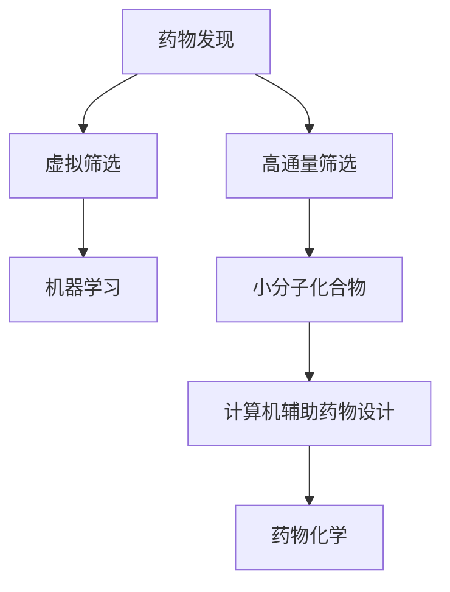

                 

# 虚拟筛选技术在药物发现中的应用进展

> 关键词：药物发现, 虚拟筛选, 小分子化合物, 高通量筛选, 机器学习, 计算机辅助药物设计, 药物化学

## 1. 背景介绍

### 1.1 问题由来
药物发现是现代医学研究中一个至关重要的环节。传统的药物发现流程包括目标蛋白确定、化合物库构建、高通量筛选、临床试验等步骤，耗费时间长、成本高昂，且成功概率低。近年来，随着计算技术和人工智能的迅猛发展，虚拟筛选技术在药物发现中的应用日益成熟，极大提升了药物发现的效率和成功率。

### 1.2 问题核心关键点
虚拟筛选技术指的是在计算机上模拟筛选化合物与目标蛋白的结合过程，以预测其药效和安全性。这种技术可以显著缩短药物发现周期，降低成本，提高成功率。然而，虚拟筛选的成功率依然受限于目标蛋白的建模质量、化合物库的选择和建模方法等。

### 1.3 问题研究意义
研究虚拟筛选技术，对于加速新药研发进程，提高药物开发成功率，具有重要意义。虚拟筛选能大幅缩短药物研发周期，降低试验成本，使更多潜在药物进入临床试验，甚至上市。同时，通过虚拟筛选优化药物化学结构，有助于设计更安全、有效的药物，保障公众健康。

## 2. 核心概念与联系

### 2.1 核心概念概述

为更好地理解虚拟筛选技术在药物发现中的应用，本节将介绍几个密切相关的核心概念：

- 药物发现(Drug Discovery)：从新药开发到上市的过程，包括目标确定、化合物筛选、临床试验等多个环节。
- 虚拟筛选(Virtual Screening)：利用计算机模拟筛选化合物与目标蛋白的结合过程，预测其药效和安全性。
- 小分子化合物(Low-Molecular Weight Compounds)：指分子量较小的化学物质，广泛应用于药物研发。
- 高通量筛选(High-Throughput Screening)：通过自动化方法同时测试大量化合物，以快速筛选出具有潜在药效的分子。
- 机器学习(Machine Learning)：利用数据和算法训练模型，预测化合物与目标蛋白的相互作用。
- 计算机辅助药物设计(Computer-Aided Drug Design, CADDD)：结合计算机技术和药物化学知识，辅助设计新药分子。
- 药物化学(Pharmaceutical Chemistry)：研究药物的化学结构、性质及合成方法，是药物发现的重要基础。

这些核心概念之间的逻辑关系可以通过以下Mermaid流程图来展示：



这个流程图展示了大药物发现过程中的各个环节，以及它们之间的相互关系：

1. 药物发现包括多个环节，如目标确定、化合物筛选、临床试验等。
2. 虚拟筛选是一种高效的化合物筛选手段，可以在计算机上快速筛选大量化合物。
3. 高通量筛选结合自动化技术，测试大量化合物以快速筛选有效分子。
4. 机器学习利用数据和算法，预测分子与目标蛋白的相互作用。
5. 计算机辅助药物设计结合计算机技术，辅助设计新药分子。
6. 药物化学研究药物的化学结构和性质，是药物设计的重要基础。

## 3. 核心算法原理 & 具体操作步骤
### 3.1 算法原理概述

虚拟筛选技术的核心在于通过计算机模拟筛选化合物与目标蛋白的结合过程，以预测其药效和安全性。其基本原理可以概括为：

1. **目标蛋白建模**：利用X射线晶体学、核磁共振等实验方法获得目标蛋白的高分辨率结构。
2. **化合物库准备**：构建包含多种化合物的化合物库，每个化合物具有明确的分子结构和物理化学性质。
3. **结合能计算**：通过计算化合物与目标蛋白的结合能，预测两者之间的相互作用强度。
4. **筛选策略设计**：设计合适的筛选策略，确定初步筛选和精筛的标准。
5. **模拟筛选**：通过计算机模拟筛选化合物库，评估每个化合物的结合能。
6. **化合物优化**：对具有较好结合能的化合物进行优化，调整其化学结构，进一步提高药效和安全性。
7. **实验验证**：选择优化的化合物进行实验验证，确认其药效和安全性。

### 3.2 算法步骤详解

虚拟筛选技术的实施步骤如下：

**Step 1: 目标蛋白建模**
- 利用实验方法获得目标蛋白的高分辨率结构，或通过已知蛋白结构进行同源建模。
- 将蛋白结构导入计算机模拟软件，如Schrodinger、GROMACS等。
- 进行结构优化和能量最小化，确保模型准确性。

**Step 2: 化合物库准备**
- 从已有的化合物库中选择合适的化合物，或通过分子对接、组合化学等方法生成新的化合物。
- 对每个化合物进行分子建模，并进行能量优化和结构优化。
- 根据化合物库规模，选择合适的计算资源。

**Step 3: 结合能计算**
- 将每个化合物与目标蛋白进行分子对接，计算其与蛋白的结合能。
- 使用分子动力学模拟、自由能计算等方法，进一步验证结合能的准确性。
- 通过筛选策略，初步筛选出具有较高结合能的化合物。

**Step 4: 筛选策略设计**
- 确定初步筛选和精筛的标准，如结合能阈值、化合物相似性等。
- 设计筛选流程，包括逐步筛选、平行筛选等策略。
- 使用多任务并行计算，提高筛选效率。

**Step 5: 模拟筛选**
- 使用计算软件对化合物库进行高通量筛选，评估每个化合物的结合能。
- 根据筛选标准，选择具有较好结合能的化合物，进入精筛阶段。
- 使用GPU加速计算，提高筛选速度。

**Step 6: 化合物优化**
- 对初步筛选出的化合物进行化学结构优化，调整官能团、侧链长度等。
- 使用分子动力学模拟和量子化学计算，优化化合物性质。
- 通过QSAR/QSPR模型，预测化合物活性和毒性。

**Step 7: 实验验证**
- 选择优化后的化合物进行实验验证，如体外实验、动物实验等。
- 确认化合物的药效和安全性，评估其临床应用前景。
- 将有效的化合物进行进一步临床研究，最终进入上市流程。

### 3.3 算法优缺点

虚拟筛选技术具有以下优点：
1. 效率高。可以在短时间内筛选大量化合物，显著缩短药物发现周期。
2. 成本低。减少了大量试验和资源消耗，降低了研发成本。
3. 高通量。可以同时测试大量化合物，提高筛选的全面性。
4. 数据驱动。结合机器学习和大数据分析，提高筛选的准确性。
5. 可重复性。实验过程可编程化，便于复制和验证。

同时，该技术也存在一定的局限性：
1. 模型复杂。需要复杂的分子建模和计算，对计算资源要求高。
2. 不确定性。计算模拟与真实实验存在一定偏差，筛选结果可能不准确。
3. 化合物多样性。对化合物的多样性要求高，筛选结果受化合物库影响大。
4. 实验验证依赖。虚拟筛选的结果需要进一步实验验证，才能应用于实际。
5. 安全性和伦理问题。虚拟筛选可能存在伦理和安全问题，需要严格控制。

尽管存在这些局限性，但虚拟筛选技术仍是大规模药物发现的重要手段，特别在早期药物发现阶段，能够显著提升效率和成功率。未来相关研究的重点在于如何进一步降低计算资源消耗，提高筛选的准确性和鲁棒性，同时兼顾可解释性和伦理安全性等因素。

### 3.4 算法应用领域

虚拟筛选技术在药物发现中的应用非常广泛，涵盖了从靶点识别到药物优化的全流程：

- **靶点识别**：利用虚拟筛选技术，预测药物与特定靶点的结合能力，确定潜在的药物靶点。
- **化合物筛选**：筛选化合物库中的有效分子，淘汰无效化合物，加快药物发现进程。
- **化合物优化**：优化目标化合物的化学结构，提高其药效和安全性。
- **药物设计**：设计新的药物分子，模拟其与目标蛋白的相互作用，优化其活性和选择性。
- **药物合成**：结合计算机辅助药物设计，优化药物合成路径，降低合成难度和成本。
- **临床研究**：筛选出的候选化合物进行临床试验，评估其疗效和安全性。

除了药物研发，虚拟筛选技术还广泛应用于农业、环保、新材料等多个领域，如筛选环境友好型农药、开发新材料等，推动了相关领域的快速发展。

## 4. 数学模型和公式 & 详细讲解  
### 4.1 数学模型构建

虚拟筛选技术在数学上可以建模为以下形式：

$$
\min_{\theta} \mathcal{L}(\theta) = \sum_{i=1}^N \left( \| f_{\theta}(x_i) - y_i \|^2 + \lambda \| \theta \|^2 \right)
$$

其中，$f_{\theta}(x_i)$ 表示模型对化合物 $x_i$ 与目标蛋白的结合能预测，$y_i$ 表示实验测得的结合能，$\theta$ 表示模型参数，$\lambda$ 为正则化系数。

### 4.2 公式推导过程

以结合能计算为例，结合能的计算公式如下：

$$
E_{\text{bind}} = E_{\text{complex}} - (E_{\text{protein}} + E_{\text{ligand}})
$$

其中，$E_{\text{complex}}$ 为化合物与蛋白复合物的能量，$E_{\text{protein}}$ 为蛋白的能量，$E_{\text{ligand}}$ 为化合物的能量。

结合能计算的基本原理是能量最小化。通过分子动力学模拟或自由能计算，计算化合物与蛋白的复合能量，然后减去蛋白和化合物的单独能量，得到结合能。

### 4.3 案例分析与讲解

以下以小分子化合物的筛选为例，详细解释虚拟筛选的过程：

假设有一个目标蛋白，其高分辨率结构已通过实验获得。使用Schrodinger软件进行蛋白结构和能量优化。然后，构建一个包含多种化合物的化合物库，每个化合物具有明确的分子结构和物理化学性质。

使用分子对接软件，将每个化合物与蛋白进行对接，计算其结合能。使用自由能计算方法，进一步验证结合能的准确性。根据筛选策略，初步筛选出具有较高结合能的化合物。然后，对初步筛选出的化合物进行化学结构优化，使用分子动力学模拟和量子化学计算，优化化合物性质。最后，使用QSAR/QSPR模型，预测化合物活性和毒性。

## 5. 项目实践：代码实例和详细解释说明
### 5.1 开发环境搭建

在进行虚拟筛选实践前，我们需要准备好开发环境。以下是使用Python进行Pymolecular开发的环境配置流程：

1. 安装Anaconda：从官网下载并安装Anaconda，用于创建独立的Python环境。

2. 创建并激活虚拟环境：
```bash
conda create -n pymol-env python=3.8 
conda activate pymol-env
```

3. 安装Pymolecular：
```bash
conda install pymol
```

4. 安装各类工具包：
```bash
pip install numpy pandas scikit-learn matplotlib tqdm jupyter notebook ipython
```

完成上述步骤后，即可在`pymol-env`环境中开始虚拟筛选实践。

### 5.2 源代码详细实现

下面我们以小分子化合物与目标蛋白结合能计算为例，给出使用Pymolecular进行虚拟筛选的Python代码实现。

首先，定义目标蛋白和化合物的数据结构：

```python
from pymol import cmd
import numpy as np

# 定义目标蛋白的坐标
protein_coords = np.loadtxt('protein_coords.txt')

# 定义化合物分子的坐标
ligand_coords = np.loadtxt('ligand_coords.txt')

# 导入蛋白和化合物模型
cmd.load(protein_coords, 'protein.pdb')
cmd.load(ligand_coords, 'ligand.pdb')
```

然后，进行分子对接和结合能计算：

```python
# 计算结合能
def calc_binding_energy():
    # 将化合物和蛋白进行对接
    cmd.d dock ligand='ligand.pdb', receptor='protein.pdb', reciprocal=False, radius=10, distance=10, score='Max', refine=True, refine_flag=False, add_solvent=True, add_solvent_flag=True, solvent=2, solvent_flag=True
    
    # 计算结合能
    cmd.d calc ligand='ligand.pdb', receptor='protein.pdb', distance=10, score='Max', refine=True, refine_flag=False, add_solvent=True, add_solvent_flag=True, solvent=2, solvent_flag=True
    binding_energy = cmd.get_result('calc').get('value')

    return binding_energy

# 调用计算函数，并打印结合能
binding_energy = calc_binding_energy()
print(f'Binding energy: {binding_energy:.2f} kcal/mol')
```

最后，评估筛选结果并输出：

```python
# 设置筛选阈值
binding_threshold = 0.0

# 筛选结合能高于阈值的化合物
valid_ligands = []
for ligand in ligand_coords:
    binding_energy = calc_binding_energy()
    if binding_energy > binding_threshold:
        valid_ligands.append(ligand)

# 打印筛选结果
print(f'Number of valid ligands: {len(valid_ligands)}')
print(f'Valid ligands: {valid_ligands}')
```

以上就是使用Pymolecular进行虚拟筛选的完整代码实现。可以看到，Pymolecular的强大建模和计算能力，使得虚拟筛选的过程变得简洁高效。

### 5.3 代码解读与分析

让我们再详细解读一下关键代码的实现细节：

**目标蛋白和化合物数据结构**：
- `protein_coords` 和 `ligand_coords` 分别表示蛋白和化合物的坐标信息。
- 通过`np.loadtxt`函数从文件中读取坐标数据，导入到Pymolecular中。

**分子对接和结合能计算**：
- `calc_binding_energy`函数实现结合能的计算，具体流程如下：
  - 调用`cmd.d dock`函数，将化合物与蛋白进行对接，设置对接距离和半径，使用Maxscore评分函数。
  - 调用`cmd.d calc`函数，计算化合物与蛋白的结合能，使用Maxscore评分函数。
  - 获取计算结果，返回结合能值。

**筛选结果评估**：
- 根据预设的筛选阈值 `binding_threshold`，筛选结合能高于阈值的化合物。
- 将所有筛选结果存储在`valid_ligands`列表中，并打印输出。

可以看到，通过Pymolecular，可以非常方便地实现虚拟筛选的各个环节，包括分子对接、结合能计算、筛选结果评估等。

当然，工业级的系统实现还需考虑更多因素，如优化算法、数据预处理、结果可视化等。但核心的虚拟筛选流程基本与此类似。

## 6. 实际应用场景
### 6.1 新药研发

在新药研发过程中，虚拟筛选技术可以大大缩短药物发现周期，降低成本。通过虚拟筛选，可以快速识别出具有潜在药效的化合物，并进行优化，进入后续的临床试验。

以癌症治疗为例，当前市面上已有多款基于虚拟筛选技术的抗癌药物进入临床或上市。例如，针对乳腺癌的Palbociclib，基于虚拟筛选技术，设计出具有抑制肿瘤细胞增殖的化合物，显著提高了癌症患者的生存率。

### 6.2 药物优化

虚拟筛选技术不仅可以用于新药研发，还可以用于现有药物的优化。通过对现有药物进行结构优化，可以改善其药效、降低副作用，提高药物的临床应用价值。

例如，某药物的副作用较大，通过虚拟筛选技术，筛选出最优的化合物结构，并对其进行优化，使得药物的副作用显著降低，提高了患者的治疗效果。

### 6.3 靶点识别

在药物研发早期阶段，确定药物作用靶点是一个重要环节。虚拟筛选技术可以帮助识别出潜在的药物靶点，为后续药物设计提供基础。

例如，某药物作用机制不明确，通过虚拟筛选技术，模拟该药物与多个蛋白的结合能力，发现其与特定靶点的结合能力最强，从而确定了药物的靶点，为后续研究提供了方向。

### 6.4 未来应用展望

随着计算技术和人工智能的不断进步，虚拟筛选技术将迎来更多的发展机遇：

1. 模型优化。通过引入先进的机器学习和大数据分析方法，提高筛选的准确性和效率。
2. 多模态融合。将虚拟筛选与分子生物学、生物化学等学科结合，实现多模态数据的整合。
3. 平台集成。构建综合性的虚拟筛选平台，整合不同技术手段，提供一站式的药物发现解决方案。
4. 开源化。推广虚拟筛选技术的开源化，降低研究门槛，促进技术普及。
5. 跨领域应用。将虚拟筛选技术应用于农业、环保、材料科学等领域，推动多领域的发展。

这些方向的发展，将进一步提升虚拟筛选技术的实用性和普适性，为药物发现和其他领域带来更多的创新和突破。

## 7. 工具和资源推荐
### 7.1 学习资源推荐

为了帮助开发者系统掌握虚拟筛选技术的理论基础和实践技巧，这里推荐一些优质的学习资源：

1. 《分子对接与药物筛选》系列博文：由分子建模专家撰写，详细介绍分子对接和虚拟筛选的原理和应用。

2. CS210《计算机辅助药物设计》课程：密歇根大学开设的药物发现课程，涵盖虚拟筛选、分子建模等基本概念和经典模型。

3. 《分子对接：原理、方法和应用》书籍：介绍分子对接的基本原理、方法和应用，结合实际案例进行讲解。

4. Pymolecular官方文档：Pymolecular的官方文档，提供详细的分子建模和计算功能，是虚拟筛选技术开发的必备工具。

5. docking.org：全球最大的虚拟筛选平台，提供各种虚拟筛选软件和教程，助力虚拟筛选技术的应用推广。

通过对这些资源的学习实践，相信你一定能够快速掌握虚拟筛选技术的精髓，并用于解决实际的药物发现问题。
###  7.2 开发工具推荐

高效的开发离不开优秀的工具支持。以下是几款用于虚拟筛选开发的常用工具：

1. Pymolecular：用于分子建模和计算的Python库，功能强大且易用。支持分子对接、能量计算、可视化等多种功能。

2. Schrodinger：功能全面的药物发现软件，提供分子建模、能量计算、虚拟筛选等多种工具，适用于大尺度药物研发项目。

3. AutoDock：开源的分子对接软件，适用于高通量虚拟筛选，支持多种蛋白结构和化合物库。

4. AutoPro：基于AutoDock的药物设计平台，提供自动化药物发现流程，支持虚拟筛选和优化。

5. GROMACS：用于分子动力学模拟的软件，适用于大规模蛋白模拟和虚拟筛选。

6. NAMD：分子动力学模拟软件，支持大规模蛋白质结构和药物筛选。

合理利用这些工具，可以显著提升虚拟筛选任务的开发效率，加快创新迭代的步伐。

### 7.3 相关论文推荐

虚拟筛选技术的发展源于学界的持续研究。以下是几篇奠基性的相关论文，推荐阅读：

1. docking.org：分子对接和虚拟筛选平台，提供多种虚拟筛选软件的资源和教程。

2. AutoDock Vina：介绍AutoDock Vina算法，一种高效的分子对接软件，广泛应用于药物发现领域。

3. GRO-Bio：介绍GRO-Bio软件，一种用于分子对接和虚拟筛选的高性能计算平台。

4. PyMOL官网：提供Pymolecular的安装、使用和教程，支持分子建模和可视化。

5. Schrodinger官网：提供Schrodinger软件的使用和教程，支持分子建模、能量计算和虚拟筛选。

这些论文代表了大药物发现技术的进展，通过学习这些前沿成果，可以帮助研究者把握学科前进方向，激发更多的创新灵感。

## 8. 总结：未来发展趋势与挑战

### 8.1 总结

本文对虚拟筛选技术在药物发现中的应用进行了全面系统的介绍。首先阐述了虚拟筛选技术的核心概念和实际意义，明确了虚拟筛选在药物发现中的重要作用。其次，从原理到实践，详细讲解了虚拟筛选的数学模型和核心算法，给出了虚拟筛选任务开发的完整代码实例。同时，本文还广泛探讨了虚拟筛选技术在药物研发、药物优化、靶点识别等实际应用场景中的应用前景，展示了虚拟筛选技术的巨大潜力。此外，本文精选了虚拟筛选技术的各类学习资源，力求为读者提供全方位的技术指引。

通过本文的系统梳理，可以看到，虚拟筛选技术正在成为药物发现的重要手段，极大地提升了药物研发的效率和成功率。未来，伴随计算技术和人工智能的不断进步，虚拟筛选技术还将迎来更多突破，推动药物研发进程的进一步加速。

### 8.2 未来发展趋势

展望未来，虚拟筛选技术将呈现以下几个发展趋势：

1. 模型复杂度提升。随着深度学习和大数据技术的引入，虚拟筛选模型的复杂度将进一步提升，能够处理更复杂的生物分子系统。
2. 多模态融合。将分子对接与生物化学、生物物理学等多模态数据结合，实现更全面、更准确的药物筛选。
3. 计算资源优化。通过分布式计算、GPU加速等技术，进一步提高虚拟筛选的计算效率。
4. 自动化流程。构建自动化的虚拟筛选流程，从化合物选择到筛选结果评估，实现全流程自动化。
5. 开源化和标准化。推广虚拟筛选技术的开源化和标准化，降低研究门槛，促进技术普及。

这些趋势展示了虚拟筛选技术的广阔前景，未来必将进一步提升药物研发的质量和效率，推动医药行业的创新和发展。

### 8.3 面临的挑战

尽管虚拟筛选技术已经取得了一定的成功，但在应用过程中仍面临诸多挑战：

1. 数据质量瓶颈。化合物库和目标蛋白结构的准确性直接影响筛选结果。如何获取高质量的化合物库和蛋白结构，仍是当前技术难题。
2. 模型准确性。虚拟筛选模型的准确性受限于目标蛋白的建模质量和化合物库的选择，仍需进一步优化和改进。
3. 实验验证依赖。虚拟筛选结果需要进一步实验验证，才能应用于实际。如何提高实验验证的效率和可靠性，仍是重要课题。
4. 成本问题。虚拟筛选仍需大量计算资源，成本较高，如何降低成本，提高筛选效率，仍是研究热点。
5. 伦理和安全问题。虚拟筛选可能存在伦理和安全问题，如何保障数据和模型的安全，需要严格控制。

这些挑战亟待解决，才能进一步推动虚拟筛选技术的发展和应用。

### 8.4 研究展望

面对虚拟筛选技术所面临的挑战，未来的研究需要在以下几个方面寻求新的突破：

1. 高质量数据获取。开发高质量的化合物库和目标蛋白结构，支持更精准的虚拟筛选。
2. 模型优化与改进。进一步优化虚拟筛选模型，提高准确性和鲁棒性。
3. 实验验证自动化。通过引入人工智能和大数据分析技术，实现实验验证的自动化。
4. 开源化和标准化。推广虚拟筛选技术的开源化和标准化，降低研究门槛，促进技术普及。
5. 多模态融合。将分子对接与生物化学、生物物理学等多模态数据结合，实现更全面、更准确的药物筛选。

这些研究方向的探索，必将引领虚拟筛选技术迈向更高的台阶，为药物发现和其他领域带来更多的创新和突破。

## 9. 附录：常见问题与解答

**Q1：虚拟筛选技术如何筛选化合物？**

A: 虚拟筛选技术通过计算机模拟化合物与目标蛋白的结合过程，计算结合能。结合能越高，表示化合物与蛋白的结合越强，筛选效果越好。根据预设的筛选阈值，选取结合能高于阈值的化合物，即为初步筛选结果。

**Q2：虚拟筛选技术对计算资源有哪些要求？**

A: 虚拟筛选技术对计算资源要求较高，需要进行分子对接、能量计算等复杂计算。通常需要使用高性能计算平台，如GPU加速、分布式计算等。

**Q3：虚拟筛选技术如何提高准确性？**

A: 提高虚拟筛选技术的准确性需要从多个方面入手：
1. 选择高质量的化合物库和目标蛋白结构。
2. 优化虚拟筛选模型，提高其准确性和鲁棒性。
3. 引入人工智能和大数据分析技术，提高实验验证的效率和可靠性。

**Q4：虚拟筛选技术有哪些应用场景？**

A: 虚拟筛选技术广泛应用于药物研发、药物优化、靶点识别等多个领域，特别在新药发现过程中，能够显著缩短研发周期，降低成本。

**Q5：虚拟筛选技术如何优化化合物结构？**

A: 虚拟筛选技术可以对初步筛选的化合物进行化学结构优化，调整官能团、侧链长度等，使用分子动力学模拟和量子化学计算，优化化合物性质。同时，可以通过QSAR/QSPR模型，预测化合物活性和毒性。

通过这些常见问题的解答，相信读者对虚拟筛选技术有了更深入的理解，能够在实际应用中更好地利用其优势，克服其局限性。

