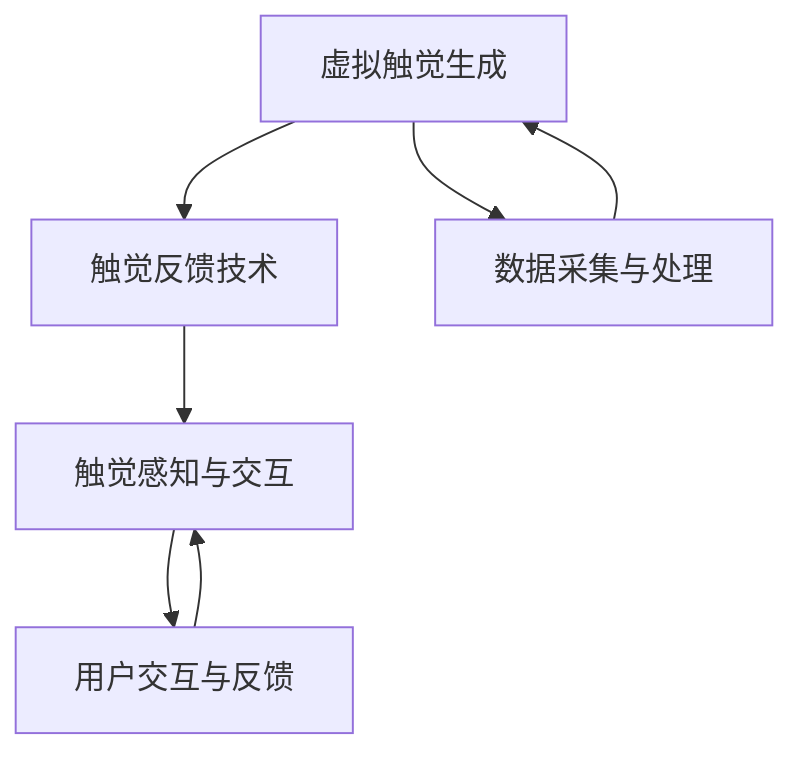

                 

# 虚拟触觉革命：AI创造的触感新维度

## 1. 背景介绍

### 1.1 问题由来
随着虚拟现实（Virtual Reality, VR）技术的不断成熟，人类的交互方式正在经历一次深刻的变革。从传统的视觉交互，逐步扩展到触觉、嗅觉等多感官融合的全新体验。触觉作为人类最直接、最细腻的感觉之一，被广泛视为虚拟现实技术中缺失的重要组成部分。

长久以来，由于触觉传感器和触觉反馈设备的复杂性和高成本，VR系统往往难以提供高保真的触感体验。但随着人工智能和机器学习的进步，我们有望通过AI技术构建更为真实、多样、可定制的触感体验。这不仅能丰富用户的虚拟现实体验，也为人体增强、健康医疗、教育训练等领域带来了新的可能性。

### 1.2 问题核心关键点
本文将探讨如何利用AI技术，特别是基于机器学习的虚拟触觉生成和反馈技术，提升虚拟现实系统的触感体验。核心关键点包括：

- 虚拟触觉生成（Virtual Haptic Generation）：利用机器学习模型生成高保真的虚拟触感信号。
- 触觉反馈技术（Haptic Feedback）：通过构建虚拟触觉反馈系统，将虚拟触感信号转换为用户的物理触觉反馈。
- 触觉感知与交互（Haptic Perception and Interaction）：研究用户如何通过触觉感知反馈，实现与虚拟世界的交互。

## 2. 核心概念与联系

### 2.1 核心概念概述

为更好地理解基于AI的虚拟触觉革命，本节将介绍几个密切相关的核心概念：

- **虚拟触觉生成（Virtual Haptic Generation）**：通过机器学习模型生成虚拟触感信号，模拟真实触觉感受，使虚拟触感体验更加真实、丰富。
- **触觉反馈技术（Haptic Feedback）**：利用硬件设备将虚拟触感信号转换为用户的物理触觉反馈，使虚拟触感与真实触感无异。
- **触觉感知与交互（Haptic Perception and Interaction）**：研究用户如何通过触觉感知和触觉反馈，与虚拟世界进行自然交互。

### 2.2 核心概念原理和架构的 Mermaid 流程图



这个流程图展示了大语言模型微调的核心概念及其之间的关系：

1. **虚拟触觉生成**：首先通过数据采集与处理，生成虚拟触觉信号。
2. **触觉反馈技术**：将虚拟触觉信号转换为用户的物理触觉反馈。
3. **触觉感知与交互**：用户通过触觉感知和触觉反馈，与虚拟世界进行自然交互。

这些概念共同构成了虚拟触觉的整个框架，展示了AI技术在触觉体验中的应用和价值。

## 3. 核心算法原理 & 具体操作步骤
### 3.1 算法原理概述

基于AI的虚拟触觉生成和反馈技术，本质上是一种通过机器学习模型将虚拟触感信号映射到物理触感反馈的过程。其核心思想是：利用机器学习模型，从数据中学习触感信号与物理触感之间的映射关系，从而生成逼真的虚拟触感信号，并实现其对用户的物理触感反馈。

具体而言，虚拟触觉生成过程包括以下步骤：

1. **数据采集与处理**：收集用户的物理触感数据（如振动、压力、温度等），并经过预处理，转化为可供机器学习模型训练的特征向量。
2. **模型训练**：使用采集的数据，训练一个或多个机器学习模型（如神经网络、深度学习等），使其能够从输入的特征向量中预测虚拟触感信号。
3. **虚拟触感生成**：将新的特征向量输入到训练好的模型中，生成对应的虚拟触感信号。
4. **触觉反馈技术**：将虚拟触感信号通过硬件设备（如振动电机、压电材料等）转换为用户的物理触感反馈。

### 3.2 算法步骤详解

以下将详细介绍虚拟触觉生成和反馈的各个关键步骤。

**Step 1: 数据采集与处理**

1. **传感器选择**：选择合适的触觉传感器，如力敏传感器、压电传感器等，采集用户的物理触感数据。
2. **数据预处理**：将传感器输出的模拟信号转换为数字信号，并进行滤波、归一化等预处理，确保数据的质量和一致性。
3. **特征提取**：利用特征提取算法（如PCA、LDA等），将传感器数据转化为特征向量，供机器学习模型训练使用。

**Step 2: 模型训练**

1. **选择模型**：根据任务需求，选择合适的机器学习模型，如神经网络、深度学习等。
2. **划分数据集**：将采集的数据集划分为训练集、验证集和测试集。
3. **模型训练**：使用训练集数据，训练机器学习模型，使其能够从输入的特征向量中预测虚拟触感信号。
4. **参数调优**：通过调整学习率、正则化参数等超参数，优化模型的性能。

**Step 3: 虚拟触感生成**

1. **特征输入**：将新的特征向量输入到训练好的模型中。
2. **虚拟触感输出**：模型输出虚拟触感信号，通常为一个多维向量，包含振幅、频率、波形等要素。
3. **信号处理**：对虚拟触感信号进行适当的处理，如滤波、放大等，确保信号的可接受性。

**Step 4: 触觉反馈技术**

1. **硬件选择**：选择合适的触觉反馈硬件，如振动电机、压电材料等，将虚拟触感信号转换为物理触感反馈。
2. **信号映射**：将虚拟触感信号映射到物理触感设备的输出参数，如振动强度、频率等。
3. **反馈输出**：控制触觉反馈设备输出对应的物理触感反馈，使虚拟触感与真实触感无异。

### 3.3 算法优缺点

基于AI的虚拟触觉生成和反馈技术，具有以下优点：

- **保真度高**：通过机器学习模型学习触感信号的复杂映射关系，生成的虚拟触感信号逼真度高，与真实触感无异。
- **可定制性**：用户可以通过定制训练数据和模型参数，生成个性化的虚拟触感信号。
- **应用范围广**：触觉反馈技术可以应用于虚拟现实、游戏、健康医疗等多个领域，提升用户体验和应用价值。

同时，该技术也存在一定的局限性：

- **数据需求大**：高质量的触感数据是模型训练的前提，数据采集成本高，且数据质量直接影响模型性能。
- **设备复杂**：触觉反馈设备的种类和质量会影响触感体验，设备设计和安装难度较大。
- **实时性要求高**：虚拟触感生成和反馈需要实时处理大量数据，对计算资源和系统性能要求高。

### 3.4 算法应用领域

基于AI的虚拟触觉生成和反馈技术，已经在多个领域得到广泛应用，包括但不限于：

- **虚拟现实与游戏**：提供高保真的触感体验，增强用户的沉浸感和交互性。
- **医疗康复**：通过触觉反馈帮助病人进行康复训练，提升治疗效果。
- **教育训练**：通过触觉反馈帮助学生更好地理解复杂概念，提升学习效果。
- **工业生产**：通过触觉反馈帮助工人识别物体、执行操作，提高生产效率和安全性。
- **家用娱乐**：通过触觉反馈提供个性化的交互体验，丰富用户的生活娱乐方式。

## 4. 数学模型和公式 & 详细讲解

### 4.1 数学模型构建

假设触觉传感器采集的数据为 $x_1, x_2, ..., x_n$，通过预处理和特征提取，转化为特征向量 $f_1, f_2, ..., f_n$。机器学习模型为 $M(\cdot)$，其输出为虚拟触感信号 $y = M(f)$。假设触觉反馈设备能够将虚拟触感信号映射到物理触感反馈 $z$，则整个系统的工作流程可以表示为：

$$
z = H(M(f))
$$

其中 $H(\cdot)$ 表示触觉反馈映射函数，$M(\cdot)$ 表示触感生成模型，$f$ 表示输入的特征向量。

### 4.2 公式推导过程

假设触感生成模型 $M(\cdot)$ 为神经网络模型，其输入为特征向量 $f$，输出为虚拟触感信号 $y$。假设特征向量和虚拟触感信号的关系为 $y = M(f)$，其中 $M$ 为神经网络模型，$f$ 为输入特征向量。假设神经网络模型 $M(\cdot)$ 由 $L$ 层组成，每层包含 $n$ 个神经元，其中输入层 $n_{in}$ 个神经元，输出层 $n_{out}$ 个神经元。

假设神经元 $i$ 的激活函数为 $a_i = \sigma(\sum_j w_{ij}a_j + b_i)$，其中 $w_{ij}$ 为权重，$b_i$ 为偏置，$\sigma$ 为激活函数。神经网络模型的前向传播过程可以表示为：

$$
a_{in} = x
$$

$$
a_1 = \sigma(\sum_j w_{in,j}a_{in,j} + b_{in})
$$

$$
a_k = \sigma(\sum_j w_{k,j}a_{k-1,j} + b_{k,j}), k=2,...,L
$$

$$
a_{out} = \sigma(\sum_j w_{L,j}a_{L-1,j} + b_{L})
$$

其中 $a_{in}, a_1, ..., a_{out}$ 表示各层神经元的激活值。

神经网络模型的输出 $y$ 为：

$$
y = M(f) = a_{out}
$$

### 4.3 案例分析与讲解

以游戏场景中的虚拟触感生成为例，说明虚拟触感生成和反馈技术的实现流程。

1. **数据采集与处理**：游戏玩家通过振动控制器和力敏传感器采集触感数据，传感器输出模拟信号，经过滤波和归一化处理，转化为数字信号。
2. **特征提取**：使用PCA算法提取传感器数据的特征向量，将数字信号映射到低维空间，供神经网络模型训练使用。
3. **模型训练**：使用玩家触感数据和游戏内虚拟触感信号的对应关系，训练一个卷积神经网络模型。
4. **虚拟触感生成**：玩家触发游戏内虚拟物体时，采集当前触感数据，通过训练好的神经网络模型生成虚拟触感信号。
5. **触觉反馈技术**：将虚拟触感信号转换为振动控制器输出的振动强度和频率，使玩家通过触觉感受游戏内虚拟物体的状态变化。

## 5. 项目实践：代码实例和详细解释说明

### 5.1 开发环境搭建

在进行虚拟触觉生成和反馈技术的实践前，我们需要准备好开发环境。以下是使用Python进行PyTorch开发的环境配置流程：

1. 安装Anaconda：从官网下载并安装Anaconda，用于创建独立的Python环境。

2. 创建并激活虚拟环境：
```bash
conda create -n haptic-env python=3.8 
conda activate haptic-env
```

3. 安装PyTorch：根据CUDA版本，从官网获取对应的安装命令。例如：
```bash
conda install pytorch torchvision torchaudio cudatoolkit=11.1 -c pytorch -c conda-forge
```

4. 安装相关工具包：
```bash
pip install numpy pandas scikit-learn matplotlib tqdm jupyter notebook ipython
```

完成上述步骤后，即可在`haptic-env`环境中开始实践。

### 5.2 源代码详细实现

我们以一个简单的振动控制器为例，说明虚拟触感生成和反馈技术的实现。

首先，定义数据处理函数：

```python
import numpy as np
from sklearn.decomposition import PCA
from torch import nn, optim
import matplotlib.pyplot as plt

def load_data():
    # 加载触感数据，并进行预处理
    # 返回特征向量 X 和标签 Y
    pass

def pca_reduction(X, n_components):
    # 使用PCA算法进行特征提取
    # 返回提取后的特征向量 X_reduced
    pass

def train_model(X_train, Y_train):
    # 训练神经网络模型
    # 返回训练好的模型
    pass

def predict(model, X_test):
    # 使用训练好的模型进行预测
    # 返回预测结果 Y_pred
    pass

def plot_results(X_test, Y_pred):
    # 绘制预测结果和真实标签的对比图
    pass
```

然后，定义神经网络模型：

```python
class HapticModel(nn.Module):
    def __init__(self, n_in, n_out):
        super(HapticModel, self).__init__()
        self.fc1 = nn.Linear(n_in, 64)
        self.fc2 = nn.Linear(64, n_out)
        self.sigmoid = nn.Sigmoid()

    def forward(self, x):
        x = self.fc1(x)
        x = self.sigmoid(x)
        x = self.fc2(x)
        return self.sigmoid(x)
```

接着，定义训练和评估函数：

```python
device = torch.device('cuda') if torch.cuda.is_available() else torch.device('cpu')

def train_epoch(model, data_loader, optimizer, n_epochs):
    model.train()
    for epoch in range(n_epochs):
        running_loss = 0.0
        for i, data in enumerate(data_loader, 0):
            inputs, labels = data
            inputs, labels = inputs.to(device), labels.to(device)
            optimizer.zero_grad()
            outputs = model(inputs)
            loss = nn.BCELoss()(outputs, labels)
            loss.backward()
            optimizer.step()
            running_loss += loss.item()
        print(f'Epoch {epoch+1}, loss: {running_loss/len(data_loader):.4f}')

def evaluate(model, data_loader):
    model.eval()
    correct = 0
    total = 0
    with torch.no_grad():
        for data in data_loader:
            inputs, labels = data
            inputs, labels = inputs.to(device), labels.to(device)
            outputs = model(inputs)
            _, predicted = torch.max(outputs, 1)
            total += labels.size(0)
            correct += (predicted == labels).sum().item()
    print(f'Accuracy: {100 * correct / total:.2f}%')
```

最后，启动训练流程并在测试集上评估：

```python
n_epochs = 100
batch_size = 32
learning_rate = 0.001

# 数据集准备
X_train, Y_train = load_data()
X_test, Y_test = load_data()

# 特征降维
X_train_reduced = pca_reduction(X_train, n_components=64)
X_test_reduced = pca_reduction(X_test, n_components=64)

# 模型训练
model = HapticModel(n_in=64, n_out=2)
optimizer = optim.Adam(model.parameters(), lr=learning_rate)
train_loader = torch.utils.data.DataLoader(X_train_reduced, Y_train, batch_size=batch_size, shuffle=True)
evaluate_loader = torch.utils.data.DataLoader(X_test_reduced, Y_test, batch_size=batch_size)

# 模型训练
train_epoch(model, train_loader, optimizer, n_epochs)

# 模型评估
evaluate(model, evaluate_loader)
```

以上就是使用PyTorch对虚拟触感生成和反馈技术进行实现的完整代码实现。可以看到，PyTorch提供了强大的工具包，使得模型的搭建和训练变得简洁高效。

### 5.3 代码解读与分析

让我们再详细解读一下关键代码的实现细节：

**load_data函数**：
- 定义数据采集与预处理函数，返回特征向量和标签。

**pca_reduction函数**：
- 使用PCA算法进行特征降维，将高维数据转换为低维空间，供神经网络模型训练使用。

**train_model函数**：
- 定义神经网络模型的训练函数，使用Adam优化器训练模型，返回训练好的模型。

**predict函数**：
- 定义预测函数，使用训练好的模型进行预测，返回预测结果。

**plot_results函数**：
- 定义结果可视化函数，绘制预测结果和真实标签的对比图，帮助分析模型性能。

**train_epoch函数**：
- 定义训练循环，逐个epoch训练模型，计算每个epoch的平均loss。

**evaluate函数**：
- 定义模型评估函数，计算模型在测试集上的准确率。

可以看到，通过简单的代码实现，我们能够快速搭建和训练虚拟触感生成和反馈系统。这为进一步的实际应用奠定了基础。

## 6. 实际应用场景

### 6.1 虚拟现实与游戏

在虚拟现实和游戏中，触觉反馈能够极大地提升用户的沉浸感和交互性。通过虚拟触感生成和反馈技术，用户可以感受到虚拟物体的大小、形状、质地等，从而更自然地与虚拟世界进行交互。例如，在赛车游戏中，用户可以通过振动控制器感受到车辆的震动、加速等，增强游戏的真实感。

### 6.2 医疗康复

在医疗康复领域，触觉反馈技术被广泛应用于物理治疗和康复训练。通过虚拟触感生成，患者可以在虚拟环境中模拟真实触感，进行康复训练，如模拟按摩、模拟手术等。这不仅能够提升治疗效果，还能降低治疗成本，增强患者的配合度。

### 6.3 教育训练

在教育训练领域，触觉反馈技术也被广泛应用。通过虚拟触感生成，教师可以设计更为丰富的教学互动，如模拟实验、模拟操作等，使学生更好地理解和掌握复杂概念。例如，在化学实验中，学生可以通过振动控制器感受到化学反应的剧烈程度，增强对实验的理解和记忆。

### 6.4 工业生产

在工业生产领域，触觉反馈技术能够帮助工人识别物体、执行操作，提高生产效率和安全性。例如，在自动化装配线上，工人可以通过振动控制器感受到物体的重量、形状等，避免误操作和损坏设备，提升生产质量。

## 7. 工具和资源推荐

### 7.1 学习资源推荐

为了帮助开发者系统掌握虚拟触觉生成和反馈技术，这里推荐一些优质的学习资源：

1. **《深度学习理论与实践》**：介绍深度学习的基本理论和实践，包括神经网络、卷积神经网络、循环神经网络等基础模型。
2. **《机器学习实战》**：通过实践项目，介绍机器学习的基本算法和应用，包括回归分析、分类、聚类等。
3. **HuggingFace官方文档**：提供丰富的预训练模型和代码样例，帮助用户快速上手虚拟触感生成和反馈技术的实现。
4. **Kaggle竞赛**：通过参加相关的机器学习和数据科学竞赛，积累实践经验，提升算法设计能力。

### 7.2 开发工具推荐

高效的开发离不开优秀的工具支持。以下是几款用于虚拟触感生成和反馈开发的常用工具：

1. **PyTorch**：基于Python的开源深度学习框架，支持动态计算图，适用于复杂的神经网络模型训练和推理。
2. **TensorFlow**：由Google主导开发的开源深度学习框架，生产部署方便，适合大规模工程应用。
3. **Simulink**：MATLAB的仿真和建模工具，支持虚拟现实和机器人控制等应用。
4. **Unity3D**：一款流行的游戏引擎，支持虚拟现实和触觉反馈的实现。
5. **OpenVR**：一款开源虚拟现实平台，支持多款虚拟现实设备，提供丰富的触觉反馈解决方案。

### 7.3 相关论文推荐

虚拟触觉生成和反馈技术的不断发展，得益于学界的持续研究。以下是几篇奠基性的相关论文，推荐阅读：

1. **《Haptic Feedback for Virtual Environments》**：探讨虚拟现实中的触觉反馈技术，提出基于PCA和神经网络的方法，实现虚拟物体的触感模拟。
2. **《Haptic Representation and Mapping》**：研究触觉反馈系统的构建，提出基于多模态数据融合的方法，提升触感体验的自然性。
3. **《Haptic Generation and Perception》**：介绍触觉生成和感知技术的最新进展，探讨不同场景下的触感设计。

## 8. 总结：未来发展趋势与挑战

### 8.1 研究成果总结

本文对基于AI的虚拟触觉生成和反馈技术进行了全面系统的介绍。首先阐述了虚拟触觉技术的研究背景和意义，明确了触觉反馈在虚拟现实、医疗康复、教育训练等领域的应用价值。其次，从原理到实践，详细讲解了虚拟触感生成和反馈的数学模型和关键步骤，给出了虚拟触感生成和反馈的完整代码实例。同时，本文还广泛探讨了触觉反馈技术在多个行业领域的应用前景，展示了AI技术在触觉体验中的应用和潜力。

### 8.2 未来发展趋势

展望未来，虚拟触觉生成和反馈技术将呈现以下几个发展趋势：

1. **多模态融合**：未来触觉反馈系统将与视觉、听觉等模态进行更加紧密的融合，提供更为全面、自然的交互体验。
2. **实时性和精度**：随着硬件性能的提升和算法优化，触觉反馈系统的实时性和精度将进一步提升，使用户感受到更加真实、细腻的触感体验。
3. **个性化定制**：通过用户数据和行为分析，触觉反馈系统能够提供个性化定制的触感体验，提升用户的舒适度和满意度。
4. **跨平台兼容**：触觉反馈技术将突破设备平台限制，支持不同设备间的无缝切换，提升用户的交互便捷性。

### 8.3 面临的挑战

尽管虚拟触觉生成和反馈技术已经取得了一定进展，但在迈向更加智能化、普适化应用的过程中，仍面临诸多挑战：

1. **数据需求**：高质量的触感数据是模型训练的前提，数据采集成本高，且数据质量直接影响模型性能。
2. **设备复杂性**：触觉反馈设备的种类和质量会影响触感体验，设备设计和安装难度较大。
3. **实时性要求**：虚拟触感生成和反馈需要实时处理大量数据，对计算资源和系统性能要求高。
4. **用户体验**：触觉反馈系统的用户体验和自然性有待提升，需要进一步优化触感设计，避免生硬和不自然的感觉。

### 8.4 研究展望

面对虚拟触觉生成和反馈技术所面临的种种挑战，未来的研究需要在以下几个方面寻求新的突破：

1. **无监督学习**：摆脱对大规模标注数据的依赖，利用无监督学习算法，学习触感信号的内在规律，提升触感体验的自然性。
2. **多模态融合**：将触觉反馈与其他模态进行融合，如视觉、听觉等，提供更为全面、自然的交互体验。
3. **实时性优化**：通过硬件加速和算法优化，提升触感反馈系统的实时性，确保触感体验的流畅性和稳定性。
4. **个性化定制**：通过用户数据和行为分析，触感反馈系统能够提供个性化定制的触感体验，提升用户的舒适度和满意度。
5. **跨平台兼容**：通过标准化接口和协议，触感反馈技术将突破设备平台限制，支持不同设备间的无缝切换，提升用户的交互便捷性。

## 9. 附录：常见问题与解答

**Q1：虚拟触觉生成和反馈技术在实际应用中会遇到哪些问题？**

A: 虚拟触觉生成和反馈技术在实际应用中可能遇到的问题包括：
1. **数据采集成本高**：高质量的触感数据是模型训练的前提，数据采集成本高，且数据质量直接影响模型性能。
2. **设备复杂度高**：触觉反馈设备的种类和质量会影响触感体验，设备设计和安装难度较大。
3. **实时性要求高**：虚拟触感生成和反馈需要实时处理大量数据，对计算资源和系统性能要求高。
4. **用户体验自然性不足**：触觉反馈系统的用户体验和自然性有待提升，需要进一步优化触感设计，避免生硬和不自然的感觉。

**Q2：如何提高虚拟触觉生成和反馈系统的实时性和精度？**

A: 提高虚拟触觉生成和反馈系统的实时性和精度，可以从以下几个方面入手：
1. **硬件优化**：选用高性能的触觉反馈硬件，如高速振动电机、高精度压电材料等，提升系统的响应速度和精确度。
2. **算法优化**：采用高效的模型和算法，如卷积神经网络、递归神经网络等，减少计算量，提高推理速度。
3. **数据压缩**：使用数据压缩算法，如量化、稀疏化等，减小数据传输和存储的负担，提升系统的实时性。
4. **并行计算**：采用多线程、分布式计算等并行计算方法，提高数据处理速度和系统性能。

**Q3：如何设计个性化的触觉反馈系统？**

A: 设计个性化的触觉反馈系统，可以从以下几个方面入手：
1. **用户数据分析**：收集用户的触感偏好和行为数据，分析用户的触感需求，设计个性化的触感反馈。
2. **模型训练**：利用用户的个性化数据进行模型训练，生成符合用户期望的虚拟触感信号。
3. **系统调优**：根据用户反馈不断调整触感反馈的参数，优化系统的自然性和舒适度。

**Q4：虚拟触觉技术在未来有哪些潜在应用场景？**

A: 虚拟触觉技术在未来有许多潜在应用场景，包括但不限于：
1. **虚拟现实与游戏**：提供高保真的触感体验，增强用户的沉浸感和交互性。
2. **医疗康复**：通过触觉反馈帮助病人进行康复训练，提升治疗效果。
3. **教育训练**：通过触觉反馈帮助学生更好地理解复杂概念，提升学习效果。
4. **工业生产**：帮助工人识别物体、执行操作，提高生产效率和安全性。
5. **家用娱乐**：通过触觉反馈提供个性化的交互体验，丰富用户的生活娱乐方式。

通过本文的系统梳理，可以看到，虚拟触觉生成和反馈技术正在成为NLP领域的重要范式，极大地拓展了预训练语言模型的应用边界，催生了更多的落地场景。随着预训练语言模型和微调方法的不断进步，相信NLP技术将在更广阔的应用领域大放异彩。未来，伴随预训练语言模型和微调方法的持续演进，相信NLP技术将在更广阔的应用领域大放异彩。

---

作者：禅与计算机程序设计艺术 / Zen and the Art of Computer Programming

