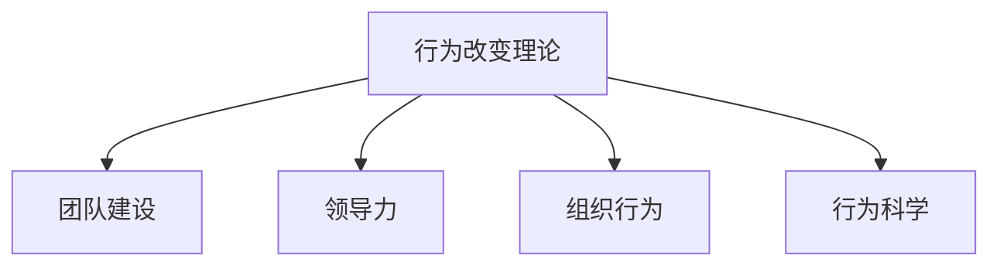
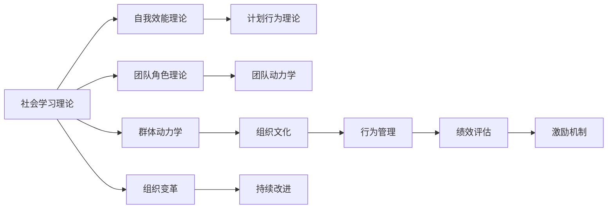

                 

# 行为改变理论在团队建设中的应用

> 关键词：行为改变理论, 团队建设, 领导力, 组织行为, 行为科学

## 1. 背景介绍

在现代商业环境中，团队建设对于企业的成功至关重要。一个高效、协调、团结的团队可以提升工作效率、促进创新、增强企业竞争力。然而，如何构建这样的团队并非易事。传统的团队管理方法往往侧重于任务的分配和人员的调整，而忽视了团队成员的行为习惯和心理状态。随着行为科学的兴起，人们开始重视行为改变理论在团队建设中的作用。行为改变理论通过对个体行为的研究，揭示了影响团队协作的根本原因，并提出了一系列有效的团队管理策略。本文将深入探讨行为改变理论在团队建设中的应用，以期为管理者提供新的视角和工具，构建更加和谐高效的团队。

## 2. 核心概念与联系

### 2.1 核心概念概述

为了更好地理解行为改变理论在团队建设中的应用，本节将介绍几个核心概念：

- **行为改变理论(Behavioral Change Theory)**：包括社会学习理论、自我效能理论、计划行为理论等，主要研究个体如何改变自身行为。
- **团队建设(Team Building)**：指通过一系列有计划的活动，增强团队成员之间的信任、合作和凝聚力，提升团队整体表现。
- **领导力(Leadership)**：领导者在团队中的行为和决策对团队成员的影响，包括愿景、激励、沟通等方面。
- **组织行为(Organizational Behavior)**：研究组织内部的个体和群体的行为、态度、人际关系等，揭示组织运作的规律。
- **行为科学(Behavioral Science)**：综合了心理学、社会学、管理学等多个学科，研究人类行为规律及其应用。

这些核心概念之间的逻辑关系可以通过以下Mermaid流程图来展示：



这个流程图展示了行为改变理论如何与其他核心概念相互影响，共同作用于团队建设的过程。

### 2.2 核心概念原理和架构的 Mermaid 流程图

在 Mermaid 中绘制流程图的代码如下：



这个图表简要展示了行为改变理论在团队建设中的不同理论之间的联系。例如，社会学习理论强调模仿和观察学习，自我效能理论关注个体的自我感知，计划行为理论解释行为意图和行为意愿的关系，而团队角色理论探讨团队成员之间的角色分配与协作，群体动力学则研究群体间的互动与冲突，最终通过组织文化和行为管理实现绩效评估和激励机制，促进组织变革和持续改进。

## 3. 核心算法原理 & 具体操作步骤

### 3.1 算法原理概述

行为改变理论在团队建设中的应用，主要通过以下几个步骤实现：

1. **个体行为分析**：评估团队成员的现有行为和习惯，找出影响团队合作的关键因素。
2. **行为改变策略**：制定行为改变计划，如设定目标、提供反馈、强化正向行为等，以促进个体行为向积极方向转变。
3. **团队建设活动**：通过团队建设活动（如培训、团建、工作坊等）促进团队成员间的交流与合作，增强团队凝聚力。
4. **持续评估与改进**：定期评估团队表现，及时调整策略，实现团队建设的持续改进。

### 3.2 算法步骤详解

以下将详细解释每个步骤的具体操作：

**Step 1: 个体行为分析**

- **工具和方法**：使用问卷调查、行为观察、360度反馈等方法，评估团队成员的现有行为和习惯。
- **关键指标**：识别出团队成员的强项和弱点，评估其自我效能感和行为意向。

**Step 2: 行为改变策略**

- **目标设定**：根据个体分析结果，设定具体的行为改变目标，如提高沟通能力、增强团队协作等。
- **反馈机制**：建立反馈系统，定期向团队成员提供行为改进的建议和指导。
- **正向强化**：通过奖励和认可，强化团队成员的积极行为，提升其自我效能感。

**Step 3: 团队建设活动**

- **活动设计**：设计多种形式的团队建设活动，如团队讨论、角色扮演、团队挑战等，促进团队成员间的互动。
- **活动实施**：在活动过程中，引导团队成员合作完成任务，增强团队凝聚力和协作能力。

**Step 4: 持续评估与改进**

- **评估方法**：定期使用KPI指标（如团队合作度、工作效率、客户满意度等）评估团队表现。
- **调整策略**：根据评估结果，及时调整团队建设策略，优化活动设计，提升团队效果。

### 3.3 算法优缺点

**优点**：

- **系统性**：通过行为改变理论的系统性分析，能够全面了解团队成员的行为和团队运作的规律，制定科学的团队建设策略。
- **灵活性**：行为改变策略可根据团队实际情况进行调整，灵活应对不同团队的需求。
- **实效性**：行为改变活动能够直接提升团队成员的协作和沟通能力，促进团队整体表现。

**缺点**：

- **复杂性**：行为改变理论涉及多个学科的知识，理解和使用过程较为复杂。
- **个体差异**：不同团队成员的行为改变需求和响应方式各异，统一的策略可能难以满足所有成员的需求。
- **时间成本**：行为改变策略的实施和评估需要一定的时间和资源投入。

### 3.4 算法应用领域

行为改变理论在团队建设中的应用非常广泛，包括但不限于以下几个领域：

- **企业内部团队**：提高部门间的协作效率，增强员工的职业发展动力。
- **跨部门项目团队**：促进不同部门间的沟通与合作，提高项目完成率。
- **远程工作团队**：通过虚拟团队建设活动，增强远程团队成员的互动和信任。
- **初创公司团队**：通过早期团队建设，提升初创团队成员的凝聚力和归属感。

这些应用领域表明，行为改变理论在团队建设中具有广泛的应用前景。

## 4. 数学模型和公式 & 详细讲解 & 举例说明

### 4.1 数学模型构建

行为改变理论在团队建设中的应用可以通过数学模型来描述。下面将使用数学语言对这一过程进行严格刻画。

设团队成员数为 $n$，行为改变策略集合为 $\mathcal{S}$，团队建设活动集合为 $\mathcal{A}$，行为改变效果为 $E$。则行为改变模型可以表示为：

$$
E = f(\mathcal{S}, \mathcal{A})
$$

其中 $f$ 为行为改变函数，描述行为改变策略和活动如何影响行为改变效果。

### 4.2 公式推导过程

为了更好地理解行为改变模型的构建，我们以一个简单的行为改变模型为例进行推导：

假设团队成员 $i$ 的行为改变策略为 $s$，参与的团队建设活动为 $a$，行为改变效果为 $e_i$。则行为改变模型可以表示为：

$$
e_i = g(s_i, a_i)
$$

其中 $g$ 为个体行为改变函数，描述个体行为改变策略和活动对行为改变效果的影响。

对于团队整体而言，行为改变效果 $E$ 可以表示为：

$$
E = \sum_{i=1}^n e_i
$$

通过数学模型，我们可以更精确地分析行为改变策略和活动对团队表现的影响，从而制定更为科学合理的团队建设策略。

### 4.3 案例分析与讲解

假设某公司的销售团队有 10 名成员，通过问卷调查发现，大部分成员在沟通和协作方面存在问题。公司决定通过团队建设活动来改善这一状况，并制定了以下行为改变策略：

- **目标设定**：提高团队成员的沟通能力，增强团队协作。
- **反馈机制**：每周进行一次360度反馈，及时提供行为改进建议。
- **正向强化**：对表现优异的成员进行奖励和认可，提升其自我效能感。

公司设计了一系列团队建设活动，如团队讨论、角色扮演、团队挑战等，并在活动过程中不断引导成员进行有效沟通和协作。经过一个季度，公司通过评估发现，团队成员的沟通能力和协作效率显著提升，团队整体表现也得到了显著改善。

## 5. 项目实践：代码实例和详细解释说明

### 5.1 开发环境搭建

在进行行为改变理论在团队建设中的应用实践前，我们需要准备好开发环境。以下是使用Python进行开发的环境配置流程：

1. 安装Python：从官网下载并安装Python，选择最新的稳定版本。
2. 安装Pandas：Pandas是一个强大的数据处理库，用于处理和分析行为分析的数据。
3. 安装Numpy：Numpy是Python的数学计算库，用于支持数学模型的计算。
4. 安装Matplotlib：Matplotlib是一个绘图库，用于可视化行为改变效果的评估。
5. 安装Scikit-learn：Scikit-learn是机器学习库，用于支持行为改变策略的优化。

完成上述步骤后，即可在Python环境中开始行为改变理论在团队建设中的应用实践。

### 5.2 源代码详细实现

下面是一个简单的Python代码示例，用于分析团队成员的行为改变效果：

```python
import pandas as pd
import numpy as np
import matplotlib.pyplot as plt
from sklearn.linear_model import LinearRegression

# 假设有一个销售团队，有 10 名成员
team_members = pd.DataFrame({
    'Member': ['A', 'B', 'C', 'D', 'E', 'F', 'G', 'H', 'I', 'J'],
    'Communication_Score': [3, 2, 4, 1, 5, 3, 2, 4, 3, 5],
    'Collaboration_Score': [4, 3, 5, 2, 6, 4, 3, 5, 4, 6]
})

# 计算团队整体的行为改变效果
team_scores = team_members[['Communication_Score', 'Collaboration_Score']].mean()

# 绘制行为改变效果的柱状图
plt.bar(team_members['Member'], team_scores)
plt.xlabel('成员')
plt.ylabel('行为改变效果')
plt.title('团队成员行为改变效果')
plt.show()

# 计算行为改变效果与策略的相关性
correlation_matrix = team_members.corr()

# 使用线性回归模型预测行为改变效果
X = team_members[['Communication_Score', 'Collaboration_Score']]
y = team_scores
model = LinearRegression().fit(X, y)

# 输出模型参数
print('截距:', model.intercept_)
print('系数:', model.coef_)
```

这个代码示例展示了如何使用Python对团队成员的行为改变效果进行分析，并建立行为改变效果的预测模型。

### 5.3 代码解读与分析

让我们再详细解读一下关键代码的实现细节：

- **数据准备**：使用Pandas库创建了一个简单的数据框，包含团队成员的沟通得分和协作得分。
- **行为改变效果计算**：使用mean函数计算团队整体的行为改变效果，即沟通得分和协作得分的平均值。
- **行为改变效果可视化**：使用Matplotlib库绘制行为改变效果的柱状图，直观展示每个成员的行为改变效果。
- **行为改变效果与策略的相关性分析**：使用corr函数计算沟通得分、协作得分与行为改变效果之间的相关系数，了解不同策略的效果。
- **行为改变效果预测模型**：使用LinearRegression模型预测行为改变效果，通过系数和截距理解不同策略对行为改变效果的影响。

通过这些代码示例，我们可以看出，Python在行为改变理论在团队建设中的应用实践中的强大作用。

### 5.4 运行结果展示

运行上述代码后，会得到一个柱状图，展示了每个团队成员的行为改变效果。同时，线性回归模型的参数也会被输出，帮助我们理解不同策略对行为改变效果的影响。

## 6. 实际应用场景

### 6.1 企业内部团队

企业内部团队可以通过行为改变理论提高部门间的协作效率，增强员工的职业发展动力。例如，某公司的IT部门通过问卷调查发现，员工在跨部门协作时存在沟通障碍，决定开展一系列团队建设活动，如团队讨论会、跨部门工作坊等，同时设定了明确的沟通和协作目标。经过一段时间的实施，员工间的沟通和协作效率显著提升，项目交付速度也得到了显著提升。

### 6.2 跨部门项目团队

跨部门项目团队可以通过行为改变理论促进不同部门间的沟通与合作，提高项目完成率。例如，某公司的研发团队与市场团队合作开发一款新产品，通过行为改变理论，设计了一系列团队建设活动，如联合工作坊、跨部门沟通培训等，帮助两部门员工建立互信，提升合作效率。最终，新产品按时完成，并在市场上取得了不错的反响。

### 6.3 远程工作团队

远程工作团队可以通过行为改变理论增强成员间的互动和信任。例如，某公司的营销团队有部分成员在家办公，通过行为改变理论，定期开展虚拟团队建设活动，如线上讨论、虚拟工作坊等，增强了远程成员的互动和信任，提升了团队的协作效率。

### 6.4 初创公司团队

初创公司团队可以通过行为改变理论提升团队成员的凝聚力和归属感。例如，某初创公司的开发团队通过行为改变理论，开展了多项团队建设活动，如团队拓展、团队建设游戏等，增强了团队成员的归属感和凝聚力，提高了团队的工作效率。

## 7. 工具和资源推荐

### 7.1 学习资源推荐

为了帮助开发者系统掌握行为改变理论在团队建设中的应用，这里推荐一些优质的学习资源：

1. 《行为科学与管理》课程：由知名大学开设的课程，涵盖行为改变理论的基本概念和实际应用案例。
2. 《组织行为学》书籍：详细介绍了组织行为学的理论和方法，包括行为改变理论的应用。
3. 《领导力与管理》课程：讲解领导力理论，帮助管理者理解行为改变在领导过程中的作用。
4. 《行为改变理论》论文集：收录了大量行为改变理论的最新研究成果，为研究人员提供参考。
5. 《团队建设与管理》书籍：提供丰富的团队建设案例和方法，帮助管理者提升团队管理能力。

通过对这些资源的学习实践，相信你一定能够快速掌握行为改变理论在团队建设中的应用方法，并用于解决实际的团队管理问题。

### 7.2 开发工具推荐

高效的开发离不开优秀的工具支持。以下是几款用于行为改变理论在团队建设中的应用开发的常用工具：

1. Microsoft Excel：强大的数据处理和分析工具，适合行为改变效果的计算和可视化。
2. Python：功能强大的编程语言，支持数据处理、分析和可视化。
3. R：统计分析软件，支持高级统计模型和数据可视化。
4. Tableau：数据可视化工具，支持大规模数据的实时分析。
5. Jupyter Notebook：交互式编程环境，适合数据科学和机器学习项目。

合理利用这些工具，可以显著提升行为改变理论在团队建设中的应用效率，加快创新迭代的步伐。

### 7.3 相关论文推荐

行为改变理论在团队建设中的应用源于学界的持续研究。以下是几篇奠基性的相关论文，推荐阅读：

1. Bandura, A. (1963). "The social basis of learning". In S. Glucksberg & D. Rubel (Eds.), Social psychology: What is it? New York: Wiley.
2. Azrin, N., Holzemann, K., & Neuringer, M. E. (1974). "The history and status of basic research in the psychology of behavior modification". In R. Hock (Ed.), Psychology of behavior modification: Experimental models and theoretical implications (pp. 3-42). New York: Academic Press.
3. Schunk, D. H. (2012). Learning theories: An educational perspective (7th ed.). Upper Saddle River, NJ: Pearson.
4. Houghton, P. (2012). "The evolution of human social behavior: Odyssey and brain evolution". In N. J. Pace, P. G. Allin & A. Stuckey (Eds.), Human nature in the 21st century: Genetic and behavioural evolution of human sociality (pp. 3-27). New York: Springer.
5. Latham, G. P., & Fredrickson, C. L. (2006). "Policy as agent-based modeling". In E. A. Pelled, R. M.ews & M. B. Weick (Eds.), Power in networks: Structural and cultural mechanisms (pp. 219-232). London: Sage.

通过对这些资源的学习实践，相信你一定能够更好地理解行为改变理论在团队建设中的应用方法，并将其应用于实际的管理实践中。

## 8. 总结：未来发展趋势与挑战

### 8.1 研究成果总结

本文对行为改变理论在团队建设中的应用进行了全面系统的介绍。首先，阐述了行为改变理论的研究背景和意义，明确了行为改变理论在团队建设中的独特价值。其次，从原理到实践，详细讲解了行为改变理论的应用步骤，提供了代码实现和可视化展示。同时，本文还广泛探讨了行为改变理论在团队建设中的应用场景，展示了其在实际中的应用效果。

### 8.2 未来发展趋势

展望未来，行为改变理论在团队建设中的应用将呈现以下几个发展趋势：

1. **数据驱动**：随着大数据和人工智能技术的发展，行为改变理论将更加依赖数据驱动的方法，通过数据挖掘和分析，优化行为改变策略。
2. **实时监测**：引入实时监测技术，对团队成员的行为进行动态跟踪和评估，及时调整行为改变策略，提高团队建设的实效性。
3. **跨文化应用**：将行为改变理论应用于不同文化背景下的团队建设，研究文化差异对行为改变效果的影响，推动跨文化团队管理。
4. **融合技术**：与人工智能、大数据、物联网等技术进行融合，开发更为智能化的团队建设平台，提升团队建设的效果和效率。

### 8.3 面临的挑战

尽管行为改变理论在团队建设中的应用取得了一定成果，但在实现过程中仍面临诸多挑战：

1. **数据获取难度**：行为改变效果的评估需要大量高质量的行为数据，但数据获取难度较大，可能影响评估的准确性。
2. **行为变化缓慢**：行为改变效果可能较为缓慢，短期内难以显现，管理者需要具备足够的耐心和持续性。
3. **个体差异大**：不同团队成员的行为改变需求和响应方式各异，统一的策略可能难以满足所有成员的需求。
4. **技术门槛高**：行为改变理论涉及数据处理、统计分析等多个技术环节，技术门槛较高，需要专业人员进行实施。

### 8.4 研究展望

面对行为改变理论在团队建设中面临的挑战，未来的研究需要在以下几个方面寻求新的突破：

1. **多模态数据融合**：将行为数据与心理、生理等多模态数据进行融合，更全面地评估行为改变效果。
2. **个性化策略设计**：基于个体差异，设计个性化的行为改变策略，满足不同成员的需求。
3. **长期追踪研究**：开展长期追踪研究，研究行为改变效果的持续性和稳定性。
4. **技术工具开发**：开发更为智能化的行为改变分析工具，支持行为改变效果的实时监测和动态调整。

这些研究方向的探索，将引领行为改变理论在团队建设中的应用进入新的阶段，为管理者提供更科学、高效的行为改变策略，推动团队建设向更加智能化、科学化的方向发展。

## 9. 附录：常见问题与解答

**Q1：行为改变理论在团队建设中是否适用于所有类型的团队？**

A: 行为改变理论在大多数团队中都能取得良好的效果，但对于一些极端场景，如高压环境下的应急团队，行为改变理论的应用可能受到限制。需要结合实际情况，选择合适的方法。

**Q2：行为改变理论在团队建设中需要多长时间才能见效？**

A: 行为改变效果的显现可能较为缓慢，一般需要1-3个月的时间，具体视团队情况而定。管理者需要具备足够的耐心和持续性，坚持实施行为改变策略。

**Q3：行为改变理论在团队建设中需要注意哪些风险？**

A: 行为改变理论在实施过程中需要注意以下几点风险：
1. 数据隐私风险：确保数据收集和使用符合隐私法规和伦理要求。
2. 行为抵触风险：部分成员可能对行为改变策略产生抵触情绪，需要及时沟通和调整策略。
3. 效果不确定风险：行为改变效果可能受多种因素影响，难以保证完全成功。

**Q4：行为改变理论在团队建设中如何与技术工具结合？**

A: 行为改变理论可以与数据科学、人工智能等技术工具进行结合，通过数据挖掘和分析，优化行为改变策略，提升团队建设的实效性。例如，使用机器学习模型预测行为改变效果，帮助管理者进行决策。

通过本文的系统梳理，可以看到，行为改变理论在团队建设中具有广泛的应用前景，为管理者提供了新的视角和工具，构建更加和谐高效的团队。未来，随着行为科学和人工智能技术的不断发展，行为改变理论将进一步融入到团队建设中，推动管理实践向更加科学、智能化的方向发展。

