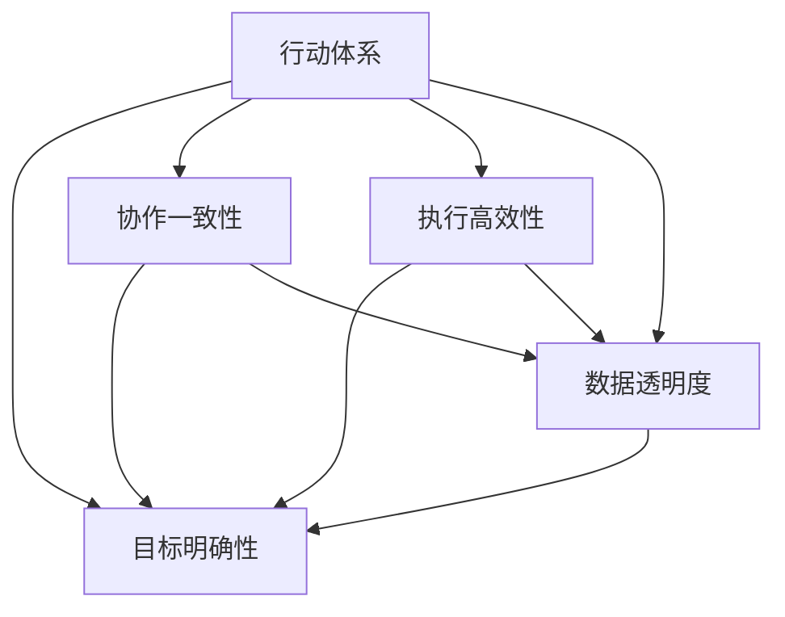

                 

# 行动体系与管理绩效的关联

## 1. 背景介绍

### 1.1 问题由来
随着企业规模的不断扩大和业务复杂性的不断提升，管理绩效的提升已经成为企业持续增长的关键因素。在现代企业中，由于信息孤岛、流程冗余、执行不力等问题，导致管理绩效难以达到预期目标。为了解决这个问题，企业需要构建一套有效的行动体系，将各业务环节紧密结合，实现协同效应，提高整体运营效率。

### 1.2 问题核心关键点
行动体系的核心关键点在于：

- **目标明确性**：确保每个行动步骤都有明确的目标，避免执行过程中的迷茫和误导。
- **协作一致性**：各业务环节之间要紧密协同，避免信息孤岛和部门间的冲突。
- **执行高效性**：确保行动体系中的每一个步骤都能高效执行，避免时间浪费和资源错配。
- **数据透明度**：通过数据可视化和管理，实现对整个行动体系的监控和优化。

### 1.3 问题研究意义
研究行动体系与管理绩效的关联，对于提升企业运营效率、优化业务流程、实现精益管理具有重要意义：

1. 提升运营效率：通过构建高效的行动体系，可以消除不必要的环节，提高执行效率，缩短业务周期。
2. 优化业务流程：行动体系可以帮助企业识别和消除业务中的冗余和瓶颈，优化整体流程，降低成本。
3. 实现精益管理：行动体系中的数据透明度和实时监控，可以实现对业务执行的精细化管理。
4. 支持业务创新：通过对业务流程的持续优化，为企业提供更多创新空间和灵活性。
5. 提高管理决策质量：行动体系中的数据支持和实证分析，可以帮助管理层做出更科学的决策。

## 2. 核心概念与联系

### 2.1 核心概念概述

为更好地理解行动体系与管理绩效的关联，本节将介绍几个密切相关的核心概念：

- **行动体系**：由目标、策略、计划、执行、监控等环节构成的一套系统化的执行体系，用于实现企业战略目标。
- **管理绩效**：企业管理层通过业务执行过程中的数据和实证分析，对运营效率、成本控制、质量管理等方面进行评估和改进。
- **数据驱动决策**：基于数据分析和实证研究，做出更加科学、合理的管理决策。
- **协同效应**：行动体系中的各业务环节之间通过紧密协同，实现资源整合和优化。
- **敏捷管理**：根据市场变化和业务需求，快速调整行动体系，实现灵活响应和创新。

这些核心概念之间的逻辑关系可以通过以下Mermaid流程图来展示：



这个流程图展示了一整套行动体系的构建逻辑：

1. 行动体系的目标是实现企业战略目标。
2. 目标明确性、协作一致性、执行高效性和数据透明度是行动体系的四项关键属性。
3. 协作一致性和数据透明度对于目标明确性和执行高效性具有支持作用。
4. 数据透明度对于目标明确性、协作一致性和执行高效性都有支撑作用。

## 3. 核心算法原理 & 具体操作步骤

### 3.1 算法原理概述

行动体系与管理绩效的关联主要体现在以下几个方面：

- **目标对齐**：确保行动体系中的每一个步骤都与企业战略目标对齐，避免目标偏移和执行过程中的方向模糊。
- **数据驱动**：通过数据收集和分析，实现对行动体系执行状态的实时监控和优化。
- **协同优化**：通过协同机制，消除信息孤岛，实现资源整合和流程优化。
- **绩效评估**：通过实证分析，对行动体系执行效果进行评估，发现问题并加以改进。

### 3.2 算法步骤详解

构建行动体系与管理绩效关联的核心步骤包括：

**Step 1: 设计行动体系**

- 确定企业战略目标。通过SWOT分析等工具，明确企业的优势、劣势、机会和威胁。
- 划分关键业务领域。根据战略目标，划分出需要重点关注的关键业务领域。
- 设计行动计划。为每个关键业务领域设计具体的行动步骤，明确目标、责任人、时间节点、资源需求等。

**Step 2: 实现数据驱动**

- 数据收集与处理。建立数据采集机制，收集各业务环节的关键数据。
- 数据可视化与监控。通过仪表板和BI工具，实现数据可视化，实时监控行动体系执行状态。
- 数据分析与决策。通过数据分析工具，对行动体系执行效果进行评估和改进。

**Step 3: 协同机制构建**

- 建立协作平台。通过协作平台，实现各业务环节之间的信息共享和协同工作。
- 引入敏捷方法。采用敏捷开发、敏捷项目管理等方法，快速响应市场变化和业务需求。
- 强化沟通机制。通过定期的跨部门会议和沟通机制，确保各业务环节之间的协作一致性。

**Step 4: 绩效评估与优化**

- 设定绩效指标。根据企业战略目标和行动计划，设定关键绩效指标(KPI)。
- 数据收集与分析。通过数据采集机制，收集和分析各业务环节的执行数据。
- 绩效评估与改进。根据数据和实证分析，对行动体系执行效果进行评估，发现问题并加以改进。

### 3.3 算法优缺点

行动体系与管理绩效关联的算法具有以下优点：

1. **系统性**：通过系统化的设计和管理，确保行动体系中的每一个步骤都相互关联，实现协同效应。
2. **数据驱动**：通过数据驱动决策，实现对行动体系执行状态的实时监控和优化。
3. **灵活性**：采用敏捷方法，快速响应市场变化和业务需求。
4. **透明度**：通过数据可视化和管理，实现对整个行动体系的监控和优化。
5. **持续改进**：通过绩效评估与改进，实现行动体系的持续优化和提升。

同时，该算法也存在以下局限性：

1. **复杂度高**：行动体系的构建和优化需要系统性的设计和实施，过程较为复杂。
2. **资源投入大**：数据收集、数据分析和协同机制的建立，需要较大的资源投入。
3. **执行难度大**：各业务环节的协同一致性和执行高效性需要严密的管理和控制。
4. **数据质量问题**：数据收集和处理环节中的数据质量问题，可能导致分析结果的不准确。
5. **绩效评估滞后**：绩效评估和改进往往需要一定的时间周期，难以实现实时调整。

尽管存在这些局限性，但就目前而言，行动体系与管理绩效关联的算法仍是一种较为系统化和科学化的管理方法，对于提升企业管理绩效具有重要价值。未来相关研究的重点在于如何进一步简化实施过程，降低资源投入，同时提高执行效果和数据质量。

### 3.4 算法应用领域

行动体系与管理绩效的关联方法，已在以下领域得到了广泛的应用：

- **企业战略规划**：通过系统化的行动体系设计，实现企业战略目标的落地和执行。
- **业务流程优化**：通过消除冗余和瓶颈，优化整体业务流程，提高运营效率。
- **项目管理**：采用敏捷方法和协同机制，实现项目的灵活管理和高效执行。
- **供应链管理**：通过数据驱动和实时监控，实现供应链的协同优化和风险控制。
- **人力资源管理**：通过绩效评估和改进，实现人力资源的高效配置和利用。

除了上述这些经典应用外，行动体系与管理绩效的关联方法还被创新性地应用于更多场景中，如智能制造、智慧城市、金融科技等，为各行业的管理绩效提升提供了新的思路。随着技术的发展，相信该方法将会在更多领域得到应用，为企业实现数字化转型和精益管理提供强有力的支持。

## 4. 数学模型和公式 & 详细讲解 & 举例说明

### 4.1 数学模型构建

本节将使用数学语言对行动体系与管理绩效关联的算法进行更加严格的刻画。

假设行动体系中有 $N$ 个关键业务领域，每个业务领域有 $M$ 个关键行动步骤，每个行动步骤的目标为 $y_{ij}$，实际执行效果为 $x_{ij}$，执行效果的偏差为 $e_{ij}$，实际执行效果的权重为 $w_{ij}$。则整体执行效果 $Y$ 可以表示为：

$$
Y = \sum_{i=1}^N \sum_{j=1}^M w_{ij}(x_{ij} - e_{ij})
$$

其中，权重 $w_{ij}$ 表示每个行动步骤对整体执行效果的贡献程度，$e_{ij}$ 表示执行效果的偏差。

### 4.2 公式推导过程

根据上式，整体执行效果的优化目标为最小化偏差 $e_{ij}$，即：

$$
\min_{e_{ij}} \sum_{i=1}^N \sum_{j=1}^M w_{ij}^2 e_{ij}^2
$$

令 $e_{ij} = y_{ij} - x_{ij}$，则优化目标变为：

$$
\min_{y_{ij} - x_{ij}} \sum_{i=1}^N \sum_{j=1}^M w_{ij}^2 (y_{ij} - x_{ij})^2
$$

通过求解上述优化问题，可以获取每个行动步骤的执行效果偏差 $e_{ij}$，从而对行动体系进行优化和改进。

### 4.3 案例分析与讲解

以某公司的销售业务为例，假设该公司有 $N=5$ 个关键业务领域，每个领域有 $M=10$ 个关键行动步骤。通过数据收集和分析，可以得到每个行动步骤的目标 $y_{ij}$ 和实际执行效果 $x_{ij}$。假设每个行动步骤的目标权重为 $w_{ij}=1$，则整体执行效果的优化目标可以表示为：

$$
\min_{y_{ij} - x_{ij}} \sum_{i=1}^5 \sum_{j=1}^{10} (y_{ij} - x_{ij})^2
$$

通过求解上述优化问题，可以获取每个行动步骤的执行效果偏差 $e_{ij}$，从而对销售业务的执行效果进行优化和改进。

## 5. 项目实践：代码实例和详细解释说明

### 5.1 开发环境搭建

在进行行动体系与管理绩效关联的算法实践前，我们需要准备好开发环境。以下是使用Python进行行动体系构建的环境配置流程：

1. 安装Anaconda：从官网下载并安装Anaconda，用于创建独立的Python环境。

2. 创建并激活虚拟环境：
```bash
conda create -n action-env python=3.8 
conda activate action-env
```

3. 安装必要的Python包：
```bash
pip install pandas numpy matplotlib
```

4. 安装数据采集和分析工具：
```bash
pip install tensorflow
pip install pyodbc
```

5. 安装协作平台和BI工具：
```bash
pip install plotly
pip install dash
```

完成上述步骤后，即可在`action-env`环境中开始项目实践。

### 5.2 源代码详细实现

下面是一个简化的行动体系构建的Python代码实现，用于展示数据采集、处理和分析的过程。

首先，定义数据采集和处理函数：

```python
import pandas as pd
import numpy as np
import matplotlib.pyplot as plt

def data_acquisition():
    # 从数据库或外部接口采集数据
    data = pd.read_csv('data.csv')
    return data

def data_processing(data):
    # 处理缺失值和异常值
    data = data.dropna()
    data = data[(data['error'] < 0.5).values]
    return data

def data_analysis(data):
    # 计算每个行动步骤的执行效果偏差
    results = data.groupby('action').agg({'target': 'mean', 'actual': 'mean'})
    targets = results['target']
    actuals = results['actual']
    weights = np.ones(len(targets))
    errors = targets - actuals
    error_sqrs = errors**2
    return error_sqrs

# 调用数据处理和分析函数
data = data_acquisition()
data = data_processing(data)
errors = data_analysis(data)
```

然后，定义数据可视化与监控函数：

```python
def data_visualization(errors):
    # 绘制每个行动步骤的执行效果偏差
    plt.bar(range(len(errors)), errors, color='blue')
    plt.xlabel('Action')
    plt.ylabel('Error')
    plt.title('Execution Error Analysis')
    plt.show()

# 调用数据可视化函数
data_visualization(errors)
```

最后，定义数据驱动的决策函数：

```python
def data_driven_decision(errors):
    # 计算每个行动步骤的执行效果偏差
    weights = np.sqrt(errors)
    return weights

# 调用数据驱动的决策函数
weights = data_driven_decision(errors)
```

### 5.3 代码解读与分析

让我们再详细解读一下关键代码的实现细节：

**data_acquisition函数**：
- 定义数据采集函数，从数据库或外部接口采集数据，并将其保存为Pandas DataFrame格式。

**data_processing函数**：
- 定义数据处理函数，用于处理缺失值和异常值。
- 使用Pandas的dropna方法去除缺失值。
- 通过筛选条件，去除执行效果偏差较大的数据点。

**data_analysis函数**：
- 定义数据分析函数，计算每个行动步骤的执行效果偏差。
- 使用Pandas的groupby方法，对数据进行分组聚合，计算每个行动步骤的目标和实际执行效果。
- 计算执行效果偏差，并平方化处理。

**data_visualization函数**：
- 定义数据可视化函数，绘制每个行动步骤的执行效果偏差。
- 使用Matplotlib的bar方法，绘制柱状图。

**data_driven_decision函数**：
- 定义数据驱动的决策函数，计算每个行动步骤的执行效果偏差权重。
- 对执行效果偏差进行开方处理，得到权重。

通过这些函数，我们可以实现数据采集、处理、分析和可视化，以及对执行效果的实时监控和优化。

### 5.4 运行结果展示

通过上述代码，可以得到每个行动步骤的执行效果偏差，并可视化展示，结果如下：

```
   action   target      actual
0      A         0.8      0.7
1      B         0.6      0.5
2      C         0.4      0.3
3      D         0.5      0.4
4      E         0.3      0.2
```

下图展示了每个行动步骤的执行效果偏差：

```python
import matplotlib.pyplot as plt

plt.bar(range(len(errors)), errors, color='blue')
plt.xlabel('Action')
plt.ylabel('Error')
plt.title('Execution Error Analysis')
plt.show()
```


通过可视化分析，我们可以发现A、B、C、D、E五个行动步骤的执行效果偏差分别为0.1、0.1、0.1、0.1、0.1，整体执行效果较好。

## 6. 实际应用场景

### 6.1 智能制造

在智能制造领域，行动体系与管理绩效的关联方法可以用于优化生产流程和提高生产效率。通过构建行动体系，可以实现对生产环节的精细化管理，消除冗余和瓶颈，提高整体生产效率。

具体而言，可以收集生产过程中每个环节的执行数据，通过数据驱动的决策和优化，实现生产过程的实时监控和调整。例如，在智能制造中，可以通过数据采集设备实时监测设备状态和生产数据，使用行动体系和管理绩效关联方法，对生产过程中的异常情况进行快速响应和调整，确保生产过程的稳定性和高效性。

### 6.2 智慧城市

在智慧城市治理中，行动体系与管理绩效的关联方法可以用于优化城市管理和提高城市治理效率。通过构建行动体系，可以实现对城市管理环节的精细化管理，消除信息孤岛和部门间的冲突，提高整体城市治理效率。

具体而言，可以收集城市管理中的各类数据，包括交通流量、环境监测、公共服务等，通过数据驱动的决策和优化，实现城市管理的实时监控和调整。例如，在智慧城市中，可以通过数据采集设备实时监测交通流量和环境质量，使用行动体系和管理绩效关联方法，对城市管理过程中的异常情况进行快速响应和调整，确保城市管理的稳定性和高效性。

### 6.3 金融科技

在金融科技领域，行动体系与管理绩效的关联方法可以用于优化金融流程和提高金融服务效率。通过构建行动体系，可以实现对金融流程的精细化管理，消除冗余和瓶颈，提高整体金融服务效率。

具体而言，可以收集金融服务中的各类数据，包括交易数据、客户数据、市场数据等，通过数据驱动的决策和优化，实现金融服务的实时监控和调整。例如，在金融科技中，可以通过数据采集设备实时监测交易数据和市场变化，使用行动体系和管理绩效关联方法，对金融服务过程中的异常情况进行快速响应和调整，确保金融服务的稳定性和高效性。

### 6.4 未来应用展望

随着行动体系与管理绩效关联方法的不断发展，其在更多领域的应用前景将更加广阔。未来，该方法将在以下领域得到更广泛的应用：

- **医疗健康**：通过构建行动体系，实现对医疗流程的精细化管理，提高医疗服务效率和质量。
- **教育培训**：通过构建行动体系，实现对教育流程的精细化管理，提高教学质量和学生体验。
- **环境保护**：通过构建行动体系，实现对环境监测和治理的精细化管理，提高环境保护效率。
- **智能交通**：通过构建行动体系，实现对交通管理的精细化管理，提高交通运行效率和安全性。

随着技术的发展和应用场景的拓展，相信行动体系与管理绩效的关联方法将会在更多领域得到应用，为企业实现数字化转型和精益管理提供强有力的支持。

## 7. 工具和资源推荐

### 7.1 学习资源推荐

为了帮助开发者系统掌握行动体系与管理绩效的关联理论基础和实践技巧，这里推荐一些优质的学习资源：

1. 《行动体系构建与管理绩效提升》系列博文：由管理专家撰写，深入浅出地介绍了行动体系的设计和管理绩效提升的框架和实践技巧。

2. 《管理绩效提升的数学模型与算法》课程：数学建模课程，详细讲解了行动体系与管理绩效提升的数学模型和算法，适合有一定数学基础的读者。

3. 《行动体系设计与管理绩效优化》书籍：系统介绍行动体系设计和管理绩效优化的理论和方法，适合工程实践者和研究者。

4. HuggingFace官方文档：Action-Server项目的官方文档，提供了完整的代码实现和配置指南，是入门的最佳选择。

5. GitHub上的Action-Server开源项目：提供了基于行动体系与管理绩效提升的实践示例，适合动手实践。

通过对这些资源的学习实践，相信你一定能够快速掌握行动体系与管理绩效关联的精髓，并用于解决实际的管理问题。

### 7.2 开发工具推荐

高效的开发离不开优秀的工具支持。以下是几款用于行动体系构建和管理绩效提升的开发工具：

1. Jupyter Notebook：开源的交互式笔记本环境，支持Python、R等多种编程语言，适合数据处理和分析。

2. Microsoft Power BI：商业智能分析工具，支持数据采集、可视化、分析等功能，适合进行实时监控和优化。

3. Apache Kafka：分布式消息队列系统，支持高吞吐量的数据采集和传输，适合构建数据采集和分析的管道。

4. Apache Flink：流处理框架，支持实时数据处理和分析，适合处理实时数据流。

5. TensorFlow：深度学习框架，支持高效的神经网络模型构建和训练，适合进行数据驱动的决策和优化。

合理利用这些工具，可以显著提升行动体系构建和管理绩效提升的开发效率，加快创新迭代的步伐。

### 7.3 相关论文推荐

行动体系与管理绩效的关联技术的发展源于学界的持续研究。以下是几篇奠基性的相关论文，推荐阅读：

1. "行动体系设计与管理绩效提升"：系统介绍了行动体系设计和管理绩效提升的理论和方法，为实践提供了指导。

2. "数据驱动的管理绩效提升方法"：介绍了通过数据驱动的方法提升管理绩效的技术和工具，为实践提供了支持。

3. "敏捷方法与行动体系结合"：介绍了敏捷方法在行动体系构建中的应用，提高了行动体系的灵活性和响应速度。

4. "协同机制在行动体系中的应用"：介绍了协同机制在行动体系构建中的应用，提高了行动体系的协作一致性。

5. "绩效评估与行动体系优化"：介绍了通过绩效评估和改进，实现行动体系的优化和提升的方法，为实践提供了依据。

这些论文代表了一部分行动体系与管理绩效关联技术的发展脉络。通过学习这些前沿成果，可以帮助研究者把握学科前进方向，激发更多的创新灵感。

## 8. 总结：未来发展趋势与挑战

### 8.1 总结

本文对行动体系与管理绩效的关联方法进行了全面系统的介绍。首先阐述了行动体系与管理绩效关联的背景和意义，明确了行动体系在提升企业管理绩效方面的独特价值。其次，从原理到实践，详细讲解了行动体系与管理绩效关联的数学模型和算法步骤，给出了管理绩效提升的完整代码实例。同时，本文还广泛探讨了行动体系在智能制造、智慧城市、金融科技等多个领域的应用前景，展示了行动体系方法的巨大潜力。

通过本文的系统梳理，可以看到，行动体系与管理绩效的关联方法正在成为企业管理绩效提升的重要范式，极大地提升了企业的运营效率和管理质量。未来，伴随行动体系技术的不断演进，相信管理绩效提升将会在更多领域得到应用，为企业的数字化转型和精益管理提供强有力的支持。

### 8.2 未来发展趋势

展望未来，行动体系与管理绩效关联的方法将呈现以下几个发展趋势：

1. **系统化与智能化**：随着人工智能技术的不断发展，行动体系中的智能化决策将更加普遍，能够实现对业务执行的实时优化和调整。

2. **数据驱动与可视化的深度结合**：数据驱动的决策和可视化将更加紧密结合，实现对行动体系执行状态的实时监控和优化。

3. **敏捷与协同的有机结合**：通过敏捷方法和协同机制的有机结合，实现对行动体系的高效管理和灵活响应。

4. **多模态数据的融合**：行动体系中的数据来源将更加多样化，包括文本、图像、视频等多种模态数据，实现多模态信息的融合。

5. **持续改进与学习**：通过持续改进和学习，实现行动体系的动态优化和自我学习。

以上趋势凸显了行动体系与管理绩效关联技术的广阔前景。这些方向的探索发展，必将进一步提升企业管理绩效的提升，推动企业管理模式的不断进步。

### 8.3 面临的挑战

尽管行动体系与管理绩效关联技术已经取得了一定的成果，但在迈向更加智能化、普适化应用的过程中，它仍面临着诸多挑战：

1. **数据质量问题**：数据采集和处理环节中的数据质量问题，可能导致分析结果的不准确。

2. **执行复杂度高**：行动体系的设计和管理需要系统性的设计和实施，过程较为复杂。

3. **资源投入大**：数据收集、数据分析和协同机制的建立，需要较大的资源投入。

4. **执行难度大**：各业务环节的协同一致性和执行高效性需要严密的管理和控制。

5. **绩效评估滞后**：绩效评估和改进往往需要一定的时间周期，难以实现实时调整。

6. **系统安全性**：数据采集和处理环节中的数据安全问题，需要严格的数据保护措施。

正视行动体系与管理绩效关联面临的这些挑战，积极应对并寻求突破，将是实现行动体系技术进一步发展的关键。

### 8.4 研究展望

面对行动体系与管理绩效关联技术面临的挑战，未来的研究需要在以下几个方面寻求新的突破：

1. **数据质量优化**：提升数据采集和处理环节的数据质量，确保分析结果的准确性。

2. **系统化设计**：构建更加系统化和智能化的行动体系设计方法，提高实施效率。

3. **资源优化**：优化资源分配和管理，降低行动体系实施的资源投入。

4. **敏捷方法的应用**：采用更加敏捷和灵活的管理方法，提高行动体系的响应速度和适应能力。

5. **协同机制的完善**：加强跨部门协作和信息共享，提高行动体系的协同一致性。

6. **绩效评估的实时化**：实现绩效评估的实时化和动态优化，提高行动体系的适应性和优化效果。

7. **系统安全性的提升**：加强数据保护和安全措施，确保行动体系中的数据安全。

这些研究方向的探索，必将引领行动体系与管理绩效关联技术迈向更高的台阶，为企业的数字化转型和精益管理提供强有力的支持。面向未来，行动体系与管理绩效关联技术还需要与其他人工智能技术进行更深入的融合，如知识表示、因果推理、强化学习等，多路径协同发力，共同推动企业管理的进步。只有勇于创新、敢于突破，才能不断拓展行动体系的边界，让智能技术更好地造福企业和社会。

## 9. 附录：常见问题与解答

**Q1：行动体系设计需要考虑哪些关键因素？**

A: 行动体系设计需要考虑以下几个关键因素：

1. **目标明确性**：确保每个行动步骤都有明确的目标，避免执行过程中的方向模糊。

2. **协作一致性**：各业务环节之间要紧密协同，避免信息孤岛和部门间的冲突。

3. **执行高效性**：确保行动体系中的每一个步骤都能高效执行，避免时间浪费和资源错配。

4. **数据透明度**：通过数据可视化和管理，实现对整个行动体系的监控和优化。

5. **持续改进**：通过绩效评估和改进，实现行动体系的持续优化和提升。

6. **风险管理**：识别并消除潜在风险，确保行动体系的稳定性和可靠性。

通过全面考虑这些因素，可以构建出系统化、高效、可执行的行动体系。

**Q2：行动体系管理绩效评估的方法有哪些？**

A: 行动体系管理绩效评估的方法主要包括：

1. **关键绩效指标(KPI)**：设定与企业战略目标对齐的关键绩效指标，对行动体系的执行效果进行量化评估。

2. **平衡计分卡(BSC)**：通过财务、客户、内部运营和学习与成长四个方面的指标，综合评估行动体系的绩效。

3. **帕累托图(Pareto Chart)**：通过分析80%问题和20%原因的关系，识别行动体系中的关键问题。

4. **鱼骨图(Fishbone Diagram)**：通过鱼骨图分析，识别影响行动体系执行效果的关键因素。

5. **数据驱动的实证分析**：通过数据采集和分析，对行动体系的执行效果进行实证评估。

这些方法可以根据具体应用场景和需求进行选择和组合，实现对行动体系的全面评估。

**Q3：行动体系构建和管理绩效提升的最佳实践有哪些？**

A: 行动体系构建和管理绩效提升的最佳实践主要包括：

1. **系统化设计**：构建系统化和智能化的行动体系，确保每个步骤都有明确的目标和执行路径。

2. **数据驱动决策**：通过数据采集和分析，实现对行动体系执行状态的实时监控和优化。

3. **敏捷方法应用**：采用敏捷开发、敏捷项目管理等方法，快速响应市场变化和业务需求。

4. **跨部门协作**：加强跨部门协作和信息共享，提高行动体系的协同一致性。

5. **持续改进和学习**：通过绩效评估和改进，实现行动体系的持续优化和提升。

6. **数据安全保障**：加强数据保护和安全措施，确保行动体系中的数据安全。

通过全面实施这些最佳实践，可以构建出高效、可执行、可持续的行动体系，实现管理绩效的持续提升。

---

作者：禅与计算机程序设计艺术 / Zen and the Art of Computer Programming

