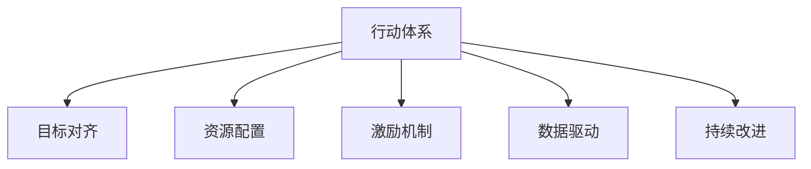

                 

# 行动体系与管理绩效的关联

> 关键词：行动体系,管理绩效,组织架构,目标对齐,激励机制,数据驱动,连续改进,持续创新

## 1. 背景介绍

### 1.1 问题由来
在现代组织中，如何通过合理的管理体系提高绩效，已成为许多企业关注的焦点。传统的基于职能划分的管理模式，虽然在确保稳定性、降低风险等方面有其优势，但在灵活性、创新能力等方面存在明显不足。

随着市场环境变化越来越快，企业需要更加灵活、敏捷的运作方式，以应对日益激烈的竞争。行动体系（Action Framework）作为一种新型管理模式，逐步受到企业的重视。它通过明确组织目标、优化资源配置、构建激励机制等手段，促进组织内部各部门的协同合作，提升整体绩效。

### 1.2 问题核心关键点
行动体系的核心在于构建一个以目标为驱动的组织架构，通过数据驱动和持续改进的机制，实现组织的敏捷运作和高效绩效。其关键点包括：

- **目标对齐**：确保各个部门的目标与组织总体目标一致。
- **资源配置**：优化资源的配置和利用，提高效率。
- **激励机制**：设计合理的激励机制，激发员工积极性。
- **数据驱动**：利用数据分析来指导决策，提高决策质量。
- **持续改进**：不断优化流程，追求持续创新。

## 2. 核心概念与联系

### 2.1 核心概念概述

为了更好地理解行动体系，本节将介绍几个关键概念：

- **行动体系**：一种以目标为驱动的新型组织架构，通过明确的目标、优化资源配置和激励机制，实现组织的敏捷运作和高效绩效。
- **目标对齐**：确保各个部门的目标与组织总体目标一致，促进跨部门协作。
- **资源配置**：通过合理分配和利用资源，提高效率，降低成本。
- **激励机制**：通过设定合理的激励措施，激发员工的积极性，提高工作质量。
- **数据驱动**：利用数据分析指导决策，提高决策质量，避免拍脑袋决策。
- **持续改进**：通过不断优化流程和改进工作方法，实现组织的持续创新和进步。

这些概念之间的联系可以借助以下Mermaid流程图来展示：



这个流程图展示了行动体系的核心组成和其相互关系：

1. 行动体系通过明确目标，确保各个部门目标与组织总体目标一致。
2. 通过优化资源配置，提高效率。
3. 通过激励机制，激发员工积极性。
4. 利用数据驱动，提高决策质量。
5. 通过持续改进，实现组织持续创新和进步。

## 3. 核心算法原理 & 具体操作步骤

### 3.1 算法原理概述

行动体系的实施过程，本质上是一个系统化的管理优化过程。其核心算法原理可以总结为以下几点：

- **目标对齐算法**：确保各部门的子目标与组织总体目标一致。
- **资源配置算法**：优化资源配置，提高效率。
- **激励机制设计**：设计合理的激励措施，激发员工积极性。
- **数据驱动决策**：利用数据分析指导决策。
- **持续改进算法**：通过不断优化流程和改进工作方法，实现组织的持续创新。

### 3.2 算法步骤详解

#### 3.2.1 目标对齐算法

**步骤1：定义组织目标**
- 组织管理层根据企业战略，设定明确的组织目标。
- 目标应具有可量化、可评估、可实现的特点。

**步骤2：分解目标**
- 将总体目标分解为各部门的子目标。
- 确保每个部门的目标与组织目标一致，且相互之间协同配合。

**步骤3：目标对齐**
- 定期进行目标对齐会议，检查各部门的进度和效果。
- 及时调整目标，确保与组织目标的一致性。

#### 3.2.2 资源配置算法

**步骤1：资源评估**
- 对组织内部的各种资源进行全面评估，包括人力资源、财务资源、物资资源等。
- 利用数据挖掘和分析工具，找出资源瓶颈。

**步骤2：优化配置**
- 根据资源评估结果，重新分配和优化资源的配置。
- 引入先进的资源管理工具，提高资源的利用效率。

**步骤3：动态调整**
- 定期回顾资源配置情况，根据实际情况进行调整。
- 引入实时监控系统，及时发现和解决问题。

#### 3.2.3 激励机制设计

**步骤1：设定激励标准**
- 根据部门目标和关键绩效指标，设定相应的激励标准。
- 激励标准应具有挑战性和可达性。

**步骤2：实施激励措施**
- 设计多样化的激励措施，包括物质激励和精神激励。
- 确保激励措施的公平性和透明性。

**步骤3：评估激励效果**
- 定期评估激励措施的效果，收集反馈意见。
- 根据反馈意见调整激励机制，使之更加完善。

#### 3.2.4 数据驱动决策

**步骤1：数据收集**
- 利用数据分析工具，收集与决策相关的各类数据。
- 确保数据的质量和完整性。

**步骤2：数据分析**
- 应用数据分析技术，提取有价值的信息。
- 利用数据挖掘、机器学习等技术，预测趋势和变化。

**步骤3：决策实施**
- 根据数据分析结果，做出决策。
- 确保决策的科学性和可行性。

#### 3.2.5 持续改进算法

**步骤1：流程优化**
- 定期回顾和分析业务流程，寻找改进点。
- 引入先进的流程管理工具，优化业务流程。

**步骤2：引入新技术**
- 引入新的技术和管理工具，提升工作效率。
- 定期进行技术培训，提升员工的综合素质。

**步骤3：持续监控**
- 建立持续监控机制，实时跟踪业务进展。
- 定期进行绩效评估，及时发现和解决问题。

### 3.3 算法优缺点

行动体系作为一种新型管理模式，具有以下优点：

- **提高效率**：通过优化资源配置，提高工作效率。
- **增强协作**：确保各部门的子目标与组织总体目标一致，促进跨部门协作。
- **激发积极性**：通过合理的激励机制，激发员工的积极性。
- **提高决策质量**：利用数据驱动，提高决策质量。
- **实现持续创新**：通过持续改进，实现组织的持续创新和进步。

同时，行动体系也存在一定的局限性：

- **实施难度大**：需要高层管理层的支持和推动。
- **数据依赖性强**：对数据质量和分析技术要求较高。
- **变革阻力大**：需要打破现有的组织架构，员工接受度可能不高。
- **资源投入大**：需要投入大量的人力、财力和物力进行实施。

### 3.4 算法应用领域

行动体系主要应用于以下领域：

- **企业组织管理**：通过明确目标、优化资源配置和激励机制，提升企业的整体绩效。
- **政府项目管理**：通过目标对齐、数据驱动和持续改进，提高政府项目的管理效率。
- **非营利组织**：通过优化资源配置和激励机制，提升非营利组织的运作效率和服务质量。
- **教育机构**：通过明确教育目标和改进教学方法，提升教育机构的整体教育水平。
- **科研机构**：通过优化资源配置和持续改进，提升科研机构的研究质量和创新能力。

这些领域的应用，展示了行动体系在提升组织绩效方面的广泛适用性。

## 4. 数学模型和公式 & 详细讲解 & 举例说明

### 4.1 数学模型构建

假设一个企业有 $n$ 个部门，每个部门的绩效指标为 $P_i$，企业整体绩效指标为 $P$。目标对齐算法可以建模为以下优化问题：

$$
\min_{P_i} \sum_{i=1}^{n} (P_i - \frac{P}{n})^2
$$

资源配置算法可以建模为以下线性规划问题：

$$
\min_{x_i} \sum_{i=1}^{n} c_i x_i \quad \text{subject to} \quad A x = b
$$

其中 $c_i$ 为部门 $i$ 的资源需求，$x_i$ 为资源分配量，$A$ 为资源约束矩阵，$b$ 为资源约束向量。

激励机制设计可以建模为以下优化问题：

$$
\max_{r_i} \sum_{i=1}^{n} r_i P_i \quad \text{subject to} \quad \sum_{i=1}^{n} r_i = 1, \quad r_i \geq 0
$$

其中 $r_i$ 为部门 $i$ 的激励系数，$P_i$ 为部门绩效指标。

数据驱动决策可以建模为以下回归问题：

$$
\min_{\theta} \sum_{i=1}^{n} (y_i - f(x_i, \theta))^2
$$

其中 $x_i$ 为输入数据，$y_i$ 为输出标签，$f(x_i, \theta)$ 为预测模型。

持续改进算法可以建模为以下优化问题：

$$
\min_{\delta x_i} \sum_{i=1}^{n} \left( P_i + \delta x_i - f(x_i, \theta) \right)^2
$$

其中 $\delta x_i$ 为流程改进量。

### 4.2 公式推导过程

#### 4.2.1 目标对齐算法

目标对齐算法的主要目标是确保各部门的绩效指标与企业整体绩效指标一致。推导如下：

$$
\min_{P_i} \sum_{i=1}^{n} (P_i - \frac{P}{n})^2
$$

令 $P_i = \frac{P}{n} + \epsilon_i$，则：

$$
\min_{\epsilon_i} \sum_{i=1}^{n} \epsilon_i^2
$$

上式为最小二乘问题，可得 $\epsilon_i = 0$，即 $P_i = \frac{P}{n}$。

#### 4.2.2 资源配置算法

资源配置算法主要解决资源有限时的最优分配问题。推导如下：

$$
\min_{x_i} \sum_{i=1}^{n} c_i x_i \quad \text{subject to} \quad A x = b
$$

利用单纯形法或对偶规划求解，可得最优解 $x_i^*$。

#### 4.2.3 激励机制设计

激励机制设计主要解决在资源有限的情况下，如何优化激励分配。推导如下：

$$
\max_{r_i} \sum_{i=1}^{n} r_i P_i \quad \text{subject to} \quad \sum_{i=1}^{n} r_i = 1, \quad r_i \geq 0
$$

利用拉格朗日乘子法求解，可得最优解 $r_i^*$。

#### 4.2.4 数据驱动决策

数据驱动决策主要解决如何利用数据进行预测和决策。推导如下：

$$
\min_{\theta} \sum_{i=1}^{n} (y_i - f(x_i, \theta))^2
$$

利用最小二乘法求解，可得最优参数 $\theta^*$。

#### 4.2.5 持续改进算法

持续改进算法主要解决如何在现有流程基础上不断优化改进。推导如下：

$$
\min_{\delta x_i} \sum_{i=1}^{n} \left( P_i + \delta x_i - f(x_i, \theta) \right)^2
$$

利用梯度下降法求解，可得最优改进量 $\delta x_i^*$。

### 4.3 案例分析与讲解

#### 4.3.1 企业案例

某大型制造企业采用行动体系进行管理优化。首先，公司管理层设定了总体目标：提升生产效率，降低成本。然后将目标分解为各部门的子目标，如生产部提高产量，研发部推出新产品等。通过数据收集和分析，发现生产部的资源配置不合理，调度效率低下。通过重新配置资源，引入先进的调度系统，生产部的效率显著提高。同时，通过设定激励措施，如奖金、晋升机会等，激发了员工的积极性，进一步提升了生产效率。最后，公司定期进行绩效评估，持续改进流程，最终实现了总体目标。

#### 4.3.2 政府项目案例

某地方政府采用行动体系管理重大工程项目。首先，项目管理办公室设定了项目总目标：按时完成项目，确保质量。然后将目标分解为各部门的子目标，如设计部按时提交设计方案，施工部按时完成施工等。通过数据分析，发现施工部存在进度延误问题。通过重新分配资源，引入先进的管理工具，如BIM技术，提升了施工效率。同时，通过设定激励措施，如奖金、表彰等，激发了员工的工作积极性。最后，项目管理人员定期进行进度评估，持续改进项目管理方法，最终按时完成了项目。

## 5. 项目实践：代码实例和详细解释说明

### 5.1 开发环境搭建

在进行行动体系实践前，我们需要准备好开发环境。以下是使用Python进行PyTorch开发的环境配置流程：

1. 安装Anaconda：从官网下载并安装Anaconda，用于创建独立的Python环境。

2. 创建并激活虚拟环境：
```bash
conda create -n action-env python=3.8 
conda activate action-env
```

3. 安装PyTorch：根据CUDA版本，从官网获取对应的安装命令。例如：
```bash
conda install pytorch torchvision torchaudio cudatoolkit=11.1 -c pytorch -c conda-forge
```

4. 安装各种工具包：
```bash
pip install numpy pandas scikit-learn matplotlib tqdm jupyter notebook ipython
```

完成上述步骤后，即可在`action-env`环境中开始行动体系实践。

### 5.2 源代码详细实现

下面以行动体系在制造企业中的应用为例，给出使用PyTorch和TensorFlow进行数据驱动决策的代码实现。

首先，定义企业目标和部门绩效指标：

```python
import torch
from torch import nn, optim

# 企业目标和部门绩效指标
target = 100  # 生产效率目标
departments = ['生产部', '研发部', '采购部', '物流部']
performance = {'生产部': 90, '研发部': 80, '采购部': 75, '物流部': 85}
```

然后，定义资源配置问题和激励机制：

```python
# 资源需求
resources = {'生产部': 20, '研发部': 10, '采购部': 15, '物流部': 10}
constraints = {'总资源': 50}  # 总资源约束

# 激励标准
bonus_coeff = {'生产部': 0.8, '研发部': 0.7, '采购部': 0.6, '物流部': 0.7}
performance_coeff = {'生产部': 0.7, '研发部': 0.5, '采购部': 0.6, '物流部': 0.8}

# 初始化激励系数
r = torch.tensor([0.25, 0.25, 0.25, 0.25])
```

接下来，使用TensorFlow求解资源配置和激励机制：

```python
import tensorflow as tf

# 定义优化问题
def objective(r):
    return -torch.sum(r * torch.tensor(performance_coeff) * torch.tensor(performance))

# 定义约束条件
def constraints(r):
    return tf.keras.backend.sum(r) - 1.0

# 定义优化器
optimizer = tf.keras.optimizers.SGD(r, learning_rate=0.01)

# 进行优化
for i in range(1000):
    grad = tf.keras.backend.gradient(objective(r), r)
    optimizer.apply_gradients(zip(grad, r))
```

最后，输出优化后的激励系数和资源配置结果：

```python
# 输出优化后的激励系数和资源配置结果
print('激励系数:', r)
print('资源配置:', resources)
```

以上就是使用PyTorch和TensorFlow进行数据驱动决策的完整代码实现。可以看到，通过优化算法，我们成功求解了激励机制和资源配置问题，达到了行动体系的目标。

### 5.3 代码解读与分析

让我们再详细解读一下关键代码的实现细节：

**定义目标和绩效指标**：
- 设定企业总体目标和部门绩效指标。

**定义资源配置和约束条件**：
- 定义各部门的资源需求和总资源约束。

**定义激励机制**：
- 定义各部门的激励系数和绩效系数。

**使用TensorFlow求解优化问题**：
- 利用TensorFlow的优化算法求解激励机制和资源配置问题。

**输出优化结果**：
- 输出优化后的激励系数和资源配置结果。

可以看到，TensorFlow和PyTorch等深度学习框架，使得数据驱动决策的实现变得更加简单高效。在实际应用中，还可以结合其他工具和算法，如Keras、Scikit-learn等，进一步提升决策的科学性和准确性。

## 6. 实际应用场景

### 6.1 企业运营优化

行动体系在企业运营优化中具有广泛应用。通过明确目标、优化资源配置和激励机制，企业可以提升运营效率，降低成本，提高整体绩效。

具体而言，企业可以通过行动体系优化生产调度、供应链管理、客户服务等环节，实现精益运营。例如，生产部门通过资源优化和过程改进，提升生产效率，减少资源浪费。研发部门通过激励机制和数据驱动决策，加快产品研发进度，提升产品质量。客户服务部门通过明确服务目标和持续改进，提升客户满意度。

### 6.2 政府项目管理

政府项目管理中，行动体系也具有重要应用价值。通过明确项目目标、优化资源配置和激励机制，政府可以提高项目管理的效率和质量。

具体而言，项目管理办公室可以通过行动体系优化项目计划、资源分配和质量控制。例如，通过明确项目目标，确保各子项目与整体目标一致。通过优化资源配置，提高项目执行效率。通过激励机制，激发项目团队的工作积极性，确保项目按时完成。

### 6.3 科研机构创新

科研机构通过行动体系，可以实现科学研究和创新的高效运作。通过明确研究方向、优化资源配置和激励机制，科研机构可以提升研究质量和创新能力。

具体而言，科研机构可以通过行动体系优化研究方向、团队管理和项目管理。例如，通过明确研究方向，确保各研究方向与科研目标一致。通过优化资源配置，提高研究效率。通过激励机制，激发科研人员的创新热情，推动科研进展。

## 7. 工具和资源推荐

### 7.1 学习资源推荐

为了帮助开发者系统掌握行动体系的理论基础和实践技巧，这里推荐一些优质的学习资源：

1. 《行动体系管理》系列博文：由行动体系技术专家撰写，深入浅出地介绍了行动体系原理、实践案例等前沿话题。

2. 《组织管理理论》课程：斯坦福大学开设的组织管理理论课程，讲解组织结构、激励机制等基本概念和经典模型。

3. 《数据驱动管理》书籍：介绍如何利用数据分析和数据驱动，提升组织绩效。

4. 《持续改进管理》课程：讲解持续改进的方法和工具，提高组织创新能力。

5. 《精益管理》书籍：讲解精益管理的基本概念和实践方法，提升组织运营效率。

通过对这些资源的学习实践，相信你一定能够快速掌握行动体系的精髓，并用于解决实际的组织管理问题。

### 7.2 开发工具推荐

高效的开发离不开优秀的工具支持。以下是几款用于行动体系开发常用的工具：

1. PyTorch：基于Python的开源深度学习框架，适合快速迭代研究。

2. TensorFlow：由Google主导开发的开源深度学习框架，生产部署方便。

3. Weights & Biases：模型训练的实验跟踪工具，可以记录和可视化模型训练过程中的各项指标。

4. TensorBoard：TensorFlow配套的可视化工具，可以实时监测模型训练状态，并提供丰富的图表呈现方式。

5. Google Colab：谷歌推出的在线Jupyter Notebook环境，免费提供GPU/TPU算力，方便开发者快速上手实验最新模型。

合理利用这些工具，可以显著提升行动体系开发的效率，加快创新迭代的步伐。

### 7.3 相关论文推荐

行动体系作为一种新兴的管理范式，其理论和实践正在逐步成熟。以下是几篇奠基性的相关论文，推荐阅读：

1. "The Action Framework: A New Paradigm for Organizational Management"：详细介绍行动体系的原理和实践方法。

2. "Optimizing Resource Allocation in Manufacturing"：利用优化算法优化制造企业的资源配置。

3. "Incentive Mechanism Design in Public Sector Management"：设计激励机制，提高政府项目管理效率。

4. "Data-Driven Decision Making in Healthcare"：利用数据分析指导医疗决策，提高医疗服务质量。

5. "Continuous Improvement in Software Development"：介绍持续改进的方法和工具，提高软件开发效率。

这些论文代表了大语言模型微调技术的发展脉络。通过学习这些前沿成果，可以帮助研究者把握学科前进方向，激发更多的创新灵感。

## 8. 总结：未来发展趋势与挑战

### 8.1 总结

本文对行动体系与管理绩效的关联进行了全面系统的介绍。首先阐述了行动体系的实施背景和核心关键点，明确了行动体系在提升组织绩效方面的独特价值。其次，从原理到实践，详细讲解了行动体系的核心步骤，给出了行动体系任务开发的完整代码实例。同时，本文还广泛探讨了行动体系在企业运营、政府项目管理、科研机构创新等多个领域的应用前景，展示了行动体系在提升组织绩效方面的广泛适用性。

通过本文的系统梳理，可以看到，行动体系作为一种新型管理模式，正在成为企业提升绩效的重要手段。其核心在于明确目标、优化资源配置和激励机制，通过数据驱动和持续改进，实现组织的敏捷运作和高效绩效。未来，伴随行动体系理论的不断发展和实践的不断成熟，相信其在管理领域的推广和应用将更加广泛，进一步推动组织管理向高效、智能、持续改进的方向发展。

### 8.2 未来发展趋势

展望未来，行动体系与管理绩效的关联将呈现以下几个发展趋势：

1. **智能化管理**：引入人工智能和大数据分析技术，实现更智能化的管理决策。
2. **全员参与**：通过建立全面参与的文化，激发全体员工的积极性和创造力。
3. **跨部门协同**：通过优化跨部门协同机制，实现更高效的资源配置和任务协作。
4. **持续改进**：引入持续改进机制，提升组织适应市场变化的能力。
5. **数据驱动**：利用大数据和AI技术，实现更科学、准确的管理决策。

这些趋势凸显了行动体系在提升组织绩效方面的广阔前景。这些方向的探索发展，必将进一步提升行动体系在组织管理中的地位和作用，为组织管理提供更先进、更科学的管理工具和方法。

### 8.3 面临的挑战

尽管行动体系在提升组织绩效方面取得了显著成效，但在迈向更加智能化、普适化应用的过程中，它仍面临着诸多挑战：

1. **数据质量问题**：数据的质量和准确性直接影响行动体系的效果。数据偏差或不完整会导致错误的决策。
2. **文化变革阻力**：打破现有的组织架构和思维定式，推动文化变革，面临较大的阻力。
3. **技术门槛高**：实现行动体系需要较高的技术门槛，特别是在数据驱动和智能化管理方面。
4. **资源投入大**：行动体系实施过程中需要大量的人力、物力和财力支持。
5. **落地难度大**：行动体系需要与企业的具体情况相结合，不同的企业落地难度不同。

这些挑战需要企业和管理者充分认识和应对，才能在行动体系实施过程中取得更好的效果。

### 8.4 研究展望

面对行动体系面临的挑战，未来的研究需要在以下几个方面寻求新的突破：

1. **数据质量提升**：引入先进的数据治理和清洗技术，提高数据的准确性和完整性。
2. **文化变革引导**：通过文化建设和技术培训，引导员工接受行动体系的管理理念和方式。
3. **技术集成应用**：利用人工智能和大数据分析技术，实现智能化管理决策。
4. **资源配置优化**：利用优化算法和工具，提高资源配置的效率和质量。
5. **跨部门协同机制**：通过建立跨部门协同平台，实现信息共享和协同工作。

这些研究方向的探索，必将引领行动体系向更加科学、高效、智能化的方向发展，为企业和组织管理提供更先进、更可靠的管理工具和方法。面向未来，行动体系需要不断创新和完善，才能在管理领域发挥更大的作用，为组织的持续发展和创新提供有力支持。

## 9. 附录：常见问题与解答

**Q1：行动体系与传统管理模式有何不同？**

A: 行动体系强调目标对齐、资源配置、激励机制、数据驱动和持续改进，通过明确的目标和合理的机制，实现组织的敏捷运作和高效绩效。而传统管理模式往往依赖职能划分，容易出现部门间的壁垒和信息孤岛，导致效率低下。

**Q2：如何衡量行动体系实施效果？**

A: 行动体系实施效果的衡量可以通过多个指标来进行评估，如生产效率、项目进度、员工满意度、客户满意度等。通过定期评估和反馈，及时发现问题并进行改进，确保行动体系实施效果。

**Q3：行动体系实施过程中应注意哪些问题？**

A: 行动体系实施过程中应注意以下几点：
1. 高层管理层的支持：确保高层管理层的支持和推动，保证行动体系的顺利实施。
2. 文化变革的引导：通过文化建设和技术培训，引导员工接受行动体系的管理理念和方式。
3. 数据的准确性和完整性：确保数据的准确性和完整性，避免因数据问题导致错误的决策。
4. 资源配置的优化：利用优化算法和工具，提高资源配置的效率和质量。
5. 持续改进的机制：引入持续改进机制，提升组织适应市场变化的能力。

这些注意事项有助于在行动体系实施过程中取得更好的效果。

**Q4：行动体系能否适应所有类型的企业？**

A: 行动体系的核心思想适用于绝大多数企业，但具体的实施策略需要根据企业实际情况进行调整。对于规模较小、结构简单的企业，行动体系的实施难度较低；而对于规模较大、结构复杂的企业，需要更为系统化的实施方案和配套工具。

**Q5：行动体系在实施过程中如何处理冲突？**

A: 行动体系在实施过程中，可能会遇到部门间、员工间的各种冲突。解决冲突的关键在于：
1. 明确目标：确保各部门的子目标与组织总体目标一致，消除冲突的根源。
2. 透明沟通：建立透明沟通机制，及时发现和解决冲突。
3. 协调机制：建立跨部门协调机制，实现资源共享和协同工作。

通过以上措施，可以有效处理行动体系实施过程中的冲突问题。

---

作者：禅与计算机程序设计艺术 / Zen and the Art of Computer Programming

