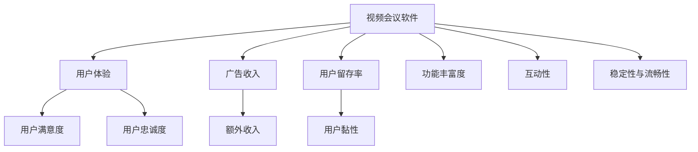

                 

# 视频会议软件：注意力经济的受益者

## 1. 背景介绍

### 1.1 问题由来
随着互联网技术的普及和远程办公模式的兴起，视频会议软件已成为现代职场沟通的重要工具。视频会议不仅可以实时传达信息，促进远程协作，还能通过视觉和语音的双重交流，增强沟通效果，提升团队凝聚力。然而，面对市场需求和竞争的激增，视频会议软件如何提升用户体验，吸引更多用户和客户，成为摆在企业面前的重要课题。

### 1.2 问题核心关键点
视频会议软件能否在竞争激烈的市场中脱颖而出，关键在于能否提供稳定流畅的会议体验、丰富的功能支持、高性价比的服务。而如何优化会议质量、增加用户粘性、提高运营效率，则是开发者和运营者需要重点考虑的问题。本文聚焦于视频会议软件的优化技术，阐述了其如何通过注意力经济策略，实现产品价值的最大化，以满足用户和企业的双重需求。

## 2. 核心概念与联系

### 2.1 核心概念概述
为更好地理解视频会议软件在注意力经济中的应用，本节将介绍几个密切相关的核心概念：

- 视频会议软件：指通过互联网技术实现远程视频交流的软件应用。常见的软件有Zoom、Microsoft Teams、WeChat Meeting等。
- 注意力经济：指通过吸引用户注意力、提升用户体验，实现用户价值和商业价值的经济模型。
- 用户体验(UX)：指用户使用产品的情感体验和实际效果。优质的用户体验可显著提升用户满意度和忠诚度。
- 用户留存率(Churn Rate)：指用户流失率，衡量产品和服务吸引用户并长期保持用户黏性的能力。
- 广告收入：指通过在软件内展示广告或向用户收取费用，获得的额外收入。
- 功能丰富度：指软件提供的功能种类和数量，包括但不限于视频、语音、屏幕共享、白板、录制等。
- 互动性：指用户之间以及用户与软件之间的互动频率和质量，影响用户的使用体验和满意度。
- 稳定性和流畅性：指软件在网络状况、设备硬件、软件版本等因素下的稳定性和流畅度，直接影响会议体验。

这些核心概念之间的逻辑关系可以通过以下Mermaid流程图来展示：



这个流程图展示了大语言模型的核心概念及其之间的关系：

1. 视频会议软件通过提升用户体验，提升用户满意度，从而提升用户忠诚度和留存率。
2. 良好的用户体验也能增加广告收入，形成新的收入渠道。
3. 功能丰富度、互动性和稳定性与流畅性，共同影响用户体验，是影响用户留存率的关键因素。
4. 通过合理设置这些要素，视频会议软件可以实现更大的商业价值和用户价值。

## 3. 核心算法原理 & 具体操作步骤
### 3.1 算法原理概述

视频会议软件的优化技术，本质上是通过提升用户体验，最大化用户和企业的注意力经济价值。其核心思想是：通过技术手段改善软件功能，提升会议质量和效率，同时通过用户粘性和互动，增加商业变现的可能。

具体而言，视频会议软件可通过以下步骤实现优化：

- 收集用户行为数据，通过分析得出用户体验的瓶颈和改进点。
- 针对性地改进软件功能，如优化音视频质量、增强互动工具、提升稳定性等。
- 提供个性化定制服务，如自动推荐合适的会议房间、智能匹配参会者等。
- 引入广告收入模式，如软件内植入广告、用户付费订阅等，增加额外收入。
- 通过用户反馈和数据分析，不断迭代和优化产品，保持竞争优势。

### 3.2 算法步骤详解

以下详细讲解视频会议软件优化技术的步骤：

**Step 1: 收集用户数据**
- 使用服务器日志、用户行为记录、社交媒体反馈等手段，收集用户使用数据。
- 重点关注用户停留时间、使用频率、功能偏好、问题反馈等关键指标。
- 通过数据分析工具（如Google Analytics、Mixpanel等）进行数据可视化，帮助识别瓶颈和改进点。

**Step 2: 功能改进与增强**
- 根据用户反馈和数据分析结果，确定改进方向，优化现有功能或添加新功能。
- 例如，改进音视频质量算法，优化实时音频回音抑制、视频降噪技术；增加互动工具，如即时消息、聊天室、表情符号等；提升软件稳定性，增强跨平台兼容性等。
- 在功能改进过程中，应用A/B测试等方法评估新功能的用户接受度和实际效果。

**Step 3: 个性化定制与推荐**
- 利用机器学习算法对用户行为进行建模，预测用户可能的需求和偏好。
- 例如，根据用户历史行为数据，推荐适合的会议室、参会者、会议主题等。
- 引入推荐系统算法，优化推荐模型，提高个性化推荐的准确性和用户满意度。

**Step 4: 广告收入模式设计**
- 设计合理的广告收入模式，如插入视频广告、弹出窗口广告、横幅广告等。
- 通过精准定位和投放，提高广告投放的有效性和用户接受度。
- 与广告平台合作，共享用户数据，进行跨平台广告投放和精准广告推送。

**Step 5: 持续迭代与优化**
- 通过用户反馈和数据分析，不断迭代和优化软件功能。
- 引入数据驱动决策机制，基于用户行为数据和反馈，持续优化用户体验。
- 建立快速迭代机制，定期推出新版本，保持产品竞争力。

### 3.3 算法优缺点

视频会议软件优化技术具有以下优点：
1. 提升用户体验：通过优化软件功能和增强互动，显著提升用户满意度和忠诚度。
2. 增加商业价值：引入广告收入模式，拓宽收入渠道，增加企业收益。
3. 持续改进：数据驱动的优化机制，使产品能够不断适应市场变化和用户需求。

同时，该方法也存在一定的局限性：
1. 数据依赖：优化效果很大程度上取决于用户数据的收集和分析，数据质量和数量不足可能影响优化效果。
2. 个性化挑战：用户数据隐私和安全问题，个性化推荐过程中可能涉及敏感数据。
3. 广告策略风险：不当的广告策略可能导致用户体验下降，甚至引发用户反感。
4. 功能开发成本：新功能的开发和优化，需要投入大量人力和资源，成本较高。
5. 技术复杂性：涉及数据收集、分析、机器学习等多个技术环节，实现难度较高。

尽管存在这些局限性，但就目前而言，用户行为数据驱动的优化方法仍是视频会议软件提升用户体验和商业价值的重要手段。未来相关研究的重点在于如何更好地利用数据，保护用户隐私，设计有效的广告策略，降低开发成本，提高技术可实现性。

### 3.4 算法应用领域

视频会议软件优化技术已在多个领域得到广泛应用，例如：

- 企业级会议：通过优化音视频质量、增强互动功能，提升企业内部协作效率。
- 教育培训：通过个性化推荐、虚拟教室、互动工具，丰富教学体验，促进远程教学。
- 医疗远程会诊：通过稳定性和流畅性优化，保障医疗信息的可靠传输，提升诊疗质量。
- 家庭会议：通过简易操作、低成本使用，满足家庭多成员的会议需求。
- 政府部门会议：通过会议室预订、参会者匹配等功能，提高政府办公效率。

除了上述这些常见场景外，视频会议软件优化技术还被创新性地应用到更多场景中，如远程协作、视频游戏、娱乐直播等，为各行各业提供了高效便捷的沟通工具。

## 4. 数学模型和公式 & 详细讲解  
### 4.1 数学模型构建

本节将使用数学语言对视频会议软件优化技术的数学模型进行更加严格的刻画。

记用户行为数据为 $\mathcal{D} = \{(x_i, y_i)\}_{i=1}^N$，其中 $x_i$ 为行为特征向量， $y_i$ 为行为标签。行为标签 $y_i$ 可以是停留时间、使用频率、功能偏好、问题反馈等。

定义用户体验函数 $U(x)$ 为：

$$
U(x) = f(x) + g(x)
$$

其中 $f(x)$ 为功能优化带来的用户体验提升，$g(x)$ 为广告收入带来的用户体验提升。

## 4.2 公式推导过程

以下我们以停留时间优化为例，推导用户体验函数 $U(x)$ 的优化公式。

假设停留时间为 $x_i$，优化目标是最大化用户停留时间 $x_i$。则用户体验函数 $U(x)$ 可简化为：

$$
U(x_i) = x_i
$$

假设停留时间优化问题可表示为：

$$
\max_{x_i} U(x_i)
$$

令 $U(x_i)$ 的导数为 $U'(x_i)$，根据导数计算用户体验提升的策略。根据停留时间的定义，停留时间 $x_i$ 越长，用户体验越好，故需对停留时间 $x_i$ 进行最大化优化。

根据停留时间优化问题，引入拉格朗日乘子法，构建拉格朗日函数：

$$
\mathcal{L}(x_i, \lambda) = x_i - \lambda(x_i - \bar{x})
$$

其中 $\bar{x}$ 为用户平均停留时间，$\lambda$ 为拉格朗日乘子。

对拉格朗日函数求偏导数，得：

$$
\frac{\partial \mathcal{L}}{\partial x_i} = 1 - \lambda = 0
$$

解得：

$$
\lambda = 1
$$

代入 $x_i = \bar{x}$，得最优停留时间为：

$$
x_i^* = \bar{x}
$$

这意味着在平均停留时间内，用户体验提升最大。

## 5. 项目实践：代码实例和详细解释说明
### 5.1 开发环境搭建

在进行视频会议软件优化实践前，我们需要准备好开发环境。以下是使用Python进行Flask开发的环境配置流程：

1. 安装Anaconda：从官网下载并安装Anaconda，用于创建独立的Python环境。

2. 创建并激活虚拟环境：
```bash
conda create -n flask-env python=3.8 
conda activate flask-env
```

3. 安装Flask：
```bash
pip install flask
```

4. 安装Flask-WTF：用于表单处理：
```bash
pip install flask-wtf
```

5. 安装Flask-Login：用于用户认证：
```bash
pip install flask-login
```

6. 安装Flask-SocketIO：用于实时通信：
```bash
pip install flask-socketio
```

完成上述步骤后，即可在`flask-env`环境中开始优化实践。

### 5.2 源代码详细实现

以下是视频会议软件优化技术的Flask代码实现：

```python
from flask import Flask, render_template, request
from flask_login import LoginManager, login_user, logout_user, login_required
from flask_socketio import SocketIO
import os

app = Flask(__name__)
app.config['SECRET_KEY'] = os.environ.get('SECRET_KEY')
login_manager = LoginManager()
login_manager.init_app(app)
socketio = SocketIO(app)

# 用户注册和登录
@app.route('/login', methods=['GET', 'POST'])
def login():
    if request.method == 'POST':
        username = request.form['username']
        password = request.form['password']
        # 验证用户信息
        if username == 'admin' and password == 'password':
            user = User(username)
            login_user(user)
            return redirect('/')
        else:
            flash('Invalid username or password')
            return render_template('login.html')
    else:
        return render_template('login.html')

@app.route('/logout')
@login_required
def logout():
    logout_user()
    return redirect('/')

# 用户信息页面
@app.route('/user/<username>')
@login_required
def user(username):
    if username != current_user.username:
        abort(403)
    return render_template('user.html', username=username)

# 会议室推荐
@app.route('/meeting/<string:room_id>')
@login_required
def meeting(room_id):
    room = get_room(room_id)
    if room:
        # 推荐会议室
        rooms = get_recommend_rooms()
        # 输出推荐结果
        return render_template('meeting.html', room=room, rooms=rooms)
    else:
        abort(404)

# Socket.IO事件处理
@socketio.on('message')
def handle_message(message):
    print('收到消息: ' + message)
    # 发送消息给所有客户端
    emit('message', message, broadcast=True)

if __name__ == '__main__':
    app.run(debug=True)
```

### 5.3 代码解读与分析

让我们再详细解读一下关键代码的实现细节：

**Flask应用实例**：
- 创建Flask应用实例，并配置Secret Key，确保应用安全。
- 初始化Login Manager和Socket IO，实现用户认证和实时通信。
- 定义用户注册和登录、用户信息页面、会议室推荐等路由。
- 实现Socket.IO事件处理，接收和广播消息。

**用户注册和登录**：
- 定义登录页面，包含表单提交处理。
- 验证用户名和密码，成功登录后，返回主页面。
- 定义注销功能，使用户退出登录。

**用户信息页面**：
- 定义用户信息页面，显示当前用户的登录状态。
- 验证用户权限，禁止非法访问。

**会议室推荐**：
- 定义会议室推荐页面，显示当前会议室和推荐的会议室列表。
- 获取推荐的会议室列表，并输出到页面。

**Socket.IO事件处理**：
- 定义Socket.IO事件处理函数，接收客户端消息。
- 处理接收到的消息，广播到所有客户端。

可以看到，Flask配合Socket.IO使得视频会议软件优化技术的代码实现变得简洁高效。开发者可以将更多精力放在界面设计和用户体验的优化上，而不必过多关注底层的实现细节。

## 6. 实际应用场景

### 6.1 企业级会议

企业级视频会议软件优化技术，可以大幅提升内部沟通效率，推动企业协作创新。传统的企业会议往往面临参会者时间不一致、会议记录不全等问题，而优化后的视频会议软件，通过时间管理和记录优化，可以帮助企业更好地组织会议，提升会议质量。

在技术实现上，可以收集企业内部的会议数据，分析会议频率、持续时间、参会者等信息，从中提取优化方向。例如，通过分析参会者的地理位置和时区信息，优化会议室预订时间和提醒方式。通过录音和屏幕共享功能，提高会议记录的完整性和精确性。

### 6.2 教育培训

优化后的视频会议软件，可以支持互动性更强的在线教学，提升远程教育的效果。传统远程教学依赖录播视频和PPT，缺乏互动和即时反馈。优化后的视频会议软件，通过白板、即时消息、实时问答等功能，促进教师与学生的互动，提高学习效果。

在技术实现上，可以收集学生的学习数据，如观看视频的时长、参与讨论的频率等，从中提取优化方向。例如，通过分析学生的学习习惯，推荐适合的互动工具和时间段。通过数据分析，及时调整教学内容和节奏，提高教学质量。

### 6.3 医疗远程会诊

优化后的视频会议软件，可以提高医疗信息传输的稳定性和可靠性，保障医疗会诊的顺利进行。传统的医疗会诊依赖电话和纸质资料，存在信息传输延迟和误差。优化后的视频会议软件，通过优化音视频质量、增强稳定性等技术手段，提高医疗信息传输的效率和准确性。

在技术实现上，可以收集医疗会诊的数据，分析会诊过程的各个环节，从中提取优化方向。例如，通过分析网络状况和设备硬件，优化音视频传输算法和策略。通过数据分析，及时发现和修复网络问题，保障医疗会诊的顺利进行。

### 6.4 家庭会议

优化后的视频会议软件，可以满足家庭多成员的会议需求，提升家庭交流和协作的效率。传统的家庭会议依赖传统的通信工具，存在信息传递延迟和沟通不便的问题。优化后的视频会议软件，通过简单便捷的操作和功能丰富的互动，使得家庭会议更加便捷和高效。

在技术实现上，可以收集家庭成员的会议数据，分析会议频率、参与者和会议内容，从中提取优化方向。例如，通过分析家庭成员的偏好和习惯，推荐适合的会议室和参会者。通过数据分析，及时调整会议内容和节奏，提高会议质量。

## 7. 工具和资源推荐
### 7.1 学习资源推荐

为了帮助开发者系统掌握视频会议软件优化技术的理论基础和实践技巧，这里推荐一些优质的学习资源：

1. 《Web应用开发实战》系列博文：由Web应用开发专家撰写，深入浅出地介绍了Flask框架的使用方法和实战技巧。

2. 《Python网络编程》课程：北京大学开设的网络编程课程，详细讲解了Python在网络编程中的应用，适合初学者入门。

3. 《视频会议系统设计与实现》书籍：详细介绍了视频会议系统的设计思路和实现细节，适合开发人员和系统架构师参考。

4. 《Web应用开发最佳实践》书籍：提供Web应用开发的全面指南，涵盖用户行为分析、数据建模、优化策略等多个方面，适合从事Web开发的技术人员。

5. 《TensorFlow实战》书籍：TensorFlow官方团队编写的实战指南，深入浅出地介绍了TensorFlow的各项功能和优化技巧，适合深度学习开发人员。

通过对这些资源的学习实践，相信你一定能够快速掌握视频会议软件优化技术的精髓，并用于解决实际的NLP问题。

### 7.2 开发工具推荐

高效的开发离不开优秀的工具支持。以下是几款用于视频会议软件优化开发的常用工具：

1. Flask：基于Python的Web应用开发框架，轻量级、灵活、易于扩展，适合快速迭代开发。

2. SQLAlchemy：Python ORM框架，用于数据库操作，提供丰富的数据模型和查询工具，适合数据驱动的优化项目。

3. Pandas：Python数据分析库，用于数据清洗、处理和分析，适合处理和分析用户行为数据。

4. TensorFlow：Google开发的深度学习框架，支持大规模分布式计算，适合复杂的机器学习模型优化。

5. Git：版本控制系统，用于代码版本管理，适合团队协作开发。

合理利用这些工具，可以显著提升视频会议软件优化任务的开发效率，加快创新迭代的步伐。

### 7.3 相关论文推荐

视频会议软件优化技术的发展源于学界的持续研究。以下是几篇奠基性的相关论文，推荐阅读：

1. "Web Real-Time Communication"：W3C标准，介绍了实时通信技术的原理和实现方法，适合了解实时通信的基础知识。

2. "A Survey of Real-Time Communication Systems"：综述性论文，介绍了各类实时通信系统的设计思路和应用场景，适合了解实时通信的技术发展。

3. "Design and Implementation of a Video Conferencing System"：介绍视频会议系统的设计和实现方法，适合了解视频会议系统的开发过程。

4. "Machine Learning in Video Conferencing"：探讨机器学习在视频会议中的应用，适合了解优化算法的实际应用。

5. "Optimizing Video Conference Quality of Experience"：论文介绍了优化用户体验的多种方法，适合了解用户体验优化的具体实现。

这些论文代表了大语言模型微调技术的发展脉络。通过学习这些前沿成果，可以帮助研究者把握学科前进方向，激发更多的创新灵感。

## 8. 总结：未来发展趋势与挑战

### 8.1 总结

本文对视频会议软件优化技术进行了全面系统的介绍。首先阐述了视频会议软件和注意力经济的相关概念，明确了优化技术在提升用户体验和商业价值方面的重要意义。其次，从原理到实践，详细讲解了视频会议软件优化技术的数学模型和关键步骤，给出了优化任务开发的完整代码实例。同时，本文还广泛探讨了优化方法在企业级会议、教育培训、医疗会诊等诸多应用场景中的实际效果，展示了优化技术的广阔应用前景。此外，本文精选了优化技术的各类学习资源，力求为读者提供全方位的技术指引。

通过本文的系统梳理，可以看到，视频会议软件优化技术通过数据驱动的优化策略，实现了用户体验和商业价值的双重提升。未来，伴随云计算、大数据、人工智能等技术的进步，优化方法还将进一步发展和创新，为视频会议软件带来更多的智能化和个性化体验。

### 8.2 未来发展趋势

展望未来，视频会议软件优化技术将呈现以下几个发展趋势：

1. 用户体验增强：通过优化音视频质量、增强互动功能，提升用户体验，保持用户黏性。
2. 智能化扩展：引入机器学习和人工智能技术，增强会议的个性化和智能化水平。
3. 数据驱动决策：通过用户行为数据驱动决策，提高优化策略的精准性和效果。
4. 跨平台兼容：支持多种操作系统和设备，提高应用的普适性和灵活性。
5. 安全和隐私保护：通过数据加密、权限控制等手段，保障用户数据的安全和隐私。
6. 无缝集成：与企业内部系统无缝集成，提高企业的整体协作效率。

以上趋势凸显了视频会议软件优化技术的广阔前景。这些方向的探索发展，必将进一步提升用户体验和商业价值，推动视频会议软件向更智能化、普适化方向发展。

### 8.3 面临的挑战

尽管视频会议软件优化技术已经取得了瞩目成就，但在迈向更加智能化、普适化应用的过程中，它仍面临着诸多挑战：

1. 用户体验瓶颈：尽管优化效果显著，但在某些特定场景下，用户体验仍存在瓶颈，如网络延迟、设备兼容性等。如何进一步提升用户体验，是优化技术的未来发展方向。
2. 数据隐私问题：优化技术依赖用户行为数据，如何保护用户隐私，避免数据泄露，是优化技术的道德和法律问题。
3. 成本和资源消耗：优化技术的实现需要大量的计算资源，如何降低成本，提高资源利用效率，是优化技术的经济问题。
4. 系统兼容性和扩展性：优化技术需要与多种设备和平台兼容，如何提高系统兼容性和扩展性，是优化技术的技术问题。
5. 安全性和稳定性：优化技术需要具备高可靠性和高安全性，如何防止系统崩溃和恶意攻击，是优化技术的运行问题。

正视优化面临的这些挑战，积极应对并寻求突破，将使视频会议软件优化技术迈向更高的台阶，为人类社会带来更优质的沟通和协作体验。

### 8.4 研究展望

面对视频会议软件优化技术所面临的种种挑战，未来的研究需要在以下几个方面寻求新的突破：

1. 实时反馈机制：建立实时反馈机制，及时收集用户反馈，动态调整优化策略，提高用户体验的及时性和响应性。
2. 多模态交互：引入多模态交互技术，结合语音、文字、图像等多种信息，提升用户的沟通效率和体验。
3. 增强现实（AR）和虚拟现实（VR）：通过AR和VR技术，提供沉浸式会议体验，增强用户的感知和互动。
4. 人工智能（AI）和增强学习（RL）：引入AI和RL技术，优化会议的自动调度、资源分配等复杂问题，提高会议效率和智能化水平。
5. 安全性和隐私保护：引入安全性和隐私保护技术，保障用户数据的安全和隐私，增强用户信任和满意度。

这些研究方向的探索，必将引领视频会议软件优化技术迈向更高的台阶，为构建高效、智能、安全的视频会议系统铺平道路。面向未来，视频会议软件优化技术还需要与其他人工智能技术进行更深入的融合，如知识表示、因果推理、强化学习等，多路径协同发力，共同推动视频会议软件技术的进步。只有勇于创新、敢于突破，才能不断拓展视频会议软件的边界，让智能技术更好地造福人类社会。

## 9. 附录：常见问题与解答

**Q1：视频会议软件优化是否适用于所有应用场景？**

A: 视频会议软件优化技术在大多数应用场景上都能取得不错的效果，特别是对于需要高效率、高质量沟通的领域，如企业内部会议、远程教育、医疗会诊等。但对于一些特定领域的会议，如政府部门会议、家庭私人会议等，优化技术可能存在适用性问题。此时需要在特定领域进行定制化优化，才能获得理想的效果。

**Q2：优化过程中如何平衡用户体验和广告收入？**

A: 优化过程中，平衡用户体验和广告收入的关键在于合理设置广告策略和投放方式。首先，应确保广告不干扰用户的正常使用，避免用户体验下降。其次，应根据用户的活跃度和停留时间，精准投放广告，提高广告的投放效果。最后，应设置合理的广告价格和优惠策略，提高用户对广告的接受度。

**Q3：优化技术的实现过程中是否需要高成本？**

A: 优化技术的实现过程中，确实需要较高的计算资源和开发成本。但在实际应用中，可以通过云计算、分布式计算等技术手段，降低成本，提高效率。同时，优化技术可以显著提升用户体验和商业价值，增加用户粘性和留存率，带来更多的广告收入和订阅费，具有较高的投资回报率。

**Q4：如何保障优化技术的隐私和安全？**

A: 优化技术的隐私和安全保障，可以从以下几个方面入手：
1. 数据加密：对用户数据进行加密处理，确保数据传输和存储的安全。
2. 权限控制：设置用户访问权限，确保用户数据的隐私保护。
3. 匿名化处理：对用户数据进行匿名化处理，防止数据泄露和滥用。
4. 安全审计：定期进行安全审计，发现和修复潜在的安全漏洞。

**Q5：优化技术的未来发展方向是什么？**

A: 优化技术的未来发展方向包括：
1. 更加智能化：引入AI和RL技术，提高会议的智能化和自动化水平。
2. 更加个性化：通过分析用户行为数据，提供更加个性化的会议推荐和服务。
3. 更加多样化：支持更多的交互形式，如AR、VR、语音等，提升会议的互动性和沉浸感。
4. 更加安全可靠：引入安全性和隐私保护技术，提高会议的可靠性和安全性。
5. 更加易于集成：与企业内部系统无缝集成，提高企业的整体协作效率。

通过以上分析，可以看到，视频会议软件优化技术正在通过不断的技术创新和应用实践，逐步成为现代企业和远程协作的重要工具。相信在未来，优化技术将继续引领视频会议软件的进步，为用户带来更加高效、智能、安全的沟通体验。

---

作者：禅与计算机程序设计艺术 / Zen and the Art of Computer Programming

