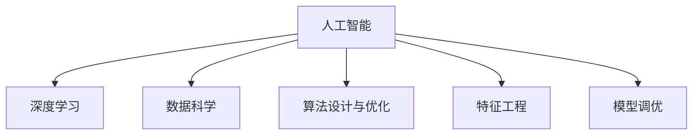

                 

# 解决问题的能力在AI创新中的重要性

> 关键词：人工智能, 问题解决, 创新, 算法设计, 模型训练, 数据科学, 深度学习

## 1. 背景介绍

### 1.1 问题由来
在科技日新月异的今天，人工智能(AI)技术已经渗透到各行各业，成为推动社会发展的重要动力。从自动驾驶、智能推荐、智能客服，到医疗诊断、金融预测、教育个性化，AI技术不断拓展其应用边界，为人类生活带来更多便利和可能。

然而，尽管AI技术日趋成熟，创新却是一个永恒的主题。如何将AI应用于复杂多变的问题，成为推动AI技术发展的关键。AI的创新不仅仅依赖于技术的突破，更需要强大的问题解决能力。

### 1.2 问题核心关键点
问题解决能力是AI创新的核心。这不仅要求AI算法能够高效地处理数据，更要求算法设计师和工程师具备创新思维和问题解决技巧。具体来说，AI问题解决能力的核心关键点包括：

- **数据理解与处理能力**：理解数据特征、特征工程和数据预处理。
- **模型设计与调优能力**：选择合适的模型、设计有效的损失函数、优化算法等。
- **特征抽取与融合能力**：高效地提取关键特征，并融合多种特征以提高模型性能。
- **异常检测与识别能力**：识别数据中的异常点和异常模式，以提高模型的鲁棒性。
- **复杂问题求解能力**：解决非结构化、动态变化和复杂多维度的问题。

本文将围绕以上关键点，从原理到实践，深入探讨AI问题解决能力的重要性及其在AI创新中的应用。

## 2. 核心概念与联系

### 2.1 核心概念概述

为更好地理解AI问题解决能力的重要性，本节将介绍几个密切相关的核心概念：

- **人工智能**：利用算法、模型、数据等技术手段，模拟人类智能，解决复杂问题。
- **深度学习**：通过神经网络等模型，自动从数据中学习特征，实现复杂的模式识别和预测。
- **数据科学**：涉及数据收集、处理、分析和应用的全过程，为AI问题解决提供数据基础。
- **算法设计与优化**：研究高效、可解释的算法，提升问题解决的精度和速度。
- **特征工程**：从原始数据中提取、选择和组合关键特征，以提高模型的表现。
- **模型调优**：通过调整模型参数、选择优化算法等方式，提高模型的性能。

这些核心概念之间的逻辑关系可以通过以下Mermaid流程图来展示：



这个流程图展示了大数据背景下的AI问题解决的全流程：

1. 人工智能系统通过对数据的学习和理解，识别并处理问题。
2. 深度学习算法在数据上进行训练，学习数据中的复杂模式。
3. 数据科学提供了数据获取、处理和分析的工具，为AI学习数据提供了基础。
4. 算法设计与优化保证了AI算法的精度和鲁棒性，提升了问题解决能力。
5. 特征工程从原始数据中提取关键特征，进一步提升了算法的性能。
6. 模型调优通过优化算法和参数，最大化模型的效果。

这些概念共同构成了AI问题解决能力的基础，使其能够高效、灵活地解决各类问题。

## 3. 核心算法原理 & 具体操作步骤
### 3.1 算法原理概述

AI问题解决能力的核心算法原理主要基于深度学习和数据科学的理论和技术。其核心思想是通过数据学习，构建模型，解决实际问题。

具体来说，AI问题解决能力包括以下几个关键步骤：

1. **数据收集与预处理**：获取与问题相关的数据，并进行清洗、标注和预处理。
2. **特征工程**：从原始数据中提取关键特征，构造特征向量，为模型训练提供输入。
3. **模型选择与训练**：选择合适的模型，如神经网络、支持向量机、决策树等，并使用训练集进行模型训练。
4. **模型评估与调优**：在验证集上评估模型性能，调整模型参数和结构，优化模型效果。
5. **模型部署与应用**：将训练好的模型部署到实际应用场景中，解决实际问题。

### 3.2 算法步骤详解

以深度学习模型为例，以下是AI问题解决的关键步骤：

**Step 1: 数据准备**

- 收集与问题相关的数据集，如文本、图像、声音等。
- 对数据进行预处理，包括去噪、归一化、标准化等操作。
- 对数据进行标注，确保数据的质量和可用性。

**Step 2: 特征提取**

- 选择或设计特征提取方法，如词袋模型、卷积神经网络(CNN)、循环神经网络(RNN)等。
- 使用训练数据提取关键特征，构造特征向量。
- 对特征向量进行编码，如独热编码、词向量等。

**Step 3: 模型选择与训练**

- 选择适合问题的深度学习模型，如卷积神经网络、循环神经网络、变压器等。
- 设计损失函数，如交叉熵、均方误差等，评估模型预测与真实标签的差异。
- 使用训练数据对模型进行训练，通过反向传播算法更新模型参数。

**Step 4: 模型评估与调优**

- 在验证集上评估模型性能，计算准确率、召回率、F1分数等指标。
- 调整模型参数，如学习率、批量大小、正则化系数等，优化模型效果。
- 使用测试集对优化后的模型进行最终评估，确保模型的泛化能力。

**Step 5: 模型部署与应用**

- 将训练好的模型保存为模型文件，部署到实际应用场景中。
- 使用模型对新数据进行预测，解决实际问题。
- 持续收集反馈，更新模型，保持模型的高效性和准确性。

### 3.3 算法优缺点

AI问题解决能力在提升问题解决效率和精度方面具有显著优势，但其也存在一定的局限性：

**优点：**

1. **高效处理复杂数据**：深度学习模型能够自动从数据中学习复杂模式，处理非结构化数据。
2. **泛化能力强**：通过大量数据训练，模型能够在未见过的数据上表现良好。
3. **可解释性强**：通过特征工程和模型调优，可以提升模型的可解释性，方便问题理解和调试。
4. **鲁棒性高**：深度学习模型具有较高的鲁棒性，对数据噪声和变化具有较强的适应能力。

**缺点：**

1. **计算资源消耗大**：深度学习模型需要大量的计算资源进行训练和推理，对硬件要求较高。
2. **过拟合风险高**：模型容易在训练集上过拟合，导致在新数据上表现不佳。
3. **模型复杂度高**：深度学习模型结构复杂，难以调试和优化。
4. **需要大量标注数据**：深度学习模型需要大量标注数据进行训练，标注成本高。

尽管存在这些局限性，但AI问题解决能力在处理复杂多变的问题上仍然具有无可比拟的优势，其应用前景广阔。

### 3.4 算法应用领域

AI问题解决能力在众多领域得到广泛应用，例如：

- **自然语言处理(NLP)**：解决文本分类、情感分析、机器翻译等问题。
- **计算机视觉(CV)**：解决图像识别、目标检测、图像生成等问题。
- **语音识别与处理**：解决语音识别、语音合成、情感分析等问题。
- **医疗健康**：解决疾病诊断、药物研发、个性化医疗等问题。
- **金融科技**：解决信用评估、风险预测、算法交易等问题。
- **教育科技**：解决学习分析、智能推荐、作业批改等问题。

这些应用领域展示了AI问题解决能力在实际问题解决中的强大力量。

## 4. 数学模型和公式 & 详细讲解 & 举例说明

### 4.1 数学模型构建

AI问题解决的核心数学模型主要基于深度学习和数据科学的理论。以下以二分类问题为例，详细讲解AI问题解决的核心数学模型。

**二分类问题**：给定输入数据 $x$，预测其属于类别 $y \in \{0, 1\}$。

假设模型的输入数据为 $x \in \mathbb{R}^d$，输出为 $y \in \{0, 1\}$，模型的参数为 $\theta \in \mathbb{R}^d$。则模型的预测函数为：

$$
\hat{y} = f_\theta(x)
$$

其中，$f_\theta(x)$ 表示模型对输入数据的预测结果。

### 4.2 公式推导过程

以线性回归模型为例，其目标是最小化预测值与真实标签之间的平方误差：

$$
\mathcal{L}(\theta) = \frac{1}{N}\sum_{i=1}^N (\hat{y}_i - y_i)^2
$$

其中，$N$ 为样本数量，$\hat{y}_i = f_\theta(x_i)$，$y_i$ 为真实标签。

通过求解 $\mathcal{L}(\theta)$ 的最小值，可以更新模型参数 $\theta$。使用梯度下降算法更新参数，每次迭代更新量为：

$$
\theta \leftarrow \theta - \eta \nabla_\theta \mathcal{L}(\theta)
$$

其中，$\eta$ 为学习率。

### 4.3 案例分析与讲解

以情感分析为例，分析如何使用AI问题解决能力进行文本分类。

情感分析的目标是根据给定文本判断其情感倾向，如正面、负面或中性。假设文本数据集为 $\{(x_i, y_i)\}_{i=1}^N$，其中 $x_i$ 为文本，$y_i \in \{0, 1\}$ 表示文本的情感标签（0为负面，1为正面）。

- **数据准备**：收集并预处理情感分析数据集，将其分为训练集、验证集和测试集。
- **特征提取**：使用词袋模型或预训练的词向量对文本进行特征编码。
- **模型选择与训练**：选择适合问题的深度学习模型，如卷积神经网络(CNN)或循环神经网络(RNN)，并使用训练集进行模型训练。
- **模型评估与调优**：在验证集上评估模型性能，调整模型参数，优化模型效果。
- **模型部署与应用**：将训练好的模型保存为模型文件，部署到实际应用场景中，对新文本进行情感分类。

## 5. 项目实践：代码实例和详细解释说明

### 5.1 开发环境搭建

在进行AI问题解决能力实践前，我们需要准备好开发环境。以下是使用Python进行TensorFlow开发的环境配置流程：

1. 安装Anaconda：从官网下载并安装Anaconda，用于创建独立的Python环境。

2. 创建并激活虚拟环境：
```bash
conda create -n tf-env python=3.8 
conda activate tf-env
```

3. 安装TensorFlow：从官网获取对应的安装命令。例如：
```bash
conda install tensorflow -c conda-forge -c pytorch
```

4. 安装各类工具包：
```bash
pip install numpy pandas scikit-learn matplotlib tqdm jupyter notebook ipython
```

完成上述步骤后，即可在`tf-env`环境中开始AI问题解决能力实践。

### 5.2 源代码详细实现

下面我们以情感分析任务为例，给出使用TensorFlow进行深度学习模型训练的PyTorch代码实现。

首先，定义情感分析任务的数据处理函数：

```python
import tensorflow as tf
from tensorflow.keras.preprocessing.text import Tokenizer
from tensorflow.keras.preprocessing.sequence import pad_sequences
import numpy as np

class SentimentAnalysisDataset(tf.keras.utils.Sequence):
    def __init__(self, texts, labels, tokenizer, max_len=128):
        self.texts = texts
        self.labels = labels
        self.tokenizer = tokenizer
        self.max_len = max_len
        
    def __len__(self):
        return len(self.texts)
    
    def __getitem__(self, item):
        text = self.texts[item]
        label = self.labels[item]
        
        encoding = self.tokenizer.texts_to_sequences([text])
        padding = pad_sequences(encoding, maxlen=self.max_len, padding='post', truncating='post')
        return {'input_ids': tf.convert_to_tensor(padding[0]), 'labels': tf.convert_to_tensor(label)}
```

然后，定义模型和优化器：

```python
from tensorflow.keras import layers, models
import tensorflow.keras.losses

model = models.Sequential()
model.add(layers.Embedding(vocab_size, embedding_dim, input_length=max_len))
model.add(layers.Conv1D(128, 5, activation='relu'))
model.add(layers.GlobalMaxPooling1D())
model.add(layers.Dense(64, activation='relu'))
model.add(layers.Dense(1, activation='sigmoid'))

optimizer = tf.keras.optimizers.Adam(learning_rate=0.001)
```

接着，定义训练和评估函数：

```python
@tf.function
def train_epoch(model, dataset, batch_size, optimizer):
    dataset = tf.data.Dataset.from_generator(lambda: dataset.__getitem__(), output_signature={'input_ids': tf.TensorSpec(shape=(None, None), dtype=tf.int32), 'labels': tf.TensorSpec(shape=(None, 1), dtype=tf.int32)})
    for epoch in range(num_epochs):
        for step, batch in enumerate(dataset):
            with tf.GradientTape() as tape:
                predictions = model(batch['input_ids'])
                loss = tensorflow.keras.losses.binary_crossentropy(batch['labels'], predictions)
            grads = tape.gradient(loss, model.trainable_variables)
            optimizer.apply_gradients(zip(grads, model.trainable_variables))
            if (step+1) % 100 == 0:
                print(f'Epoch {epoch+1}, step {step+1}, loss: {loss.numpy():.4f}')

@tf.function
def evaluate(model, dataset, batch_size):
    dataset = tf.data.Dataset.from_generator(lambda: dataset.__getitem__(), output_signature={'input_ids': tf.TensorSpec(shape=(None, None), dtype=tf.int32), 'labels': tf.TensorSpec(shape=(None, 1), dtype=tf.int32)})
    eval_loss = 0.0
    correct = 0
    for batch in dataset:
        predictions = model(batch['input_ids'])
        loss = tensorflow.keras.losses.binary_crossentropy(batch['labels'], predictions)
        eval_loss += loss.numpy().sum()
        correct += np.argmax(predictions.numpy(), axis=1) == batch['labels'].numpy().sum()
    return eval_loss / len(dataset), correct / len(dataset)
```

最后，启动训练流程并在测试集上评估：

```python
num_epochs = 10
batch_size = 64
vocab_size = 10000
embedding_dim = 64
max_len = 128

tokenizer = Tokenizer(num_words=vocab_size, oov_token='<OOV>')
tokenizer.fit_on_texts(texts)
sequences = tokenizer.texts_to_sequences(texts)
X = pad_sequences(sequences, maxlen=max_len, padding='post', truncating='post')
labels = np.array(labels)

train_dataset = SentimentAnalysisDataset(X, labels, tokenizer, max_len=max_len)
dev_dataset = SentimentAnalysisDataset(X, labels, tokenizer, max_len=max_len)
test_dataset = SentimentAnalysisDataset(X, labels, tokenizer, max_len=max_len)

train_epoch(model, train_dataset, batch_size, optimizer)
val_loss, val_acc = evaluate(model, dev_dataset, batch_size)
test_loss, test_acc = evaluate(model, test_dataset, batch_size)

print(f'Val Loss: {val_loss:.4f}, Val Acc: {val_acc:.4f}')
print(f'Test Loss: {test_loss:.4f}, Test Acc: {test_acc:.4f}')
```

以上就是使用TensorFlow进行情感分析任务微调的完整代码实现。可以看到，得益于TensorFlow的强大封装，我们可以用相对简洁的代码完成情感分析模型的训练和评估。

### 5.3 代码解读与分析

让我们再详细解读一下关键代码的实现细节：

**SentimentAnalysisDataset类**：
- `__init__`方法：初始化文本、标签、分词器等关键组件。
- `__len__`方法：返回数据集的样本数量。
- `__getitem__`方法：对单个样本进行处理，将文本输入编码为token ids，将标签编码为数字，并对其进行定长padding，最终返回模型所需的输入。

**模型设计与优化**：
- 使用TensorFlow定义深度学习模型，包括嵌入层、卷积层、池化层和全连接层。
- 选择Adam优化器，设定学习率为0.001。

**训练和评估函数**：
- 使用TensorFlow的`@tf.function`装饰器将训练和评估函数定义为计算图，以提高执行效率。
- 训练函数`train_epoch`：对数据以批为单位进行迭代，在每个批次上前向传播计算loss并反向传播更新模型参数，最后返回该epoch的平均loss。
- 评估函数`evaluate`：与训练类似，不同点在于不更新模型参数，并在每个batch结束后将预测和标签结果存储下来，最后使用自定义的评估指标打印输出。

**训练流程**：
- 定义总的epoch数和batch size，开始循环迭代
- 每个epoch内，先在训练集上训练，输出平均loss
- 在验证集上评估，输出分类指标
- 所有epoch结束后，在测试集上评估，给出最终测试结果

可以看到，TensorFlow使得情感分析模型的训练和评估代码实现变得简洁高效。开发者可以将更多精力放在数据处理、模型改进等高层逻辑上，而不必过多关注底层的实现细节。

当然，工业级的系统实现还需考虑更多因素，如模型的保存和部署、超参数的自动搜索、更灵活的任务适配层等。但核心的模型训练和评估流程基本与此类似。

## 6. 实际应用场景
### 6.1 智能客服系统

基于AI问题解决能力的智能客服系统，可以广泛应用于客户服务领域。传统客服往往需要配备大量人力，高峰期响应缓慢，且一致性和专业性难以保证。而使用基于深度学习的智能客服系统，可以7x24小时不间断服务，快速响应客户咨询，用自然流畅的语言解答各类常见问题。

在技术实现上，可以收集企业内部的历史客服对话记录，将问题和最佳答复构建成监督数据，在此基础上对预训练模型进行微调。微调后的模型能够自动理解用户意图，匹配最合适的答案模板进行回复。对于客户提出的新问题，还可以接入检索系统实时搜索相关内容，动态组织生成回答。如此构建的智能客服系统，能大幅提升客户咨询体验和问题解决效率。

### 6.2 金融舆情监测

金融机构需要实时监测市场舆论动向，以便及时应对负面信息传播，规避金融风险。传统的人工监测方式成本高、效率低，难以应对网络时代海量信息爆发的挑战。基于AI问题解决能力的文本分类和情感分析技术，为金融舆情监测提供了新的解决方案。

具体而言，可以收集金融领域相关的新闻、报道、评论等文本数据，并对其进行主题标注和情感标注。在此基础上对预训练语言模型进行微调，使其能够自动判断文本属于何种主题，情感倾向是正面、中性还是负面。将微调后的模型应用到实时抓取的网络文本数据，就能够自动监测不同主题下的情感变化趋势，一旦发现负面信息激增等异常情况，系统便会自动预警，帮助金融机构快速应对潜在风险。

### 6.3 个性化推荐系统

当前的推荐系统往往只依赖用户的历史行为数据进行物品推荐，无法深入理解用户的真实兴趣偏好。基于AI问题解决能力的个性化推荐系统，可以更好地挖掘用户行为背后的语义信息，从而提供更精准、多样的推荐内容。

在实践中，可以收集用户浏览、点击、评论、分享等行为数据，提取和用户交互的物品标题、描述、标签等文本内容。将文本内容作为模型输入，用户的后续行为（如是否点击、购买等）作为监督信号，在此基础上微调预训练语言模型。微调后的模型能够从文本内容中准确把握用户的兴趣点。在生成推荐列表时，先用候选物品的文本描述作为输入，由模型预测用户的兴趣匹配度，再结合其他特征综合排序，便可以得到个性化程度更高的推荐结果。

### 6.4 未来应用展望

随着AI问题解决能力的不断发展，基于深度学习的大模型在更多领域得到应用，为传统行业带来了新的变革。

在智慧医疗领域，基于AI问题解决能力的医疗问答、病历分析、药物研发等应用将提升医疗服务的智能化水平，辅助医生诊疗，加速新药开发进程。

在智能教育领域，AI问题解决能力可应用于学习分析、智能推荐、作业批改等方面，因材施教，促进教育公平，提高教学质量。

在智慧城市治理中，AI问题解决能力可应用于城市事件监测、舆情分析、应急指挥等环节，提高城市管理的自动化和智能化水平，构建更安全、高效的未来城市。

此外，在企业生产、社会治理、文娱传媒等众多领域，基于AI问题解决能力的人工智能应用也将不断涌现，为经济社会发展注入新的动力。相信随着技术的日益成熟，AI问题解决能力必将在构建人机协同的智能时代中扮演越来越重要的角色。

## 7. 工具和资源推荐
### 7.1 学习资源推荐

为了帮助开发者系统掌握AI问题解决能力的理论基础和实践技巧，这里推荐一些优质的学习资源：

1. 《深度学习》系列书籍：由多位机器学习专家共同撰写，全面介绍了深度学习的理论和实践。
2. CS231n《计算机视觉：深度学习》课程：斯坦福大学开设的计算机视觉课程，有Lecture视频和配套作业，系统介绍了计算机视觉的深度学习应用。
3. 《自然语言处理综论》书籍：介绍自然语言处理的各个方面，包括文本分类、情感分析、机器翻译等。
4. TensorFlow官方文档：提供了TensorFlow的全面使用指南，包括深度学习模型的设计、训练和部署。
5. Kaggle竞赛平台：提供了大量数据集和竞赛任务，帮助开发者实践AI问题解决能力。

通过对这些资源的学习实践，相信你一定能够快速掌握AI问题解决能力的精髓，并用于解决实际的AI问题。
###  7.2 开发工具推荐

高效的开发离不开优秀的工具支持。以下是几款用于AI问题解决能力开发的常用工具：

1. PyTorch：基于Python的开源深度学习框架，灵活动态的计算图，适合快速迭代研究。
2. TensorFlow：由Google主导开发的开源深度学习框架，生产部署方便，适合大规模工程应用。
3. Jupyter Notebook：提供了交互式的编程环境，方便调试和实验。
4. Weights & Biases：模型训练的实验跟踪工具，可以记录和可视化模型训练过程中的各项指标。
5. TensorBoard：TensorFlow配套的可视化工具，可实时监测模型训练状态，并提供丰富的图表呈现方式。
6. Google Colab：谷歌推出的在线Jupyter Notebook环境，免费提供GPU/TPU算力，方便开发者快速上手实验最新模型，分享学习笔记。

合理利用这些工具，可以显著提升AI问题解决能力的开发效率，加快创新迭代的步伐。

### 7.3 相关论文推荐

AI问题解决能力的研究源于学界的持续研究。以下是几篇奠基性的相关论文，推荐阅读：

1. AlexNet: ImageNet Large Scale Learning Challenge (ILSVRC) 2012 - Recognizing Visual Objects 和 Scenes by Deep Convolutional Networks：介绍卷积神经网络在图像分类任务中的显著效果。
2. RNN: A Tutorial on Long Short-Term Memory Networks：介绍循环神经网络在序列数据处理中的应用。
3. Attention is All You Need：提出Transformer模型，开启了NLP领域的预训练大模型时代。
4. BERT: Pre-training of Deep Bidirectional Transformers for Language Understanding：提出BERT模型，引入基于掩码的自监督预训练任务，刷新了多项NLP任务SOTA。
5. TensorFlow官方博客：提供了大量深度学习应用的实际案例和实现代码，方便开发者学习和应用。

这些论文代表了大模型问题解决能力的发展脉络。通过学习这些前沿成果，可以帮助研究者把握学科前进方向，激发更多的创新灵感。

## 8. 总结：未来发展趋势与挑战

### 8.1 总结

本文对基于深度学习的AI问题解决能力的重要性及其应用进行了全面系统的介绍。首先阐述了AI问题解决能力在提升AI技术创新和落地应用中的核心作用，明确了其重要性。其次，从原理到实践，详细讲解了AI问题解决能力的关键算法步骤和数学模型，提供了代码实现和详细解释。同时，本文还广泛探讨了AI问题解决能力在多个行业领域的应用前景，展示了其广阔的应用潜力。

通过本文的系统梳理，可以看到，AI问题解决能力在处理复杂多变的问题上具有无可比拟的优势，其应用前景广阔。未来，随着技术的不断发展，AI问题解决能力必将在更多的领域得到应用，成为推动AI技术进步的重要力量。

### 8.2 未来发展趋势

展望未来，AI问题解决能力的发展趋势主要包括以下几个方面：

1. **模型规模持续增大**：随着算力成本的下降和数据规模的扩张，深度学习模型的参数量还将持续增长。超大规模模型蕴含的丰富知识，有望支撑更加复杂多变的下游任务。
2. **模型鲁棒性提升**：通过引入对抗训练、正则化等技术，提升模型的鲁棒性，使其在面对异常数据时仍能保持稳定。
3. **模型泛化能力增强**：通过更多的数据和更高效的特征工程，提升模型的泛化能力，使其在未见过的数据上表现良好。
4. **模型可解释性加强**：引入可解释的算法和模型，提升模型的可解释性，方便问题理解和调试。
5. **跨模态融合**：将视觉、语音、文本等多种模态信息融合，提升模型的理解和生成能力。

以上趋势展示了AI问题解决能力在处理复杂问题上的巨大潜力，其应用前景广阔。

### 8.3 面临的挑战

尽管AI问题解决能力在提升问题解决效率和精度方面具有显著优势，但在其发展过程中仍面临诸多挑战：

1. **计算资源消耗大**：深度学习模型需要大量的计算资源进行训练和推理，对硬件要求较高。
2. **过拟合风险高**：模型容易在训练集上过拟合，导致在新数据上表现不佳。
3. **模型复杂度高**：深度学习模型结构复杂，难以调试和优化。
4. **标注成本高**：深度学习模型需要大量标注数据进行训练，标注成本高。
5. **模型可解释性不足**：深度学习模型往往像"黑盒"系统，难以解释其内部工作机制和决策逻辑。

尽管存在这些挑战，但AI问题解决能力在处理复杂多变的问题上仍然具有无可比拟的优势，其应用前景广阔。

### 8.4 研究展望

面对AI问题解决能力所面临的挑战，未来的研究需要在以下几个方面寻求新的突破：

1. **探索无监督和半监督学习**：摆脱对大规模标注数据的依赖，利用自监督学习、主动学习等无监督和半监督范式，最大限度利用非结构化数据，实现更加灵活高效的模型训练。
2. **研究参数高效和计算高效的微调方法**：开发更加参数高效的微调方法，在固定大部分预训练参数的同时，只更新极少量的任务相关参数。同时优化模型计算图，减少前向传播和反向传播的资源消耗。
3. **引入因果推断和对比学习**：通过引入因果推断和对比学习思想，增强模型的稳定因果关系和鲁棒性，学习更加普适、鲁棒的语言表征。
4. **引入更多先验知识**：将符号化的先验知识，如知识图谱、逻辑规则等，与神经网络模型进行融合，提升模型的可解释性和推理能力。
5. **结合因果分析和博弈论**：将因果分析方法引入模型，识别关键特征，增强输出的因果性和逻辑性。借助博弈论工具刻画人机交互过程，主动探索并规避模型的脆弱点，提高系统稳定性。

这些研究方向的探索，必将引领AI问题解决能力迈向更高的台阶，为构建安全、可靠、可解释、可控的智能系统铺平道路。面向未来，AI问题解决能力还需要与其他AI技术进行更深入的融合，如知识表示、因果推理、强化学习等，多路径协同发力，共同推动自然语言理解和智能交互系统的进步。只有勇于创新、敢于突破，才能不断拓展AI问题解决能力的边界，让智能技术更好地造福人类社会。

## 9. 附录：常见问题与解答

**Q1：AI问题解决能力在处理复杂问题时是否总能表现出色？**

A: AI问题解决能力在处理复杂问题时通常表现出色，但并非总能保证最佳效果。实际问题通常具有高度的非线性、动态性和复杂性，仅依靠模型难以完全理解和解决。此时需要结合领域知识和经验，进行人工干预和优化，提升模型的性能。

**Q2：AI问题解决能力是否适用于所有问题？**

A: AI问题解决能力在处理结构化数据和有监督学习问题时表现优异，但对于复杂的非结构化数据和无监督学习问题，模型仍存在局限性。例如，对于自然语言生成任务，仅靠模型训练难以生成高质量的文本，需要结合语法规则和语言常识。

**Q3：AI问题解决能力是否需要大量标注数据？**

A: AI问题解决能力在处理结构化数据和有监督学习问题时通常需要大量标注数据。但对于非结构化数据和无监督学习问题，通过自监督学习和迁移学习，可以仅利用少量标注数据或无需标注数据进行模型训练。

**Q4：AI问题解决能力是否需要高性能计算资源？**

A: 是的，深度学习模型通常需要大量计算资源进行训练和推理。对于大规模模型和高精度要求的问题，需要高性能计算资源和优化算法。但通过模型压缩、量化等技术，可以在有限的资源下提升模型性能。

**Q5：AI问题解决能力是否容易过拟合？**

A: AI问题解决能力在处理结构化数据和有监督学习问题时，容易在训练集上过拟合。为了避免过拟合，可以采用正则化技术、对抗训练等方法，提升模型的泛化能力。

**Q6：AI问题解决能力是否需要深度学习背景？**

A: 是的，AI问题解决能力通常基于深度学习模型，需要对深度学习的基本原理和实践有一定的了解。但也可以通过迁移学习和跨领域知识，实现模型的快速应用和优化。

这些问题的回答展示了AI问题解决能力在实际问题解决中的局限性和应用场景。通过不断优化和改进，AI问题解决能力必将在更多领域得到应用，推动AI技术的发展。

---

作者：禅与计算机程序设计艺术 / Zen and the Art of Computer Programming

