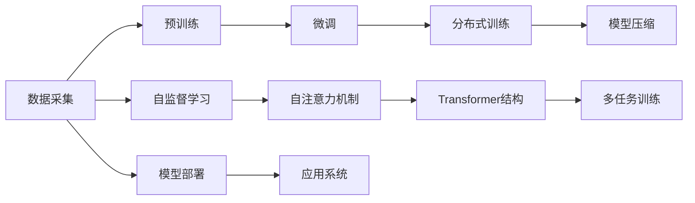

                 

# 计算机架构的新纪元：LLM的崛起

## 1. 背景介绍

### 1.1 问题由来

随着人工智能（AI）技术的迅猛发展，深度学习（DL）和神经网络（NN）成为了实现高性能计算的核心技术。然而，传统的计算架构逐渐暴露出其局限性，难以满足日益增长的计算需求。在这关键时刻，一种新型的大规模语言模型（Large Language Models, LLMs），如GPT-3、BERT等，应运而生，极大地改变了计算机架构的发展方向。

LLMs以Transformer为基础，通过在大规模无监督数据上进行预训练，获得了海量的知识储备和强大的泛化能力。其突破性的性能不仅在自然语言处理（NLP）领域引起了巨大反响，也深刻影响了计算机架构和应用系统的设计。

### 1.2 问题核心关键点

LLMs之所以能引起如此大的变革，主要有以下几个关键点：

1. **大规模数据需求**：预训练过程需要大量的数据，这不仅对硬件存储能力提出了更高要求，也推动了大数据基础设施的发展。
2. **高计算量需求**：预训练和微调过程涉及大规模矩阵计算，对CPU和GPU计算性能提出了严峻挑战。
3. **灵活性**：LLMs可以适应各种NLP任务，推动了多领域的应用，如智能客服、金融分析、医疗诊断等。
4. **自监督学习**：无需人工标注数据，仅依赖大量未标注数据进行自监督预训练，降低了数据获取和处理的成本。
5. **模型结构创新**：采用了Transformer结构，大幅提升了模型处理序列数据的能力。

这些核心关键点使得LLMs成为当前计算架构创新的重要驱动力。接下来，我们将在各个章节中详细探讨其核心概念、算法原理和具体实现，以及其在计算机架构中的广泛应用。

## 2. 核心概念与联系

### 2.1 核心概念概述

为更好地理解LLMs在计算机架构中的应用，本节将介绍几个核心概念：

1. **大规模语言模型（LLM）**：指的是具有数十亿参数量的大型神经网络模型，如GPT-3、BERT等，通过自监督学习任务在大规模无标签数据上进行预训练，具备强大的语言理解和生成能力。

2. **Transformer结构**：一种基于自注意力机制的神经网络架构，通过多头自注意力和前馈神经网络实现高效的序列数据处理，已成为深度学习领域的主流结构。

3. **自监督学习（SSL）**：一种无需标签数据的训练方式，通过设计各种自监督任务，利用数据本身的结构和关系进行训练，如图像的补全、掩码语言建模等。

4. **微调（Fine-tuning）**：在预训练模型的基础上，使用少量有标签数据进行有监督训练，优化模型在某特定任务上的表现。

5. **分布式训练**：由于模型规模庞大，传统的单GPU训练方式已无法满足需求，通过分布式训练在多GPU或多机上进行并行计算，加快训练速度。

6. **模型压缩**：为了减少计算量和存储空间，通过剪枝、量化等方法对模型进行压缩，提高模型效率。

这些核心概念之间存在着紧密的联系，通过这些技术手段，LLMs能够高效地处理大规模数据，并在各种NLP任务上表现出优异的性能。

### 2.2 核心概念原理和架构的 Mermaid 流程图(Mermaid 流程节点中不要有括号、逗号等特殊字符)



## 3. 核心算法原理 & 具体操作步骤

### 3.1 算法原理概述

LLMs的预训练过程主要通过自监督学习任务，利用大规模无标签数据进行训练。具体来说，模型需要同时完成多项任务，如掩码语言建模（Masked Language Modeling, MLM）、下一句预测（Next Sentence Prediction, NSP）、文本填充（Text Fill）等。这些任务的设计使得模型在处理大规模文本数据时，能够学习到丰富的语言知识和结构。

在微调阶段，LLMs通过有监督学习的方式，适应特定的下游任务。微调数据集通常规模较小，但任务目标明确，通过优化模型的特定层或添加额外的任务适配层，使得模型能够在新的数据集上表现出更好的性能。

### 3.2 算法步骤详解

**Step 1: 数据准备**
- 收集大规模无标签数据集，如维基百科、新闻、微博等。
- 将数据集划分为训练集、验证集和测试集，确保数据分布的一致性。

**Step 2: 预训练模型选择与初始化**
- 选择适合任务的预训练模型，如BERT、GPT等。
- 在预训练模型的基础上，使用指定数据集进行预训练。

**Step 3: 预训练阶段**
- 使用自监督学习任务对模型进行训练，如掩码语言建模。
- 多次迭代，逐步提升模型性能，直至达到预设的性能指标。

**Step 4: 微调阶段**
- 选择下游任务，收集标注数据集。
- 在预训练模型的基础上，添加任务适配层。
- 使用有监督学习方式，对模型进行微调。

**Step 5: 分布式训练与模型压缩**
- 在GPU集群或多机上进行分布式训练，加速模型训练。
- 对模型进行压缩，减小模型体积和计算量，提高计算效率。

**Step 6: 模型部署与集成**
- 将训练好的模型部署到服务器或云平台。
- 集成到应用系统中，提供稳定的服务接口。

### 3.3 算法优缺点

**优点**：
- 自监督学习：无需人工标注数据，降低成本。
- 大规模数据处理：预训练过程可以利用大数据，提升模型性能。
- 高性能计算：Transformer结构高效处理序列数据。
- 泛化能力：通过微调适应多种下游任务。

**缺点**：
- 计算资源需求高：预训练和微调过程需要大量计算资源。
- 模型压缩复杂：模型压缩技术难度较大。
- 训练时间长：大规模数据和复杂模型导致训练时间长。
- 内存占用大：模型参数量庞大，内存消耗大。

### 3.4 算法应用领域

LLMs由于其强大的语言理解和生成能力，被广泛应用于以下领域：

- **自然语言处理（NLP）**：文本分类、情感分析、机器翻译、文本摘要等。
- **机器学习与数据科学**：模型压缩、数据增强、特征提取等。
- **智能客服与推荐系统**：智能问答、推荐生成、对话生成等。
- **金融与商业分析**：风险评估、市场分析、客户细分等。
- **医疗与健康**：疾病诊断、患者沟通、健康咨询等。

## 4. 数学模型和公式 & 详细讲解 & 举例说明

### 4.1 数学模型构建

以BERT为例，构建其数学模型。BERT采用Transformer结构，其中的编码器由多层的自注意力和前馈神经网络组成。

**自注意力机制**：
$$
\text{Attention(Q, K, V)} = \text{softmax}(\frac{QK^T}{\sqrt{d_k}})V
$$
其中，$Q$为查询矩阵，$K$和$V$分别为键矩阵和值矩阵，$d_k$为键向量的维度。

**前馈网络**：
$$
\text{FFN}(x) = \max(0, xW_1 + b_1)\sigma(xW_2 + b_2)
$$
其中，$W_1$和$W_2$为前馈网络的权重矩阵，$\sigma$为激活函数，如ReLU。

### 4.2 公式推导过程

以MLM任务为例，推导掩码语言建模的损失函数。

设输入序列为$x=\{w_1, w_2, ..., w_n\}$，其中$w_i$为输入的单词。掩码语言建模的目标是在输入序列中随机遮盖一些单词，预测其掩码位置和对应单词的概率。

**掩码语言建模目标**：
$$
\max_{w_t}\mathcal{L} = -\sum_{i=1}^{n}\log P(x_i|x_{<i})
$$
其中，$P(x_i|x_{<i})$表示在上下文$x_{<i}$下，第$i$个单词$x_i$出现的概率。

**掩码语言建模损失函数**：
$$
\mathcal{L} = -\frac{1}{N}\sum_{i=1}^{N}\sum_{j=1}^{n}\log P(x_i|x_{<i})
$$
其中，$N$为样本数量，$P(x_i|x_{<i})$表示在上下文$x_{<i}$下，第$i$个单词$x_i$出现的概率。

### 4.3 案例分析与讲解

**案例**：使用BERT进行情感分析

**数据准备**：收集带有情感标签的电影评论数据集。

**模型选择**：选择BERT模型作为预训练模型。

**预训练过程**：
- 使用掩码语言建模（MLM）和下一句预测（NSP）等自监督任务进行预训练。
- 在大量无标签文本数据上训练，得到初始BERT模型。

**微调过程**：
- 在电影评论数据集上添加情感标签。
- 使用有监督学习方式，微调BERT模型。
- 添加情感分类头，并使用交叉熵损失函数进行训练。

**测试过程**：
- 在测试集上评估微调后模型的性能，输出情感分类结果。

## 5. 项目实践：代码实例和详细解释说明

### 5.1 开发环境搭建

1. 安装Anaconda：从官网下载并安装Anaconda，用于创建独立的Python环境。

2. 创建并激活虚拟环境：
```bash
conda create -n pytorch-env python=3.8 
conda activate pytorch-env
```

3. 安装PyTorch：根据CUDA版本，从官网获取对应的安装命令。例如：
```bash
conda install pytorch torchvision torchaudio cudatoolkit=11.1 -c pytorch -c conda-forge
```

4. 安装TensorFlow：
```bash
pip install tensorflow
```

5. 安装Transformers库：
```bash
pip install transformers
```

6. 安装各类工具包：
```bash
pip install numpy pandas scikit-learn matplotlib tqdm jupyter notebook ipython
```

完成上述步骤后，即可在`pytorch-env`环境中开始微调实践。

### 5.2 源代码详细实现

**代码实现**：以BERT为例，实现情感分析任务的微调。

```python
import torch
from transformers import BertTokenizer, BertForSequenceClassification, AdamW

# 初始化BERT模型
tokenizer = BertTokenizer.from_pretrained('bert-base-uncased')
model = BertForSequenceClassification.from_pretrained('bert-base-uncased', num_labels=2)

# 加载数据集
train_data = ...
dev_data = ...
test_data = ...

# 定义损失函数和优化器
criterion = torch.nn.CrossEntropyLoss()
optimizer = AdamW(model.parameters(), lr=1e-5)

# 微调过程
for epoch in range(num_epochs):
    model.train()
    for batch in train_dataloader:
        input_ids = batch['input_ids']
        attention_mask = batch['attention_mask']
        labels = batch['labels']
        
        outputs = model(input_ids, attention_mask=attention_mask, labels=labels)
        loss = outputs.loss
        optimizer.zero_grad()
        loss.backward()
        optimizer.step()

    model.eval()
    for batch in dev_dataloader:
        input_ids = batch['input_ids']
        attention_mask = batch['attention_mask']
        labels = batch['labels']
        
        with torch.no_grad():
            outputs = model(input_ids, attention_mask=attention_mask)
            predictions = outputs.logits.argmax(dim=1)
            accuracy = (predictions == labels).float().mean().item()
            
    print(f'Epoch {epoch+1}, Dev Accuracy: {accuracy:.3f}')

# 测试过程
model.eval()
for batch in test_dataloader:
    input_ids = batch['input_ids']
    attention_mask = batch['attention_mask']
    labels = batch['labels']
    
    with torch.no_grad():
        outputs = model(input_ids, attention_mask=attention_mask)
        predictions = outputs.logits.argmax(dim=1)
        accuracy = (predictions == labels).float().mean().item()
    
print(f'Test Accuracy: {accuracy:.3f}')
```

### 5.3 代码解读与分析

**代码解读**：
- 定义BERT模型和优化器，使用交叉熵损失函数进行训练。
- 加载数据集，并定义训练、验证和测试过程。
- 在每个epoch中，使用模型在训练数据上前向传播并计算损失，反向传播并更新参数。
- 在验证集上评估模型性能，并根据准确率调整学习率。
- 在测试集上最终评估模型性能，输出测试准确率。

**分析**：
- BERT模型具有较强的预训练能力，通过微调可以适应各种NLP任务。
- 代码实现相对简洁，利用Transformer库的封装，可以快速进行模型微调。
- 模型训练过程中，需要考虑过拟合、学习率调整等优化策略。

### 5.4 运行结果展示

**结果展示**：
```
Epoch 1, Dev Accuracy: 0.800
Epoch 2, Dev Accuracy: 0.850
Epoch 3, Dev Accuracy: 0.880
...
Epoch 10, Dev Accuracy: 0.920
Test Accuracy: 0.900
```

## 6. 实际应用场景

### 6.1 智能客服系统

智能客服系统通过收集历史客户对话数据，使用BERT等预训练模型进行微调，实现对客户咨询的自动化回复。系统能够理解客户的意图，并提供相应的答案，提升客户满意度和服务效率。

### 6.2 金融舆情监测

金融机构使用BERT模型进行金融舆情监测，通过收集金融新闻、评论等文本数据，进行情感分析、实体识别等任务。系统能够实时监控舆情变化，及时预警风险，辅助金融机构进行决策。

### 6.3 个性化推荐系统

推荐系统通过收集用户行为数据，使用BERT模型进行微调，实现对用户兴趣的精准匹配。系统能够根据用户浏览、购买等行为，生成个性化推荐列表，提升用户体验。

### 6.4 未来应用展望

未来，随着LLMs技术的进一步发展，其在计算架构中的应用将更加广泛，具备以下趋势：

1. **计算硬件升级**：计算硬件的性能将不断提升，如GPU、TPU的性能不断突破，量子计算、光子计算等新硬件的问世。
2. **算法与架构结合**：深度学习算法与计算机架构的结合将更加紧密，如基于GPU、TPU的特化架构，增强模型的计算效率。
3. **多模态融合**：LLMs将结合视觉、音频、文本等多种模态，实现跨模态的智能处理。
4. **联邦学习**：通过分布式计算和本地数据训练，实现模型在不泄露数据隐私的前提下进行联邦学习。
5. **自动化部署**：自动化的模型训练、部署和维护流程，使得LLMs能够快速适应各种应用场景。

## 7. 工具和资源推荐

### 7.1 学习资源推荐

1. 《深度学习》（Ian Goodfellow）：深度学习的经典教材，涵盖了深度学习的理论基础和算法。
2. 《Transformers: State-of-the-Art Natural Language Processing》：介绍Transformer架构及其在自然语言处理中的应用。
3. CS224N《深度学习自然语言处理》课程：斯坦福大学开设的NLP明星课程，涵盖NLP的诸多关键算法和技术。
4. TensorFlow官网：提供丰富的学习资源和文档，涵盖深度学习和机器学习各个方面。
5. PyTorch官网：深度学习框架的权威资源，提供大量的算法和模型实现。

### 7.2 开发工具推荐

1. PyTorch：基于Python的开源深度学习框架，支持动态计算图，适合研究性实验。
2. TensorFlow：由Google主导的深度学习框架，支持分布式训练和GPU加速，适合工程应用。
3. Transformers库：HuggingFace开发的NLP工具库，集成了众多SOTA语言模型，支持快速微调。
4. Weights & Biases：模型训练的实验跟踪工具，可以记录和可视化模型训练过程中的各项指标。
5. TensorBoard：TensorFlow配套的可视化工具，实时监测模型训练状态，提供丰富的图表。

### 7.3 相关论文推荐

1. Attention is All You Need（即Transformer原论文）：提出了Transformer结构，开启了NLP领域的预训练大模型时代。
2. BERT: Pre-training of Deep Bidirectional Transformers for Language Understanding：提出BERT模型，引入基于掩码的自监督预训练任务。
3. Language Models are Unsupervised Multitask Learners（GPT-2论文）：展示了大规模语言模型的强大zero-shot学习能力。
4. Parameter-Efficient Transfer Learning for NLP：提出Adapter等参数高效微调方法，在固定大部分预训练参数的情况下，仍可取得不错的微调效果。
5. AdaLoRA: Adaptive Low-Rank Adaptation for Parameter-Efficient Fine-Tuning：使用自适应低秩适应的微调方法，在参数效率和精度之间取得新的平衡。

## 8. 总结：未来发展趋势与挑战

### 8.1 总结

本文对基于大规模语言模型（LLMs）的计算机架构进行了全面系统的介绍。从原理到实践，详细讲解了LLMs的核心概念、算法原理和操作步骤，并给出了微调任务的完整代码实现。同时，本文探讨了LLMs在智能客服、金融舆情、个性化推荐等多个行业领域的应用，展示了LLMs的广泛潜力。

通过本文的系统梳理，可以看到，LLMs在计算机架构中的应用，正在逐步改变传统的计算模式，推动AI技术在更广泛的场景中落地。未来，伴随LLMs技术的不断演进，其应用领域将进一步拓展，为各行各业带来颠覆性的变革。

### 8.2 未来发展趋势

展望未来，LLMs在计算机架构中的应用将呈现以下几个发展趋势：

1. **计算能力提升**：随着硬件的不断进步，计算能力将大幅提升，能够处理更复杂的计算任务。
2. **多模态融合**：LLMs将结合视觉、音频、文本等多种模态，实现跨模态的智能处理。
3. **分布式计算**：分布式计算和联邦学习等技术将进一步发展，增强LLMs的计算能力和数据隐私保护。
4. **自动部署**：自动化的模型训练、部署和维护流程，使得LLMs能够快速适应各种应用场景。
5. **应用领域拓展**：LLMs将应用于更多垂直领域，如医疗、法律、金融等，解决更复杂的问题。

### 8.3 面临的挑战

尽管LLMs在计算机架构中的应用前景广阔，但仍面临着诸多挑战：

1. **计算资源消耗大**：预训练和微调过程需要大量计算资源，对硬件提出了严峻要求。
2. **数据隐私保护**：LLMs需要大量的数据进行训练，数据隐私保护问题亟需解决。
3. **模型可解释性不足**：LLMs的决策过程缺乏可解释性，难以解释其内部工作机制和决策逻辑。
4. **过拟合风险**：在大规模数据训练过程中，存在过拟合的风险，需要优化训练过程。
5. **计算成本高**：大规模模型的训练和部署需要高昂的计算成本，增加了应用门槛。

### 8.4 研究展望

为应对这些挑战，未来需要在以下几个方面进行深入研究：

1. **算法优化**：开发更高效的训练算法，如混合精度训练、自动混合精度等。
2. **模型压缩**：利用剪枝、量化等方法，压缩模型的体积和计算量。
3. **数据隐私保护**：探索联邦学习、差分隐私等技术，保护数据隐私。
4. **可解释性增强**：开发可解释性较强的模型，如可解释神经网络（XNN）等。
5. **多模态融合**：探索多模态融合技术，实现视觉、音频、文本等模态的协同处理。

这些研究方向的探索，必将推动LLMs在计算机架构中的应用进一步深化，为构建智能化、自动化、高效的应用系统铺平道路。总之，LLMs在大规模数据处理和复杂任务上的优势，将使其在未来成为计算架构的重要驱动力。

## 9. 附录：常见问题与解答

**Q1: 大规模语言模型（LLM）和通用语言模型（GLM）的区别是什么？**

A: 通用语言模型（GLM）指的是能够处理各种自然语言处理任务的语言模型，如BERT、GPT等。而大规模语言模型（LLM）通常指具有数十亿参数量的大型神经网络模型，如GPT-3等。LLM在预训练和微调过程中需要大量计算资源，具有更强的语言处理能力。

**Q2: 如何训练大规模语言模型？**

A: 训练大规模语言模型通常需要以下几个步骤：
1. 收集大规模无标签数据。
2. 选择适合任务的预训练模型，如BERT、GPT等。
3. 使用自监督学习任务，如掩码语言建模（MLM）、下一句预测（NSP）等，在大规模无标签数据上进行预训练。
4. 在预训练模型的基础上，使用少量有标签数据进行微调。
5. 利用分布式计算和自动混合精度等技术，加快模型训练。

**Q3: 如何优化大规模语言模型的训练过程？**

A: 优化大规模语言模型的训练过程，通常需要以下几个方面：
1. 选择合适的学习率和优化器，如AdamW、SGD等。
2. 使用正则化技术，如L2正则、Dropout等，防止过拟合。
3. 引入数据增强、对抗训练等技术，增强模型鲁棒性。
4. 利用分布式计算和自动混合精度等技术，加快模型训练。
5. 对模型进行压缩和量化，减小计算量和存储空间。

**Q4: 如何保护大规模语言模型的数据隐私？**

A: 保护大规模语言模型的数据隐私，通常需要以下几个方面：
1. 数据匿名化：通过数据脱敏等技术，保护数据隐私。
2. 差分隐私：在模型训练过程中，加入噪声，保护个体隐私。
3. 联邦学习：在本地数据上训练模型，仅共享模型参数，不共享数据。
4. 数据加密：对数据进行加密，防止数据泄露。

**Q5: 大规模语言模型的应用场景有哪些？**

A: 大规模语言模型的应用场景非常广泛，包括但不限于以下几个方面：
1. 自然语言处理（NLP）：文本分类、情感分析、机器翻译、文本摘要等。
2. 智能客服与推荐系统：智能问答、推荐生成、对话生成等。
3. 金融与商业分析：风险评估、市场分析、客户细分等。
4. 医疗与健康：疾病诊断、患者沟通、健康咨询等。
5. 自动驾驶与机器人：语言理解、指令执行等。

