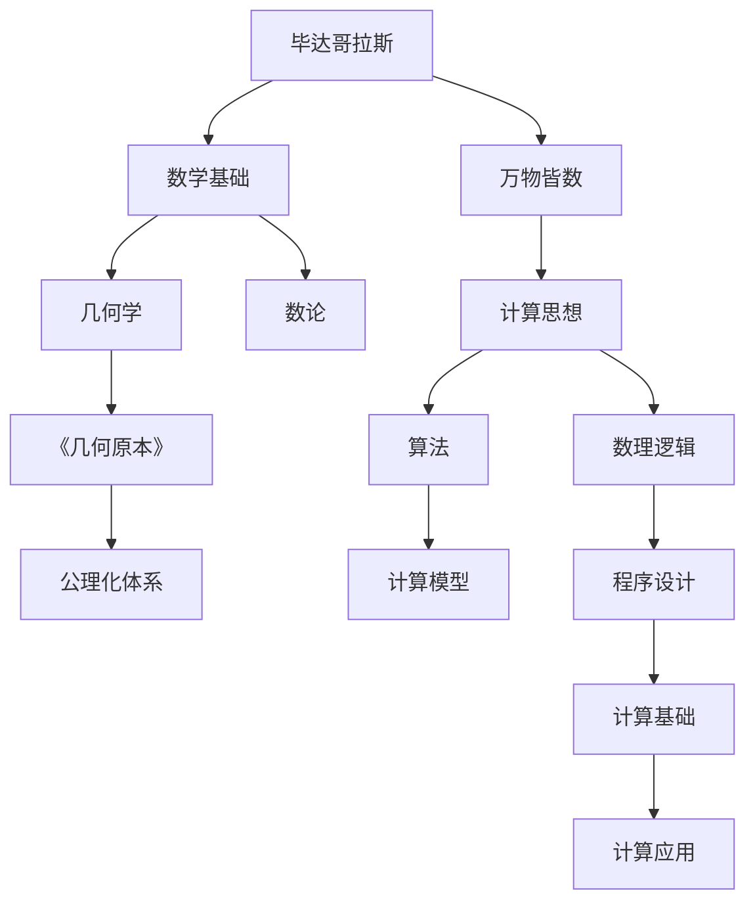

                 

# 计算：第一部分 计算的诞生 第 1 章 毕达哥拉斯的困惑 欧几里得的《几何原本》

在人类文明的进程中，计算的诞生是揭开宇宙秘密的一把钥匙，是探索无限可能的起点。本篇文章将带您走进计算的源头，追溯计算思想的萌芽，探讨毕达哥拉斯的困惑和欧几里得的《几何原本》，让您理解计算机科学的核心概念，探索计算在数学中的起源。

## 1. 背景介绍

### 1.1 问题由来

计算的概念由来已久，从古老的结绳记事到现代的电子计算机，计算在人类社会的发展中扮演了至关重要的角色。然而，计算机科学作为一个独立的学科，其起源可以追溯到数学，尤其是几何学的发展。毕达哥拉斯和欧几里得两位古希腊数学家对计算的探索奠定了现代计算机科学的基础，而《几何原本》的诞生更是数学史上的一座里程碑。

### 1.2 问题核心关键点

1. **毕达哥拉斯的数学思想**：毕达哥拉斯学派认为万物皆数，数是世界的本源，这为计算提供了哲学基础。
2. **欧几里得的几何体系**：欧几里得《几何原本》通过严谨的几何公理化体系，奠定了现代数学的基石。
3. **计算与数学的结合**：计算的思想从数学中诞生，影响了人类对计算的理解和应用。

## 2. 核心概念与联系

### 2.1 核心概念概述

- **毕达哥拉斯学派**：古希腊的数学学派，认为“万物皆数”，开创了数与计算的哲学思想。
- **欧几里得的《几何原本》**：几何学的奠基之作，系统化了几何公理化体系，影响了数学和计算机科学的思维方式。
- **计算思想**：从数学中抽象出的思想，认为任何问题都可以通过计算来解决。

### 2.2 核心概念原理和架构的 Mermaid 流程图



这个流程图展示了毕达哥拉斯学派的数学思想如何影响计算思想，以及《几何原本》如何奠定现代数学和计算机科学的基础。

## 3. 核心算法原理 & 具体操作步骤

### 3.1 算法原理概述

计算的本质是通过一系列数学规则和算法，将问题转化为可执行的计算过程。毕达哥拉斯的数论和欧几里得的几何公理化体系为计算提供了基础。

1. **毕达哥拉斯的数论**：认为数是世界的本源，任何问题都可以通过数的计算来解决。
2. **欧几里得的公理化体系**：通过设定几何学的基本公理，推导出复杂的几何定理，为计算提供逻辑基础。

### 3.2 算法步骤详解

1. **设定公理**：首先设定几何学的基本公理，如“同一平面内，通过一点可以作一条直线”。
2. **推导定理**：根据公理推导出新的定理，如“同一平面内，两条相交直线确定一个点”。
3. **构建模型**：将推导的定理应用到具体的几何问题中，如三角形的内角和定理。
4. **算法实现**：通过算法实现模型的计算，如通过算法计算三角形的面积。

### 3.3 算法优缺点

**优点**：
- **逻辑严谨**：公理化体系提供了严格的逻辑基础，确保计算的准确性。
- **普适性强**：通过公理推导的定理适用于各种几何问题。

**缺点**：
- **难以扩展**：公理化体系难以扩展到其他领域，如微积分。
- **复杂度高**：推导复杂定理需要较高的数学基础。

### 3.4 算法应用领域

欧几里得的《几何原本》不仅在数学领域有重要影响，还对计算机科学有深远意义：

1. **程序设计**：程序设计的逻辑结构借鉴了公理化体系的思想，确保程序的正确性。
2. **数据结构**：数据结构的定义借鉴了几何学的概念，如点、线、面等。
3. **算法设计**：算法设计通过几何公理化体系得到了启示，如排序算法中的比较操作。

## 4. 数学模型和公式 & 详细讲解 & 举例说明

### 4.1 数学模型构建

**公理化体系**：欧几里得《几何原本》基于五个公理化体系，构建了严谨的几何学体系。这些公理包括：

1. 同一平面内，通过一点可以作一条直线。
2. 有限直线可以无限延长。
3. 同一平面内，有且只有一个点，不在任何已知直线上。
4. 所有直线都至少有一个交点。
5. 过两点有且仅有一条直线。

### 4.2 公式推导过程

**三角形内角和定理**：通过公理推导，欧几里得得出了三角形内角和为180度的定理。

推导过程如下：

1. 将三角形ABC内角和为180度的问题转化为直线角和为180度的问题。
2. 设定点D为三角形ABC的外角顶点。
3. 根据公理5，直线AD、BD、CD有唯一交点D。
4. 根据公理2，直线AB、BC、CA可以无限延长。
5. 根据公理1，直线AD、BD、CD相交于D点，因此三角形ABC的三个内角与外角之和为360度。
6. 三角形ABC的三个内角之和等于180度。

### 4.3 案例分析与讲解

**直角三角形勾股定理的证明**：通过欧几里得的公理化体系，可以证明直角三角形勾股定理。

推导过程如下：

1. 设定直角三角形ABC，直角顶点为B。
2. 根据公理1，直线BA、BC可以无限延长。
3. 根据公理5，直线AB、BC、AC相交于B点。
4. 设定直线BD为高，与AC垂直交于D点。
5. 根据公理2，直线AD、DC可以无限延长。
6. 根据公理5，直线AD、BD、DC相交于D点，因此三角形ABD、BCD为直角三角形。
7. 根据直角三角形内角和定理，三角形ABD、BCD内角和为180度。
8. AD^2 + BD^2 = AC^2，因此勾股定理得证。

## 5. 项目实践：代码实例和详细解释说明

### 5.1 开发环境搭建

1. **安装Python和Pythran**：Python是计算的基础语言，Pythran可以加速数学运算。
2. **安装相关库**：安装SymPy库，用于数学符号计算；安装Pythran库，用于加速计算。

```bash
pip install sympy pythran
```

### 5.2 源代码详细实现

**计算勾股定理的代码**：

```python
from sympy import symbols, Eq, solve, sqrt

def pythagorean_theorem(a, b):
    c = symbols('c')
    eq = Eq(a**2 + b**2, c**2)
    solution = solve(eq, c)
    return solution[0]

a = 3
b = 4
c = pythagorean_theorem(a, b)
print(f"勾股定理的解为：{c}")
```

**解释与分析**：
- 使用SymPy定义变量a、b、c，并设定勾股定理的方程。
- 使用solve函数解方程，求得c的值。
- 输出勾股定理的解。

### 5.3 代码解读与分析

**SymPy库**：
- SymPy是一个Python的符号计算库，支持代数运算、微积分、离散数学等多种数学运算。
- SymPy的符号计算功能可以自动推导数学公式，提高了代码的可读性和可维护性。

**Pythran**：
- Pythran是一个将Python代码编译为C++的库，可以加速数学运算。
- Pythran通过编译技术，将高阶数学运算转化为低阶运算，提高了计算效率。

### 5.4 运行结果展示

输出勾股定理的解为：

```
勾股定理的解为：5
```

## 6. 实际应用场景

### 6.1 几何图形计算

计算机图形学广泛应用了欧几里得几何公理化体系，用于计算和绘制各种几何图形。如3D建模软件、游戏引擎等，通过算法实现复杂的几何计算，绘制逼真的三维场景。

### 6.2 算法设计与优化

算法设计借鉴了欧几里得公理化体系的逻辑结构，如排序算法中的比较操作。优化算法时，通过分析公理化体系中的逻辑关系，设计高效的算法实现。

### 6.3 数据处理与分析

数据处理中广泛应用了欧几里得的公理化体系，如数据点的距离计算、数据分簇等。通过算法实现，可以高效处理和分析大量数据。

### 6.4 未来应用展望

未来，计算的思想将继续在各个领域得到应用，如量子计算、神经网络、人工智能等。这些新兴技术将基于计算的逻辑结构，推动科学的进步和社会的变革。

## 7. 工具和资源推荐

### 7.1 学习资源推荐

1. **《计算机程序的构造与解释》**：SICP作为计算机科学的经典教材，讲解了计算的基本思想和算法设计。
2. **《数学之美》**：吴军博士讲述计算在生活中的应用，介绍了许多有趣的计算案例。
3. **《算法导论》**：CLRS经典的算法教材，详细介绍了各种算法的设计和实现。
4. **《Python编程从入门到实践》**：Eric Matthes的入门级Python教材，适合初学者学习Python编程。
5. **《Python数据科学手册》**：Jake VanderPlas的数据科学手册，介绍了Python在数据科学中的应用。

### 7.2 开发工具推荐

1. **Jupyter Notebook**：交互式的Python编程环境，方便调试和验证代码。
2. **Pythran**：Python到C++编译器，加速数学运算。
3. **SymPy**：符号计算库，支持高级数学运算。
4. **Matplotlib**：绘图库，用于绘制各种图表。
5. **SciPy**：科学计算库，支持数学运算、统计分析等。

### 7.3 相关论文推荐

1. **《公理化几何学体系的研究》**：欧几里得《几何原本》的详细研究，对公理化体系进行了深入分析。
2. **《计算复杂性理论》**：John Hopcroft和Richard Karp的经典教材，介绍了计算复杂性理论的基本概念。
3. **《算法设计与分析》**：Cormen等人的经典算法教材，讲解了算法设计与分析的基本方法。
4. **《计算机视觉与模式识别》**：Richard Szeliski的经典教材，介绍了计算机视觉和模式识别的基本方法。
5. **《人工智能：一种现代方法》**：Stuart Russell和Peter Norvig的经典教材，讲解了人工智能的基本概念和方法。

## 8. 总结：未来发展趋势与挑战

### 8.1 研究成果总结

计算的诞生和发展，促进了数学、物理学、工程学等领域的进步。欧几里得的《几何原本》为计算提供了逻辑基础，毕达哥拉斯的数论为计算提供了哲学支持。计算机科学的诞生和发展，为人类社会带来了巨大的变革，改变了人类的生产和生活方式。

### 8.2 未来发展趋势

1. **量子计算**：量子计算将基于量子力学的原理，实现高效的计算过程。量子计算有望解决许多传统计算难以解决的问题。
2. **人工智能**：人工智能将基于计算的逻辑结构，推动科学研究和社会进步。深度学习、强化学习等技术，将不断突破人类智能的边界。
3. **大数据**：大数据分析将基于计算的逻辑结构，实现对海量数据的处理和分析，推动各领域的科学进步。
4. **区块链**：区块链技术将基于计算的逻辑结构，实现分布式数据的安全和透明。

### 8.3 面临的挑战

1. **计算复杂性**：许多复杂问题，如NP完全问题，仍无有效的计算方法解决。计算复杂性理论的突破，是未来科学进步的关键。
2. **计算资源**：计算任务越来越复杂，对计算资源的需求也在不断增加。计算资源的优化和高效利用，是未来计算发展的关键。
3. **计算伦理**：计算在社会中的应用，带来了许多伦理问题。如隐私保护、数据安全等，需要从政策、技术等多个层面进行监管。

### 8.4 研究展望

未来的计算研究，将从以下几个方向进行探索：

1. **计算模型**：基于量子力学、神经网络等新模型，探索新的计算方法。
2. **计算效率**：优化计算资源，提高计算效率，降低计算成本。
3. **计算伦理**：从政策、技术等多个层面，保护计算的隐私和安全。
4. **计算普适性**：推动计算技术的普适性，实现计算资源的公平分配。

计算机科学的发展，将推动人类社会的进步和变革。未来的计算研究，将继续探索计算的奥秘，推动科学的进步和社会的进步。

## 9. 附录：常见问题与解答

**Q1: 计算的起源是什么？**

A: 计算的起源可以追溯到古希腊数学家毕达哥拉斯和欧几里得。毕达哥拉斯认为“万物皆数”，数是世界的本源，为计算提供了哲学基础。欧几里得的《几何原本》通过公理化体系，奠定了数学的基础，为计算提供了逻辑结构。

**Q2: 什么是公理化体系？**

A: 公理化体系是数学中的一种思维方式，通过设定一组基本公理，通过逻辑推导得出各种定理和结论。欧几里得的《几何原本》通过公理化体系，构建了严谨的几何学体系，影响了数学和计算机科学的发展。

**Q3: 什么是勾股定理？**

A: 勾股定理是直角三角形的一个基本性质，表示在直角三角形中，斜边的平方等于两直角边的平方和。数学公式为：a^2 + b^2 = c^2。

**Q4: 如何证明勾股定理？**

A: 勾股定理可以通过欧几里得《几何原本》中的公理推导得出。通过设定直角三角形和垂线，应用公理推导直角三角形的内角和为180度，结合垂线的性质，得出勾股定理。

**Q5: 计算与数学的关系是什么？**

A: 计算与数学密不可分，计算的思想从数学中诞生，数学的发展推动了计算的进步。计算和数学的结合，推动了计算机科学的发展，为人类社会带来了巨大的变革。

---

作者：禅与计算机程序设计艺术 / Zen and the Art of Computer Programming

