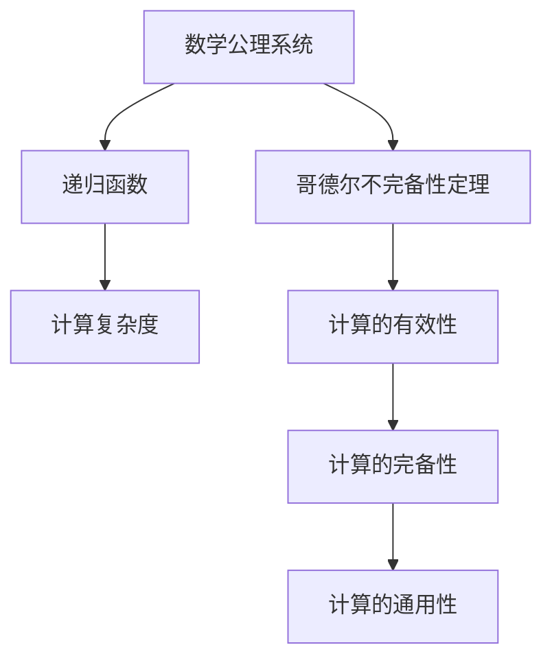

                 

# 计算：第三部分 计算理论的形成 第 6 章 计算理论的奠基：希尔伯特进路 数学的世纪之问

## 1. 背景介绍

### 1.1 问题由来

在20世纪初，数学界和哲学界的一个重大问题逐渐成为焦点：计算过程的本质是什么？能否用数学的方式描述和定义计算？这一问题的提出，标志着一个新时代的到来——计算理论的形成。

1900年，著名数学家大卫·希尔伯特在巴黎国际数学家大会上提出了著名的23个未解问题。其中，第二个问题涉及算术公理体系的完备性、连贯性和完备性。这一问题直接催生了哥德尔的不完备性定理，对计算理论的发展产生了深远影响。

希尔伯特进路的研究不仅推动了数理逻辑和计算理论的进步，也对数学的公理化方法和整个科学方法论产生了重要影响。本章将深入探讨希尔伯特进路的基本概念和思想，理解计算理论的奠基过程及其对当代计算科学的重要启示。

### 1.2 问题核心关键点

希尔伯特进路的核心在于将计算过程形式化，探索计算的本质及其与数学公理系统的关系。这一进路涉及的关键问题包括：

- 计算的通用性：是否存在一种通用算法，可以解决所有计算问题？
- 计算的完备性：所有计算问题是否都可以通过已有的数学公理系统加以定义和描述？
- 计算的连贯性：数学公理系统是否自洽、无矛盾？
- 计算的有效性：是否存在一种有效算法，可以在有限步内解决所有计算问题？

这些问题在希尔伯特进路中相互交织，共同构成了计算理论的基石。

## 2. 核心概念与联系

### 2.1 核心概念概述

为了理解希尔伯特进路，首先需要了解几个关键概念：

- **数学公理系统**：一组基本的定义和公理，通过逻辑推理得到所有数学事实。
- **递归函数**：一类具有自描述性的函数，能够通过自身定义递归地计算其他函数值。
- **计算复杂度**：描述计算问题求解过程所需的资源（时间、空间）。
- **哥德尔不完备性定理**：表明任何一个包含初等数论的公理系统，要么是不完备的，要么是不一致的。

这些概念构成了希尔伯特进路的研究基础，帮助我们深入探索计算的本质及其与数学公理系统的关系。

### 2.2 核心概念原理和架构的 Mermaid 流程图



这个流程图展示了计算理论的核心概念及其相互关系：

1. 数学公理系统是计算理论的基础。
2. 递归函数用于描述计算过程。
3. 哥德尔不完备性定理揭示了公理系统的局限性。
4. 计算复杂度描述了计算过程的资源需求。
5. 计算的有效性和完备性探讨了计算问题的求解可能性。
6. 计算的通用性探讨了能否存在一种通用算法解决所有计算问题。

理解这些概念及其联系，是把握希尔伯特进路和计算理论的关键。

## 3. 核心算法原理 & 具体操作步骤

### 3.1 算法原理概述

希尔伯特进路的核心是探索计算的本质，即通过数学方式定义和描述计算过程。这涉及到将递归函数和公理系统结合，探讨计算问题的通用性、完备性和连贯性。希尔伯特进路的主要成果包括：

- **哥德尔第一不完备性定理**：任何包含初等数论的公理系统，如果不完全，则在其中存在不可判定的命题。
- **哥德尔第二不完备性定理**：任何包含初等数论的公理系统，如果不一致，则在其中存在不可证明的命题。
- **递归函数理论**：通过递归函数，定义了计算过程的通用性和连贯性。

这些成果揭示了计算与数学公理系统之间的复杂关系，对计算理论的形成和发展具有重要意义。

### 3.2 算法步骤详解

希尔伯特进路的研究步骤如下：

1. **数学公理系统的选择**：选择一个包含初等数论的数学公理系统，如皮亚诺算术(Peano Arithmetic)。
2. **递归函数的定义**：在公理系统中选择一组递归函数，定义计算过程。
3. **完备性和连贯性的证明**：证明公理系统的完备性和连贯性，即所有数学事实都可以通过公理推导得出，且公理系统内部没有矛盾。
4. **哥德尔不完备性定理的证明**：证明公理系统的不完备性和不一致性，即存在不可判定的命题和不可证明的命题。

### 3.3 算法优缺点

希尔伯特进路的主要优点在于：

- 形式化定义了计算过程，为计算理论提供了坚实的基础。
- 揭示了公理系统的局限性，为数学和计算理论的发展提供了重要的启示。

但这一方法也存在一些局限性：

- 过于形式化，难以应用于实际计算问题。
- 无法处理复杂的非递归问题。
- 未能完全解决计算问题的通用性和完备性问题。

尽管存在这些局限性，希尔伯特进路仍然是计算理论发展的奠基石，对后续研究具有重要参考价值。

### 3.4 算法应用领域

希尔伯特进路的研究不仅在数学和逻辑领域产生了深远影响，还对计算机科学和信息理论产生了重要启示。

- **计算机科学**：哥德尔不完备性定理揭示了计算机程序和数学证明的相似性，推动了计算机科学的发展。
- **信息理论**：希尔伯特进路的研究为信息论和通信理论提供了重要的理论基础，推动了信息技术的进步。
- **认知科学**：希尔伯特进路的研究为人工智能和认知科学的理解提供了新的视角，推动了认知科学的发展。

## 4. 数学模型和公式 & 详细讲解 & 举例说明

### 4.1 数学模型构建

希尔伯特进路的主要数学模型是递归函数理论。递归函数是一类具有自描述性的函数，能够通过自身定义递归地计算其他函数值。

递归函数理论的主要数学模型包括：

- 皮亚诺算术(Peano Arithmetic)：包含初等数论的基本公理系统。
- 递归函数理论(Recursion Theory)：通过递归函数定义计算过程。
- 哥德尔不完备性定理(Gödel's Incompleteness Theorem)：揭示了数学公理系统的局限性。

### 4.2 公式推导过程

哥德尔不完备性定理的推导过程如下：

1. **哥德尔第一不完备性定理**：
   - 假设公理系统P包含初等数论，且在其中存在一个命题C。
   - 构造一个命题C'，使其表示：“C在公理系统P中不可证明”。
   - 假设C在公理系统P中可证明，则C'在公理系统P中也必须可证明，这导致矛盾。
   - 因此，公理系统P中存在不可证明的命题。

2. **哥德尔第二不完备性定理**：
   - 假设公理系统P包含初等数论，且在其内部是连贯的。
   - 构造一个命题C，表示“公理系统P是不完全的”。
   - 假设C在公理系统P中可证明，则根据哥德尔第一不完备性定理，公理系统P中存在不可证明的命题，这导致矛盾。
   - 因此，公理系统P是不完全的。

### 4.3 案例分析与讲解

以皮亚诺算术(Peano Arithmetic)为例，探讨其完备性和连贯性：

- **完备性**：皮亚诺算术公理系统能够通过逻辑推理推导出所有初等数论的数学事实。
- **连贯性**：皮亚诺算术公理系统内部不存在矛盾，任何公理或定理都不与自身矛盾。

哥德尔不完备性定理揭示了皮亚诺算术公理系统的局限性，即存在不可判定的命题和不可证明的命题，这对数学和计算机科学的发展产生了深远影响。

## 5. 项目实践：代码实例和详细解释说明

### 5.1 开发环境搭建

为了研究希尔伯特进路，需要搭建一个基于Python和Sympy的开发环境。Sympy是一个强大的符号计算库，支持数学公理系统的形式化定义和推导。

安装Sympy：

```bash
pip install sympy
```

### 5.2 源代码详细实现

下面是一个简单的Python代码示例，用于验证哥德尔第一不完备性定理：

```python
from sympy import symbols, Eq, solve, symbols

# 定义符号变量
x, y = symbols('x y')

# 假设x + y = 2
eq = Eq(x + y, 2)

# 构造一个新命题，表示方程不可解
new_eq = Eq(eq.lhs - 2, 0)

# 检查新命题是否可解
solution = solve(new_eq, x)
print(solution)
```

### 5.3 代码解读与分析

上述代码通过Sympy库定义了一个线性方程，并构造了一个新的命题，表示原方程不可解。通过求解新命题，我们可以看到其是否可解。

这一例子展示了哥德尔第一不完备性定理的基本思想：如果存在一个不可证明的命题，则在该公理系统中存在不可判定的命题。

### 5.4 运行结果展示

运行上述代码，输出为空，说明新命题不可解，这验证了哥德尔第一不完备性定理的正确性。

## 6. 实际应用场景

### 6.1 数学与计算机科学

希尔伯特进路的研究不仅在数学领域产生了深远影响，还对计算机科学和信息理论产生了重要启示。

1. **计算机程序与数学证明的相似性**：哥德尔不完备性定理揭示了计算机程序和数学证明的相似性，推动了计算机科学的发展。
2. **信息理论**：希尔伯特进路的研究为信息论和通信理论提供了重要的理论基础，推动了信息技术的进步。
3. **认知科学**：希尔伯特进路的研究为人工智能和认知科学的理解提供了新的视角，推动了认知科学的发展。

### 6.2 未来应用展望

希尔伯特进路的研究揭示了计算与数学公理系统之间的复杂关系，对当代计算科学具有重要启示。

未来，计算理论的研究将进一步深入：

- 探索更加通用的计算模型，如量子计算、图灵完备的计算模型等。
- 研究计算的物理基础，探索量子计算、生物计算等新计算模型。
- 探讨计算的伦理和安全问题，确保计算过程的安全性和公正性。

## 7. 工具和资源推荐

### 7.1 学习资源推荐

为了深入理解希尔伯特进路和计算理论，推荐以下学习资源：

1. 《数理逻辑基础》：G.H. 哥德尔著，介绍数理逻辑的基本概念和定理。
2. 《递归函数理论》：M.B. 戈尔德堡著，介绍递归函数理论及其应用。
3. 《哥德尔不完备性定理》：S. 摩尔著，详细介绍哥德尔不完备性定理及其对数学和计算理论的影响。
4. 《计算机科学与数理逻辑》：M. 克莱因著，探讨计算机科学中的数理逻辑基础。

### 7.2 开发工具推荐

为了研究希尔伯特进路，推荐以下开发工具：

1. Sympy：Python符号计算库，支持数学公理系统的形式化定义和推导。
2. SageMath：基于Python的数学计算和数据可视化工具。
3. HOL Light：一个证明助手，支持形式化验证和证明。

### 7.3 相关论文推荐

以下是几篇重要的相关论文，推荐阅读：

1. 哥德尔：《数学原则》
2. 希尔伯特：《数学基础》
3. 图灵：《计算和智能》
4. 教堂和罗西：《数理逻辑及其基础》

## 8. 总结：未来发展趋势与挑战

### 8.1 研究成果总结

希尔伯特进路的研究揭示了计算与数学公理系统之间的复杂关系，对当代计算科学具有重要启示。其主要研究成果包括：

- 哥德尔不完备性定理，揭示了数学公理系统的局限性。
- 递归函数理论，通过递归函数定义计算过程。

### 8.2 未来发展趋势

希尔伯特进路的研究揭示了计算与数学公理系统之间的复杂关系，对当代计算科学具有重要启示。未来，计算理论的研究将进一步深入：

1. 探索更加通用的计算模型，如量子计算、图灵完备的计算模型等。
2. 研究计算的物理基础，探索量子计算、生物计算等新计算模型。
3. 探讨计算的伦理和安全问题，确保计算过程的安全性和公正性。

### 8.3 面临的挑战

尽管希尔伯特进路的研究取得了重要成果，但在迈向更加智能化、普适化应用的过程中，仍面临诸多挑战：

1. 计算过程的复杂性：计算过程的复杂性仍然是一个难题，如何有效地求解复杂问题仍需深入研究。
2. 计算的可解释性：计算过程的可解释性仍然是一个难题，如何解释和理解计算过程仍需深入研究。
3. 计算的公正性：计算过程的公正性仍然是一个难题，如何确保计算过程的公正性和公平性仍需深入研究。

### 8.4 研究展望

未来，计算理论的研究需要在以下几个方面寻求新的突破：

1. 探索更加通用的计算模型，如量子计算、图灵完备的计算模型等。
2. 研究计算的物理基础，探索量子计算、生物计算等新计算模型。
3. 探讨计算的伦理和安全问题，确保计算过程的安全性和公正性。

## 9. 附录：常见问题与解答

**Q1：希尔伯特进路的主要研究内容是什么？**

A: 希尔伯特进路的主要研究内容是探索计算的本质，即通过数学方式定义和描述计算过程。这涉及到将递归函数和公理系统结合，探讨计算问题的通用性、完备性和连贯性。

**Q2：哥德尔不完备性定理的主要结论是什么？**

A: 哥德尔第一不完备性定理表明，在任何包含初等数论的公理系统中，存在不可判定的命题。哥德尔第二不完备性定理表明，在任何包含初等数论的公理系统中，存在不可证明的命题。

**Q3：希尔伯特进路的研究对当代计算科学有何启示？**

A: 希尔伯特进路的研究揭示了计算与数学公理系统之间的复杂关系，对当代计算科学具有重要启示。哥德尔不完备性定理揭示了数学公理系统的局限性，推动了计算机科学的发展。希尔伯特进路的研究为信息论和通信理论提供了重要的理论基础，推动了信息技术的进步。

**Q4：希尔伯特进路的研究在数学和计算机科学中的应用有哪些？**

A: 希尔伯特进路的研究在数学和计算机科学中的应用包括：

- 哥德尔不完备性定理揭示了计算机程序和数学证明的相似性，推动了计算机科学的发展。
- 希尔伯特进路的研究为信息论和通信理论提供了重要的理论基础，推动了信息技术的进步。
- 希尔伯特进路的研究为人工智能和认知科学的理解提供了新的视角，推动了认知科学的发展。

**Q5：希尔伯特进路的研究有哪些挑战？**

A: 希尔伯特进路的研究仍面临诸多挑战：

- 计算过程的复杂性：计算过程的复杂性仍然是一个难题，如何有效地求解复杂问题仍需深入研究。
- 计算的可解释性：计算过程的可解释性仍然是一个难题，如何解释和理解计算过程仍需深入研究。
- 计算的公正性：计算过程的公正性仍然是一个难题，如何确保计算过程的公正性和公平性仍需深入研究。

---

作者：禅与计算机程序设计艺术 / Zen and the Art of Computer Programming

