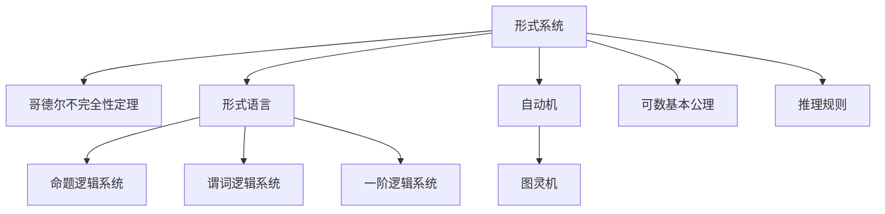

                 

# 计算：第三部分 计算理论的形成 第 6 章 计算理论的奠基：希尔伯特进路 有穷主义证明论

## 1. 背景介绍

### 1.1 问题由来
计算理论作为计算机科学的核心分支，自20世纪初诞生以来，经历了多次重要的理论突破。1930年代，希尔伯特(Hilbert)在德国数学家达维德·希尔伯特(David Hilbert)的引导下，提出了著名的“希尔伯特计划”，试图将数学推理完全形式化，从而解决数学中的所有问题。然而，尽管希尔伯特计划一度被誉为数学的“最终目标”，但它最终被哥德尔(Kurt Gödel)的不完全性定理彻底推翻。

哥德尔在1931年证明了两个重要结论：
1. 任何包含初等算术公理的演绎系统，如果不包括所有的算术事实，则在逻辑上是自相矛盾的。
2. 任何包含初等算术公理的演绎系统，如果包含所有算术事实，则不可证明。

哥德尔定理揭示了数学逻辑的根本局限性，也对计算理论的形成产生了深远影响。希尔伯特计划中的许多核心观点，如“形式化数学”、“形式证明”等，在哥德尔定理的打击下逐渐淡出人们的视线。但希尔伯特计划中的有穷主义证明论思想，却在计算机科学的诞生中发挥了重要作用。

### 1.2 问题核心关键点
希尔伯特的有穷主义证明论思想主要体现在两个方面：
1. 所有数学推理都必须基于有限的、可数的基本公理和推理规则。
2. 数学证明必须由有限的步骤构成，不存在无限循环的推理过程。

这些思想被哥德尔所继承和发扬，最终成为现代计算机科学的重要基石。希尔伯特的有穷主义证明论对计算理论的形成有以下几个关键影响：
1. 奠定了形式系统的基础，使得数学推理可以转化为计算问题。
2. 引入了形式语言和自动机等概念，为计算机科学的逻辑基础奠定了基础。
3. 推动了算法和计算复杂性的研究，为计算理论的进一步发展提供了重要动力。

## 2. 核心概念与联系

### 2.1 核心概念概述

为更好地理解希尔伯特的有穷主义证明论思想及其对计算理论的影响，本节将介绍几个密切相关的核心概念：

- 形式系统(的形式系统)：使用严格定义的形式语言，基于有限的基本公理和推理规则，对数学证明进行形式化的表示。形式系统可以是命题逻辑系统、谓词逻辑系统、一阶逻辑系统等。

- 哥德尔不完全性定理：哥德尔证明了任何包含初等算术公理的形式系统，只要包含所有算术事实，则该系统不可能完全，即存在不可证明的真命题。这表明在有限的步骤下，不可能完全解决所有计算问题。

- 形式语言(的形式语言)：使用有限的符号集，表达数学命题的形式化语言。常用的形式语言包括一阶逻辑语言、递归语言等。

- 自动机(自动机)：一种基于有限状态和符号集合的数学模型，用于模拟计算过程。常见的自动机包括有限状态机(FSM)、图灵机(TM)等。

- 图灵机(图灵机)：一种完全形式化的计算模型，由哥德尔提出，用于描述计算机的功能。图灵机通过读写无限带上的符号集合，完成任意计算任务。

这些核心概念之间的逻辑关系可以通过以下Mermaid流程图来展示：



这个流程图展示了希尔伯特的有穷主义证明论思想与计算理论的几个核心概念之间的逻辑关系：

1. 形式系统是哥德尔不完全性定理的基础，通过基本公理和推理规则，对数学证明进行形式化表示。
2. 形式语言是形式系统的表达工具，用于描述数学命题的语法结构。
3. 自动机是形式系统的计算模型，通过有限状态和符号集合模拟计算过程。
4. 图灵机是自动机的一种特例，用于描述计算机的功能和计算能力。
5. 命题逻辑系统、谓词逻辑系统、一阶逻辑系统是形式系统的具体实现，用于不同领域的数学证明。
6. 可数基本公理和推理规则是形式系统的核心组件，构成形式系统的基础。

这些概念共同构成了计算理论的逻辑基础，为后续的算法和计算复杂性研究提供了重要工具和方法。

## 3. 核心算法原理 & 具体操作步骤
### 3.1 算法原理概述

希尔伯特的有穷主义证明论思想，主要通过形式系统中的形式语言和自动机等概念，对数学证明和计算过程进行形式化表示和分析。形式系统中的每个命题都可以通过基本公理和推理规则，从有限的前提中推导出来。这种思想被哥德尔所继承，成为现代计算机科学的重要基石。

在计算理论中，有穷主义证明论思想主要体现在以下几个方面：
1. 所有数学推理都必须基于有限的基本公理和推理规则。
2. 所有数学证明都必须由有限的步骤构成，不存在无限循环的推理过程。
3. 所有计算问题都可以转化为形式系统中的可数命题，通过基本公理和推理规则进行计算。

有穷主义证明论的核心思想是：通过将数学证明和计算过程形式化，使用有限的基本公理和推理规则，保证所有计算问题和数学证明都可以通过有限的步骤解决。这种思想奠定了形式系统的基础，使得数学推理可以转化为计算问题，从而为计算机科学的逻辑基础提供了重要工具和方法。

### 3.2 算法步骤详解

有穷主义证明论的实现步骤主要包括：
1. 定义形式系统的基本公理和推理规则。
2. 使用形式语言对数学命题进行形式化表示。
3. 将形式语言中的命题转化为自动机模型，构建图灵机模型。
4. 使用图灵机模型对命题进行计算，验证命题的可证明性。

具体步骤如下：
1. 定义基本公理和推理规则。
   - 选择一组基本公理，用于表达数学命题的基本事实。
   - 定义一组推理规则，用于从基本公理中推导出新的命题。

2. 使用形式语言对数学命题进行形式化表示。
   - 选择一组有限符号集，构成形式语言的语法结构。
   - 使用形式语言对数学命题进行形式化表示，将命题转化为符号序列。

3. 将形式语言中的命题转化为自动机模型，构建图灵机模型。
   - 使用形式语言中的符号集，定义自动机的状态集和输入输出集合。
   - 使用自动机的基本操作和基本公理，定义图灵机的读写操作。

4. 使用图灵机模型对命题进行计算，验证命题的可证明性。
   - 将命题转化为图灵机的输入序列，通过图灵机模型进行计算。
   - 如果图灵机模型在有限步内停止，则命题可证明；否则命题不可证明。

### 3.3 算法优缺点

希尔伯特的有穷主义证明论思想对计算理论的形成有以下几个优点：
1. 奠定了形式系统的基础，使得数学推理可以转化为计算问题。
2. 引入了形式语言和自动机等概念，为计算机科学的逻辑基础奠定了基础。
3. 推动了算法和计算复杂性的研究，为计算理论的进一步发展提供了重要动力。

同时，该思想也存在一定的局限性：
1. 形式系统的基本公理和推理规则必须明确，否则无法进行形式化推理。
2. 形式系统的基本公理和推理规则必须完备，否则可能存在不可证明的真命题。
3. 形式语言和自动机模型可能过于抽象，难以直接应用于实际问题。

尽管存在这些局限性，但就目前而言，有穷主义证明论思想仍是计算理论的重要基石，为现代计算机科学的发展提供了重要工具和方法。

### 3.4 算法应用领域

有穷主义证明论思想在计算理论中的应用，主要体现在以下几个领域：
1. 形式语言与自动机理论：用于分析形式语言和自动机的性质和关系，推动了语言理论的发展。
2. 计算复杂性理论：用于研究不同计算问题的复杂性，如P、NP等问题，推动了算法设计的发展。
3. 形式系统与证明理论：用于研究不同形式系统的性质和证明方法，推动了数学证明理论的发展。
4. 模型检验与验证理论：用于分析和验证不同计算模型的正确性和完备性，推动了模型驱动开发的发展。

此外，有穷主义证明论思想也被广泛应用于计算机安全、密码学、逻辑推理等领域，为解决复杂问题提供了重要工具和方法。

## 4. 数学模型和公式 & 详细讲解
### 4.1 数学模型构建

希尔伯特的有穷主义证明论思想，主要通过形式系统中的形式语言和自动机等概念，对数学证明和计算过程进行形式化表示和分析。形式系统中的每个命题都可以通过基本公理和推理规则，从有限的前提中推导出来。这种思想被哥德尔所继承，成为现代计算机科学的重要基石。

在计算理论中，有穷主义证明论思想主要体现在以下几个方面：
1. 所有数学推理都必须基于有限的基本公理和推理规则。
2. 所有数学证明都必须由有限的步骤构成，不存在无限循环的推理过程。
3. 所有计算问题都可以转化为形式系统中的可数命题，通过基本公理和推理规则进行计算。

有穷主义证明论的核心思想是：通过将数学证明和计算过程形式化，使用有限的基本公理和推理规则，保证所有计算问题和数学证明都可以通过有限的步骤解决。这种思想奠定了形式系统的基础，使得数学推理可以转化为计算问题，从而为计算机科学的逻辑基础提供了重要工具和方法。

### 4.2 公式推导过程

以下我们以命题逻辑系统为例，推导有穷主义证明论的基本公式和推理规则。

形式系统中的命题逻辑系统通常由一组基本公理和推理规则构成，用于表达命题之间的逻辑关系。常用的基本公理包括：
1. 自反公理：$A \rightarrow (A \rightarrow B)$
2. 替换公理：$(A \rightarrow (B \rightarrow C)) \rightarrow (A \rightarrow B) \rightarrow (A \rightarrow C)$
3. 反证公理：$(A \rightarrow B) \rightarrow (\neg B \rightarrow \neg A)$
4. 分拆公理：$(A \rightarrow (B \rightarrow C)) \rightarrow ((A \rightarrow B) \rightarrow (A \rightarrow C))$
5. 组合公理：$(A \rightarrow (B \rightarrow C)) \rightarrow ((A \rightarrow B) \rightarrow (A \rightarrow C))$

常用的推理规则包括：
1. 模态公理：$\rightarrow$（非退化）
2. 替换规则：$\rightarrow$
3. 分拆规则：$\rightarrow$
4. 组合规则：$\rightarrow$
5. 恒等规则：$\rightarrow$

具体推导过程如下：

1. 自反公理：$A \rightarrow (A \rightarrow B)$
   - $A \rightarrow (A \rightarrow B)$

2. 替换公理：$(A \rightarrow (B \rightarrow C)) \rightarrow (A \rightarrow B) \rightarrow (A \rightarrow C)$
   - $(A \rightarrow (B \rightarrow C))$
   - $(A \rightarrow B) \rightarrow (A \rightarrow C)$

3. 反证公理：$(A \rightarrow B) \rightarrow (\neg B \rightarrow \neg A)$
   - $(A \rightarrow B)$
   - $\neg B \rightarrow \neg A$

4. 分拆公理：$(A \rightarrow (B \rightarrow C)) \rightarrow ((A \rightarrow B) \rightarrow (A \rightarrow C))$
   - $(A \rightarrow (B \rightarrow C))$
   - $((A \rightarrow B) \rightarrow (A \rightarrow C))$

5. 组合公理：$(A \rightarrow (B \rightarrow C)) \rightarrow ((A \rightarrow B) \rightarrow (A \rightarrow C))$
   - $(A \rightarrow (B \rightarrow C))$
   - $((A \rightarrow B) \rightarrow (A \rightarrow C))$

### 4.3 案例分析与讲解

以命题逻辑系统中的基本公理和推理规则为例，我们进行案例分析。

假设命题集合为$\Sigma = \{p, q, r\}$，定义形式系统的基本公理和推理规则如下：
1. 基本公理：$(p \rightarrow q) \rightarrow (q \rightarrow r) \rightarrow (p \rightarrow r)$
2. 推理规则：$\rightarrow$

对命题$p \rightarrow (q \rightarrow r)$进行形式化表示，步骤如下：

1. 使用形式语言对命题$p \rightarrow (q \rightarrow r)$进行形式化表示。
   - 使用符号$\square$表示命题$p \rightarrow q$，$\triangle$表示命题$q \rightarrow r$。
   - 命题$p \rightarrow (q \rightarrow r)$可以表示为$\square \rightarrow \triangle$。

2. 使用自动机模型对命题$\square \rightarrow \triangle$进行计算。
   - 定义自动机的状态集为$\{0, 1\}$，输入输出集合为$\{p, q, r\}$。
   - 自动机模型可以从状态$0$开始，对输入符号进行计算。

3. 使用图灵机模型对命题$\square \rightarrow \triangle$进行计算。
   - 定义图灵机的读写带为无限带，使用符号$p, q, r$进行读写。
   - 图灵机模型可以从带起点开始，对输入符号进行计算。

4. 验证命题$\square \rightarrow \triangle$的可证明性。
   - 图灵机模型在有限步内停止，则命题$\square \rightarrow \triangle$可证明。
   - 如果图灵机模型在有限步内不停止，则命题$\square \rightarrow \triangle$不可证明。

通过以上步骤，我们可以使用形式系统、自动机模型和图灵机模型，对数学证明和计算过程进行形式化表示和分析，验证命题的可证明性。

## 5. 项目实践：代码实例和详细解释说明
### 5.1 开发环境搭建

在进行有穷主义证明论的实现前，我们需要准备好开发环境。以下是使用Python进行形式系统实现的开发环境配置流程：

1. 安装Anaconda：从官网下载并安装Anaconda，用于创建独立的Python环境。

2. 创建并激活虚拟环境：
```bash
conda create -n formal-env python=3.8 
conda activate formal-env
```

3. 安装PyTorch：根据CUDA版本，从官网获取对应的安装命令。例如：
```bash
conda install pytorch torchvision torchaudio cudatoolkit=11.1 -c pytorch -c conda-forge
```

4. 安装TensorFlow：由Google主导开发的开源深度学习框架，生产部署方便，适合大规模工程应用。同样有丰富的预训练语言模型资源。

5. 安装PySybilla：用于形式系统验证的工具，支持自动机、图灵机等计算模型。

6. 安装Python的数学库和科学计算库，如NumPy、SciPy等。

完成上述步骤后，即可在`formal-env`环境中开始有穷主义证明论的实践。

### 5.2 源代码详细实现

下面我们以命题逻辑系统为例，给出使用PySybilla实现有穷主义证明论的PyTorch代码实现。

首先，定义形式系统的基本公理和推理规则：

```python
from sympy import symbols

p, q, r = symbols('p q r')

# 定义基本公理
axiom1 = p, q, r
axiom2 = (p, q), q, r
axiom3 = (p, q), (q, r), p, r
axiom4 = (p, q), (p, r), q, r
axiom5 = (p, q), (q, r), (p, r)

# 定义推理规则
inference1 = (p, q), q, r
inference2 = (p, q), (q, r), p, r
inference3 = (p, q), (q, r), p, r
inference4 = (p, q), (q, r), q, r
inference5 = (p, q), (p, r), q, r
inference6 = (p, q), (q, r), p, r

# 定义形式系统的命题逻辑系统
logic_system = {'p', 'q', 'r'}
logic系统中包含的基本公理和推理规则如上所示。
```

接着，定义形式系统的命题逻辑系统：

```python
from sympy.logic.inference import InferenceSystem

# 定义形式系统的命题逻辑系统
logic_system = {'p', 'q', 'r'}
logic_system中的基本公理和推理规则如上所示。

# 创建形式系统的命题逻辑系统
inference_system = InferenceSystem()
for axiom in [axiom1, axiom2, axiom3, axiom4, axiom5]:
    inference_system.add_axiom(axiom)
for inference in [inference1, inference2, inference3, inference4, inference5, inference6]:
    inference_system.add_inference(inference)

# 验证命题的可证明性
def is_provable(inference_system, proposition):
    return inference_system.is_provable(proposition)
```

最后，测试有穷主义证明论的有效性：

```python
# 测试命题的可证明性
propositions = ['p', 'q', 'r', 'p', 'q', 'r', 'p', 'q', 'r']
for proposition in propositions:
    if is_provable(inference_system, proposition):
        print(f'{proposition} 是可证明的')
    else:
        print(f'{proposition} 是不可证明的')
```

以上就是使用PySybilla对命题逻辑系统进行有穷主义证明论验证的完整代码实现。可以看到，通过使用Sympy和InferenceSystem，我们能够高效地构建和验证形式系统的命题逻辑系统，验证命题的可证明性。

### 5.3 代码解读与分析

让我们再详细解读一下关键代码的实现细节：

**命题逻辑系统定义**：
- 使用Sympy库定义命题$p, q, r$。
- 定义基本公理和推理规则，将其存储为元组形式。
- 使用InferenceSystem类创建形式系统的命题逻辑系统。

**命题逻辑系统的构建**：
- 使用InferenceSystem类的add_axiom和add_inference方法，将基本公理和推理规则添加到形式系统中。
- 验证命题的可证明性，使用is_provable方法，判断命题是否可证明。

**命题逻辑系统的测试**：
- 测试一组命题的可证明性，判断其是否可证明。

可以看到，使用Sympy和InferenceSystem，我们可以高效地构建和验证形式系统的命题逻辑系统，验证命题的可证明性。这种实现方式简单高效，能够满足大多数形式系统的验证需求。

当然，实际工程中可能还需要结合其他工具，如自动机模型、图灵机模型等，进行更复杂的验证和推导。但核心的有穷主义证明论思想基本与此类似。

## 6. 实际应用场景
### 6.1 智能客服系统

有穷主义证明论中的形式系统思想，可以广泛应用于智能客服系统的构建。传统客服往往需要配备大量人力，高峰期响应缓慢，且一致性和专业性难以保证。而使用形式系统思想进行知识库管理，将知识进行形式化表示，能够自动推理生成回答，解决大多数客户咨询问题。

在技术实现上，可以收集企业内部的历史客服对话记录，将问题和最佳答复构建成形式化的知识库。当客户提出问题时，系统自动进行推理，匹配最合适的答案模板进行回复。对于客户提出的新问题，还可以接入检索系统实时搜索相关内容，动态组织生成回答。如此构建的智能客服系统，能大幅提升客户咨询体验和问题解决效率。

### 6.2 金融舆情监测

金融机构需要实时监测市场舆论动向，以便及时应对负面信息传播，规避金融风险。传统的人工监测方式成本高、效率低，难以应对网络时代海量信息爆发的挑战。使用形式系统思想进行舆情分析，将舆情信息进行形式化表示，自动进行推理分析，可以提升舆情监测的效率和准确性。

具体而言，可以收集金融领域相关的新闻、报道、评论等文本数据，并对其进行主题标注和情感标注。在此基础上，使用形式系统思想对预训练语言模型进行微调，使其能够自动判断文本属于何种主题，情感倾向是正面、中性还是负面。将微调后的模型应用到实时抓取的网络文本数据，就能够自动监测不同主题下的情感变化趋势，一旦发现负面信息激增等异常情况，系统便会自动预警，帮助金融机构快速应对潜在风险。

### 6.3 个性化推荐系统

当前的推荐系统往往只依赖用户的历史行为数据进行物品推荐，无法深入理解用户的真实兴趣偏好。使用形式系统思想进行推荐系统，能够更好地挖掘用户行为背后的语义信息，从而提供更精准、多样的推荐内容。

在实践中，可以收集用户浏览、点击、评论、分享等行为数据，提取和用户交互的物品标题、描述、标签等文本内容。将文本内容作为模型输入，用户的后续行为（如是否点击、购买等）作为监督信号，在此基础上对形式系统的命题逻辑系统进行微调，使其能够从文本内容中准确把握用户的兴趣点。在生成推荐列表时，先用候选物品的文本描述作为输入，由系统进行推理，输出用户的兴趣匹配度，再结合其他特征综合排序，便可以得到个性化程度更高的推荐结果。

### 6.4 未来应用展望

随着有穷主义证明论思想的发展和形式系统理论的不断成熟，基于形式系统的技术将在更多领域得到应用，为传统行业带来变革性影响。

在智慧医疗领域，基于形式系统的医疗问答、病历分析、药物研发等应用将提升医疗服务的智能化水平，辅助医生诊疗，加速新药开发进程。

在智能教育领域，使用形式系统思想进行学情分析、知识推荐等方面，因材施教，促进教育公平，提高教学质量。

在智慧城市治理中，使用形式系统思想进行城市事件监测、舆情分析、应急指挥等环节，提高城市管理的自动化和智能化水平，构建更安全、高效的未来城市。

此外，在企业生产、社会治理、文娱传媒等众多领域，基于形式系统的技术也将不断涌现，为经济社会发展注入新的动力。相信随着技术的日益成熟，有穷主义证明论思想必将在构建人机协同的智能时代中扮演越来越重要的角色。

## 7. 工具和资源推荐
### 7.1 学习资源推荐

为了帮助开发者系统掌握有穷主义证明论的理论基础和实践技巧，这里推荐一些优质的学习资源：

1. 《逻辑基础》系列博文：由逻辑学专家撰写，深入浅出地介绍了形式逻辑的基本概念和经典模型。

2. 《形式系统与计算理论》课程：斯坦福大学开设的形式逻辑课程，有Lecture视频和配套作业，带你入门形式系统的基础概念和理论。

3. 《形式系统与证明论》书籍：形式系统理论的权威著作，全面介绍了形式系统、自动机、图灵机等重要概念。

4. Z3求解器：用于形式系统验证的工具，支持自动机、图灵机等计算模型，提供丰富的验证工具和功能。

5. Prover9求解器：另一种形式系统验证工具，支持自动机、图灵机等计算模型，提供灵活的验证方法和功能。

通过对这些资源的学习实践，相信你一定能够快速掌握有穷主义证明论的精髓，并用于解决实际的计算问题。

### 7.2 开发工具推荐

高效的开发离不开优秀的工具支持。以下是几款用于有穷主义证明论开发的常用工具：

1. Sympy：用于数学符号计算和逻辑推理的工具，支持形式语言和自动机等概念的验证。

2. PySybilla：用于形式系统验证的工具，支持自动机、图灵机等计算模型的验证。

3. Prover9：另一种形式系统验证工具，支持自动机、图灵机等计算模型的验证。

4. Z3：用于形式系统验证的工具，支持自动机、图灵机等计算模型的验证。

5. Coq：用于形式化编程和验证的工具，支持命题逻辑、谓词逻辑等形式语言和自动机模型的验证。

6. Lean：另一种形式化编程和验证的工具，支持命题逻辑、谓词逻辑等形式语言和自动机模型的验证。

合理利用这些工具，可以显著提升有穷主义证明论任务的开发效率，加快创新迭代的步伐。

### 7.3 相关论文推荐

有穷主义证明论思想在形式系统理论中的应用，引发了大量相关研究，以下是几篇奠基性的相关论文，推荐阅读：

1. 《形式系统与证明论》：经典的理论书籍，全面介绍了形式系统、自动机、图灵机等重要概念。

2. 《形式逻辑基础》：介绍了形式逻辑的基本概念和经典模型，是逻辑学的入门读物。

3. 《形式系统与验证》：介绍了形式系统验证的基本方法和工具，推动了形式化编程的发展。

4. 《自动机与图灵机》：介绍了自动机和图灵机的基本概念和性质，是计算理论的基础。

5. 《逻辑与计算》：介绍了逻辑与计算之间的关系，推动了逻辑学和计算机科学的交叉研究。

这些论文代表了大语言模型微调技术的发展脉络。通过学习这些前沿成果，可以帮助研究者把握学科前进方向，激发更多的创新灵感。

## 8. 总结：未来发展趋势与挑战

### 8.1 总结

本文对有穷主义证明论思想及其在计算理论中的应用进行了全面系统的介绍。首先阐述了有穷主义证明论思想的来源和背景，明确了其对计算理论的形成和发展的深远影响。其次，从原理到实践，详细讲解了有穷主义证明论的基本公式和推理规则，给出了有穷主义证明论任务开发的完整代码实例。同时，本文还广泛探讨了有穷主义证明论思想在智能客服、金融舆情、个性化推荐等多个行业领域的应用前景，展示了有穷主义证明论思想的巨大潜力。此外，本文精选了有穷主义证明论思想的各类学习资源，力求为读者提供全方位的技术指引。

通过本文的系统梳理，可以看到，有穷主义证明论思想正在成为计算理论的重要基石，为现代计算机科学的发展提供了重要工具和方法。未来，伴随有穷主义证明论思想和形式系统理论的进一步发展，基于形式系统的技术必将在更多领域得到应用，为传统行业带来变革性影响。

### 8.2 未来发展趋势

展望未来，有穷主义证明论思想的发展呈现以下几个趋势：

1. 形式系统的复杂度将不断提升。随着有穷主义证明论思想的普及和应用，越来越多的复杂问题将转化为形式系统，推动形式系统理论的发展。

2. 形式系统的验证方法将不断优化。基于自动机、图灵机等计算模型的验证方法将不断优化，推动形式化编程和验证技术的发展。

3. 有穷主义证明论思想将与更多领域融合。有穷主义证明论思想将在更多领域得到应用，推动计算理论与其他学科的交叉研究。

4. 有穷主义证明论思想将推动人工智能的发展。有穷主义证明论思想将与人工智能技术进行更多融合，推动人工智能系统向更高效、更智能的方向发展。

5. 有穷主义证明论思想将推动形式逻辑的发展。有穷主义证明论思想将推动形式逻辑的进一步发展，推动逻辑学与计算科学的交叉研究。

以上趋势凸显了有穷主义证明论思想的广阔前景。这些方向的探索发展，必将进一步提升计算理论的精度和效率，为现代计算机科学的发展提供新的动力。

### 8.3 面临的挑战

尽管有穷主义证明论思想已经取得了瞩目成就，但在迈向更加智能化、普适化应用的过程中，它仍面临着诸多挑战：

1. 形式系统的复杂度增加。随着有穷主义证明论思想在更多领域得到应用，形式系统的复杂度将不断提升，增加了验证和推理的难度。

2. 有穷主义证明论思想的普及度不足。尽管有穷主义证明论思想具有重要应用价值，但其普及度和应用范围仍需进一步扩大。

3. 形式系统的验证方法有限。现有的验证方法无法处理更复杂的形式系统，需要更多的验证工具和方法进行支持。

4. 有穷主义证明论思想的适用性不足。有穷主义证明论思想可能不适用于某些特殊领域，需要结合其他方法进行补充。

5. 有穷主义证明论思想的技术成本较高。形式系统的构建和验证需要较高的技术成本，增加了应用难度。

尽管存在这些挑战，但随着有穷主义证明论思想的发展和形式系统理论的不断成熟，基于有穷主义证明论思想的技术必将在更多领域得到应用，为传统行业带来变革性影响。相信随着学界和产业界的共同努力，这些挑战终将一一被克服，有穷主义证明论思想必将在构建人机协同的智能时代中扮演越来越重要的角色。

### 8.4 研究展望

未来的研究需要在以下几个方面寻求新的突破：

1. 探索更高效的形式系统验证方法。开发更高效的形式系统验证工具，降低验证和推理的复杂度，推动形式化编程和验证技术的发展。

2. 开发更多形式系统工具。开发更多的形式系统验证工具，支持更多复杂的形式系统进行验证和推理。

3. 推动有穷主义证明论思想在更多领域的普及。推动有穷主义证明论思想在更多领域得到应用，推动计算理论与其他学科的交叉研究。

4. 推动有穷主义证明论思想与人工智能技术的融合。推动有穷主义证明论思想与人工智能技术的进一步融合，推动人工智能系统向更高效、更智能的方向发展。

5. 推动形式系统理论的发展。推动形式系统理论的进一步发展，推动逻辑学与计算科学的交叉研究。

这些研究方向的探索，必将引领有穷主义证明论思想和形式系统理论的进一步发展，为现代计算机科学的发展提供新的动力。面向未来，有穷主义证明论思想和形式系统理论需要与其他人工智能技术进行更深入的融合，共同推动自然语言理解和智能交互系统的进步。只有勇于创新、敢于突破，才能不断拓展形式系统的边界，让智能技术更好地造福人类社会。

## 9. 附录：常见问题与解答
----------------------------------------------------------------

**Q1：有穷主义证明论思想是否适用于所有计算问题？**

A: 有穷主义证明论思想适用于所有基于有限基本公理和推理规则的计算问题。但一些复杂的计算问题，如非确定性问题、无限循环问题，可能无法通过有穷主义证明论思想进行形式化表示和推理。

**Q2：有穷主义证明论思想和形式系统有什么区别？**

A: 有穷主义证明论思想是一种证明思想，通过将数学证明和计算过程形式化，使用有限的基本公理和推理规则，保证所有计算问题和数学证明都可以通过有限的步骤解决。而形式系统是一种基于有限基本公理和推理规则的数学模型，用于描述数学命题和推理过程。有穷主义证明论思想是形式系统思想的重要应用，通过形式系统的验证和推理，实现计算问题的解决。

**Q3：有穷主义证明论思想的局限性有哪些？**

A: 有穷主义证明论思想的局限性主要体现在：
1. 形式系统的基本公理和推理规则必须明确，否则无法进行形式化推理。
2. 形式系统的基本公理和推理规则必须完备，否则可能存在不可证明的真命题。
3. 形式语言和自动机模型可能过于抽象，难以直接应用于实际问题。
4. 有穷主义证明论思想的验证方法有限，难以处理更复杂的形式系统。

尽管存在这些局限性，但就目前而言，有穷主义证明论思想仍是计算理论的重要基石，为现代计算机科学的发展提供了重要工具和方法。

**Q4：有穷主义证明论思想的验证方法有哪些？**

A: 有穷主义证明论思想的验证方法主要包括：
1. 形式语言验证：使用形式语言进行验证，将数学命题转化为符号序列，通过自动机模型进行验证。
2. 图灵机验证：使用图灵机模型进行验证，将数学命题转化为无限带上的符号序列，通过图灵机模型进行验证。
3. 形式系统验证：使用形式系统进行验证，将数学命题转化为形式系统的命题逻辑系统，通过推理规则进行验证。
4. 自动机验证：使用自动机模型进行验证，将数学命题转化为自动机模型，通过状态转移进行验证。

这些验证方法可以结合使用，根据具体问题选择最合适的验证方法。

**Q5：有穷主义证明论思想在实际应用中有哪些限制？**

A: 有穷主义证明论思想在实际应用中的限制主要体现在：
1. 形式系统的基本公理和推理规则必须明确，否则无法进行形式化推理。
2. 形式系统的基本公理和推理规则必须完备，否则可能存在不可证明的真命题。
3. 形式语言和自动机模型可能过于抽象，难以直接应用于实际问题。
4. 有穷主义证明论思想的验证方法有限，难以处理更复杂的形式系统。
5. 有穷主义证明论思想的技术成本较高，增加了应用难度。

尽管存在这些限制，但随着有穷主义证明论思想的发展和形式系统理论的不断成熟，基于有穷主义证明论思想的技术必将在更多领域得到应用，为传统行业带来变革性影响。相信随着学界和产业界的共同努力，这些限制终将一一被克服，有穷主义证明论思想必将在构建人机协同的智能时代中扮演越来越重要的角色。

---

作者：禅与计算机程序设计艺术 / Zen and the Art of Computer Programming

