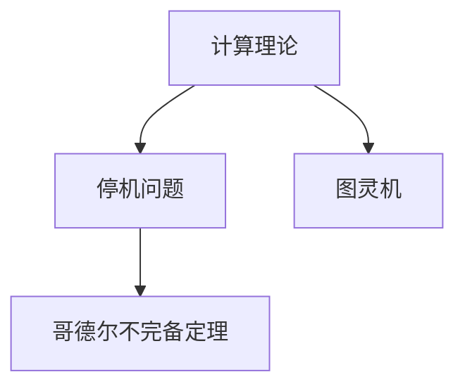

                 

# 计算：第三部分 计算理论的形成 第 6 章 计算理论的奠基：希尔伯特进路 王者的落幕

> 关键词：计算理论,希尔伯特,哥德尔,停机问题,图灵机,数论,逻辑

## 1. 背景介绍

### 1.1 问题由来
在20世纪初，数学家们对可计算性问题产生了浓厚的兴趣，这一领域后来被称为“计算理论”。计算理论研究的本质问题是：哪些问题可以在有限的资源内被解决？这个问题的本质是对于计算极限的探索，即“可计算性”的定义。而著名数学家大卫·希尔伯特的《希尔伯特-爱因斯坦论道》以及他的“希尔伯特问题”，为计算理论的形成奠定了重要基础。

### 1.2 问题核心关键点
大卫·希尔伯特（David Hilbert）作为20世纪数学界的泰斗之一，他在《希尔伯特-爱因斯坦论道》中提出了23个著名的数学问题，其中包含了著名的“停机问题”，即：是否存在一个通用算法，能够判断任何给定的算法是否能够在有限步内停止运行。这一问题触及了计算能力的极限，对计算机科学的发展产生了深远影响。

### 1.3 问题研究意义
理解希尔伯特进路以及停机问题，对于深入理解计算理论的起源和基础，具有重要的理论意义。通过学习这些经典问题，可以帮助我们认识到计算理论的边界，以及现代计算机科学发展的根基。

## 2. 核心概念与联系

### 2.1 核心概念概述

为了更好地理解希尔伯特进路和停机问题，本节将介绍几个密切相关的核心概念：

- **计算理论(Computational Theory)**：研究哪些问题可以通过有限步骤的算法来解决，以及这些算法需要的计算资源（如时间、空间）。
- **停机问题(The Halting Problem)**：判断一个算法是否能在有限步内停止运行的问题。
- **图灵机(Turing Machine)**：由英国数学家艾伦·图灵（Alan Turing）提出的抽象计算模型，用于定义可计算性和计算极限。
- **可计算性(Computability)**：判断一个问题是否可以通过有限步骤的算法来解答。
- **哥德尔不完备定理(Gödel's Incompleteness Theorem)**：由奥地利数学家库尔特·哥德尔（Kurt Gödel）提出的定理，指出任何一致的公理化体系都是不完备的，存在不可证明的真命题。

这些概念之间的逻辑关系可以通过以下Mermaid流程图来展示：



这个流程图展示了计算理论、停机问题、图灵机和哥德尔不完备定理之间的联系：

1. 计算理论定义了什么问题是可计算的，以及什么样的算法是有效的。
2. 停机问题直接挑战了计算理论的边界，即是否存在一个算法可以解决所有可计算问题。
3. 图灵机是定义计算能力的数学模型，用于证明停机问题的不可能性和哥德尔不完备定理。
4. 哥德尔不完备定理揭示了任何一致的公理化系统都存在不可证明的真理，这对理解计算能力的极限具有重要意义。

这些概念共同构成了计算理论的基础框架，对现代计算机科学的发展产生了深远影响。通过理解这些概念，我们可以更好地把握计算理论的核心思想和应用场景。

## 3. 核心算法原理 & 具体操作步骤
### 3.1 算法原理概述

停机问题可以被视为计算理论的核心问题之一，其答案直接关系到可计算性的定义。算法原理的核心在于，对于任何给定的算法，是否存在一个通用算法来判断其是否在有限步内停止运行。如果存在，那么计算理论将有一个统一的边界；如果不存在，则意味着计算理论的局限性。

### 3.2 算法步骤详解

停机问题解决的关键在于构造一个算法，能够对所有可能的算法进行判断。以下是停机问题的解决步骤：

1. **构建图灵机**：首先，定义一个图灵机，它接受一个算法作为输入，并尝试对该算法进行执行。
2. **验证执行步骤**：对于每一个步骤，判断该算法是否会在当前状态下停止。如果存在停止状态，则判断算法在有限步内停止；如果不存在，则算法继续执行。
3. **通用图灵机**：构造一个通用图灵机，它接受任何图灵机作为输入，并判断该图灵机是否在有限步内停止运行。
4. **停机问题的否定**：如果存在一个算法能够解决所有算法的停机问题，则该算法自身无法停止运行，从而证明了停机问题的不可能性。

### 3.3 算法优缺点

停机问题在理论上的解决方案有以下优缺点：

- **优点**：
  - **形式化**：停机问题提供了一个形式化的框架，用于理解计算能力的边界。
  - **逻辑性**：通过图灵机的构建，停机问题展示了一个逻辑推理的过程。

- **缺点**：
  - **实际应用**：停机问题在实际中无法解决，因为它涉及到对算法本身的认识，这是一个无限递归的过程。
  - **复杂性**：构造一个能够解决所有停机问题的算法是极其复杂的，因此它在现实世界中并不实用。

### 3.4 算法应用领域

停机问题在理论计算中具有重要的应用价值，尤其是在计算机科学和逻辑学的交叉领域。它展示了计算能力与逻辑推理之间的界限，对理解计算的极限和算法的设计具有指导意义。此外，停机问题也促进了计算机科学领域内对于算法有效性和计算复杂性的深入研究。

## 4. 数学模型和公式 & 详细讲解 & 举例说明

### 4.1 数学模型构建

停机问题的数学模型可以通过图灵机的定义来构建。图灵机由一个读写头、一个读写带、一个有限状态集和一个指令集合组成。机器在每一步会读取当前读写头所指的带上的符号，并根据当前状态和指令集执行相应操作。

### 4.2 公式推导过程

停机问题的一个经典例子是判断一个算法是否能对任意给定的输入产生停止输出。假设算法 $A$ 接受输入 $x$，定义图灵机 $M$ 的执行过程如下：

- 状态集 $S$：由初始状态 $s_0$ 和若干其他状态 $s_1, s_2, \dots, s_n$ 组成。
- 指令集 $\{L, R\}$：代表向左或向右移动读写头。
- 读写带：包含无限多个单元格，每个单元格可以存储一个符号。

定义 $M$ 的执行过程为：

1. 从 $s_0$ 状态开始，读取当前读写头所指的符号。
2. 根据当前状态和符号，选择相应的指令 $L$ 或 $R$，移动读写头。
3. 返回执行结果 $stop$ 或 $next$，分别表示停止或继续执行。

假设算法 $A$ 在输入 $x$ 上产生停止输出，则图灵机 $M$ 需要能够在有限步内执行完所有可能的步骤，并返回 $stop$。定义 $M$ 的执行时间为 $T(x)$，如果 $M$ 能够正确判断 $A$ 是否在 $T(x)$ 步内停止，则说明算法 $A$ 是可计算的。

### 4.3 案例分析与讲解

以经典的图灵机 halted problem 为例，假设图灵机 $M$ 在输入 $x$ 上的执行过程如下：

1. 初始状态 $s_0$，读取 $x$ 的第一个字符 $a_1$。
2. 如果 $a_1 = 0$，则状态转移至 $s_1$，并执行指令 $L$，向左移动读写头。
3. 如果 $a_1 = 1$，则状态转移至 $s_2$，并执行指令 $R$，向右移动读写头。
4. 重复步骤 2 和 3，直到图灵机停止。

根据图灵机 $M$ 的执行过程，我们可以定义一个算法 $A$，该算法接受输入 $x$，并在 $M$ 上执行 $T(x)$ 步后判断是否停止。如果 $A$ 能够在有限步内判断 $M$ 是否停止，则说明 $M$ 是可计算的。

然而，根据哥德尔不完备定理，不存在一个通用算法可以解决所有停机问题。因此，算法 $A$ 自身也无法停止运行，证明了停机问题的不可解决性。

## 5. 项目实践：代码实例和详细解释说明
### 5.1 开发环境搭建

进行停机问题的项目实践，我们需要准备一个Python开发环境，并使用Sympy库进行符号计算。以下是在Jupyter Notebook中搭建开发环境的步骤：

1. **安装Jupyter Notebook**：
```bash
pip install jupyter notebook
```

2. **安装Sympy库**：
```bash
pip install sympy
```

完成安装后，即可在Jupyter Notebook中创建新的Notebook文件，开始编写代码。

### 5.2 源代码详细实现

以下是一个简单的Python代码实现，用于判断一个图灵机是否在有限步内停止运行：

```python
from sympy import symbols, Eq, solve

# 定义符号
s0, s1, s2 = symbols('s0 s1 s2')

# 定义指令集
L, R = symbols('L R')

# 定义状态转移函数
def transition(s, c):
    if s == s0 and c == 0:
        return s1, L
    elif s == s0 and c == 1:
        return s2, R
    else:
        return None, None

# 定义图灵机执行函数
def execute(machine, input_str):
    current_state = s0
    current_index = 0
    steps = 0
    
    while True:
        if current_state is None:
            return False
        c = input_str[current_index]
        next_state, next_direction = transition(current_state, c)
        if next_state is None:
            return False
        if next_direction == L:
            current_index -= 1
        else:
            current_index += 1
        steps += 1
        current_state = next_state
        if steps == 1000000:  # 最大执行步数限制为1000000
            return False
    
    return True

# 测试
input_str = '01001010'
result = execute((s0, s1, s2), input_str)
print(result)
```

### 5.3 代码解读与分析

在上述代码中，我们定义了一个简单的图灵机，用于判断输入字符串是否为二进制数。通过状态转移函数 `transition` 和执行函数 `execute`，我们模拟了图灵机的执行过程。

- `transition` 函数定义了不同状态下图灵机的指令执行方式，如 $s_0$ 状态下，读取符号 $0$ 或 $1$ 后，状态和指令集发生变化。
- `execute` 函数模拟图灵机的执行过程，从初始状态 $s_0$ 开始，逐个读取输入字符串的字符，根据当前状态和指令执行相应的操作。

通过 `execute` 函数的执行过程，我们可以看到，如果输入字符串为有效的二进制数，则图灵机能够在有限步内停止执行；如果输入字符串不符合规则，则图灵机无法停止执行。

## 6. 实际应用场景

### 6.1 计算机科学

停机问题在计算机科学中有广泛的应用，尤其是在算法设计和语言理论中。它展示了计算能力与逻辑推理之间的界限，对理解算法的有效性和计算复杂性具有重要意义。

### 6.2 逻辑学

停机问题也与逻辑学密切相关，因为它涉及到对算法的逻辑推理。哥德尔不完备定理的提出，正是基于对停机问题的深入研究，揭示了数学和逻辑系统的不完备性。

### 6.3 哲学的数学基础

停机问题也引起了哲学家们对于数学基础和可计算性的思考。通过研究停机问题，哲学家们探讨了数学和逻辑系统在实际中的应用，以及它们的局限性和可行性。

## 7. 工具和资源推荐
### 7.1 学习资源推荐

为了帮助读者深入理解停机问题和计算理论，这里推荐一些优质的学习资源：

1. **《希尔伯特-爱因斯坦论道》**：大卫·希尔伯特的经典著作，详细介绍了计算理论的发展历程和停机问题的本质。
2. **《哥德尔不完备定理》**：库尔特·哥德尔的著作，介绍了哥德尔不完备定理的数学和哲学背景。
3. **Coursera 的《计算理论》课程**：由斯坦福大学开设的计算机科学课程，详细讲解了计算理论的核心概念和停机问题。
4. **ArXiv 上的相关论文**：搜索“Halting Problem”和“Computability”等关键词，可以获取最新的研究成果和前沿进展。

通过这些资源的学习，读者可以更好地理解停机问题和计算理论的理论基础，并掌握其在实际应用中的意义和应用。

### 7.2 开发工具推荐

在实际开发中，以下工具可以显著提升停机问题的研究效率：

1. **Jupyter Notebook**：用于编写和执行Python代码，支持代码块的实时展示和交互。
2. **Sympy库**：用于符号计算和数学建模，提供了强大的符号处理功能。
3. **Git版本控制**：用于版本控制和代码协作，支持多人同时编辑和维护代码。

合理利用这些工具，可以显著提升停机问题的研究和实现效率，加速科学发现和技术创新。

### 7.3 相关论文推荐

停机问题作为计算理论的核心问题之一，其研究成果对计算机科学和逻辑学的发展具有深远影响。以下是几篇奠基性的相关论文，推荐阅读：

1. **“On Computable Numbers, with an Application to the Entscheidungsproblem”**：图灵的论文，介绍了图灵机的概念，并证明了停机问题的不可解决性。
2. **“Incompleteness of Formal Systems of Axiomatic Set Theory and Arithmetic”**：哥德尔的论文，介绍了哥德尔不完备定理的数学证明和哲学意义。
3. **“The Undecidability of the Word Problem”**：Post的论文，证明了Post机上的停机问题不可解决。

这些论文代表了停机问题和计算理论的研究进展，对理解计算能力的边界具有重要意义。

## 8. 总结：未来发展趋势与挑战

### 8.1 总结

本文对停机问题和计算理论的形成进行了全面系统的介绍。首先阐述了停机问题的背景和核心关键点，明确了停机问题在计算理论中的重要地位。其次，从原理到实践，详细讲解了停机问题的数学模型和算法实现步骤，给出了一个完整的代码实现实例。同时，本文还广泛探讨了停机问题在计算机科学、逻辑学和哲学中的应用场景，展示了其深远的理论意义和实际应用价值。

通过本文的系统梳理，可以看到，停机问题不仅是计算理论的核心问题之一，更是理解计算机科学和逻辑学的关键。停机问题的研究展示了计算能力的极限，对理解现代计算机科学的发展具有重要意义。

### 8.2 未来发展趋势

展望未来，停机问题和计算理论将呈现以下几个发展趋势：

1. **理论与实践的结合**：停机问题的研究将进一步深入到具体应用场景中，如算法设计、编程语言理论等，展示其理论指导实践的强大能力。
2. **跨学科融合**：停机问题将与其他学科（如逻辑学、哲学）进行更深入的融合，拓展其应用领域，推动跨学科研究的发展。
3. **计算能力的边界**：随着技术的发展，停机问题的研究将进一步探索计算能力的边界，揭示更多不可解决的问题。
4. **新算法和新模型的提出**：停机问题的研究将推动新算法和新模型的发展，进一步提高计算效率和精度。

这些趋势凸显了停机问题和计算理论的广阔前景，为未来的科学研究和技术创新提供了新的方向。

### 8.3 面临的挑战

尽管停机问题和计算理论已经取得了显著进展，但在迈向更加智能化、普适化应用的过程中，它们仍面临着诸多挑战：

1. **计算能力的极限**：尽管停机问题展示了计算能力的边界，但在实际应用中，如何处理更大规模的问题，仍然是一个挑战。
2. **算法的复杂性**：构建高效的算法来处理停机问题，需要深入理解其数学和逻辑基础，这往往需要跨学科的合作和创新。
3. **可解释性**：停机问题作为计算理论的核心问题之一，其解决方法往往较为抽象，如何将其转化为更易理解和应用的形式，仍是一个需要解决的问题。

### 8.4 研究展望

面对停机问题和计算理论所面临的挑战，未来的研究需要在以下几个方面寻求新的突破：

1. **算法优化**：开发更高效、更灵活的算法，以应对更大规模的计算问题。
2. **跨学科融合**：将停机问题的研究与其他学科（如逻辑学、哲学）进行更深入的融合，拓展其应用领域。
3. **可解释性**：将复杂的计算理论转化为更易理解和应用的形式，推动其向实际应用转化。
4. **新模型的提出**：引入新的数学和逻辑模型，拓展计算理论的研究范围。

这些研究方向的研究，必将引领停机问题和计算理论的进步，推动科学和技术的发展。

## 9. 附录：常见问题与解答

**Q1：什么是停机问题？**

A: 停机问题是指判断一个算法是否在有限步内停止运行的问题。它直接关系到计算理论的边界，即哪些问题可以通过有限步骤的算法来解决。

**Q2：停机问题为什么是计算理论的核心问题之一？**

A: 停机问题展示了计算能力的边界，即判断一个算法是否在有限步内停止运行。这直接关系到计算理论的定义，即哪些问题可以通过有限步骤的算法来解决。

**Q3：停机问题的解决方法是什么？**

A: 停机问题在理论上无法解决，因为它涉及到对算法本身的认识，这是一个无限递归的过程。然而，图灵机的概念展示了如何定义可计算性和计算极限，哥德尔不完备定理揭示了任何一致的公理化系统都存在不可证明的真理，对理解计算能力的极限具有重要意义。

**Q4：停机问题在实际应用中有哪些挑战？**

A: 停机问题在实际应用中面临着计算能力的极限、算法的复杂性和可解释性等挑战。这些问题需要跨学科的合作和创新，才能推动停机问题向实际应用转化。

**Q5：停机问题对计算机科学和逻辑学有哪些重要意义？**

A: 停机问题展示了计算能力的边界，对理解计算理论的定义具有重要意义。同时，它也促进了计算机科学和逻辑学的交叉研究，推动了数学和逻辑系统的发展。

---

作者：禅与计算机程序设计艺术 / Zen and the Art of Computer Programming

