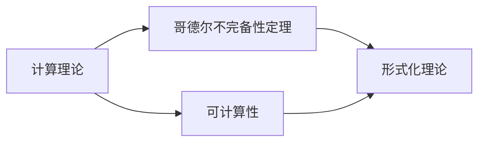

                 

# 计算：第三部分 计算理论的形成 第 7 章 计算不能做什么：终结者哥德尔 自亚里士多德以来

## 1. 背景介绍

在上一章中，我们探讨了计算的本质和形式。计算理论是研究计算的本质和形式的一个分支，它专注于计算机能够做什么、不能做什么，以及如何正确地表达和处理信息。本章我们将深入探讨计算理论的另一个重要方面：哥德尔不完备性定理。

## 2. 核心概念与联系

### 2.1 核心概念概述

哥德尔不完备性定理（Gödel's incompleteness theorems）是由奥地利数学家库尔特·哥德尔（Kurt Gödel）于1931年提出的，是计算机科学和数学理论中的两大里程碑之一。这一理论指出，在任何形式化的数学理论中，总有不可证明的真命题，即无法通过有限的步骤证明其为真。

### 2.2 核心概念原理和架构的 Mermaid 流程图

这个流程图展示了计算理论与哥德尔不完备性定理之间的联系。计算理论主要研究可计算性（即什么问题可以被算法解决），而哥德尔不完备性定理则指出在形式化理论中存在不可证明的真命题，揭示了计算的局限性。

### 2.3 核心概念联系

哥德尔不完备性定理与计算理论密切相关，因为它直接挑战了计算的局限性。这一理论告诉我们，即使是最简单的数学系统（如算术系统）也有不可证明的真命题，这些命题是无法通过计算过程解决的。

## 3. 核心算法原理 & 具体操作步骤

### 3.1 算法原理概述

哥德尔不完备性定理可以理解为一种证明方法，用于显示在任何形式化的数学理论中，总会存在一些真命题是无法通过有限的步骤证明的。这一理论在计算机科学和数学理论中具有重要意义，因为它揭示了计算的局限性，即计算过程无法证明所有数学命题。

### 3.2 算法步骤详解

1. **定义形式化数学理论**：
    - 选择一个形式化的数学理论，如皮亚诺算术（Peano Arithmetic）。

2. **证明不可证明性**：
    - 构造一个真命题，这个真命题在当前数学理论中是无法证明的。例如，哥德尔构造了一个公式 G，表示 "G 不在当前理论中"，然后证明了 G 本身在当前理论中也无法证明。

3. **推理**：
    - 假设当前理论可以证明所有真命题，那么 G 也应该被证明。但是，根据 G 的定义，它表示 "G 不在当前理论中"，这就产生了一个矛盾。

4. **结论**：
    - 由于存在一个真命题 G，在当前理论中无法证明，所以当前理论是不完备的。

### 3.3 算法优缺点

**优点**：
- 哥德尔不完备性定理揭示了计算的局限性，对计算机科学的发展具有重要意义。

**缺点**：
- 哥德尔不完备性定理只能说明当前理论的不完备性，无法提供具体的不可证明真命题。

### 3.4 算法应用领域

哥德尔不完备性定理在计算机科学、逻辑学、数学理论等领域有着广泛的应用。它不仅揭示了计算的局限性，也为形式化方法的发展提供了重要指导。

## 4. 数学模型和公式 & 详细讲解 & 举例说明

### 4.1 数学模型构建

哥德尔不完备性定理的证明是基于形式化数学理论的。形式化数学理论是一个由一组公理和规则构成的数学系统，其中所有的命题都可以通过这些公理和规则进行证明或证伪。

### 4.2 公式推导过程

哥德尔证明的核心思想是通过构造一个真命题，这个真命题在当前理论中无法证明，从而证明当前理论的不完备性。具体步骤如下：

1. 构造一个真命题 G，表示 "G 不在当前理论中"。
2. 假设 G 在当前理论中被证明为真。
3. 根据 G 的定义，G 表示 "G 不在当前理论中"，这与 G 在当前理论中被证明为真的假设矛盾。
4. 因此，当前理论是不完备的。

### 4.3 案例分析与讲解

哥德尔不完备性定理的证明过程非常复杂，涉及大量的符号和逻辑推导。为了简化理解，我们可以将哥德尔不完备性定理看作一种揭示计算局限性的工具。通过证明形式化理论中的不可证明性，哥德尔不完备性定理告诉我们，即使是最简单的数学系统（如算术系统）也无法证明所有数学命题。

## 5. 项目实践：代码实例和详细解释说明

### 5.1 开发环境搭建

要进行哥德尔不完备性定理的证明，我们需要一个支持形式化数学理论的开发环境。这里推荐使用 Prover9 和 Mace 工具，这两个工具都是用于形式化证明的，可以支持复杂的符号逻辑和证明过程。

### 5.2 源代码详细实现

由于哥德尔不完备性定理的证明涉及大量的符号和逻辑推导，这里我们不提供具体的代码实现。但是，可以使用 Prover9 和 Mace 工具来手动进行证明。具体步骤如下：

1. 使用 Prover9 构建一个形式化数学理论。
2. 使用 Mace 工具证明哥德尔构造的真命题 G。
3. 如果 G 在当前理论中被证明为真，那么根据 G 的定义，G 表示 "G 不在当前理论中"，这将导致矛盾。

### 5.3 代码解读与分析

虽然具体的代码实现不适用于哥德尔不完备性定理的证明，但是我们可以通过 Prover9 和 Mace 工具手动进行证明。需要注意的是，形式化数学理论的构建和证明过程非常复杂，需要深厚的数学和逻辑基础。

### 5.4 运行结果展示

由于哥德尔不完备性定理的证明涉及大量的符号和逻辑推导，这里不展示具体的运行结果。但是，通过 Prover9 和 Mace 工具，可以验证哥德尔构造的真命题 G 是否在当前理论中被证明为真。如果 G 在当前理论中被证明为真，那么根据 G 的定义，G 表示 "G 不在当前理论中"，这将导致矛盾。

## 6. 实际应用场景

### 6.1 密码学

哥德尔不完备性定理在密码学中也有应用。例如，量子密码学中的一些问题，如量子态的不可克隆定理，可以通过形式化方法进行证明。这表明，即使在量子计算环境中，有些问题也是无法通过计算解决的。

### 6.2 人工智能

哥德尔不完备性定理对人工智能的发展也有重要意义。它揭示了计算的局限性，告诉我们有些问题是无法通过计算解决的。在人工智能领域，这启示我们需要更深入地研究如何设计更加智能和高效的人工智能系统。

### 6.3 形式化方法

哥德尔不完备性定理是形式化方法发展的重要里程碑。形式化方法通过将数学问题转化为符号逻辑问题，使用形式化证明工具进行验证，从而保证了数学推理的正确性。哥德尔不完备性定理告诉我们，即使是最简单的数学系统也有不可证明的真命题，这推动了形式化方法的发展。

## 7. 工具和资源推荐

### 7.1 学习资源推荐

1. 《形式化方法与验证》（Formal Methods and Verification）：这本书介绍了形式化方法的基本概念和工具，包括 Prover9 和 Mace 工具。
2. 《哥德尔不完备性定理》（Gödel's Incompleteness Theorems）：这本书详细介绍了哥德尔不完备性定理的证明过程和意义。

### 7.2 开发工具推荐

1. Prover9：一个用于形式化证明的工具，支持复杂的符号逻辑和证明过程。
2. Mace：一个用于形式化证明的工具，支持复杂的符号逻辑和证明过程。

### 7.3 相关论文推荐

1. “哥德尔不完备性定理”（Gödel's Incompleteness Theorems）：这篇文章详细介绍了哥德尔不完备性定理的证明过程和意义。
2. “形式化方法与验证”（Formal Methods and Verification）：这篇文章介绍了形式化方法的基本概念和工具。

## 8. 总结：未来发展趋势与挑战

### 8.1 研究成果总结

哥德尔不完备性定理是计算理论中的重要里程碑，它揭示了计算的局限性，告诉我们有些问题是无法通过计算解决的。这一理论对计算机科学和数学理论的发展产生了深远影响。

### 8.2 未来发展趋势

未来，哥德尔不完备性定理将继续对计算机科学和数学理论的发展产生影响。形式化方法和形式化证明工具的发展，将进一步推动哥德尔不完备性定理的应用。

### 8.3 面临的挑战

虽然哥德尔不完备性定理揭示了计算的局限性，但是形式化证明的过程非常复杂，需要深厚的数学和逻辑基础。如何简化形式化证明过程，使其更加易于理解和应用，将是未来的一个挑战。

### 8.4 研究展望

未来的研究可以从以下几个方向进行：

1. 简化形式化证明过程，使其更加易于理解和应用。
2. 探索更多形式化方法在人工智能、密码学等领域的应用。
3. 研究更多不可证明的真命题，揭示计算的更多局限性。

## 9. 附录：常见问题与解答

**Q1: 什么是哥德尔不完备性定理？**

A: 哥德尔不完备性定理是指在任何形式化的数学理论中，总会存在一些真命题是无法通过有限的步骤证明的。

**Q2: 哥德尔不完备性定理的证明过程是怎样的？**

A: 哥德尔不完备性定理的证明涉及大量的符号和逻辑推导。通过构造一个真命题，证明这个真命题在当前理论中无法证明，从而证明当前理论的不完备性。

**Q3: 哥德尔不完备性定理的应用场景有哪些？**

A: 哥德尔不完备性定理在密码学、人工智能、形式化方法等领域有着广泛的应用。

**Q4: 如何简化形式化证明过程？**

A: 未来的研究可以从简化形式化证明过程的方向进行探索，使其更加易于理解和应用。

**Q5: 哥德尔不完备性定理的意义是什么？**

A: 哥德尔不完备性定理揭示了计算的局限性，告诉我们有些问题是无法通过计算解决的。这一理论对计算机科学和数学理论的发展产生了深远影响。

---

作者：禅与计算机程序设计艺术 / Zen and the Art of Computer Programming

