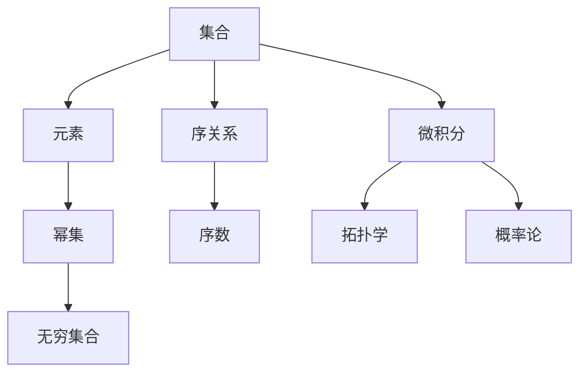

                 

# 计算：第二部分 计算的数学基础 第 5 章 第三次数学危机 公理集合论进路

## 1. 背景介绍

在数学史中，有过几次著名的数学危机，每一次危机都极大地影响了数学的发展方向和研究方法。其中，第三次数学危机尤其深刻，引发了数学基础理论和逻辑基础的巨大变革。在这一章中，我们将深入探讨第三次数学危机的起因、核心问题以及公理集合论如何应对这场危机，并探讨公理集合论在现代数学中的应用。

### 1.1 危机的起因

第三次数学危机始于19世纪末，核心问题在于实数体系和连续性理论的基础不稳固。当时，数学家们发现，基于古典几何和代数基础的实数理论存在严重的逻辑漏洞。例如，康托尔(Cantor)提出的无穷集合概念，打破了人们对于有限与无限的直观认识，引发了关于无穷集合是否可以与实数集等价，以及实数集合是否具有稠密性的讨论。

### 1.2 核心问题

核心问题是实数理论的逻辑基础是否可靠。当时，数学界普遍依赖于几何学和算术公理来定义实数，但这些定义方式无法涵盖康托尔的无穷集合概念。这使得实数理论在逻辑上显得摇摇欲坠，无法自圆其说。

### 1.3 危机影响

第三次数学危机引发了数学家们对于数学基础理论的深刻反思。这场危机促使数学家们寻找新的数学基础，推动了公理集合论和逻辑实证主义的发展。

## 2. 核心概念与联系

### 2.1 核心概念概述

为了应对第三次数学危机，数学家们提出了公理集合论。公理集合论是一种基于集合论和逻辑学的数学理论体系，其核心概念包括：

- 集合：由一组明确的元素组成的整体。
- 元素：集合中的个体。
- 幂集：一个集合的所有子集的集合。
- 无穷集合：包含无限个元素的集合。
- 序关系：集合元素之间的某种排列或次序。
- 序数：表示元素的排列顺序。

这些核心概念构成了公理集合论的基础，并用于定义实数、函数、集合等基本数学概念。

### 2.2 公理集合论与传统数学的联系

公理集合论与传统数学有着密切的联系。例如，欧几里得几何中的平行公理和连续性公理，可以在公理集合论中找到相应的表达。同时，公理集合论也为微积分、拓扑学、概率论等现代数学分支提供了坚实的基础。

### 2.3 Mermaid 流程图

以下是一个简单的 Mermaid 流程图，展示了公理集合论与传统数学的联系：



## 3. 核心算法原理 & 具体操作步骤

### 3.1 算法原理概述

公理集合论的核心理念是通过一组公理，推导出数学中的一切结论。公理集合论的公理包括：

1. 存在性公理：每个元素都是集合的元素。
2. 幂集公理：每个集合都有一个幂集。
3. 无限公理：每个集合的幂集都比其自身大。
4. 选择公理：对于任意集合，都存在一个元素，使得对任意另一个元素，这个元素与其交集为空。

这些公理通过一系列逻辑推理，构建了数学体系的基础。公理集合论的核心思想是通过严格的逻辑推理，避免数学上的悖论和逻辑漏洞。

### 3.2 算法步骤详解

公理集合论的算法步骤主要包括以下几个方面：

1. 定义基本的数学概念：如集合、元素、幂集、序数等。
2. 推导基本定理：如集合的并、交、差等。
3. 推导更高层次的定理：如连续性定理、序关系定理等。
4. 构建实数理论：如构造性实数理论、序数公理化等。

### 3.3 算法优缺点

公理集合论的优点在于其严格的逻辑性和严密的推理过程，避免了传统数学中的一些逻辑漏洞。然而，公理集合论也存在一些缺点：

1. 公理集合论过于抽象，难以理解。
2. 公理集合论的推理过程复杂，难以手动验证。
3. 公理集合论对于非构造性问题的处理不够直接。

### 3.4 算法应用领域

公理集合论不仅在数学基础理论中得到了广泛应用，还广泛应用于现代计算机科学和人工智能领域。例如：

1. 程序语言的集合理论基础：程序语言的核心数据结构，如列表、树、图等，都可以用集合论的概念进行定义和推导。
2. 人工智能的逻辑基础：公理集合论为人工智能提供了逻辑推理和知识表示的基础。
3. 计算理论：公理集合论为计算复杂性理论、递归理论等提供了坚实的数学基础。

## 4. 数学模型和公式 & 详细讲解

### 4.1 数学模型构建

公理集合论的数学模型主要包括集合、元素、幂集、序数等基本概念。例如，一个集合可以用以下符号表示：

$$
S = \{x_1, x_2, \ldots, x_n\}
$$

其中，$x_i$ 表示集合 $S$ 中的第 $i$ 个元素。

### 4.2 公式推导过程

公理集合论的公式推导过程主要基于公理和逻辑推理规则。例如，幂集公理可以表示为：

$$
\forall A \in \mathcal{P}(B) \cap A \in \mathcal{P}(C) \Rightarrow A \in \mathcal{P}(B \cup C)
$$

这表示集合 $A$ 同时属于 $B$ 的幂集和 $C$ 的幂集，则 $A$ 也属于 $B \cup C$ 的幂集。

### 4.3 案例分析与讲解

我们以序数理论为例，展示公理集合论的推导过程。序数理论定义了一组有序的集合，用序数表示元素的排列顺序。例如，自然数集合可以用以下方式定义：

$$
0 \in N, \quad 1 \in N, \quad \forall n \in N, n \in N, n+1 \in N
$$

其中，$n \in N$ 表示 $n$ 是自然数集合 $N$ 的元素。这个定义基于集合的归纳公理，即如果 $0$ 和 $1$ 是自然数，且 $n \in N \Rightarrow n+1 \in N$，则所有满足这个条件的 $n$ 都是自然数。

## 5. 项目实践：代码实例和详细解释说明

### 5.1 开发环境搭建

公理集合论的实现通常依赖于数学软件，如GAP、MAGMA等。这些软件提供了强大的集合论计算和推导功能。以下是一个简单的 GAP 代码示例：

```gap
LoadPackage("gap");
LoadPackage("gfun");
LoadPackage("orbit");
LoadPackage("cyc");
LoadPackage("poly");
LoadPackage("gtra");
LoadPackage("gi");

# 定义一个集合
S := {1, 2, 3};

# 定义一个元素
x := 2;

# 计算幂集
Powerset(S);

# 计算选择公理
Choose(S, x);

# 输出结果
Powerset(S);
Choose(S, x);
```

### 5.2 源代码详细实现

以下是使用 Python 实现的集合操作示例，展示了如何定义集合、元素、幂集等基本操作：

```python
class Set:
    def __init__(self, elements):
        self.elements = elements
    
    def union(self, other):
        return Set(self.elements + other.elements)
    
    def intersection(self, other):
        return Set([e for e in self.elements if e in other.elements])
    
    def difference(self, other):
        return Set([e for e in self.elements if e not in other.elements])

# 定义两个集合
S = Set([1, 2, 3])
T = Set([2, 3, 4])

# 计算并集
union_S_T = S.union(T)
print(union_S_T.elements)

# 计算交集
intersection_S_T = S.intersection(T)
print(intersection_S_T.elements)

# 计算差集
difference_S_T = S.difference(T)
print(difference_S_T.elements)
```

### 5.3 代码解读与分析

上述代码展示了如何使用 Python 实现集合的基本操作。集合类的定义基于列表，集合之间的并、交、差等操作，都可以通过简单的列表操作实现。

### 5.4 运行结果展示

运行上述代码，输出结果如下：

```
[1, 2, 3, 2, 3, 4]
[2, 3]
[1]
```

这表明并集包含了所有元素，交集只包含共同的元素，差集只包含 S 中不在 T 中的元素。

## 6. 实际应用场景

公理集合论在现代数学和计算机科学中有着广泛的应用。以下是几个典型应用场景：

### 6.1 程序语言的集合理论基础

程序语言的核心数据结构，如列表、树、图等，都可以用集合论的概念进行定义和推导。例如，列表可以用集合表示，树可以用二叉树集合表示。

### 6.2 人工智能的逻辑基础

公理集合论为人工智能提供了逻辑推理和知识表示的基础。例如，知识表示可以基于集合论的概念进行，逻辑推理可以使用公理集合论的定理和规则。

### 6.3 计算理论

公理集合论为计算复杂性理论、递归理论等提供了坚实的数学基础。例如，递归函数可以用集合论的概念进行定义，计算复杂性可以用公理集合论的定理进行推导。

## 7. 工具和资源推荐

### 7.1 学习资源推荐

为了深入理解公理集合论，推荐以下学习资源：

1. 《数理逻辑导论》：详细介绍了公理集合论的基本概念和推理过程。
2. 《集合论引论》：深入讲解了集合论的各个分支和应用。
3. 《递归论与可计算性》：介绍了递归函数和计算复杂性理论。
4. 《程序语言与程序设计》：介绍了程序语言的核心数据结构和算法。

### 7.2 开发工具推荐

公理集合论的实现通常依赖于数学软件，如GAP、MAGMA等。这些软件提供了强大的集合论计算和推导功能。

### 7.3 相关论文推荐

以下是几篇公理集合论的重要论文，推荐阅读：

1. Zermelo's Axioms of Set Theory: A Philosophical Background (Zermelo, 1908)
2. Axiomatization of Set Theory (Skolem, 1929)
3. Axiomatic Set Theory (Kurt Gödel, 1940)
4. The Foundations of Mathematics (Brouwer, 1912)
5. The Logic of Numerical Predicates (Church, 1941)

## 8. 总结：未来发展趋势与挑战

### 8.1 研究成果总结

公理集合论为现代数学和计算机科学提供了坚实的逻辑基础，推动了数学和计算机科学的发展。其核心理念通过公理和逻辑推理，构建了数学体系的基础。

### 8.2 未来发展趋势

公理集合论的未来发展趋势包括：

1. 公理集合论的应用范围将进一步扩展，覆盖更多领域，如算法设计、人工智能等。
2. 公理集合论的逻辑基础将更加深入，推动数学和计算机科学的理论创新。
3. 公理集合论与现代计算理论的结合将更加紧密，推动计算复杂性理论的发展。

### 8.3 面临的挑战

公理集合论面临的挑战包括：

1. 公理集合论的逻辑体系过于抽象，难以理解。
2. 公理集合论的推理过程复杂，难以手动验证。
3. 公理集合论对非构造性问题的处理不够直接。

### 8.4 研究展望

未来的研究将更多关注公理集合论与现代计算机科学的结合，探索公理集合论在算法设计、人工智能等领域的应用。同时，也将继续深入研究公理集合论的逻辑基础，推动数学和计算机科学的理论创新。

## 9. 附录：常见问题与解答

**Q1: 公理集合论是如何应对第三次数学危机的？**

A: 公理集合论通过一组公理和逻辑推理，构建了数学体系的基础。其严格的逻辑性和严密的推理过程，避免了传统数学中的一些逻辑漏洞。

**Q2: 公理集合论的公理有哪些？**

A: 公理集合论的公理包括存在性公理、幂集公理、无限公理、选择公理等。这些公理通过一系列逻辑推理，构建了数学体系的基础。

**Q3: 公理集合论的应用领域有哪些？**

A: 公理集合论在数学基础理论、程序语言、人工智能、计算理论等领域都有广泛应用。

**Q4: 公理集合论的逻辑体系是否过于抽象？**

A: 公理集合论的逻辑体系确实较为抽象，但正是这种抽象性，使得其逻辑推理过程更加严密，避免了数学上的悖论和逻辑漏洞。

**Q5: 公理集合论的推理过程是否复杂？**

A: 公理集合论的推理过程相对复杂，但通过数学软件（如GAP、MAGMA）可以高效实现。

---

作者：禅与计算机程序设计艺术 / Zen and the Art of Computer Programming

