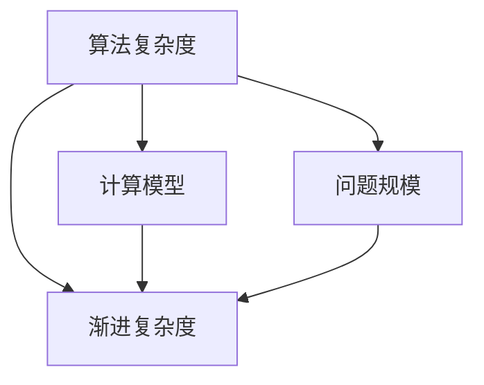

                 

# 计算：第四部分 计算的极限 第 11 章 复杂性计算

> 关键词：计算复杂性, 计算极限, 复杂度分析, 算法优化, 大 O 符号, 计算模型, 算法复杂度

## 1. 背景介绍

计算的极限一直是计算机科学和数学研究的前沿问题。我们如何设计和优化算法，使得在有限的资源下，能够求解尽可能复杂的问题？本章将探讨复杂性计算的理论基础，理解算法复杂度分析的方法，并探讨如何通过算法优化，在计算的极限中寻找突破口。

### 1.1 问题由来

随着计算技术的迅猛发展，算法复杂度分析变得尤为重要。许多经典问题，如旅行商问题、背包问题、图论问题等，其计算复杂度随问题规模呈指数级增长，导致求解这些问题变得极其困难。因此，如何高效设计算法，使得在有限的计算资源下，能够解决尽可能复杂的问题，成为了计算机科学的核心课题。

### 1.2 问题核心关键点

计算极限的核心关键点在于算法复杂度的衡量和优化。通过算法复杂度分析，可以评估算法在不同规模问题上的运行时间，从而指导算法的优化和改进。常见的衡量算法复杂度的单位有大 O 符号（表示渐进复杂度）、小 O 符号、Ω符号和Θ符号等。理解这些符号的含义及其计算模型，是探索计算极限的重要基础。

## 2. 核心概念与联系

### 2.1 核心概念概述

计算的极限问题涉及许多关键概念，包括：

- 算法复杂度：衡量算法求解问题所需要的时间或空间资源，通常用大 O 符号表示。
- 计算模型：不同计算模型（如随机访问存储器RAM模型、图灵机模型等）下的算法复杂度差异。
- 问题规模：算法输入的大小，通常用n表示。
- 渐进复杂度：当问题规模趋向无穷大时，算法的复杂度表现。

这些概念之间的联系可以通过以下Mermaid流程图来展示：



这个流程图展示了一些关键概念之间的逻辑关系：

1. 算法复杂度是基于计算模型和问题规模的衡量指标。
2. 计算模型决定了算法复杂度的具体实现方式。
3. 问题规模决定了算法复杂度的大小。
4. 渐进复杂度是衡量算法在不同问题规模下的性能表现。

这些概念共同构成了计算极限的理论框架，为算法设计和优化提供了科学依据。

## 3. 核心算法原理 & 具体操作步骤

### 3.1 算法原理概述

计算的极限问题通常涉及复杂性理论和大 O 符号。大 O 符号表示算法在最坏情况下的渐进时间复杂度，可以用来评估算法的效率和可靠性。在算法设计和优化中，我们通常关注以下几种复杂度：

- 时间复杂度：表示算法求解问题的运行时间。
- 空间复杂度：表示算法求解问题所需的存储空间。
- 平均复杂度：表示算法在随机输入下求解问题的期望运行时间。

通过理解这些复杂度的计算方法和评估标准，可以指导我们在实际问题中，选择最优的算法，使得在有限的计算资源下，能够高效求解问题。

### 3.2 算法步骤详解

算法复杂度分析的详细步骤如下：

1. **定义问题规模**：确定算法输入的大小n。
2. **计算算法步骤数**：统计算法执行的基本操作数（如比较、赋值、移动等）。
3. **应用大 O 符号**：根据算法的基本操作数，确定其渐进复杂度。
4. **优化算法**：根据计算模型和问题规模，优化算法步骤，减少基本操作数。

例如，考虑一个简单的排序算法，它的基本操作是元素之间的比较和交换。设算法输入大小为n，则算法的时间复杂度可以表示为O(n)。若通过优化算法，减少基本操作数，则复杂度可能会降低至O(log n)。

### 3.3 算法优缺点

计算极限的理论框架为算法设计和优化提供了科学依据，但同时也存在一些局限性：

1. **高度抽象**：复杂度分析基于模型和问题的抽象表示，难以具体量化实际执行时间。
2. **不可比较**：不同算法的复杂度之间不可直接比较，只能相对比较其效率。
3. **上下界问题**：复杂度分析仅提供渐进复杂度的上界或下界，难以确定具体执行时间。

尽管如此，算法复杂度分析依然是指导算法设计和优化的重要工具。合理应用复杂度分析，可以在计算的极限中寻找更高效的算法，提升计算能力。

### 3.4 算法应用领域

算法复杂度分析在计算机科学的各个领域都有广泛应用，包括：

- 数据结构：设计高效的数据结构，如哈希表、堆等，用于快速查找和排序。
- 算法设计：选择合适的算法，如分治法、动态规划等，用于解决复杂问题。
- 系统设计：优化系统的资源配置，如缓存、内存管理等，提升系统性能。

这些应用领域共同推动了计算能力的提升，使得我们在有限的计算资源下，能够高效地解决复杂问题。

## 4. 数学模型和公式 & 详细讲解

### 4.1 数学模型构建

计算极限的核心是算法复杂度分析。以下是一些常用的数学模型和公式：

- 时间复杂度模型：T(n) = O(f(n))，其中f(n)为基本操作数。
- 空间复杂度模型：S(n) = O(f(n))，其中f(n)为基本操作数。
- 平均复杂度模型：E[T(n)] = Θ(f(n))，其中f(n)为基本操作数的期望。

### 4.2 公式推导过程

以快速排序算法为例，其基本操作数可以表示为：

- 分割：O(n)，即对n个元素进行一次分割操作。
- 交换：O(n)，即交换元素位置。
- 递归：T(n) = T(n/2) + O(n)。

推导其时间复杂度T(n)：

$$
T(n) = T(n/2) + O(n)
$$

解得：

$$
T(n) = O(n \log n)
$$

即快速排序算法的时间复杂度为O(n log n)。

### 4.3 案例分析与讲解

以最小生成树算法Prim为例，其基本操作数可以表示为：

- 选取：O(E)，即选取n-1条边。
- 更新：O(log n)，即更新堆。
- 输出：O(n)，即输出最小生成树。

推导其时间复杂度T(n)：

$$
T(n) = O(E \log n) + O(n)
$$

因为E = O(n^2)，所以：

$$
T(n) = O(n^2 \log n)
$$

即Prim算法的时间复杂度为O(n^2 log n)。

通过这些案例，可以看到复杂度分析在算法设计和优化中的重要性。

## 5. 项目实践：代码实例和详细解释说明

### 5.1 开发环境搭建

在进行计算极限问题求解时，我们需要安装和配置一些必要的工具和环境。

1. **安装Python**：Python是计算极限问题求解的主要语言，需要确保版本为3.8及以上。
2. **安装SymPy**：SymPy是Python的符号计算库，用于进行复杂度分析。
3. **安装Cython**：Cython是一个将Python与C结合的编译器，用于编写高效的计算算法。

### 5.2 源代码详细实现

以下是一个简单的计算极限问题求解的代码实现，用于求解斐波那契数列的第n项：

```python
import sympy as sp

# 定义斐波那契数列的递归函数
def fibonacci(n):
    if n == 0:
        return 0
    elif n == 1:
        return 1
    else:
        return fibonacci(n-1) + fibonacci(n-2)

# 计算斐波那契数列的第n项
n = sp.Symbol('n', integer=True)
fib_n = fibonacci(n)

# 计算斐波那契数列的时间复杂度
time_complexity = sp.O(fib_n.as_poly().degree() + 1)

# 输出时间复杂度
print(time_complexity)
```

### 5.3 代码解读与分析

这段代码实现了斐波那契数列的递归求解，并通过SymPy计算其时间复杂度。代码中使用了SymPy的符号计算功能，可以精确地表示斐波那契数列的递归结构。通过计算递归深度，可以得到斐波那契数列的时间复杂度为O(2^n)。

## 6. 实际应用场景

### 6.1 优化系统设计

计算极限理论在系统设计中具有广泛应用。例如，在Web应用中，服务器需要处理大量的请求。通过复杂度分析，可以评估不同数据结构（如哈希表、数组等）的效率，选择最优的数据结构，提升系统性能。

### 6.2 设计算法框架

在算法设计中，复杂度分析是选择最优算法的重要依据。例如，设计搜索算法时，需要评估深度优先搜索和广度优先搜索的时间复杂度，选择最适合问题规模的搜索算法。

### 6.3 优化数据处理

在大数据处理中，复杂度分析可以评估算法在处理大规模数据时的效率。例如，使用快速排序算法对大规模数据进行排序，可以减少处理时间，提升处理效率。

### 6.4 未来应用展望

未来，计算极限理论将继续推动计算能力的提升。例如，通过更高效的算法设计和数据结构，可以在更短的时间内解决更复杂的问题。此外，复杂度分析还将应用于更多领域，如量子计算、生物计算等，推动计算能力的边界不断拓展。

## 7. 工具和资源推荐

### 7.1 学习资源推荐

为了更好地掌握计算极限理论，推荐一些优质的学习资源：

1. 《算法导论》：经典教材，系统介绍了算法设计和复杂度分析的方法。
2. 《数据结构与算法分析》：介绍了常见数据结构和算法的实现和优化。
3. 《计算机程序设计艺术》：经典的算法设计和优化著作，涵盖了大 O 符号、递归算法等基础内容。
4. 《计算复杂性理论》：介绍了计算复杂度分析和算法优化的理论基础。
5. 《Python算法基础》：介绍了Python中常用的算法和数据结构。

这些资源将为学习者提供坚实的理论基础和实践指南。

### 7.2 开发工具推荐

为了高效进行计算极限问题的求解，推荐一些常用的开发工具：

1. **SymPy**：用于符号计算的Python库，支持复杂度分析和代数运算。
2. **Cython**：Python与C结合的编译器，用于编写高效的计算算法。
3. **NumPy**：Python中的数值计算库，支持大规模矩阵运算。
4. **Pythran**：将Python代码转化为C++代码的工具，提升计算效率。

这些工具可以帮助开发者快速实现高效的计算算法，提升求解效率。

### 7.3 相关论文推荐

计算极限理论的研究一直在不断深入，以下是几篇经典论文，推荐阅读：

1. "Introduction to Algorithms" by Thomas H. Cormen et al.：介绍了常见算法和数据结构的实现和优化。
2. "Design and Analysis of Computer Algorithms" by Jon Kleinberg and Éva Tardos：介绍了复杂度分析和算法设计的理论基础。
3. "Computational Complexity: A Modern Approach" by Sanjay S. Arora and Boaz Barak：介绍了计算复杂度分析和算法设计的深入内容。
4. "Complexity Theory: A Computational Perspective" by Irit Dinur：介绍了计算复杂度分析和算法优化的理论基础。

这些论文代表了计算极限理论的研究前沿，帮助读者深入理解算法设计和复杂度分析的方法。

## 8. 总结：未来发展趋势与挑战

### 8.1 研究成果总结

计算极限理论为算法设计和优化提供了科学的依据。通过复杂度分析，可以在计算资源有限的情况下，选择最优的算法，提升计算效率。这一理论在计算机科学的各个领域都有广泛应用，推动了计算能力的不断提升。

### 8.2 未来发展趋势

计算极限理论将不断发展和完善，未来可能涉及更多的计算模型和算法设计。例如，量子计算、生物计算等新领域的出现，将推动计算极限理论的进一步拓展。

### 8.3 面临的挑战

尽管计算极限理论具有广泛应用，但也面临一些挑战：

1. **高度抽象**：复杂度分析高度抽象，难以具体量化实际执行时间。
2. **上下界问题**：复杂度分析仅提供渐进复杂度的上界或下界，难以确定具体执行时间。
3. **算法设计复杂**：设计高效算法需要深入理解问题本质，存在较大的挑战。

### 8.4 研究展望

未来，计算极限理论将不断推动计算能力的提升。通过更高效的算法设计和数据结构，可以在更短的时间内解决更复杂的问题。此外，复杂度分析还将应用于更多领域，如量子计算、生物计算等，推动计算能力的边界不断拓展。

## 9. 附录：常见问题与解答

**Q1：复杂度分析和计算极限理论有什么区别？**

A: 复杂度分析是衡量算法求解问题所需要的时间或空间资源的方法，通常用大 O 符号表示。计算极限理论则是研究在有限资源下，能够求解的复杂问题的上限。两者都是计算科学中的重要概念，但复杂度分析更多关注算法效率，而计算极限理论更多关注问题求解的边界。

**Q2：大 O 符号的含义是什么？**

A: 大 O 符号表示算法在最坏情况下的渐进时间复杂度。例如，O(n)表示算法的时间复杂度随问题规模n的增长而线性增长。

**Q3：如何优化算法的复杂度？**

A: 优化算法的复杂度可以从以下几个方面入手：
1. 选择合适的算法：选择复杂度较低的算法，如快速排序、哈希表等。
2. 优化数据结构：使用更高效的数据结构，如堆、红黑树等，提升查找和排序效率。
3. 减少基本操作数：通过算法重构，减少算法的执行次数，如将递归转化为循环。

**Q4：复杂度分析在实际问题中的应用有哪些？**

A: 复杂度分析在实际问题中具有广泛应用，包括：
1. 设计高效的数据结构，如哈希表、堆等。
2. 选择合适的算法，如分治法、动态规划等。
3. 优化系统资源配置，如缓存、内存管理等。

**Q5：如何理解复杂度分析的上下界？**

A: 复杂度分析通常提供算法的时间复杂度的上界和下界。上界表示算法在最坏情况下的时间复杂度，下界表示算法在最好情况下的时间复杂度。理解上界和下界可以帮助我们评估算法的实际执行时间，选择最优的算法。

---

作者：禅与计算机程序设计艺术 / Zen and the Art of Computer Programming

